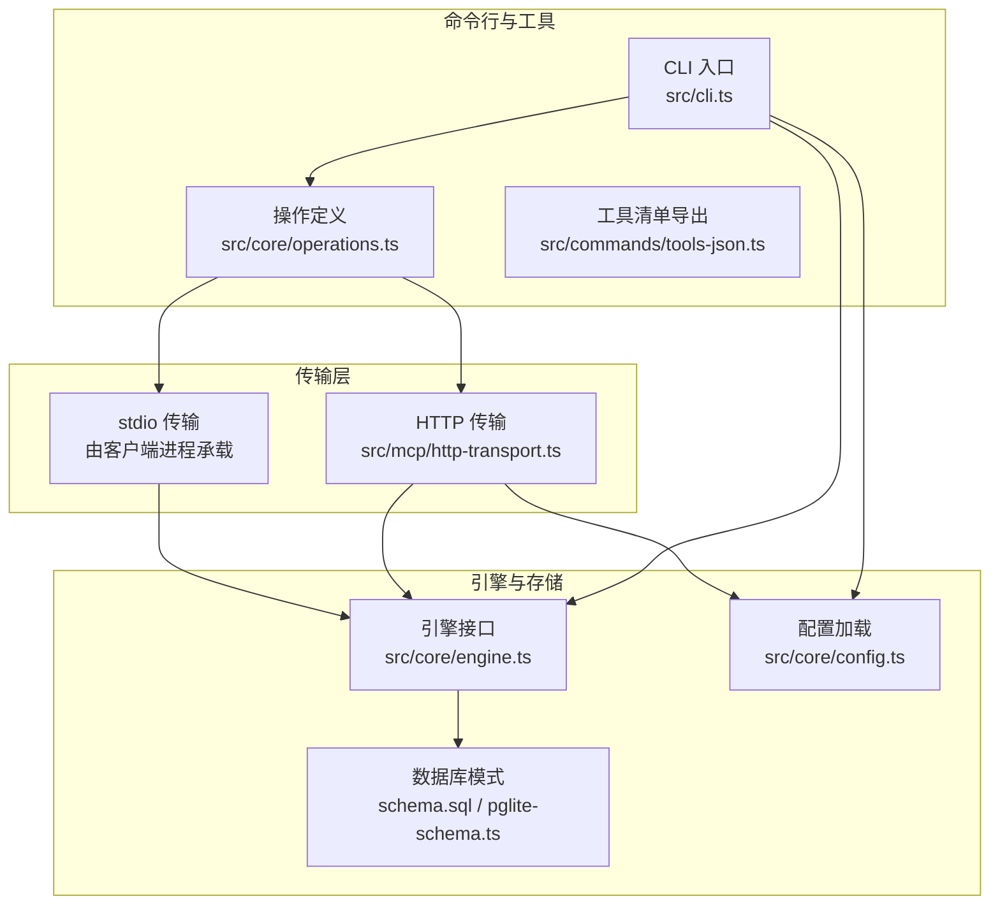
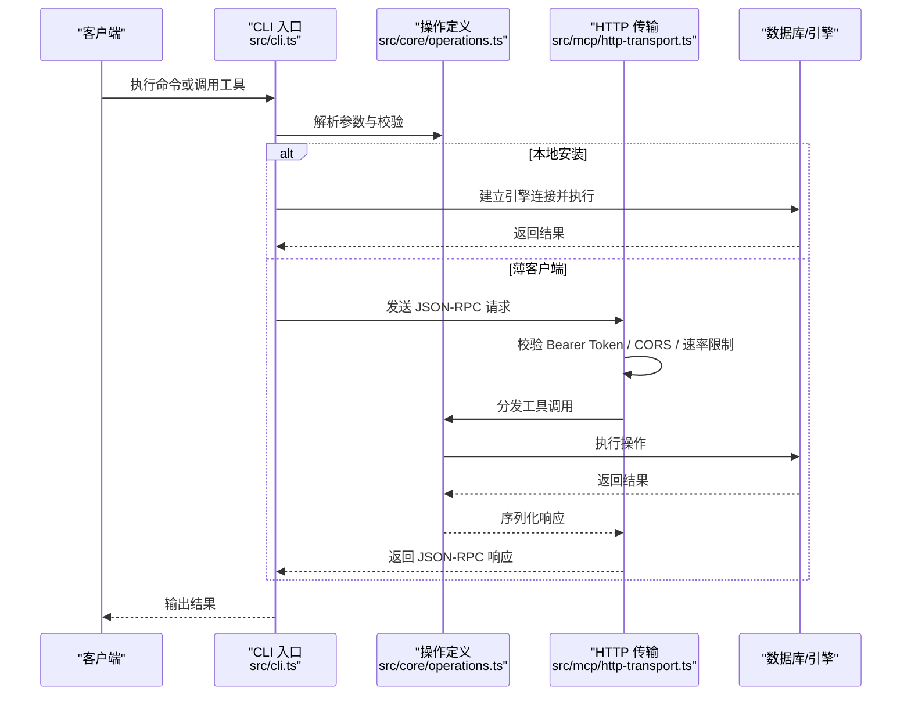
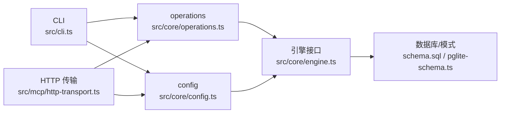

# API参考

<cite>
**本文档引用的文件**
- [README.md](file://README.md)
- [src/cli.ts](file://src/cli.ts)
- [src/core/operations.ts](file://src/core/operations.ts)
- [src/core/config.ts](file://src/core/config.ts)
- [src/version.ts](file://src/version.ts)
- [src/mcp/http-transport.ts](file://src/mcp/http-transport.ts)
- [gbrain.yml](file://gbrain.yml)
- [docs/INSTALL.md](file://docs/INSTALL.md)
- [docs/ENGINES.md](file://docs/ENGINES.md)
- [docs/UPGRADING_DOWNSTREAM_AGENTS.md](file://docs/UPGRADING_DOWNSTREAM_AGENTS.md)
- [docs/guides/skillopt.md](file://docs/guides/skillopt.md)
- [test/parity.test.ts](file://test/parity.test.ts)
- [test/mcp-client.test.ts](file://test/mcp-client.test.ts)
- [test/mcp-client-hardening.test.ts](file://test/mcp-client-hardening.test.ts)
- [test/timeout.test.ts](file://test/timeout.test.ts)
- [test/sync-failures.test.ts](file://test/sync-failures.test.ts)
</cite>

## 目录
1. [简介](#简介)
2. [项目结构](#项目结构)
3. [核心组件](#核心组件)
4. [架构总览](#架构总览)
5. [详细组件分析](#详细组件分析)
6. [依赖关系分析](#依赖关系分析)
7. [性能考量](#性能考量)
8. [故障排查指南](#故障排查指南)
9. [结论](#结论)
10. [附录](#附录)

## 简介
本参考文档面向使用 GBrain 的开发者与集成方，系统性梳理以下内容：
- CLI 命令参考：所有操作、参数与返回值形态
- MCP 工具接口规范：工具定义、参数模式与响应格式
- HTTP API 端点、认证方法与错误码
- 配置参数、环境变量与配置文件
- 数据模型、类型定义与接口契约
- SDK 使用示例、客户端实现指南与集成最佳实践
- API 版本管理、向后兼容性与迁移指南

## 项目结构
GBrain 采用“操作契约优先”的设计：统一的操作定义（operations）同时驱动 CLI、MCP 工具与工具清单导出；HTTP 与 stdio 两种传输层承载 MCP 调用；配置模块负责多源合并与运行时开关。

图表来源
- [src/cli.ts:1-800](file://src/cli.ts#L1-L800)
- [src/core/operations.ts:1-200](file://src/core/operations.ts#L1-L200)
- [src/mcp/http-transport.ts:1-200](file://src/mcp/http-transport.ts#L1-L200)
- [src/core/config.ts:1-200](file://src/core/config.ts#L1-L200)

章节来源
- [README.md:66-129](file://README.md#L66-L129)
- [src/cli.ts:37-48](file://src/cli.ts#L37-L48)
- [src/core/operations.ts:589-624](file://src/core/operations.ts#L589-L624)

## 核心组件
- 操作定义（Operations）：集中声明每个操作的名称、参数、处理函数、作用域与 CLI 提示。CLI 与 MCP 均基于同一套定义生成调用路径与工具清单。
- CLI 入口：解析全局标志、路由到具体操作、在薄客户端模式下通过 MCP 远程调用、统一超时与退出语义。
- HTTP 传输：提供 /health、/mcp 端点，支持 Bearer Token 认证、CORS 白名单、速率限制与请求日志。
- 配置系统：多源合并（环境变量、配置文件、DB 平面），提供运行时开关（如检索反射、自升级等）。
- 引擎接口：抽象不同后端（PGLite/Postgres），为读写操作提供统一入口。

章节来源
- [src/core/operations.ts:589-624](file://src/core/operations.ts#L589-L624)
- [src/cli.ts:200-468](file://src/cli.ts#L200-L468)
- [src/mcp/http-transport.ts:139-420](file://src/mcp/http-transport.ts#L139-L420)
- [src/core/config.ts:28-200](file://src/core/config.ts#L28-L200)

## 架构总览
下图展示从客户端到服务端的关键交互流程，涵盖本地 CLI、薄客户端远程调用与 HTTP 传输。

图表来源
- [src/cli.ts:481-596](file://src/cli.ts#L481-L596)
- [src/mcp/http-transport.ts:188-280](file://src/mcp/http-transport.ts#L188-L280)
- [src/core/operations.ts:589-624](file://src/core/operations.ts#L589-L624)

## 详细组件分析

### CLI 命令参考
- 命令集合：CLI 将 operations 中的可公开操作映射为命令名，并支持别名与位置参数。部分命令为 CLI 专用（不经过操作层）。
- 参数解析：支持布尔开关（含 --no- 前缀）、位置参数与从标准输入读取内容（带大小上限）。
- 超时策略：读操作默认 180 秒，可通过 --timeout=N 覆盖；写与管理类操作无默认上限。
- 错误处理：统一以 OperationError 抛出，包含错误码、建议与文档链接；薄客户端通过 RemoteMcpError 映射远端错误。
- 薄客户端路由：当检测到 thin-client 模式时，非 localOnly 操作经 HTTP 传输转发至远端，保持渲染一致性。

章节来源
- [src/cli.ts:37-48](file://src/cli.ts#L37-L48)
- [src/cli.ts:739-782](file://src/cli.ts#L739-L782)
- [src/cli.ts:389-467](file://src/cli.ts#L389-L467)
- [src/cli.ts:481-596](file://src/cli.ts#L481-L596)

### MCP 工具接口规范
- 工具来源：由 operations 自动生成工具定义，工具名与参数类型来自操作的 name 与 params。
- 输入模式：工具输入为 JSON 对象，键对应参数名，值类型与 operations 中定义一致。
- 输出格式：工具返回值经 JSON 序列化/反序列化以保证渲染一致性；错误以 JSON-RPC envelope 包裹，包含 code 与 message。
- 远端错误映射：薄客户端侧将网络/鉴权/权限不足/解析失败等场景映射为 RemoteMcpError，便于上层提示。

章节来源
- [test/parity.test.ts:73-79](file://test/parity.test.ts#L73-L79)
- [test/mcp-client.test.ts:38-71](file://test/mcp-client.test.ts#L38-L71)
- [test/mcp-client-hardening.test.ts:90-152](file://test/mcp-client-hardening.test.ts#L90-L152)

### HTTP API 规范
- 端点
  - GET /health：健康检查，返回状态、版本与数据库可达性；仅限未认证访问。
  - POST /mcp：JSON-RPC 工具调用入口，要求 Authorization: Bearer <token>。
- 认证
  - Bearer Token：通过 gbrain auth 创建与管理；令牌哈希存储于 access_tokens 表。
  - 来源隔离：旧版令牌支持按来源（source）隔离范围；新版推荐使用 OAuth 传输。
- 授权范围
  - read/write/admin 及 sources_admin/users_admin 等能力范围；写操作需相应 scope。
- 安全加固
  - CORS 默认拒绝，需通过 GBRAIN_HTTP_CORS_ORIGIN 设置白名单。
  - 速率限制：IP 前置限流（防暴力破解）与令牌后置限流（防滥用）。
  - 请求体上限：默认 1MiB，可通过 GBRAIN_HTTP_MAX_BODY_BYTES 调整。
  - 请求日志：每条请求记录 token 名称、操作名、状态与耗时。
- 错误码
  - 通用 JSON-RPC -32000：服务器内部错误。
  - 401/403：认证失败或权限不足。
  - 404：端点不存在（除 /mcp 外）。
  - 405：方法不允许（/mcp 仅允许 POST）。
  - 429：速率限制触发。

章节来源
- [src/mcp/http-transport.ts:259-280](file://src/mcp/http-transport.ts#L259-L280)
- [src/mcp/http-transport.ts:188-280](file://src/mcp/http-transport.ts#L188-L280)
- [src/mcp/http-transport.ts:169-186](file://src/mcp/http-transport.ts#L169-L186)
- [test/mcp-client.test.ts:38-71](file://test/mcp-client.test.ts#L38-L71)

### 配置参数、环境变量与配置文件
- 配置文件
  - gbrain.yml：声明版本控制跟踪与仅数据库持久化的目录集合，用于同步与导出行为。
- 文件平面配置（~/.gbrain/config.json）
  - 引擎选择：engine（postgres/pglite）
  - 数据库连接：database_url 或 database_path
  - AI 网关：embedding_model、embedding_dimensions、chat_model、chat_fallback_chain、provider_base_urls、embedding_columns 等
  - 存储后端：storage（S3/Supabase/本地）
  - 自升级：self_upgrade（mode、静默时段、失败版本列表等）
  - 检索反射：retrieval_reflex 及窗口与指针数量
  - 多模态：embedding_multimodal、embedding_multimodal_model、embedding_image_ocr 等
  - 评估：eval.capture、eval.scrub_pii
  - 自动驾驶：autopilot.nightly_quality_probe、autopilot.auto_drain
- 环境变量
  - GBRAIN_DATABASE_URL / DATABASE_URL：数据库 URL（前者优先）
  - GBRAIN_HTTP_CORS_ORIGIN：HTTP CORS 白名单（逗号分隔）
  - GBRAIN_HTTP_MAX_BODY_BYTES：HTTP 请求体上限字节
  - GBRAIN_HTTP_TRUST_PROXY=1：启用 X-Forwarded-For/X-Real-IP 解析
  - GBRAIN_RETRIEVAL_REFLEX / GBRAIN_RETRIEVAL_REFLEX_*：检索反射相关开关与窗口
  - GBRAIN_SELF_UPGRADE_*：自升级相关环境
  - GBRAIN_AUDIT_DIR：审计日志目录
  - GBRAIN_BULK_*：批量重试策略（最大重试次数、基础等待毫秒、最大等待毫秒）

章节来源
- [gbrain.yml:1-19](file://gbrain.yml#L1-L19)
- [src/core/config.ts:28-200](file://src/core/config.ts#L28-L200)
- [src/mcp/http-transport.ts:46-57](file://src/mcp/http-transport.ts#L46-L57)

### 数据模型、类型定义与接口契约
- 操作契约（Operation）
  - 字段：name、description、params（键为参数名，值含 type 等）、handler、mutating、scope、localOnly、cliHints
  - 参数校验：必填项、类型转换（数字）、位置参数与 stdin 内容读取
- 错误码（ErrorCode）
  - 标准码：page_not_found、invalid_params、embedding_failed、storage_error、bucket_not_found、database_error、permission_denied、rate_limited、extraction_failed、fact_not_found 等
  - 开放联合：支持未来扩展的新错误码
- CLI 结果输出
  - 本地路径：JSON 序列化/反序列化确保渲染一致性
  - 薄客户端：unpackToolResult 后再统一格式化

章节来源
- [src/core/operations.ts:589-624](file://src/core/operations.ts#L589-L624)
- [src/core/operations.ts:60-94](file://src/core/operations.ts#L60-L94)
- [src/cli.ts:445-447](file://src/cli.ts#L445-L447)

### SDK 使用示例与客户端实现指南
- 本地 CLI
  - 初始化与健康检查：gbrain init --pglite、gbrain doctor
  - 导入与查询：gbrain import ~/notes/、gbrain query "<问题>"
  - MCP 连接：gbrain connect https://host/mcp --token <token> --install
- HTTP 传输
  - 启动：gbrain serve --http
  - 认证：Authorization: Bearer <token>
  - CORS：设置 GBRAIN_HTTP_CORS_ORIGIN
  - 速率限制：默认每 IP 30 次/分钟，每令牌 60 次/分钟
- 客户端实现要点
  - 使用 tools-json 导出工具清单，按 JSON-RPC 2.0 调用 /mcp
  - 正确处理 RemoteMcpError 的原因分类（config/discovery/auth/network/tool_error/parse）
  - 实现超时与中断（SIGINT 映射为 network/aborted）

章节来源
- [README.md:66-152](file://README.md#L66-L152)
- [src/cli.ts:481-596](file://src/cli.ts#L481-L596)
- [src/mcp/http-transport.ts:188-280](file://src/mcp/http-transport.ts#L188-L280)

### 集成最佳实践
- 选择传输方式
  - 本地开发：stdio（Claude Code/Cursor/Windsurf）
  - 团队/远程：HTTP（Bearer Token 或 OAuth，推荐后者）
- 权限与来源隔离
  - 使用 OAuth 注册客户端，授予最小必要 scope（read/write/admin）
  - 旧版 Bearer Token 仅支持按来源隔离，建议迁移到 OAuth
- 稳定性与可观测性
  - 启用 mcp_request_log，结合审计目录定位问题
  - 使用 /health 作为探活端点，避免在 DB 故障时误判
  - 合理设置 CORS 白名单，避免泄露 API 表面

章节来源
- [src/mcp/http-transport.ts:139-186](file://src/mcp/http-transport.ts#L139-L186)
- [test/mcp-client.test.ts:38-71](file://test/mcp-client.test.ts#L38-L71)

## 依赖关系分析
- 组件耦合
  - CLI 依赖 operations 与 config；对 thin-client 场景依赖 mcp-client
  - HTTP 传输依赖 operations 与 config；对引擎与 SQL 查询进行适配
- 关键依赖链
  - CLI → operations → handler → engine → DB
  - HTTP → operations → handler → engine → DB
- 循环依赖
  - 配置模块避免循环导入（storage 以未知类型延迟验证）

图表来源
- [src/cli.ts:200-468](file://src/cli.ts#L200-L468)
- [src/mcp/http-transport.ts:139-186](file://src/mcp/http-transport.ts#L139-L186)
- [src/core/operations.ts:589-624](file://src/core/operations.ts#L589-L624)
- [src/core/config.ts:28-200](file://src/core/config.ts#L28-L200)

## 性能考量
- 读操作默认 180 秒上限，写与管理类操作无默认上限，可通过 --timeout 覆盖
- 批量写入具备自适应重试策略（针对池化连接抖动），可通过环境变量调节
- 检索反射与多模态嵌入等特性为性能与成本引入额外权衡，建议按需开启

章节来源
- [src/cli.ts:389-403](file://src/cli.ts#L389-L403)
- [src/core/config.ts:130-143](file://src/core/config.ts#L130-L143)

## 故障排查指南
- 常见错误与修复
  - 嵌入维度不匹配：运行 gbrain doctor 获取修复建议
  - 同步超时：采用 per-source 循环 + 超时保护的模式
  - 连接断开：批量重试层具备自动重连回调
- 错误码分类
  - 同步阶段：EMBEDDING_OVERSIZE、FILE_TOO_LARGE、STATEMENT_TIMEOUT 等
  - MCP 远端：config、discovery、auth、auth_after_refresh、network、tool_error、parse
- 超时与中断
  - 读操作默认 180 秒；可通过 --timeout 覆盖
  - SIGINT 映射为 network/aborted，返回码 130

章节来源
- [README.md:290-410](file://README.md#L290-L410)
- [test/sync-failures.test.ts:577-603](file://test/sync-failures.test.ts#L577-L603)
- [test/mcp-client-hardening.test.ts:90-152](file://test/mcp-client-hardening.test.ts#L90-L152)
- [test/timeout.test.ts:59-83](file://test/timeout.test.ts#L59-L83)

## 结论
本参考文档基于“操作契约优先”的设计，统一了 CLI、MCP 与 HTTP 传输的接口形态；通过严格的参数校验、错误码与超时机制保障稳定性；借助配置与环境变量实现灵活部署。建议在生产中优先采用 OAuth 传输与最小权限 scope，配合 CORS 白名单与速率限制，确保安全与可维护性。

## 附录

### 版本管理、向后兼容与迁移
- 版本号来源：package.json 中的版本字段
- 向后兼容
  - 操作错误码采用开放联合，新增错误码不会破坏现有消费端
  - CLI 与 MCP 工具清单由 operations 自动生成，保持契约一致
- 迁移指南
  - 从旧版 Bearer Token 迁移至 OAuth 传输
  - 使用 gbrain onboard 与 jobs 提交类型统一任务
  - 参考升级下游代理的流程与注意事项

章节来源
- [src/version.ts:1-3](file://src/version.ts#L1-L3)
- [src/core/operations.ts:60-94](file://src/core/operations.ts#L60-L94)
- [docs/UPGRADING_DOWNSTREAM_AGENTS.md](file://docs/UPGRADING_DOWNSTREAM_AGENTS.md)
- [README.md:226-236](file://README.md#L226-L236)