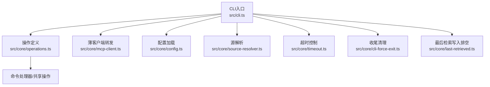
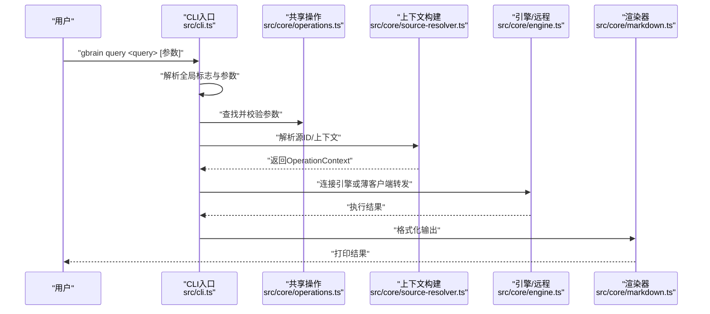
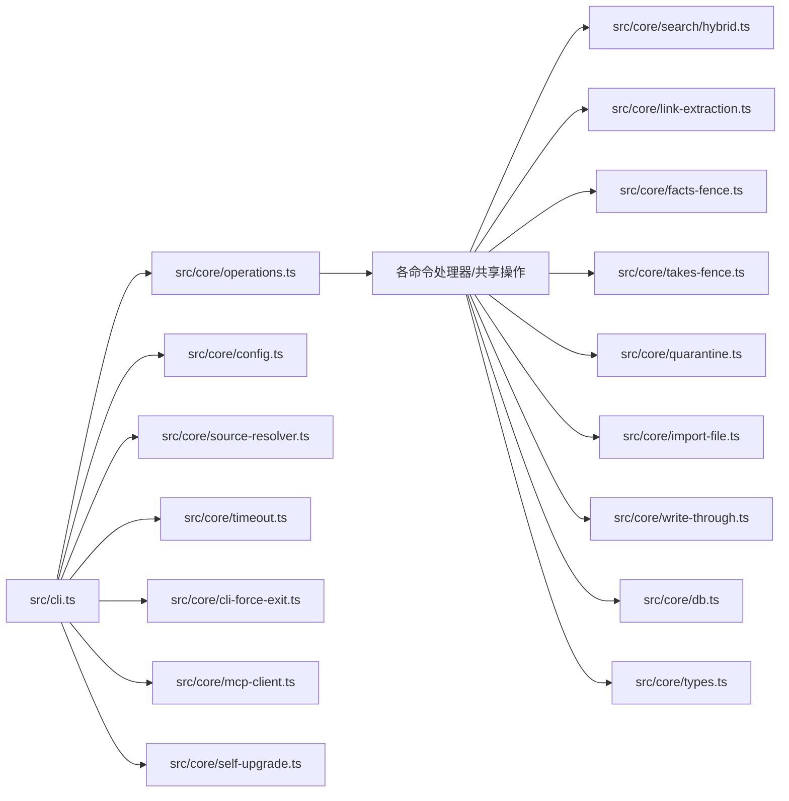

# CLI命令参考

<cite>
**本文档引用的文件**
- [src/cli.ts](file://src/cli.ts)
- [src/core/operations.ts](file://src/core/operations.ts)
- [src/core/cli-options.ts](file://src/core/cli-options.ts)
- [src/core/engine.ts](file://src/core/engine.ts)
- [src/core/config.ts](file://src/core/config.ts)
- [src/core/self-upgrade.ts](file://src/core/self-upgrade.ts)
- [src/core/process-cleanup.ts](file://src/core/process-cleanup.ts)
- [src/core/zombie-reap.ts](file://src/core/zombie-reap.ts)
- [src/core/timeout.ts](file://src/core/timeout.ts)
- [src/core/cli-force-exit.ts](file://src/core/cli-force-exit.ts)
- [src/core/mcp-client.ts](file://src/core/mcp-client.ts)
- [src/core/thin-client-upgrade-prompt.ts](file://src/core/thin-client-upgrade-prompt.ts)
- [src/version.ts](file://src/version.ts)
- [src/core/scope.ts](file://src/core/scope.ts)
- [src/core/operations-descriptions.ts](file://src/core/operations-descriptions.ts)
- [src/core/source-resolver.ts](file://src/core/source-resolver.ts)
- [src/core/link-extraction.ts](file://src/core/link-extraction.ts)
- [src/core/facts-fence.ts](file://src/core/facts-fence.ts)
- [src/core/takes-fence.ts](file://src/core/takes-fence.ts)
- [src/core/quarantine.ts](file://src/core/quarantine.ts)
- [src/core/last-retrieved.ts](file://src/core/last-retrieved.ts)
- [src/core/search/hybrid.ts](file://src/core/search/hybrid.ts)
- [src/core/search/mode.ts](file://src/core/search/mode.ts)
- [src/core/search/expansion.ts](file://src/core/search/expansion.ts)
- [src/core/search/dedup.ts](file://src/core/search/dedup.ts)
- [src/core/minions/queue.ts](file://src/core/minions/queue.ts)
- [src/core/import-file.ts](file://src/core/import-file.ts)
- [src/core/write-through.ts](file://src/core/write-through.ts)
- [src/core/db.ts](file://src/core/db.ts)
- [src/core/types.ts](file://src/core/types.ts)
- [src/core/markdown.ts](file://src/core/markdown.ts)
- [src/core/context/volunteer.ts](file://src/core/context/volunteer.ts)
- [src/core/ai/types.ts](file://src/core/ai/types.ts)
- [src/core/schema.sql](file://src/core/schema.sql)
- [src/core/eval-capture.ts](file://src/core/eval-capture.ts)
- [src/core/cjk.ts](file://src/core/cjk.ts)
- [src/core/pglite-engine.ts](file://src/core/pglite-engine.ts)
- [src/core/retrieval-upgrade-planner.ts](file://src/core/retrieval-upgrade-planner.ts)
- [src/core/skillopt/help.ts](file://src/core/skillopt/help.ts)
- [src/commands/tools-json.ts](file://src/commands/tools-json.ts)
- [src/commands/search.ts](file://src/commands/search.ts)
- [src/commands/search-diagnose.ts](file://src/commands/search-diagnose.ts)
- [src/commands/sources-harden.ts](file://src/commands/sources-harden.ts)
- [src/commands/capture.ts](file://src/commands/capture.ts)
- [src/commands/frontmatter.ts](file://src/commands/frontmatter.ts)
- [src/commands/models.ts](file://src/commands/models.ts)
- [src/commands/cache.ts](file://src/commands/cache.ts)
- [src/commands/brainstorm.ts](file://src/commands/brainstorm.ts)
- [src/commands/lsd.ts](file://src/commands/lsd.ts)
- [src/commands/skillopt.ts](file://src/commands/skillopt.ts)
- [src/commands/capture.ts](file://src/commands/capture.ts)
- [src/commands/connect.ts](file://src/commands/connect.ts)
- [src/commands/self-upgrade.ts](file://src/commands/self-upgrade.ts)
- [src/commands/watch.ts](file://src/commands/watch.ts)
- [src/commands/extract-conversation-facts.ts](file://src/commands/extract-conversation-facts.ts)
- [src/commands/enrich.ts](file://src/commands/enrich.ts)
- [src/commands/check-resolvable.ts](file://src/commands/check-resolvable.ts)
- [src/commands/routing-eval.ts](file://src/commands/routing-eval.ts)
- [src/commands/skillify.ts](file://src/commands/skillify.ts)
- [src/commands/smoke-test.ts](file://src/commands/smoke-test.ts)
- [src/commands/providers.ts](file://src/commands/providers.ts)
- [src/commands/storage.ts](file://src/commands/storage.ts)
- [src/commands/repos.ts](file://src/commands/repos.ts)
- [src/commands/code-def.ts](file://src/commands/code-def.ts)
- [src/commands/code-refs.ts](file://src/commands/code-refs.ts)
- [src/commands/reindex.ts](file://src/commands/reindex.ts)
- [src/commands/reindex-code.ts](file://src/commands/reindex-code.ts)
- [src/commands/reindex-frontmatter.ts](file://src/commands/reindex-frontmatter.ts)
- [src/commands/code-callers.ts](file://src/commands/code-callers.ts)
- [src/commands/code-callees.ts](file://src/commands/code-callees.ts)
- [src/commands/auth.ts](file://src/commands/auth.ts)
- [src/commands/friction.ts](file://src/commands/friction.ts)
- [src/commands/claw-test.ts](file://src/commands/claw-test.ts)
- [src/commands/book-mirror.ts](file://src/commands/book-mirror.ts)
- [src/commands/takes.ts](file://src/commands/takes.ts)
- [src/commands/think.ts](file://src/commands/think.ts)
- [src/commands/salience.ts](file://src/commands/salience.ts)
- [src/commands/anomalies.ts](file://src/commands/anomalies.ts)
- [src/commands/transcripts.ts](file://src/commands/transcripts.ts)
- [src/commands/remote.ts](file://src/commands/remote.ts)
- [src/commands/recall.ts](file://src/commands/recall.ts)
- [src/commands/forget.ts](file://src/commands/forget.ts)
- [src/commands/edges-backfill.ts](file://src/commands/edges-backfill.ts)
- [src/commands/ze-switch.ts](file://src/commands/ze-switch.ts)
- [src/commands/founders.ts](file://src/commands/founders.ts)
- [src/commands/schema.ts](file://src/commands/schema.ts)
- [src/commands/onboard.ts](file://src/commands/onboard.ts)
- [src/commands/conversation-parser.ts](file://src/commands/conversation-parser.ts)
- [src/commands/status.ts](file://src/commands/status.ts)
- [src/commands/sync.ts](file://src/commands/sync.ts)
- [src/commands/extract.ts](file://src/commands/extract.ts)
- [src/commands/enrich.ts](file://src/commands/enrich.ts)
- [src/commands/features.ts](file://src/commands/features.ts)
- [src/commands/autopilot.ts](file://src/commands/autopilot.ts)
- [src/commands/graph-query.ts](file://src/commands/graph-query.ts)
- [src/commands/jobs.ts](file://src/commands/jobs.ts)
- [src/commands/agent.ts](file://src/commands/agent.ts)
- [src/commands/apply-migrations.ts](file://src/commands/apply-migrations.ts)
- [src/commands/skillpack-check.ts](file://src/commands/skillpack-check.ts)
- [src/commands/skillpack.ts](file://src/commands/skillpack.ts)
- [src/commands/resolvers.ts](file://src/commands/resolvers.ts)
- [src/commands/integrity.ts](file://src/commands/integrity.ts)
- [src/commands/repair-jsonb.ts](file://src/commands/repair-jsonb.ts)
- [src/commands/orphans.ts](file://src/commands/orphans.ts)
- [src/commands/sources.ts](file://src/commands/sources.ts)
- [src/commands/mounts.ts](file://src/commands/mounts.ts)
- [src/commands/dream.ts](file://src/commands/dream.ts)
- [src/commands/check-backlinks.ts](file://src/commands/check-backlinks.ts)
- [src/commands/lint.ts](file://src/commands/lint.ts)
- [src/commands/report.ts](file://src/commands/report.ts)
- [src/commands/import.ts](file://src/commands/import.ts)
- [src/commands/export.ts](file://src/commands/export.ts)
- [src/commands/files.ts](file://src/commands/files.ts)
- [src/commands/embed.ts](file://src/commands/embed.ts)
- [src/commands/serve.ts](file://src/commands/serve.ts)
- [src/commands/call.ts](file://src/commands/call.ts)
- [src/commands/config.ts](file://src/commands/config.ts)
- [src/commands/doctor.ts](file://src/commands/doctor.ts)
- [src/commands/migrate.ts](file://src/commands/migrate.ts)
- [src/commands/eval.ts](file://src/commands/eval.ts)
- [src/commands/extract.ts](file://src/commands/extract.ts)
- [src/commands/extract-conversation-facts.ts](file://src/commands/extract-conversation-facts.ts)
- [src/commands/enrich.ts](file://src/commands/enrich.ts)
- [src/commands/features.ts](file://src/commands/features.ts)
- [src/commands/autopilot.ts](file://src/commands/autopilot.ts)
- [src/commands/graph-query.ts](file://src/commands/graph-query.ts)
- [src/commands/jobs.ts](file://src/commands/jobs.ts)
- [src/commands/agent.ts](file://src/commands/agent.ts)
- [src/commands/apply-migrations.ts](file://src/commands/apply-migrations.ts)
- [src/commands/skillpack-check.ts](file://src/commands/skillpack-check.ts)
- [src/commands/skillpack.ts](file://src/commands/skillpack.ts)
- [src/commands/resolvers.ts](file://src/commands/resolvers.ts)
- [src/commands/integrity.ts](file://src/commands/integrity.ts)
- [src/commands/repair-jsonb.ts](file://src/commands/repair-jsonb.ts)
- [src/commands/orphans.ts](file://src/commands/orphans.ts)
- [src/commands/sources.ts](file://src/commands/sources.ts)
- [src/commands/mounts.ts](file://src/commands/mounts.ts)
- [src/commands/dream.ts](file://src/commands/dream.ts)
- [src/commands/check-backlinks.ts](file://src/commands/check-backlinks.ts)
- [src/commands/lint.ts](file://src/commands/lint.ts)
- [src/commands/report.ts](file://src/commands/report.ts)
- [src/commands/import.ts](file://src/commands/import.ts)
- [src/commands/export.ts](file://src/commands/export.ts)
- [src/commands/files.ts](file://src/commands/files.ts)
- [src/commands/embed.ts](file://src/commands/embed.ts)
- [src/commands/serve.ts](file://src/commands/serve.ts)
- [src/commands/call.ts](file://src/commands/call.ts)
- [src/commands/config.ts](file://src/commands/config.ts)
- [src/commands/doctor.ts](file://src/commands/doctor.ts)
- [src/commands/migrate.ts](file://src/commands/migrate.ts)
- [src/commands/eval.ts](file://src/commands/eval.ts)
</cite>

## 目录
1. [简介](#简介)
2. [项目结构](#项目结构)
3. [核心组件](#核心组件)
4. [架构总览](#架构总览)
5. [详细组件分析](#详细组件分析)
6. [依赖关系分析](#依赖关系分析)
7. [性能考虑](#性能考虑)
8. [故障排除指南](#故障排除指南)
9. [结论](#结论)
10. [附录](#附录)

## 简介
本参考文档面向使用 GBrain CLI 的工程师与高级用户，系统性梳理命令体系、参数与选项、执行上下文、权限要求、输出格式、错误处理与调试选项，并提供常见工作流与最佳实践。GBrain CLI 基于“操作（Operation）”契约驱动，统一支持本地引擎与远程薄客户端模式，覆盖检索、页面管理、同步、作业调度、技能与技能包、代码智能、模式与架构、诊断与维护等全栈能力。

## 项目结构
- 入口与分发：CLI 主入口负责解析全局标志、路由到具体命令或共享操作、处理薄客户端转发、设置超时与收尾清理。
- 操作定义：所有命令均以“操作”形式在统一契约中声明，包含参数类型、必填项、作用域与 CLI 提示。
- 命令实现：CLI 仅负责分发；具体业务逻辑由各命令模块或共享操作处理器实现。
- 配置与环境：通过配置加载、源解析、信号处理、自升级检查与提示等机制支撑运行期行为。

图表来源
- [src/cli.ts:200-468](file://src/cli.ts#L200-L468)
- [src/core/operations.ts:588-619](file://src/core/operations.ts#L588-L619)
- [src/core/mcp-client.ts](file://src/core/mcp-client.ts)
- [src/core/config.ts](file://src/core/config.ts)
- [src/core/source-resolver.ts](file://src/core/source-resolver.ts)
- [src/core/timeout.ts](file://src/core/timeout.ts)
- [src/core/cli-force-exit.ts](file://src/core/cli-force-exit.ts)
- [src/core/last-retrieved.ts:72-80](file://src/core/last-retrieved.ts#L72-L80)

章节来源
- [src/cli.ts:1-2367](file://src/cli.ts#L1-L2367)
- [src/core/operations.ts:5021-5108](file://src/core/operations.ts#L5021-L5108)

## 核心组件
- 操作注册与别名
  - CLI 将带有 CLI 提示且非隐藏的操作注册为可用命令；同时建立别名映射，冲突在启动时抛出。
  - 别名不重复出现在自动生成的帮助列表中，避免歧义。
- 全局标志
  - 支持静默、进度 JSON、超时、版本、工具清单导出等通用选项。
- 薄客户端路由
  - 在薄客户端模式下，非本地专用操作通过 MCP 远程调用，具备独立身份横幅与错误映射。
- 更新提示与自升级
  - 启动时后台检查更新缓存，必要时异步刷新；对刚升级实例给出一次性确认提示。
- 上下文构建
  - 解析源标识、注入引擎与作业上下文，确保读取类操作具备统一的超时边界。
- 输出与渲染
  - 统一 JSON 序列化/反序列化以保证本地与远程渲染形状一致；支持 Markdown 渲染。

章节来源
- [src/cli.ts:37-116](file://src/cli.ts#L37-L116)
- [src/cli.ts:200-230](file://src/cli.ts#L200-L230)
- [src/cli.ts:481-596](file://src/cli.ts#L481-L596)
- [src/cli.ts:739-782](file://src/cli.ts#L739-L782)
- [src/core/self-upgrade.ts](file://src/core/self-upgrade.ts)
- [src/core/mcp-client.ts](file://src/core/mcp-client.ts)
- [src/core/markdown.ts](file://src/core/markdown.ts)

## 架构总览
下面的序列图展示一次典型查询命令从入口到结果输出的关键路径，涵盖参数解析、图像转换、上下文构建、超时控制与渲染。

图表来源
- [src/cli.ts:312-468](file://src/cli.ts#L312-L468)
- [src/core/operations.ts:588-619](file://src/core/operations.ts#L588-L619)
- [src/core/source-resolver.ts](file://src/core/source-resolver.ts)
- [src/core/engine.ts](file://src/core/engine.ts)
- [src/core/markdown.ts](file://src/core/markdown.ts)

## 详细组件分析

### 命令分类与覆盖范围
- 检索与问答
  - query、search、search_by_image、graph-query、reindex、reindex-code、reindex-frontmatter
- 页面与内容
  - get_page、put_page、delete_page、list_pages、restore_page、purge_deleted_pages、put_raw_data、get_raw_data
- 标签与链接
  - add_tag、remove_tag、get_tags、add_link、remove_link、get_links、get_backlinks、list_link_sources、traverse_graph
- 时间线与事实
  - add_timeline_entry、get_timeline、volunteer_context、extract_facts、recall、forget_fact
- 专家与轨迹
  - find_experts、find_trajectory、advisor
- 作业与代理
  - submit_job、get_job、list_jobs、cancel_job、retry_job、get_job_progress、pause_job、resume_job、replay_job、send_job_message、submit_agent
- 文件与数据
  - file_list、file_upload、file_url、import、export、files、embed、storage
- 源与挂载
  - sources、mounts、connect、repos、sync、extract、extract-conversation-facts、enrich
- 技能与技能包
  - skillpack、skillpack-check、skillify、resolvers、providers、onboard
- 诊断与维护
  - doctor、integrity、repair-jsonb、orphans、status、check-backlinks、lint、report、migrate、apply-migrations、self-upgrade
- 开发与工具
  - code-def、code-refs、code-callers、code-callees、frontmatter、auth、friction、claw-test、book-mirror、takes、think、salience、anomalies、transcripts、models、remote、recall、forget、edges-backfill、cache、ze-switch、founder、brainstorm、lsd、schema、capture、conversation-parser、jobs、agent、autopilot、graph-query、providers、storage、repos、code-def、code-refs、reindex、reindex-code、reindex-frontmatter、code-callers、code-callees、frontmatter、auth、friction、claw-test、book-mirror、takes、think、salience、anomalies、transcripts、models、remote、recall、forget、edges-backfill、cache、ze-switch、founder、brainstorm、lsd、schema、capture、onboard、conversation-parser、status、connect、skillopt、quarantine、self-upgrade、advisor、watch

章节来源
- [src/core/operations.ts:5021-5108](file://src/core/operations.ts#L5021-L5108)
- [src/cli.ts:46-97](file://src/cli.ts#L46-L97)

### 参数解析与帮助系统
- 参数解析规则
  - 支持布尔开关（含 --no- 前缀）、键值对、位置参数与标准输入注入。
  - 对数字类型进行显式转换；布尔类型仅接受开关语义。
  - 当操作声明了 stdin 参数且标准输入非 TTY 时，自动读取最多 5MB 内容。
- 帮助系统
  - 支持 --help/-h；部分 CLI-only 命令自带详细帮助文本。
  - 别名命令会显示正确的调用名称而非内部操作名。
- 全局标志
  - --quiet、--progress-json、--progress-interval、--timeout=N、--version、--tools-json 等。

章节来源
- [src/cli.ts:739-782](file://src/cli.ts#L739-L782)
- [src/cli.ts:471-479](file://src/cli.ts#L471-L479)
- [src/cli.ts:200-224](file://src/cli.ts#L200-L224)

### 执行上下文与权限模型
- 权限作用域
  - read、write、admin、sources_admin、users_admin；本地 CLI 调用绕过 OAuth 作用域检查。
- 源解析
  - 通过多级解析链确定当前源，支持 --source、环境变量、配置文件与路径匹配。
- 作业与子代理上下文
  - 可注入 jobId、subagentId 等上下文信息，便于追踪与审计。

章节来源
- [src/core/operations.ts:605-606](file://src/core/operations.ts#L605-L606)
- [src/core/scope.ts](file://src/core/scope.ts)
- [src/core/source-resolver.ts](file://src/core/source-resolver.ts)

### 薄客户端与远程转发
- 身份横幅
  - 在每次远程调用前打印薄客户端到主机的身份信息，包含页数、块数与版本。
- 错误映射
  - 对配置、发现、认证、网络、工具错误与解析失败进行细化提示。
- 超时策略
  - think 默认 180 秒，其他操作默认 30 秒；可通过 --timeout 覆盖。

章节来源
- [src/cli.ts:481-596](file://src/cli.ts#L481-L596)
- [src/core/mcp-client.ts](file://src/core/mcp-client.ts)

### 超时与收尾
- 读取类操作默认 180 秒墙钟超时；可通过 --timeout 覆盖。
- 上下文构建、操作执行与渲染均受统一超时保护。
- 收尾阶段进行背景任务排空与引擎断开，确保一致性。

章节来源
- [src/cli.ts:389-468](file://src/cli.ts#L389-L468)
- [src/core/timeout.ts](file://src/core/timeout.ts)
- [src/core/cli-force-exit.ts](file://src/core/cli-force-exit.ts)

### 输出格式与调试
- 输出格式
  - 本地路径 JSON 序列化后渲染；Markdown 渲染用于特定场景。
- 调试选项
  - --progress-json 输出进度事件；--progress-interval 控制刷新频率；--quiet 抑制提示。
- 自升级提示
  - 在合适时机输出“有新版本可用”与“刚完成升级”的一次性提示。

章节来源
- [src/cli.ts:200-230](file://src/cli.ts#L200-L230)
- [src/core/markdown.ts](file://src/core/markdown.ts)
- [src/core/self-upgrade.ts](file://src/core/self-upgrade.ts)

### 常见命令与工作流

#### 检索与问答
- 查询与图像检索
  - 语法：gbrain query "<问题>" [--image <路径>] [--adaptive-return] [--limit N]
  - 场景：自然语言问答、视觉问答；支持将本地图片路径转为 base64 并推断 MIME 类型。
- 搜索仪表盘
  - 语法：gbrain search modes|stats|tune|diagnose
  - 场景：只读状态概览与诊断模式（诊断模式包含混合检索，耗时更长）。

章节来源
- [src/core/operations.ts:1661-1682](file://src/core/operations.ts#L1661-L1682)
- [src/cli.ts:242-272](file://src/cli.ts#L242-L272)

#### 页面与内容
- 页面增删改查
  - 语法：gbrain get_page|put_page|delete_page|list_pages <slug> [--title] [--content]
  - 场景：知识页面的创建、更新与删除；支持批量列出与恢复软删除。
- 原始数据
  - 语法：gbrain put_raw_data|get_raw_data <key> [--value] [--ttl N]

章节来源
- [src/core/operations.ts:623-627](file://src/core/operations.ts#L623-L627)
- [src/core/operations.ts:5048-5049](file://src/core/operations.ts#L5048-L5049)

#### 标签与链接
- 标签管理
  - 语法：gbrain add_tag|remove_tag|get_tags <slug> [--tag <标签>]
- 链接管理
  - 语法：gbrain add_link|remove_link|get_links|get_backlinks|list_link_sources|traverse_graph <slug> [--to|--from] [--limit N]

章节来源
- [src/core/operations.ts:5032-5034](file://src/core/operations.ts#L5032-L5034)

#### 时间线与事实
- 时间线
  - 语法：gbrain add_timeline_entry|get_timeline <slug> [--entries JSON]
- 热记忆（事实）
  - 语法：gbrain extract_facts|recall|forget_fact <slug> [--holder|--kind|--active]

章节来源
- [src/core/operations.ts:5036](file://src/core/operations.ts#L5036)
- [src/core/operations.ts:5075](file://src/core/operations.ts#L5075)

#### 专家与轨迹
- 专家发现
  - 语法：gbrain find_experts <query> [--limit N]
- 轨迹分析
  - 语法：gbrain find_trajectory <slug> [--limit N]

章节来源
- [src/core/operations.ts:5079](file://src/core/operations.ts#L5079)
- [src/core/operations.ts:5081](file://src/core/operations.ts#L5081)

#### 作业与代理
- 作业生命周期
  - 语法：gbrain submit_job|get_job|list_jobs|cancel_job|retry_job|get_job_progress|pause_job|resume_job|replay_job|send_job_message <id> [--payload JSON] [--sender <字符串>]
- 子代理提交
  - 语法：gbrain submit_agent <name> [--prompt <文本>]

章节来源
- [src/core/operations.ts:3015-3168](file://src/core/operations.ts#L3015-L3168)

#### 文件与数据
- 文件上传与列表
  - 语法：gbrain file_list|file_upload|file_url <路径> [--name] [--public]
- 导入/导出/嵌入
  - 语法：gbrain import|export|embed <目标> [--dry-run] [--force]

章节来源
- [src/core/operations.ts:5054-5055](file://src/core/operations.ts#L5054-L5055)
- [src/commands/import.ts](file://src/commands/import.ts)
- [src/commands/export.ts](file://src/commands/export.ts)
- [src/commands/embed.ts](file://src/commands/embed.ts)

#### 源与挂载
- 源管理
  - 语法：gbrain sources add|list|remove|status <id> [--config JSON]
- 挂载与持久化
  - 语法：gbrain mounts <操作> [--path <目录>]
- 同步与抽取
  - 语法：gbrain sync|extract|extract-conversation-facts <参数> [--no-embed] [--budget N]

章节来源
- [src/commands/sources.ts](file://src/commands/sources.ts)
- [src/commands/mounts.ts](file://src/commands/mounts.ts)
- [src/commands/sync.ts](file://src/commands/sync.ts)
- [src/commands/extract.ts](file://src/commands/extract.ts)
- [src/commands/extract-conversation-facts.ts](file://src/commands/extract-conversation-facts.ts)

#### 技能与技能包
- 技能包
  - 语法：gbrain skillpack harvest|check|apply|install|scaffold <参数>
- 技能与优化
  - 语法：gbrain skillpack-check|skillify|resolvers|providers|onboard <参数>

章节来源
- [src/commands/skillpack.ts](file://src/commands/skillpack.ts)
- [src/commands/skillpack-check.ts](file://src/commands/skillpack-check.ts)
- [src/commands/skillify.ts](file://src/commands/skillify.ts)

#### 诊断与维护
- 诊断与健康
  - 语法：gbrain doctor|integrity|repair-jsonb|orphans|status|check-backlinks|lint|report|migrate|apply-migrations <参数>
- 自升级
  - 语法：gbrain self-upgrade|check-update|upgrade|post-upgrade

章节来源
- [src/commands/doctor.ts](file://src/commands/doctor.ts)
- [src/commands/self-upgrade.ts](file://src/commands/self-upgrade.ts)
- [src/commands/check-update.ts](file://src/commands/check-update.ts)

#### 开发与工具
- 代码智能
  - 语法：gbrain code-def|code-refs|code-callers|code-callees <符号> [--limit N]
- 前体材料与元数据
  - 语法：gbrain frontmatter <路径> [--fix] [--lint]
- 认证与摩擦点
  - 语法：gbrain auth|friction <参数>
- 工具与服务
  - 语法：gbrain serve|call|config|models|cache|ze-switch|founder|brainstorm|lsd|schema|capture|conversation-parser|jobs|agent|autopilot|graph-query|providers|storage|repos|reindex|reindex-code|reindex-frontmatter|code-callers|code-callees|frontmatter|auth|friction|claw-test|book-mirror|takes|think|salience|anomalies|transcripts|models|remote|recall|forget|edges-backfill|cache|ze-switch|founder|brainstorm|lsd|schema|capture|onboard|conversation-parser|status|connect|skillopt|quarantine

章节来源
- [src/commands/code-def.ts](file://src/commands/code-def.ts)
- [src/commands/frontmatter.ts](file://src/commands/frontmatter.ts)
- [src/commands/auth.ts](file://src/commands/auth.ts)
- [src/commands/friction.ts](file://src/commands/friction.ts)
- [src/commands/serve.ts](file://src/commands/serve.ts)
- [src/commands/call.ts](file://src/commands/call.ts)
- [src/commands/config.ts](file://src/commands/config.ts)
- [src/commands/models.ts](file://src/commands/models.ts)
- [src/commands/cache.ts](file://src/commands/cache.ts)
- [src/commands/ze-switch.ts](file://src/commands/ze-switch.ts)
- [src/commands/founders.ts](file://src/commands/founders.ts)
- [src/commands/brainstorm.ts](file://src/commands/brainstorm.ts)
- [src/commands/lsd.ts](file://src/commands/lsd.ts)
- [src/commands/schema.ts](file://src/commands/schema.ts)
- [src/commands/capture.ts](file://src/commands/capture.ts)
- [src/commands/conversation-parser.ts](file://src/commands/conversation-parser.ts)
- [src/commands/jobs.ts](file://src/commands/jobs.ts)
- [src/commands/agent.ts](file://src/commands/agent.ts)
- [src/commands/autopilot.ts](file://src/commands/autopilot.ts)
- [src/commands/graph-query.ts](file://src/commands/graph-query.ts)
- [src/commands/providers.ts](file://src/commands/providers.ts)
- [src/commands/storage.ts](file://src/commands/storage.ts)
- [src/commands/repos.ts](file://src/commands/repos.ts)
- [src/commands/reindex.ts](file://src/commands/reindex.ts)
- [src/commands/reindex-code.ts](file://src/commands/reindex-code.ts)
- [src/commands/reindex-frontmatter.ts](file://src/commands/reindex-frontmatter.ts)
- [src/commands/code-callers.ts](file://src/commands/code-callers.ts)
- [src/commands/code-callees.ts](file://src/commands/code-callees.ts)
- [src/commands/frontmatter.ts](file://src/commands/frontmatter.ts)
- [src/commands/auth.ts](file://src/commands/auth.ts)
- [src/commands/friction.ts](file://src/commands/friction.ts)
- [src/commands/claw-test.ts](file://src/commands/claw-test.ts)
- [src/commands/book-mirror.ts](file://src/commands/book-mirror.ts)
- [src/commands/takes.ts](file://src/commands/takes.ts)
- [src/commands/think.ts](file://src/commands/think.ts)
- [src/commands/salience.ts](file://src/commands/salience.ts)
- [src/commands/anomalies.ts](file://src/commands/anomalies.ts)
- [src/commands/transcripts.ts](file://src/commands/transcripts.ts)
- [src/commands/models.ts](file://src/commands/models.ts)
- [src/commands/remote.ts](file://src/commands/remote.ts)
- [src/commands/recall.ts](file://src/commands/recall.ts)
- [src/commands/forget.ts](file://src/commands/forget.ts)
- [src/commands/edges-backfill.ts](file://src/commands/edges-backfill.ts)

### 命令别名与快捷方式
- 别名注册
  - 操作可声明多个 CLI 名称；冲突在启动时检测并报错。
- 快捷方式
  - ask → query 的 DX 别名。
  - 多个命令自带 --help 文本，避免被通用短帮助截断。

章节来源
- [src/cli.ts:104-116](file://src/cli.ts#L104-L116)
- [src/cli.ts:233-236](file://src/cli.ts#L233-L236)
- [src/cli.ts:47-97](file://src/cli.ts#L47-L97)

### 批量操作与工作流
- 批量导入/导出
  - 使用 import/export 命令配合 --dry-run 与 --force 实现安全演练与批量执行。
- 作业编排
  - 通过 submit_job/list_jobs/get_job/cancel_job/retry_job/replay_job/send_job_message 管理异步任务。
- 同步与抽取
  - 结合 sync 与 extract/extract-conversation-facts，按预算与无嵌入策略控制成本与质量。

章节来源
- [src/commands/import.ts](file://src/commands/import.ts)
- [src/commands/export.ts](file://src/commands/export.ts)
- [src/core/minions/queue.ts](file://src/core/minions/queue.ts)
- [src/commands/sync.ts](file://src/commands/sync.ts)
- [src/commands/extract.ts](file://src/commands/extract.ts)
- [src/commands/extract-conversation-facts.ts](file://src/commands/extract-conversation-facts.ts)

## 依赖关系分析

图表来源
- [src/cli.ts:200-468](file://src/cli.ts#L200-L468)
- [src/core/operations.ts:5021-5108](file://src/core/operations.ts#L5021-L5108)
- [src/core/search/hybrid.ts](file://src/core/search/hybrid.ts)
- [src/core/link-extraction.ts](file://src/core/link-extraction.ts)
- [src/core/facts-fence.ts](file://src/core/facts-fence.ts)
- [src/core/takes-fence.ts](file://src/core/takes-fence.ts)
- [src/core/quarantine.ts](file://src/core/quarantine.ts)
- [src/core/import-file.ts](file://src/core/import-file.ts)
- [src/core/write-through.ts](file://src/core/write-through.ts)
- [src/core/db.ts](file://src/core/db.ts)
- [src/core/types.ts](file://src/core/types.ts)

章节来源
- [src/cli.ts:1-2367](file://src/cli.ts#L1-L2367)
- [src/core/operations.ts:5021-5108](file://src/core/operations.ts#L5021-L5108)

## 性能考虑
- 超时策略
  - 读取类操作默认 180 秒；think 默认 180 秒；其他操作默认 30 秒；可通过 --timeout 覆盖。
- 资源隔离
  - 严格限制标准输入大小（最大 5MB），防止大输入导致内存压力。
- 引擎与池化
  - 混合检索、去重与语言/符号过滤在引擎层实现，注意合理设置 limit 与过滤条件。
- 作业与后台任务
  - 收尾阶段进行背景任务排空与引擎断开，避免悬挂连接与资源泄漏。

章节来源
- [src/cli.ts:389-468](file://src/cli.ts#L389-L468)
- [src/cli.ts:770-779](file://src/cli.ts#L770-L779)
- [src/core/last-retrieved.ts:72-80](file://src/core/last-retrieved.ts#L72-L80)

## 故障排除指南
- 常见错误码
  - 包括 page_not_found、invalid_params、embedding_failed、storage_error、bucket_not_found、database_error、permission_denied、rate_limited、extraction_failed、fact_not_found 等。
- 远程错误映射
  - 配置、发现、认证、网络、工具错误与解析失败均有明确提示与修复建议。
- 诊断命令
  - doctor、integrity、repair-jsonb、orphans、status、check-backlinks、lint、report、migrate、apply-migrations、self-upgrade 等。
- 自检与升级
  - check-update、self-upgrade、upgrade、post-upgrade；对刚升级实例给出一次性提示。

章节来源
- [src/core/operations.ts:60-94](file://src/core/operations.ts#L60-L94)
- [src/cli.ts:532-596](file://src/cli.ts#L532-L596)
- [src/commands/doctor.ts](file://src/commands/doctor.ts)
- [src/commands/self-upgrade.ts](file://src/commands/self-upgrade.ts)
- [src/commands/check-update.ts](file://src/commands/check-update.ts)

## 结论
GBrain CLI 以操作契约为核心，统一了本地与远程执行路径，提供了从检索、内容管理到作业调度、技能生态与诊断维护的全栈能力。通过严格的参数解析、超时与收尾机制、清晰的错误映射与帮助系统，既满足高级用户的深度定制需求，也保障了日常工作的稳定性与可观测性。

## 附录

### 命令速查表（按类别）
- 检索与问答：query、search、search_by_image、graph-query、reindex、reindex-code、reindex-frontmatter
- 页面与内容：get_page、put_page、delete_page、list_pages、restore_page、purge_deleted_pages、put_raw_data、get_raw_data
- 标签与链接：add_tag、remove_tag、get_tags、add_link、remove_link、get_links、get_backlinks、list_link_sources、traverse_graph
- 时间线与事实：add_timeline_entry、get_timeline、volunteer_context、extract_facts、recall、forget_fact
- 专家与轨迹：find_experts、find_trajectory、advisor
- 作业与代理：submit_job、get_job、list_jobs、cancel_job、retry_job、get_job_progress、pause_job、resume_job、replay_job、send_job_message、submit_agent
- 文件与数据：file_list、file_upload、file_url、import、export、files、embed、storage
- 源与挂载：sources、mounts、connect、repos、sync、extract、extract-conversation-facts、enrich
- 技能与技能包：skillpack、skillpack-check、skillify、resolvers、providers、onboard
- 诊断与维护：doctor、integrity、repair-jsonb、orphans、status、check-backlinks、lint、report、migrate、apply-migrations、self-upgrade
- 开发与工具：code-def、code-refs、code-callers、code-callees、frontmatter、auth、friction、claw-test、book-mirror、takes、think、salience、anomalies、transcripts、models、remote、recall、forget、edges-backfill、cache、ze-switch、founder、brainstorm、lsd、schema、capture、conversation-parser、jobs、agent、autopilot、graph-query、providers、storage、repos、reindex、reindex-code、reindex-frontmatter、code-callers、code-callees、frontmatter、auth、friction、claw-test、book-mirror、takes、think、salience、anomalies、transcripts、models、remote、recall、forget、edges-backfill、cache、ze-switch、founder、brainstorm、lsd、schema、capture、onboard、conversation-parser、status、connect、skillopt、quarantine、self-upgrade、advisor、watch

章节来源
- [src/core/operations.ts:5021-5108](file://src/core/operations.ts#L5021-L5108)
- [src/cli.ts:46-97](file://src/cli.ts#L46-L97)