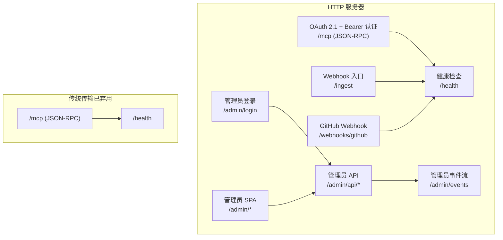
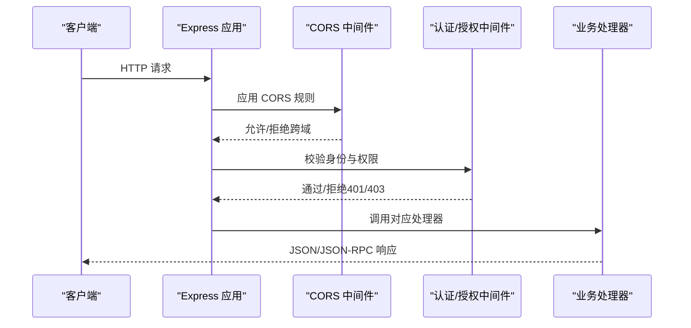
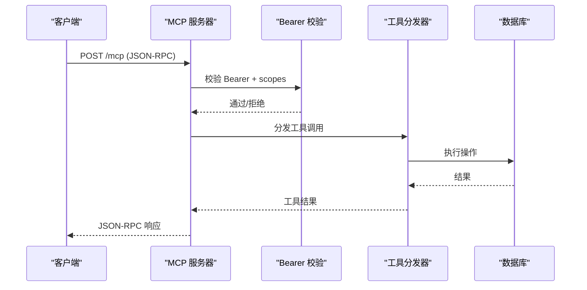
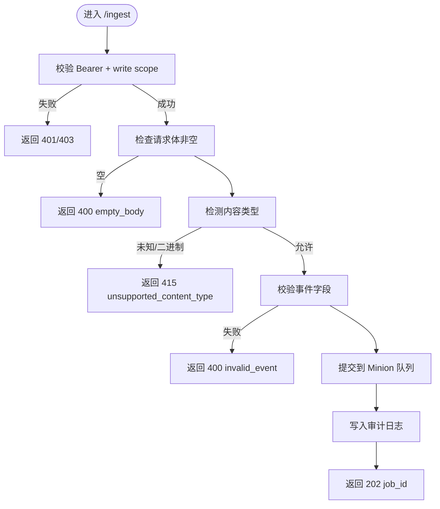
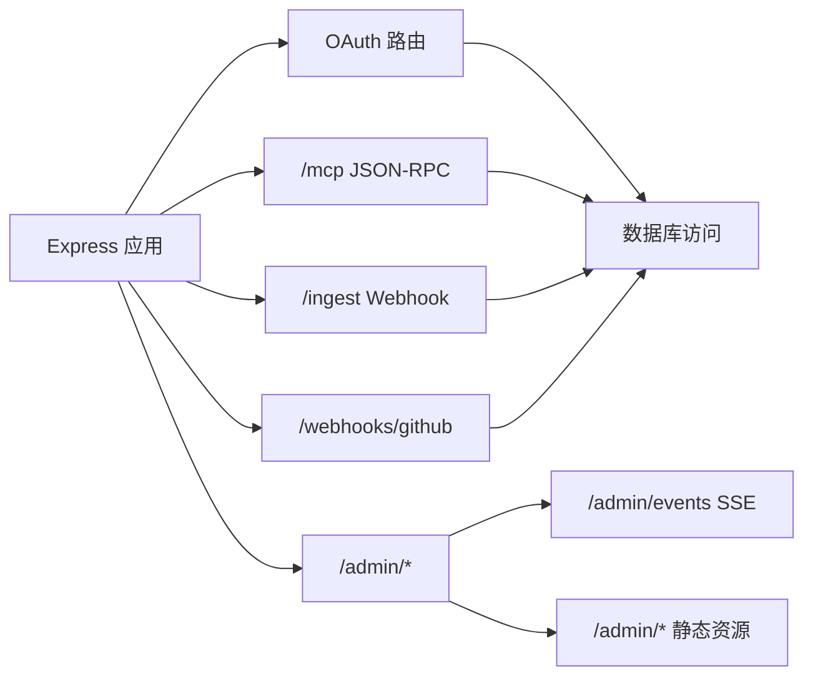

# HTTP API端点

<cite>
**本文档引用的文件**
- [serve-http.ts](file://src/commands/serve-http.ts)
- [http-transport.ts](file://src/mcp/http-transport.ts)
- [api.ts](file://admin/src/api.ts)
- [serve-http-ingest-webhook.test.ts](file://test/e2e/serve-http-ingest-webhook.test.ts)
- [serve-http-oauth.test.ts](file://test/e2e/serve-http-oauth.test.ts)
- [serve-http-health.test.ts](file://test/serve-http-health.test.ts)
- [serve-http-trust-proxy.test.ts](file://test/serve-http-trust-proxy.test.ts)
- [http-transport.test.ts](file://test/e2e/http-transport.test.ts)
- [mcp-client-hardening.test.ts](file://test/mcp-client-hardening.test.ts)
</cite>

## 目录
1. [简介](#简介)
2. [项目结构](#项目结构)
3. [核心组件](#核心组件)
4. [架构总览](#架构总览)
5. [详细组件分析](#详细组件分析)
6. [依赖关系分析](#依赖关系分析)
7. [性能考量](#性能考量)
8. [故障排除指南](#故障排除指南)
9. [结论](#结论)
10. [附录](#附录)

## 简介
本文件为 GBrain 项目的 HTTP API 端点完整参考文档，覆盖以下内容：
- 所有 REST API 端点的 HTTP 方法、URL 模式、请求/响应模式与状态码
- 认证方法（Bearer Token/OAuth 2.1）、授权机制与安全考虑
- API 版本管理、向后兼容性与弃用策略
- 请求头、查询参数与请求体规范
- 错误响应格式、错误代码与异常处理
- 使用示例、SDK 集成与客户端实现指南

## 项目结构
本项目通过两种主要传输方式提供 HTTP API：
- OAuth 2.1 + Bearer Token 的现代传输：位于 [serve-http.ts](file://src/commands/serve-http.ts)，提供 MCP 工具调用、Webhook 接入、管理员仪表盘与健康检查等能力
- 传统 Bearer Token 传输（已弃用）：位于 [http-transport.ts](file://src/mcp/http-transport.ts)，仅保留 /mcp 与 /health 路由

图表来源
- [serve-http.ts:398-2152](file://src/commands/serve-http.ts#L398-L2152)
- [http-transport.ts:139-421](file://src/mcp/http-transport.ts#L139-L421)

章节来源
- [serve-http.ts:1-2152](file://src/commands/serve-http.ts#L1-L2152)
- [http-transport.ts:1-421](file://src/mcp/http-transport.ts#L1-L421)

## 核心组件
- OAuth 2.1 认证与令牌发放：支持 authorization_code、refresh_token、client_credentials 三种授权类型；令牌默认 TTL 可配置
- Bearer Token 支持：遗留路径，仅限 /mcp 与 /health，不推荐新用
- MCP 工具调用：统一 JSON-RPC 接口，按操作权限控制访问
- Webhook 入口：POST /ingest，支持多种文本型内容类型
- GitHub Webhook：匿名触发同步，基于源配置的 HMAC 校验
- 管理员仪表盘：/admin 下静态资源与 API，含 SSE 实时事件流
- 健康检查：/health 返回运行时存活状态

章节来源
- [serve-http.ts:398-2152](file://src/commands/serve-http.ts#L398-L2152)
- [http-transport.ts:139-421](file://src/mcp/http-transport.ts#L139-L421)

## 架构总览
下图展示 HTTP 服务器的主要路由与中间件链路：

图表来源
- [serve-http.ts:522-747](file://src/commands/serve-http.ts#L522-L747)
- [serve-http.ts:1422-1721](file://src/commands/serve-http.ts#L1422-L1721)
- [serve-http.ts:1723-1967](file://src/commands/serve-http.ts#L1723-L1967)

## 详细组件分析

### OAuth 2.1 与 Bearer Token 认证
- 授权端点
  - GET /authorize：授权码流程
  - POST /token：令牌交换（authorization_code、refresh_token、client_credentials）
  - POST /register：动态客户端注册（DCR），可禁用
  - POST /revoke：撤销令牌
- 发现元数据
  - GET /.well-known/oauth-authorization-server：扩展 grant_types_supported，包含 client_credentials
- 令牌验证
  - requireBearerAuth 中间件对 /mcp 与 /ingest 进行 Bearer 校验
  - scopes 支持 read、write、admin、sources_admin、users_admin、agent 等

章节来源
- [serve-http.ts:575-747](file://src/commands/serve-http.ts#L575-L747)
- [serve-http.ts:1422-1721](file://src/commands/serve-http.ts#L1422-L1721)
- [serve-http.ts:1723-1967](file://src/commands/serve-http.ts#L1723-L1967)

### MCP 工具调用（/mcp）
- 方法与路径
  - GET /mcp：返回 405，明确声明不支持该方法
  - POST /mcp：JSON-RPC 2.0，请求体包含 method、params、id
- 请求头
  - Authorization: Bearer <access_token>
  - Content-Type: application/json
- 权限控制
  - 按操作所需 scope 决定是否允许（如 read/write/admin/sources_admin/users_admin/agent）
- 响应
  - 成功：JSON-RPC 2.0 结果对象
  - 失败：JSON-RPC 2.0 错误对象或 4xx/5xx 状态码
- 审计日志
  - mcp_request_log 记录 token_name、agent_name、operation、latency_ms、status、params、error_message

图表来源
- [serve-http.ts:1422-1721](file://src/commands/serve-http.ts#L1422-L1721)

章节来源
- [serve-http.ts:1422-1721](file://src/commands/serve-http.ts#L1422-L1721)

### Webhook 入口（/ingest）
- 方法与路径
  - POST /ingest
- 认证与授权
  - Bearer Token，要求 write scope
- 请求头
  - Content-Type：text/markdown、text/plain、text/html、application/json
  - X-Gbrain-Content-Type：覆盖 Content-Type（仅 JSON 场景）
  - X-Gbrain-Slug：页面 slug 提示
  - X-Gbrain-Source-Id：源标识
  - X-Gbrain-Source-Uri：源 URI
- 请求体
  - 文本内容（UTF-8），最大大小受 GBRAIN_INGEST_MAX_BYTES 控制（默认 1MB）
- 响应
  - 成功：202 Accepted，返回 job_id、content_hash、source_id
  - 失败：400/415/500，返回标准化错误对象
- 幂等性
  - 基于 client_id + content_hash 的队列级去重

图表来源
- [serve-http.ts:1723-1967](file://src/commands/serve-http.ts#L1723-L1967)

章节来源
- [serve-http.ts:1723-1967](file://src/commands/serve-http.ts#L1723-L1967)
- [serve-http-ingest-webhook.test.ts:1-361](file://test/e2e/serve-http-ingest-webhook.test.ts#L1-L361)

### GitHub Webhook（/webhooks/github）
- 方法与路径
  - POST /webhooks/github
- 认证
  - 匿名（GitHub 不携带 OAuth 令牌）
  - 通过 X-Hub-Signature-256 HMAC-SHA256 校验
- 过滤
  - 仅处理 push 事件且 ref 与源配置的 tracked_branch 匹配
- 响应
  - 202 忽略（非 push 或 ref 不匹配）
  - 202 返回 job_id（成功提交 sync 任务）
  - 400/401/404/500 返回标准化错误对象

章节来源
- [serve-http.ts:1970-2119](file://src/commands/serve-http.ts#L1970-L2119)

### 管理员仪表盘与 API
- 登录
  - POST /admin/login：JSON { token }，返回会话 Cookie
- 静态资源
  - /admin/*：SPA 静态文件（开发/嵌入两种解析路径）
- SSE 实时事件
  - GET /admin/events：服务端推送事件流
- 关键管理 API
  - POST /admin/api/sign-out-everywhere：撤销所有会话
  - GET /admin/api/agents：列出 OAuth 客户端与历史 API Key
  - GET /admin/api/agents/spend：按客户端统计消费
  - GET /admin/api/stats：统计概览
  - GET /admin/api/health-indicators：健康指标
  - GET /admin/api/full-stats：完整引擎统计（需管理员）
  - GET /admin/api/requests：请求审计日志（分页）
  - GET /admin/api/api-keys：列出 API Key
  - POST /admin/api/api-keys：创建 API Key
  - POST /admin/api/api-keys/revoke：吊销 API Key
  - POST /admin/api/register-client：注册 OAuth 客户端
  - POST /admin/api/update-client-ttl：更新客户端令牌 TTL
  - POST /admin/api/revoke-client：吊销 OAuth 客户端
  - GET /admin/api/calibration/profile：标定配置
  - GET /admin/api/calibration/charts/:type：标定图表
  - GET /admin/api/calibration/pattern/:id：标定模式钻取
  - GET /admin/api/jobs/watch：作业监控快照

章节来源
- [serve-http.ts:757-1345](file://src/commands/serve-http.ts#L757-L1345)
- [api.ts:1-56](file://admin/src/api.ts#L1-L56)

### 健康检查（/health）
- 方法与路径
  - GET /health
- 行为
  - 仅返回存活状态（无引擎统计），避免在高负载时阻塞探针
  - 3 秒超时，防止与编排器超时竞争

章节来源
- [serve-http.ts:753-756](file://src/commands/serve-http.ts#L753-L756)
- [serve-http-health.test.ts:1-200](file://test/serve-http-health.test.ts#L1-L200)

### 传统 Bearer Token 传输（已弃用）
- 路由
  - /mcp：JSON-RPC 2.0
  - /health：存活检查
- 认证
  - Authorization: Bearer <token>
  - 令牌存储于 access_tokens 表，按 SHA-256 校验
- 安全加固
  - CORS 默认拒绝，需通过环境变量配置允许列表
  - 预认证 IP 速率限制 + 后认证令牌速率限制
  - 请求体大小限制
  - 最近使用时间防抖更新

章节来源
- [http-transport.ts:139-421](file://src/mcp/http-transport.ts#L139-L421)

## 依赖关系分析
- Express 应用层
  - 中间件：cookieParser、CORS、速率限制、Bearer 校验、静态资源
  - 路由：OAuth 端点、MCP、/ingest、/webhooks/github、/admin/*
- 数据访问
  - 统一通过 SqlQuery 接口访问数据库（支持 Postgres/PGLite）
  - mcp_request_log 记录审计日志
- 安全
  - CORS 允许列表集中管理
  - 信任代理配置影响 X-Forwarded-For 与 req.secure 判断
  - 管理员会话 Cookie 设置 secure/sameSite/httpOnly

图表来源
- [serve-http.ts:522-2152](file://src/commands/serve-http.ts#L522-L2152)

章节来源
- [serve-http.ts:522-2152](file://src/commands/serve-http.ts#L522-L2152)

## 性能考量
- 速率限制
  - /ingest：每 IP 10s 内最多 100 次
  - /token（client_credentials）：15 分钟内最多 50 次
  - 管理员认证魔法链接：每 IP 1 分钟最多 10 次
  - 传统传输：预认证 IP 限流 + 后认证令牌限流
- 超时与探活
  - /health 使用 3 秒超时，避免与编排器超时冲突
- 日志与隐私
  - 默认仅记录参数摘要，可通过启动参数开启完整参数记录（调试用途）

章节来源
- [serve-http.ts:575-594](file://src/commands/serve-http.ts#L575-L594)
- [serve-http.ts:1746-1752](file://src/commands/serve-http.ts#L1746-L1752)
- [serve-http.ts:1723-1967](file://src/commands/serve-http.ts#L1723-L1967)
- [serve-http.ts:102-143](file://src/commands/serve-http.ts#L102-L143)

## 故障排除指南
- 常见错误与处理
  - 401 无效令牌：确认 Authorization 头与令牌有效性
  - 403 权限不足：确认令牌 scope 是否满足操作需求
  - 400 参数错误：检查请求体与必要字段
  - 415 不支持的内容类型：仅允许 text/markdown、text/plain、text/html、application/json
  - 429 速率限制：等待 Retry-After 秒后重试
  - 500 内部错误：查看服务器日志，确认队列提交与数据库连接
- 客户端错误分类
  - 客户端侧错误码提取逻辑：优先解析 JSON envelope 的 code 字段，其次进行字符串匹配
- 信任代理问题
  - 若通过反向代理部署，确保正确设置 GBRAIN_HTTP_TRUST_PROXY，否则 X-Forwarded-For 可能被忽略导致 IP 识别错误

章节来源
- [serve-http.ts:1723-1967](file://src/commands/serve-http.ts#L1723-L1967)
- [mcp-client-hardening.test.ts:90-152](file://test/mcp-client-hardening.test.ts#L90-L152)
- [serve-http-trust-proxy.test.ts:1-37](file://test/serve-http-trust-proxy.test.ts#L1-L37)

## 结论
本 HTTP API 采用 OAuth 2.1 作为主要认证方案，结合 Bearer Token 与严格的权限控制，提供 MCP 工具调用、Webhook 入口、管理员仪表盘与健康检查等能力。传统 Bearer Token 传输已标记为弃用，建议迁移至 OAuth 2.1。通过 CORS、速率限制、审计日志与信任代理配置，系统在安全性与可用性之间取得平衡。

## 附录

### API 端点一览表
- OAuth 端点
  - GET /.well-known/oauth-authorization-server
  - GET /authorize
  - POST /token
  - POST /register
  - POST /revoke
- MCP 工具调用
  - GET /mcp（返回 405）
  - POST /mcp（JSON-RPC）
- Webhook
  - POST /ingest
  - POST /webhooks/github
- 管理员
  - POST /admin/login
  - GET /admin/events
  - /admin/* 静态资源
  - /admin/api/*（详见“管理员 API”小节）
- 健康检查
  - GET /health

章节来源
- [serve-http.ts:398-2152](file://src/commands/serve-http.ts#L398-L2152)

### 认证与授权规范
- OAuth 2.1
  - 授权类型：authorization_code、refresh_token、client_credentials
  - 令牌默认 TTL 可配置，支持 per-client TTL
  - scopes：read、write、admin、sources_admin、users_admin、agent
- Bearer Token（已弃用）
  - 仅限 /mcp 与 /health
  - 令牌哈希存储于 access_tokens 表

章节来源
- [serve-http.ts:575-747](file://src/commands/serve-http.ts#L575-L747)
- [http-transport.ts:188-236](file://src/mcp/http-transport.ts#L188-L236)

### 请求头与查询参数
- /ingest
  - Content-Type：text/markdown、text/plain、text/html、application/json
  - X-Gbrain-Content-Type：覆盖 Content-Type
  - X-Gbrain-Slug：页面 slug 提示
  - X-Gbrain-Source-Id：源标识
  - X-Gbrain-Source-Uri：源 URI
- /webhooks/github
  - X-Hub-Signature-256：HMAC 校验
  - X-GitHub-Event：事件类型（仅处理 push）
- /admin/api/requests
  - 查询参数：page、agent、operation、status

章节来源
- [serve-http.ts:1723-1967](file://src/commands/serve-http.ts#L1723-L1967)
- [serve-http.ts:1169-1219](file://src/commands/serve-http.ts#L1169-L1219)

### 错误响应格式
- 统一结构：{ error: string, message?: string, ... }
- 示例
  - 400 empty_body
  - 400 invalid_event（含 field）
  - 401 invalid_client/invalid_grant
  - 403 insufficient_scope
  - 415 unsupported_content_type
  - 429 rate_limit_exceeded（带 Retry-After）
  - 500 internal_error/queue_submission_failed

章节来源
- [serve-http.ts:1723-1967](file://src/commands/serve-http.ts#L1723-L1967)
- [serve-http.ts:1970-2119](file://src/commands/serve-http.ts#L1970-L2119)

### 使用示例与客户端实现
- 获取访问令牌
  - 使用 /token（authorization_code/refresh_token/client_credentials）
- 调用 MCP 工具
  - POST /mcp，JSON-RPC 2.0，包含 method、params、id
- Webhook 入口
  - POST /ingest，设置 Authorization: Bearer <token> 与 Content-Type
  - 可通过 X-Gbrain-* 头自定义行为
- 管理员界面
  - 通过 /admin/login 登录，随后使用 /admin/api/* 与 SSE /admin/events

章节来源
- [serve-http.ts:1422-1721](file://src/commands/serve-http.ts#L1422-L1721)
- [serve-http-ingest-webhook.test.ts:145-161](file://test/e2e/serve-http-ingest-webhook.test.ts#L145-L161)
- [api.ts:36-56](file://admin/src/api.ts#L36-L56)