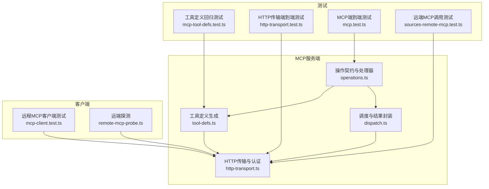
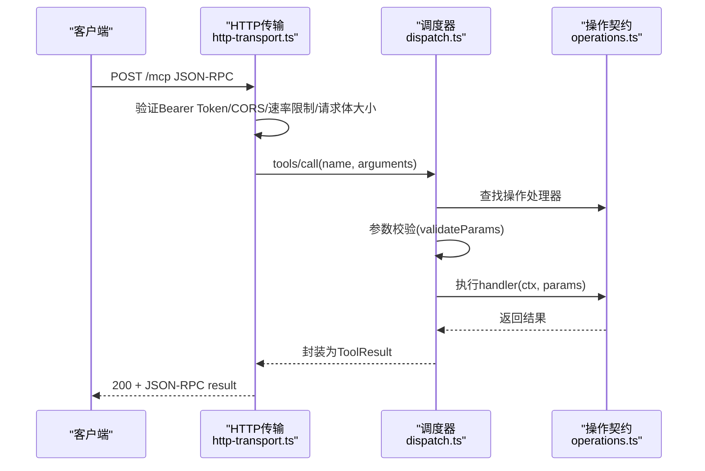
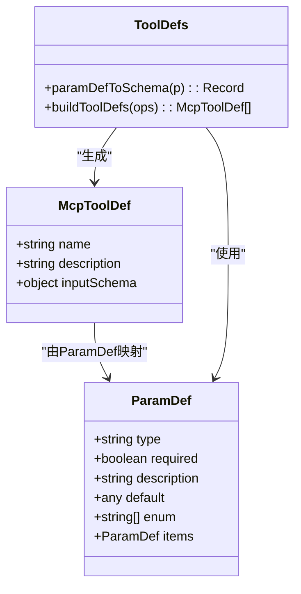
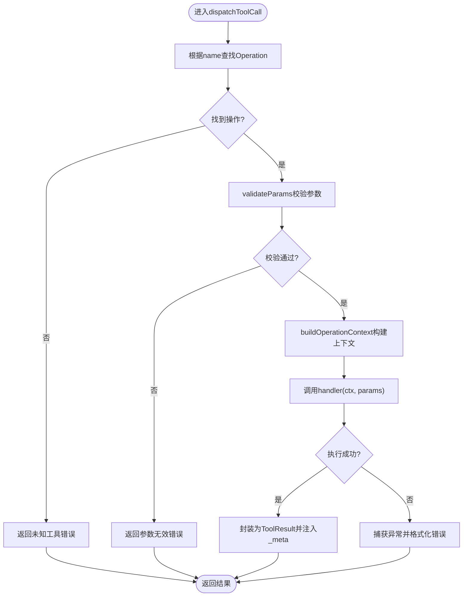
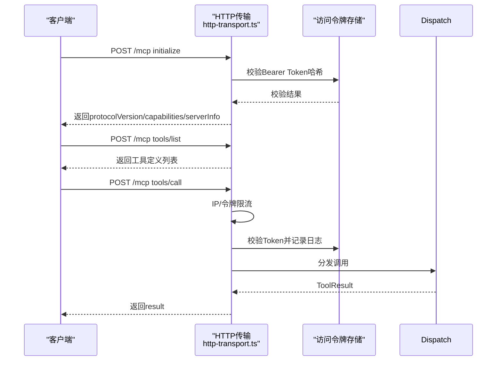
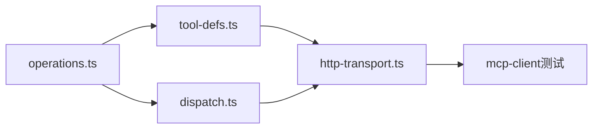

# MCP工具接口

<cite>
**本文引用的文件**
- [src/mcp/tool-defs.ts](file://src/mcp/tool-defs.ts)
- [src/core/operations.ts](file://src/core/operations.ts)
- [src/mcp/dispatch.ts](file://src/mcp/dispatch.ts)
- [src/mcp/http-transport.ts](file://src/mcp/http-transport.ts)
- [src/core/remote-mcp-probe.ts](file://src/core/remote-mcp-probe.ts)
- [test/mcp-tool-defs.test.ts](file://test/mcp-tool-defs.test.ts)
- [test/e2e/http-transport.test.ts](file://test/e2e/http-transport.test.ts)
- [test/mcp-client.test.ts](file://test/mcp-client.test.ts)
- [test/e2e/mcp.test.ts](file://test/e2e/mcp.test.ts)
- [test/e2e/sources-remote-mcp.test.ts](file://test/e2e/sources-remote-mcp.test.ts)
</cite>

## 目录
1. [简介](#简介)
2. [项目结构](#项目结构)
3. [核心组件](#核心组件)
4. [架构总览](#架构总览)
5. [详细组件分析](#详细组件分析)
6. [依赖关系分析](#依赖关系分析)
7. [性能考量](#性能考量)
8. [故障排除指南](#故障排除指南)
9. [结论](#结论)
10. [附录](#附录)

## 简介
本文件为MCP（Model Context Protocol）工具接口的权威参考文档，覆盖工具定义、参数模式与响应格式、调用协议、认证与会话管理、工具注册与发现、调用流程、参数校验与错误处理、超时机制、扩展开发指南以及客户端集成与代理配置等内容。文档以仓库中的实现为依据，确保技术细节可追溯到具体源码文件。

## 项目结构
围绕MCP工具接口的关键模块包括：
- 工具定义与参数Schema生成：src/mcp/tool-defs.ts
- 操作契约与处理器：src/core/operations.ts
- 调度与结果封装：src/mcp/dispatch.ts
- HTTP传输与认证：src/mcp/http-transport.ts
- 远端探测与健康检查：src/core/remote-mcp-probe.ts
- 单元与端到端测试：test/* 下的相关测试文件

图表来源
- [src/mcp/tool-defs.ts:1-55](file://src/mcp/tool-defs.ts#L1-L55)
- [src/core/operations.ts:589-619](file://src/core/operations.ts#L589-L619)
- [src/mcp/dispatch.ts:1-284](file://src/mcp/dispatch.ts#L1-L284)
- [src/mcp/http-transport.ts:1-421](file://src/mcp/http-transport.ts#L1-L421)
- [src/core/remote-mcp-probe.ts:145-182](file://src/core/remote-mcp-probe.ts#L145-L182)
- [test/mcp-tool-defs.test.ts:1-187](file://test/mcp-tool-defs.test.ts#L1-L187)
- [test/e2e/http-transport.test.ts:1-109](file://test/e2e/http-transport.test.ts#L1-L109)
- [test/e2e/mcp.test.ts:1-37](file://test/e2e/mcp.test.ts#L1-L37)
- [test/e2e/sources-remote-mcp.test.ts:72-108](file://test/e2e/sources-remote-mcp.test.ts#L72-L108)

章节来源
- [src/mcp/tool-defs.ts:1-55](file://src/mcp/tool-defs.ts#L1-L55)
- [src/core/operations.ts:589-619](file://src/core/operations.ts#L589-L619)
- [src/mcp/dispatch.ts:1-284](file://src/mcp/dispatch.ts#L1-L284)
- [src/mcp/http-transport.ts:1-421](file://src/mcp/http-transport.ts#L1-L421)

## 核心组件
- 工具定义生成器：将操作契约映射为MCP工具定义，统一生成输入Schema，保证不同传输层的一致性。
- 操作契约：定义每个工具的名称、描述、参数定义、处理器、作用域与本地限制等。
- 调度器：对工具调用进行参数校验、构建上下文、执行处理器、格式化结果并注入元数据。
- HTTP传输：提供基于Bearer Token的认证、CORS、速率限制、请求体大小限制、健康检查与MCP端点。
- 远端探测：用于验证远端MCP可达性与认证有效性。

章节来源
- [src/mcp/tool-defs.ts:40-54](file://src/mcp/tool-defs.ts#L40-L54)
- [src/core/operations.ts:589-619](file://src/core/operations.ts#L589-L619)
- [src/mcp/dispatch.ts:222-283](file://src/mcp/dispatch.ts#L222-L283)
- [src/mcp/http-transport.ts:139-421](file://src/mcp/http-transport.ts#L139-L421)
- [src/core/remote-mcp-probe.ts:145-182](file://src/core/remote-mcp-probe.ts#L145-L182)

## 架构总览
MCP工具接口通过“操作契约”驱动工具定义生成与调用分发，HTTP传输负责认证与路由，调度器统一处理参数校验、上下文构建与结果封装。

图表来源
- [src/mcp/http-transport.ts:374-396](file://src/mcp/http-transport.ts#L374-L396)
- [src/mcp/dispatch.ts:222-283](file://src/mcp/dispatch.ts#L222-L283)
- [src/core/operations.ts:589-619](file://src/core/operations.ts#L589-L619)

## 详细组件分析

### 工具定义与参数Schema
- 工具定义结构：包含name、description与inputSchema（固定为object类型），required数组由参数定义中标记为required的键组成。
- 参数Schema生成：paramDefToSchema递归处理ParamDef，支持基础类型、枚举、默认值与嵌套数组项(items)，确保严格模式验证器不会遇到裸数组。
- 工具定义生成：buildToolDefs遍历operations，统一生成工具列表，供HTTP/tools/list与子代理注册使用。

图表来源
- [src/mcp/tool-defs.ts:3-11](file://src/mcp/tool-defs.ts#L3-L11)
- [src/mcp/tool-defs.ts:30-38](file://src/mcp/tool-defs.ts#L30-L38)
- [src/mcp/tool-defs.ts:40-54](file://src/mcp/tool-defs.ts#L40-L54)

章节来源
- [src/mcp/tool-defs.ts:3-54](file://src/mcp/tool-defs.ts#L3-L54)
- [test/mcp-tool-defs.test.ts:1-187](file://test/mcp-tool-defs.test.ts#L1-L187)

### 操作契约与处理器
- Operation接口：定义name、description、params、handler、mutating、scope、localOnly与CLI提示等。
- 参数定义ParamDef：支持基础类型、枚举、默认值与嵌套数组(items)，用于Schema生成与调用校验。
- 典型操作：如get_page、put_page等，展示读写权限、模糊匹配、隐私过滤与来源隔离策略。

章节来源
- [src/core/operations.ts:589-619](file://src/core/operations.ts#L589-L619)
- [src/core/operations.ts:623-722](file://src/core/operations.ts#L623-L722)
- [src/core/operations.ts:724-801](file://src/core/operations.ts#L724-L801)

### 调度与结果封装
- 参数校验：validateParams按ParamDef要求逐项校验，返回错误信息或null。
- 上下文构建：buildOperationContext填充引擎、配置、日志、是否远程、来源隔离与授权信息等。
- 结果封装：dispatchToolCall统一捕获异常，返回标准ToolResult结构；支持注入_meta元数据。

图表来源
- [src/mcp/dispatch.ts:170-187](file://src/mcp/dispatch.ts#L170-L187)
- [src/mcp/dispatch.ts:195-214](file://src/mcp/dispatch.ts#L195-L214)
- [src/mcp/dispatch.ts:222-283](file://src/mcp/dispatch.ts#L222-L283)

章节来源
- [src/mcp/dispatch.ts:14-28](file://src/mcp/dispatch.ts#L14-L28)
- [src/mcp/dispatch.ts:170-283](file://src/mcp/dispatch.ts#L170-L283)

### HTTP传输与认证
- 认证：Bearer Token，SHA-256哈希存储于access_tokens表，校验失败返回401。
- CORS：默认拒绝，可通过环境变量设置允许列表；预检请求仅在允许列表内暴露方法与头。
- 速率限制：IP级预认证限流与令牌级后认证限流，避免暴力破解与滥用。
- 请求体限制：默认1MiB，流式计数，支持无Content-Length的分块传输。
- 健康检查：/health探活数据库，返回状态与版本信息。
- 端点：/mcp支持initialize、tools/list、tools/call与notifications/initialized。

图表来源
- [src/mcp/http-transport.ts:188-236](file://src/mcp/http-transport.ts#L188-L236)
- [src/mcp/http-transport.ts:244-404](file://src/mcp/http-transport.ts#L244-L404)
- [src/mcp/dispatch.ts:222-283](file://src/mcp/dispatch.ts#L222-L283)

章节来源
- [src/mcp/http-transport.ts:1-421](file://src/mcp/http-transport.ts#L1-L421)
- [test/e2e/http-transport.test.ts:90-109](file://test/e2e/http-transport.test.ts#L90-L109)

### 远端探测与健康检查
- 远端探测：发送initialize请求，基于状态码与响应判断认证与网络问题，并支持超时控制。
- 健康检查：/health端点返回服务与数据库状态，便于编排系统正确感知可用性。

章节来源
- [src/core/remote-mcp-probe.ts:145-182](file://src/core/remote-mcp-probe.ts#L145-L182)
- [src/mcp/http-transport.ts:257-272](file://src/mcp/http-transport.ts#L257-L272)

### 客户端集成与薄客户端
- 薄客户端：支持OAuth发现、令牌缓存、401自动刷新重试、错误解包与结果解析。
- 测试夹具：模拟/.well-known/oauth-authorization-server、/token与/mcp端点，覆盖握手、工具调用与错误场景。

章节来源
- [test/mcp-client.test.ts:1-292](file://test/mcp-client.test.ts#L1-L292)

## 依赖关系分析
- 工具定义生成依赖操作契约；HTTP传输依赖工具定义与调度器；调度器依赖操作契约与配置加载。
- 安全与合规：HTTP传输内置CORS、速率限制、请求体上限与审计日志；调度器注入_meta以增强可观测性。

图表来源
- [src/core/operations.ts:589-619](file://src/core/operations.ts#L589-L619)
- [src/mcp/tool-defs.ts:40-54](file://src/mcp/tool-defs.ts#L40-L54)
- [src/mcp/dispatch.ts:222-283](file://src/mcp/dispatch.ts#L222-L283)
- [src/mcp/http-transport.ts:139-421](file://src/mcp/http-transport.ts#L139-L421)
- [test/mcp-client.test.ts:1-292](file://test/mcp-client.test.ts#L1-L292)

章节来源
- [src/mcp/tool-defs.ts:1-55](file://src/mcp/tool-defs.ts#L1-L55)
- [src/mcp/dispatch.ts:1-284](file://src/mcp/dispatch.ts#L1-L284)
- [src/mcp/http-transport.ts:1-421](file://src/mcp/http-transport.ts#L1-L421)

## 性能考量
- 速率限制：IP级与令牌级双层限流，避免资源滥用与DDoS。
- 请求体上限：默认1MiB，防止内存膨胀与慢注入攻击。
- 数据库探活：/health端点在返回前执行简单查询，确保编排系统不误判服务可用性。
- 日志与审计：mcp_request_log记录每次请求的令牌名、操作、状态与延迟，便于追踪与优化。

章节来源
- [src/mcp/http-transport.ts:14-23](file://src/mcp/http-transport.ts#L14-L23)
- [src/mcp/http-transport.ts:296-304](file://src/mcp/http-transport.ts#L296-L304)
- [src/mcp/http-transport.ts:257-272](file://src/mcp/http-transport.ts#L257-L272)
- [src/mcp/http-transport.ts:238-242](file://src/mcp/http-transport.ts#L238-L242)

## 故障排除指南
- 认证失败（401/403）：检查Bearer Token格式与哈希是否存在于access_tokens表，确认未被撤销。
- 参数无效：核对工具输入Schema，确保必填字段存在且类型匹配；关注嵌套数组必须声明items.type。
- 未知工具：确认工具名称拼写与已注册工具列表一致。
- 网络错误：使用remote-mcp-probe进行初始化握手探测，结合超时参数定位网络问题。
- 客户端错误：薄客户端会将底层错误分类为config、auth、network、tool_error等，按提示修正配置或凭据。

章节来源
- [src/mcp/http-transport.ts:188-236](file://src/mcp/http-transport.ts#L188-L236)
- [src/mcp/dispatch.ts:170-187](file://src/mcp/dispatch.ts#L170-L187)
- [src/mcp/dispatch.ts:222-283](file://src/mcp/dispatch.ts#L222-L283)
- [src/core/remote-mcp-probe.ts:145-182](file://src/core/remote-mcp-probe.ts#L145-L182)
- [test/mcp-client.test.ts:202-270](file://test/mcp-client.test.ts#L202-L270)

## 结论
MCP工具接口通过统一的操作契约与Schema生成、严格的参数校验与安全传输，提供了稳定、可审计且易于扩展的工具调用能力。HTTP传输层在认证、CORS、速率限制与健康检查方面具备完善的工程实践，适合在生产环境中部署与集成。

## 附录

### 工具调用协议与端点
- 端点：/mcp（仅POST）
- 方法：
  - initialize：握手，返回protocolVersion、capabilities与serverInfo
  - tools/list：列出工具定义
  - tools/call：调用指定工具
  - notifications/initialized：通知确认（204）

章节来源
- [src/mcp/http-transport.ts:343-396](file://src/mcp/http-transport.ts#L343-L396)

### 认证与会话管理
- 认证方式：Bearer Token（SHA-256哈希存储于access_tokens表）
- 会话：无会话状态，每次请求独立校验；支持每IP与每令牌的速率限制
- CORS：默认拒绝，需通过环境变量配置允许列表

章节来源
- [src/mcp/http-transport.ts:8-23](file://src/mcp/http-transport.ts#L8-L23)
- [src/mcp/http-transport.ts:173-186](file://src/mcp/http-transport.ts#L173-L186)
- [src/mcp/http-transport.ts:283-327](file://src/mcp/http-transport.ts#L283-L327)

### 工具注册、发现与调用流程
- 注册与发现：buildToolDefs从operations生成工具定义，HTTP/tools/list返回工具清单
- 调用流程：HTTP/tools/call → 调度器参数校验 → 上下文构建 → 处理器执行 → 结果封装

章节来源
- [src/mcp/tool-defs.ts:40-54](file://src/mcp/tool-defs.ts#L40-L54)
- [src/mcp/http-transport.ts:365-372](file://src/mcp/http-transport.ts#L365-L372)
- [src/mcp/dispatch.ts:222-283](file://src/mcp/dispatch.ts#L222-L283)

### 参数验证与错误处理
- 参数验证：validateParams逐项校验类型与必填；嵌套数组必须声明items.type
- 错误处理：统一返回ToolResult，内部错误包装为JSON可解析格式；OperationError序列化为标准错误对象

章节来源
- [src/mcp/dispatch.ts:170-187](file://src/mcp/dispatch.ts#L170-L187)
- [src/mcp/dispatch.ts:269-282](file://src/mcp/dispatch.ts#L269-L282)
- [src/core/operations.ts:75-94](file://src/core/operations.ts#L75-L94)

### 超时机制
- 远端探测：默认超时15秒，可通过选项传入自定义超时
- HTTP传输：未显式设置超时，但可通过上游代理或负载均衡器配置

章节来源
- [src/core/remote-mcp-probe.ts:145-182](file://src/core/remote-mcp-probe.ts#L145-L182)

### 工具扩展开发指南
- 新增工具：在operations中新增Operation条目，定义name、description、params与handler
- Schema一致性：使用buildToolDefs生成工具定义，确保与HTTP/tools/list输出一致
- 参数约束：为数组参数声明items.type，避免严格模式验证失败
- 权限与来源：合理设置scope与sourceId，遵循最小权限原则与来源隔离

章节来源
- [src/core/operations.ts:589-619](file://src/core/operations.ts#L589-L619)
- [src/mcp/tool-defs.ts:40-54](file://src/mcp/tool-defs.ts#L40-L54)
- [test/mcp-tool-defs.test.ts:137-146](file://test/mcp-tool-defs.test.ts#L137-L146)

### 自定义工具实现示例
- 参考现有操作：get_page、put_page等展示了参数校验、隐私过滤、来源隔离与错误处理的实现模式
- 端到端验证：端到端测试覆盖了工具定义生成与HTTP/tools/call往返

章节来源
- [src/core/operations.ts:623-722](file://src/core/operations.ts#L623-L722)
- [src/core/operations.ts:724-801](file://src/core/operations.ts#L724-L801)
- [test/e2e/mcp.test.ts:16-37](file://test/e2e/mcp.test.ts#L16-L37)
- [test/e2e/http-transport.test.ts:103-109](file://test/e2e/http-transport.test.ts#L103-L109)

### MCP客户端集成与代理配置
- 客户端集成：薄客户端支持OAuth发现、令牌缓存、401自动刷新与错误解包
- 代理配置：CORS默认拒绝，需通过环境变量配置允许列表；健康检查端点可用于探活

章节来源
- [test/mcp-client.test.ts:1-292](file://test/mcp-client.test.ts#L1-L292)
- [src/mcp/http-transport.ts:173-186](file://src/mcp/http-transport.ts#L173-L186)
- [src/mcp/http-transport.ts:257-272](file://src/mcp/http-transport.ts#L257-L272)