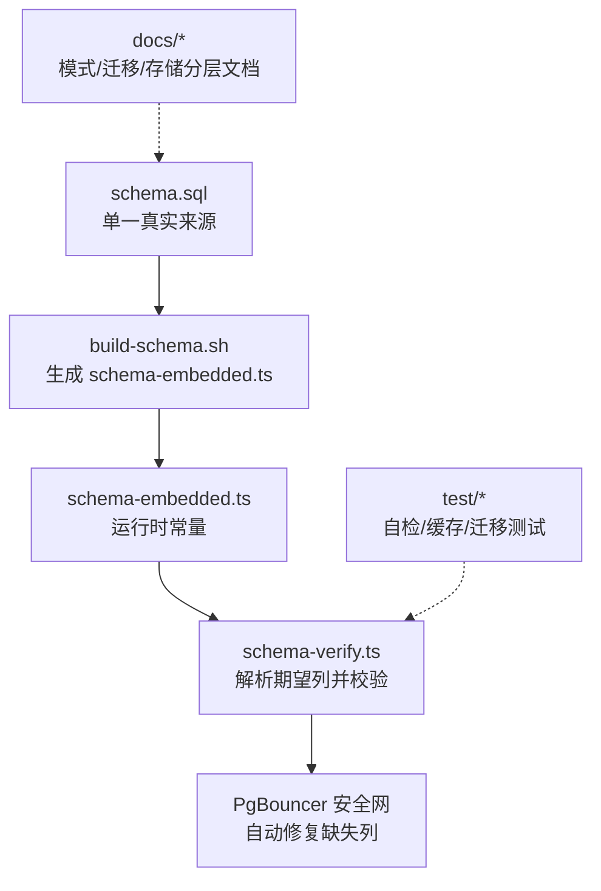
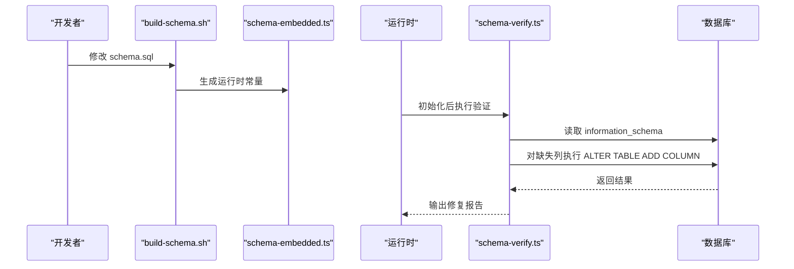

# 数据模型参考

<cite>
**本文引用的文件**
- [schema.sql](file://src/schema.sql)
- [schema-verify.ts](file://src/core/schema-verify.ts)
- [build-schema.sh](file://scripts/build-schema.sh)
- [embedding-migrations.md](file://docs/embedding-migrations.md)
- [storage-tiering.md](file://docs/storage-tiering.md)
- [GBRAIN_RECOMMENDED_SCHEMA.md](file://docs/GBRAIN_RECOMMENDED_SCHEMA.md)
- [what-schemas-unlock.md](file://docs/what-schemas-unlock.md)
- [pglite-engine.ts](file://src/core/pglite-engine.ts)
- [schema-bootstrap-coverage.test.ts](file://test/schema-bootstrap-coverage.test.ts)
- [schema-verify.test.ts](file://test/schema-verify.test.ts)
- [query-cache.test.ts](file://test/query-cache.test.ts)
- [query-cache-knobs-hash.serial.test.ts](file://test/query-cache-knobs-hash.serial.test.ts)
- [migrate.test.ts](file://test/migrate.test.ts)
- [helpers.ts](file://test/e2e/helpers.ts)
</cite>

## 目录
1. [简介](#简介)
2. [项目结构](#项目结构)
3. [核心组件](#核心组件)
4. [架构总览](#架构总览)
5. [详细组件分析](#详细组件分析)
6. [依赖分析](#依赖分析)
7. [性能考量](#性能考量)
8. [故障排查指南](#故障排查指南)
9. [结论](#结论)
10. [附录](#附录)

## 简介
本文件为 GBrain 数据模型的权威参考，覆盖实体关系、字段定义、数据类型、主键/外键、索引与约束、数据验证与业务规则、数据库模式图、示例数据、数据访问模式、缓存策略、性能优化、数据生命周期与保留策略、归档规则、以及数据迁移路径与版本管理。内容基于仓库中的 schema.sql、相关文档与测试用例整理而成，确保技术细节可追溯至源码。

## 项目结构
- 核心模式定义位于 src/schema.sql，采用“单一真实来源”原则，通过脚本生成 src/core/schema-embedded.ts 供运行时使用。
- 运行时具备 schema 自检与自动修复机制（schema-verify.ts），防止 PgBouncer 事务池导致的列缺失问题。
- 文档层提供嵌入模型切换、存储分层、模式演进等主题的实践指导。
- 测试用例覆盖模式自检覆盖率、查询缓存行为、迁移正确性等关键场景。



图表来源
- [schema.sql](file://src/schema.sql)
- [build-schema.sh](file://scripts/build-schema.sh)
- [schema-verify.ts](file://src/core/schema-verify.ts)

章节来源
- [schema.sql](file://src/schema.sql)
- [build-schema.sh](file://scripts/build-schema.sh)
- [schema-verify.ts](file://src/core/schema-verify.ts)

## 核心组件
本节概述数据库中最重要的表及其职责边界，并给出主键/外键、索引与约束概览。

- sources：多仓/多脑租户的逻辑来源，每个页面/文件/同步日志携带 source_id。
- pages：核心内容表，按 source_id 范围化；slug 在 source 内唯一。
- content_chunks：分块内容与向量，支持文本/图像/多模态向量，含 FTS 向量。
- code_edges_chunk / code_edges_symbol：代码结构边，已解析与未解析两类。
- links：跨页链接，支持多种来源与解析类型。
- tags：页面标签。
- raw_data：侧车数据（替代 .raw JSON 文件）。
- timeline_entries：结构化时间线。
- page_versions：compiled_truth 快照历史。
- ingest_log：事实吸收与健康检查的日志。
- config：脑级配置。
- access_tokens / mcp_request_log：远程 MCP 访问令牌与请求日志。
- oauth_*：OAuth 2.1 客户端、令牌、授权码。
- op_checkpoints / op_checkpoint_paths：长任务共享检查点。
- context_volunteer_events：上下文自愿反馈事件。
- files：二进制附件（Supabase Storage）。
- file_migration_ledger：文件迁移流水。

章节来源
- [schema.sql](file://src/schema.sql)

## 架构总览
下图展示核心实体间的关系与关键索引/约束，帮助理解查询路径与写入路径的性能设计。

```mermaid
erDiagram
SOURCES {
text id PK
text name
text local_path
text last_commit
timestamptz last_sync_at
jsonb config
text chunker_version
boolean archived
timestamptz archived_at
timestamptz archive_expires_at
text contextual_retrieval_mode
boolean trust_frontmatter_overrides
timestamptz newest_content_at
timestamptz created_at
}
PAGES {
int id PK
text source_id FK
text slug
text type
text page_kind
text title
text compiled_truth
text timeline
jsonb frontmatter
text content_hash
real emotional_weight
timestamptz created_at
timestamptz updated_at
timestamptz deleted_at
timestamptz effective_date
text effective_date_source
text import_filename
timestamptz salience_touched_at
timestamptz last_retrieved_at
timestamptz links_extracted_at
text contextual_retrieval_mode
text corpus_generation
bigint generation
}
CONTENT_CHUNKS {
int id PK
int page_id FK
int chunk_index
text chunk_text
text chunk_source
vector embedding
text model
int token_count
timestamptz embedded_at
timestamptz created_at
text language
text symbol_name
text symbol_type
int start_line
int end_line
text[] parent_symbol_path
text doc_comment
text symbol_name_qualified
tsvector search_vector
text modality
vector embedding_image
vector embedding_multimodal
}
CODE_EDGES_CHUNK {
int id PK
int from_chunk_id FK
int to_chunk_id FK
text from_symbol_qualified
text to_symbol_qualified
text edge_type
jsonb edge_metadata
text source_id FK
timestamptz created_at
}
CODE_EDGES_SYMBOL {
int id PK
int from_chunk_id FK
text from_symbol_qualified
text to_symbol_qualified
text edge_type
jsonb edge_metadata
text source_id FK
timestamptz created_at
}
LINKS {
int id PK
int from_page_id FK
int to_page_id FK
text link_type
text context
text link_source
text link_kind
int origin_page_id FK
text origin_field
text resolution_type
timestamptz created_at
}
TAGS {
int id PK
int page_id FK
text tag
}
RAW_DATA {
int id PK
int page_id FK
text source
jsonb data
timestamptz fetched_at
}
TIMELINE_ENTRIES {
int id PK
int page_id FK
date date
text source
text summary
text detail
timestamptz created_at
}
PAGE_VERSIONS {
int id PK
int page_id FK
text compiled_truth
jsonb frontmatter
timestamptz snapshot_at
}
INGEST_LOG {
int id PK
text source_id
text source_type
text source_ref
jsonb pages_updated
text summary
timestamptz created_at
}
CONFIG {
text key PK
text value
}
ACCESS_TOKENS {
uuid id PK
text name
text token_hash
text[] scopes
timestamptz created_at
timestamptz last_used_at
timestamptz revoked_at
}
MCP_REQUEST_LOG {
int id PK
text token_name
text agent_name
text operation
int latency_ms
text status
jsonb params
text error_message
timestamptz created_at
}
OAUTH_CLIENTS {
text client_id PK
text client_secret_hash
text client_name
text[] redirect_uris
text[] grant_types
text scope
text token_endpoint_auth_method
bigint client_id_issued_at
bigint client_secret_expires_at
int token_ttl
timestamptz deleted_at
text source_id FK
text[] federated_read
numeric budget_usd_per_day
text[] bound_tools
text bound_source_id
text bound_brain_id
text[] bound_slug_prefixes
int bound_max_concurrent
timestamptz created_at
}
OAUTH_TOKENS {
text token_hash PK
text token_type
text client_id FK
text[] scopes
bigint expires_at
text resource
timestamptz created_at
}
OAUTH_CODES {
text code_hash PK
text client_id FK
text[] scopes
text code_challenge
text code_challenge_method
text redirect_uri
text state
text resource
bigint expires_at
timestamptz created_at
}
OP_CHECKPOINTS {
text op PK
text fingerprint PK
jsonb completed_keys
timestamptz updated_at
}
OP_CHECKPOINT_PATHS {
text op PK
text fingerprint PK
text path PK
timestamptz created_at
}
CONTEXT_VOLUNTEER_EVENTS {
bigint id PK
text source_id
text slug
double precision confidence
text match_arm
text rationale
text channel
text session_id
int turn
timestamptz volunteered_at
}
FILES {
int id PK
text source_id FK
text page_slug
int page_id FK
text filename
text storage_path
text mime_type
bigint size_bytes
text content_hash
jsonb metadata
timestamptz created_at
}
FILE_MIGRATION_LEDGER {
int file_id PK
text storage_path_old
text storage_path_new
text status
}
PAGES ||--o{ CONTENT_CHUNKS : "拥有"
SOURCES ||--o{ PAGES : "拥有"
PAGES ||--o{ LINKS : "产生"
PAGES ||--o{ TAGS : "拥有"
PAGES ||--o{ RAW_DATA : "拥有"
PAGES ||--o{ TIMELINE_ENTRIES : "拥有"
PAGES ||--o{ PAGE_VERSIONS : "快照"
SOURCES ||--o{ INGEST_LOG : "产生"
OAUTH_CLIENTS ||--o{ OAUTH_TOKENS : "颁发"
OAUTH_CLIENTS ||--o{ OAUTH_CODES : "颁发"
PAGES ||--o{ OP_CHECKPOINT_PATHS : "子项"
FILES ||--o{ FILE_MIGRATION_LEDGER : "迁移"
```

图表来源
- [schema.sql](file://src/schema.sql)

## 详细组件分析

### sources 表
- 主键：id（TEXT，PK）
- 唯一约束：name（UNIQUE）
- 关键字段：local_path、config（JSONB）、chunker_version、archived 系列、contextual_retrieval_mode、trust_frontmatter_overrides、newest_content_at、created_at
- 约束与业务规则：
  - config 支持联邦与访问控制槽位，v0.40 引入部分表达式索引以加速 webhook 源查找。
  - 归档机制：archived、archived_at、archive_expires_at 配合 autopilot 清理流程。
- 索引：
  - 部分表达式索引：sources_github_repo_idx（仅配置了 github_repo 的行）

章节来源
- [schema.sql](file://src/schema.sql)

### pages 表
- 主键：id（SERIAL）
- 外键：source_id → sources(id)（CASCADE 删除）
- 唯一约束：(source_id, slug)
- 关键字段：slug、type、page_kind（枚举：markdown/code/image）、title、compiled_truth、timeline、frontmatter、content_hash、emotional_weight、deleted_at、effective_date 系列、last_retrieved_at、links_extracted_at、contextual_retrieval_mode、corpus_generation、generation
- 触发器与索引：
  - bump_page_generation_fn：在 INSERT/UPDATE 时按允许列差异递增 generation，并维护全局 page_generation_clock_seq。
  - generation 上建立普通索引以支持 O(log N) 最大值读取。
  - 多个表达式/部分索引：用于 since/until 过滤、LSD 查询、链接提取水印等。
- 业务规则：
  - page_kind 限制类型；emotional_weight 默认 0.0，由周期阶段重计算。
  - generation 作为缓存失效门禁，配合 per-page 快照与全局时钟实现两级有效性判断。

章节来源
- [schema.sql](file://src/schema.sql)

### content_chunks 表
- 主键：id（SERIAL）
- 外键：page_id → pages(id)（CASCADE 删除）
- 唯一索引：(page_id, chunk_index)
- 字段：chunk_text、embedding（向量）、model、token_count、embedded_at、语言/符号元数据、FTS 向量 search_vector、多模态向量 embedding_image/ embedding_multimodal、modality
- 索引：
  - HNSW 向量索引（cosine 距离）
  - 部分 HNSW（图像向量）
  - GIN 搜索向量索引
  - 部分表达式索引（仅代码块）
- 触发器：update_chunk_search_vector（在特定列变更时重建 FTS 向量）

章节来源
- [schema.sql](file://src/schema.sql)

### code_edges_chunk / code_edges_symbol 表
- 设计目标：区分“已解析”（两端均为已知 chunk）与“未解析”（目标以限定名存在）两类代码边。
- 外键：from_chunk_id、to_chunk_id → content_chunks(id)（CASCADE 删除）
- 索引：分别针对 from/to 符号与类型建立复合索引，支撑调用链查询。
- 业务规则：解析必须按 source_id 作用域限定，避免跨源误连。

章节来源
- [schema.sql](file://src/schema.sql)

### links 表
- 主键：id（SERIAL）
- 外键：from_page_id、to_page_id → pages(id)（CASCADE 删除）
- 唯一约束：NULLS NOT DISTINCT (from_page_id, to_page_id, link_type, link_source, origin_page_id)
- 字段：link_source（格式校验：kebab 格式且长度 ≤ 64；NULL 表示遗留行）、link_kind（枚举：plain/typed_ner）、origin_page_id/origin_field（frontmatter 来源）、resolution_type（qualified/unqualified/NULL）
- 索引：from/to/source/origin
- 业务规则：link_source 不允许手工传入受管内置值；resolution_type 区分显式来源与本地解析。

章节来源
- [schema.sql](file://src/schema.sql)

### tags、raw_data、timeline_entries、page_versions
- tags：页面标签，唯一索引 (page_id, tag)
- raw_data：页面侧车数据，唯一索引 (page_id, source)
- timeline_entries：结构化时间线，唯一索引 (page_id, date, summary, source)
- page_versions：compiled_truth 快照历史

章节来源
- [schema.sql](file://src/schema.sql)

### ingest_log、config
- ingest_log：按 source_id 范围化，记录每次同步更新的页面集合，便于按来源统计健康度。
- config：键值对配置，包含 embedding_model、embedding_dimensions、chunk_strategy 等。

章节来源
- [schema.sql](file://src/schema.sql)

### access_tokens、mcp_request_log
- access_tokens：Bearer 令牌，按 token_hash 建索引（未撤销）。
- mcp_request_log：远程 MCP 请求日志，支持按时间/代理维度查询。

章节来源
- [schema.sql](file://src/schema.sql)

### oauth_* 表族
- oauth_clients：客户端注册与配额、工具绑定、来源范围等。
- oauth_tokens：令牌哈希索引、过期时间索引。
- oauth_codes：授权码哈希索引、过期时间索引。

章节来源
- [schema.sql](file://src/schema.sql)

### op_checkpoints / op_checkpoint_paths
- op_checkpoints：长任务检查点，completed_keys 为 JSONB 数组（强制约束），按指纹聚合。
- op_checkpoint_paths：按路径增量追加，父级删除时级联清理。

章节来源
- [schema.sql](file://src/schema.sql)

### context_volunteer_events
- 上下文自愿反馈事件，按 source_id+时间排序索引，90 天清理。

章节来源
- [schema.sql](file://src/schema.sql)

### files / file_migration_ledger
- files：二进制附件，支持 source_id、page_id、content_hash、metadata 等。
- file_migration_ledger：迁移流水，状态机从 pending 到 complete。

章节来源
- [schema.sql](file://src/schema.sql)

## 依赖分析
- 模式生成链路：schema.sql → build-schema.sh → schema-embedded.ts → 运行时解析与校验。
- 自检与修复：schema-verify.ts 解析 CREATE TABLE 中的列定义，对比 information_schema，对缺失列执行 ALTER TABLE ADD COLUMN IF NOT EXISTS 并记录失败。
- 前向引用引导：pglite-engine.ts 对 PGLite 引擎进行前向引用引导，确保必要对象存在。
- 测试保障：schema-bootstrap-coverage.test.ts 与 schema-verify.test.ts 保证模式自检覆盖率与行为正确性；query-cache.* 测试覆盖缓存命中/过期/隔离等；migrate.test.ts 验证迁移幂等与性能门限。



图表来源
- [build-schema.sh](file://scripts/build-schema.sh)
- [schema-embedded.ts](file://src/core/schema-embedded.ts)
- [schema-verify.ts](file://src/core/schema-verify.ts)

章节来源
- [build-schema.sh](file://scripts/build-schema.sh)
- [schema-verify.ts](file://src/core/schema-verify.ts)
- [pglite-engine.ts](file://src/core/pglite-engine.ts)
- [schema-bootstrap-coverage.test.ts](file://test/schema-bootstrap-coverage.test.ts)
- [schema-verify.test.ts](file://test/schema-verify.test.ts)

## 性能考量
- 向量检索：
  - content_chunks.embedding 使用 HNSW（cosine 距离），维度 ≤ 2000 时启用；超过则降级为精确扫描。
  - embedding 维度变更需先删除索引、清空向量、ALTER COLUMN TYPE，再重建索引或保持精确扫描。
- 全文搜索：
  - content_chunks.search_vector 使用 GIN；links.link_source 使用表达式索引以支持来源过滤。
- 时间序列与范围查询：
  - pages.updated_at DESC、COALESCE(effective_date, updated_at)、last_retrieved_at、links_extracted_at 等建立索引以加速排序与过滤。
- 缓存失效门禁：
  - pages.generation + 全局 page_generation_clock_seq 实现两级有效性判断，避免非最大页更新导致的缓存静默失效。
- 并发与锁：
  - page_generation_clock_seq 使用 nextval() 替代行级锁，降低写入竞争。

章节来源
- [schema.sql](file://src/schema.sql)
- [embedding-migrations.md](file://docs/embedding-migrations.md)

## 故障排查指南
- PgBouncer 事务池导致 ALTER TABLE 静默失败：
  - 现象：升级后 schema 版本计数增加但列缺失。
  - 处理：schema-verify.ts 会尝试自动修复；若失败，提示直接连接 Postgres 执行迁移。
- 嵌入维度不一致：
  - 现象：doctor 报告宽度不一致。
  - 处理：Postgres 使用 SQL 重置列类型并重建索引；PGLite 使用 reinit-pglite 重置并重新同步。
- 查询缓存异常：
  - 现象：不同模式/过期/源隔离导致命中异常。
  - 处理：核对 knobsHash、TTL、sourceId 隔离设置；使用 cache.stats() 查看命中统计。
- 迁移卡顿或超时：
  - 现象：迁移耗时过长。
  - 处理：检查迁移事务设置与批量更新策略；确保 idempotent 与容忍比较（REAL/浮点噪声）。

章节来源
- [schema-verify.ts](file://src/core/schema-verify.ts)
- [embedding-migrations.md](file://docs/embedding-migrations.md)
- [query-cache.test.ts](file://test/query-cache.test.ts)
- [query-cache-knobs-hash.serial.test.ts](file://test/query-cache-knobs-hash.serial.test.ts)
- [migrate.test.ts](file://test/migrate.test.ts)

## 结论
本数据模型以“单一真实来源”的模式定义为核心，结合自检修复、缓存门禁与索引策略，实现了高可用、可演进的知识库数据层。通过文档化的迁移与存储分层方案，系统在不同部署形态（PGLite/Postgres）下均能稳定运行，并为后续扩展（多模态、多来源、多租户）提供坚实基础。

## 附录

### 数据访问模式与缓存策略
- 查询缓存（query_cache）：
  - 支持三种模式（conservative/balanced/tokenmax）并以 knobsHash 区分存储。
  - TTL 控制过期；clear()/prune() 管理清理；stats() 提供命中统计。
  - 源隔离：不同 source_id 无法互相读取缓存行。
- 缓存失效门禁：
  - pages.generation 与全局 page_generation_clock_seq 双层门禁，确保写入有效传播。

章节来源
- [query-cache.test.ts](file://test/query-cache.test.ts)
- [query-cache-knobs-hash.serial.test.ts](file://test/query-cache-knobs-hash.serial.test.ts)
- [schema.sql](file://src/schema.sql)

### 数据生命周期、保留策略与归档规则
- 页面软删除与硬清理：
  - pages.deleted_at 标记删除；autopilot 清理超过 72 小时的软删行。
- 源归档与恢复窗口：
  - sources.archived/archived_at/archive_expires_at 支持 72 小时回收期。
- 上下文自愿反馈：
  - context_volunteer_events 90 天清理。
- 存储分层：
  - storage-tiering.md 定义 db_tracked/db_only 分层，自动维护 .gitignore，支持 restore-only 导出。

章节来源
- [schema.sql](file://src/schema.sql)
- [storage-tiering.md](file://docs/storage-tiering.md)

### 数据迁移路径与版本管理
- 单一真实来源：schema.sql → build-schema.sh → schema-embedded.ts。
- 运行时自检：schema-verify.ts 在初始化后解析期望列并自动修复缺失列。
- 迁移测试：migrate.test.ts 验证幂等性、容忍比较与事务设置；helpers.ts 提供按版本回放迁移的辅助方法。
- 模式演进安全：
  - schema-bootstrap-coverage.test.ts 与 pglite-engine.ts 的前向引用引导，确保引导过程稳健。
  - what-schemas-unlock.md 与 GBRAIN_RECOMMENDED_SCHEMA.md 提供模式作者化与类型体系演进建议。

章节来源
- [build-schema.sh](file://scripts/build-schema.sh)
- [schema-verify.ts](file://src/core/schema-verify.ts)
- [migrate.test.ts](file://test/migrate.test.ts)
- [helpers.ts](file://test/e2e/helpers.ts)
- [pglite-engine.ts](file://src/core/pglite-engine.ts)
- [what-schemas-unlock.md](file://docs/what-schemas-unlock.md)
- [GBRAIN_RECOMMENDED_SCHEMA.md](file://docs/GBRAIN_RECOMMENDED_SCHEMA.md)