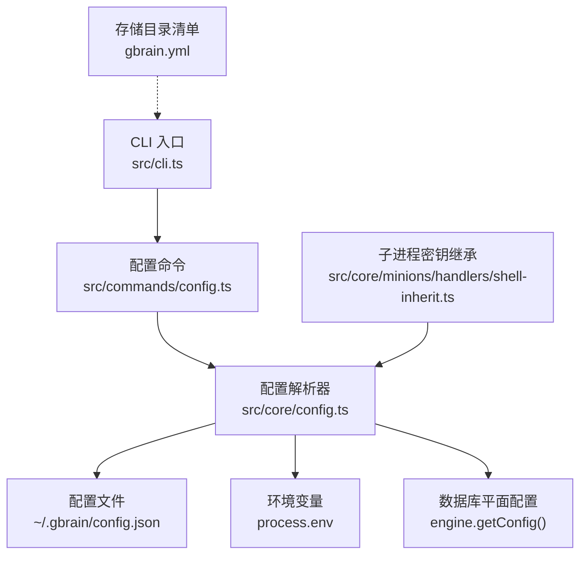
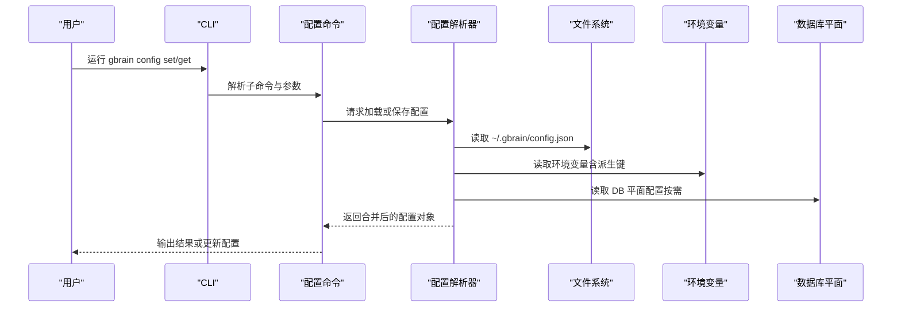
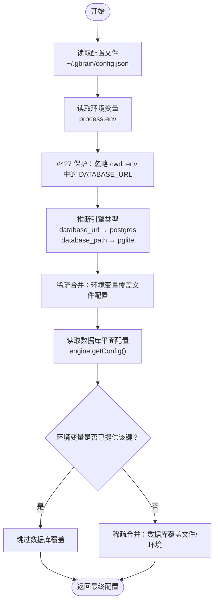
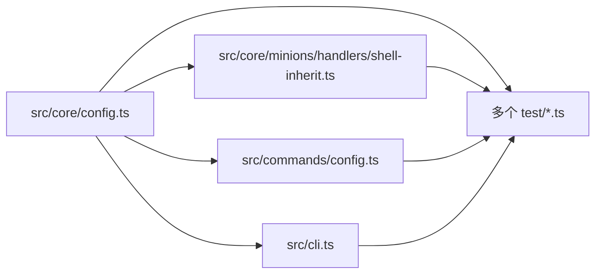

# 配置参数参考

<cite>
**本文档引用的文件**
- [src/core/config.ts](file://src/core/config.ts)
- [src/core/minions/handlers/shell-inherit.ts](file://src/core/minions/handlers/shell-inherit.ts)
- [src/commands/config.ts](file://src/commands/config.ts)
- [src/cli.ts](file://src/cli.ts)
- [gbrain.yml](file://gbrain.yml)
- [test/v0_37_gap_fill.serial.test.ts](file://test/v0_37_gap_fill.serial.test.ts)
- [test/loadConfig-merge.test.ts](file://test/loadConfig-merge.test.ts)
- [test/minions-shell-inherit.test.ts](file://test/minions-shell-inherit.test.ts)
- [test/ai/config-no-env-mutation.test.ts](file://test/ai/config-no-env-mutation.test.ts)
- [test/retrieval-upgrade-planner.test.ts](file://test/retrieval-upgrade-planner.test.ts)
</cite>

## 目录
1. [简介](#简介)
2. [项目结构](#项目结构)
3. [核心组件](#核心组件)
4. [架构总览](#架构总览)
5. [详细组件分析](#详细组件分析)
6. [依赖关系分析](#依赖关系分析)
7. [性能考量](#性能考量)
8. [故障排除指南](#故障排除指南)
9. [结论](#结论)
10. [附录](#附录)

## 简介
本参考文档系统性梳理 gbrain 的配置体系，覆盖配置文件、环境变量、数据库平面配置以及命令行工具的行为。内容包括：
- 所有配置项的分类、数据类型、默认值与有效范围
- 配置优先级（环境变量 > 文件配置 > 数据库平面配置）
- 继承关系与覆盖规则
- 验证、错误检查与故障排除
- 配置示例、最佳实践与安全建议
- 配置迁移、版本升级与兼容性指南

## 项目结构
与配置相关的核心文件与职责：
- 核心配置解析：src/core/config.ts
- 子进程密钥继承：src/core/minions/handlers/shell-inherit.ts
- 命令行配置子命令：src/commands/config.ts
- CLI 入口与薄客户端模式：src/cli.ts
- 存储目录清单：gbrain.yml
- 行为测试与回归用例：多个 test/*.ts

**图表来源**
- [src/cli.ts](file://src/cli.ts)
- [src/commands/config.ts](file://src/commands/config.ts)
- [src/core/config.ts](file://src/core/config.ts)
- [src/core/minions/handlers/shell-inherit.ts](file://src/core/minions/handlers/shell-inherit.ts)
- [gbrain.yml](file://gbrain.yml)

**章节来源**
- [src/core/config.ts](file://src/core/config.ts)
- [src/core/minions/handlers/shell-inherit.ts](file://src/core/minions/handlers/shell-inherit.ts)
- [src/commands/config.ts](file://src/commands/config.ts)
- [src/cli.ts](file://src/cli.ts)
- [gbrain.yml](file://gbrain.yml)

## 核心组件
- 配置模型与加载器
  - GBrainConfig 接口定义了所有可配置字段及其类型约束
  - loadConfig() 合并文件与环境变量，形成运行时配置
  - loadConfigWithEngine() 将数据库平面配置叠加到文件/环境之上
- 环境变量派生与继承
  - deriveEnvKey() 将配置键映射为对应的环境变量名
  - resolveInheritValue() 安全地从配置中解析继承值
- 命令行配置工具
  - 支持设置/取消设置配置键，内置已知键白名单与前缀提示
- 薄客户端模式
  - remote_mcp 字段指示是否以远程 MCP 模式运行，影响 CLI 分发行为

**章节来源**
- [src/core/config.ts](file://src/core/config.ts)
- [src/core/minions/handlers/shell-inherit.ts](file://src/core/minions/handlers/shell-inherit.ts)
- [src/commands/config.ts](file://src/commands/config.ts)

## 架构总览
配置解析的总体流程与优先级如下：

**图表来源**
- [src/commands/config.ts](file://src/commands/config.ts)
- [src/core/config.ts](file://src/core/config.ts)

## 详细组件分析

### 配置模型与字段定义
- 引擎与数据库
  - engine: 'postgres' | 'pglite'
  - database_url: string（环境变量优先）
  - database_path: string（仅 pglite）
- 大模型与嵌入
  - openai_api_key: string
  - anthropic_api_key: string
  - zeroentropy_api_key: string（v0.37+）
  - embedding_model: string（如 provider:model）
  - embedding_dimensions: number
  - embedding_disabled: boolean（延迟初始化模式）
  - expansion_model: string
  - chat_model: string（默认模型）
  - chat_fallback_chain: string[]（静默回退链）
  - provider_base_urls: Record<string, string>（兼容提供者基础 URL）
- 多模态与检索增强
  - embedding_multimodal: boolean
  - embedding_multimodal_model: string
  - embedding_image_ocr: boolean
  - embedding_image_ocr_model: string
  - embedding_columns: Record<string, EmbeddingColumnConfig>
  - search_embedding_column: string
- 内容健康度（v0.41）
  - content_sanity.bytes_warn: number
  - content_sanity.bytes_block: number
  - content_sanity.junk_patterns_enabled: boolean
  - content_sanity.disabled: boolean
  - content_sanity.junk_disposition: 'quarantine' | 'reject'
  - content_sanity.max_markup_ratio: number
  - content_sanity.prose_check_enabled: boolean
- 自动驾驶与维护
  - autopilot.nightly_quality_probe.enabled: boolean
  - autopilot.nightly_quality_probe.max_usd: number
  - autopilot.auto_drain.enabled: boolean
  - autopilot.auto_drain.window_seconds: number
  - autopilot.auto_drain.threshold: number
  - autopilot.auto_drain.max_usd_per_day: number
- 自我升级（v0.42）
  - self_upgrade.mode: 'auto' | 'notify' | 'off'
  - self_upgrade.mode_prompted: boolean
  - self_upgrade.quiet_hours: { start?: number; end?: number; tz?: string }
  - self_upgrade.failed_versions: string[]
  - self_upgrade.attempting_version: string
  - self_upgrade.last_check_ts: number
  - self_upgrade.last_applied_version: string
- 梦境周期（v0.41.2.1）
  - dream.synthesize.session_corpus_dir: string
  - dream.synthesize.meeting_transcripts_dir: string
  - dream.synthesize.verdict_model: string
  - dream.synthesize.max_prompt_tokens: number
  - dream.synthesize.max_chunks_per_transcript: number
  - dream.patterns.lookback_days: number
  - dream.patterns.min_evidence: number
- MCP 技能目录发布
  - mcp.publish_skills: boolean
  - mcp.publish_advisor: boolean
  - mcp.skills_dir: string
- 薄客户端模式
  - remote_mcp.issuer_url: string
  - remote_mcp.mcp_url: string
  - remote_mcp.oauth_client_id: string
  - remote_mcp.oauth_client_secret?: string
- 其他
  - storage: 未知类型（由 storage.ts 校验）
  - eval.capture: boolean
  - eval.scrub_pii: boolean
  - schema_pack: string（v0.38+）

**章节来源**
- [src/core/config.ts](file://src/core/config.ts)

### 环境变量与派生规则
- 环境变量派生
  - 默认：将配置键名大写作为环境变量名
  - 特例：database_url → GBRAIN_DATABASE_URL（避免与通用 DATABASE_URL 冲突）
- 可继承字段
  - 仅允许小写字母、数字与下划线，且必须以小写字母开头
  - 使用 Object.hasOwn 防止原型污染
- 值解析
  - 仅字符串且非空才视为有效
  - 对布尔型通过字符串 'true'/'false' 或 '1'/'0' 解析
  - 数字型通过 parseInt/parseFloat 解析并校验范围

**章节来源**
- [src/core/minions/handlers/shell-inherit.ts](file://src/core/minions/handlers/shell-inherit.ts)
- [test/minions-shell-inherit.test.ts](file://test/minions-shell-inherit.test.ts)

### 配置优先级与覆盖规则
- 文件平面（~/.gbrain/config.json）与环境变量
  - 环境变量始终优先于文件配置
  - 特殊保护：Bun 自动加载的 .env 中 DATABASE_URL 不被视为操作员提供，除非显式导出
- 数据库平面（engine.getConfig）
  - 仅对特定键生效（如多模态开关、OCR 开关、嵌入列注册表、搜索默认列等）
  - 仅在环境/文件未覆盖时生效
- 引擎推断
  - 若存在 DATABASE_URL（或 GBRAIN_DATABASE_URL），则强制使用 postgres
  - 若仅有 database_path，则推断为 pglite
- 合并策略
  - 环境变量层采用稀疏合并：仅当环境变量存在时覆盖对应键
  - 数据库平面层同样采用稀疏合并：仅当 DB 值存在且合法时填充

**图表来源**
- [src/core/config.ts](file://src/core/config.ts)

**章节来源**
- [src/core/config.ts](file://src/core/config.ts)
- [test/v0_37_gap_fill.serial.test.ts](file://test/v0_37_gap_fill.serial.test.ts)
- [test/loadConfig-merge.test.ts](file://test/loadConfig-merge.test.ts)

### 命令行配置工具
- 已知配置键白名单
  - 包括文件平面键与数据库平面键（如 search.*、models.*、dream.*、content_sanity.* 等）
  - 支持前缀通配：KNOWN_CONFIG_KEY_PREFIXES
- 错误与提示
  - 未知键会触发“Did you mean”建议或需要 --force 强制写入
  - 旧版 provider/model 形态会被迁移为 embedding_model
- 安全与权限
  - 配置文件权限被设置为 0600
  - 写入时确保 ~/.gbrain/.gitignore 存在，防止误提交

**章节来源**
- [src/commands/config.ts](file://src/commands/config.ts)
- [src/core/config.ts](file://src/core/config.ts)

### 薄客户端模式
- remote_mcp 字段存在即启用薄客户端模式
- CLI 在分发前检查该字段，拒绝任何需要本地数据库的操作
- OAuth 发现与工具调用分别指向不同路径，便于反向代理拓扑

**章节来源**
- [src/core/config.ts](file://src/core/config.ts)
- [src/cli.ts](file://src/cli.ts)

### 存储目录清单
- gbrain.yml 定义版本控制与仅数据库持久化的目录集合
- 用于同步与导出/恢复的指导

**章节来源**
- [gbrain.yml](file://gbrain.yml)

## 依赖关系分析
- 配置解析器依赖
  - 文件系统：读取 config.json、写入配置与 .gitignore
  - 环境变量：读取派生键与保护性忽略
  - 数据库：按需读取 DB 平面配置
- 子模块依赖
  - 子进程密钥继承依赖配置解析器提供的安全解析函数
  - CLI 依赖配置解析器判断薄客户端模式

**图表来源**
- [src/core/config.ts](file://src/core/config.ts)
- [src/core/minions/handlers/shell-inherit.ts](file://src/core/minions/handlers/shell-inherit.ts)
- [src/commands/config.ts](file://src/commands/config.ts)
- [src/cli.ts](file://src/cli.ts)

**章节来源**
- [src/core/config.ts](file://src/core/config.ts)
- [src/core/minions/handlers/shell-inherit.ts](file://src/core/minions/handlers/shell-inherit.ts)
- [src/commands/config.ts](file://src/commands/config.ts)
- [src/cli.ts](file://src/cli.ts)

## 性能考量
- 配置读取为一次性开销，通常在进程启动时完成
- 稀疏合并策略避免不必要的深拷贝与无效计算
- 数据库平面读取按需进行，失败静默处理，不影响主流程

## 故障排除指南
- 环境变量未生效
  - 确认使用正确的派生键名（database_url → GBRAIN_DATABASE_URL）
  - 检查是否存在 .env 中同名变量被自动加载而被 #427 保护忽略
- 配置未持久化
  - 确认 ~/.gbrain/config.json 权限为 0600
  - 确认未被 .gitignore 屏蔽（系统会在写入时确保 .gitignore 存在）
- 数据库平面配置不生效
  - 确认环境变量未覆盖该键
  - 确认 DB 值为合法格式（如整数、布尔、JSON 对象）
- 未知配置键报错
  - 使用 KNOWN_CONFIG_KEYS 列表中的键；必要时使用 --force
- 迁移与兼容
  - provider/model → embedding_model 的迁移已在配置解析中处理
  - 多模态与 OCR 等运行时开关位于 DB 平面，需通过 gbrain config set 设置

**章节来源**
- [src/core/config.ts](file://src/core/config.ts)
- [test/ai/config-no-env-mutation.test.ts](file://test/ai/config-no-env-mutation.test.ts)
- [test/v0_37_gap_fill.serial.test.ts](file://test/v0_37_gap_fill.serial.test.ts)
- [test/loadConfig-merge.test.ts](file://test/loadConfig-merge.test.ts)

## 结论
gbrain 的配置体系以“环境变量 > 文件配置 > 数据库平面配置”的清晰优先级为核心，辅以严格的派生规则、安全解析与稀疏合并策略，既保证了灵活性，又确保了可审计与可维护性。通过命令行工具与测试用例的配合，用户可以安全地进行配置变更、迁移与升级。

## 附录

### 配置项速查表
- 文件平面（GBrainConfig 静态字段）
  - engine、database_url、database_path、openai_api_key、anthropic_api_key、embedding_model、embedding_dimensions、embedding_disabled、expansion_model、chat_model、chat_fallback_chain、provider_base_urls、storage、eval、embedding_multimodal、embedding_multimodal_model、embedding_image_ocr、embedding_image_ocr_model、embedding_columns、search_embedding_column、remote_mcp、mcp、schema_pack、content_sanity、dream、self_upgrade 等
- 数据库平面（常见前缀）
  - search.*、models.*、dream.*、cycle.*、embedding_columns.*、provider_base_urls.*、content_sanity.*、mcp.*、autopilot.*、self_upgrade.*

**章节来源**
- [src/core/config.ts](file://src/core/config.ts)

### 配置示例与最佳实践
- 示例
  - 使用环境变量覆盖特定键（如 GBRAIN_EMBEDDING_MODEL）
  - 在 CI 环境中通过 DATABASE_URL 指定数据库（注意 #427 保护）
  - 通过 gbrain config set 设置 DB 平面键（如 search.mode）
- 最佳实践
  - 将敏感信息（API Key）置于环境变量而非文件
  - 使用 KNOWN_CONFIG_KEYS 与前缀提示，避免拼写错误
  - 对多模态与 OCR 等运行时开关，优先使用 DB 平面配置
- 安全建议
  - 保持配置文件权限为 0600
  - 使用 GBRAIN_HOME 管理多租户部署，确保绝对路径且不含 '..'
  - 避免在 .env 中暴露 DATABASE_URL，除非明确导出

**章节来源**
- [src/core/config.ts](file://src/core/config.ts)
- [src/core/minions/handlers/shell-inherit.ts](file://src/core/minions/handlers/shell-inherit.ts)

### 配置迁移与版本升级指南
- v0.37+ 迁移
  - provider/model → embedding_model 的自动迁移
  - zeroentropy_api_key 的引入与合并
- v0.41+ 迁移
  - content_sanity.* 的文件/环境/DB 平面统一
  - dream.* 的 DB 平面合并
- 升级后验证
  - 使用 doctor 命令检查 DB URL 来源与配置一致性
  - 通过测试用例验证优先级与覆盖规则

**章节来源**
- [src/core/config.ts](file://src/core/config.ts)
- [test/v0_37_gap_fill.serial.test.ts](file://test/v0_37_gap_fill.serial.test.ts)
- [test/loadConfig-merge.test.ts](file://test/loadConfig-merge.test.ts)