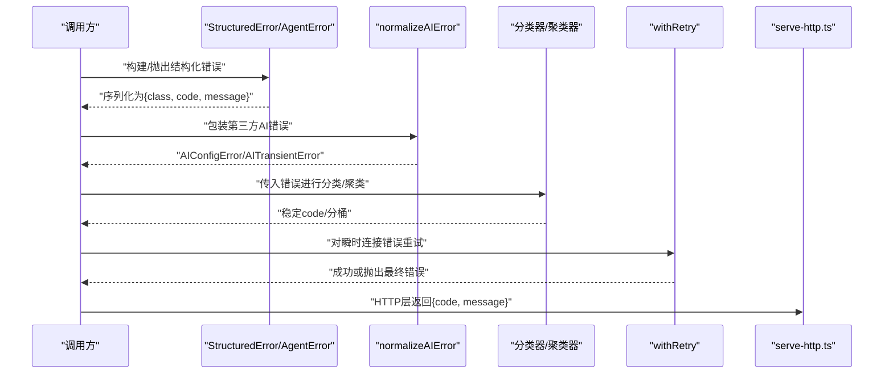
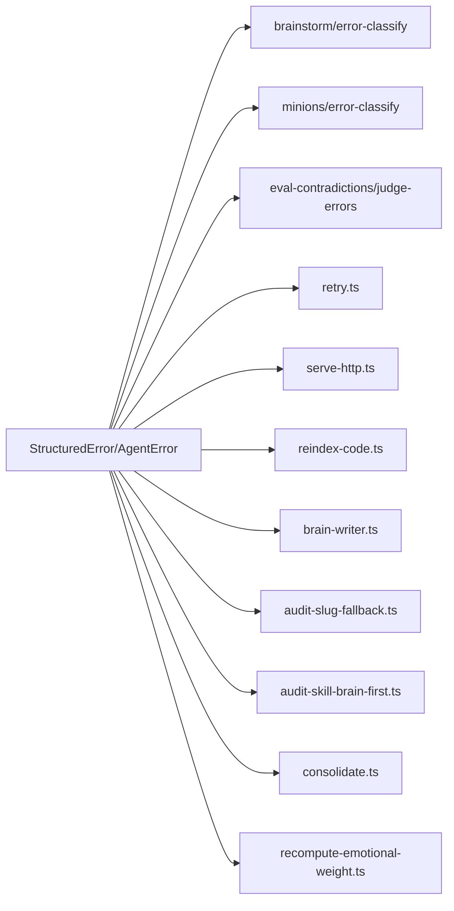

# 错误代码参考

<cite>
**本文引用的文件**
- [src/core/errors.ts](file://src/core/errors.ts)
- [src/core/ai/errors.ts](file://src/core/ai/errors.ts)
- [src/core/brainstorm/error-classify.ts](file://src/core/brainstorm/error-classify.ts)
- [src/core/minions/error-classify.ts](file://src/core/minions/error-classify.ts)
- [src/core/eval-contradictions/judge-errors.ts](file://src/core/eval-contradictions/judge-errors.ts)
- [src/core/retry.ts](file://src/core/retry.ts)
- [test/sync-failures.test.ts](file://test/sync-failures.test.ts)
- [test/mcp-client-hardening.test.ts](file://test/mcp-client-hardening.test.ts)
- [test/error-classify.test.ts](file://test/error-classify.test.ts)
- [test/errors.test.ts](file://test/errors.test.ts)
- [test/eval-contradictions-judge-errors.test.ts](file://test/eval-contradictions-judge-errors.test.ts)
- [src/commands/serve-http.ts](file://src/commands/serve-http.ts)
- [src/core/brain-writer.ts](file://src/core/brain-writer.ts)
- [src/core/audit-slug-fallback.ts](file://src/core/audit-slug-fallback.ts)
- [src/core/audit-skill-brain-first.ts](file://src/core/audit-skill-brain-first.ts)
- [src/core/cycle/phases/consolidate.ts](file://src/core/cycle/phases/consolidate.ts)
- [src/core/cycle/recompute-emotional-weight.ts](file://src/core/cycle/recompute-emotional-weight.ts)
- [src/commands/code-def.ts](file://src/commands/code-def.ts)
- [src/commands/code-callers.ts](file://src/commands/code-callers.ts)
- [src/commands/code-callees.ts](file://src/commands/code-callees.ts)
- [src/commands/code-refs.ts](file://src/commands/code-refs.ts)
- [src/commands/reindex-code.ts](file://src/commands/reindex-code.ts)
</cite>

## 目录
1. [简介](#简介)
2. [项目结构](#项目结构)
3. [核心组件](#核心组件)
4. [架构总览](#架构总览)
5. [详细组件分析](#详细组件分析)
6. [依赖关系分析](#依赖关系分析)
7. [性能考量](#性能考量)
8. [故障排查指南](#故障排查指南)
9. [结论](#结论)
10. [附录](#附录)

## 简介
本参考文档系统性梳理 gbrain 的错误体系，覆盖错误模型、分类、传播与重试、降级与自愈、监控与告警等全链路能力。目标是帮助开发者与运维人员快速定位问题、制定修复方案，并建立一致的错误处理与观测标准。

## 项目结构
围绕错误处理的关键模块与文件如下：
- 错误建模与序列化：src/core/errors.ts
- AI 服务错误归一化：src/core/ai/errors.ts
- 模块化错误分类器：
  - 思维风暴超时分类：src/core/brainstorm/error-classify.ts
  - 小鬼作业错误聚类：src/core/minions/error-classify.ts
  - 判决评估错误收集：src/core/eval-contradictions/judge-errors.ts
- 重试与退避：src/core/retry.ts
- 命令层错误输出示例：src/commands/serve-http.ts、src/commands/reindex-code.ts 等
- 审计与诊断：src/core/brain-writer.ts、src/core/audit-slug-fallback.ts、src/core/audit-skill-brain-first.ts、src/core/cycle/phases/consolidate.ts、src/core/cycle/recompute-emotional-weight.ts
- 测试用例：test/*.test.ts（验证错误分类、序列化、重试行为）

```mermaid
graph TB
subgraph "错误建模"
E["errors.ts<br/>StructuredError/StructuredAgentError/serializeError"]
end
subgraph "AI错误归一化"
AIE["ai/errors.ts<br/>normalizeAIError/AIConfigError/AITransientError"]
end
subgraph "错误分类"
BC["brainstorm/error-classify.ts<br/>classifyBrainstormError/isQueryCanceledError"]
MC["minions/error-classify.ts<br/>classifyJobError/clusterErrors"]
JE["eval-contradictions/judge-errors.ts<br/>JudgeErrorCollector/classifyError"]
end
subgraph "重试与退避"
RT["retry.ts<br/>withRetry/computeNextDelay/BULK_RETRY_OPTS"]
end
subgraph "命令层"
SH["serve-http.ts<br/>HTTP错误响应"]
RC["reindex-code.ts<br/>成本预览确认提示"]
end
subgraph "审计与诊断"
BW["brain-writer.ts<br/>写入修复码"]
AF["audit-slug-fallback.ts<br/>slug回退审计码"]
ASB["audit-skill-brain-first.ts<br/>技能-大脑优先审计码"]
CON["consolidate.ts<br/>扫描失败审计码"]
REW["recompute-emotional-weight.ts<br/>情感权重计算失败审计码"]
end
E --> AIE
E --> BC
E --> MC
E --> JE
E --> RT
E --> SH
E --> RC
E --> BW
E --> AF
E --> ASB
E --> CON
E --> REW
```

图表来源
- [src/core/errors.ts:1-94](file://src/core/errors.ts#L1-L94)
- [src/core/ai/errors.ts:1-72](file://src/core/ai/errors.ts#L1-L72)
- [src/core/brainstorm/error-classify.ts:1-71](file://src/core/brainstorm/error-classify.ts#L1-L71)
- [src/core/minions/error-classify.ts:1-144](file://src/core/minions/error-classify.ts#L1-L144)
- [src/core/eval-contradictions/judge-errors.ts:1-74](file://src/core/eval-contradictions/judge-errors.ts#L1-L74)
- [src/core/retry.ts:1-351](file://src/core/retry.ts#L1-L351)
- [src/commands/serve-http.ts:1513-1674](file://src/commands/serve-http.ts#L1513-L1674)
- [src/commands/reindex-code.ts:390-410](file://src/commands/reindex-code.ts#L390-L410)
- [src/core/brain-writer.ts:130-310](file://src/core/brain-writer.ts#L130-L310)
- [src/core/audit-slug-fallback.ts:30-75](file://src/core/audit-slug-fallback.ts#L30-L75)
- [src/core/audit-skill-brain-first.ts:40-220](file://src/core/audit-skill-brain-first.ts#L40-L220)
- [src/core/cycle/phases/consolidate.ts:80-90](file://src/core/cycle/phases/consolidate.ts#L80-L90)
- [src/core/cycle/recompute-emotional-weight.ts:95-110](file://src/core/cycle/recompute-emotional-weight.ts#L95-L110)

章节来源
- [src/core/errors.ts:1-94](file://src/core/errors.ts#L1-L94)
- [src/core/retry.ts:1-351](file://src/core/retry.ts#L1-L351)

## 核心组件
- 结构化错误模型
  - StructuredError：统一的错误载体，包含 class、code、message、hint、docs_url 字段，便于机器可读与人类可读并存。
  - StructuredAgentError：承载结构化错误的 Error 子类，用于在 CLI/JSON 场景中稳定输出。
  - serializeError：将任意异常序列化为结构化错误，未知异常回退到通用“unknown”。
- AI 错误归一化
  - normalizeAIError：根据状态码、名称与消息，将第三方 AI SDK 错误映射为 AIConfigError（用户可修复）、AITransientError（可重试）或 AIServiceError 基类。
- 错误分类与聚类
  - brainstorm 分类器：识别 Postgres SQLSTATE 57014（query_canceled），统一为“思维风暴超时”，并给出针对 statement_timeout、lock_timeout、user-cancel 的建议。
  - minions 聚类器：对小鬼作业失败进行稳定分桶（如 prompt_too_long、tool_schema_mismatch、malformed_json、auth、rate_limit、rate_lease_full、timeout、http_5xx、context_canceled、unknown），支持自动恢复集合与统计聚合。
  - 判决评估收集器：对矛盾评估中的错误进行分类与计数，确保错误不被隐藏在 stderr 中。
- 重试与退避
  - withRetry：基于 isRetryableConnError 的连接类瞬时错误重试；支持最大重试次数、基础延迟、最大延迟、抖动策略、中止信号、重连钩子、审计站点等。
  - computeNextDelay：三种抖动策略（无/全/去相关 AWS 风格），保证抖动下界与上界。
  - BULK_RETRY_OPTS：面向 Supavisor 的批量写入优化默认值，覆盖电路断路器恢复窗口。
- 命令层错误输出
  - serve-http.ts：在 HTTP 层返回标准化错误对象，包含 code 与 message，便于前端与工具链消费。
  - reindex-code.ts：成本预览前置确认提示，避免不必要的资源消耗。

章节来源
- [src/core/errors.ts:13-94](file://src/core/errors.ts#L13-L94)
- [src/core/ai/errors.ts:14-72](file://src/core/ai/errors.ts#L14-L72)
- [src/core/brainstorm/error-classify.ts:40-71](file://src/core/brainstorm/error-classify.ts#L40-L71)
- [src/core/minions/error-classify.ts:31-144](file://src/core/minions/error-classify.ts#L31-L144)
- [src/core/eval-contradictions/judge-errors.ts:18-74](file://src/core/eval-contradictions/judge-errors.ts#L18-L74)
- [src/core/retry.ts:246-351](file://src/core/retry.ts#L246-L351)
- [src/commands/serve-http.ts:1513-1674](file://src/commands/serve-http.ts#L1513-L1674)
- [src/commands/reindex-code.ts:390-410](file://src/commands/reindex-code.ts#L390-L410)

## 架构总览
错误处理贯穿“建模—归一化—分类—重试—上报/降级”的闭环：

图表来源
- [src/core/errors.ts:39-94](file://src/core/errors.ts#L39-L94)
- [src/core/ai/errors.ts:44-72](file://src/core/ai/errors.ts#L44-L72)
- [src/core/brainstorm/error-classify.ts:59-71](file://src/core/brainstorm/error-classify.ts#L59-L71)
- [src/core/minions/error-classify.ts:63-120](file://src/core/minions/error-classify.ts#L63-L120)
- [src/core/retry.ts:246-291](file://src/core/retry.ts#L246-L291)
- [src/commands/serve-http.ts:1513-1674](file://src/commands/serve-http.ts#L1513-L1674)

## 详细组件分析

### 结构化错误模型与序列化
- 设计要点
  - 统一字段：class（短类名）、code（稳定机器码）、message（一句话描述）、hint（可选建议）、docs_url（可选文档链接）。
  - 可抛出：StructuredAgentError 承载 envelope，CLI/JSON 输出时以 JSON 形式打印 error envelope。
  - 序列化：serializeError 对未知异常回退为 {class: "Error", code: "unknown"}，确保可观测性。
- 使用场景
  - 命令层、核心引擎、审计模块广泛使用 errorFor/buildError 构造结构化错误。
- 典型错误码
  - 见“附录：错误码清单”按模块索引。

章节来源
- [src/core/errors.ts:13-94](file://src/core/errors.ts#L13-L94)

### AI 错误归一化
- 分类规则
  - 4xx（除429）→ AIConfigError（用户配置类，非重试）
  - SDK 名称匹配（如 LoadAPIKeyError、InvalidArgumentError）→ AIConfigError
  - 其余（5xx、超时、网络）→ AITransientError（可重试）
- 上下文增强
  - normalizeAIError 支持附加 context 前缀，便于定位来源。

章节来源
- [src/core/ai/errors.ts:44-72](file://src/core/ai/errors.ts#L44-L72)

### 思维风暴超时分类
- 触发条件
  - Postgres SQLSTATE 57014（query_canceled）：statement_timeout、lock_timeout、user-cancel。
- 处理策略
  - 统一转换为 StructuredAgentError，code="brainstorm_timeout"，hint 覆盖三类子因，保持消息诚实。
- 适用范围
  - 在编排入口处包裹整个流程，自动覆盖内部所有 SQL 点位。

章节来源
- [src/core/brainstorm/error-classify.ts:34-71](file://src/core/brainstorm/error-classify.ts#L34-L71)

### 小鬼作业错误聚类与自修复
- 错误桶定义
  - prompt_too_long、tool_schema_mismatch、malformed_json、tool_crash、tool_unavailable、tool_permission、auth、rate_limit、rate_lease_full、timeout、http_5xx、context_canceled、unknown。
- 自修复集合
  - RECOVERABLE_CLUSTERS：仅允许语义安全的类型自动重试（如 prompt_too_long、tool_schema_mismatch、malformed_json）。
- 统计与采样
  - clusterErrors 对错误字符串进行稳定分桶，保留每个桶的样本 ID，便于定位具体任务。

章节来源
- [src/core/minions/error-classify.ts:31-144](file://src/core/minions/error-classify.ts#L31-L144)

### 判决评估错误收集
- 目标
  - 将错误计入总数，避免被静默隐藏；提供人类可读 note。
- 分类
  - parse_fail、refusal、timeout、http_5xx、unknown。
- 输出
  - JudgeErrorsCounts 包含各类计数与总数。

章节来源
- [src/core/eval-contradictions/judge-errors.ts:18-74](file://src/core/eval-contradictions/judge-errors.ts#L18-L74)

### 重试与退避策略
- 关键参数
  - maxRetries、delayMs、delayMaxMs、jitter（none/full/decorrelated）、onRetry、reconnect、signal、auditSite。
- 默认策略（BULK_RETRY_OPTS）
  - 面向 Supavisor 会话池的批量写入：3 次重试、1000ms 基础延迟、10000ms 上限、去相关抖动。
- 抖动算法
  - none：指数增长；full：均匀分布；decorrelated：AWS 风格区间 [base, prevDelay*3]。
- 中止与审计
  - 支持 AbortSignal 清洁中止；BATCH_AUDIT_SITES 限制审计站点，CI 校验防止漂移。
- 环境覆盖
  - 通过环境变量强制覆盖重试上限、基础延迟、最大延迟，错误时提供可直接粘贴的修复提示。

章节来源
- [src/core/retry.ts:75-176](file://src/core/retry.ts#L75-L176)
- [src/core/retry.ts:206-233](file://src/core/retry.ts#L206-L233)
- [src/core/retry.ts:246-291](file://src/core/retry.ts#L246-L291)
- [src/core/retry.ts:300-342](file://src/core/retry.ts#L300-L342)

### 命令层错误输出
- serve-http.ts
  - 返回标准化错误对象，包含 code 与 message，便于前端与工具链消费。
- reindex-code.ts
  - 成本预览前置确认提示，避免不必要的资源消耗。

章节来源
- [src/commands/serve-http.ts:1513-1674](file://src/commands/serve-http.ts#L1513-L1674)
- [src/commands/reindex-code.ts:390-410](file://src/commands/reindex-code.ts#L390-L410)

### 审计与诊断错误码
- 写入修复码
  - NULL_BYTES、MISSING_CLOSE、NESTED_QUOTES、SLUG_MISMATCH。
- slug 回退审计码
  - SLUG_FALLBACK_FRONTMATTER。
- 技能-大脑优先审计码
  - SKILL_BRAIN_FIRST。
- 合并阶段扫描失败
  - consolidate_scan_failed。
- 情感权重计算失败
  - RECOMPUTE_EMOTIONAL_WEIGHT_FAIL。

章节来源
- [src/core/brain-writer.ts:130-310](file://src/core/brain-writer.ts#L130-L310)
- [src/core/audit-slug-fallback.ts:30-75](file://src/core/audit-slug-fallback.ts#L30-L75)
- [src/core/audit-skill-brain-first.ts:40-220](file://src/core/audit-skill-brain-first.ts#L40-L220)
- [src/core/cycle/phases/consolidate.ts:80-90](file://src/core/cycle/phases/consolidate.ts#L80-L90)
- [src/core/cycle/recompute-emotional-weight.ts:95-110](file://src/core/cycle/recompute-emotional-weight.ts#L95-L110)

## 依赖关系分析
- 组件耦合
  - StructuredError/StructuredAgentError 是跨模块的统一契约，被命令层、核心引擎、审计模块广泛使用。
  - 分类器与聚类器依赖统一错误模型，形成稳定的错误分类生态。
  - 重试模块通过 isRetryableConnError 与连接错误识别解耦，支持多种重连策略。
- 外部依赖
  - AI SDK 错误通过 normalizeAIError 归一化，屏蔽 SDK 差异。
  - HTTP 层错误输出遵循统一 code/message 协议，便于前端与外部工具消费。

图表来源
- [src/core/errors.ts:39-94](file://src/core/errors.ts#L39-L94)
- [src/core/brainstorm/error-classify.ts:31](file://src/core/brainstorm/error-classify.ts#L31)
- [src/core/minions/error-classify.ts:31](file://src/core/minions/error-classify.ts#L31)
- [src/core/eval-contradictions/judge-errors.ts:13](file://src/core/eval-contradictions/judge-errors.ts#L13)
- [src/core/retry.ts:66](file://src/core/retry.ts#L66)
- [src/commands/serve-http.ts:1513-1674](file://src/commands/serve-http.ts#L1513-L1674)
- [src/commands/reindex-code.ts:390-410](file://src/commands/reindex-code.ts#L390-L410)
- [src/core/brain-writer.ts:130-310](file://src/core/brain-writer.ts#L130-L310)
- [src/core/audit-slug-fallback.ts:30-75](file://src/core/audit-slug-fallback.ts#L30-L75)
- [src/core/audit-skill-brain-first.ts:40-220](file://src/core/audit-skill-brain-first.ts#L40-L220)
- [src/core/cycle/phases/consolidate.ts:80-90](file://src/core/cycle/phases/consolidate.ts#L80-L90)
- [src/core/cycle/recompute-emotional-weight.ts:95-110](file://src/core/cycle/recompute-emotional-weight.ts#L95-L110)

## 性能考量
- 重试抖动策略
  - 推荐使用去相关抖动（decorrelated），避免近零延迟导致的“热断路器”再冲击与惊群效应。
- 延迟上限
  - BULK_RETRY_OPTS 的最大延迟应覆盖上游池恢复窗口（如 Supavisor 的 5-10s），避免过早放弃。
- 中止信号
  - 在长轮询/批处理中使用 AbortSignal，可在部署/停止时立即中止等待，减少资源浪费。
- 环境覆盖
  - 通过环境变量微调重试参数，避免在调试模式下禁用重试或设置过低阈值。

章节来源
- [src/core/retry.ts:206-233](file://src/core/retry.ts#L206-L233)
- [src/core/retry.ts:300-342](file://src/core/retry.ts#L300-L342)

## 故障排查指南
- 快速定位
  - 查看错误 envelope 的 code 与 hint，区分是否可重试、是否需要用户配置修正。
  - 若为 AI 错误，依据状态码与名称判断是配置类还是瞬时类。
- 常见路径
  - 连接瞬时错误：检查 isRetryableConnError 识别与重试策略，必要时启用 reconnect 钩子重建连接。
  - 思维风暴超时：聚焦 SQLSTATE 57014，调整 limit 或检查 PgBouncer 设置。
  - 小鬼作业失败：查看聚类结果，对可自修复桶（如 prompt_too_long）自动重试。
  - HTTP 层错误：确认 code/message 是否符合预期，避免静默失败。
- 日志与告警
  - 使用结构化错误输出，配合审计站点标签与环境变量覆盖，便于可观测性与自动化告警。
  - 对于严重或不可恢复错误，采用 fail-loud 策略，避免症状掩盖真实原因。

章节来源
- [src/core/ai/errors.ts:44-72](file://src/core/ai/errors.ts#L44-L72)
- [src/core/retry.ts:246-291](file://src/core/retry.ts#L246-L291)
- [src/core/brainstorm/error-classify.ts:59-71](file://src/core/brainstorm/error-classify.ts#L59-L71)
- [src/core/minions/error-classify.ts:63-120](file://src/core/minions/error-classify.ts#L63-L120)
- [src/commands/serve-http.ts:1513-1674](file://src/commands/serve-http.ts#L1513-L1674)

## 结论
通过统一的结构化错误模型、AI 错误归一化、模块化分类与聚类、稳健的重试与退避策略，以及完善的命令层与审计输出，gbrain 实现了从“可诊断—可重试—可降级—可观测”的完整错误处理闭环。建议在新功能接入时严格遵循该体系，确保一致性与可维护性。

## 附录

### 错误码清单与说明
- 通用结构化错误
  - code: "unknown"（未知错误）——当无法识别具体错误类别时使用。
  - code: "cost_preview_requires_yes"（成本预览需确认）——reindex-code 命令前置确认。
  - code: "invalid_source_pin"（无效源锚点）——code-callers/code-callees 命令要求符号/源锚点有效。
  - code: "code_def_requires_symbol"（缺少定义符号）——code-def 命令要求符号存在。
  - code: "code_refs_requires_symbol"（缺少引用符号）——code-refs 命令要求符号存在。
  - code: "unknown_operation"（未知操作）——serve-http.ts 返回未知操作错误。
  - code: "insufficient_scope"（权限不足）——serve-http.ts 返回作用域不足错误。
  - code: "op_error"（操作错误）——serve-http.ts 返回一般操作错误。
- 审计与诊断
  - code: "SKILL_BRAIN_FIRST"（技能-大脑优先）——技能包优先策略审计。
  - code: "SLUG_FALLBACK_FRONTMATTER"（slug 回退）——frontmatter 导航回退审计。
  - code: "consolidate_scan_failed"（合并扫描失败）——周期合并阶段扫描失败。
  - code: "RECOMPUTE_EMOTIONAL_WEIGHT_FAIL"（情感权重计算失败）——情感权重重算失败。
  - code: "NULL_BYTES"（空字节清理）——写入时清理空字节。
  - code: "MISSING_CLOSE"（缺失闭合）——写入时修复缺失闭合。
  - code: "NESTED_QUOTES"（嵌套引号）——写入时修复嵌套引号。
  - code: "SLUG_MISMATCH"（slug 不匹配）——slug 与期望不一致。
- 思维风暴超时
  - code: "brainstorm_timeout"（思维风暴超时）——SQLSTATE 57014 统一分类。
- 小鬼作业错误聚类
  - code: "prompt_too_long"（提示过长）
  - code: "tool_schema_mismatch"（工具参数不匹配）
  - code: "malformed_json"（JSON 格式错误）
  - code: "tool_crash"（工具崩溃）
  - code: "tool_unavailable"（工具不可用）
  - code: "tool_permission"（工具权限拒绝）
  - code: "auth"（认证失败）
  - code: "rate_limit"（速率限制）
  - code: "rate_lease_full"（内部速率租约已满）
  - code: "timeout"（本地超时）
  - code: "http_5xx"（上游 5xx）
  - code: "context_canceled"（上下文取消）
  - code: "unknown"（未知）
- AI 服务错误
  - code: "unknown"（未知）——normalizeAIError 回退。
- 同步/嵌入错误分类（测试覆盖）
  - code: "EMBEDDING_RATE_LIMIT"（嵌入速率限制）
  - code: "EMBEDDING_QUOTA"（配额不足）
  - code: "EMBEDDING_OVERSIZE"（输入过大）
  - code: "FILE_TOO_LARGE"（文件过大）
  - code: "STATEMENT_TIMEOUT"（语句超时）
- MCP 工具错误提取（测试覆盖）
  - code: "missing_scope"（作用域不足）

章节来源
- [src/commands/reindex-code.ts:390-410](file://src/commands/reindex-code.ts#L390-L410)
- [src/commands/code-callers.ts:60-120](file://src/commands/code-callers.ts#L60-L120)
- [src/commands/code-callees.ts:40-60](file://src/commands/code-callees.ts#L40-L60)
- [src/commands/code-def.ts:100-110](file://src/commands/code-def.ts#L100-L110)
- [src/commands/code-refs.ts:90-100](file://src/commands/code-refs.ts#L90-L100)
- [src/commands/serve-http.ts:1513-1674](file://src/commands/serve-http.ts#L1513-L1674)
- [src/core/audit-skill-brain-first.ts:40-220](file://src/core/audit-skill-brain-first.ts#L40-L220)
- [src/core/audit-slug-fallback.ts:30-75](file://src/core/audit-slug-fallback.ts#L30-L75)
- [src/core/cycle/phases/consolidate.ts:80-90](file://src/core/cycle/phases/consolidate.ts#L80-L90)
- [src/core/cycle/recompute-emotional-weight.ts:95-110](file://src/core/cycle/recompute-emotional-weight.ts#L95-L110)
- [src/core/brain-writer.ts:130-310](file://src/core/brain-writer.ts#L130-L310)
- [src/core/brainstorm/error-classify.ts:61-70](file://src/core/brainstorm/error-classify.ts#L61-L70)
- [src/core/minions/error-classify.ts:31-120](file://src/core/minions/error-classify.ts#L31-L120)
- [src/core/ai/errors.ts:44-72](file://src/core/ai/errors.ts#L44-L72)
- [test/sync-failures.test.ts:552-603](file://test/sync-failures.test.ts#L552-L603)
- [test/mcp-client-hardening.test.ts:122-147](file://test/mcp-client-hardening.test.ts#L122-L147)

### 错误传播与重试策略
- 传播原则
  - 可重试错误：通过 withRetry 传递，支持 reconnect 钩子与审计站点。
  - 不可重试错误：直接抛出，fail-loud 以暴露真实原因。
- 重试参数
  - maxRetries、delayMs、delayMaxMs、jitter、onRetry、reconnect、signal、auditSite。
- 环境覆盖
  - 通过环境变量强制覆盖重试参数，错误时提供可直接粘贴的修复提示。

章节来源
- [src/core/retry.ts:246-351](file://src/core/retry.ts#L246-L351)

### 降级处理与自愈
- 自愈集合
  - RECOVERABLE_CLUSTERS：prompt_too_long、tool_schema_mismatch、malformed_json。
- 降级策略
  - 对不可自愈错误，采用 fail-loud 并进入死信队列，确保问题可见。
- 重连钩子
  - reconnect 在每次重试前执行，失败则替换为真实错误，避免掩盖症状。

章节来源
- [src/core/minions/error-classify.ts:51-55](file://src/core/minions/error-classify.ts#L51-L55)
- [src/core/retry.ts:279-284](file://src/core/retry.ts#L279-L284)

### 监控、日志与告警
- 结构化输出
  - 使用 serializeError 输出统一格式，便于日志解析与告警。
- 审计站点
  - BATCH_AUDIT_SITES 限制审计站点，CI 校验防止漂移。
- 环境变量
  - 通过环境变量覆盖重试参数，便于在不同环境中微调。
- 命令层错误
  - serve-http.ts 返回标准化错误对象，便于前端与工具链消费。

章节来源
- [src/core/errors.ts:79-94](file://src/core/errors.ts#L79-L94)
- [src/core/retry.ts:75-103](file://src/core/retry.ts#L75-L103)
- [src/core/retry.ts:300-342](file://src/core/retry.ts#L300-L342)
- [src/commands/serve-http.ts:1513-1674](file://src/commands/serve-http.ts#L1513-L1674)

### 常见错误模式与预防
- 模式
  - 连接瞬时错误未重试或重试策略不当。
  - AI 错误未归一化，导致分支逻辑复杂。
  - 错误被静默隐藏，影响评估与诊断。
  - 重试参数不当，导致资源浪费或失败扩大。
- 预防
  - 统一使用 StructuredError/StructuredAgentError。
  - 使用 normalizeAIError 归一化 AI 错误。
  - 使用 JudgeErrorCollector 记录并统计错误。
  - 使用 withRetry 并合理配置重试参数与抖动策略。

章节来源
- [src/core/errors.ts:39-94](file://src/core/errors.ts#L39-L94)
- [src/core/ai/errors.ts:44-72](file://src/core/ai/errors.ts#L44-L72)
- [src/core/eval-contradictions/judge-errors.ts:44-74](file://src/core/eval-contradictions/judge-errors.ts#L44-L74)
- [src/core/retry.ts:246-291](file://src/core/retry.ts#L246-L291)

### 最佳实践
- 新增错误时
  - 明确 class 与 code，提供简洁 message 与可选 hint/docs_url。
  - 对可重试错误使用 withRetry，对瞬时连接错误使用 isRetryableConnError。
  - 对 AI 错误使用 normalizeAIError，明确区分配置类与瞬时类。
- 诊断与修复
  - 优先查看 code 与 hint，结合审计站点与环境变量定位根因。
  - 对小鬼作业失败，利用聚类结果与自修复集合快速恢复。
- 文档与测试
  - 在测试中覆盖错误分类与序列化行为，确保回归稳定。

章节来源
- [src/core/errors.ts:39-94](file://src/core/errors.ts#L39-L94)
- [src/core/retry.ts:246-351](file://src/core/retry.ts#L246-L351)
- [src/core/ai/errors.ts:44-72](file://src/core/ai/errors.ts#L44-L72)
- [src/core/minions/error-classify.ts:63-120](file://src/core/minions/error-classify.ts#L63-L120)