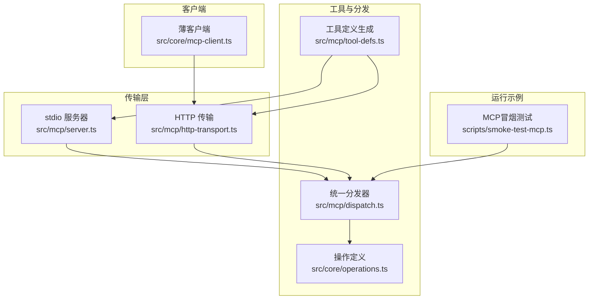
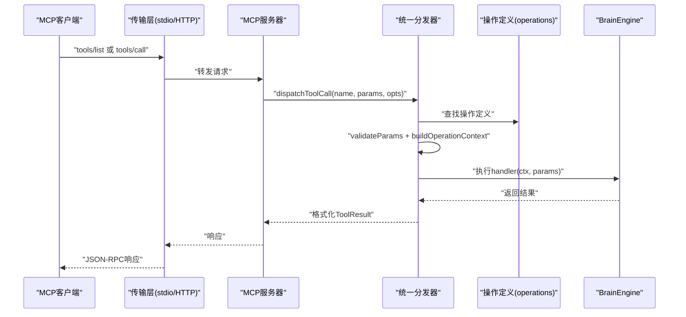
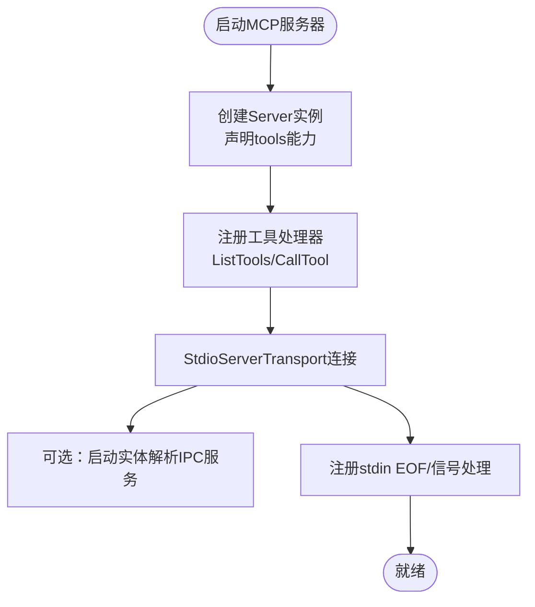
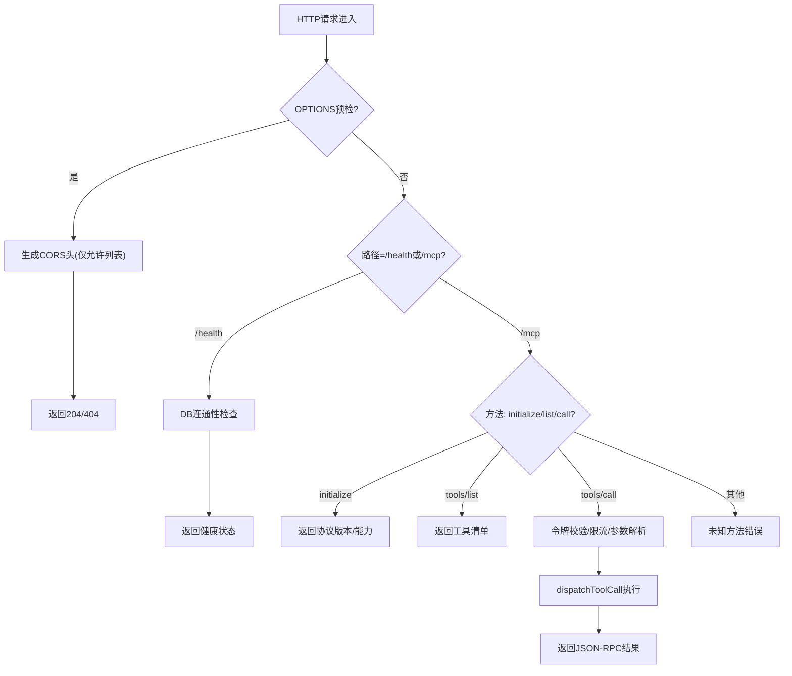
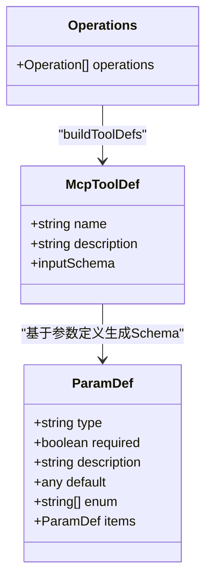
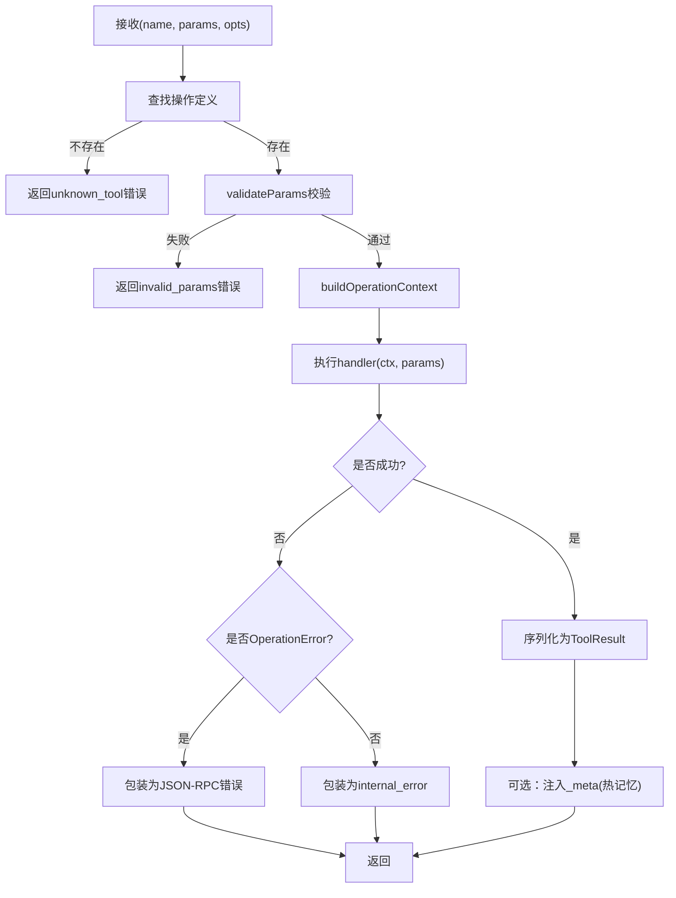
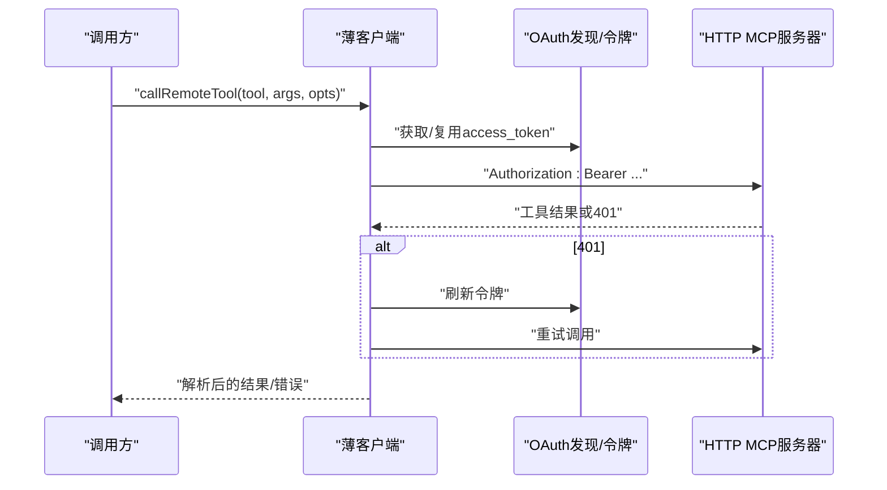
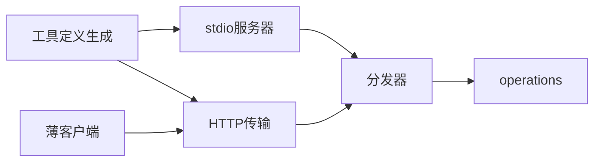

# MCP协议概述

<cite>
**本文档引用的文件**
- [src/mcp/server.ts](file://src/mcp/server.ts)
- [src/mcp/tool-defs.ts](file://src/mcp/tool-defs.ts)
- [src/mcp/dispatch.ts](file://src/mcp/dispatch.ts)
- [src/mcp/http-transport.ts](file://src/mcp/http-transport.ts)
- [src/mcp/rate-limit.ts](file://src/mcp/rate-limit.ts)
- [src/core/operations.ts](file://src/core/operations.ts)
- [src/core/mcp-client.ts](file://src/core/mcp-client.ts)
- [scripts/smoke-test-mcp.ts](file://scripts/smoke-test-mcp.ts)
- [docs/mcp/DEPLOY.md](file://docs/mcp/DEPLOY.md)
- [docs/mcp/CLAUDE_CODE.md](file://docs/mcp/CLAUDE_CODE.md)
- [docs/mcp/ALTERNATIVES.md](file://docs/mcp/ALTERNATIVES.md)
</cite>

## 目录
1. [简介](#简介)
2. [项目结构](#项目结构)
3. [核心组件](#核心组件)
4. [架构总览](#架构总览)
5. [详细组件分析](#详细组件分析)
6. [依赖关系分析](#依赖关系分析)
7. [性能考量](#性能考量)
8. [故障排查指南](#故障排查指南)
9. [结论](#结论)
10. [附录](#附录)

## 简介
本文件对GBrain中实现的MCP（Model Context Protocol）协议进行系统化概述，涵盖协议核心概念、架构设计、在GBrain中的实现方式与工作原理。重点说明工具定义、请求响应机制、传输层差异（stdio与HTTP）、服务器启动流程、工具注册机制、参数验证系统，以及与传统HTTP API的区别与优势。同时给出版本兼容性、扩展机制与未来发展方向，并提供协议规范的技术细节与实现约束。

## 项目结构
MCP相关代码主要分布在以下模块：
- 传输层：stdio MCP服务器与HTTP MCP服务器
- 工具定义与分发：工具Schema生成、参数校验、操作上下文构建与统一分发
- 客户端：薄客户端模式下的远程MCP调用封装
- 运行时操作：所有可被MCP调用的操作定义与处理逻辑
- 文档与部署：官方部署指南与客户端连接说明

**图表来源**
- [src/mcp/server.ts:18-123](file://src/mcp/server.ts#L18-L123)
- [src/mcp/http-transport.ts:139-420](file://src/mcp/http-transport.ts#L139-L420)
- [src/mcp/tool-defs.ts:40-55](file://src/mcp/tool-defs.ts#L40-L55)
- [src/mcp/dispatch.ts:222-283](file://src/mcp/dispatch.ts#L222-L283)
- [src/core/operations.ts:589-619](file://src/core/operations.ts#L589-L619)
- [src/core/mcp-client.ts:283-374](file://src/core/mcp-client.ts#L283-L374)
- [scripts/smoke-test-mcp.ts:31-90](file://scripts/smoke-test-mcp.ts#L31-L90)

**章节来源**
- [src/mcp/server.ts:18-123](file://src/mcp/server.ts#L18-L123)
- [src/mcp/http-transport.ts:139-420](file://src/mcp/http-transport.ts#L139-L420)
- [src/mcp/tool-defs.ts:40-55](file://src/mcp/tool-defs.ts#L40-L55)
- [src/mcp/dispatch.ts:222-283](file://src/mcp/dispatch.ts#L222-L283)
- [src/core/operations.ts:589-619](file://src/core/operations.ts#L589-L619)
- [src/core/mcp-client.ts:283-374](file://src/core/mcp-client.ts#L283-L374)
- [scripts/smoke-test-mcp.ts:31-90](file://scripts/smoke-test-mcp.ts#L31-L90)

## 核心组件
- MCP服务器（stdio）
  - 初始化Server实例，声明能力为工具（tools），注册工具列表与工具调用处理器
  - 统一通过dispatchToolCall执行，支持远端/受信任场景差异、源隔离、元数据注入等
- HTTP传输（内置）
  - 提供JSON-RPC风格的/MCP端点，支持初始化、工具列表、工具调用
  - 内置认证（Bearer令牌或OAuth 2.1）、CORS、速率限制、请求体大小限制、审计日志
- 工具定义生成
  - 将operations中声明的参数定义映射为MCP输入Schema，确保HTTP与stdio路径一致
- 统一分发器
  - 参数类型校验、OperationContext构建、错误格式化、结果序列化、元数据注入
- 操作定义（Operations）
  - 所有MCP可用操作的契约式定义，含参数、权限范围、处理函数与CLI提示
- 薄客户端
  - 基于SDK的HTTP客户端，支持OAuth 2.1客户端凭证授权、令牌缓存、401重试与错误归一化

**章节来源**
- [src/mcp/server.ts:18-123](file://src/mcp/server.ts#L18-L123)
- [src/mcp/http-transport.ts:139-420](file://src/mcp/http-transport.ts#L139-L420)
- [src/mcp/tool-defs.ts:30-55](file://src/mcp/tool-defs.ts#L30-L55)
- [src/mcp/dispatch.ts:14-283](file://src/mcp/dispatch.ts#L14-L283)
- [src/core/operations.ts:589-619](file://src/core/operations.ts#L589-L619)
- [src/core/mcp-client.ts:283-374](file://src/core/mcp-client.ts#L283-L374)

## 架构总览
MCP在GBrain中采用“双传输层 + 单一分发内核”的设计，确保stdio与HTTP两种接入方式共享同一套工具定义、参数校验、上下文构建与错误处理逻辑，避免协议实现漂移。

**图表来源**
- [src/mcp/server.ts:36-55](file://src/mcp/server.ts#L36-L55)
- [src/mcp/dispatch.ts:222-283](file://src/mcp/dispatch.ts#L222-L283)
- [src/core/operations.ts:589-619](file://src/core/operations.ts#L589-L619)

## 详细组件分析

### MCP服务器（stdio）
- 启动流程
  - 创建Server实例，声明能力为tools
  - 注册ListTools与CallTool处理器，使用buildToolDefs从operations生成工具清单
  - 通过StdioServerTransport建立连接
  - 在PGLite脑上启动实体解析IPC服务（可选，best-effort）
  - 注册stdin EOF与信号处理，优雅关闭
- 远端安全与源隔离
  - 默认remote=true，takesHoldersAllowList=['world']
  - 支持metaHook注入热记忆元数据
- 备注
  - 该函数也暴露handleToolCall以供本地CLI直接调用（trusted path）

**图表来源**
- [src/mcp/server.ts:18-123](file://src/mcp/server.ts#L18-L123)

**章节来源**
- [src/mcp/server.ts:18-123](file://src/mcp/server.ts#L18-L123)

### HTTP传输（内置）
- 能力与端点
  - /health：健康检查，同时探测数据库可达性
  - /mcp：JSON-RPC端点，支持initialize、notifications/initialized、tools/list、tools/call
- 认证与授权
  - Bearer令牌（遗留路径）或OAuth 2.1（推荐）
  - per-token takes_holder白名单、source隔离、federated_read支持
- 安全与硬核
  - CORS默认拒绝，允许列表由环境变量配置
  - 两段式速率限制（IP桶+令牌桶）
  - 请求体大小上限、last_used_at防抖更新
  - mcp_request_log记录请求摘要（默认脱敏）
- 错误处理
  - 对未知方法、解析失败、令牌无效、速率限制等返回标准化JSON-RPC错误

**图表来源**
- [src/mcp/http-transport.ts:244-404](file://src/mcp/http-transport.ts#L244-L404)

**章节来源**
- [src/mcp/http-transport.ts:139-420](file://src/mcp/http-transport.ts#L139-L420)

### 工具定义与Schema生成
- 参数到Schema映射
  - 支持基础类型、枚举、默认值、数组(items递归)
  - 保证HTTP与stdio路径的Schema一致性，避免回归
- 工具清单
  - 遍历operations，生成name/description/inputSchema（properties/required）

**图表来源**
- [src/mcp/tool-defs.ts:30-55](file://src/mcp/tool-defs.ts#L30-L55)
- [src/core/operations.ts:216-223](file://src/core/operations.ts#L216-L223)

**章节来源**
- [src/mcp/tool-defs.ts:30-55](file://src/mcp/tool-defs.ts#L30-L55)
- [src/core/operations.ts:216-223](file://src/core/operations.ts#L216-L223)

### 统一分发器（核心）
- 功能职责
  - 参数校验（validateParams）
  - OperationContext构建（引擎、配置、日志、dryRun、remote、takesHoldersAllowList、sourceId、auth）
  - 结果格式化（ToolResult：content数组，isError标记，_meta可选）
  - 元数据注入（best-effort，如热记忆）
  - 错误处理（OperationError与非OperationError统一JSON-RPC形状）
- 安全与隐私
  - 参数摘要（summarizeMcpParams）用于审计日志，默认脱敏，保护隐私
  - 对unknown keys计数但不命名，按1KB桶化approx_bytes，防止侧信道

**图表来源**
- [src/mcp/dispatch.ts:170-283](file://src/mcp/dispatch.ts#L170-L283)

**章节来源**
- [src/mcp/dispatch.ts:14-283](file://src/mcp/dispatch.ts#L14-L283)

### 操作定义（Operations）
- 设计原则
  - 契约优先：统一定义参数、处理函数、CLI提示
  - 权限模型：read/write/admin及扩展域（如sources_admin/users_admin）
  - 上下文感知：remote、sourceId、takesHoldersAllowList、auth等
- 典型操作
  - CRUD类：get_page、put_page、list_pages、search、query、delete_page、add_tag/get_tags
  - 图/时间线：add_link、get_links、add_timeline_entry、get_backlinks
  - 热记忆/事实：extract_facts、recall、forget_fact、find_contractions等
- 安全与合规
  - 严格参数校验与路径/文件名白名单
  - 远端调用自动剥离敏感内容（如私有takes/facts）

**章节来源**
- [src/core/operations.ts:589-619](file://src/core/operations.ts#L589-L619)
- [src/core/operations.ts:623-722](file://src/core/operations.ts#L623-L722)
- [src/core/operations.ts:724-800](file://src/core/operations.ts#L724-L800)

### 薄客户端（Thin Client）
- 场景
  - 远程薄客户端模式，通过OAuth 2.1客户端凭证授权访问HTTP MCP
- 能力
  - 自动发现OAuth端点、令牌缓存与过期安全边界
  - 401后自动刷新并重试一次
  - 错误归一化（RemoteMcpError），区分网络/鉴权/工具错误
  - 可选超时与外部AbortSignal组合

**图表来源**
- [src/core/mcp-client.ts:283-374](file://src/core/mcp-client.ts#L283-L374)

**章节来源**
- [src/core/mcp-client.ts:283-374](file://src/core/mcp-client.ts#L283-L374)

### 速率限制（HTTP）
- 两桶策略
  - IP桶：预认证阶段限制暴力破解
  - 令牌桶：认证后限制滥用
- 实现要点
  - 基于令牌桶+LRU，窗口与容量可配置
  - TTL清理与LRU淘汰，防止键空间膨胀
  - 返回Retry-After与剩余配额

**章节来源**
- [src/mcp/rate-limit.ts:46-143](file://src/mcp/rate-limit.ts#L46-L143)

### 启动与工具注册机制
- stdio
  - 通过buildToolDefs一次性生成工具清单；工具调用经dispatchToolCall统一处理
- HTTP
  - /mcp/tools/list直接返回工具清单；/mcp/tools/call委托dispatchToolCall
- 参数验证
  - 两端共享validateParams，确保行为一致

**章节来源**
- [src/mcp/server.ts:27-55](file://src/mcp/server.ts#L27-L55)
- [src/mcp/http-transport.ts:366-396](file://src/mcp/http-transport.ts#L366-L396)
- [src/mcp/dispatch.ts:170-187](file://src/mcp/dispatch.ts#L170-L187)

### 与传统HTTP API的区别与优势
- 协议一致性
  - 通过统一分发器，stdio与HTTP共享同一套工具定义、参数校验、上下文与错误格式
- 安全模型
  - HTTP内置OAuth 2.1、CORS、速率限制、请求体上限、审计日志；stdio面向本地可信进程
- 可观测性
  - mcp_request_log与实时SSE活动流，结合脱敏参数摘要
- 可扩展性
  - 新增工具只需在operations中定义，自动出现在tools/list；无需重复维护Schema

**章节来源**
- [src/mcp/dispatch.ts:14-283](file://src/mcp/dispatch.ts#L14-L283)
- [src/mcp/http-transport.ts:139-420](file://src/mcp/http-transport.ts#L139-L420)

### 版本兼容性、扩展机制与未来方向
- 版本与协议
  - HTTP传输在initialize中声明协议版本字符串，便于演进
- 扩展机制
  - 新增Operation：在operations.ts中添加新操作，自动纳入工具清单
  - 新增传输：保持dispatchToolCall契约不变即可接入
- 未来方向
  - 强化OAuth 2.1能力（DCR、更细粒度scope）
  - 更丰富的元数据注入与热记忆联动
  - 增强薄客户端的可观测性与调试能力

**章节来源**
- [src/mcp/http-transport.ts:344-357](file://src/mcp/http-transport.ts#L344-L357)
- [src/core/operations.ts:589-619](file://src/core/operations.ts#L589-L619)

## 依赖关系分析
- 低耦合高内聚
  - 传输层仅负责请求路由与响应封装，核心逻辑集中在dispatch与operations
- 关键依赖链
  - server.ts/http-transport.ts → dispatch.ts → operations.ts
  - tool-defs.ts为两端共享的Schema生成器
  - mcp-client.ts依赖OAuth发现与令牌端点

**图表来源**
- [src/mcp/server.ts:27-55](file://src/mcp/server.ts#L27-L55)
- [src/mcp/http-transport.ts:151-151](file://src/mcp/http-transport.ts#L151-L151)
- [src/mcp/dispatch.ts:222-283](file://src/mcp/dispatch.ts#L222-L283)
- [src/core/operations.ts:589-619](file://src/core/operations.ts#L589-L619)
- [src/core/mcp-client.ts:283-374](file://src/core/mcp-client.ts#L283-L374)

**章节来源**
- [src/mcp/server.ts:27-55](file://src/mcp/server.ts#L27-L55)
- [src/mcp/http-transport.ts:151-151](file://src/mcp/http-transport.ts#L151-L151)
- [src/mcp/dispatch.ts:222-283](file://src/mcp/dispatch.ts#L222-L283)
- [src/core/operations.ts:589-619](file://src/core/operations.ts#L589-L619)
- [src/core/mcp-client.ts:283-374](file://src/core/mcp-client.ts#L283-L374)

## 性能考量
- 速率限制
  - IP桶与令牌桶双重保护，避免暴力破解与滥用
- 请求体上限
  - 流式读取并计数，支持chunked传输，防止内存膨胀
- 日志与审计
  - 参数摘要脱敏，避免隐私泄露与侧信道攻击
- 连接与生命周期
  - stdio优雅关闭，避免孤儿进程与锁竞争

**章节来源**
- [src/mcp/http-transport.ts:92-122](file://src/mcp/http-transport.ts#L92-L122)
- [src/mcp/rate-limit.ts:46-143](file://src/mcp/rate-limit.ts#L46-L143)
- [src/mcp/dispatch.ts:128-168](file://src/mcp/dispatch.ts#L128-L168)
- [src/mcp/server.ts:98-123](file://src/mcp/server.ts#L98-L123)

## 故障排查指南
- 常见问题定位
  - /health不可达：检查数据库连接与网络
  - 401/invalid_token：确认Bearer令牌或OAuth授权流程
  - 429/Too many requests：查看Retry-After，调整速率限制
  - 413/payload_too_large：降低请求体大小或调整上限
  - unknown_method：确认JSON-RPC方法名称正确
- 远端薄客户端
  - 401后自动刷新一次；若仍失败，检查client_id/secret与scope
  - 使用unpackToolResult解析工具结果，注意content形状
- 冒烟测试
  - 使用scripts/smoke-test-mcp.ts验证get_stats、put_page、get_page、dry_run、search、list_pages、add_tag/get_tags、delete_page等

**章节来源**
- [src/mcp/http-transport.ts:257-404](file://src/mcp/http-transport.ts#L257-L404)
- [src/core/mcp-client.ts:283-374](file://src/core/mcp-client.ts#L283-L374)
- [scripts/smoke-test-mcp.ts:31-90](file://scripts/smoke-test-mcp.ts#L31-L90)

## 结论
GBrain的MCP实现以“双传输层 + 单一分发内核”为核心，确保stdio与HTTP在工具定义、参数校验、上下文构建与错误处理上的高度一致性。通过严格的认证与安全控制、速率限制与脱敏审计、以及清晰的扩展机制，MCP在易用性与安全性之间取得平衡，并为未来增强OAuth能力与可观测性提供了坚实基础。

## 附录
- 部署与连接参考
  - 远程部署与OAuth 2.1设置、CORS与速率限制、客户端连接示例
- 客户端连接指南
  - Claude Code、Claude Desktop、Perplexity等客户端的连接步骤与注意事项

**章节来源**
- [docs/mcp/DEPLOY.md:16-285](file://docs/mcp/DEPLOY.md#L16-L285)
- [docs/mcp/CLAUDE_CODE.md:8-91](file://docs/mcp/CLAUDE_CODE.md#L8-L91)
- [docs/mcp/ALTERNATIVES.md:1-68](file://docs/mcp/ALTERNATIVES.md#L1-L68)