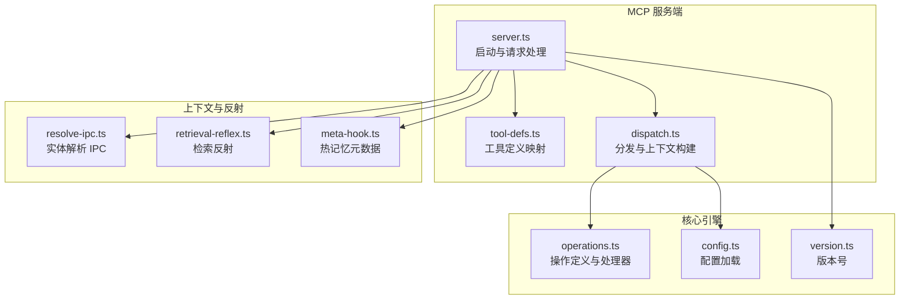
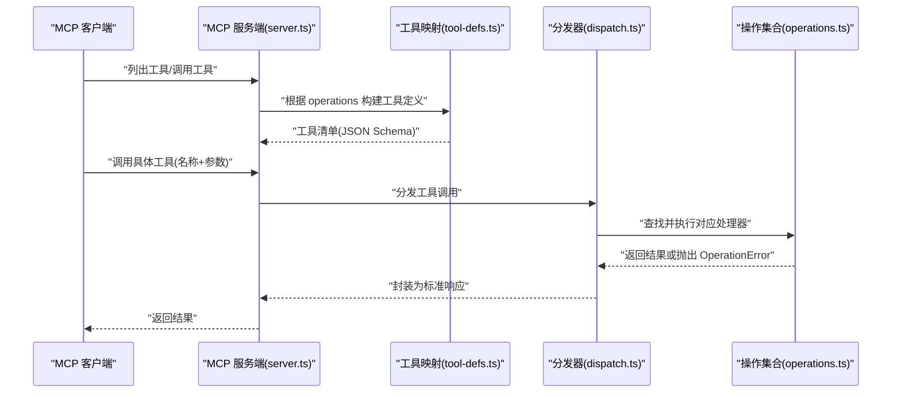
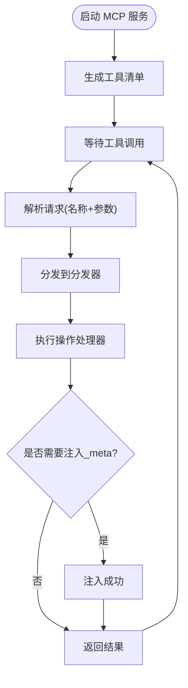
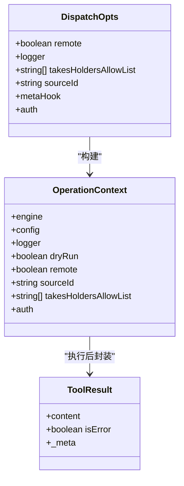
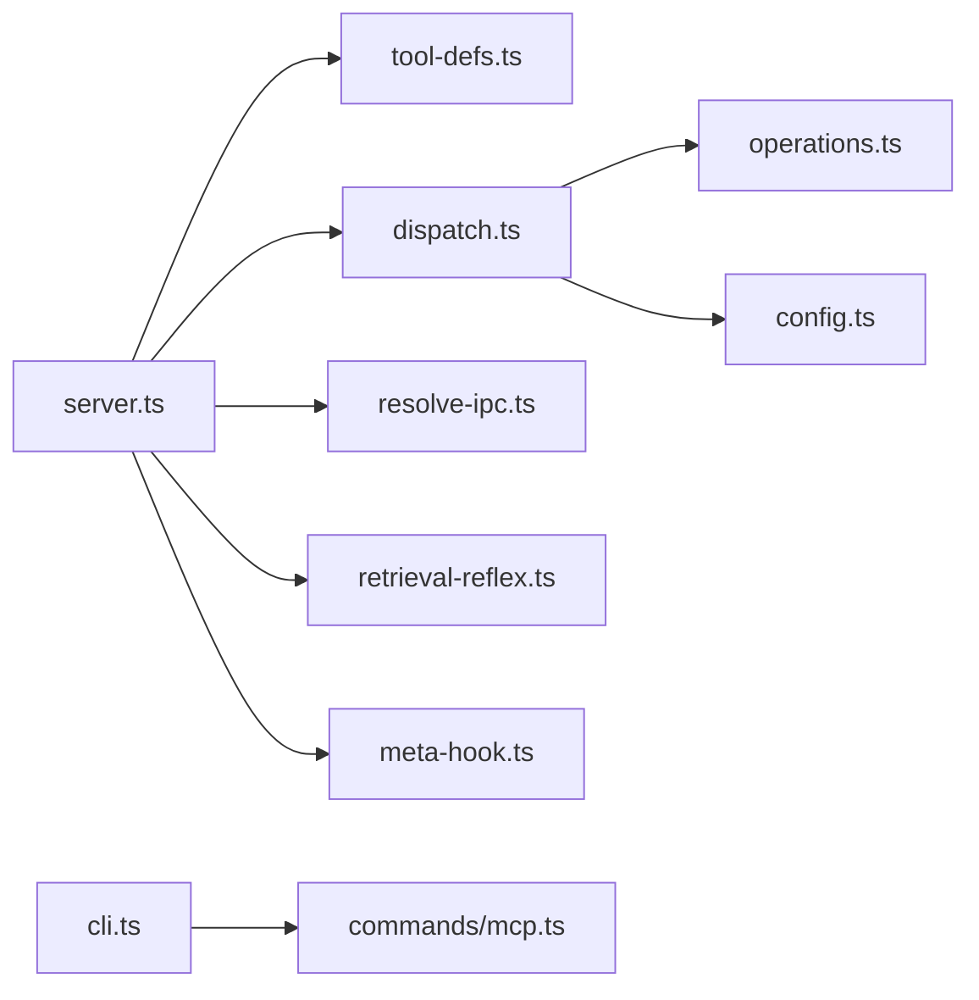

# MCP协议集成

<cite>
**本文档引用的文件**
- [README.md](file://README.md)
- [scripts/smoke-test-mcp.ts](file://scripts/smoke-test-mcp.ts)
- [src/mcp/server.ts](file://src/mcp/server.ts)
- [src/mcp/tool-defs.ts](file://src/mcp/tool-defs.ts)
- [src/mcp/dispatch.ts](file://src/mcp/dispatch.ts)
- [src/core/operations.ts](file://src/core/operations.ts)
- [docs/mcp/CLAUDE_CODE.md](file://docs/mcp/CLAUDE_CODE.md)
- [docs/mcp/CODEX.md](file://docs/mcp/CODEX.md)
- [docs/mcp/CLAUDE_DESKTOP.md](file://docs/mcp/CLAUDE_DESKTOP.md)
- [docs/mcp/CLAUDE_COWORK.md](file://docs/mcp/CLAUDE_COWORK.md)
- [docs/mcp/PERPLEXITY.md](file://docs/mcp/PERPLEXITY.md)
- [docs/mcp/CHATGPT.md](file://docs/mcp/CHATGPT.md)
- [src/commands/mcp.ts](file://src/commands/mcp.ts)
- [src/cli.ts](file://src/cli.ts)
- [src/core/config.ts](file://src/core/config.ts)
- [src/core/context/resolve-ipc.ts](file://src/core/context/resolve-ipc.ts)
- [src/core/context/retrieval-reflex.ts](file://src/core/context/retrieval-reflex.ts)
- [src/core/facts/meta-hook.ts](file://src/core/facts/meta-hook.ts)
- [src/version.ts](file://src/version.ts)
- [SECURITY.md](file://SECURITY.md)
- [docs/INSTALL.md](file://docs/INSTALL.md)
- [docs/ENGINES.md](file://docs/ENGINES.md)
- [recipes/ngrok-tunnel.md](file://recipes/ngrok-tunnel.md)
- [recipes/twilio-voice-brain.md](file://recipes/twilio-voice-brain.md)
- [docs/integrations/meeting-webhooks.md](file://docs/integrations/meeting-webhooks.md)
- [docs/integrations/credential-gateway.md](file://docs/integrations/credential-gateway.md)
- [docs/architecture/topologies.md](file://docs/architecture/topologies.md)
- [docs/architecture/brains-and-sources.md](file://docs/architecture/brains-and-sources.md)
- [docs/architecture/RETRIEVAL.md](file://docs/architecture/RETRIEVAL.md)
- [docs/architecture/serve-sync-concurrency.md](file://docs/architecture/serve-sync-concurrency.md)
- [docs/what-schemas-unlock.md](file://docs/what-schemas-unlock.md)
- [docs/schema-author-tutorial.md](file://docs/schema-author-tutorial.md)
- [docs/skillpack-anatomy.md](file://docs/skillpack-anatomy.md)
- [skills/RESOLVER.md](file://skills/RESOLVER.md)
- [examples/skillpack-reference/README.md](file://examples/skillpack-reference/README.md)
- [examples/skillpack-reference/skillpack.json](file://examples/skillpack-reference/skillpack.json)
- [examples/skillpack-reference/skills/reference-pack/README.md](file://examples/skillpack-reference/skills/reference-pack/README.md)
- [test/e2e/mcp.test.ts](file://test/e2e/mcp.test.ts)
</cite>

## 目录
1. [简介](#简介)
2. [项目结构](#项目结构)
3. [核心组件](#核心组件)
4. [架构总览](#架构总览)
5. [详细组件分析](#详细组件分析)
6. [依赖关系分析](#依赖关系分析)
7. [性能考量](#性能考量)
8. [故障排查指南](#故障排查指南)
9. [结论](#结论)
10. [附录](#附录)

## 简介
本文件系统性地文档化 GBrain 的 MCP（Model Context Protocol）集成方案，覆盖协议规范与实现细节、30+ MCP 工具接口、客户端集成配置（Claude Code、Cursor、ChatGPT、Perplexity 等）、认证与作用域控制、安全考虑、HTTP 服务器配置、OAuth 2.1 流程与客户端注册、实际集成示例与最佳实践，以及远程访问与本地开发设置。

## 项目结构
GBrain 将 MCP 能力通过“操作层”统一暴露：所有工具调用经由共享分发器进行参数校验、上下文构建与错误格式化，确保 stdio 与 HTTP 两种传输路径的一致性与安全性。核心模块包括：
- MCP 服务端：负责工具清单生成、请求处理与生命周期管理
- 工具定义映射：将操作定义转换为 MCP 输入模式
- 分发器：参数校验、上下文构建、结果封装与元数据注入
- 操作集合：定义 30+ 工具的签名、参数与处理器
- 客户端配置文档：各主流客户端的连接与验证步骤

**图表来源**
- [src/mcp/server.ts:18-123](file://src/mcp/server.ts#L18-L123)
- [src/mcp/tool-defs.ts:40-54](file://src/mcp/tool-defs.ts#L40-L54)
- [src/mcp/dispatch.ts:222-283](file://src/mcp/dispatch.ts#L222-L283)
- [src/core/operations.ts:1-200](file://src/core/operations.ts#L1-L200)
- [src/core/config.ts](file://src/core/config.ts)
- [src/core/context/resolve-ipc.ts](file://src/core/context/resolve-ipc.ts)
- [src/core/context/retrieval-reflex.ts](file://src/core/context/retrieval-reflex.ts)
- [src/core/facts/meta-hook.ts](file://src/core/facts/meta-hook.ts)
- [src/version.ts](file://src/version.ts)

**章节来源**
- [README.md:131-151](file://README.md#L131-L151)
- [src/mcp/server.ts:18-123](file://src/mcp/server.ts#L18-L123)
- [src/mcp/tool-defs.ts:40-54](file://src/mcp/tool-defs.ts#L40-L54)
- [src/mcp/dispatch.ts:222-283](file://src/mcp/dispatch.ts#L222-L283)
- [src/core/operations.ts:1-200](file://src/core/operations.ts#L1-L200)

## 核心组件
- MCP 服务端（stdio）
  - 生成工具清单、处理工具调用、默认对远端调用启用“世界可见”白名单以保护私有内容、注入脑部热记忆元数据、在 PGLite 场景下通过本地 IPC 提供实体解析反射通道
- 工具定义映射
  - 将操作参数定义转换为 JSON Schema，保证 stdio 与 HTTP 两路一致
- 分发器
  - 参数类型校验、构建 OperationContext（含 dryRun、remote、sourceId、takesHoldersAllowList、auth 等）、捕获异常并统一返回 JSON 文本结果、可选注入 _meta
- 操作集合（30+ 工具）
  - 搜索、查询、页面读写、链接与标签管理、健康检查、同步、上传、技能发现、轨迹查询、专家路由、异常检测、证据标注、证据收集、事实提取与回溯、知识图谱查询等

**章节来源**
- [src/mcp/server.ts:18-123](file://src/mcp/server.ts#L18-L123)
- [src/mcp/tool-defs.ts:30-54](file://src/mcp/tool-defs.ts#L30-L54)
- [src/mcp/dispatch.ts:14-73](file://src/mcp/dispatch.ts#L14-L73)
- [src/mcp/dispatch.ts:170-187](file://src/mcp/dispatch.ts#L170-L187)
- [src/mcp/dispatch.ts:195-214](file://src/mcp/dispatch.ts#L195-L214)
- [src/mcp/dispatch.ts:222-283](file://src/mcp/dispatch.ts#L222-L283)
- [src/core/operations.ts:1-200](file://src/core/operations.ts#L1-L200)
- [test/e2e/mcp.test.ts:32-67](file://test/e2e/mcp.test.ts#L32-L67)

## 架构总览
MCP 在 GBrain 中采用“操作即工具”的契约优先设计：operations.ts 定义了所有工具的签名与处理器；server.ts 通过 buildToolDefs 将其映射为 MCP 工具；dispatch.ts 统一执行参数校验、上下文构建与结果封装，确保 stdio 与 HTTP 一致性。

**图表来源**
- [src/mcp/server.ts:27-55](file://src/mcp/server.ts#L27-L55)
- [src/mcp/tool-defs.ts:40-54](file://src/mcp/tool-defs.ts#L40-L54)
- [src/mcp/dispatch.ts:222-283](file://src/mcp/dispatch.ts#L222-L283)
- [src/core/operations.ts:1-200](file://src/core/operations.ts#L1-L200)

**章节来源**
- [src/mcp/server.ts:18-123](file://src/mcp/server.ts#L18-L123)
- [src/mcp/tool-defs.ts:40-54](file://src/mcp/tool-defs.ts#L40-L54)
- [src/mcp/dispatch.ts:222-283](file://src/mcp/dispatch.ts#L222-L283)
- [src/core/operations.ts:1-200](file://src/core/operations.ts#L1-L200)

## 详细组件分析

### MCP 服务端（stdio）
- 工具清单：基于 operations 动态生成
- 工具调用：默认 remote=true，stdIO 场景无令牌认证，使用“世界可见”白名单过滤敏感输出
- 元数据注入：成功时可注入 _meta（如脑部热记忆），失败不打断响应
- IPC 反射：PGLite 场景下通过本地 socket 提供实体解析通道，提升客户端体验
- 生命周期：优雅关闭，避免孤儿进程占用 PGLite 写锁

**图表来源**
- [src/mcp/server.ts:18-123](file://src/mcp/server.ts#L18-L123)
- [src/mcp/dispatch.ts:255-267](file://src/mcp/dispatch.ts#L255-L267)

**章节来源**
- [src/mcp/server.ts:18-123](file://src/mcp/server.ts#L18-L123)
- [src/core/context/resolve-ipc.ts](file://src/core/context/resolve-ipc.ts)
- [src/core/context/retrieval-reflex.ts](file://src/core/context/retrieval-reflex.ts)
- [src/core/facts/meta-hook.ts](file://src/core/facts/meta-hook.ts)

### 工具定义映射
- 将 ParamDef 转换为 JSON Schema 片段，递归处理数组项
- 统一三处使用：stdio 服务端、HTTP 工具列表、子代理工具注册表
- 保持序列化稳定性，避免回归测试差异

**章节来源**
- [src/mcp/tool-defs.ts:30-54](file://src/mcp/tool-defs.ts#L30-L54)

### 分发器与上下文
- 参数校验：严格按声明类型检查，缺失必填参数直接报错
- 上下文构建：包含 engine、config、logger、dryRun、remote、sourceId、takesHoldersAllowList、auth
- 错误处理：统一 JSON 文本响应，区分 OperationError 与内部错误
- 元数据钩子：成功后可选注入 _meta，不影响主结果

**图表来源**
- [src/mcp/dispatch.ts:30-73](file://src/mcp/dispatch.ts#L30-L73)
- [src/mcp/dispatch.ts:195-214](file://src/mcp/dispatch.ts#L195-L214)
- [src/mcp/dispatch.ts:14-28](file://src/mcp/dispatch.ts#L14-L28)

**章节来源**
- [src/mcp/dispatch.ts:14-73](file://src/mcp/dispatch.ts#L14-L73)
- [src/mcp/dispatch.ts:170-187](file://src/mcp/dispatch.ts#L170-L187)
- [src/mcp/dispatch.ts:195-214](file://src/mcp/dispatch.ts#L195-L214)
- [src/mcp/dispatch.ts:222-283](file://src/mcp/dispatch.ts#L222-L283)

### 操作集合（30+ 工具概览）
- 基础工具：get_page、put_page、list_pages、search、query、think、find_trajectory、find_experts、find_anomalies、get_recent_salience、get_recent_transcripts、code_* 系列（def/refs/callees/callers）
- 结构化内容：add_link、add_tag、get_tags、delete_page、file_upload、upload_file、ingest_webhook
- 运维与健康：get_health、sync_brain、list_skills、get_skill、schema_apply_mutations、graph_query、graph_traverse
- 事实与知识：extract_facts、recall、forget_fact、find_contradictions、stamp_evidence、capture_eval_candidate
- 权限与范围：takes_list、takes_search（受 takesHoldersAllowList 限制）

注：工具数量≥30，详见端到端测试断言与工具清单生成逻辑。

**章节来源**
- [test/e2e/mcp.test.ts:32-67](file://test/e2e/mcp.test.ts#L32-L67)
- [src/mcp/tool-defs.ts:40-54](file://src/mcp/tool-defs.ts#L40-L54)
- [src/core/operations.ts:1-200](file://src/core/operations.ts#L1-L200)

### 认证机制、作用域控制与安全
- stdio 场景：无令牌认证，remote 默认 true，使用 takesHoldersAllowList 白名单过滤敏感输出
- HTTP 场景：支持 Bearer Token 与 OAuth 2.1（PKCE，Perplexity/ChatGPT），支持客户端注册与最小权限授权
- 配置与策略：mcp.publish_skills 控制技能发现；admin 仪表盘提供客户端注册与权限管理
- 安全加固：参数摘要脱敏日志、路径上传校验、slug 白名单、符号链接禁止、错误统一 JSON 化

**章节来源**
- [src/mcp/server.ts:36-55](file://src/mcp/server.ts#L36-L55)
- [src/mcp/dispatch.ts:30-73](file://src/mcp/dispatch.ts#L30-L73)
- [src/mcp/dispatch.ts:128-168](file://src/mcp/dispatch.ts#L128-L168)
- [src/core/operations.ts:114-149](file://src/core/operations.ts#L114-L149)
- [src/core/operations.ts:156-169](file://src/core/operations.ts#L156-L169)
- [SECURITY.md](file://SECURITY.md)

### HTTP 服务器配置、OAuth 2.1 与客户端注册
- 启动方式：gbrain serve（stdio）与 gbrain serve --http（HTTP + OAuth + admin 仪表盘）
- OAuth 2.1（PKCE）：Perplexity Computer 与 ChatGPT 使用，要求授权码流程
- 客户端注册：DCR 风格，管理员在后台创建 OAuth 客户端，授予最小权限
- 部署参考：ngrok、Railway、Fly.io 等

**章节来源**
- [README.md:143-151](file://README.md#L143-L151)
- [docs/mcp/PERPLEXITY.md](file://docs/mcp/PERPLEXITY.md)
- [docs/mcp/CHATGPT.md](file://docs/mcp/CHATGPT.md)
- [recipes/ngrok-tunnel.md](file://recipes/ngrok-tunnel.md)

### 客户端集成配置指南
- Claude Code
  - 本地：claude mcp add gbrain -- gbrain serve（无需服务器/隧道/令牌）
  - 远程：gbrain connect 生成粘贴块或 --install 自动验证令牌
- Codex
  - 远程：gbrain connect https://host/mcp --token ... --agent codex；运行时从环境变量读取令牌
- Cursor/Windsurf
  - 添加 MCP 配置，命令为 "gbrain"，参数 ["serve"]
- Claude Desktop（Cowork）
  - 设置 → 集成 → 添加 HTTP 服务器 URL（仅远程）
- Claude Cowork（团队计划）
  - 组织所有者在组织设置 → 连接器中添加
- Perplexity Computer
  - OAuth 注册：gbrain connect ... --agent perplexity --oauth --register，打印 Issuer/Client ID/Secret
- ChatGPT
  - OAuth 2.1 + PKCE，管理员在后台注册 chatgpt 客户端（授权码）

**章节来源**
- [docs/mcp/CLAUDE_CODE.md](file://docs/mcp/CLAUDE_CODE.md)
- [docs/mcp/CODEX.md](file://docs/mcp/CODEX.md)
- [docs/mcp/CLAUDE_DESKTOP.md](file://docs/mcp/CLAUDE_DESKTOP.md)
- [docs/mcp/CLAUDE_COWORK.md](file://docs/mcp/CLAUDE_COWORK.md)
- [docs/mcp/PERPLEXITY.md](file://docs/mcp/PERPLEXITY.md)
- [docs/mcp/CHATGPT.md](file://docs/mcp/CHATGPT.md)
- [README.md:131-142](file://README.md#L131-L142)

### 实际集成示例与最佳实践
- 本地快速试用：Claude Code 一键连接；Cursor/Windsurf 添加 stdio 配置
- 远程部署：使用 ngrok 等内网穿透，配合 gbrain auth 创建令牌；或启用 OAuth 2.1
- 最佳实践：优先使用 OAuth 令牌而非长期 Bearer Token；开启 mcp.publish_skills；在 HTTP 模式下使用 admin 仪表盘管理客户端与权限
- 验证：在客户端执行搜索或技能发现，确认工具可用

**章节来源**
- [README.md:88-106](file://README.md#L88-L106)
- [docs/mcp/CLAUDE_CODE.md](file://docs/mcp/CLAUDE_CODE.md)
- [recipes/ngrok-tunnel.md](file://recipes/ngrok-tunnel.md)

### 远程访问配置与本地开发设置
- 本地：PGLite 引擎，2 秒就绪，无需 Docker；stdio 即插即用
- 远程：HTTP 模式 + OAuth；支持多引擎（Postgres/pgvector、Supabase）
- 并发注意：PGLite 场景下停止 serve 再执行大规模同步，避免写锁竞争

**章节来源**
- [README.md:66-130](file://README.md#L66-L130)
- [docs/ENGINES.md](file://docs/ENGINES.md)
- [docs/architecture/serve-sync-concurrency.md](file://docs/architecture/serve-sync-concurrency.md)

## 依赖关系分析
- server.ts 依赖 tool-defs.ts 生成工具定义，依赖 dispatch.ts 执行工具调用
- dispatch.ts 依赖 operations.ts 查找处理器，依赖 config.ts 加载配置
- server.ts 与上下文模块协作，提供 IPC 解析与热记忆元数据注入
- CLI 与命令入口通过 src/commands/mcp.ts 与 src/cli.ts 协同

**图表来源**
- [src/mcp/server.ts:1-16](file://src/mcp/server.ts#L1-L16)
- [src/mcp/tool-defs.ts:1](file://src/mcp/tool-defs.ts#L1)
- [src/mcp/dispatch.ts:9-12](file://src/mcp/dispatch.ts#L9-L12)
- [src/core/operations.ts:1-31](file://src/core/operations.ts#L1-L31)
- [src/core/config.ts](file://src/core/config.ts)
- [src/core/context/resolve-ipc.ts](file://src/core/context/resolve-ipc.ts)
- [src/core/context/retrieval-reflex.ts](file://src/core/context/retrieval-reflex.ts)
- [src/core/facts/meta-hook.ts](file://src/core/facts/meta-hook.ts)
- [src/cli.ts](file://src/cli.ts)
- [src/commands/mcp.ts](file://src/commands/mcp.ts)

**章节来源**
- [src/mcp/server.ts:1-16](file://src/mcp/server.ts#L1-L16)
- [src/mcp/tool-defs.ts:1](file://src/mcp/tool-defs.ts#L1)
- [src/mcp/dispatch.ts:9-12](file://src/mcp/dispatch.ts#L9-L12)
- [src/core/operations.ts:1-31](file://src/core/operations.ts#L1-L31)
- [src/cli.ts](file://src/cli.ts)
- [src/commands/mcp.ts](file://src/commands/mcp.ts)

## 性能考量
- 搜索与检索：混合检索（向量+BM25+RRF+源层级权重+重排序）；graph 信号增强；PGLite 单写锁场景下避免 serve 与同步并发
- 图谱与链接：自动链接在每次写入时触发，减少 LLM 调用成本
- 批量写入：Postgres 引擎具备批量重试与自愈能力，降低池化器抖动影响
- 传输一致性：stdio 与 HTTP 两路参数校验与错误格式化一致，减少回归风险

[本节为通用性能讨论，不直接分析具体文件]

## 故障排查指南
- MCP 端到端冒烟测试：验证 get_stats、put_page、get_page、dry_run、search、list_pages、add_tag/get_tags、delete_page 等关键路径
- 常见问题定位：
  - 无法连接/超时：检查 HTTP 服务器状态、令牌有效性、OAuth 授权流程
  - 工具不可见：确认 mcp.publish_skills 已启用
  - PGLite 并发冲突：停止 serve 再执行大规模同步
  - 路径上传错误：遵循严格模式路径校验，禁止符号链接与越界
- 日志与审计：启用参数摘要日志，避免明文泄露；必要时开启完整参数日志（仅调试）

**章节来源**
- [scripts/smoke-test-mcp.ts:1-97](file://scripts/smoke-test-mcp.ts#L1-L97)
- [docs/mcp/CLAUDE_CODE.md:79-84](file://docs/mcp/CLAUDE_CODE.md#L79-L84)
- [docs/architecture/serve-sync-concurrency.md](file://docs/architecture/serve-sync-concurrency.md)
- [src/core/operations.ts:114-149](file://src/core/operations.ts#L114-L149)
- [src/mcp/dispatch.ts:128-168](file://src/mcp/dispatch.ts#L128-L168)

## 结论
GBrain 的 MCP 集成以“操作即工具”的契约设计为核心，通过统一的工具定义映射与分发器，实现了 stdio 与 HTTP 两种传输路径的一致性与安全性。结合 OAuth 2.1、最小权限授权与严格的参数校验，既满足个人本地快速试用，也支持企业级远程部署与团队协作。建议优先采用 OAuth 令牌与 admin 仪表盘管理客户端，启用技能发现并按需开放工具集。

[本节为总结性内容，不直接分析具体文件]

## 附录
- 安装与部署
  - 本地：PGLite 2 秒就绪；CLI 安装与健康检查
  - 远程：HTTP + OAuth；ngrok 等内网穿透
- 引擎与拓扑
  - PGLite 与 Postgres/pgvector 双引擎；多源联邦与脑-源双轴组织
- 检索理论与图谱
  - 混合检索与图谱连接的协同增益；graph 查询与多跳遍历
- 技能与模式
  - 43 个精选技能；schema 作者与 skillpack 生态
- 示例与参考
  - 参考样例技能包与参考包结构

**章节来源**
- [README.md:66-130](file://README.md#L66-L130)
- [docs/INSTALL.md](file://docs/INSTALL.md)
- [docs/ENGINES.md](file://docs/ENGINES.md)
- [docs/architecture/topologies.md](file://docs/architecture/topologies.md)
- [docs/architecture/brains-and-sources.md](file://docs/architecture/brains-and-sources.md)
- [docs/architecture/RETRIEVAL.md](file://docs/architecture/RETRIEVAL.md)
- [docs/what-schemas-unlock.md](file://docs/what-schemas-unlock.md)
- [docs/schema-author-tutorial.md](file://docs/schema-author-tutorial.md)
- [docs/skillpack-anatomy.md](file://docs/skillpack-anatomy.md)
- [skills/RESOLVER.md](file://skills/RESOLVER.md)
- [examples/skillpack-reference/README.md](file://examples/skillpack-reference/README.md)
- [examples/skillpack-reference/skillpack.json](file://examples/skillpack-reference/skillpack.json)
- [examples/skillpack-reference/skills/reference-pack/README.md](file://examples/skillpack-reference/skills/reference-pack/README.md)