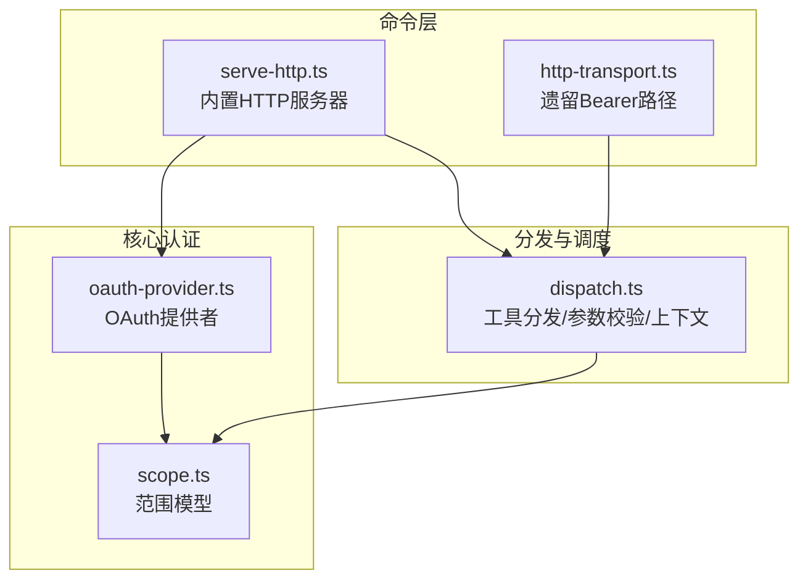
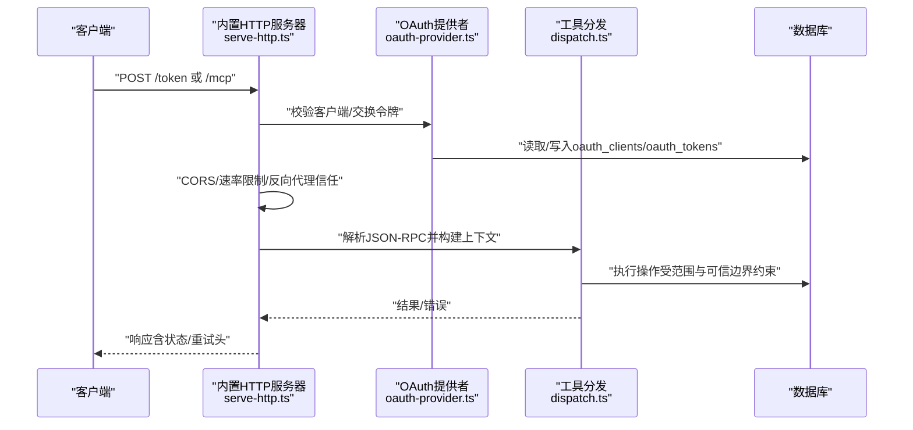
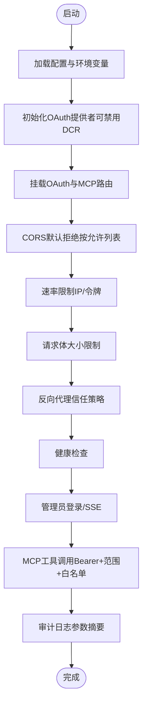
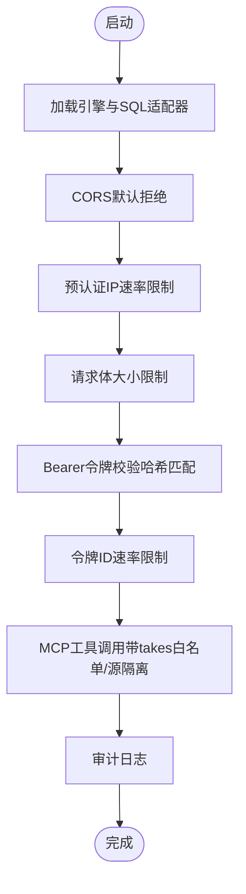
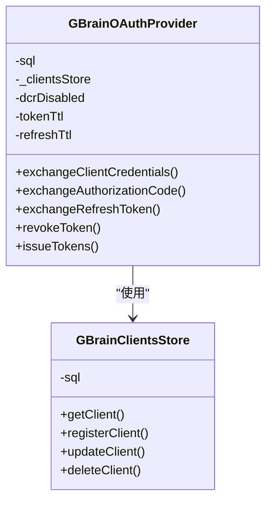
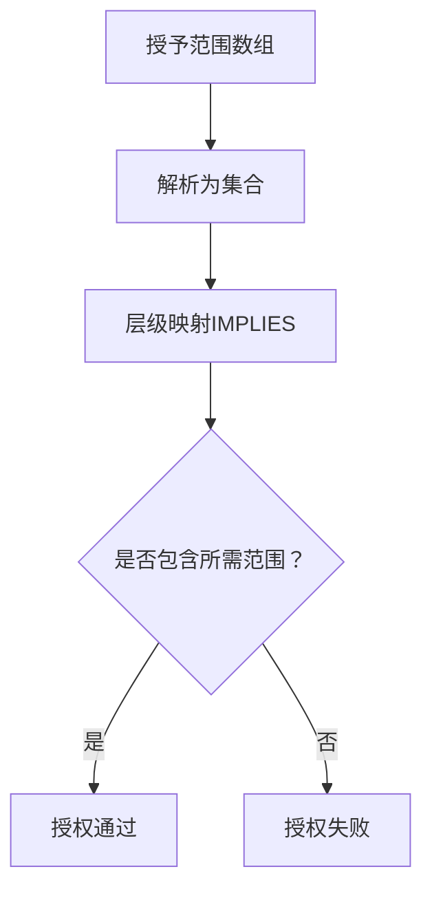
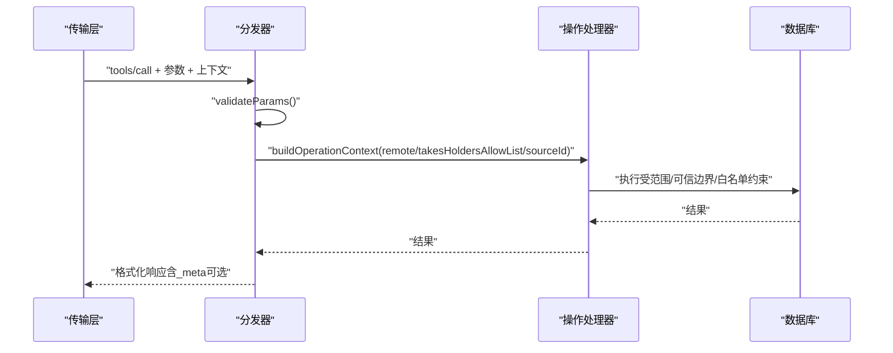
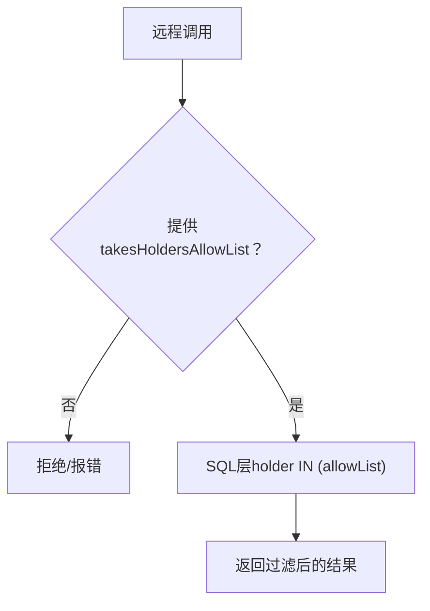
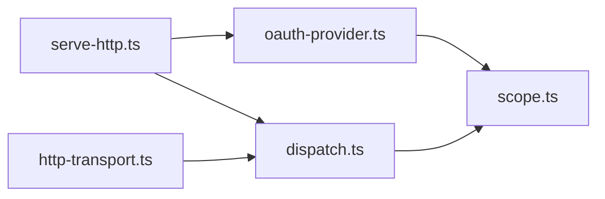

# MCP安全与认证

<cite>
**本文档引用的文件**
- [SECURITY.md](file://SECURITY.md)
- [serve-http.ts](file://src/commands/serve-http.ts)
- [http-transport.ts](file://src/mcp/http-transport.ts)
- [oauth-provider.ts](file://src/core/oauth-provider.ts)
- [scope.ts](file://src/core/scope.ts)
- [dispatch.ts](file://src/mcp/dispatch.ts)
- [mcp-client.test.ts](file://test/mcp-client.test.ts)
- [takes-mcp-allowlist.serial.test.ts](file://test/takes-mcp-allowlist.serial.test.ts)
- [operations-trust-boundary.test.ts](file://test/operations-trust-boundary.test.ts)
- [per-call-mode.test.ts](file://test/search/per-call-mode.test.ts)
</cite>

## 目录
1. [简介](#简介)
2. [项目结构](#项目结构)
3. [核心组件](#核心组件)
4. [架构总览](#架构总览)
5. [详细组件分析](#详细组件分析)
6. [依赖关系分析](#依赖关系分析)
7. [性能考量](#性能考量)
8. [故障排查指南](#故障排查指南)
9. [结论](#结论)
10. [附录](#附录)

## 简介
本文件面向MCP（Model Context Protocol）在本项目的安全与认证实现，聚焦以下主题：
- 认证流程：内置HTTP传输的OAuth 2.1与传统Bearer令牌路径
- 授权控制与作用域：基于范围（scope）的权限模型与层级关系
- 访问限制：速率限制、CORS默认拒绝、反向代理信任策略、请求体大小限制
- 远程调用与本地调用差异：可信边界与模式选择约束
- 数据隔离与隐私保护：takes持有者白名单、参数摘要与审计日志
- takes持有者白名单与数据可见性控制
- 安全配置项、威胁模型与防护措施
- 安全审计、日志记录与监控建议
- MCP标准安全要求与合规性考虑

## 项目结构
围绕MCP安全与认证的关键模块如下：
- 命令层：内置HTTP服务器与路由（OAuth端点、工具调用、健康检查、管理员界面）
- 核心认证：OAuth提供者、客户端存储、令牌发放与校验
- 作用域与授权：范围定义、层级推导、注册校验
- 分发与调度：统一工具分发、参数校验、上下文构建、元数据注入
- 传输层：HTTP承载（Express）与遗留Bearer路径（Bun.serve）
- 测试与验证：OAuth端到端、白名单过滤、可信边界契约、模式选择

**图表来源**
- [serve-http.ts:1-2152](file://src/commands/serve-http.ts#L1-L2152)
- [http-transport.ts:1-421](file://src/mcp/http-transport.ts#L1-L421)
- [oauth-provider.ts:1-990](file://src/core/oauth-provider.ts#L1-L990)
- [scope.ts:1-194](file://src/core/scope.ts#L1-L194)
- [dispatch.ts:1-284](file://src/mcp/dispatch.ts#L1-L284)

**章节来源**
- [serve-http.ts:1-2152](file://src/commands/serve-http.ts#L1-L2152)
- [http-transport.ts:1-421](file://src/mcp/http-transport.ts#L1-L421)
- [oauth-provider.ts:1-990](file://src/core/oauth-provider.ts#L1-L990)
- [scope.ts:1-194](file://src/core/scope.ts#L1-L194)
- [dispatch.ts:1-284](file://src/mcp/dispatch.ts#L1-L284)

## 核心组件
- 内置HTTP服务器（OAuth 2.1）：提供OAuth发现元数据、授权码/PKCE、客户端凭证、刷新令牌、撤销等；对MCP工具调用进行Bearer认证与范围检查；内置CORS默认拒绝、速率限制、请求体大小限制、反向代理信任策略、健康检查、管理员登录与事件流。
- 遗留Bearer传输：通过Authorization头携带SHA-256哈希令牌访问MCP工具；同样具备CORS默认拒绝、速率限制、请求体大小限制、审计日志。
- OAuth提供者：支持动态客户端注册、令牌发放与轮换、密钥方法校验、时间戳归一化、客户端存储与查询。
- 范围模型：定义允许范围集合、层级推导、规范化输入、未知范围校验。
- 工具分发：统一参数校验、上下文构建、错误格式化、元数据注入、远程/本地可信边界处理。

**章节来源**
- [serve-http.ts:1-2152](file://src/commands/serve-http.ts#L1-L2152)
- [http-transport.ts:1-421](file://src/mcp/http-transport.ts#L1-L421)
- [oauth-provider.ts:1-990](file://src/core/oauth-provider.ts#L1-L990)
- [scope.ts:1-194](file://src/core/scope.ts#L1-L194)
- [dispatch.ts:1-284](file://src/mcp/dispatch.ts#L1-L284)

## 架构总览
下图展示MCP安全与认证的整体交互：客户端经由OAuth或Bearer令牌访问MCP工具；服务端进行认证、授权、速率限制、CORS与反向代理信任策略校验，并写入审计日志；敏感操作在处理器层进一步执行可信边界与范围检查。

**图表来源**
- [serve-http.ts:596-747](file://src/commands/serve-http.ts#L596-L747)
- [oauth-provider.ts:344-989](file://src/core/oauth-provider.ts#L344-L989)
- [dispatch.ts:222-283](file://src/mcp/dispatch.ts#L222-L283)

## 详细组件分析

### 组件A：内置HTTP服务器（OAuth 2.1）
- OAuth端点：/.well-known/oauth-authorization-server、/authorize、/token、/register、/revoke；支持客户端凭证与授权码/PKCE；动态客户端注册可禁用。
- MCP工具调用：/mcp使用Bearer认证，结合范围检查与takes持有者白名单过滤。
- 管理员功能：/admin登录（基于引导令牌的哈希比对）、事件流（SSE）。
- 安全硬核：CORS默认拒绝、速率限制（预认证IP与后认证令牌两档）、请求体大小限制、反向代理信任策略、健康检查、审计日志（含参数摘要）。
- 环境变量：绑定地址、CORS允许列表、速率限制桶、LRU容量、反向代理信任、最大请求体、参数日志模式等。

**图表来源**
- [serve-http.ts:398-800](file://src/commands/serve-http.ts#L398-L800)

**章节来源**
- [serve-http.ts:1-2152](file://src/commands/serve-http.ts#L1-L2152)

### 组件B：遗留HTTP传输（Bearer）
- 传输模型：Bun.serve承载，/mcp要求Authorization: Bearer <token>，令牌以SHA-256哈希存储于access_tokens表。
- 安全特性：CORS默认拒绝、速率限制（预认证IP与后认证令牌）、请求体大小限制、审计日志、最后使用时间去抖更新。
- 可信边界：默认源隔离为“default”，支持从令牌权限中解析联邦读取源集。

**图表来源**
- [http-transport.ts:139-421](file://src/mcp/http-transport.ts#L139-L421)

**章节来源**
- [http-transport.ts:1-421](file://src/mcp/http-transport.ts#L1-L421)

### 组件C：OAuth提供者与客户端存储
- 支持：动态客户端注册、授权码/PKCE、客户端凭证、刷新令牌、撤销、密钥方法校验（client_secret_post/client_secret_basic/none）。
- 时间戳归一化：BIGINT列转换为JS数字，确保SDK中间件兼容与DCR响应符合RFC。
- 客户端存储：查询、注册（含DCR与手动注册）、密钥哈希验证、授权方法与重定向URI校验。

**图表来源**
- [oauth-provider.ts:170-989](file://src/core/oauth-provider.ts#L170-L989)

**章节来源**
- [oauth-provider.ts:1-990](file://src/core/oauth-provider.ts#L1-L990)

### 组件D：作用域与授权控制
- 范围集合：read、write、admin、sources_admin、users_admin、agent；层级关系：admin包含所有，write包含read，其他为自包含。
- 授权判定：hasScope根据授予范围集合判断是否满足所需范围；normalizeScopesInput规范化输入并校验未知范围。
- 注册校验：assertAllowedScopes在注册入口强制校验范围合法性。

**图表来源**
- [scope.ts:59-86](file://src/core/scope.ts#L59-L86)

**章节来源**
- [scope.ts:1-194](file://src/core/scope.ts#L1-L194)

### 组件E：工具分发与可信边界
- 统一分发：dispatchToolCall统一参数校验、上下文构建、错误格式化、元数据注入。
- 可信边界：remote标志区分远程/本地调用；本地调用可选择搜索模式（如tokenmax），远程调用忽略模式参数防止成本提升。
- takes白名单：通过takesHoldersAllowList在takes_list/takes_search/query等返回时进行过滤；get_page/get_versions等页面通道亦遵循相同白名单策略。
- 参数摘要：默认仅记录参数形状与近似字节大小，避免泄露原始负载；可通过启动参数切换为完整参数记录。

**图表来源**
- [dispatch.ts:195-283](file://src/mcp/dispatch.ts#L195-L283)

**章节来源**
- [dispatch.ts:1-284](file://src/mcp/dispatch.ts#L1-L284)

### 组件F：takes持有者白名单与数据可见性
- 默认行为：本地CLI调用不应用白名单，远程调用必须提供takesHoldersAllowList。
- 白名单过滤：对takes_list、takes_search、query（返回takes时）生效；get_page/get_versions等页面通道亦遵循相同白名单策略，确保远程调用不可见私有内容。
- 测试覆盖：端到端测试验证默认返回全部持有者、指定白名单仅返回允许持有者、无交集时返回空、以及版本快照中围栏被剥离。

**图表来源**
- [takes-mcp-allowlist.serial.test.ts:49-193](file://test/takes-mcp-allowlist.serial.test.ts#L49-L193)

**章节来源**
- [takes-mcp-allowlist.serial.test.ts:1-193](file://test/takes-mcp-allowlist.serial.test.ts#L1-L193)

### 组件G：远程调用与本地调用的差异
- 模式选择：本地调用可显式选择搜索模式（如tokenmax），远程调用忽略该参数，防止成本提升。
- 可信边界：远程调用默认remote=true，本地CLI remote=false；后者可获得更宽松的参数与行为。
- 测试验证：per-call-mode测试明确远程调用忽略模式参数，未知模式直接拒绝。

**章节来源**
- [per-call-mode.test.ts:1-33](file://test/search/per-call-mode.test.ts#L1-L33)
- [dispatch.ts:205-213](file://src/mcp/dispatch.ts#L205-L213)

### 组件H：安全配置与威胁缓解
- OAuth与DCR：推荐使用内置HTTP服务器且禁用开放客户端注册；若必须自定义HTTP包装器，需要求密钥注册、禁用client_credentials、限制范围、记录令牌签发、限流注册与令牌端点。
- CORS：默认拒绝，需通过环境变量设置允许列表；OAuth端点统一受同一允许列表保护。
- 速率限制：预认证IP与后认证令牌双桶，LRU容量可控；隧道部署场景下令牌桶更为有效。
- 反向代理信任：默认仅信任同机代理，可按需放宽至N跳；必须确保代理清理客户端伪造的X-Forwarded-For。
- 请求体大小：默认1MiB，流式计数，支持分块传输。
- 审计日志：每条/MCP请求写入mcp_request_log，包含状态、耗时、令牌名与参数摘要；支持SSE广播。

**章节来源**
- [SECURITY.md:11-261](file://SECURITY.md#L11-L261)
- [serve-http.ts:108-234](file://src/commands/serve-http.ts#L108-L234)
- [http-transport.ts:14-26](file://src/mcp/http-transport.ts#L14-L26)

## 依赖关系分析
- 低耦合：认证（OAuth提供者）与业务操作（operations）通过分发器解耦；传输层与认证层通过中间件/路由连接。
- 关键依赖链：
  - serve-http.ts -> oauth-provider.ts（令牌发放/校验）
  - serve-http.ts -> dispatch.ts（工具分发/上下文）
  - http-transport.ts -> dispatch.ts（工具分发/上下文）
  - dispatch.ts -> scope.ts（范围校验）
  - oauth-provider.ts -> scope.ts（范围规范化与校验）

**图表来源**
- [serve-http.ts:1-2152](file://src/commands/serve-http.ts#L1-L2152)
- [http-transport.ts:1-421](file://src/mcp/http-transport.ts#L1-L421)
- [oauth-provider.ts:1-990](file://src/core/oauth-provider.ts#L1-L990)
- [scope.ts:1-194](file://src/core/scope.ts#L1-L194)
- [dispatch.ts:1-284](file://src/mcp/dispatch.ts#L1-L284)

**章节来源**
- [serve-http.ts:1-2152](file://src/commands/serve-http.ts#L1-L2152)
- [http-transport.ts:1-421](file://src/mcp/http-transport.ts#L1-L421)
- [oauth-provider.ts:1-990](file://src/core/oauth-provider.ts#L1-L990)
- [scope.ts:1-194](file://src/core/scope.ts#L1-L194)
- [dispatch.ts:1-284](file://src/mcp/dispatch.ts#L1-L284)

## 性能考量
- 速率限制：预认证IP桶在DB查找前拦截暴力尝试，后认证令牌桶限制失控客户端；隧道场景下令牌桶更稳定。
- 请求体大小：流式计数避免内存膨胀；超限时立即返回413。
- 审计日志：插入为fire-and-forget，不影响主请求路径。
- 健康检查：轻量级存活探针与统计探针分离，避免长时间查询导致误判。

## 故障排查指南
- OAuth端点跨域问题：确认已设置GBRAIN_HTTP_CORS_ORIGIN且与实际来源一致；默认拒绝所有跨域请求。
- 速率限制触发：检查IP与令牌桶限额；隧道场景优先关注令牌桶。
- 反向代理IP欺骗：若直接暴露端口且设置非loopback信任，客户端可伪造X-Forwarded-For绕过IP桶；应仅在可信代理后使用非loopback信任。
- 审计日志异常：确认mcp_request_log可写；默认摘要模式避免泄露原始负载。
- 令牌签发与DCR：若启用DCR，确保客户端密钥方法合法；禁用DCR时POST /register应返回404。

**章节来源**
- [SECURITY.md:154-261](file://SECURITY.md#L154-L261)
- [serve-http.ts:175-234](file://src/commands/serve-http.ts#L175-L234)
- [http-transport.ts:124-137](file://src/mcp/http-transport.ts#L124-L137)

## 结论
本项目通过内置HTTP服务器与OAuth 2.1提供强健的认证与授权能力，配合范围模型、CORS默认拒绝、速率限制、反向代理信任策略与审计日志，形成多层防护。远程调用与本地调用在可信边界与模式选择上存在差异，确保远程场景下的安全与稳定。takes持有者白名单与参数摘要进一步强化了数据隔离与隐私保护。建议严格遵循安全配置与威胁缓解实践，定期审查范围与白名单策略，并结合审计与监控持续改进。

## 附录

### 安全配置清单（环境变量）
- 绑定地址与公共URL：--bind/--public-url
- CORS允许列表：GBRAIN_HTTP_CORS_ORIGIN
- 速率限制：GBRAIN_HTTP_RATE_LIMIT_IP、GBRAIN_HTTP_RATE_LIMIT_TOKEN、GBRAIN_HTTP_RATE_LIMIT_LRU
- 反向代理信任：GBRAIN_HTTP_TRUST_PROXY
- 最大请求体：GBRAIN_HTTP_MAX_BODY_BYTES
- 参数日志模式：--log-full-params（仅HTTP服务器）

**章节来源**
- [SECURITY.md:108-261](file://SECURITY.md#L108-L261)
- [serve-http.ts:258-302](file://src/commands/serve-http.ts#L258-L302)

### 测试参考
- OAuth端到端与DCR TTL：serve-http-oauth.test.ts
- takes持有者白名单：takes-mcp-allowlist.serial.test.ts
- 可信边界契约：operations-trust-boundary.test.ts
- 搜索模式选择：per-call-mode.test.ts
- OAuth端点模拟：mcp-client.test.ts

**章节来源**
- [mcp-client.test.ts:35-71](file://test/mcp-client.test.ts#L35-L71)
- [takes-mcp-allowlist.serial.test.ts:1-193](file://test/takes-mcp-allowlist.serial.test.ts#L1-L193)
- [operations-trust-boundary.test.ts:1-27](file://test/operations-trust-boundary.test.ts#L1-L27)
- [per-call-mode.test.ts:1-33](file://test/search/per-call-mode.test.ts#L1-L33)