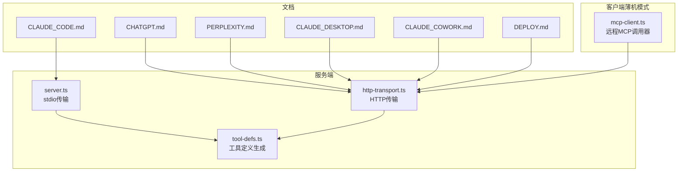
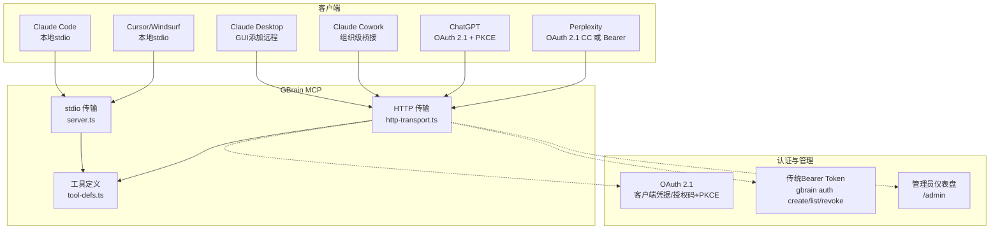
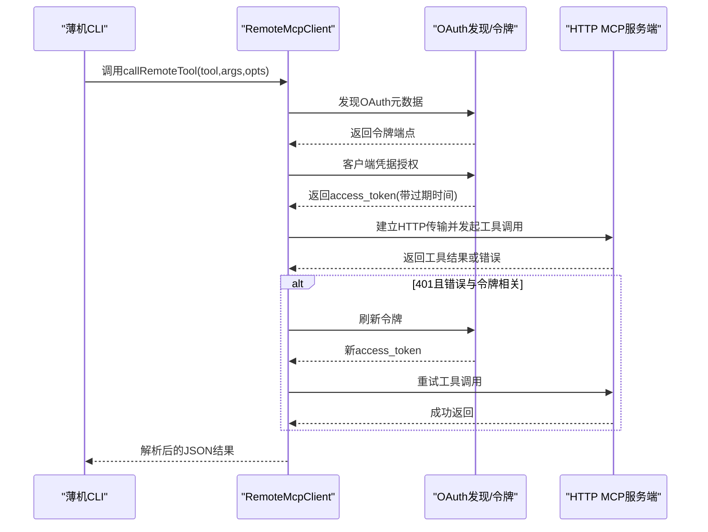
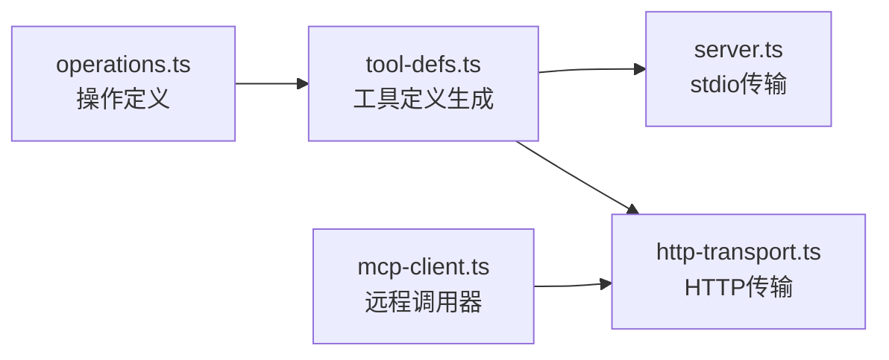

# MCP客户端集成

<cite>
**本文引用的文件**
- [README.md](file://README.md)
- [docs/mcp/CLAUDE_CODE.md](file://docs/mcp/CLAUDE_CODE.md)
- [docs/mcp/CHATGPT.md](file://docs/mcp/CHATGPT.md)
- [docs/mcp/PERPLEXITY.md](file://docs/mcp/PERPLEXITY.md)
- [docs/mcp/CLAUDE_DESKTOP.md](file://docs/mcp/CLAUDE_DESKTOP.md)
- [docs/mcp/CLAUDE_COWORK.md](file://docs/mcp/CLAUDE_COWORK.md)
- [docs/mcp/DEPLOY.md](file://docs/mcp/DEPLOY.md)
- [src/core/mcp-client.ts](file://src/core/mcp-client.ts)
- [src/mcp/server.ts](file://src/mcp/server.ts)
- [src/mcp/http-transport.ts](file://src/mcp/http-transport.ts)
- [src/mcp/tool-defs.ts](file://src/mcp/tool-defs.ts)
</cite>

## 目录
1. [简介](#简介)
2. [项目结构](#项目结构)
3. [核心组件](#核心组件)
4. [架构总览](#架构总览)
5. [详细组件分析](#详细组件分析)
6. [依赖关系分析](#依赖关系分析)
7. [性能考量](#性能考量)
8. [故障排除指南](#故障排除指南)
9. [结论](#结论)
10. [附录](#附录)

## 简介
本文件面向需要在多种AI客户端中集成MCP（Model Context Protocol）的工程师与运维人员，系统性说明如何为Claude Code、Cursor/Windsurf、Claude Desktop、Claude Cowork、ChatGPT、Perplexity等客户端配置GBrain的MCP连接。内容涵盖：
- 每个客户端的配置步骤与连接参数
- HTTP传输层实现与配置项
- OAuth 2.1流程、客户端注册与令牌管理
- 完整集成示例与故障排除
- 客户端特定限制与优化建议
- 安全配置与最佳实践

## 项目结构
围绕MCP集成的关键位置如下：
- 文档：docs/mcp 下包含各客户端的连接指南与部署参考
- 核心服务端：src/mcp 下提供stdio与HTTP两种传输实现
- 客户端薄机模式调用器：src/core 提供远程MCP调用封装与错误类型化
- README提供高层概览与快速入口

图表来源
- [docs/mcp/CLAUDE_CODE.md](file://docs/mcp/CLAUDE_CODE.md)
- [docs/mcp/CHATGPT.md](file://docs/mcp/CHATGPT.md)
- [docs/mcp/PERPLEXITY.md](file://docs/mcp/PERPLEXITY.md)
- [docs/mcp/CLAUDE_DESKTOP.md](file://docs/mcp/CLAUDE_DESKTOP.md)
- [docs/mcp/CLAUDE_COWORK.md](file://docs/mcp/CLAUDE_COWORK.md)
- [docs/mcp/DEPLOY.md](file://docs/mcp/DEPLOY.md)
- [src/mcp/server.ts](file://src/mcp/server.ts)
- [src/mcp/http-transport.ts](file://src/mcp/http-transport.ts)
- [src/mcp/tool-defs.ts](file://src/mcp/tool-defs.ts)
- [src/core/mcp-client.ts](file://src/core/mcp-client.ts)

章节来源
- [README.md](file://README.md)
- [docs/mcp/DEPLOY.md](file://docs/mcp/DEPLOY.md)

## 核心组件
- stdio MCP服务器：用于本地客户端（如Claude Code、Cursor/Windsurf），通过标准输入输出与客户端通信。
- HTTP MCP服务器：用于远程客户端（ChatGPT、Claude Desktop/Cowork、Perplexity），内置OAuth 2.1支持与管理员仪表盘。
- 工具定义生成：从操作元数据生成MCP工具规范，确保stdio与HTTP路径一致。
- 远程MCP调用器：薄机模式下对远端HTTP MCP进行OAuth客户端凭据授权、令牌缓存与401重试。

章节来源
- [src/mcp/server.ts](file://src/mcp/server.ts)
- [src/mcp/http-transport.ts](file://src/mcp/http-transport.ts)
- [src/mcp/tool-defs.ts](file://src/mcp/tool-defs.ts)
- [src/core/mcp-client.ts](file://src/core/mcp-client.ts)

## 架构总览
下图展示从客户端到GBrain MCP服务端的典型交互路径，以及OAuth 2.1与传统Bearer Token两种认证方式：

图表来源
- [src/mcp/server.ts](file://src/mcp/server.ts)
- [src/mcp/http-transport.ts](file://src/mcp/http-transport.ts)
- [src/mcp/tool-defs.ts](file://src/mcp/tool-defs.ts)
- [docs/mcp/DEPLOY.md](file://docs/mcp/DEPLOY.md)

## 详细组件分析

### Claude Code（本地或远程）
- 本地（推荐，无需服务器）：直接使用stdio，客户端启动本地子进程运行“gbrain serve”。
- 远程（Bearer Token）：通过“gbrain connect”生成粘贴块，或直接在目标机器上执行安装并验证身份标识与技能列表。
- 关键点：技能发现受“mcp.publish_skills”控制；本地无需令牌。

章节来源
- [docs/mcp/CLAUDE_CODE.md](file://docs/mcp/CLAUDE_CODE.md)
- [README.md](file://README.md)

### Cursor / Windsurf（本地stdio）
- 配置形状与Claude Code类似，将命令加入MCP配置指向“gbrain serve”，即可通过标准输入输出通信。

章节来源
- [docs/mcp/CLAUDE_CODE.md](file://docs/mcp/CLAUDE_CODE.md)

### Claude Desktop（远程HTTP，Bearer或OAuth）
- 必须通过GUI设置“设置 > 集成”添加远程MCP服务器URL，并选择Bearer Token或OAuth。
- 注意：不能使用本地JSON配置文件添加远程服务器。

章节来源
- [docs/mcp/CLAUDE_DESKTOP.md](file://docs/mcp/CLAUDE_DESKTOP.md)

### Claude Cowork（团队计划）
- 方式一：组织设置 > 连接器，添加远程MCP服务器URL与Bearer Token。
- 方式二：若已在Claude Desktop配置本地stdio，则Cowork可自动通过其SDK桥接访问。

章节来源
- [docs/mcp/CLAUDE_COWORK.md](file://docs/mcp/CLAUDE_COWORK.md)

### ChatGPT（必须使用OAuth 2.1 + PKCE）
- 使用HTTP服务器（gbrain serve --http）并通过管理员仪表盘注册客户端（授权码+PKCE，要求redirect_uri与ChatGPT一致）。
- 建议范围：read、write（不勾选admin）；四个localOnly操作在HTTP路径被拒绝。

章节来源
- [docs/mcp/CHATGPT.md](file://docs/mcp/CHATGPT.md)
- [docs/mcp/DEPLOY.md](file://docs/mcp/DEPLOY.md)

### Perplexity Computer（远程HTTP，OAuth 2.1 CC或Bearer）
- 推荐使用OAuth 2.1客户端凭据（least-privilege + 短期令牌），或本地/个人场景使用Bearer Token。
- 需要公开HTTPS可达的URL，且OAuth发行者URL需与实际访问一致。

章节来源
- [docs/mcp/PERPLEXITY.md](file://docs/mcp/PERPLEXITY.md)
- [docs/mcp/DEPLOY.md](file://docs/mcp/DEPLOY.md)

### HTTP传输层实现与配置
- CORS默认拒绝，可通过环境变量配置允许列表。
- 请求体大小限制默认1MiB，可由环境变量调整。
- 预认证IP限流与后认证令牌ID限流双重保护。
- 访问日志记录请求、操作、状态与延迟。
- 支持健康检查端点与MCP JSON-RPC端点。

章节来源
- [src/mcp/http-transport.ts](file://src/mcp/http-transport.ts)
- [docs/mcp/DEPLOY.md](file://docs/mcp/DEPLOY.md)

### OAuth 2.1流程、客户端注册与令牌管理
- 客户端注册：通过管理员仪表盘或CLI注册授权码（PKCE）或客户端凭据两类。
- 动态客户端注册（DCR）可按需启用。
- 令牌管理：客户端凭据用于机器到机器调用；授权码+PKCE用于浏览器型客户端。
- 范围与隔离：read/write/admin范围与源隔离（多源脑可限定写入源与读取源集合）。

章节来源
- [docs/mcp/DEPLOY.md](file://docs/mcp/DEPLOY.md)
- [src/mcp/http-transport.ts](file://src/mcp/http-transport.ts)

### 远程MCP调用器（薄机模式）
- 功能：封装OAuth客户端凭据授权、令牌缓存、401自动刷新重试、错误类型化与超时/取消信号。
- 错误原因枚举：配置、发现、认证、认证失败（刷新后）、网络、工具错误、解析。
- 结果解包：统一从工具响应的第一个文本内容中解析JSON结果。

图表来源
- [src/core/mcp-client.ts](file://src/core/mcp-client.ts)
- [src/mcp/http-transport.ts](file://src/mcp/http-transport.ts)

章节来源
- [src/core/mcp-client.ts](file://src/core/mcp-client.ts)

### 工具定义生成
- 将操作参数定义映射为JSON Schema，确保stdio与HTTP路径共享同一套工具规范。
- 统一处理数组、枚举、默认值与递归items。

章节来源
- [src/mcp/tool-defs.ts](file://src/mcp/tool-defs.ts)

## 依赖关系分析
- 服务端
  - stdio：server.ts直接注册工具列表与工具调用处理器，使用tool-defs.ts生成工具定义。
  - HTTP：http-transport.ts负责CORS、限流、鉴权、日志与JSON-RPC路由，同样依赖tool-defs.ts。
- 客户端薄机模式
  - mcp-client.ts依赖远程探测与令牌获取逻辑，封装错误类型化与重试策略。

图表来源
- [src/mcp/server.ts](file://src/mcp/server.ts)
- [src/mcp/http-transport.ts](file://src/mcp/http-transport.ts)
- [src/mcp/tool-defs.ts](file://src/mcp/tool-defs.ts)
- [src/core/mcp-client.ts](file://src/core/mcp-client.ts)

章节来源
- [src/mcp/server.ts](file://src/mcp/server.ts)
- [src/mcp/http-transport.ts](file://src/mcp/http-transport.ts)
- [src/mcp/tool-defs.ts](file://src/mcp/tool-defs.ts)
- [src/core/mcp-client.ts](file://src/core/mcp-client.ts)

## 性能考量
- HTTP路径预期延迟（摘自部署文档）：
  - get_page：< 100ms
  - list_pages：< 200ms
  - search（关键词）：100–300ms
  - query（混合检索）：1–3s
  - put_page：100–500ms
  - get_stats：< 100ms
- 限流与防护：预认证IP限流与后认证令牌限流，避免暴力破解与滥用。
- CORS默认拒绝，仅在明确白名单时放行，降低跨域探测风险。

章节来源
- [docs/mcp/DEPLOY.md](file://docs/mcp/DEPLOY.md)
- [src/mcp/http-transport.ts](file://src/mcp/http-transport.ts)

## 故障排除指南
- “缺少认证”（missing_auth）
  - 确保请求头包含“Authorization: Bearer YOUR_TOKEN”。
- “无效令牌”（invalid_token）
  - 使用“gbrain auth list”核对有效令牌；确认令牌未撤销。
- “服务不可用”（service_unavailable）
  - 数据库连接失败，检查托管平台状态。
- Claude Desktop无法连接
  - 必须通过“设置 > 集成”添加远程服务器，不能使用本地JSON配置文件。
- ChatGPT“无效redirect_uri”
  - 注册客户端时redirect_uri必须与ChatGPT页面显示完全一致。
- ChatGPT连接批准后仍报错
  - 打开/admin查看实时SSE流，确认请求到达；若失败，查看请求日志定位具体错误。
- “不支持的grant_type”
  - ChatGPT使用授权码+PKCE，确保注册时选择了正确的grant_types。

章节来源
- [docs/mcp/DEPLOY.md](file://docs/mcp/DEPLOY.md)
- [docs/mcp/CHATGPT.md](file://docs/mcp/CHATGPT.md)
- [docs/mcp/CLAUDE_DESKTOP.md](file://docs/mcp/CLAUDE_DESKTOP.md)

## 结论
通过统一的MCP协议与两套传输实现（stdio与HTTP），GBrain为多类AI客户端提供了稳定、可扩展的记忆层接入方案。HTTP路径内置OAuth 2.1与管理员仪表盘，满足企业级安全与可观测性需求；stdio路径则简化了本地开发与调试。结合本文档的配置步骤、安全建议与故障排除清单，可在不同客户端中快速完成MCP集成。

## 附录

### 客户端配置速查表
- Claude Code
  - 本地：claude mcp add gbrain -- gbrain serve
  - 远程：gbrain connect <URL>/mcp --token <TOKEN> [--install]
- Cursor / Windsurf
  - 在MCP配置中添加命令：{"command": "gbrain", "args": ["serve"]}
- Claude Desktop
  - 设置 > 集成 > 添加远程MCP服务器URL；选择Bearer Token或OAuth
- Claude Cowork
  - 组织设置 > 连接器；或复用已配置的Claude Desktop本地stdio
- ChatGPT
  - gbrain serve --http；在/admin注册授权码+PKCE客户端；使用ngrok暴露公网URL
- Perplexity
  - gbrain serve --http；在/admin注册客户端凭据或使用Bearer Token

章节来源
- [docs/mcp/CLAUDE_CODE.md](file://docs/mcp/CLAUDE_CODE.md)
- [docs/mcp/CLAUDE_DESKTOP.md](file://docs/mcp/CLAUDE_DESKTOP.md)
- [docs/mcp/CLAUDE_COWORK.md](file://docs/mcp/CLAUDE_COWORK.md)
- [docs/mcp/CHATGPT.md](file://docs/mcp/CHATGPT.md)
- [docs/mcp/PERPLEXITY.md](file://docs/mcp/PERPLEXITY.md)
- [docs/mcp/DEPLOY.md](file://docs/mcp/DEPLOY.md)