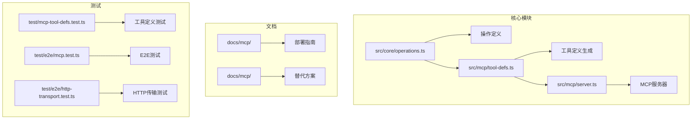
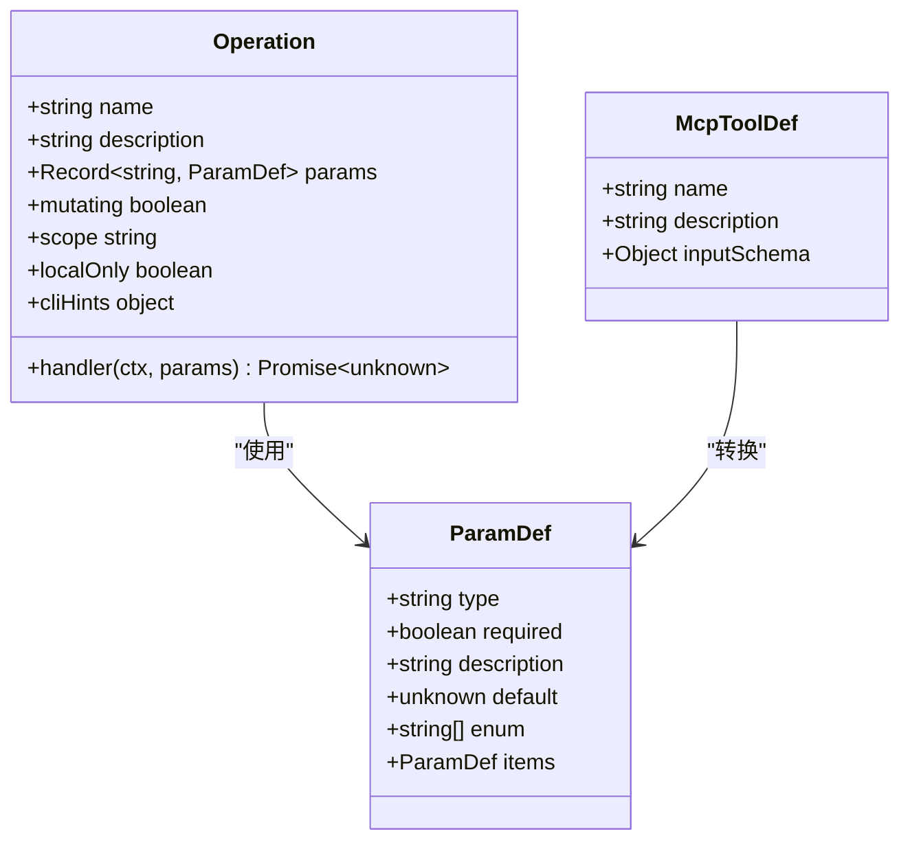
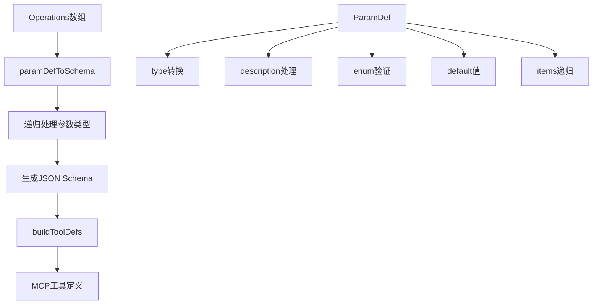
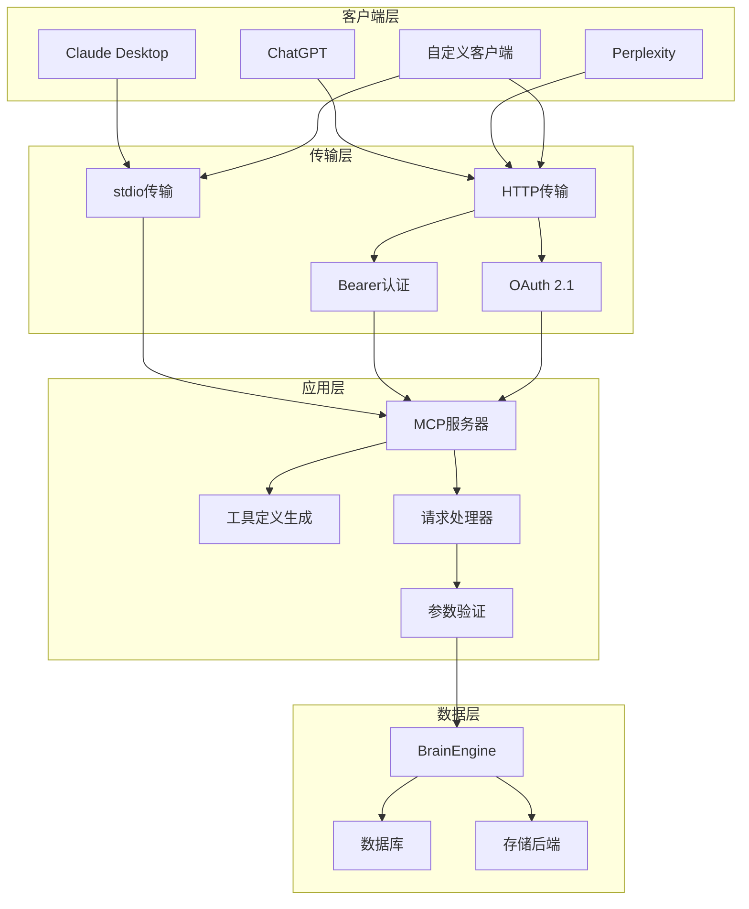
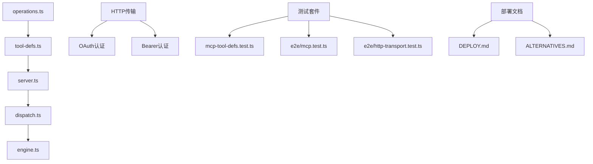
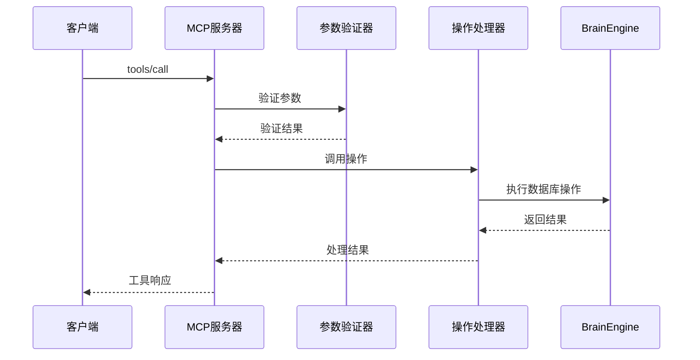

# MCP工具参考

<cite>
**本文档引用的文件**
- [src/core/operations.ts](file://src/core/operations.ts)
- [src/mcp/tool-defs.ts](file://src/mcp/tool-defs.ts)
- [src/mcp/server.ts](file://src/mcp/server.ts)
- [docs/mcp/DEPLOY.md](file://docs/mcp/DEPLOY.md)
- [docs/mcp/ALTERNATIVES.md](file://docs/mcp/ALTERNATIVES.md)
- [test/mcp-tool-defs.test.ts](file://test/mcp-tool-defs.test.ts)
- [test/e2e/mcp.test.ts](file://test/e2e/mcp.test.ts)
- [test/e2e/http-transport.test.ts](file://test/e2e/http-transport.test.ts)
</cite>

## 目录
1. [简介](#简介)
2. [项目结构](#项目结构)
3. [核心组件](#核心组件)
4. [架构概览](#架构概览)
5. [详细组件分析](#详细组件分析)
6. [依赖关系分析](#依赖关系分析)
7. [性能考虑](#性能考虑)
8. [故障排除指南](#故障排除指南)
9. [结论](#结论)
10. [附录](#附录)

## 简介

MCP（Model Context Protocol）工具参考文档提供了GBrain系统中所有可用MCP工具的完整参考信息。该系统包含30多个核心工具，涵盖页面管理、搜索检索、知识图谱操作、作业调度等多个功能领域。

MCP工具通过标准化的JSON-RPC协议与AI客户端通信，支持本地stdio传输和远程HTTP传输两种模式。每个工具都经过精心设计，具有明确的参数规范、返回值定义和安全边界控制。

## 项目结构

GBRain项目的MCP相关组件主要分布在以下位置：

**图表来源**
- [src/core/operations.ts:1-50](file://src/core/operations.ts#L1-L50)
- [src/mcp/tool-defs.ts:1-54](file://src/mcp/tool-defs.ts#L1-L54)
- [src/mcp/server.ts:1-149](file://src/mcp/server.ts#L1-L149)

**章节来源**
- [src/core/operations.ts:1-50](file://src/core/operations.ts#L1-L50)
- [src/mcp/tool-defs.ts:1-54](file://src/mcp/tool-defs.ts#L1-L54)
- [src/mcp/server.ts:1-149](file://src/mcp/server.ts#L1-L149)

## 核心组件

### 操作定义系统

GBRain采用合同优先的操作定义系统，所有工具都基于统一的Operation接口构建：

**图表来源**
- [src/core/operations.ts:589-619](file://src/core/operations.ts#L589-L619)
- [src/core/operations.ts:216-223](file://src/core/operations.ts#L216-L223)
- [src/mcp/tool-defs.ts:3-11](file://src/mcp/tool-defs.ts#L3-L11)

### 工具定义生成器

工具定义生成器负责将内部操作映射转换为MCP兼容的JSON Schema格式：

**图表来源**
- [src/mcp/tool-defs.ts:30-54](file://src/mcp/tool-defs.ts#L30-L54)
- [src/mcp/tool-defs.ts:13-38](file://src/mcp/tool-defs.ts#L13-L38)

**章节来源**
- [src/core/operations.ts:589-619](file://src/core/operations.ts#L589-L619)
- [src/mcp/tool-defs.ts:1-54](file://src/mcp/tool-defs.ts#L1-L54)

## 架构概览

### MCP服务器架构

**图表来源**
- [src/mcp/server.ts:18-55](file://src/mcp/server.ts#L18-L55)
- [docs/mcp/DEPLOY.md:12-48](file://docs/mcp/DEPLOY.md#L12-L48)

### 工具分类体系

MCP工具按照功能特性分为以下类别：

| 分类 | 工具数量 | 主要功能 | 安全级别 |
|------|----------|----------|----------|
| 页面管理 | 8个 | CRUD操作、版本控制、标签管理 | write/admin |
| 搜索检索 | 6个 | 全文搜索、向量搜索、图像相似性 | read |
| 图谱操作 | 7个 | 链接管理、图遍历、实体关系 | read/write |
| 作业调度 | 12个 | 后台任务、代理作业、状态监控 | admin |
| 知识管理 | 5个 | 事实提取、回忆、校准 | write/read |
| 系统管理 | 6个 | 健康检查、统计信息、诊断 | admin |

**章节来源**
- [src/mcp/server.ts:27-29](file://src/mcp/server.ts#L27-L29)
- [test/e2e/mcp.test.ts:38-59](file://test/e2e/mcp.test.ts#L38-L59)

## 详细组件分析

### 页面管理工具

#### get_page - 获取页面内容
- **用途**: 从知识库中读取指定页面的内容
- **参数**:
  - `slug` (string, 必需): 页面唯一标识符
  - `fuzzy` (boolean): 是否启用模糊匹配
  - `include_deleted` (boolean): 是否包含软删除页面
- **返回值**: 页面对象，包含内容、元数据和标签
- **权限**: read
- **使用场景**: 内容检索、页面预览、数据恢复

#### put_page - 创建/更新页面
- **用途**: 写入或更新页面内容
- **参数**:
  - `slug` (string, 必需): 页面标识符
  - `content` (string, 必需): Markdown内容
  - `source_kind` (string): 来源类型
  - `source_uri` (string): 原始URI
  - `ingested_via` (string): 注入方式
- **返回值**: 操作结果，包含状态和统计信息
- **权限**: write
- **使用场景**: 内容导入、自动摘要、文档上传

#### list_pages - 列出页面
- **用途**: 获取页面列表
- **参数**:
  - `type` (string): 按类型过滤
  - `tag` (string): 按标签过滤
  - `limit` (number): 结果数量限制
  - `sort` (string): 排序方式
  - `include_deleted` (boolean): 包含已删除页面
- **返回值**: 页面信息数组
- **权限**: read
- **使用场景**: 内容浏览、批量操作、审计

**章节来源**
- [src/core/operations.ts:623-722](file://src/core/operations.ts#L623-L722)
- [src/core/operations.ts:1334-1386](file://src/core/operations.ts#L1334-L1386)

### 搜索检索工具

#### search - 关键词搜索
- **用途**: 执行关键词全文搜索
- **参数**:
  - `query` (string, 必需): 搜索查询
  - `limit` (number): 结果数量限制
  - `offset` (number): 分页偏移
  - `mode` (string): 搜索模式
- **返回值**: 搜索结果数组
- **权限**: read
- **性能**: < 300ms (关键词模式)

#### query - 混合搜索
- **用途**: 执行向量+关键词混合搜索
- **参数**:
  - `query` (string): 文本查询
  - `image` (string): 图像字节码
  - `image_mime` (string): 图像MIME类型
  - `limit` (number): 结果数量
  - `expand` (boolean): 是否启用查询扩展
  - `detail` (string): 结果详情级别
- **返回值**: 搜索结果数组
- **权限**: read
- **性能**: 1-3秒 (向量搜索)

**章节来源**
- [src/core/operations.ts:1390-1447](file://src/core/operations.ts#L1390-L1447)
- [src/core/operations.ts:1449-1682](file://src/core/operations.ts#L1449-L1682)

### 图谱操作工具

#### add_link - 添加链接
- **用途**: 在页面间创建链接关系
- **参数**:
  - `from` (string, 必需): 源页面
  - `to` (string, 必需): 目标页面
  - `link_type` (string): 链接类型
  - `context` (string): 上下文信息
  - `link_source` (string): 链接来源
- **返回值**: 操作状态
- **权限**: write
- **安全**: 防止重定向攻击

#### get_links - 获取链接
- **用途**: 获取页面的出站链接
- **参数**:
  - `slug` (string, 必需): 页面标识符
- **返回值**: 链接数组
- **权限**: read

#### traverse_graph - 图遍历
- **用途**: 按方向和深度遍历链接图
- **参数**:
  - `slug` (string, 必需): 起始节点
  - `depth` (number): 遍历深度
  - `link_type` (string): 链接类型过滤
  - `direction` (string): 遍历方向
- **返回值**: 图路径或节点信息
- **权限**: read
- **安全**: 深度限制防止内存耗尽

**章节来源**
- [src/core/operations.ts:1931-2089](file://src/core/operations.ts#L1931-L2089)

### 作业调度工具

#### submit_job - 提交作业
- **用途**: 提交后台作业到队列
- **参数**:
  - `name` (string, 必需): 作业类型
  - `data` (object): 作业数据
  - `queue` (string): 队列名称
  - `priority` (number): 优先级
  - `max_attempts` (number): 最大重试次数
- **返回值**: 作业信息
- **权限**: admin
- **安全**: 受保护作业名检查

#### list_jobs - 列出作业
- **用途**: 获取作业列表
- **参数**:
  - `status` (string): 按状态过滤
  - `queue` (string): 按队列过滤
  - `name` (string): 按类型过滤
  - `limit` (number): 数量限制
- **返回值**: 作业数组
- **权限**: admin

#### submit_agent - 提交代理作业
- **用途**: 提交LLM代理作业
- **参数**:
  - `prompt` (string, 必需): 用户提示
  - `model` (string): 模型标识
  - `allowed_tools` (array): 允许的工具
  - `allowed_slug_prefixes` (array): 允许的页面前缀
  - `max_turns` (number): 最大轮次
- **返回值**: 作业ID和客户端信息
- **权限**: agent
- **安全**: OAuth客户端绑定验证

**章节来源**
- [src/core/operations.ts:2760-3013](file://src/core/operations.ts#L2760-L3013)

### 知识管理工具

#### extract_facts - 提取事实
- **用途**: 从对话中提取个人知识事实
- **参数**:
  - `turn_text` (string, 必需): 输入文本
  - `session_id` (string): 会话标识
  - `entity_hints` (array): 实体提示
  - `is_dream_generated` (boolean): 是否为梦境生成
  - `visibility` (string): 可见性级别
- **返回值**: 提取统计信息
- **权限**: write
- **隐私**: 远程调用仅显示world可见事实

#### recall - 回忆事实
- **用途**: 查询个人知识记忆
- **参数**:
  - `entity` (string): 实体标识
  - `since` (string): 时间范围
  - `session_id` (string): 会话标识
  - `include_expired` (boolean): 包含过期事实
  - `supersessions` (boolean): 仅返回覆盖记录
  - `limit` (number): 数量限制
  - `grep` (string): 文本过滤
  - `include_pending` (boolean): 包含待合并计数
- **返回值**: 事实列表
- **权限**: read
- **隐私**: 远程调用默认仅显示world事实

**章节来源**
- [src/core/operations.ts:3840-3999](file://src/core/operations.ts#L3840-L3999)

## 依赖关系分析

### 组件耦合度

**图表来源**
- [src/core/operations.ts:1-50](file://src/core/operations.ts#L1-L50)
- [src/mcp/tool-defs.ts:1-54](file://src/mcp/tool-defs.ts#L1-L54)
- [src/mcp/server.ts:1-149](file://src/mcp/server.ts#L1-L149)

### 数据流分析

**图表来源**
- [src/mcp/server.ts:36-55](file://src/mcp/server.ts#L36-L55)
- [src/mcp/tool-defs.ts:40-54](file://src/mcp/tool-defs.ts#L40-L54)

**章节来源**
- [src/core/operations.ts:1-50](file://src/core/operations.ts#L1-L50)
- [src/mcp/server.ts:1-149](file://src/mcp/server.ts#L1-L149)

## 性能考虑

### 延迟特征

| 工具类别 | 典型延迟 | 优化策略 |
|----------|----------|----------|
| 页面读取 | < 100ms | 数据库查询优化 |
| 页面列表 | < 200ms | 分页和索引优化 |
| 关键词搜索 | 100-300ms | 全文索引和缓存 |
| 混合搜索 | 1-3s | 向量索引和并行处理 |
| 页面写入 | 100-500ms | 批量写入和事务优化 |
| 统计查询 | < 100ms | 聚合查询优化 |

### 资源消耗

- **CPU**: 搜索操作（特别是向量搜索）是CPU密集型
- **内存**: 大规模搜索和排序操作需要较多内存
- **网络**: 远程HTTP传输有额外开销
- **存储**: 文件上传和嵌入向量存储占用空间

### 使用建议

1. **合理设置limit参数**避免返回过多数据
2. **使用分页机制**处理大量结果
3. **缓存常用查询**减少重复计算
4. **选择合适的搜索模式**平衡精度和性能
5. **监控资源使用**及时发现性能瓶颈

## 故障排除指南

### 常见错误及解决方案

| 错误类型 | 错误代码 | 描述 | 解决方案 |
|----------|----------|------|----------|
| 认证错误 | missing_auth | 缺少认证头 | 添加Authorization: Bearer token |
| 令牌无效 | invalid_token | 令牌不存在或过期 | 使用有效令牌重新认证 |
| 权限不足 | permission_denied | 操作无权限 | 检查OAuth作用域配置 |
| 参数错误 | invalid_params | 参数格式不正确 | 验证参数类型和必需字段 |
| 服务不可用 | service_unavailable | 数据库连接失败 | 检查数据库状态和连接池 |

### 调试技巧

1. **启用详细日志**：使用`--verbose`标志获取更多信息
2. **检查网络连接**：确保MCP服务器可访问
3. **验证参数格式**：使用工具定义作为参数参考
4. **监控资源使用**：观察CPU、内存和磁盘使用情况
5. **查看错误堆栈**：获取详细的错误信息和位置

**章节来源**
- [docs/mcp/DEPLOY.md:254-268](file://docs/mcp/DEPLOY.md#L254-L268)

## 结论

GBRain的MCP工具系统提供了全面的知识管理和AI协作能力。通过标准化的工具接口，用户可以轻松集成各种AI客户端和工作流。系统的安全性设计（OAuth认证、作用域控制、参数验证）确保了生产环境的可靠性。

工具的分类设计清晰，涵盖了从基础的数据操作到高级的AI推理功能。性能优化和资源管理策略使得系统能够在大规模部署中保持稳定运行。

## 附录

### 版本兼容性

- **v0.26.0+**: 完整的HTTP传输支持和OAuth 2.1认证
- **v0.31.0+**: 增强的安全边界和作用域控制
- **v0.34.0+**: 多源脑支持和联邦读取功能
- **v0.43.0+**: 新增轨迹分析和上下文推送功能

### 变更历史

1. **工具定义提取** (v0.16.0): 将工具定义集中管理，确保一致性
2. **作用域系统** (v0.28.0): 引入read/write/admin作用域分级
3. **多源支持** (v0.34.0): 支持跨源查询和写入操作
4. **安全加固** (v0.31.0+): 实施严格的远程调用安全控制
5. **性能优化** (v0.43.0+): 新增轨迹分析和上下文推送功能

### 最佳实践

1. **参数验证**: 始终验证输入参数的有效性
2. **错误处理**: 实现适当的错误捕获和恢复机制
3. **资源管理**: 合理管理内存和CPU资源使用
4. **安全考虑**: 始终遵循最小权限原则
5. **监控告警**: 建立完善的监控和告警系统