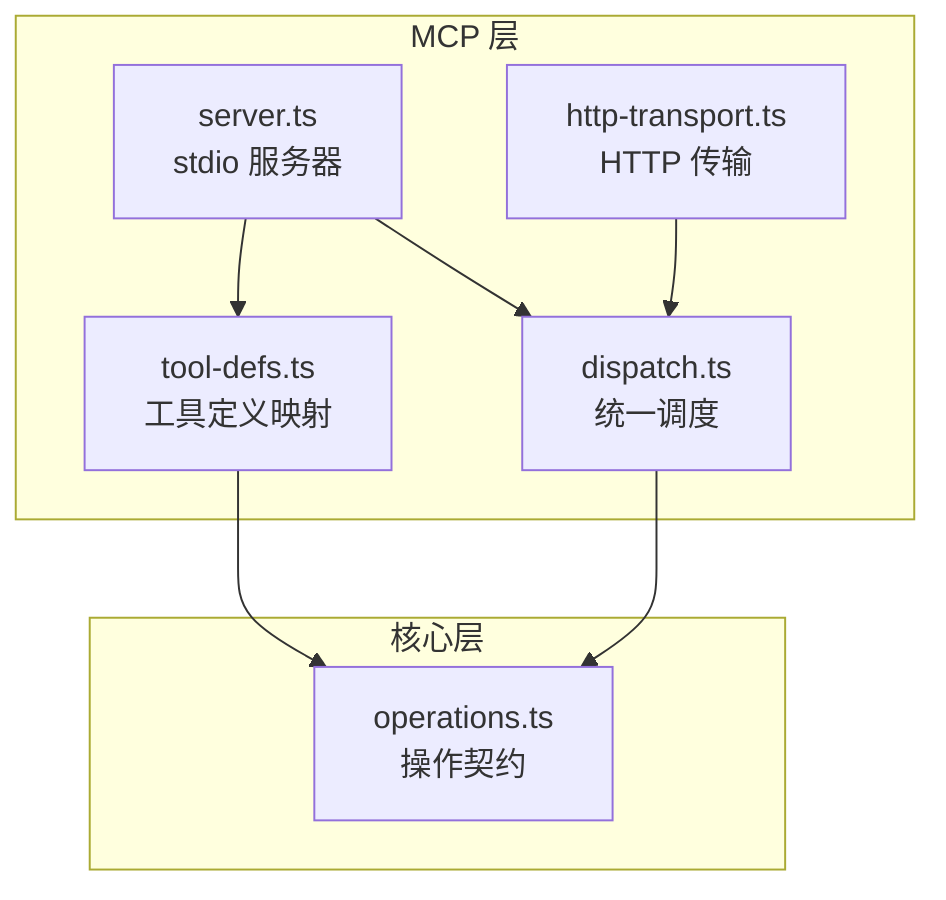
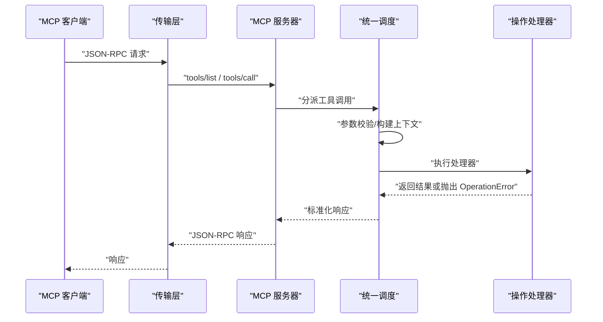
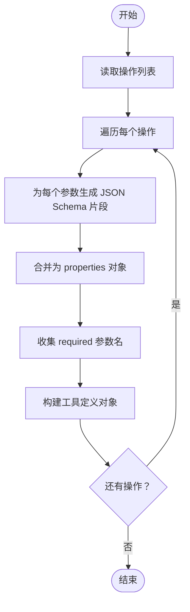
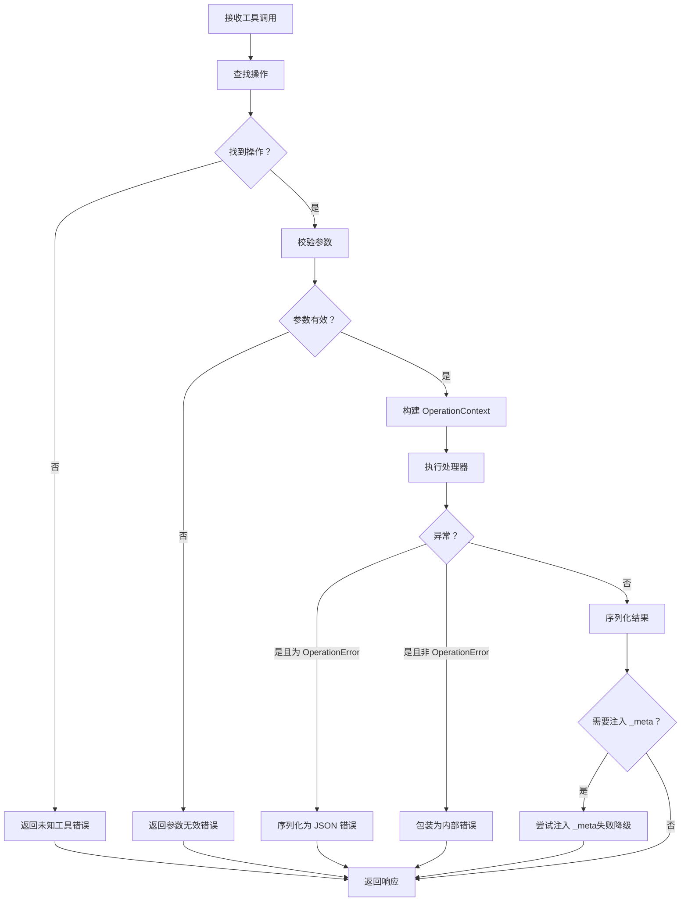
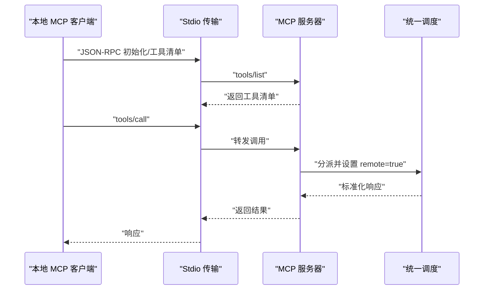
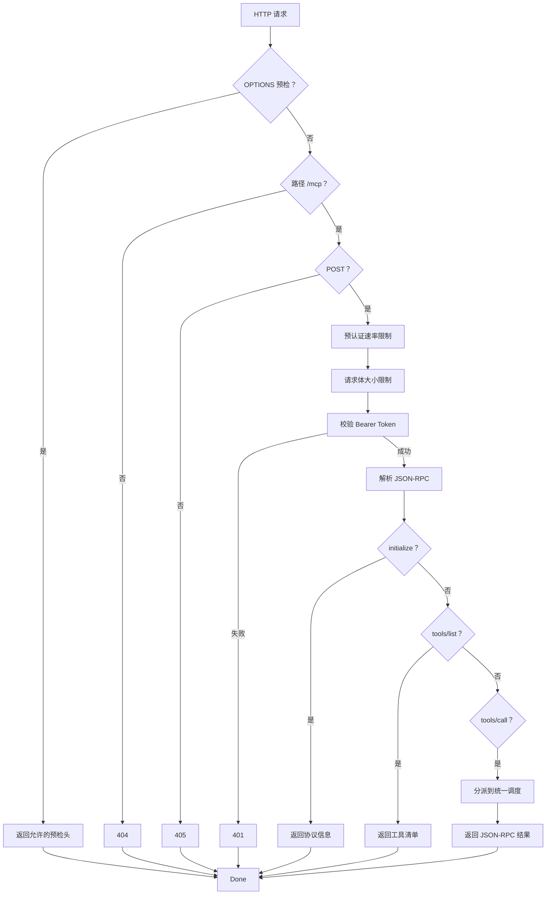
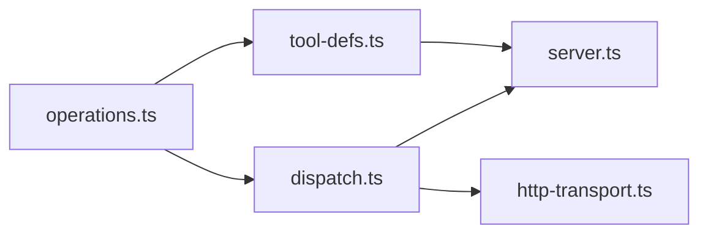

# MCP开发指南

<cite>
**本文档引用的文件**
- [server.ts](file://src/mcp/server.ts)
- [tool-defs.ts](file://src/mcp/tool-defs.ts)
- [dispatch.ts](file://src/mcp/dispatch.ts)
- [http-transport.ts](file://src/mcp/http-transport.ts)
- [operations.ts](file://src/core/operations.ts)
- [DEPLOY.md](file://docs/mcp/DEPLOY.md)
- [smoke-test-mcp.ts](file://scripts/smoke-test-mcp.ts)
- [mcp.test.ts](file://test/e2e/mcp.test.ts)
</cite>

## 目录
1. [简介](#简介)
2. [项目结构](#项目结构)
3. [核心组件](#核心组件)
4. [架构总览](#架构总览)
5. [详细组件分析](#详细组件分析)
6. [依赖关系分析](#依赖关系分析)
7. [性能考虑](#性能考虑)
8. [故障排除指南](#故障排除指南)
9. [结论](#结论)
10. [附录](#附录)

## 简介
本指南面向希望为 GBrain 开发自定义 MCP 工具与扩展其能力的开发者。内容涵盖：
- 如何编写符合规范的工具定义（基于操作契约）
- 参数校验与错误处理策略
- 工具注册、测试与调试方法
- MCP 服务器扩展机制与自定义传输层开发思路
- 开发环境搭建、调试工具与测试策略
- 实际开发示例与代码模板路径
- 版本管理、向后兼容性与发布流程
- 性能优化与最佳实践

## 项目结构
MCP 相关实现集中在 src/mcp 目录，并与核心操作定义 src/core/operations.ts 紧密耦合：
- src/mcp/server.ts：标准输入输出（stdio）MCP 服务器入口
- src/mcp/http-transport.ts：内置 HTTP 传输（OAuth 2.1 或遗留 Bearer Token）
- src/mcp/dispatch.ts：跨传输的统一调度与结果格式化
- src/mcp/tool-defs.ts：从操作定义生成 MCP 工具清单的映射器
- src/core/operations.ts：所有操作的契约定义（参数、权限、处理器等）

图表来源
- [server.ts:18-55](file://src/mcp/server.ts#L18-L55)
- [http-transport.ts:139-420](file://src/mcp/http-transport.ts#L139-L420)
- [dispatch.ts:222-283](file://src/mcp/dispatch.ts#L222-L283)
- [tool-defs.ts:40-54](file://src/mcp/tool-defs.ts#L40-L54)
- [operations.ts:1-200](file://src/core/operations.ts#L1-L200)

章节来源
- [server.ts:18-149](file://src/mcp/server.ts#L18-L149)
- [http-transport.ts:139-421](file://src/mcp/http-transport.ts#L139-L421)
- [tool-defs.ts:1-55](file://src/mcp/tool-defs.ts#L1-L55)
- [operations.ts:1-200](file://src/core/operations.ts#L1-L200)

## 核心组件
- 操作契约（operations.ts）：定义每个操作的名称、描述、参数（含类型、是否必填、枚举、默认值、数组项等）、处理器、权限与 CLI 提示。这是 MCP 工具定义的唯一真相源。
- 工具定义映射（tool-defs.ts）：将操作契约转换为 MCP 工具清单（含 inputSchema），确保 stdio 与 HTTP 两套传输一致。
- 统一调度（dispatch.ts）：对工具调用进行参数校验、构建上下文、执行处理器、格式化结果与错误包装，保证两种传输的一致行为。
- 服务器（server.ts）：注册工具清单与工具调用处理器，绑定 stdio 传输；在特定引擎配置下启用实体解析反射通道。
- HTTP 传输（http-transport.ts）：内置 HTTP 服务器，支持 OAuth 2.1（授权码/PKCE、客户端凭证、刷新轮换）与遗留 Bearer Token；具备 CORS、速率限制、请求体大小限制、访问令牌校验与日志记录。

章节来源
- [operations.ts:1-200](file://src/core/operations.ts#L1-L200)
- [tool-defs.ts:1-55](file://src/mcp/tool-defs.ts#L1-L55)
- [dispatch.ts:1-284](file://src/mcp/dispatch.ts#L1-L284)
- [server.ts:18-149](file://src/mcp/server.ts#L18-L149)
- [http-transport.ts:1-421](file://src/mcp/http-transport.ts#L1-L421)

## 架构总览
MCP 调用在两种传输中共享同一调度逻辑，确保行为一致性：
- stdio：本地代理（如 Claude Code/Cursor/Windsurf）直接连接进程的标准输入输出
- HTTP：远程客户端通过 OAuth 2.1 或遗留 Bearer Token 访问 /mcp 接口

图表来源
- [server.ts:27-55](file://src/mcp/server.ts#L27-L55)
- [dispatch.ts:222-283](file://src/mcp/dispatch.ts#L222-L283)
- [http-transport.ts:374-396](file://src/mcp/http-transport.ts#L374-L396)

## 详细组件分析

### 组件A：工具定义映射（tool-defs.ts）
- 功能要点
  - 将操作契约中的参数定义（ParamDef）映射为 JSON Schema 片段，递归处理数组项
  - 生成 MCP 工具清单（包含 name、description、inputSchema.properties、required）
  - 作为 stdio 服务器与 HTTP 传输的共同数据源，避免三处映射漂移
- 关键接口
  - paramDefToSchema：单个参数到 JSON Schema 的映射
  - buildToolDefs：批量生成工具定义
- 复杂度与性能
  - 时间复杂度：O(N×P)，N 为操作数，P 为平均参数数
  - 采用集中式映射减少重复计算与不一致风险

图表来源
- [tool-defs.ts:40-54](file://src/mcp/tool-defs.ts#L40-L54)
- [tool-defs.ts:30-38](file://src/mcp/tool-defs.ts#L30-L38)

章节来源
- [tool-defs.ts:1-55](file://src/mcp/tool-defs.ts#L1-L55)

### 组件B：统一调度（dispatch.ts）
- 功能要点
  - validateParams：严格校验必填与类型匹配
  - buildOperationContext：构建 OperationContext（含 remote、dryRun、takesHoldersAllowList、sourceId、auth 等）
  - dispatchToolCall：解析操作、校验参数、执行处理器、格式化结果与错误包装
  - 支持 _meta 注入（如热记忆），失败时降级为无 _meta
- 错误处理
  - OperationError：标准化错误结构（含 code、message、suggestion、docs）
  - 非 OperationError：包装为内部错误
  - 未知工具：返回 JSON 形式的错误内容
- 日志与隐私
  - summarizeMcpParams：对请求参数进行脱敏摘要（仅暴露形状与近似字节大小）

图表来源
- [dispatch.ts:222-283](file://src/mcp/dispatch.ts#L222-L283)
- [dispatch.ts:170-187](file://src/mcp/dispatch.ts#L170-L187)
- [dispatch.ts:195-214](file://src/mcp/dispatch.ts#L195-L214)

章节来源
- [dispatch.ts:1-284](file://src/mcp/dispatch.ts#L1-L284)

### 组件C：stdio 服务器（server.ts）
- 功能要点
  - 注册 ListTools 与 CallTool 处理器
  - 默认 remote=true，stdion MCP 使用受限的 takesHolder 白名单
  - 在 PGLite 引擎上启动实体解析反射 IPC 服务（best-effort）
  - 优雅关闭：监听 stdin EOF、传输关闭与信号
- 兼容性
  - handleToolCall 向后兼容本地 CLI 调用（remote=false）

图表来源
- [server.ts:27-55](file://src/mcp/server.ts#L27-L55)
- [server.ts:129-148](file://src/mcp/server.ts#L129-L148)

章节来源
- [server.ts:18-149](file://src/mcp/server.ts#L18-L149)

### 组件D：HTTP 传输（http-transport.ts）
- 功能要点
  - 支持 OAuth 2.1（授权码/PKCE、客户端凭证、刷新轮换）与遗留 Bearer Token
  - CORS 白名单控制、预检安全、速率限制（IP 与令牌维度）
  - 请求体大小限制、客户端 IP 解析（可信任代理头）
  - 访问令牌校验与使用统计、请求日志表写入
- 安全模型
  - 所有非健康检查请求需携带 Bearer Token（除 /health）
  - 令牌哈希存储于 access_tokens 表，支持 per-token takes_holder 白名单与 source 隔离
- 端点
  - /health：数据库连通性探测
  - /mcp：JSON-RPC 方法集合（initialize、tools/list、tools/call 等）

图表来源
- [http-transport.ts:244-404](file://src/mcp/http-transport.ts#L244-L404)

章节来源
- [http-transport.ts:1-421](file://src/mcp/http-transport.ts#L1-L421)

### 组件E：操作契约（operations.ts）
- 功能要点
  - 定义操作名称、描述、参数（类型、是否必填、枚举、默认值、数组项等）
  - 定义处理器函数与可选 CLI 提示
  - 定义错误码（ErrorCode）与 OperationError 包装
  - 文件上传路径校验、页面 slug 校验、白名单匹配等专用校验器
- 重要类型与类
  - ErrorCode：开放联合类型，便于未来扩展
  - OperationError：标准化错误结构
  - validateUploadPath、validatePageSlug 等校验器

章节来源
- [operations.ts:50-200](file://src/core/operations.ts#L50-L200)

## 依赖关系分析
- server.ts 依赖 tool-defs.ts 生成工具清单，依赖 dispatch.ts 进行工具调用分派
- http-transport.ts 同样依赖 tool-defs.ts 与 dispatch.ts
- dispatch.ts 依赖 operations.ts 获取操作定义与处理器
- tool-defs.ts 依赖 operations.ts 的 ParamDef 结构
- operations.ts 为所有组件提供单一真相源

图表来源
- [server.ts:7-8](file://src/mcp/server.ts#L7-L8)
- [http-transport.ts:30-36](file://src/mcp/http-transport.ts#L30-L36)
- [tool-defs.ts:1](file://src/mcp/tool-defs.ts#L1)
- [dispatch.ts:10-12](file://src/mcp/dispatch.ts#L10-L12)

章节来源
- [server.ts:1-149](file://src/mcp/server.ts#L1-L149)
- [http-transport.ts:1-421](file://src/mcp/http-transport.ts#L1-L421)
- [tool-defs.ts:1-55](file://src/mcp/tool-defs.ts#L1-L55)
- [dispatch.ts:1-284](file://src/mcp/dispatch.ts#L1-L284)
- [operations.ts:1-200](file://src/core/operations.ts#L1-L200)

## 性能考虑
- 统一分派与映射
  - 通过集中式映射与分派，避免重复校验与重复序列化，降低开销
- 速率限制与资源保护
  - HTTP 传输提供 IP 与令牌维度的速率限制，防止滥用
  - 请求体大小限制与流式读取，避免内存膨胀
- 日志与隐私
  - 请求参数摘要脱敏，避免敏感信息泄露同时保留大小信号
- 引擎适配
  - 统一 SQL 查询接口适配 Postgres 与 PGLite，减少分支判断成本

## 故障排除指南
- 常见错误与定位
  - 未知工具：确认工具名与 operations.ts 中的操作名一致
  - 参数无效：检查 inputSchema 与参数类型、必填字段
  - 权限不足：确认令牌范围与 source 隔离配置
  - 远程 MCP 不可用：检查 stdio 传输是否正确连接，或 HTTP 服务器状态与 CORS 配置
- 调试建议
  - 使用内置 smoke 测试脚本验证基本功能
  - 查看 HTTP 传输日志与 /health 健康检查
  - 在本地 stdio 模式下快速迭代，再切换到 HTTP 模式

章节来源
- [smoke-test-mcp.ts:1-97](file://scripts/smoke-test-mcp.ts#L1-L97)
- [http-transport.ts:257-272](file://src/mcp/http-transport.ts#L257-L272)

## 结论
通过将操作契约、工具定义映射与统一调度解耦，MCP 在本地与远程场景下实现了高度一致的行为与强大的安全性。遵循本文档的规范与最佳实践，您可以稳定地扩展 GBrain 的工具集并安全地接入各类 AI 客户端。

## 附录

### A. 开发环境搭建
- 运行本地 stdio 服务器
  - 直接运行：gbrain serve
  - 适用于 Claude Code、Cursor、Windsurf 等支持 stdio 的客户端
- 运行内置 HTTP 服务器（推荐）
  - gbrain serve --http --port 3131
  - 通过 ngrok 或云主机暴露公网地址
  - 使用 OAuth 2.1（授权码/PKCE、客户端凭证）或遗留 Bearer Token

章节来源
- [DEPLOY.md:18-48](file://docs/mcp/DEPLOY.md#L18-L48)
- [DEPLOY.md:71-96](file://docs/mcp/DEPLOY.md#L71-L96)

### B. 工具定义编写规范
- 基于操作契约（operations.ts）
  - 在操作定义中明确参数类型、是否必填、枚举值、默认值与数组项结构
  - 保持描述清晰，便于 MCP 客户端展示
- 映射一致性
  - 使用 tool-defs.ts 的 paramDefToSchema 与 buildToolDefs，确保与 HTTP 传输一致
- 示例参考
  - 参考现有操作定义与工具清单生成逻辑

章节来源
- [tool-defs.ts:13-38](file://src/mcp/tool-defs.ts#L13-L38)
- [tool-defs.ts:40-54](file://src/mcp/tool-defs.ts#L40-L54)
- [operations.ts:1-200](file://src/core/operations.ts#L1-L200)

### C. 参数验证与错误处理
- 参数校验
  - 必填字段缺失、类型不匹配将触发参数无效错误
- 错误包装
  - OperationError 标准化错误结构；非 OperationError 统一封装为内部错误
  - 未知工具返回 JSON 形式的错误内容
- _meta 注入
  - 成功时可注入 _meta（如热记忆），失败时降级为无 _meta

章节来源
- [dispatch.ts:170-187](file://src/mcp/dispatch.ts#L170-L187)
- [dispatch.ts:270-282](file://src/mcp/dispatch.ts#L270-L282)
- [dispatch.ts:255-267](file://src/mcp/dispatch.ts#L255-L267)

### D. 工具注册、测试与调试
- 工具注册
  - 通过修改 operations.ts 新增操作，自动纳入工具清单
- 测试
  - 使用 smoke-test-mcp.ts 验证基本 CRUD 与 dry_run 行为
  - 使用 e2e 测试验证工具清单生成与模块加载
- 调试
  - 优先在本地 stdio 模式下调试，再切换到 HTTP 模式
  - 关注日志与健康检查端点

章节来源
- [smoke-test-mcp.ts:1-97](file://scripts/smoke-test-mcp.ts#L1-L97)
- [mcp.test.ts:1-68](file://test/e2e/mcp.test.ts#L1-L68)

### E. MCP 服务器扩展与自定义传输层
- 扩展机制
  - 以 dispatch.ts 为核心，新增传输只需实现 JSON-RPC 到分派的桥接
  - 保持参数校验、上下文构建与结果格式一致
- 自定义传输层开发要点
  - 解析 JSON-RPC 请求，提取 method 与 params
  - 根据传输特性设置 remote、takesHoldersAllowList、sourceId、auth
  - 调用 dispatchToolCall 并按传输约定返回响应

章节来源
- [dispatch.ts:30-73](file://src/mcp/dispatch.ts#L30-L73)
- [dispatch.ts:222-283](file://src/mcp/dispatch.ts#L222-L283)

### F. 版本管理、向后兼容性与发布流程
- 向后兼容
  - ErrorCode 采用开放联合类型，新增错误码不影响现有消费者
  - 工具定义映射集中化，避免多处映射漂移
- 发布建议
  - 变更操作契约时，同步更新工具定义映射与客户端提示
  - 通过 e2e 测试与 smoke 测试保障兼容性

章节来源
- [operations.ts:60-94](file://src/core/operations.ts#L60-L94)
- [tool-defs.ts:13-38](file://src/mcp/tool-defs.ts#L13-L38)