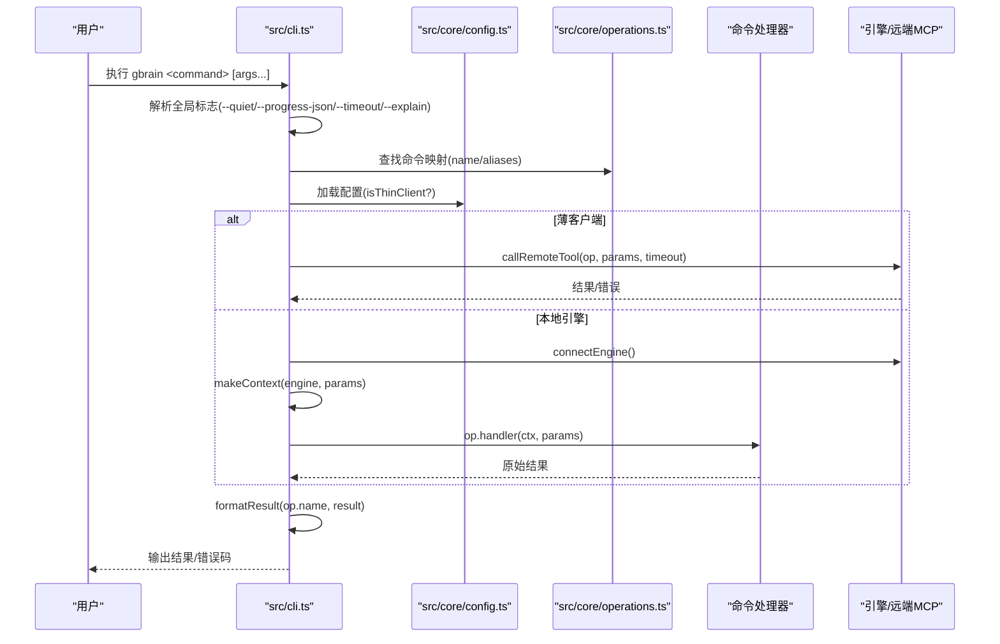
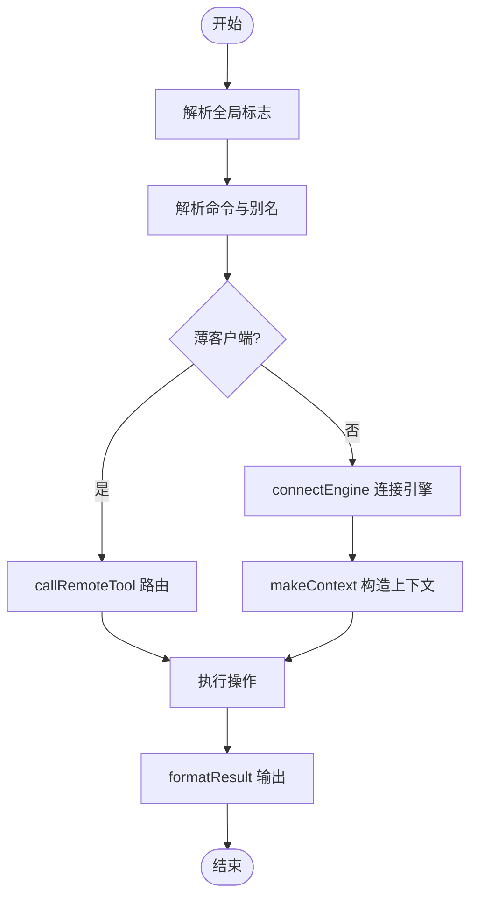

# 命令行指南

<cite>
**本文引用的文件**
- [src/cli.ts](file://src/cli.ts)
- [src/core/operations.ts](file://src/core/operations.ts)
- [src/core/cli-options.ts](file://src/core/cli-options.ts)
- [src/core/config.ts](file://src/core/config.ts)
- [README.md](file://README.md)
- [docs/INSTALL.md](file://docs/INSTALL.md)
- [src/commands/init.ts](file://src/commands/init.ts)
- [src/commands/sync.ts](file://src/commands/sync.ts)
- [src/commands/import.ts](file://src/commands/import.ts)
- [src/commands/export.ts](file://src/commands/export.ts)
- [src/commands/config.ts](file://src/commands/config.ts)
- [src/commands/doctor.ts](file://src/commands/doctor.ts)
- [src/commands/search.ts](file://src/commands/search.ts)
- [src/commands/think.ts](file://src/commands/think.ts)
- [src/commands/capture.ts](file://src/commands/capture.ts)
- [src/commands/serve.ts](file://src/commands/serve.ts)
- [src/commands/connect.ts](file://src/commands/connect.ts)
- [src/commands/schema.ts](file://src/commands/schema.ts)
- [src/commands/skillpack.ts](file://src/commands/skillpack.ts)
- [src/commands/migrate.ts](file://src/commands/migrate.ts)
- [src/commands/extract.ts](file://src/commands/extract.ts)
- [src/commands/reindex.ts](file://src/commands/reindex.ts)
- [src/commands/frontmatter.ts](file://src/commands/frontmatter.ts)
- [src/commands/graph-query.ts](file://src/commands/graph-query.ts)
- [src/commands/sources.ts](file://src/commands/sources.ts)
- [src/commands/mounts.ts](file://src/commands/mounts.ts)
- [src/commands/storage.ts](file://src/commands/storage.ts)
- [src/commands/models.ts](file://src/commands/models.ts)
- [src/commands/providers.ts](file://src/commands/providers.ts)
- [src/commands/eval.ts](file://src/commands/eval.ts)
- [src/commands/jobs.ts](file://src/commands/jobs.ts)
- [src/commands/agent.ts](file://src/commands/agent.ts)
- [src/commands/autopilot.ts](file://src/commands/autopilot.ts)
- [src/commands/watch.ts](file://src/commands/watch.ts)
- [src/commands/self-upgrade.ts](file://src/commands/self-upgrade.ts)
- [src/commands/status.ts](file://src/commands/status.ts)
- [src/commands/resolvers.ts](file://src/commands/resolvers.ts)
- [src/commands/friction.ts](file://src/commands/friction.ts)
- [src/commands/claw-test.ts](file://src/commands/claw-test.ts)
- [src/commands/book-mirror.ts](file://src/commands/book-mirror.ts)
- [src/commands/takes.ts](file://src/commands/takes.ts)
- [src/commands/transcripts.ts](file://src/commands/transcripts.ts)
- [src/commands/anomalies.ts](file://src/commands/anomalies.ts)
- [src/commands/salience.ts](file://src/commands/salience.ts)
- [src/commands/edges-backfill.ts](file://src/commands/edges-backfill.ts)
- [src/commands/cache.ts](file://src/commands/cache.ts)
- [src/commands/ze-switch.ts](file://src/commands/ze-switch.ts)
- [src/commands/founders.ts](file://src/commands/founders.ts)
- [src/commands/brainstorm.ts](file://src/commands/brainstorm.ts)
- [src/commands/lsd.ts](file://src/commands/lsd.ts)
- [src/commands/capture.ts](file://src/commands/capture.ts)
- [src/commands/onboard.ts](file://src/commands/onboard.ts)
- [src/commands/conversation-parser.ts](file://src/commands/conversation-parser.ts)
- [src/commands/quarantine.ts](file://src/commands/quarantine.ts)
- [src/commands/advisor.ts](file://src/commands/advisor.ts)
- [src/commands/reconcile-links.ts](file://src/commands/reconcile-links.ts)
- [src/commands/reimbursement.ts](file://src/commands/reimbursement.ts)
- [src/commands/repair-jsonb.ts](file://src/commands/repair-jsonb.ts)
- [src/commands/orphans.ts](file://src/commands/orphans.ts)
- [src/commands/integrity.ts](file://src/commands/integrity.ts)
- [src/commands/routing-eval.ts](file://src/commands/routing-eval.ts)
- [src/commands/skillify.ts](file://src/commands/skillify.ts)
- [src/commands/smoke-test.ts](file://src/commands/smoke-test.ts)
- [src/commands/apply-migrations.ts](file://src/commands/apply-migrations.ts)
- [src/commands/skillpack-check.ts](file://src/commands/skillpack-check.ts)
- [src/commands/check-resolvable.ts](file://src/commands/check-resolvable.ts)
- [src/commands/remotes.ts](file://src/commands/remotes.ts)
- [src/commands/remote.ts](file://src/commands/remote.ts)
- [src/commands/auth.ts](file://src/commands/auth.ts)
- [src/commands/whoknows.ts](file://src/commands/whoknows.ts)
- [src/commands/retrieve.ts](file://src/commands/retrieve.ts)
- [src/commands/recall.ts](file://src/commands/recall.ts)
- [src/commands/forget.ts](file://src/commands/forget.ts)
- [src/commands/edges.ts](file://src/commands/edges.ts)
- [src/commands/edges-backfill.ts](file://src/commands/edges-backfill.ts)
- [src/commands/edges-backfill.ts](file://src/commands/edges-backfill.ts)
</cite>

## 目录
1. [简介](#简介)
2. [项目结构](#项目结构)
3. [核心组件](#核心组件)
4. [架构总览](#架构总览)
5. [详细组件分析](#详细组件分析)
6. [依赖关系分析](#依赖关系分析)
7. [性能考量](#性能考量)
8. [故障排除指南](#故障排除指南)
9. [结论](#结论)
10. [附录](#附录)

## 简介
本指南面向使用者与开发者，系统性梳理 GBrain 命令行界面（CLI）的完整使用方法，覆盖初始化、查询、导入、同步、配置管理、模式切换、模型与提供商管理、评估与诊断、作业队列、代理与自动运行、薄客户端路由、错误处理与升级提示等主题。文档同时提供常见工作流示例（个人知识管理、团队协作、AI 代理集成），并给出性能优化建议与批量操作技巧。

## 项目结构
- CLI 入口与分发：src/cli.ts 负责解析全局标志、构建命令映射、执行薄客户端路由、调用本地引擎或远程工具，并统一格式化输出与退出码。
- 操作定义：src/core/operations.ts 定义了所有“操作”（Operation）及其参数、作用域与 CLI 提示，是 CLI/MCP 的单一事实来源。
- 全局选项：src/core/cli-options.ts 解析 --quiet/--progress-json/--progress-interval/--timeout/--explain 等全局标志。
- 配置系统：src/core/config.ts 提供配置加载、优先级与环境变量映射，支持文件平面与数据库平面配置。
- 命令实现：src/commands 下的各模块实现具体命令，遵循统一的参数解析、上下文构造与结果格式化流程。

图示来源
- [src/cli.ts](file://src/cli.ts)
- [src/core/operations.ts](file://src/core/operations.ts)
- [src/core/cli-options.ts](file://src/core/cli-options.ts)
- [src/core/config.ts](file://src/core/config.ts)

章节来源
- [src/cli.ts](file://src/cli.ts)
- [src/core/operations.ts](file://src/core/operations.ts)
- [src/core/cli-options.ts](file://src/core/cli-options.ts)
- [src/core/config.ts](file://src/core/config.ts)

## 核心组件
- 命令发现与分发
  - CLI 将 operations 中的 Operation 构建为 name → op 映射；同时维护 CLI_ONLY 与 CLI_ONLY_SELF_HELP 集合，用于区分仅 CLI 命令与需要自打印帮助的命令。
  - 支持别名（cliAliases），在模块加载时进行冲突检测，避免与主命令或其它别名冲突。
- 全局标志解析
  - 在命令分发前解析 --quiet、--progress-json、--progress-interval、--timeout、--explain，确保如 gbrain --progress-json doctor 正常工作。
- 薄客户端路由
  - 当 isThinClient(cfg) 为真时，非 localOnly 的共享操作通过 callRemoteTool 路由到远端 MCP 服务器；支持 SIGINT 中断、超时策略与详尽的错误分类渲染。
- 上下文与超时
  - makeContext 解析 sourceId；读操作默认 180 秒墙钟超时，可被 --timeout 覆盖；写操作与管理操作不设默认超时。
- 输出与退出
  - 统一通过 formatResult 渲染；错误通过 OperationError 或 RemoteMcpError 分类输出；通过 setCliExitVerdict 与 finishCliTeardown 确保资源回收与稳定退出。

章节来源
- [src/cli.ts](file://src/cli.ts)
- [src/core/operations.ts](file://src/core/operations.ts)
- [src/core/cli-options.ts](file://src/core/cli-options.ts)

## 架构总览
下图展示 CLI 主流程：从解析全局标志到选择本地引擎或薄客户端路由，再到上下文构造、操作执行与结果输出。

图示来源
- [src/cli.ts](file://src/cli.ts)
- [src/core/config.ts](file://src/core/config.ts)
- [src/core/operations.ts](file://src/core/operations.ts)

## 详细组件分析

### 初始化与连接
- 初始化
  - gbrain init [--pglite|--postgres|--supabase] [--embedding-model <id>] [--no-embedding] [--migrate-only]
  - 作用：创建本地脑库（PGLite 默认）、引导技能包、健康检查；支持无嵌入模式与迁移模式。
  - 参考：[src/commands/init.ts](file://src/commands/init.ts)
- 连接与薄客户端
  - gbrain connect <mcp-url> [--token <bearer>|--oauth --register] [--agent <client>] [--install]
  - 作用：将本地 CLI 连接到远端 MCP 服务，支持 OAuth 注册与安装验证。
  - 参考：[src/commands/connect.ts](file://src/commands/connect.ts)
- 服务端
  - gbrain serve [--http] [--port <n>] [--admin]
  - 作用：启动本地 MCP 服务（stdio 或 HTTP），支持管理员面板与 OAuth。
  - 参考：[src/commands/serve.ts](file://src/commands/serve.ts)

章节来源
- [src/commands/init.ts](file://src/commands/init.ts)
- [src/commands/connect.ts](file://src/commands/connect.ts)
- [src/commands/serve.ts](file://src/commands/serve.ts)
- [docs/INSTALL.md](file://docs/INSTALL.md)

### 查询与合成
- 搜索
  - gbrain search "<query>" [--json] [--limit <n>] [--mode <conservative|balanced|tokenmax>] [--explain]
  - 作用：混合检索（向量+关键词+RRF+重排），返回页面列表；--explain 展示每阶段归因。
  - 参考：[src/commands/search.ts](file://src/commands/search.ts)
- 思维合成
  - gbrain think "<query>" [--json] [--budget <tokens>] [--explain]
  - 作用：在检索基础上生成合成答案、引用来源与缺口分析。
  - 参考：[src/commands/think.ts](file://src/commands/think.ts)

章节来源
- [src/commands/search.ts](file://src/commands/search.ts)
- [src/commands/think.ts](file://src/commands/think.ts)
- [README.md](file://README.md)

### 数据摄取与同步
- 捕获
  - gbrain capture "<text>" | gbrain capture --file <path> | echo "<text>" | gbrain capture --stdin [--quiet]
  - 作用：将内容落盘并入库，支持标准输入与文件路径；默认 slug 以 inbox/YYYY-MM-DD-<hash8> 形式组织。
  - 参考：[src/commands/capture.ts](file://src/commands/capture.ts)
- 导入
  - gbrain import <path> [--dry-run] [--watch] [--timeout <s>]
  - 作用：批量导入 Markdown 等内容；支持预演与监控模式。
  - 参考：[src/commands/import.ts](file://src/commands/import.ts)
- 同步
  - gbrain sync [--all] [--source <id>] [--timeout <s>] [--break-lock] [--max-age <s>] [--no-pull|--no-embed|--no-schema-pack]
  - 作用：增量同步源仓库，支持按源并发、锁破坏与阶段化开关；--max-age 自愈挂起锁。
  - 参考：[src/commands/sync.ts](file://src/commands/sync.ts)

章节来源
- [src/commands/capture.ts](file://src/commands/capture.ts)
- [src/commands/import.ts](file://src/commands/import.ts)
- [src/commands/sync.ts](file://src/commands/sync.ts)
- [README.md](file://README.md)

### 配置与健康检查
- 配置
  - gbrain config set <key> <value> | gbrain config get <key> | gbrain config list [--json]
  - 作用：设置/查看/列出配置项；支持文件平面与数据库平面合并视图。
  - 参考：[src/commands/config.ts](file://src/commands/config.ts)
- 健康检查
  - gbrain doctor [--json] [--fast]
  - 作用：全栈健康检查，定位缺失 API Key、嵌入维度不匹配、批处理重试异常等问题。
  - 参考：[src/commands/doctor.ts](file://src/commands/doctor.ts)

章节来源
- [src/commands/config.ts](file://src/commands/config.ts)
- [src/commands/doctor.ts](file://src/commands/doctor.ts)
- [src/core/config.ts](file://src/core/config.ts)

### 模式与技能包
- 模式切换
  - gbrain schema active|list|detect|suggest|review-candidates|use <pack> [--apply]
  - 作用：查看/检测/建议/评审/启用模式包；跨包切换不影响数据一致性。
  - 参考：[src/commands/schema.ts](file://src/commands/schema.ts)
- 技能包
  - gbrain skillpack scaffold|install|migrate-fence|reference <name>
  - 作用：脚手架/安装/迁移旧_fence/参考上游改进。
  - 参考：[src/commands/skillpack.ts](file://src/commands/skillpack.ts)

章节来源
- [src/commands/schema.ts](file://src/commands/schema.ts)
- [src/commands/skillpack.ts](file://src/commands/skillpack.ts)
- [README.md](file://README.md)

### 引擎与存储迁移
- 引擎迁移
  - gbrain migrate --to <pglite|postgres|supabase>
  - 作用：在不同引擎间迁移；配合 doctor 与 upgrade 使用。
  - 参考：[src/commands/migrate.ts](file://src/commands/migrate.ts)
- 应用迁移
  - gbrain apply-migrations [--yes]
  - 作用：应用数据库迁移；在某些环境下作为后安装钩子的回退方案。
  - 参考：[src/commands/apply-migrations.ts](file://src/commands/apply-migrations.ts)

章节来源
- [src/commands/migrate.ts](file://src/commands/migrate.ts)
- [src/commands/apply-migrations.ts](file://src/commands/apply-migrations.ts)
- [docs/INSTALL.md](file://docs/INSTALL.md)

### 知识图谱与实体抽取
- 实体抽取
  - gbrain extract [--all] [--source <id>] [--stdin] [--background] [--follow]
  - 作用：对页面进行事实抽取；支持后台提交与跟随日志。
  - 参考：[src/commands/extract.ts](file://src/commands/extract.ts)
- 重索引
  - gbrain reindex [--markdown|--aliases|--frontmatter] [--background]
  - 作用：重建索引；支持按类型与后台模式。
  - 参考：[src/commands/reindex.ts](file://src/commands/reindex.ts)
- 前言元数据
  - gbrain frontmatter <action> [--apply] [--fix]
  - 作用：前端元数据检测与修复。
  - 参考：[src/commands/frontmatter.ts](file://src/commands/frontmatter.ts)
- 图查询
  - gbrain graph-query "<pattern>"
  - 作用：多跳图遍历查询。
  - 参考：[src/commands/graph-query.ts](file://src/commands/graph-query.ts)

章节来源
- [src/commands/extract.ts](file://src/commands/extract.ts)
- [src/commands/reindex.ts](file://src/commands/reindex.ts)
- [src/commands/frontmatter.ts](file://src/commands/frontmatter.ts)
- [src/commands/graph-query.ts](file://src/commands/graph-query.ts)

### 源与挂载
- 源管理
  - gbrain sources list|add|remove|pull [--path <dir>] [--json]
  - 作用：列出/添加/移除/拉取源；pull --path 支持无引擎持久化的硬化工序。
  - 参考：[src/commands/sources.ts](file://src/commands/sources.ts)
- 挂载
  - gbrain mounts list|add|remove [--json]
  - 作用：团队挂载管理。
  - 参考：[src/commands/mounts.ts](file://src/commands/mounts.ts)

章节来源
- [src/commands/sources.ts](file://src/commands/sources.ts)
- [src/commands/mounts.ts](file://src/commands/mounts.ts)

### 存储与导出
- 存储
  - gbrain storage status|export|import [--json]
  - 作用：存储状态、导出/导入。
  - 参考：[src/commands/storage.ts](file://src/commands/storage.ts)
- 导出
  - gbrain export <path> [--include-attachments]
  - 作用：导出脑库内容。
  - 参考：[src/commands/export.ts](file://src/commands/export.ts)

章节来源
- [src/commands/storage.ts](file://src/commands/storage.ts)
- [src/commands/export.ts](file://src/commands/export.ts)

### 模型与提供商
- 模型
  - gbrain models [--json] | gbrain models doctor
  - 作用：查看已配置模型与探测可用性。
  - 参考：[src/commands/models.ts](file://src/commands/models.ts)
- 提供商
  - gbrain providers list|set|unset [--json]
  - 作用：提供商配置与管理。
  - 参考：[src/commands/providers.ts](file://src/commands/providers.ts)

章节来源
- [src/commands/models.ts](file://src/commands/models.ts)
- [src/commands/providers.ts](file://src/commands/providers.ts)

### 评估与诊断
- 评估
  - gbrain eval longmemeval|export|replay|cross-modal|retrieval-quality|...
  - 作用：基准评测、回放与交叉模态校验。
  - 参考：[src/commands/eval.ts](file://src/commands/eval.ts)
- 诊断
  - gbrain doctor [--json] | gbrain search diagnose "<query>" --target <slug>
  - 作用：健康检查与检索诊断。
  - 参考：[src/commands/doctor.ts](file://src/commands/doctor.ts)

章节来源
- [src/commands/eval.ts](file://src/commands/eval.ts)
- [src/commands/doctor.ts](file://src/commands/doctor.ts)

### 作业队列与代理
- 作业
  - gbrain jobs submit|get|list|follow|watch [--json]
  - 作用：提交/查看/跟踪作业。
  - 参考：[src/commands/jobs.ts](file://src/commands/jobs.ts)
- 代理
  - gbrain agent run "<task>" [--json]
  - 作用：以子代理执行任务。
  - 参考：[src/commands/agent.ts](file://src/commands/agent.ts)
- 自动运行
  - gbrain autopilot --install|run|status
  - 作用：安装/运行/查看夜间增强循环。
  - 参考：[src/commands/autopilot.ts](file://src/commands/autopilot.ts)

章节来源
- [src/commands/jobs.ts](file://src/commands/jobs.ts)
- [src/commands/agent.ts](file://src/commands/agent.ts)
- [src/commands/autopilot.ts](file://src/commands/autopilot.ts)

### 监控与运维
- 监控
  - gbrain watch [--json]
  - 作用：监听标准输入协议事件。
  - 参考：[src/commands/watch.ts](file://src/commands/watch.ts)
- 自升级
  - gbrain self-upgrade [--force] [--skip-prompt]
  - 作用：检查/静默/通知/禁用升级模式；热路径仅读缓存，失败开脱。
  - 参考：[src/commands/self-upgrade.ts](file://src/commands/self-upgrade.ts)
- 状态
  - gbrain status [--json]
  - 作用：查看当前状态。
  - 参考：[src/commands/status.ts](file://src/commands/status.ts)

章节来源
- [src/commands/watch.ts](file://src/commands/watch.ts)
- [src/commands/self-upgrade.ts](file://src/commands/self-upgrade.ts)
- [src/commands/status.ts](file://src/commands/status.ts)

### 高级与专项命令
- 解析器/摩擦点/测试/镜像/创始人/头脑风暴/LSD/Onboard/对话解析器/隔离区/顾问/链接协调/修复JSONB/孤儿/完整性/路由评估/技能化/冒烟测试/检查可解析/远程/认证/专家/检索/回忆/忘记/边
  - 参考对应文件：[src/commands/resolvers.ts](file://src/commands/resolvers.ts)、[src/commands/friction.ts](file://src/commands/friction.ts)、[src/commands/claw-test.ts](file://src/commands/claw-test.ts)、[src/commands/book-mirror.ts](file://src/commands/book-mirror.ts)、[src/commands/founders.ts](file://src/commands/founders.ts)、[src/commands/brainstorm.ts](file://src/commands/brainstorm.ts)、[src/commands/lsd.ts](file://src/commands/lsd.ts)、[src/commands/onboard.ts](file://src/commands/onboard.ts)、[src/commands/conversation-parser.ts](file://src/commands/conversation-parser.ts)、[src/commands/quarantine.ts](file://src/commands/quarantine.ts)、[src/commands/advisor.ts](file://src/commands/advisor.ts)、[src/commands/reconcile-links.ts](file://src/commands/reconcile-links.ts)、[src/commands/repair-jsonb.ts](file://src/commands/repair-jsonb.ts)、[src/commands/orphans.ts](file://src/commands/orphans.ts)、[src/commands/integrity.ts](file://src/commands/integrity.ts)、[src/commands/routing-eval.ts](file://src/commands/routing-eval.ts)、[src/commands/skillify.ts](file://src/commands/skillify.ts)、[src/commands/smoke-test.ts](file://src/commands/smoke-test.ts)、[src/commands/check-resolvable.ts](file://src/commands/check-resolvable.ts)、[src/commands/remotes.ts](file://src/commands/remotes.ts)、[src/commands/remote.ts](file://src/commands/remote.ts)、[src/commands/auth.ts](file://src/commands/auth.ts)、[src/commands/whoknows.ts](file://src/commands/whoknows.ts)、[src/commands/retrieve.ts](file://src/commands/retrieve.ts)、[src/commands/recall.ts](file://src/commands/recall.ts)、[src/commands/forget.ts](file://src/commands/forget.ts)、[src/commands/edges.ts](file://src/commands/edges.ts)、[src/commands/edges-backfill.ts](file://src/commands/edges-backfill.ts)

章节来源
- [src/commands/resolvers.ts](file://src/commands/resolvers.ts)
- [src/commands/friction.ts](file://src/commands/friction.ts)
- [src/commands/claw-test.ts](file://src/commands/claw-test.ts)
- [src/commands/book-mirror.ts](file://src/commands/book-mirror.ts)
- [src/commands/founders.ts](file://src/commands/founders.ts)
- [src/commands/brainstorm.ts](file://src/commands/brainstorm.ts)
- [src/commands/lsd.ts](file://src/commands/lsd.ts)
- [src/commands/onboard.ts](file://src/commands/onboard.ts)
- [src/commands/conversation-parser.ts](file://src/commands/conversation-parser.ts)
- [src/commands/quarantine.ts](file://src/commands/quarantine.ts)
- [src/commands/advisor.ts](file://src/commands/advisor.ts)
- [src/commands/reconcile-links.ts](file://src/commands/reconcile-links.ts)
- [src/commands/repair-jsonb.ts](file://src/commands/repair-jsonb.ts)
- [src/commands/orphans.ts](file://src/commands/orphans.ts)
- [src/commands/integrity.ts](file://src/commands/integrity.ts)
- [src/commands/routing-eval.ts](file://src/commands/routing-eval.ts)
- [src/commands/skillify.ts](file://src/commands/skillify.ts)
- [src/commands/smoke-test.ts](file://src/commands/smoke-test.ts)
- [src/commands/check-resolvable.ts](file://src/commands/check-resolvable.ts)
- [src/commands/remotes.ts](file://src/commands/remotes.ts)
- [src/commands/remote.ts](file://src/commands/remote.ts)
- [src/commands/auth.ts](file://src/commands/auth.ts)
- [src/commands/whoknows.ts](file://src/commands/whoknows.ts)
- [src/commands/retrieve.ts](file://src/commands/retrieve.ts)
- [src/commands/recall.ts](file://src/commands/recall.ts)
- [src/commands/forget.ts](file://src/commands/forget.ts)
- [src/commands/edges.ts](file://src/commands/edges.ts)
- [src/commands/edges-backfill.ts](file://src/commands/edges-backfill.ts)

## 依赖关系分析
- 命令到操作的映射
  - CLI 通过 operations 构建 name/alias → Operation 的映射；CLI_ONLY 与 CLI_ONLY_SELF_HELP 决定是否绕过通用帮助短路。
- 薄客户端与本地引擎
  - isThinClient(cfg) 为真时，非 localOnly 的共享操作走 callRemoteTool；否则连接本地引擎。
- 参数解析与上下文
  - parseOpArgs 解析位置参数与标志；makeContext 解析 sourceId 并构造 OperationContext。
- 错误与退出
  - OperationError 与 RemoteMcpError 提供统一错误语义；finishCliTeardown 确保资源回收。

图示来源
- [src/cli.ts](file://src/cli.ts)
- [src/core/operations.ts](file://src/core/operations.ts)
- [src/core/cli-options.ts](file://src/core/cli-options.ts)

章节来源
- [src/cli.ts](file://src/cli.ts)
- [src/core/operations.ts](file://src/core/operations.ts)
- [src/core/cli-options.ts](file://src/core/cli-options.ts)

## 性能考量
- 读操作默认 180 秒墙钟超时，可通过 --timeout 调整；写与管理操作不设默认超时。
- 批量导入/重索引/抽取支持 --background 与 --follow，利用 Minion 队列实现可恢复与可观测性。
- 大脑同步建议使用 per-source 循环 + timeout，结合 --max-age 自愈挂起锁。
- PGLite 脑库在同步期间停止 serve，避免单写锁竞争。
- 批量写入具备自愈重试与抖动退避，可通过环境变量微调重试策略。

章节来源
- [src/cli.ts](file://src/cli.ts)
- [src/core/cli-options.ts](file://src/core/cli-options.ts)
- [README.md](file://README.md)

## 故障排除指南
- 嵌入维度不匹配
  - 症状：import 报错“期望 N 维度，实际 M”
  - 处理：运行 gbrain doctor，按提示修复；或在 init 时显式指定 --embedding-model
  - 参考：[README.md](file://README.md)
- 同步超时/卡住
  - 症状：hourly cron 超时；大文件导致 CPU 占用高
  - 处理：使用 per-source 循环 + timeout；开启 GBRAIN_SYNC_TRACE 定位卡住文件；必要时禁用 schema-pack
  - 参考：[README.md](file://README.md)
- 连接/认证问题
  - 症状：薄客户端网络/鉴权失败
  - 处理：使用 gbrain remote doctor；OAuth discovery/auth 失败时重新注册客户端
  - 参考：[src/cli.ts](file://src/cli.ts)
- 数据库连接中断
  - 症状：“无数据库连接”错误
  - 处理：等待 drainPending 完成后再断开；使用 doctor 检查断连审计
  - 参考：[src/cli.ts](file://src/cli.ts)

章节来源
- [README.md](file://README.md)
- [src/cli.ts](file://src/cli.ts)

## 结论
本指南系统梳理了 GBrain CLI 的命令族、薄客户端路由与错误处理机制，并提供了性能优化与批量操作技巧。结合个人知识管理、团队协作与 AI 代理集成的工作流，用户可以高效地完成从初始化、摄取、同步到查询与治理的全链路任务。

## 附录

### 常用工作流示例
- 个人知识管理
  - 初始化 → 捕获/导入 → 同步 → 查询/思维合成 → 健康检查
  - 参考：[docs/INSTALL.md](file://docs/INSTALL.md)
- 团队协作
  - 远端 MCP 服务 → connect 认证 → sources/mounts 管理 → schema 切换 → autopilot 增强
  - 参考：[src/commands/connect.ts](file://src/commands/connect.ts)、[src/commands/sources.ts](file://src/commands/sources.ts)、[src/commands/mounts.ts](file://src/commands/mounts.ts)、[src/commands/schema.ts](file://src/commands/schema.ts)、[src/commands/autopilot.ts](file://src/commands/autopilot.ts)
- AI 代理集成
  - 本地/远程 MCP → 代理任务执行 → 作业队列 → 评估与回放
  - 参考：[src/commands/serve.ts](file://src/commands/serve.ts)、[src/commands/agent.ts](file://src/commands/agent.ts)、[src/commands/jobs.ts](file://src/commands/jobs.ts)、[src/commands/eval.ts](file://src/commands/eval.ts)

章节来源
- [docs/INSTALL.md](file://docs/INSTALL.md)
- [src/commands/connect.ts](file://src/commands/connect.ts)
- [src/commands/sources.ts](file://src/commands/sources.ts)
- [src/commands/mounts.ts](file://src/commands/mounts.ts)
- [src/commands/schema.ts](file://src/commands/schema.ts)
- [src/commands/autopilot.ts](file://src/commands/autopilot.ts)
- [src/commands/serve.ts](file://src/commands/serve.ts)
- [src/commands/agent.ts](file://src/commands/agent.ts)
- [src/commands/jobs.ts](file://src/commands/jobs.ts)
- [src/commands/eval.ts](file://src/commands/eval.ts)

### 命令参数与标志速览
- 全局标志
  - --quiet：静默输出
  - --progress-json：结构化进度事件
  - --progress-interval=<ms>：进度刷新间隔
  - --timeout=<Ns|Ms|s|m>：请求/薄客户端路由超时
  - --explain：搜索/查询阶段归因
- 常用命令参数
  - --json：结构化输出
  - --limit <n>：限制结果数量
  - --mode <conservative|balanced|tokenmax>：检索模式
  - --source <id>：指定源
  - --stdin：从标准输入读取
  - --background/--follow：后台提交与跟随日志
  - --dry-run：预演
  - --watch：监控模式
  - --timeout/--break-lock/--max-age：同步控制
  - --no-pull/--no-embed/--no-schema-pack：阶段开关
  - --apply/--fix/--quiet：动作确认与静默

章节来源
- [src/core/cli-options.ts](file://src/core/cli-options.ts)
- [src/cli.ts](file://src/cli.ts)

### 环境变量与配置文件
- 文件平面
  - ~/.gbrain/config.json：核心配置（引擎、API Key、嵌入、模型、自动运行、评估、自升级、检索反射等）
- 环境变量
  - GBRAIN_DATABASE_URL/DATABASE_URL：数据库连接
  - OPENAI_API_KEY/ZEROENTROPY_API_KEY/VOYAGE_API_KEY/ANTHROPIC_API_KEY：提供商密钥
  - GBRAIN_RETRIEVAL_REFLEX/WINDOW_TURNS 等：检索反射相关
  - GBRAIN_BULK_*：批处理重试策略
  - GBRAIN_SYNC_TRACE：同步追踪
  - GBRAIN_NO_BANNER/GBRAIN_BANNER：薄客户端标识横幅
- 配置加载顺序
  - 环境变量 > 配置文件 > 默认值；薄客户端仅读文件平面配置

章节来源
- [src/core/config.ts](file://src/core/config.ts)
- [src/cli.ts](file://src/cli.ts)