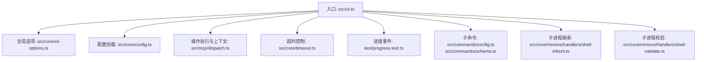
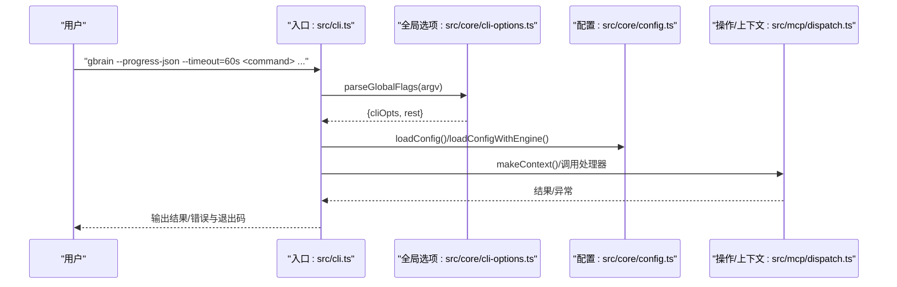
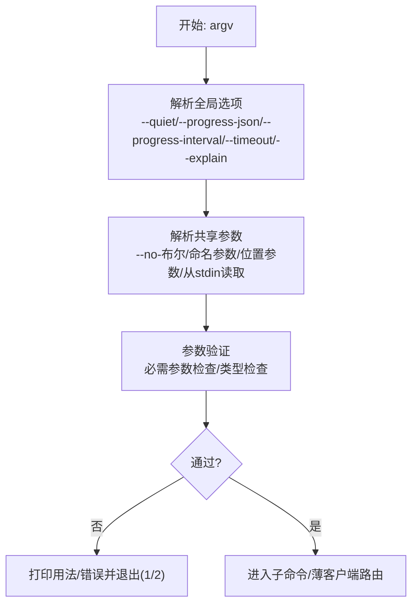
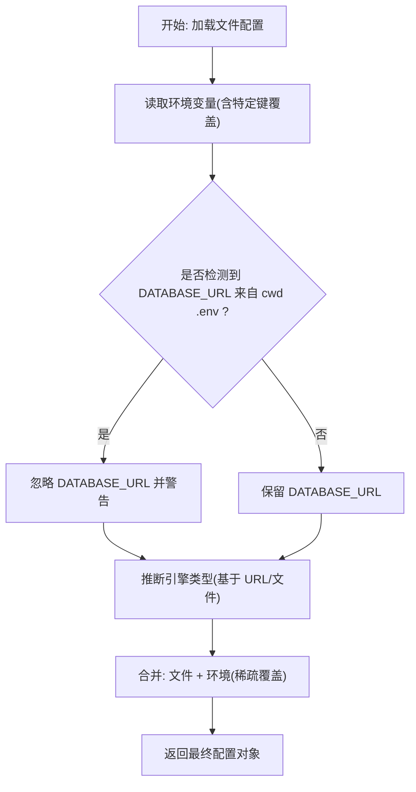
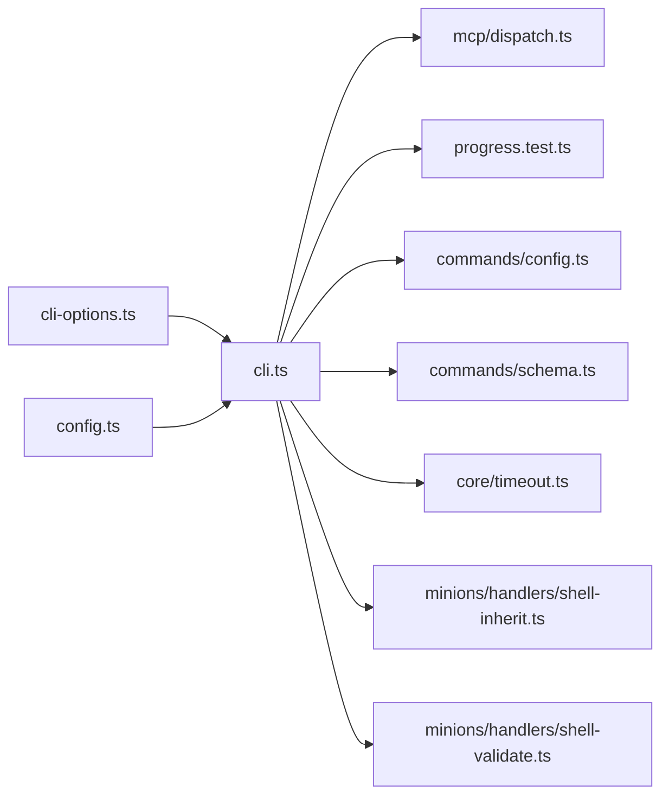

# 命令选项与参数

<cite>
**本文引用的文件**
- [src/cli.ts](file://src/cli.ts)
- [src/core/cli-options.ts](file://src/core/cli-options.ts)
- [src/core/config.ts](file://src/core/config.ts)
- [src/commands/config.ts](file://src/commands/config.ts)
- [src/commands/schema.ts](file://src/commands/schema.ts)
- [src/core/timeout.ts](file://src/core/timeout.ts)
- [src/core/retrieval-upgrade-planner.ts](file://src/core/retrieval-upgrade-planner.ts)
- [src/core/minions/handlers/shell-inherit.ts](file://src/core/minions/handlers/shell-inherit.ts)
- [src/core/minions/handlers/shell-validate.ts](file://src/core/minions/handlers/shell-validate.ts)
- [src/core/errors.ts](file://src/core/errors.ts)
- [src/mcp/dispatch.ts](file://src/mcp/dispatch.ts)
- [test/progress.test.ts](file://test/progress.test.ts)
- [test/status-sections.test.ts](file://test/status-sections.test.ts)
- [test/sync-timeout.test.ts](file://test/sync-timeout.test.ts)
- [test/jobs-nice-flag.test.ts](file://test/jobs-nice-flag.test.ts)
- [test/helpers/with-env.ts](file://test/helpers/with-env.ts)
- [test/ai/config-no-env-mutation.test.ts](file://test/ai/config-no-env-mutation.test.ts)
- [test/v0_37_gap_fill.serial.test.ts](file://test/v0_37_gap_fill.serial.test.ts)
- [test/minions-shell-inherit.test.ts](file://test/minions-shell-inherit.test.ts)
- [test/minions-shell-validate.test.ts](file://test/minions-shell-validate.test.ts)
</cite>

## 目录
1. [简介](#简介)
2. [项目结构](#项目结构)
3. [核心组件](#核心组件)
4. [架构总览](#架构总览)
5. [详细组件分析](#详细组件分析)
6. [依赖关系分析](#依赖关系分析)
7. [性能考量](#性能考量)
8. [故障排查指南](#故障排查指南)
9. [结论](#结论)
10. [附录](#附录)

## 简介
本文件为 GBrain 命令行“全局选项”“参数解析”“环境变量配置”“参数传递机制”的权威参考，覆盖以下主题：
- 全局选项：--quiet、--progress-json、--progress-interval、--timeout、--explain
- 参数解析：位置参数、命名参数（布尔/数值）、--no-前缀布尔、从 stdin 读取内容
- 环境变量：数据库连接、模型与嵌入、检索反射、内容安全、远程客户端密钥等
- 配置合并优先级：CLI > 环境变量 > 文件配置 > 默认值
- 错误处理与参数验证：未知键提示、敏感信息脱敏、超时与退出码约定
- 最佳实践：进度模式、超时策略、后台任务、调试技巧

## 项目结构
与命令行选项和参数相关的关键模块如下：
- 入口与分发：src/cli.ts 负责全局选项解析、子命令分发、上下文构建、超时控制、薄客户端路由
- 全局选项：src/core/cli-options.ts 定义 CliOptions、解析 --quiet/--progress-json/--progress-interval/--timeout/--explain，并映射到进度报告器
- 配置与环境变量：src/core/config.ts 提供文件/环境/推断的合并逻辑；命令实现中对敏感键进行脱敏
- 子命令示例：src/commands/config.ts 展示配置读写、键校验与建议；src/commands/schema.ts 展示帮助输出与多层级解析链
- 超时与退出码：src/core/timeout.ts 统一超时包装；CLI 在超时与错误路径设置退出码
- 进度事件：test/progress.test.ts 验证人类可读与 JSON 模式；test/status-sections.test.ts 验证 --section 解析
- 环境变量注入：src/core/minions/handlers/shell-inherit.ts 与 shell-validate.ts 定义继承键规则与校验
- 错误建模：src/core/errors.ts 统一结构化错误；src/mcp/dispatch.ts 校验参数类型

图示来源
- [src/cli.ts:200-468](file://src/cli.ts#L200-L468)
- [src/core/cli-options.ts:54-121](file://src/core/cli-options.ts#L54-L121)
- [src/core/config.ts:497-595](file://src/core/config.ts#L497-L595)
- [src/mcp/dispatch.ts:195-215](file://src/mcp/dispatch.ts#L195-L215)
- [src/core/timeout.ts:1-34](file://src/core/timeout.ts#L1-L34)
- [test/progress.test.ts:21-37](file://test/progress.test.ts#L21-L37)
- [src/commands/config.ts:38-200](file://src/commands/config.ts#L38-L200)
- [src/commands/schema.ts:52-164](file://src/commands/schema.ts#L52-L164)
- [src/core/minions/handlers/shell-inherit.ts:24-57](file://src/core/minions/handlers/shell-inherit.ts#L24-L57)
- [src/core/minions/handlers/shell-validate.ts:65-97](file://src/core/minions/handlers/shell-validate.ts#L65-L97)

章节来源
- [src/cli.ts:200-468](file://src/cli.ts#L200-L468)
- [src/core/cli-options.ts:54-121](file://src/core/cli-options.ts#L54-L121)
- [src/core/config.ts:497-595](file://src/core/config.ts#L497-L595)

## 核心组件
- 全局选项接口与默认值
  - quiet、progressJson、progressInterval、timeoutMs、explain
  - 默认值来自 DEFAULT_CLI_OPTIONS
- 全局选项解析
  - 支持 --quiet、--progress-json、--progress-interval[=]、--timeout[=]、--explain
  - --timeout 支持 "30000" / "30000ms" / "30s" / "2m" 等格式
  - --progress-interval 接受数字或形如 "--progress-interval=1000"
- 进度模式映射
  - quiet → 'quiet'
  - progress-json → 'json'
  - 否则 'auto'（TTY 人类带回车，非 TTY 人类纯文本）
- 参数解析（共享操作）
  - 支持 --no- 前缀布尔反转
  - 命名参数支持布尔与数值（数值自动转换）
  - 位置参数按顺序绑定
  - 从 stdin 读取内容（限制大小）
- 配置加载与环境变量
  - 文件配置（~/.gbrain/config.json）与环境变量合并
  - 特定键的环境变量覆盖（如 GBRAIN_EMBEDDING_MODEL、GBRAIN_CHAT_MODEL 等）
  - 数据库 URL 的 cwd .env 自动注入防护
- 错误与退出码
  - 超时：124（GNU timeout 约定）
  - 使用错误：2
  - 其他错误：1

章节来源
- [src/core/cli-options.ts:14-40](file://src/core/cli-options.ts#L14-L40)
- [src/core/cli-options.ts:54-121](file://src/core/cli-options.ts#L54-L121)
- [src/core/cli-options.ts:159-163](file://src/core/cli-options.ts#L159-L163)
- [src/cli.ts:739-782](file://src/cli.ts#L739-L782)
- [src/core/config.ts:497-595](file://src/core/config.ts#L497-L595)
- [src/core/timeout.ts:1-34](file://src/core/timeout.ts#L1-L34)

## 架构总览
全局选项在进入子命令分发之前被解析并剥离，确保例如 “gbrain --progress-json doctor” 正常工作。随后根据命令类型决定本地引擎路径或薄客户端远程路由。

图示来源
- [src/cli.ts:200-468](file://src/cli.ts#L200-L468)
- [src/core/cli-options.ts:54-121](file://src/core/cli-options.ts#L54-L121)
- [src/core/config.ts:497-595](file://src/core/config.ts#L497-L595)
- [src/mcp/dispatch.ts:195-215](file://src/mcp/dispatch.ts#L195-L215)

## 详细组件分析

### 全局选项与参数解析
- 选项定义与默认值
  - quiet: 是否抑制人类可读输出
  - progressJson: 是否以 JSON 行流输出进度事件
  - progressInterval: 进度事件最小间隔（毫秒），默认 1000
  - timeoutMs: 用户自定义超时（毫秒），null 表示使用命令默认
  - explain: 搜索/查询的解释模式（仅对相关命令生效）
- 解析规则
  - --quiet、--progress-json、--explain 直接布尔开关
  - --progress-interval 支持空格或等号形式，非法值透传给后续解析器
  - --timeout 支持空格或等号形式，支持 "s"、"m" 单位，非法值透传
- 参数解析（共享操作）
  - --no- 前缀布尔反转（仅当对应键为布尔类型时）
  - 数值参数自动转换
  - 位置参数按顺序绑定
  - 非 TTY 且存在 stdin 时，读取最多 5MB 内容作为参数值

图示来源
- [src/core/cli-options.ts:54-121](file://src/core/cli-options.ts#L54-L121)
- [src/cli.ts:739-782](file://src/cli.ts#L739-L782)
- [src/cli.ts:338-352](file://src/cli.ts#L338-L352)

章节来源
- [src/core/cli-options.ts:14-40](file://src/core/cli-options.ts#L14-L40)
- [src/core/cli-options.ts:54-121](file://src/core/cli-options.ts#L54-L121)
- [src/cli.ts:739-782](file://src/cli.ts#L739-L782)
- [src/cli.ts:338-352](file://src/cli.ts#L338-L352)

### 环境变量与配置合并
- 配置来源优先级（文件/环境/推断）
  - 文件：~/.gbrain/config.json（只读，不污染 process.env）
  - 环境变量：覆盖文件中的对应字段
  - 推断：若无 DATABASE_URL 则根据 engine 或 database_path 推断
- 特定键的环境变量覆盖
  - 数据库：GBRAIN_DATABASE_URL > DATABASE_URL（受 cwd .env 注入保护）
  - 模型与嵌入：GBRAIN_EMBEDDING_MODEL、GBRAIN_EMBEDDING_DIMENSIONS、GBRAIN_CHAT_MODEL、GBRAIN_EXPANSION_MODEL 等
  - 检索反射：GBRAIN_RETRIEVAL_REFLEX、GBRAIN_RETRIEVAL_REFLEX_WINDOW_TURNS
  - 内容安全：GBRAIN_PAGE_WARN_BYTES、GBRAIN_PAGE_BLOCK_BYTES、GBRAIN_NO_JUNK_PATTERNS、GBRAIN_NO_SANITY、GBRAIN_MAX_MARKUP_RATIO
  - 远程客户端：GBRAIN_REMOTE_CLIENT_SECRET（与 remote_mcp 组合）
- cwd .env 注入防护
  - 若 DATABASE_URL 来自当前目录 .env 文件，则忽略该值并警告，避免误连其他项目的数据库
- 配置键校验与建议
  - 未知键拒绝（可使用 --force 强制，但会警告）
  - 对于类似 embedding.provider 的拼写错误，给出最近似键建议

图示来源
- [src/core/config.ts:497-595](file://src/core/config.ts#L497-L595)
- [src/core/config.ts:478-495](file://src/core/config.ts#L478-L495)
- [src/commands/config.ts:108-175](file://src/commands/config.ts#L108-L175)

章节来源
- [src/core/config.ts:497-595](file://src/core/config.ts#L497-L595)
- [src/core/config.ts:478-495](file://src/core/config.ts#L478-L495)
- [src/commands/config.ts:108-175](file://src/commands/config.ts#L108-L175)
- [test/ai/config-no-env-mutation.test.ts:12-27](file://test/ai/config-no-env-mutation.test.ts#L12-L27)
- [test/v0_37_gap_fill.serial.test.ts:116-166](file://test/v0_37_gap_fill.serial.test.ts#L116-L166)

### 进度事件与模式
- 模式选择
  - --quiet → 'quiet'
  - --progress-json → 'json'
  - 否则 'auto'
- TTY 与非 TTY 行为差异
  - TTY：人类可读，带回车刷新
  - 非 TTY：人类可读纯文本（避免 JSON 干扰管道）
- 测试验证
  - 非 TTY 模式下输出为人类可读而非 JSON
  - 可通过 --progress-json 强制 JSON（即使在非 TTY）

章节来源
- [src/core/cli-options.ts:159-163](file://src/core/cli-options.ts#L159-L163)
- [test/progress.test.ts:21-37](file://test/progress.test.ts#L21-L37)

### 超时与退出码
- 超时解析
  - --timeout 支持 "s"、"m" 单位，非法输入透传给后续解析器
  - 测试覆盖了单位、空白裁剪、负数/零、非法字符等边界
- 退出码约定
  - 超时：124（GNU timeout 约定）
  - 使用错误：2（如 --deadline-ms=0）
  - 其他错误：1
- 读操作默认墙钟超时上限（180 秒），可通过 --timeout 覆盖

章节来源
- [src/core/cli-options.ts:131-139](file://src/core/cli-options.ts#L131-L139)
- [src/core/timeout.ts:1-34](file://src/core/timeout.ts#L1-L34)
- [test/sync-timeout.test.ts:27-94](file://test/sync-timeout.test.ts#L27-L94)
- [test/status-sections.test.ts:135-144](file://test/status-sections.test.ts#L135-L144)

### 子命令与参数验证
- config 子命令
  - show：展示配置，敏感键与 URL 密码脱敏
  - set：严格键校验，未知键拒绝（--force 可强制但警告），schema 尺寸类键禁止 DB 写入
  - unset：支持单键与前缀批量删除
- schema 子命令
  - 多 verb 分层：检查、激活、编写、发现与修复
  - --json 与 --source 支持
  - 解析链（7 层）：调用时标志 > 环境变量 > 源级 DB 配置 > 脑级 DB 配置 > gbrain.yml > 文件配置 > 默认
- thin-client 路由
  - 本地 thin-client 安装走远程 MCP 工具调用
  - 超时策略：think 默认 180s，其他默认 30s，可被 --timeout 覆盖
  - SIGINT 支持，标准化退出码

章节来源
- [src/commands/config.ts:38-200](file://src/commands/config.ts#L38-L200)
- [src/commands/schema.ts:52-164](file://src/commands/schema.ts#L52-L164)
- [src/cli.ts:499-596](file://src/cli.ts#L499-L596)

### 子进程环境继承与校验
- 继承键规则
  - snake_case 名称，防止原型污染与路径遍历
  - 个别键使用 gbrain 前缀的环境变量名（如 database_url → GBRAIN_DATABASE_URL）
- 校验规则
  - 必须指定 cmd 或 argv（二选一）
  - cwd 必须存在且为绝对路径
  - argv 必须为字符串数组
  - inherit 必须为 snake_case 字符串数组，且每个名称在配置中可解析为非空字符串

章节来源
- [src/core/minions/handlers/shell-inherit.ts:24-57](file://src/core/minions/handlers/shell-inherit.ts#L24-L57)
- [src/core/minions/handlers/shell-validate.ts:65-97](file://src/core/minions/handlers/shell-validate.ts#L65-L97)
- [test/minions-shell-inherit.test.ts:70-96](file://test/minions-shell-inherit.test.ts#L70-L96)
- [test/minions-shell-validate.test.ts:1-33](file://test/minions-shell-validate.test.ts#L1-L33)

### 错误建模与参数校验
- 结构化错误
  - StructuredAgentError 包裹结构化错误体，便于代理序列化输出
- 参数类型校验
  - MCP 分发器对参数类型进行严格校验（布尔/对象/数组/字符串）
- 未知键与敏感信息
  - 未知配置键给出建议；敏感键与 URL 密码脱敏显示

章节来源
- [src/core/errors.ts:38-78](file://src/core/errors.ts#L38-L78)
- [src/mcp/dispatch.ts:181-187](file://src/mcp/dispatch.ts#L181-L187)
- [src/commands/config.ts:26-36](file://src/commands/config.ts#L26-L36)

## 依赖关系分析
- 入口依赖
  - 全局选项解析依赖于 CliOptions 接口与默认值
  - 配置加载依赖于文件系统与环境变量
  - 操作上下文依赖于配置与引擎
- 子命令依赖
  - config 与 schema 依赖配置加载与键校验
  - 进度事件依赖全局选项映射
  - 超时控制贯穿读写路径

图示来源
- [src/core/cli-options.ts:14-40](file://src/core/cli-options.ts#L14-L40)
- [src/cli.ts:200-468](file://src/cli.ts#L200-L468)
- [src/core/config.ts:497-595](file://src/core/config.ts#L497-L595)
- [src/mcp/dispatch.ts:195-215](file://src/mcp/dispatch.ts#L195-L215)
- [test/progress.test.ts:21-37](file://test/progress.test.ts#L21-L37)
- [src/commands/config.ts:38-200](file://src/commands/config.ts#L38-L200)
- [src/commands/schema.ts:52-164](file://src/commands/schema.ts#L52-L164)
- [src/core/timeout.ts:1-34](file://src/core/timeout.ts#L1-L34)
- [src/core/minions/handlers/shell-inherit.ts:24-57](file://src/core/minions/handlers/shell-inherit.ts#L24-L57)
- [src/core/minions/handlers/shell-validate.ts:65-97](file://src/core/minions/handlers/shell-validate.ts#L65-L97)

章节来源
- [src/cli.ts:200-468](file://src/cli.ts#L200-L468)
- [src/core/config.ts:497-595](file://src/core/config.ts#L497-L595)

## 性能考量
- 进度事件频率
  - 通过 --progress-interval 控制事件节流，默认 1000ms
  - 非 TTY 下默认人类可读纯文本，避免 JSON 噪声影响管道吞吐
- 超时策略
  - 读操作默认上限 180s，可通过 --timeout 调整
  - 超时采用 Promise.race 包装，不取消底层任务，依赖进程退出回收资源
- 背景任务
  - --background 将作业提交至队列并立即退出；PGLite 降级为内联执行并提示
  - 可配合 --follow 执行 jobs follow 实时跟踪

章节来源
- [src/core/cli-options.ts:159-163](file://src/core/cli-options.ts#L159-L163)
- [src/core/timeout.ts:1-34](file://src/core/timeout.ts#L1-L34)
- [src/core/cli-options.ts:250-298](file://src/core/cli-options.ts#L250-L298)

## 故障排查指南
- 未知配置键
  - 使用 --force 强制写入会触发警告；建议使用已知键或修正拼写
  - 对于类似 embedding.provider 的拼写，系统会给出最近似键建议
- 数据库 URL 意外变更
  - 若当前目录存在 .env 并设置了 DATABASE_URL，工具会忽略该值并发出警告，避免误连项目数据库
- 进度事件不符合预期
  - 非 TTY 默认人类可读纯文本；需要结构化事件请显式添加 --progress-json
- 超时与退出码
  - 超时退出码为 124；使用错误（如 --deadline-ms=0）为 2；其他错误为 1
- 子进程继承与校验
  - inherit 必须为 snake_case 数组，且每个键在配置中可解析为非空字符串
  - cwd 必须为绝对路径；argv 必须为字符串数组

章节来源
- [src/commands/config.ts:108-175](file://src/commands/config.ts#L108-L175)
- [src/core/config.ts:478-495](file://src/core/config.ts#L478-L495)
- [test/progress.test.ts:21-37](file://test/progress.test.ts#L21-L37)
- [test/status-sections.test.ts:135-144](file://test/status-sections.test.ts#L135-L144)
- [src/core/minions/handlers/shell-validate.ts:65-97](file://src/core/minions/handlers/shell-validate.ts#L65-L97)

## 结论
- 全局选项在命令分发前解析，保证如 --progress-json doctor 的可用性
- 参数解析遵循“位置参数优先、命名参数次之、布尔/数值自动转换”的通用规则
- 配置加载采用“文件/环境/推断”的三层合并，环境变量为操作者逃逸通道
- 错误与超时统一建模与处理，提供清晰的退出码与诊断信息
- 进度事件与后台任务策略兼顾人类可读与自动化场景

## 附录
- 常用选项速查
  - --quiet：静默模式
  - --progress-json：结构化进度事件
  - --progress-interval：事件节流（毫秒）
  - --timeout：超时（支持 s/m 单位）
  - --explain：解释模式（搜索/查询）
- 环境变量速查（部分）
  - GBRAIN_DATABASE_URL、DATABASE_URL（受 cwd .env 注入保护）
  - GBRAIN_EMBEDDING_MODEL、GBRAIN_EMBEDDING_DIMENSIONS、GBRAIN_CHAT_MODEL、GBRAIN_EXPANSION_MODEL
  - GBRAIN_RETRIEVAL_REFLEX、GBRAIN_RETRIEVAL_REFLEX_WINDOW_TURNS
  - GBRAIN_NO_SANITY、GBRAIN_PAGE_WARN_BYTES、GBRAIN_PAGE_BLOCK_BYTES、GBRAIN_MAX_MARKUP_RATIO
  - GBRAIN_REMOTE_CLIENT_SECRET（与 remote_mcp 组合）