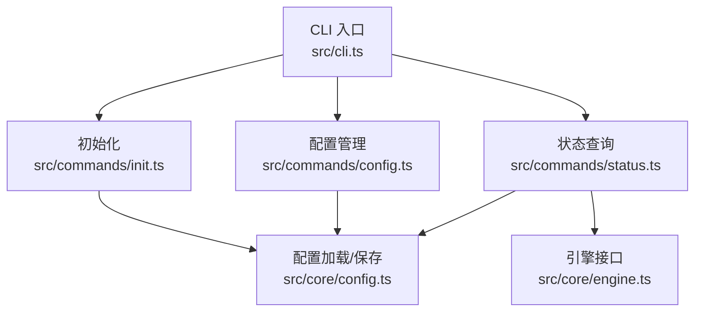
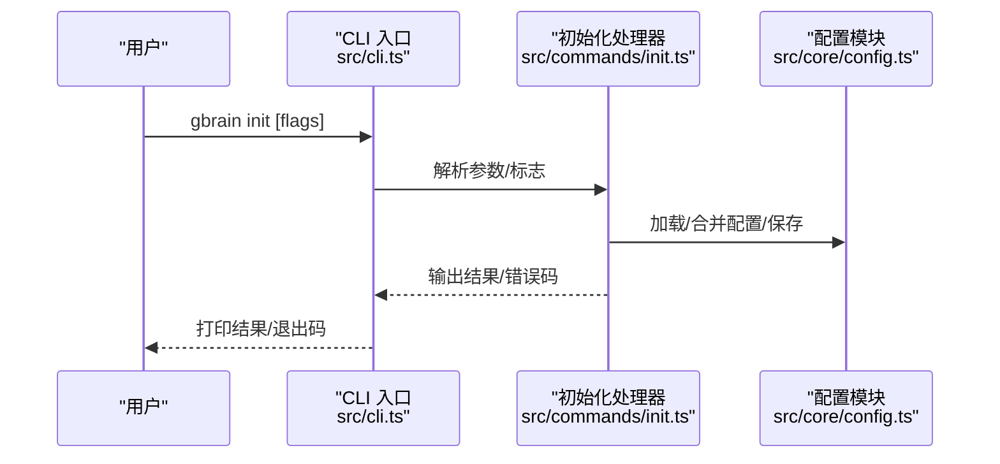
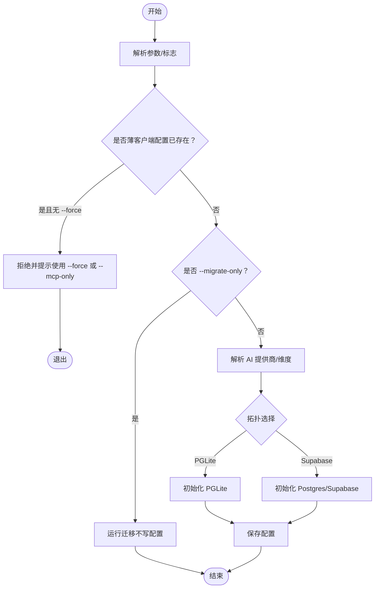
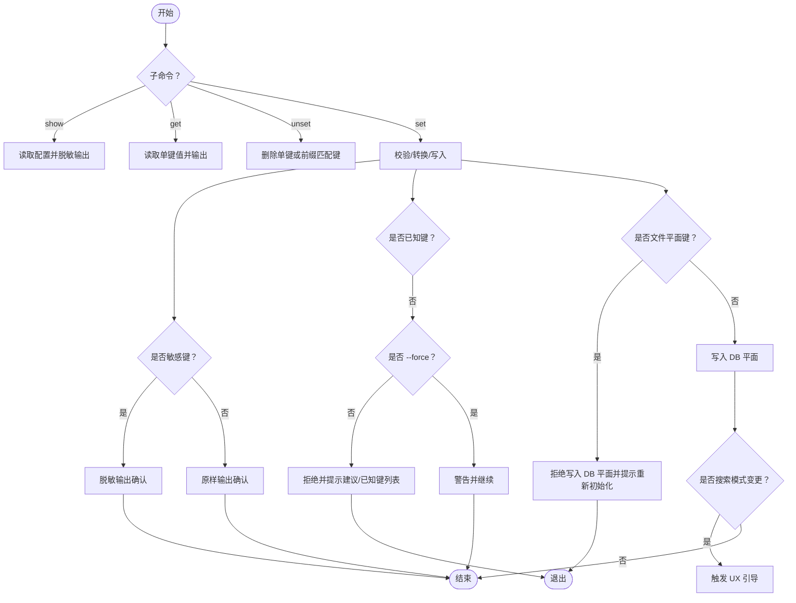
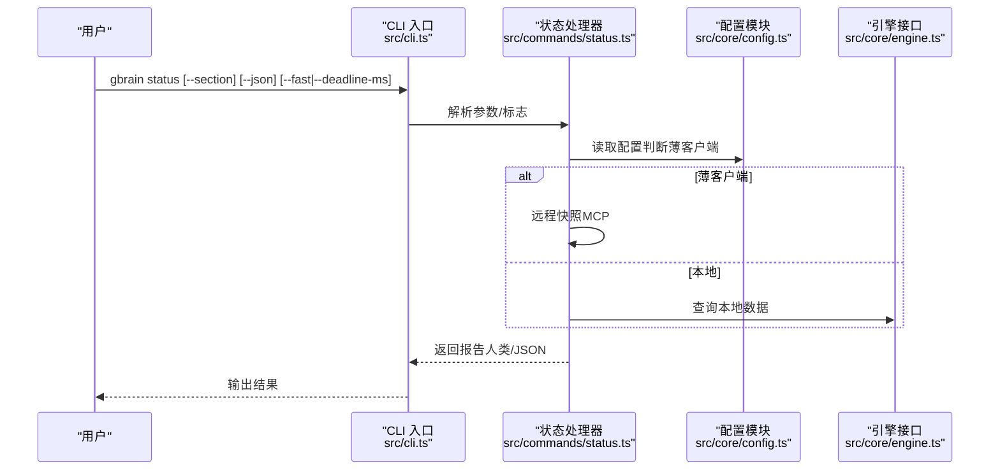
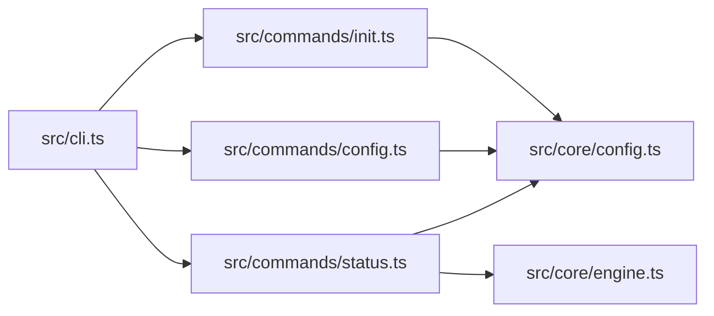

# 基础命令

<cite>
**本文引用的文件**
- [src/cli.ts](file://src/cli.ts)
- [src/commands/init.ts](file://src/commands/init.ts)
- [src/commands/config.ts](file://src/commands/config.ts)
- [src/commands/status.ts](file://src/commands/status.ts)
- [src/core/config.ts](file://src/core/config.ts)
- [README.md](file://README.md)
</cite>

## 目录
1. [简介](#简介)
2. [项目结构](#项目结构)
3. [核心组件](#核心组件)
4. [架构总览](#架构总览)
5. [详细组件分析](#详细组件分析)
6. [依赖关系分析](#依赖关系分析)
7. [性能考量](#性能考量)
8. [故障排查指南](#故障排查指南)
9. [结论](#结论)
10. [附录](#附录)

## 简介
本篇文档聚焦于 GBrain 的基础命令：gbrain init（初始化）、gbrain config（配置管理）、gbrain status（状态查询）。内容覆盖命令语法、参数选项、典型使用场景与示例、执行流程、错误处理与常见问题解决，并补充环境变量、配置文件格式与最佳实践建议。目标是帮助用户在本地或远程薄客户端模式下快速完成安装、正确配置与健康巡检。

## 项目结构
- CLI 入口负责解析全局标志、分发命令、路由到具体处理器；基础命令均以独立模块实现。
- 初始化命令支持本地 PGLite、Postgres/Supabase 以及薄客户端（远程 MCP）三种拓扑。
- 配置命令提供查看、设置、删除配置键的能力，并对敏感字段与未知键进行保护与提示。
- 状态命令聚合同步、周期、锁、工作器、队列与自走程序等健康指标，输出人类可读报告或 JSON。

图表来源
- [src/cli.ts:1-800](file://src/cli.ts#L1-L800)
- [src/commands/init.ts:1-800](file://src/commands/init.ts#L1-L800)
- [src/commands/config.ts:1-342](file://src/commands/config.ts#L1-L342)
- [src/commands/status.ts:1-734](file://src/commands/status.ts#L1-L734)
- [src/core/config.ts:1-1078](file://src/core/config.ts#L1-L1078)

章节来源
- [src/cli.ts:1-800](file://src/cli.ts#L1-L800)
- [README.md:1-443](file://README.md#L1-L443)

## 核心组件
- 初始化命令（gbrain init）
  - 支持自动检测与交互式选择、显式指定拓扑（PGLite/Postgres/Supabase）、薄客户端模式、跳过嵌入配置、仅迁移模式等。
  - 负责 AI 提供商与维度解析、网关配置、模式包选择、嵌入密钥检查等。
- 配置命令（gbrain config）
  - 支持 show/get/set/unset 子命令；对敏感键进行脱敏显示；对未知键提供拼写建议；对搜索模式变更提供 UX 引导。
- 状态命令（gbrain status）
  - 单屏健康仪表盘，包含同步、周期、锁、工作器、队列与自走程序等六个部分；支持薄客户端模式远程快照；支持节流预算与按需筛选。

章节来源
- [src/commands/init.ts:1-800](file://src/commands/init.ts#L1-L800)
- [src/commands/config.ts:1-342](file://src/commands/config.ts#L1-L342)
- [src/commands/status.ts:1-734](file://src/commands/status.ts#L1-L734)
- [src/core/config.ts:1-1078](file://src/core/config.ts#L1-L1078)

## 架构总览
CLI 分发器根据命令名将请求路由至对应处理器；对于共享操作通过统一的“操作层”执行，而 CLI_ONLY 命令（如 init/config/status）由各自模块直接处理。薄客户端模式下，状态与部分初始化路径会通过 MCP 远程调用获取远端快照。

图表来源
- [src/cli.ts:200-468](file://src/cli.ts#L200-L468)
- [src/commands/init.ts:14-152](file://src/commands/init.ts#L14-L152)
- [src/core/config.ts:397-405](file://src/core/config.ts#L397-L405)

## 详细组件分析

### 初始化命令（gbrain init）
- 用途
  - 在本地或远程建立可用的 GBrain 实例，选择数据库引擎（PGLite/Postgres/Supabase），配置 AI 提供商与维度，必要时进行模式迁移。
- 语法与参数
  - 基本形式：gbrain init [flags]
  - 关键标志
    - --pglite：强制使用本地 PGLite
    - --supabase：使用 Supabase/Postgres
    - --mcp-only：薄客户端模式（不创建本地引擎）
    - --force：强制覆盖现有配置（谨慎使用）
    - --non-interactive：非交互模式（CI/容器）
    - --migrate-only：仅应用模式迁移（不写配置）
    - --json：以 JSON 输出结果
    - --url <连接串>：显式指定数据库连接串（非交互模式必选）
    - --key <API 密钥>：显式指定嵌入密钥（用于 PGLite）
    - --path <路径>：自定义 PGLite 数据库路径
    - --embedding-model <provider:model>：显式指定嵌入模型
    - --embedding-dimensions <N>：显式指定嵌入维度
    - --expansion-model <provider:model>：显式指定扩展模型
    - --chat-model <provider:model>：显式指定聊天模型
    - --no-embedding：延迟嵌入配置（后续再设置）
    - --skip-embed-check：跳过初始化时的嵌入密钥校验
    - --schema-pack <名称>：指定模式包（默认 gbrain-base-v2）
- 使用场景与示例
  - 本地快速启动（PGLite）：gbrain init --pglite
  - 指定 Supabase：gbrain init --supabase --url <DATABASE_URL>
  - 非交互安装（CI/容器）：gbrain init --non-interactive --url <DATABASE_URL>
  - 薄客户端：gbrain init --mcp-only --issuer-url <URL> --mcp-url <URL> --oauth-client-id <ID> --oauth-client-secret <SECRET> --force
  - 仅迁移：gbrain init --migrate-only --json
- 执行流程
  - 参数解析与帮助短路
  - 识别薄客户端配置冲突并拒绝无 --force 的本地引擎创建
  - 解析 AI 提供商与维度（优先显式标志，其次环境探测，最后交互选择）
  - 选择拓扑（PGLite 或 Postgres/Supabase），必要时进行嵌入密钥检查
  - 应用模式迁移（migrate-only）
  - 写入配置并输出结果
- 错误处理与常见问题
  - 已存在薄客户端配置且未加 --force：提示冲突并退出
  - 非交互模式缺少 --url 或环境变量：报错并退出
  - 多个提供商环境变量冲突：在非 TTY 下直接失败，需要明确指定
  - 嵌入密钥缺失或不匹配：在 PGLite 下给出修复建议或延迟配置
- 最佳实践
  - 首次安装优先使用 --pglite 快速验证，再迁移到 Supabase
  - 在 CI/容器中使用 --non-interactive 并显式传入 --url
  - 使用 --schema-pack 选择合适的模式包
  - 薄客户端部署时，确保 issuer_url 与 mcp_url 正确且可达

图表来源
- [src/commands/init.ts:14-152](file://src/commands/init.ts#L14-L152)
- [src/commands/init.ts:525-547](file://src/commands/init.ts#L525-L547)
- [src/commands/init.ts:793-800](file://src/commands/init.ts#L793-L800)

章节来源
- [src/commands/init.ts:14-152](file://src/commands/init.ts#L14-L152)
- [src/commands/init.ts:525-547](file://src/commands/init.ts#L525-L547)
- [src/commands/init.ts:793-800](file://src/commands/init.ts#L793-L800)
- [src/core/config.ts:397-405](file://src/core/config.ts#L397-L405)

### 配置命令（gbrain config）
- 用途
  - 查看、获取、设置、删除配置键；对敏感键进行脱敏；对未知键提供拼写建议；对搜索模式变更提供 UX 引导。
- 语法与参数
  - gbrain config show
  - gbrain config get <key>
  - gbrain config set <key> <value> [--force] [--coverage-override|--yes]
  - gbrain config unset <key>
  - gbrain config unset --pattern <prefix>
- 使用场景与示例
  - 查看当前配置：gbrain config show
  - 设置嵌入模型：gbrain config set embedding_model openai:text-embedding-3-large
  - 设置搜索模式：gbrain config set search.mode balanced
  - 删除前缀键：gbrain config unset --pattern search.cache
- 执行流程
  - 解析子命令与参数
  - 对 show/get/unset 直接返回或删除
  - 对 set：
    - 敏感键脱敏输出确认
    - 未知键默认拒绝，可通过 --force 强制但会警告
    - 对特定“文件平面”键（如 embedding_model/embedding_dimensions）拒绝写入 DB 平面，提示改用重新初始化
    - 对 embedding_columns 与 search_embedding_column 进行注册表校验与覆盖率门限检查
    - 对 spend.posture 进行有效性校验
    - 写入后触发搜索模式变更的 UX 引导
- 错误处理与常见问题
  - 未知键：提供“Did you mean”建议；--force 可绕过但会警告
  - 文件平面键写入 DB：拒绝静默无操作，引导通过重新初始化切换
  - 搜索模式变更：在 TTY 下弹出 UX 引导，避免误操作
  - 覆盖率不足：默认拒绝低覆盖率列作为默认搜索列，可通过 --coverage-override 或 --yes 强制
- 最佳实践
  - 优先使用 show 查看当前配置，再针对性 set
  - 对敏感键（如 API 密钥）不要在日志中泄露，注意终端滚动历史
  - 对搜索模式变更保持审慎，利用 UX 引导确认
  - 使用 --pattern 批量清理或迁移配置键

图表来源
- [src/commands/config.ts:38-341](file://src/commands/config.ts#L38-L341)
- [src/core/config.ts:811-947](file://src/core/config.ts#L811-L947)

章节来源
- [src/commands/config.ts:38-341](file://src/commands/config.ts#L38-L341)
- [src/core/config.ts:811-947](file://src/core/config.ts#L811-L947)

### 状态命令（gbrain status）
- 用途
  - 单屏健康仪表盘，汇总同步、周期、锁、工作器、队列与自走程序等健康指标；支持薄客户端远程快照；支持节流预算与按需筛选。
- 语法与参数
  - gbrain status [--section <sync|cycle|locks|workers|queue|autopilot>] [--json] [--fast|--deadline-ms <毫秒>]
- 使用场景与示例
  - 快速健康巡检：gbrain status
  - 仅查看同步与周期：gbrain status --section sync --section cycle
  - 限制查询时间预算：gbrain status --fast
  - 指定超时预算：gbrain status --deadline-ms 3000
  - 机器消费 JSON：gbrain status --json
- 执行流程
  - 解析 --section 与 --deadline-ms
  - 判断薄客户端模式：若是则通过 MCP 获取远程快照；否则本地查询
  - 组装报告：包含 schema_version、版本、生成时间、模式、各节数据、警告与部分截断标记
  - 输出人类可读或 JSON
- 错误处理与常见问题
  - 无效 --section：返回错误码 2
  - 无引擎连接（本地模式）：返回错误码 1 并提示诊断
  - 截断：当预算耗尽时标记 stale_sections 并输出警告
- 最佳实践
  - 使用 --fast 或 --deadline-ms 避免长时间阻塞
  - 在薄客户端模式下，锁、工作器、队列与自走程序显示为“本地无关”
  - 结合 JSON 输出用于自动化巡检与告警

图表来源
- [src/commands/status.ts:683-733](file://src/commands/status.ts#L683-L733)
- [src/core/config.ts:353-355](file://src/core/config.ts#L353-L355)

章节来源
- [src/commands/status.ts:683-733](file://src/commands/status.ts#L683-L733)
- [src/core/config.ts:353-355](file://src/core/config.ts#L353-L355)

## 依赖关系分析
- CLI 分发器依赖操作注册表与 CLI_ONLY 集合，决定是否进入共享操作层或直接调用 CLI_ONLY 处理器。
- 初始化命令依赖配置模块进行文件/环境合并、保存；同时调用 AI 提供商解析与网关配置。
- 配置命令依赖配置模块的已知键列表与前缀集合进行校验；对搜索模式变更依赖 UX 引导模块。
- 状态命令依赖配置模块判断薄客户端；本地模式依赖引擎接口查询；薄客户端模式通过 MCP 客户端获取远程快照。

图表来源
- [src/cli.ts:37-47](file://src/cli.ts#L37-L47)
- [src/commands/init.ts:9-12](file://src/commands/init.ts#L9-L12)
- [src/commands/config.ts:2-10](file://src/commands/config.ts#L2-L10)
- [src/commands/status.ts:38-46](file://src/commands/status.ts#L38-L46)

章节来源
- [src/cli.ts:37-47](file://src/cli.ts#L37-L47)
- [src/commands/init.ts:9-12](file://src/commands/init.ts#L9-L12)
- [src/commands/config.ts:2-10](file://src/commands/config.ts#L2-L10)
- [src/commands/status.ts:38-46](file://src/commands/status.ts#L38-L46)

## 性能考量
- 状态命令支持节流预算（--fast 或 --deadline-ms），避免单个或多个节查询阻塞整体输出；预算耗尽时标记 stale_sections 并继续其他节。
- 初始化命令在非交互模式下避免扫描大量文件导致的误判；对 PGLite 与 Postgres 的选择提供智能提示。
- 配置命令对未知键与敏感键进行即时校验，减少后续运行期错误与安全风险。

## 故障排查指南
- 初始化
  - “已在薄客户端配置存在”：使用 --force 或 --mcp-only 明确意图
  - “非交互模式缺少数据库连接串”：在 --non-interactive 下必须提供 --url 或 GBRAIN_DATABASE_URL
  - “多提供商环境变量冲突”：在非 TTY 下直接失败，明确指定提供商
  - “嵌入密钥缺失”：在 PGLite 下给出修复建议或使用 --no-embedding 延迟配置
- 配置
  - “未知键被拒绝”：使用 --force 绕过但会警告；参考已知键列表
  - “文件平面键写入 DB 无效”：通过重新初始化切换提供商/维度
  - “搜索模式变更”：遵循 UX 引导，避免误操作
  - “低覆盖率列设为默认搜索列”：使用 --coverage-override 或 --yes 强制
- 状态
  - “无引擎连接”：本地模式下提示诊断；薄客户端模式下检查远端可达性
  - “截断”：预算不足导致部分节超时，适当增加 --deadline-ms

章节来源
- [src/commands/init.ts:58-73](file://src/commands/init.ts#L58-L73)
- [src/commands/init.ts:135-146](file://src/commands/init.ts#L135-L146)
- [src/commands/config.ts:119-142](file://src/commands/config.ts#L119-L142)
- [src/commands/status.ts:715-718](file://src/commands/status.ts#L715-L718)

## 结论
gbrain init、config、status 三类基础命令分别覆盖了“安装与拓扑选择”、“配置治理与安全”、“健康巡检与可观测”的核心诉求。通过合理的参数组合、环境变量与配置文件协同，用户可以在本地或薄客户端模式下高效地完成从零到一的部署与日常运维。

## 附录
- 环境变量
  - GBRAIN_HOME：覆盖配置目录位置（绝对路径，不含 ..）
  - GBRAIN_DATABASE_URL/DATABASE_URL：数据库连接串（Bun 自动加载的 .env 中 DATABASE_URL 会被 #427 守卫忽略）
  - OPENAI_API_KEY/ANTHROPIC_API_KEY/ZEROENTROPY_API_KEY：AI 提供商密钥
  - GBRAIN_EMBEDDING_MODEL/GBRAIN_EMBEDDING_DIMENSIONS/GBRAIN_CHAT_MODEL 等：配置文件与运行时合并的环境覆盖
  - GBRAIN_NO_SANITY/GBRAIN_PAGE_WARN_BYTES 等：内容合规相关环境覆盖
  - GBRAIN_REMOTE_CLIENT_SECRET：薄客户端凭据（可来自环境）
- 配置文件格式
  - 位于 ~/.gbrain/config.json，包含 engine、database_url/database_path、AI 提供商、检索与模式、存储、自升级、薄客户端等字段
  - 通过 loadConfig/loadConfigFileOnly/saveConfig 等函数进行读取、合并与持久化
- 最佳实践
  - 首次安装优先 PGLite 快速验证，再迁移到 Supabase
  - CI/容器使用 --non-interactive 并显式传入 --url
  - 对敏感键脱敏输出，避免泄露
  - 使用 --fast/--deadline-ms 控制状态巡检时间预算
  - 对搜索模式变更保持审慎，遵循 UX 引导

章节来源
- [src/core/config.ts:1021-1078](file://src/core/config.ts#L1021-L1078)
- [README.md:290-399](file://README.md#L290-L399)