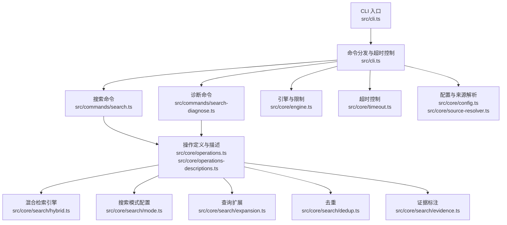
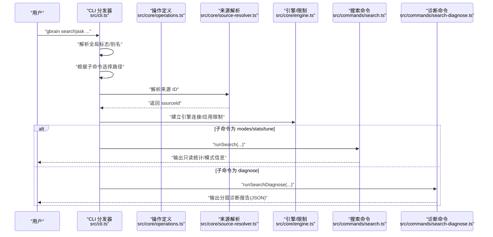
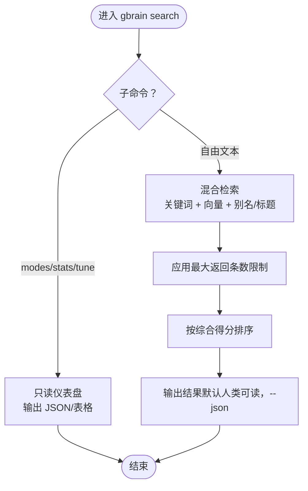
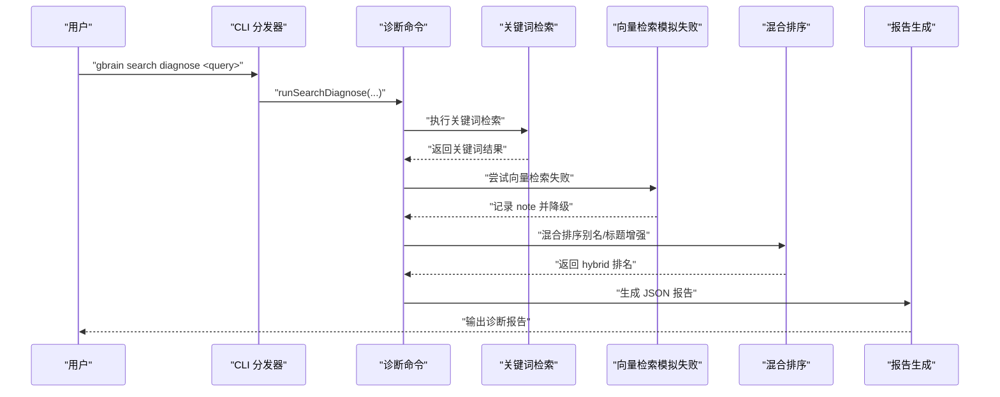
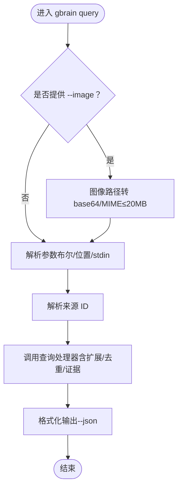
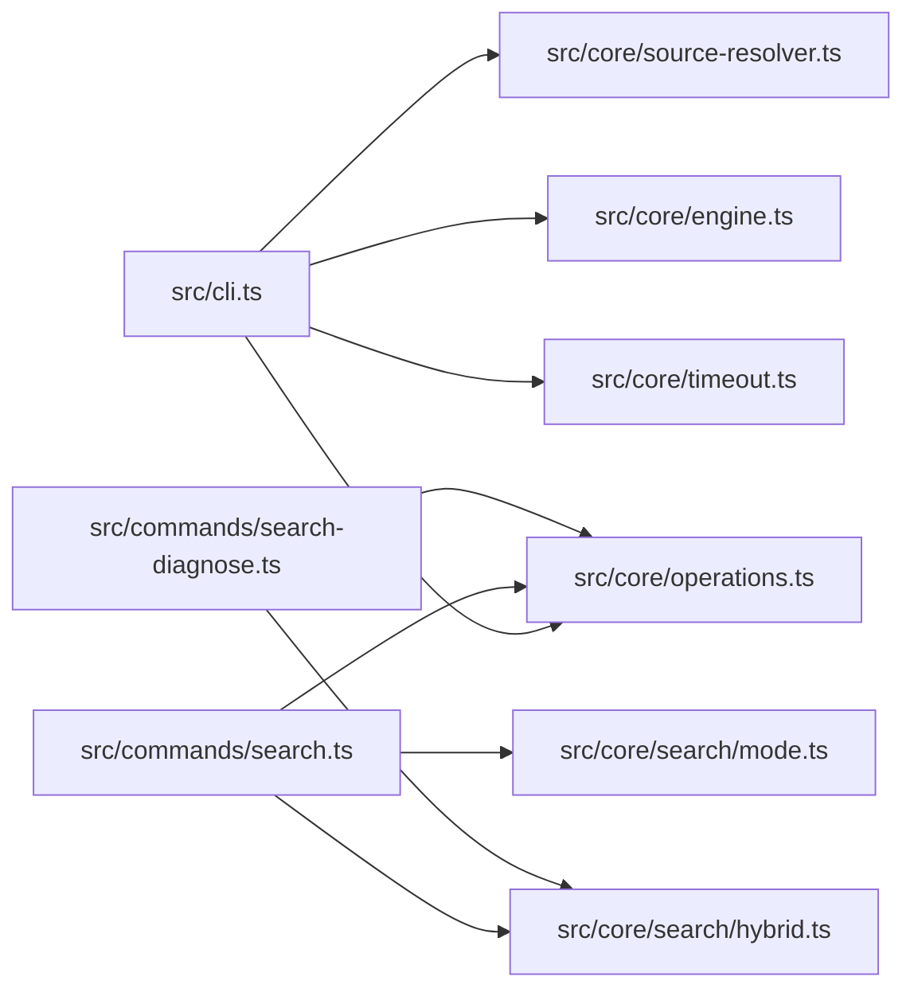

# 搜索相关命令

<cite>
**本文引用的文件**
- [src/cli.ts](file://src/cli.ts)
- [src/commands/search.ts](file://src/commands/search.ts)
- [src/commands/search-diagnose.ts](file://src/commands/search-diagnose.ts)
- [src/core/operations.ts](file://src/core/operations.ts)
- [src/core/operations-descriptions.ts](file://src/core/operations-descriptions.ts)
- [src/core/search/mode.ts](file://src/core/search/mode.ts)
- [src/core/search/hybrid.ts](file://src/core/search/hybrid.ts)
- [src/core/search/expansion.ts](file://src/core/search/expansion.ts)
- [src/core/search/dedup.ts](file://src/core/search/dedup.ts)
- [src/core/search/evidence.ts](file://src/core/search/evidence.ts)
- [src/core/engine.ts](file://src/core/engine.ts)
- [src/core/timeout.ts](file://src/core/timeout.ts)
- [src/core/config.ts](file://src/core/config.ts)
- [src/core/source-resolver.ts](file://src/core/source-resolver.ts)
- [src/core/cli-options.ts](file://src/core/cli-options.ts)
- [src/core/types.ts](file://src/core/types.ts)
- [test/search/search-diagnose.test.ts](file://test/search/search-diagnose.test.ts)
- [test/search/search-stats-graph-signals.test.ts](file://test/search/search-stats-graph-signals.test.ts)
- [test/two-pass.test.ts](file://test/two-pass.test.ts)
- [test/operations-embedding-column.test.ts](file://test/operations-embedding-column.test.ts)
</cite>

## 目录
1. [简介](#简介)
2. [项目结构](#项目结构)
3. [核心组件](#核心组件)
4. [架构总览](#架构总览)
5. [详细组件分析](#详细组件分析)
6. [依赖关系分析](#依赖关系分析)
7. [性能考量](#性能考量)
8. [故障排除指南](#故障排除指南)
9. [结论](#结论)
10. [附录](#附录)

## 简介
本指南聚焦于 GBrain 的搜索相关命令：查询命令（gbrain query）、搜索命令（gbrain search）与诊断命令（gbrain search diagnose）。内容涵盖：
- 命令入口与分发机制
- 搜索参数、过滤条件、结果排序与输出格式
- 混合检索原理（关键词 + 向量 + 别名/标题增强）
- 关键词搜索、向量搜索的使用方法
- 搜索优化技巧、性能调优建议与常见问题排查

## 项目结构
与搜索相关的代码主要分布在以下模块：
- CLI 分发与路由：src/cli.ts
- 搜索命令实现：src/commands/search.ts
- 搜索诊断命令：src/commands/search-diagnose.ts
- 操作定义与描述：src/core/operations.ts、src/core/operations-descriptions.ts
- 搜索模式与配置：src/core/search/mode.ts
- 搜索核心算法：src/core/search/hybrid.ts、expansion.ts、dedup.ts、evidence.ts
- 引擎与限制：src/core/engine.ts
- 超时控制：src/core/timeout.ts
- 配置与来源解析：src/core/config.ts、src/core/source-resolver.ts
- 类型定义：src/core/types.ts
- 测试用例：test/search/*.test.ts、test/two-pass.test.ts、test/operations-embedding-column.test.ts

图表来源
- [src/cli.ts:242-272](file://src/cli.ts#L242-L272)
- [src/commands/search.ts](file://src/commands/search.ts)
- [src/commands/search-diagnose.ts](file://src/commands/search-diagnose.ts)
- [src/core/operations.ts:14-27](file://src/core/operations.ts#L14-L27)
- [src/core/search/hybrid.ts](file://src/core/search/hybrid.ts)
- [src/core/search/mode.ts:56](file://src/core/search/mode.ts#L56)
- [src/core/search/expansion.ts](file://src/core/search/expansion.ts)
- [src/core/search/dedup.ts](file://src/core/search/dedup.ts)
- [src/core/search/evidence.ts](file://src/core/search/evidence.ts)
- [src/core/engine.ts:636](file://src/core/engine.ts#L636)
- [src/core/timeout.ts](file://src/core/timeout.ts)
- [src/core/config.ts](file://src/core/config.ts)
- [src/core/source-resolver.ts](file://src/core/source-resolver.ts)

章节来源
- [src/cli.ts:242-272](file://src/cli.ts#L242-L272)
- [src/commands/search.ts](file://src/commands/search.ts)
- [src/commands/search-diagnose.ts](file://src/commands/search-diagnose.ts)
- [src/core/operations.ts:14-27](file://src/core/operations.ts#L14-L27)

## 核心组件
- CLI 分发器：负责解析全局标志、识别命令、处理别名（如 ask → query）、路由到本地引擎或远程 MCP，并为读取类操作设置超时。
- 搜索命令（search）：提供只读仪表盘（modes/stats/tune），以及自由文本搜索（关键词 + 混合检索）。
- 诊断命令（search diagnose）：对检索链路进行分层诊断，覆盖关键词、向量、别名/标题命中与最终排名。
- 操作定义（operations）：统一声明参数、类型、必填项、CLI 提示与处理器，确保 CLI/MCP/tools-json 的一致性。
- 搜索模式（mode）：定义搜索模式集合与默认值，支持按模式调整检索权重与策略。
- 混合检索（hybrid）：整合关键词匹配、向量相似度与别名/标题增强，输出带评分与元数据的结果。
- 查询扩展（expansion）：在不改变语义的前提下扩展查询，提升召回。
- 去重（dedup）：基于内容指纹或来源去重，保证结果多样性。
- 证据标注（evidence）：为结果附加证据标记，便于溯源与审计。

章节来源
- [src/cli.ts:200-468](file://src/cli.ts#L200-L468)
- [src/core/operations.ts:14-27](file://src/core/operations.ts#L14-L27)
- [src/core/search/mode.ts:56](file://src/core/search/mode.ts#L56)
- [src/core/search/hybrid.ts](file://src/core/search/hybrid.ts)
- [src/core/search/expansion.ts](file://src/core/search/expansion.ts)
- [src/core/search/dedup.ts](file://src/core/search/dedup.ts)
- [src/core/search/evidence.ts](file://src/core/search/evidence.ts)

## 架构总览
下图展示 gbrain search 与 diagnose 的端到端流程，包括连接、超时、参数解析、来源解析、检索执行与结果渲染。

图表来源
- [src/cli.ts:242-272](file://src/cli.ts#L242-L272)
- [src/cli.ts:389-468](file://src/cli.ts#L389-L468)
- [src/core/source-resolver.ts](file://src/core/source-resolver.ts)
- [src/core/engine.ts:636](file://src/core/engine.ts#L636)
- [src/commands/search.ts](file://src/commands/search.ts)
- [src/commands/search-diagnose.ts](file://src/commands/search-diagnose.ts)

## 详细组件分析

### 命令入口与分发（gbrain search / gbrain ask / gbrain query）
- 别名映射：ask → query；search 子命令 modes/stats/tune 走只读仪表盘，其余走混合检索。
- 超时控制：search 仪表盘 10 秒，diagnose 60 秒；读取类操作有统一的 180 秒墙钟超时。
- 来源解析：优先级由 CLI --source 或环境变量决定，回退到默认来源。
- 参数解析：支持布尔开关（--no-xxx）、位置参数与标准输入注入（受大小限制）。

章节来源
- [src/cli.ts:234-236](file://src/cli.ts#L234-L236)
- [src/cli.ts:242-272](file://src/cli.ts#L242-L272)
- [src/cli.ts:389-468](file://src/cli.ts#L389-L468)
- [src/cli.ts:739-782](file://src/cli.ts#L739-L782)
- [src/core/source-resolver.ts](file://src/core/source-resolver.ts)

### 搜索命令（gbrain search）
- 只读仪表盘：modes、stats、tune，用于查看当前搜索模式、检索统计与图信号失败情况。
- 自由文本搜索：通过混合检索（关键词 + 向量 + 别名/标题增强）返回候选集。
- 输出格式：默认人类可读，支持 --json 输出结构化 JSON。
- 统计与可观测性：测试覆盖 graph_signals 失败计数与原因分布。

图表来源
- [src/cli.ts:242-272](file://src/cli.ts#L242-L272)
- [src/commands/search.ts](file://src/commands/search.ts)
- [src/core/engine.ts:636](file://src/core/engine.ts#L636)

章节来源
- [src/commands/search.ts](file://src/commands/search.ts)
- [test/search/search-stats-graph-signals.test.ts:127-158](file://test/search/search-stats-graph-signals.test.ts#L127-L158)

### 诊断命令（gbrain search diagnose）
- 目标：对检索链路进行分层诊断，包括关键词命中、向量可用性、别名/标题命中与最终排名。
- 行为：强制关键词路径（向量嵌入模拟失败以跳过向量），记录每层轨迹与最终结论。
- 输出：JSON 报告包含 target、alias_match、vector.rank/note、hybrid.rank/alias_hit、title_match_boost、verdict 等字段。

图表来源
- [src/cli.ts:257-263](file://src/cli.ts#L257-L263)
- [src/commands/search-diagnose.ts](file://src/commands/search-diagnose.ts)
- [test/search/search-diagnose.test.ts:40-65](file://test/search/search-diagnose.test.ts#L40-L65)

章节来源
- [src/cli.ts:257-263](file://src/cli.ts#L257-L263)
- [src/commands/search-diagnose.ts](file://src/commands/search-diagnose.ts)
- [test/search/search-diagnose.test.ts:40-65](file://test/search/search-diagnose.test.ts#L40-L65)

### 查询命令（gbrain query）
- 功能：面向“意图”与“上下文”的问答式检索，支持近邻符号遍历、深度控制等高级参数。
- 参数要点：near_symbol、walk_depth 等参数在操作定义中声明，允许在查询时指定嵌入列覆盖。
- 图像查询：支持 --image 传入图像路径，内部转换为 base64 与 MIME，并受大小限制。
- 输出：默认人类可读，支持 --json；与搜索命令共享统一的渲染管线。

图表来源
- [src/cli.ts:323-336](file://src/cli.ts#L323-L336)
- [src/cli.ts:739-782](file://src/cli.ts#L739-L782)
- [src/core/operations.ts:14-27](file://src/core/operations.ts#L14-L27)
- [src/core/search/expansion.ts](file://src/core/search/expansion.ts)
- [src/core/search/dedup.ts](file://src/core/search/dedup.ts)
- [src/core/search/evidence.ts](file://src/core/search/evidence.ts)

章节来源
- [src/cli.ts:323-336](file://src/cli.ts#L323-L336)
- [src/cli.ts:739-782](file://src/cli.ts#L739-L782)
- [test/two-pass.test.ts:172-181](file://test/two-pass.test.ts#L172-L181)
- [test/operations-embedding-column.test.ts:16-39](file://test/operations-embedding-column.test.ts#L16-L39)

### 搜索参数、过滤条件、排序与输出
- 参数与类型：通过操作定义统一声明，支持布尔、数字与字符串类型；位置参数与 --no-xxx 开关自动解析。
- 过滤条件：通过来源解析与搜索模式配置实现跨来源/单来源视图切换；别名与标题命中作为增强条件参与排序。
- 排序：混合检索综合关键词、向量与别名/标题增强计算得分，按 rank 降序排列。
- 输出：默认人类可读，支持 --json 输出结构化结果；诊断命令输出专用 JSON 报告。

章节来源
- [src/cli.ts:739-782](file://src/cli.ts#L739-L782)
- [src/core/search/mode.ts:56](file://src/core/search/mode.ts#L56)
- [src/core/search/hybrid.ts](file://src/core/search/hybrid.ts)

### 混合检索原理（关键词 + 向量 + 别名/标题增强）
- 关键词检索：基于全文索引与查询扩展，提升召回。
- 向量检索：使用嵌入模型计算相似度，若不可用则优雅降级。
- 别名/标题增强：命中别名或标题短语时施加额外权重，提升相关性。
- 去重与证据：对重复内容进行去重，为结果附加证据标记，便于溯源。

章节来源
- [src/core/search/hybrid.ts](file://src/core/search/hybrid.ts)
- [src/core/search/expansion.ts](file://src/core/search/expansion.ts)
- [src/core/search/dedup.ts](file://src/core/search/dedup.ts)
- [src/core/search/evidence.ts](file://src/core/search/evidence.ts)

## 依赖关系分析
- CLI 依赖 operations 定义来解析参数与路由；依赖 source-resolver 获取来源 ID；依赖 engine 应用限制；依赖 timeout 控制读取类操作的超时。
- 搜索命令依赖 operations 中的 search/query 操作定义，以及 hybrid 检索引擎与模式配置。
- 诊断命令依赖 operations 与 hybrid 引擎，同时对向量检索进行降级处理以保证稳定性。

图表来源
- [src/cli.ts:200-468](file://src/cli.ts#L200-L468)
- [src/commands/search.ts](file://src/commands/search.ts)
- [src/commands/search-diagnose.ts](file://src/commands/search-diagnose.ts)
- [src/core/operations.ts:14-27](file://src/core/operations.ts#L14-L27)
- [src/core/search/mode.ts:56](file://src/core/search/mode.ts#L56)
- [src/core/search/hybrid.ts](file://src/core/search/hybrid.ts)

章节来源
- [src/cli.ts:200-468](file://src/cli.ts#L200-L468)
- [src/commands/search.ts](file://src/commands/search.ts)
- [src/commands/search-diagnose.ts](file://src/commands/search-diagnose.ts)
- [src/core/operations.ts:14-27](file://src/core/operations.ts#L14-L27)

## 性能考量
- 超时策略：读取类操作默认 180 秒，search 仪表盘 10 秒，diagnose 60 秒；可通过 --timeout=Ns 覆盖。
- 返回上限：最大返回条数限制为 100，避免过量输出影响性能。
- 模式选择：通过搜索模式（balanced 等）平衡召回与精度，减少无效检索。
- 降级与容错：向量检索失败时优雅降级，保证诊断与检索可用性。
- 图信号观测：通过 stats 输出图信号失败计数与原因分布，辅助定位网络/服务异常。

章节来源
- [src/cli.ts:389-468](file://src/cli.ts#L389-L468)
- [src/core/engine.ts:636](file://src/core/engine.ts#L636)
- [src/core/search/mode.ts:56](file://src/core/search/mode.ts#L56)
- [test/search/search-stats-graph-signals.test.ts:127-158](file://test/search/search-stats-graph-signals.test.ts#L127-L158)

## 故障排除指南
- 命令超时：检查 --timeout 设置；确认网络连通性与上游服务状态；查看诊断命令输出定位瓶颈。
- 权限与来源：确认 --source 或环境变量配置正确；若来源表缺失，系统会回退到跨来源视图。
- 向量检索失败：诊断命令会记录 note 并降级；检查嵌入提供方可用性与配额。
- 输出格式问题：使用 --json 获取结构化输出，便于自动化处理与调试。
- 图信号失败：通过 stats 输出的 graph_signals 字段查看失败计数与原因分布，针对性修复网络或上游服务。

章节来源
- [src/cli.ts:389-468](file://src/cli.ts#L389-L468)
- [src/core/source-resolver.ts](file://src/core/source-resolver.ts)
- [src/commands/search-diagnose.ts](file://src/commands/search-diagnose.ts)
- [test/search/search-stats-graph-signals.test.ts:127-158](file://test/search/search-stats-graph-signals.test.ts#L127-L158)

## 结论
- gbrain search 与 diagnose 提供从“只读仪表盘”到“分层诊断”的完整能力谱系，既能满足日常检索，也能支撑深入排障。
- query 命令面向意图与上下文，结合扩展、去重与证据标注，提供更稳健的检索体验。
- 通过统一的操作定义与 CLI 分发机制，命令行为一致、可扩展性强，适合在多场景下复用与集成。

## 附录
- 常用参数速查
  - --json：输出结构化 JSON
  - --source：显式指定来源 ID
  - --timeout=Ns：覆盖默认超时
  - --no-xxx：布尔开关的反向形式
  - --help/-h：显示帮助信息
- 搜索模式参考：balanced 等模式键值与配置项见搜索模式模块。

章节来源
- [src/core/search/mode.ts:56](file://src/core/search/mode.ts#L56)
- [src/core/search/mode.ts:1047](file://src/core/search/mode.ts#L1047)
- [src/core/search/mode.ts:1092](file://src/core/search/mode.ts#L1092)