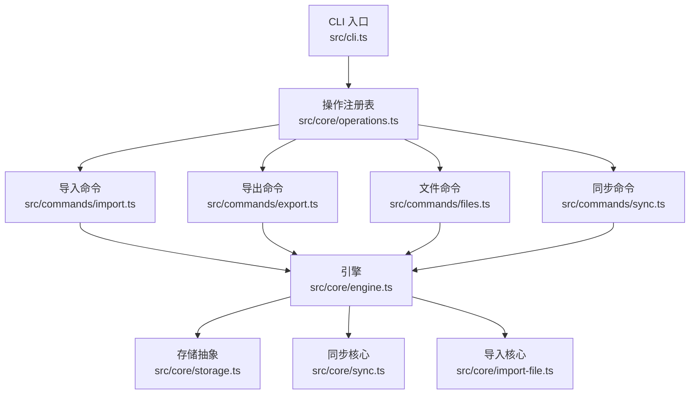
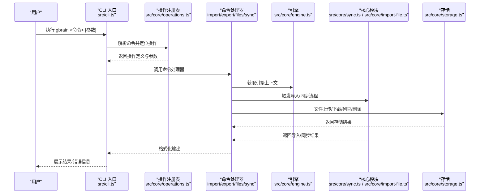
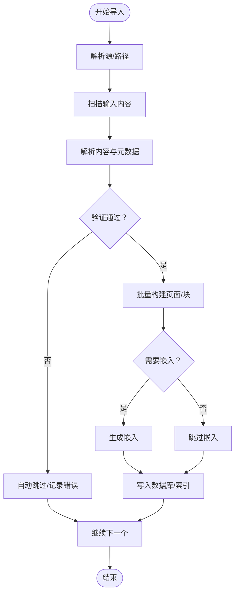
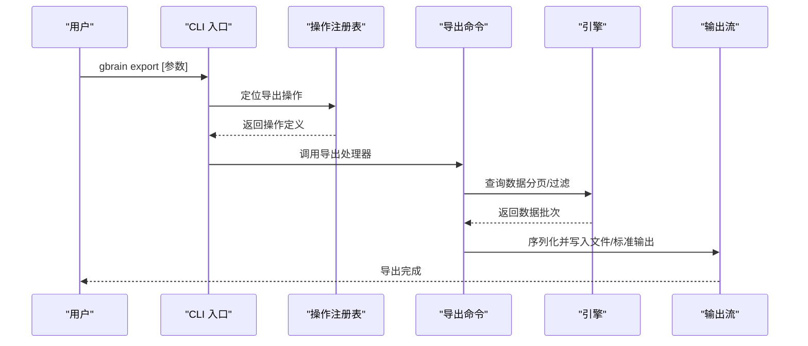
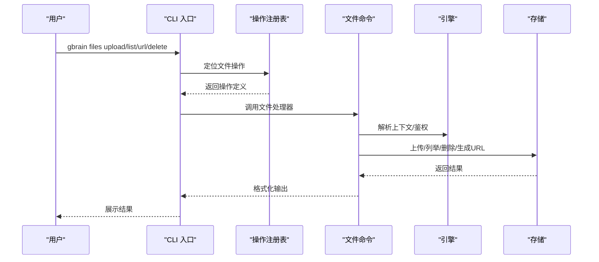
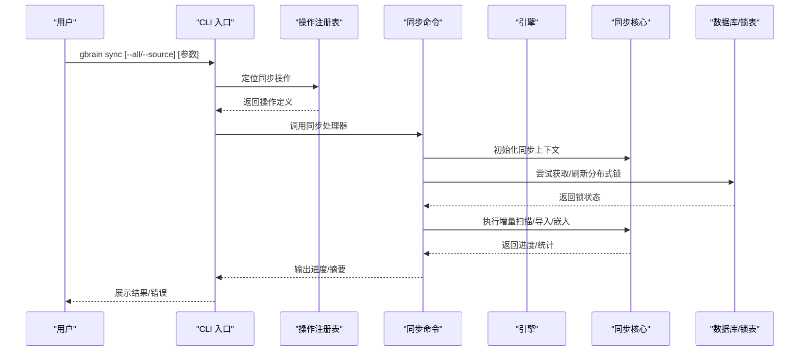
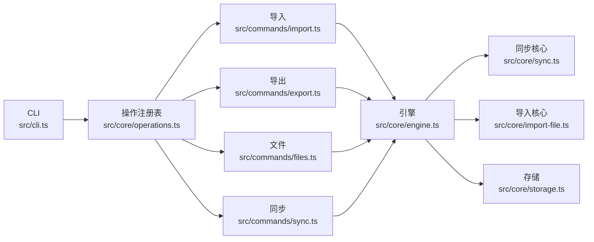

# 数据管理命令

<cite>
**本文引用的文件**
- [src/cli.ts](file://src/cli.ts)
- [src/commands/import.ts](file://src/commands/import.ts)
- [src/commands/export.ts](file://src/commands/export.ts)
- [src/commands/files.ts](file://src/commands/files.ts)
- [src/commands/sync.ts](file://src/commands/sync.ts)
- [src/core/operations.ts](file://src/core/operations.ts)
- [src/core/engine.ts](file://src/core/engine.ts)
- [src/core/config.ts](file://src/core/config.ts)
- [src/core/sync.ts](file://src/core/sync.ts)
- [src/core/import-file.ts](file://src/core/import-file.ts)
- [src/core/storage.ts](file://src/core/storage.ts)
- [src/core/brain-registry.ts](file://src/core/brain-registry.ts)
- [CHANGELOG.md](file://CHANGELOG.md)
- [docs/operations/spend-controls.md](file://docs/operations/spend-controls.md)
- [docs/GBRAIN_VERIFY.md](file://docs/GBRAIN_VERIFY.md)
- [docs/GBRAIN_SKILLPACK.md](file://docs/GBRAIN_SKILLPACK.md)
- [docs/GBRAIN_RECOMMENDED_SCHEMA.md](file://docs/GBRAIN_RECOMMENDED_SCHEMA.md)
- [docs/INSTALL.md](file://docs/INSTALL.md)
- [docs/UPGRADING_DOWNSTREAM_AGENTS.md](file://docs/UPGRADING_DOWNSTREAM_AGENTS.md)
- [docs/TESTING.md](file://docs/TESTING.md)
- [docs/architecture/README.md](file://docs/architecture/README.md)
- [docs/guides/README.md](file://docs/guides/README.md)
</cite>

## 目录
1. [简介](#简介)
2. [项目结构](#项目结构)
3. [核心组件](#核心组件)
4. [架构总览](#架构总览)
5. [详细组件分析](#详细组件分析)
6. [依赖关系分析](#依赖关系分析)
7. [性能考量](#性能考量)
8. [故障排查指南](#故障排查指南)
9. [结论](#结论)
10. [附录](#附录)

## 简介
本文件系统化梳理并说明 GBrain 的数据管理命令族：导入（gbrain import）、导出（gbrain export）、文件管理（gbrain files）与同步（gbrain sync）。内容覆盖数据格式约定、导入策略、导出选项、同步配置、批量操作、增量同步、冲突与错误处理、数据校验方法以及性能优化与大数据量处理最佳实践。目标是帮助不同技术背景的用户快速上手并安全高效地使用这些命令。

## 项目结构
- 命令入口与分发
  - CLI 入口负责解析全局参数、识别命令、路由到本地或远程执行，并在本地路径中调用具体命令处理器。
- 命令实现
  - 导入、导出、文件管理、同步等命令分别位于 src/commands 下的独立模块，通过 operations 注册为可执行操作。
- 核心引擎与存储
  - 引擎（BrainEngine）提供数据库连接与能力；存储层抽象文件上传/下载/列举/删除等能力；同步与导入流程由核心模块协调。

**图表来源**
- [src/cli.ts:298-302](file://src/cli.ts#L298-L302)
- [src/core/operations.ts:2516-2527](file://src/core/operations.ts#L2516-L2527)

**章节来源**
- [src/cli.ts:200-468](file://src/cli.ts#L200-L468)
- [src/core/operations.ts:589-619](file://src/core/operations.ts#L589-L619)

## 核心组件
- CLI 分发器
  - 负责解析全局标志（如 --quiet、--progress-json、--timeout）、识别命令、处理别名、路由到本地或远程执行。
- 操作注册表（Operations）
  - 将命令映射为统一的 Operation 结构，定义参数、作用域、是否写入、CLI 提示等，供 CLI 分发器使用。
- 命令处理器
  - 各命令模块（import/export/files/sync）实现具体业务逻辑，调用引擎与存储能力完成数据管理任务。
- 引擎与存储
  - 引擎提供数据库访问与能力；存储抽象封装文件系统/对象存储交互。

**章节来源**
- [src/cli.ts:37-47](file://src/cli.ts#L37-L47)
- [src/core/operations.ts:589-619](file://src/core/operations.ts#L589-L619)
- [src/core/engine.ts](file://src/core/engine.ts)
- [src/core/storage.ts](file://src/core/storage.ts)

## 架构总览
下图展示从 CLI 到命令处理器再到引擎与存储的整体调用链路，以及与核心同步/导入模块的协作关系。

**图表来源**
- [src/cli.ts:200-468](file://src/cli.ts#L200-L468)
- [src/core/operations.ts:2516-2527](file://src/core/operations.ts#L2516-L2527)
- [src/commands/import.ts](file://src/commands/import.ts)
- [src/commands/export.ts](file://src/commands/export.ts)
- [src/commands/files.ts](file://src/commands/files.ts)
- [src/commands/sync.ts](file://src/commands/sync.ts)
- [src/core/sync.ts](file://src/core/sync.ts)
- [src/core/import-file.ts](file://src/core/import-file.ts)
- [src/core/storage.ts](file://src/core/storage.ts)

## 详细组件分析

### 导入命令（gbrain import）
- 功能概述
  - 将本地内容（文件/目录）导入到 GBrain，生成页面与块向量表示（默认嵌入），支持批量与增量模式。
- 关键参数与行为
  - 支持源选择（--source 或环境变量）、是否跳过嵌入（--no-embed）、并行度、超时控制等。
  - 可通过 --dry-run 预览变更，避免实际写入。
- 数据格式与验证
  - 支持多种内容类型（文本、PDF、Markdown 等），自动解析 YAML 头信息与正文；对异常头信息进行容错处理。
  - 对于无法解析的条目，提供自动跳过阈值与诊断工具。
- 批量与增量
  - 批量导入时按文件粒度并行处理；增量导入基于上次导入时间戳或检查点推进。
- 冲突与回滚
  - 导入失败会保留已导入部分进度，后续运行可继续推进；严格模式下失败即停止。
- 性能优化
  - 并行写入、批量提交、嵌入延迟生成（可选）以降低内存压力。
- 参考实现与文档
  - 命令处理器位于 src/commands/import.ts；相关参数与行为在 CLI 分发器与操作注册表中定义。

**图表来源**
- [src/commands/import.ts](file://src/commands/import.ts)
- [src/core/import-file.ts](file://src/core/import-file.ts)

**章节来源**
- [src/commands/import.ts](file://src/commands/import.ts)
- [src/core/import-file.ts](file://src/core/import-file.ts)
- [CHANGELOG.md:371-385](file://CHANGELOG.md#L371-L385)

### 导出命令（gbrain export）
- 功能概述
  - 将 GBrain 中的数据导出为结构化格式（如 JSON/CSV/Markdown 等），支持过滤、分页与增量导出。
- 关键参数与行为
  - 支持按页面/块维度导出、指定字段、范围筛选、并发控制与输出目录。
  - 可配合 --dry-run 预览导出规模与格式。
- 数据格式
  - 输出遵循推荐的结构化规范，便于下游工具消费与二次加工。
- 冲突与一致性
  - 导出过程不修改索引，采用只读快照或一致性视图保证数据稳定。
- 性能优化
  - 流式输出、分页拉取、压缩传输以减少内存占用与网络开销。

**图表来源**
- [src/commands/export.ts](file://src/commands/export.ts)
- [src/core/engine.ts](file://src/core/engine.ts)

**章节来源**
- [src/commands/export.ts](file://src/commands/export.ts)
- [docs/GBRAIN_RECOMMENDED_SCHEMA.md](file://docs/GBRAIN_RECOMMENDED_SCHEMA.md)

### 文件管理（gbrain files）
- 功能概述
  - 提供文件上传、列举、获取访问链接、删除等能力，支持安全路径限制与权限控制。
- 关键参数与行为
  - 上传：指定本地路径与目标页面 slug，返回存储路径与访问链接。
  - 列举：按前缀列出文件，支持分页。
  - 访问：生成受控访问链接，支持临时令牌。
  - 删除：安全删除，幂等处理不存在文件。
- 安全与合规
  - 远程调用（MCP）受限于工作目录，防止越权访问外部文件。
- 存储后端
  - 统一通过存储抽象层对接对象存储或本地文件系统。

**图表来源**
- [src/commands/files.ts](file://src/commands/files.ts)
- [src/core/storage.ts](file://src/core/storage.ts)

**章节来源**
- [src/commands/files.ts](file://src/commands/files.ts)
- [src/core/storage.ts](file://src/core/storage.ts)
- [test\e2e\mechanical.test.ts:568-604](file://test\e2e\mechanical.test.ts#L568-L604)

### 同步命令（gbrain sync）
- 功能概述
  - 从源仓库或外部系统同步数据到 GBrain，支持增量、并行、成本门禁、硬截止时间、锁恢复与断点续跑。
- 关键参数与行为
  - 增量同步：基于上次同步时间戳或检查点推进，避免重复导入。
  - 成本门禁：在非 TTY 环境自动延迟嵌入，TTY 环境交互确认。
  - 硬截止时间：定时器保护，防止长时间占用资源。
  - 锁机制：分布式锁保障单实例运行，支持强制破锁与 TTL 过期清理。
  - 断点续跑：大规模同步被中断后可恢复进度，收敛至最终一致。
- 并发与吞吐
  - 并行写入与无锁计数器提升吞吐，避免单核瓶颈。
- 安全与隔离
  - 仅对 gbrain 创建或标记为托管的克隆进行重建；自管工作树视为只读，避免误删。
- 参考实现与文档
  - 命令处理器位于 src/commands/sync.ts；核心同步逻辑位于 src/core/sync.ts；相关环境变量与配置见 CHANGELOG 与运营文档。

**图表来源**
- [src/commands/sync.ts](file://src/commands/sync.ts)
- [src/core/sync.ts](file://src/core/sync.ts)
- [src/core/brain-registry.ts:94-124](file://src/core/brain-registry.ts#L94-L124)

**章节来源**
- [src/commands/sync.ts](file://src/commands/sync.ts)
- [src/core/sync.ts](file://src/core/sync.ts)
- [src/core/brain-registry.ts:94-124](file://src/core/brain-registry.ts#L94-L124)
- [CHANGELOG.md:16-37](file://CHANGELOG.md#L16-L37)
- [CHANGELOG.md:310-338](file://CHANGELOG.md#L310-L338)
- [CHANGELOG.md:358-371](file://CHANGELOG.md#L358-L371)
- [CHANGELOG.md:773-805](file://CHANGELOG.md#L773-L805)

## 依赖关系分析
- 命令到引擎
  - 所有命令均通过操作注册表与 CLI 分发器间接依赖引擎，确保统一的上下文与生命周期管理。
- 引擎到核心模块
  - 同步与导入命令依赖核心同步/导入模块，文件命令依赖存储抽象。
- 配置与环境
  - 命令行为受配置文件与环境变量影响（如成本门禁、硬截止时间、锁策略等）。

**图表来源**
- [src/cli.ts:298-302](file://src/cli.ts#L298-L302)
- [src/core/operations.ts:2516-2527](file://src/core/operations.ts#L2516-L2527)
- [src/core/engine.ts](file://src/core/engine.ts)
- [src/core/sync.ts](file://src/core/sync.ts)
- [src/core/import-file.ts](file://src/core/import-file.ts)
- [src/core/storage.ts](file://src/core/storage.ts)

**章节来源**
- [src/cli.ts:200-468](file://src/cli.ts#L200-L468)
- [src/core/operations.ts:2516-2527](file://src/core/operations.ts#L2516-L2527)

## 性能考量
- 并行与吞吐
  - 同步写入跨核扩展，避免单核瓶颈；导入/导出支持批量与流式处理。
- 成本与资源
  - 成本门禁在非 TTY 自动延迟嵌入，避免高峰时段资源争用；可通过配置放宽或关闭特定门禁。
- 截止与稳定性
  - 硬截止时间保护与事件循环让步，防止卡死；长时间运行的同步具备断点续跑能力。
- 存储与网络
  - 文件上传/导出采用流式与分页，减少内存峰值；对象存储后端需关注带宽与延迟。

**章节来源**
- [CHANGELOG.md:138-147](file://CHANGELOG.md#L138-L147)
- [CHANGELOG.md:773-805](file://CHANGELOG.md#L773-L805)
- [docs/operations/spend-controls.md](file://docs/operations/spend-controls.md)

## 故障排查指南
- 常见问题与定位
  - 锁冲突：当另一个同步进程持有锁时，提示“另一个同步正在进行”，可使用强制破锁或等待。
  - 资源繁忙：数据库繁忙时自动节流，避免队列饥饿；可调整成本门禁或资源配额。
  - 超时与卡死：启用硬截止时间；若出现卡死，检查事件循环让步与锁心跳。
  - 权限与路径：远程调用受限于工作目录；文件上传拒绝越权路径。
- 诊断工具
  - 使用 doctor 命令查看同步状态、锁信息与健康状况。
  - 查看变更日志中关于锁恢复、断点续跑与安全策略的改进。
- 回滚与修复
  - 导入失败保留进度，后续重试可继续；对于解析异常的条目，启用自动跳过阈值并修复源头。

**章节来源**
- [CHANGELOG.md:16-37](file://CHANGELOG.md#L16-L37)
- [CHANGELOG.md:310-338](file://CHANGELOG.md#L310-L338)
- [CHANGELOG.md:358-371](file://CHANGELOG.md#L358-L371)
- [CHANGELOG.md:773-805](file://CHANGELOG.md#L773-L805)
- [src/core/brain-registry.ts:94-124](file://src/core/brain-registry.ts#L94-L124)

## 结论
gbrain 数据管理命令围绕导入、导出、文件与同步四大能力构建，通过统一的操作注册表与 CLI 分发器实现一致的用户体验。其设计强调安全性（路径限制、只读托管克隆）、可扩展性（并行写入、成本门禁、断点续跑）与可观测性（锁状态、健康诊断）。结合本文档提供的参数、流程与最佳实践，可在不同规模与场景下安全高效地管理知识数据。

## 附录
- 快速参考
  - 导入：支持批量、增量、嵌入开关与预览；异常条目具备自动跳过与诊断。
  - 导出：支持过滤、分页与流式输出；遵循推荐结构化规范。
  - 文件：上传/列举/删除/生成链接；远程调用受工作目录限制。
  - 同步：增量、并行、成本门禁、硬截止时间、锁恢复与断点续跑。
- 相关文档
  - 安装与升级：参见安装与升级文档。
  - 验证与技能包：参见验证与技能包文档。
  - 架构与指南：参见架构与指南文档。

**章节来源**
- [docs/INSTALL.md](file://docs/INSTALL.md)
- [docs/UPGRADING_DOWNSTREAM_AGENTS.md](file://docs/UPGRADING_DOWNSTREAM_AGENTS.md)
- [docs/GBRAIN_VERIFY.md](file://docs/GBRAIN_VERIFY.md)
- [docs/GBRAIN_SKILLPACK.md](file://docs/GBRAIN_SKILLPACK.md)
- [docs/GBRAIN_RECOMMENDED_SCHEMA.md](file://docs/GBRAIN_RECOMMENDED_SCHEMA.md)
- [docs/architecture/README.md](file://docs/architecture/README.md)
- [docs/guides/README.md](file://docs/guides/README.md)
- [docs/TESTING.md](file://docs/TESTING.md)