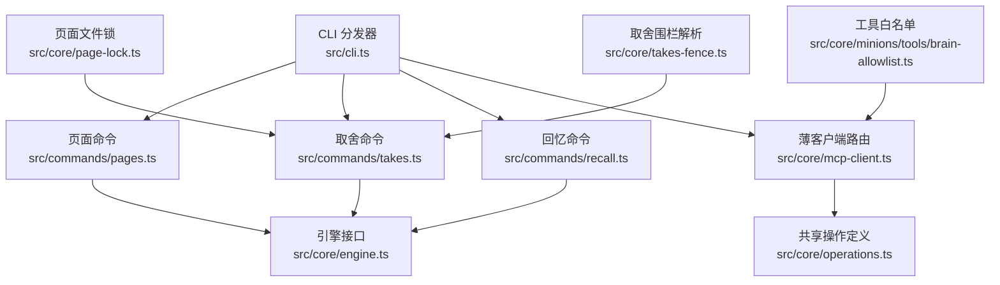
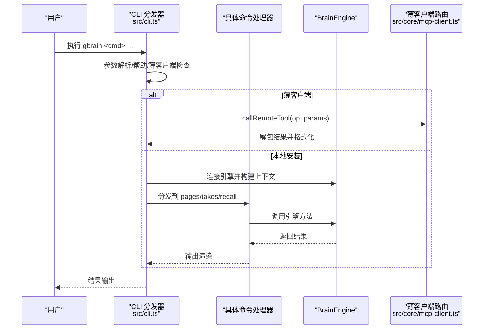
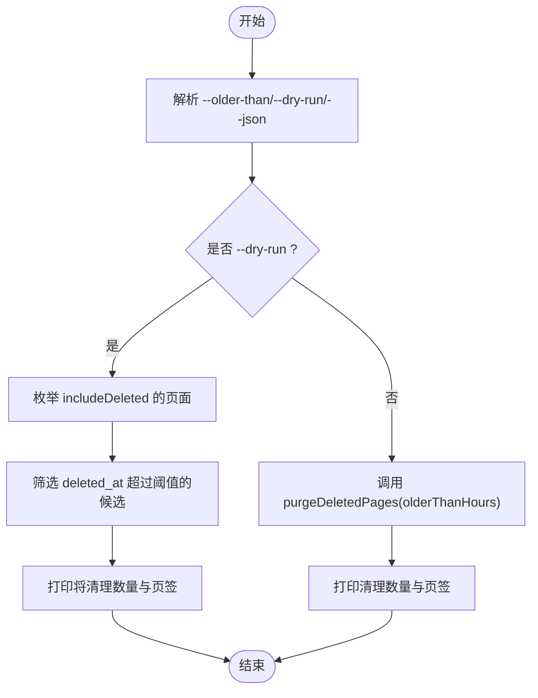
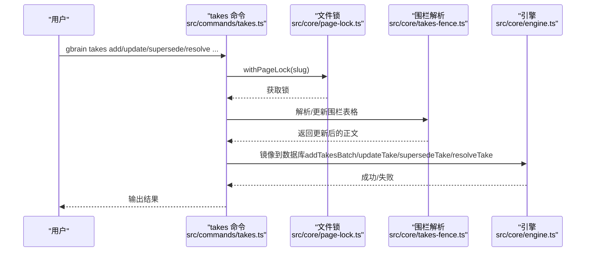
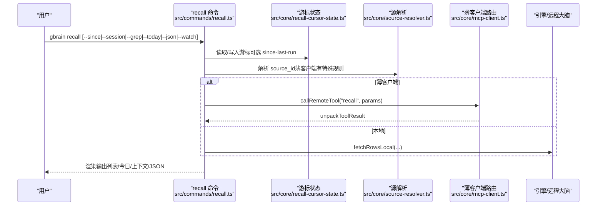
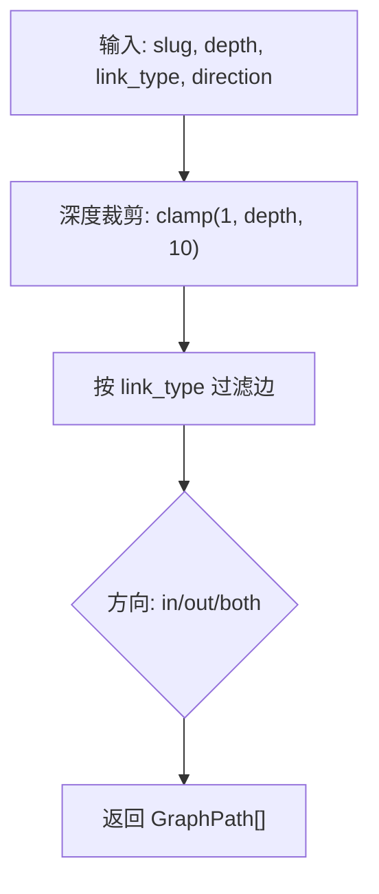
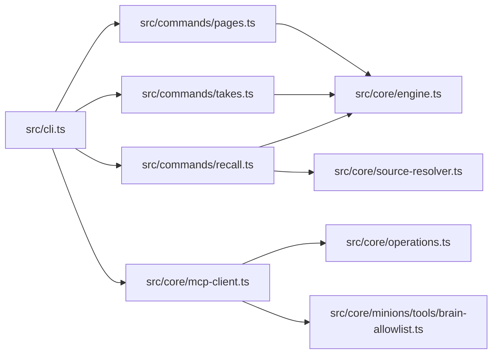

# 知识操作命令

<cite>
**本文档引用的文件**
- [src/commands/pages.ts](file://src/commands/pages.ts)
- [src/commands/takes.ts](file://src/commands/takes.ts)
- [src/commands/recall.ts](file://src/commands/recall.ts)
- [src/cli.ts](file://src/cli.ts)
- [src/core/engine.ts](file://src/core/engine.ts)
- [src/core/operations.ts](file://src/core/operations.ts)
- [src/core/minions/tools/brain-allowlist.ts](file://src/core/minions/tools/brain-allowlist.ts)
- [src/core/takes-fence.ts](file://src/core/takes-fence.ts)
- [src/core/page-lock.ts](file://src/core/page-lock.ts)
- [src/core/facts/forget.ts](file://src/core/facts/forget.ts)
- [src/core/recall-cursor-state.ts](file://src/core/recall-cursor-state.ts)
- [src/core/source-resolver.ts](file://src/core/source-resolver.ts)
- [src/core/mcp-client.ts](file://src/core/mcp-client.ts)
- [src/core/config.ts](file://src/core/config.ts)
- [src/core/schema-pack/base/gbrain-recommended.yaml](file://src/core/schema-pack/base/gbrain-recommended.yaml)
- [src/core/schema-pack/base/gbrain-everything.yaml](file://src/core/schema-pack/base/gbrain-everything.yaml)
- [test/e2e/mechanical.test.ts](file://test/e2e/mechanical.test.ts)
- [test/e2e/facts-recall-render.test.ts](file://test/e2e/facts-recall-render.test.ts)
- [test/operations-schema-pack.test.ts](file://test/operations-schema-pack.test.ts)
</cite>

## 目录
1. [简介](#简介)
2. [项目结构](#项目结构)
3. [核心组件](#核心组件)
4. [架构总览](#架构总览)
5. [详细组件分析](#详细组件分析)
6. [依赖分析](#依赖分析)
7. [性能考虑](#性能考虑)
8. [故障排查指南](#故障排查指南)
9. [结论](#结论)
10. [附录](#附录)

## 简介
本指南系统性地文档化 GBrain 的知识操作命令，覆盖页面管理（gbrain pages）、事实与“取舍”（gbrain takes）、链接管理（通过图遍历与工具集）、以及回忆查询（gbrain recall）四大类能力。内容包括：
- 知识对象的 CRUD 操作、属性修改、关系建立与查询方法
- 知识组织策略、元数据管理与批量操作技巧
- 知识质量保证与版本控制的实践建议
- 命令行与薄客户端路由行为、安全白名单与信任边界

## 项目结构
围绕知识操作的核心模块与命令如下：
- 命令层：pages、takes、recall 的 CLI 子命令实现
- 引擎层：BrainEngine 抽象，统一读写接口
- 运行时：操作定义（operations）、薄客户端路由（mcp-client）
- 工具与安全：工具白名单（brain-allowlist）、文件锁（page-lock）、解析器（takes-fence）

图表来源
- [src/cli.ts:1-200](file://src/cli.ts#L1-L200)
- [src/commands/pages.ts:1-95](file://src/commands/pages.ts#L1-L95)
- [src/commands/takes.ts:1-688](file://src/commands/takes.ts#L1-L688)
- [src/commands/recall.ts:1-667](file://src/commands/recall.ts#L1-L667)
- [src/core/engine.ts:1-200](file://src/core/engine.ts#L1-L200)
- [src/core/operations.ts:2050-2073](file://src/core/operations.ts#L2050-L2073)
- [src/core/minions/tools/brain-allowlist.ts:48-62](file://src/core/minions/tools/brain-allowlist.ts#L48-L62)
- [src/core/page-lock.ts:1-200](file://src/core/page-lock.ts#L1-L200)
- [src/core/takes-fence.ts:1-200](file://src/core/takes-fence.ts#L1-L200)
- [src/core/mcp-client.ts:1-200](file://src/core/mcp-client.ts#L1-L200)

章节来源
- [src/cli.ts:299-302](file://src/cli.ts#L299-L302)
- [src/commands/pages.ts:78-95](file://src/commands/pages.ts#L78-L95)
- [src/commands/takes.ts:530-579](file://src/commands/takes.ts#L530-L579)
- [src/commands/recall.ts:210-231](file://src/commands/recall.ts#L210-L231)

## 核心组件
- 页面管理（gbrain pages）
  - 提供软删除清理（purge-deleted），支持按时间阈值硬删除软删除页面，并级联清理内容块、页面链接等
- 取舍操作（gbrain takes）
  - 支持列出、搜索、新增、更新、替代（超新旧取舍）、决议（resolve）与评分卡、校准曲线
  - 通过文件锁与围栏解析确保本地 Markdown 与数据库一致
- 回忆查询（gbrain recall / forget）
  - 面向热记忆（facts）表的用户查询入口，支持实体、会话、时间窗口、正则过滤、滚动输出、审计日志等
  - forget 支持薄客户端路由与围栏式过期，确保重建后仍可追溯

章节来源
- [src/commands/pages.ts:27-60](file://src/commands/pages.ts#L27-L60)
- [src/commands/takes.ts:110-406](file://src/commands/takes.ts#L110-L406)
- [src/commands/recall.ts:541-590](file://src/commands/recall.ts#L541-L590)

## 架构总览
命令到引擎的调用链路与薄客户端路由：

图表来源
- [src/cli.ts:354-366](file://src/cli.ts#L354-L366)
- [src/cli.ts:499-596](file://src/cli.ts#L499-L596)
- [src/commands/pages.ts:78-95](file://src/commands/pages.ts#L78-L95)
- [src/commands/takes.ts:530-579](file://src/commands/takes.ts#L530-L579)
- [src/commands/recall.ts:210-231](file://src/commands/recall.ts#L210-L231)

## 详细组件分析

### 页面管理命令（gbrain pages）
- 功能要点
  - purge-deleted：基于软删除时间阈值进行硬删除，支持 --older-than、--dry-run、--json
  - 与引擎交互：调用 listPages（含 includeDeleted）与 purgeDeletedPages
- 安全与一致性
  - dry-run 不写入，仅统计将被清理的数量与页签列表
  - 级联删除：软删除超过阈值的页面，自动清理内容块与链接
- 使用建议
  - 定期执行 autopilot purge 阶段；手动模式用于紧急清理或审计

图表来源
- [src/commands/pages.ts:13-60](file://src/commands/pages.ts#L13-L60)

章节来源
- [src/commands/pages.ts:27-60](file://src/commands/pages.ts#L27-L60)

### 取舍操作命令（gbrain takes）
- 子命令与用途
  - 列出 takes：支持按 holder、类型、排序、过期标记筛选
  - 全局搜索 takes：跨所有取舍关键词检索
  - 新增（add）：在围栏中追加一行，同时镜像到数据库
  - 更新（update）：更新可变字段并同步到围栏
  - 替代（supersede）：旧行标记失效并追加新行，保留历史
  - 决议（resolve）：记录质量/结果/证据/价值/单位/经办人，同步到围栏
  - 评分卡（scorecard）：聚合准确率、Brier、偏见率、不可判定率等
  - 校准曲线（calibration）：按置信度分桶观察预测与实际一致性
  - 提取（extract）：从概念/原子/简报/写作等页面抽取可评级主张
  - 复盘（revisit）：在编辑器中打开页面以便立即跟进
- 数据一致性保障
  - 文件锁（withPageLock）：每个页面写入前获取锁，避免并发冲突
  - 围栏解析（takes-fence）：解析/渲染围栏表格，确保 Markdown 与 DB 同步
  - 权限与来源：通过配置解析脑目录，支持 --dir 覆盖
- 质量与版本
  - 取舍行具备权重、来源、时间戳、决议信息，便于回溯与评估
  - 通过替代与决议形成版本化的判断链

图表来源
- [src/commands/takes.ts:172-205](file://src/commands/takes.ts#L172-L205)
- [src/commands/takes.ts:207-255](file://src/commands/takes.ts#L207-L255)
- [src/commands/takes.ts:257-303](file://src/commands/takes.ts#L257-L303)
- [src/commands/takes.ts:305-406](file://src/commands/takes.ts#L305-L406)
- [src/core/page-lock.ts:1-200](file://src/core/page-lock.ts#L1-L200)
- [src/core/takes-fence.ts:1-200](file://src/core/takes-fence.ts#L1-L200)

章节来源
- [src/commands/takes.ts:110-406](file://src/commands/takes.ts#L110-L406)
- [src/core/page-lock.ts:1-200](file://src/core/page-lock.ts#L1-L200)
- [src/core/takes-fence.ts:1-200](file://src/core/takes-fence.ts#L1-L200)

### 回忆查询命令（gbrain recall / forget）
- 查询模式
  - 按实体、会话、时间窗口、正则过滤、今日视图、滚动输出、审计日志等
  - 支持 JSON/上下文渲染/挂起事实计数/滚动摘要
- 薄客户端路由
  - 在薄客户端模式下，recall/forget 通过 callRemoteTool 路由至远程大脑，保持与本地引擎相同的输出形状
- 渲染与展示
  - 人类可读列表、今日汇总（带图标）、上下文注入片段、滚动摘要等
- 审计与追踪
  - supersessions 审计日志显示自动替代轨迹
  - 计数游标（since-last-run）支持增量刷新

图表来源
- [src/commands/recall.ts:210-323](file://src/commands/recall.ts#L210-L323)
- [src/commands/recall.ts:394-476](file://src/commands/recall.ts#L394-L476)
- [src/core/recall-cursor-state.ts:1-200](file://src/core/recall-cursor-state.ts#L1-L200)
- [src/core/source-resolver.ts:1-200](file://src/core/source-resolver.ts#L1-L200)
- [src/core/mcp-client.ts:1-200](file://src/core/mcp-client.ts#L1-L200)

章节来源
- [src/commands/recall.ts:541-590](file://src/commands/recall.ts#L541-L590)
- [test/e2e/facts-recall-render.test.ts:16-45](file://test/e2e/facts-recall-render.test.ts#L16-L45)

### 链接管理（通过图遍历与工具集）
- 图遍历
  - traverse_graph：从指定页面出发，按方向与类型过滤，返回边路径（GraphPath[]）
  - 深度上限保护（默认最大 10 跳），防止指数级膨胀
- 工具白名单
  - 仅允许安全只读工具（如 query/search/get_page/list_pages 等）与受控写入（如 put_page 的命名空间约束）
  - 边写入（add_link/remove_link）不在默认白名单内，需独立信任决策

图表来源
- [src/core/operations.ts:2057-2073](file://src/core/operations.ts#L2057-L2073)

章节来源
- [src/core/operations.ts:2050-2073](file://src/core/operations.ts#L2050-L2073)
- [src/core/minions/tools/brain-allowlist.ts:48-62](file://src/core/minions/tools/brain-allowlist.ts#L48-L62)

## 依赖分析
- 命令到引擎
  - pages/takes/recall 均依赖 BrainEngine 接口，提供统一的数据访问抽象
- 薄客户端路由
  - CLI 对薄客户端场景进行分流，非本地命令通过 callRemoteTool 调用远端 MCP 工具
- 安全与信任
  - 工具白名单限制 MCP 工具暴露面，避免危险写入
- 配置与源解析
  - recall 中对 source_id 的解析在薄客户端与本地路径下采用不同策略，确保兼容性

图表来源
- [src/cli.ts:354-366](file://src/cli.ts#L354-L366)
- [src/commands/pages.ts:78-95](file://src/commands/pages.ts#L78-L95)
- [src/commands/takes.ts:530-579](file://src/commands/takes.ts#L530-L579)
- [src/commands/recall.ts:210-231](file://src/commands/recall.ts#L210-L231)
- [src/core/mcp-client.ts:1-200](file://src/core/mcp-client.ts#L1-L200)
- [src/core/minions/tools/brain-allowlist.ts:48-62](file://src/core/minions/tools/brain-allowlist.ts#L48-L62)
- [src/core/source-resolver.ts:1-200](file://src/core/source-resolver.ts#L1-L200)

章节来源
- [src/cli.ts:946-1017](file://src/cli.ts#L946-L1017)
- [src/core/mcp-client.ts:1-200](file://src/core/mcp-client.ts#L1-L200)
- [src/core/minions/tools/brain-allowlist.ts:48-62](file://src/core/minions/tools/brain-allowlist.ts#L48-L62)

## 性能考虑
- recall 的 watch 模式在薄客户端下为每次轮询发起一次远程 MCP 调用，建议使用较长间隔（≥60s）以减少网络开销
- recall 的 since-last-run 机制通过游标推进避免重复扫描，适合长时间运行的监控
- traverse_graph 的深度上限与 BFS 层级限制有助于控制复杂图的遍历成本
- takes 的批量写入通过引擎批处理原语自适应重试，避免双重重试导致的放大效应

## 故障排查指南
- 薄客户端拒绝
  - 当执行需要本地引擎的命令（如 pages、files、eval、code-* 等）时，CLI 会给出明确提示与替代路径
- recall 参数互斥
  - --since-last-run 与 --since 互斥；--watch 秒数必须在允许范围内
- forget 行为差异
  - 薄客户端模式下通过远程工具过期；本地模式下优先走围栏式过期以保留重建可追溯性
- 取舍决议与围栏不一致
  - update/supersede/resolve 后若发现围栏缺失对应行，可通过提取命令（extract）对齐

章节来源
- [src/cli.ts:1025-1037](file://src/cli.ts#L1025-L1037)
- [src/commands/recall.ts:158-180](file://src/commands/recall.ts#L158-L180)
- [src/commands/recall.ts:541-590](file://src/commands/recall.ts#L541-L590)
- [src/commands/takes.ts:225-237](file://src/commands/takes.ts#L225-L237)
- [src/commands/takes.ts:290-301](file://src/commands/takes.ts#L290-L301)
- [src/commands/takes.ts:364-401](file://src/commands/takes.ts#L364-L401)

## 结论
- gbrain 将知识对象的生命周期（页面、取舍、事实）与图关系管理统一在共享操作层之上，CLI 与薄客户端通过一致的路由与渲染策略提供稳定体验
- 通过文件锁、围栏解析、游标推进与深度限制等机制，既保证了数据一致性，也兼顾了性能与可维护性
- 建议在团队协作中遵循“先围栏、后引擎”的写入流程，配合定期 purge 与 recall 审计，持续提升知识质量与可追溯性

## 附录

### 知识组织策略与元数据管理
- 页面类型与路径前缀
  - gbrain-recommended 包声明了推荐的页面类型集合（deal、meeting、concept、project、source、daily、personal、civic、original、place、trip 等），并继承基础包
  - gbrain-everything 通过借用其他包类型与阶段，形成“三镜头”组合能力
- 实体与标签
  - recall 支持按实体、标签、会话、时间窗口检索，结合 get_tags、get_timeline 等辅助查询
- 版本与历史
  - takes 的替代与决议形成版本链；页面版本与时间线可用于回溯

章节来源
- [src/core/schema-pack/base/gbrain-recommended.yaml:1-33](file://src/core/schema-pack/base/gbrain-recommended.yaml#L1-L33)
- [src/core/schema-pack/base/gbrain-everything.yaml:48-82](file://src/core/schema-pack/base/gbrain-everything.yaml#L48-L82)
- [test/operations-schema-pack.test.ts:195-203](file://test/operations-schema-pack.test.ts#L195-L203)
- [test/operations-schema-pack.test.ts:207-216](file://test/operations-schema-pack.test.ts#L207-L216)

### 批量操作技巧
- takes 批量写入
  - 引擎提供批处理原语，内部自适应重试，避免外部包裹导致的二次重试放大
- recall 批量导出
  - 使用 --json 与 --limit 控制输出规模；结合 --since-last-run 实现增量导出

章节来源
- [src/core/engine.ts:98-122](file://src/core/engine.ts#L98-L122)
- [src/commands/recall.ts:296-304](file://src/commands/recall.ts#L296-L304)

### 知识质量保证与版本控制实践
- 取舍权重与来源
  - 通过 --weight、--source、--since 等字段记录判断依据与时间背景，便于后续校准与审计
- 决议与证据
  - resolve 命令记录质量、结果、证据、价值与经办人，形成可追溯的决策闭环
- 忘记与重建
  - forget 优先围栏式过期，确保重建后仍可看到“已过期”的上下文；必要时使用 --reason 记录原因

章节来源
- [src/commands/takes.ts:305-406](file://src/commands/takes.ts#L305-L406)
- [src/commands/recall.ts:541-590](file://src/commands/recall.ts#L541-L590)

### E2E 行为验证参考
- 页面 CRUD 与列表过滤
  - 通过 fixture 导入验证 get_page、list_pages 的正确性
- recall 今日渲染
  - 在 Postgres 上验证 recall --today 的 Markdown 渲染与图标输出

章节来源
- [test/e2e/mechanical.test.ts:49-93](file://test/e2e/mechanical.test.ts#L49-L93)
- [test/e2e/facts-recall-render.test.ts:16-45](file://test/e2e/facts-recall-render.test.ts#L16-L45)