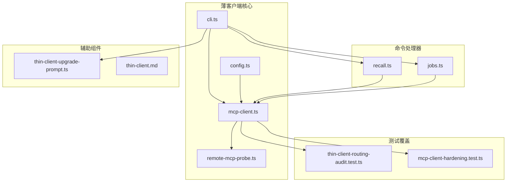
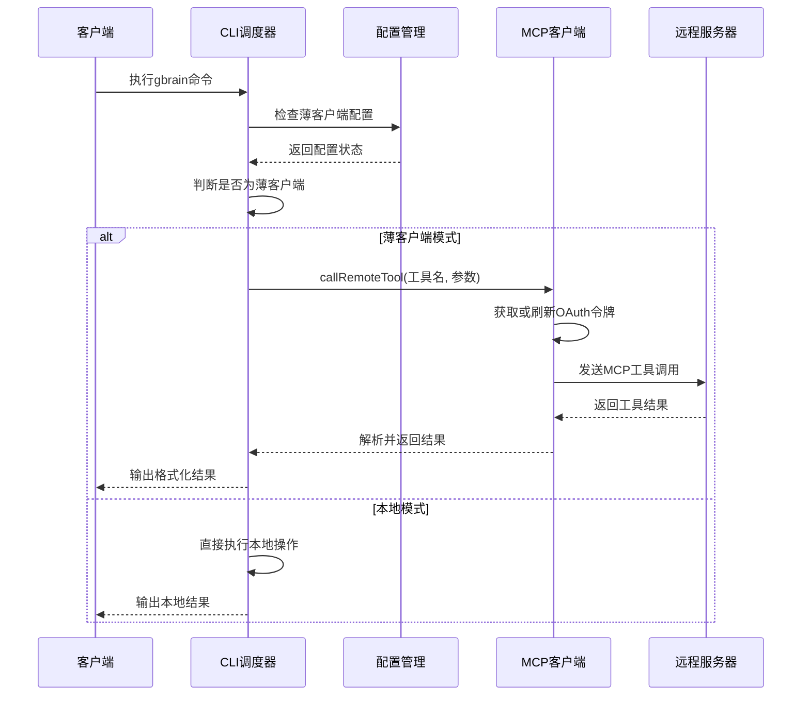
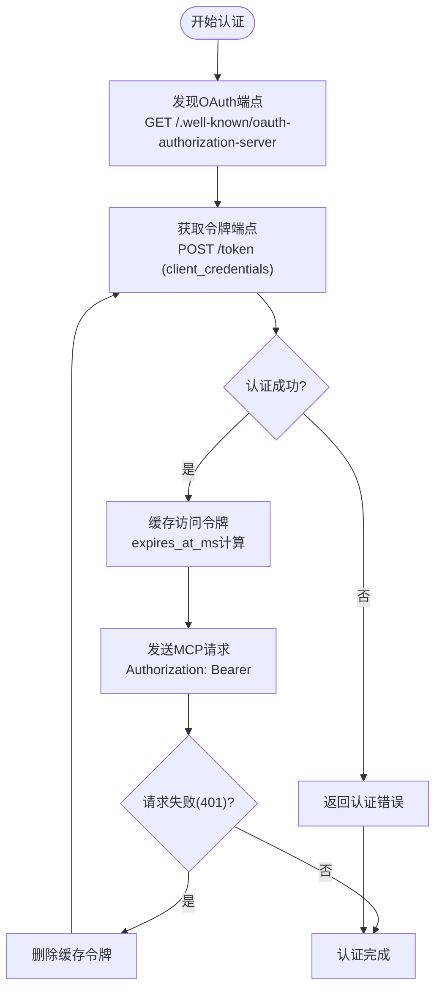
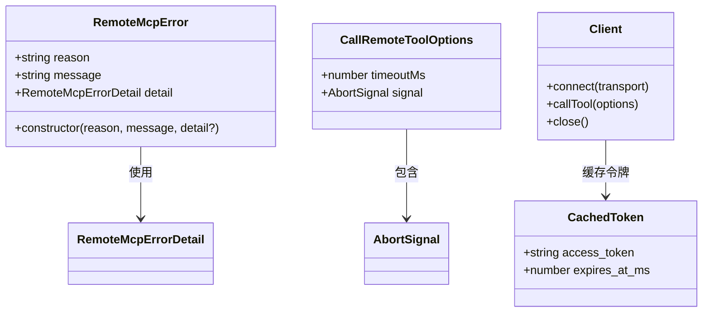
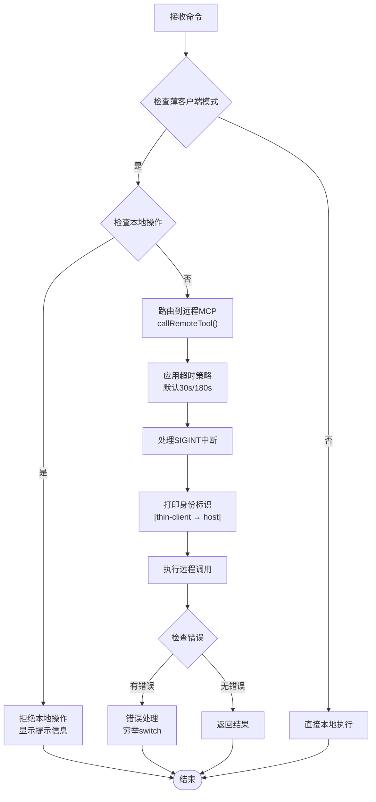
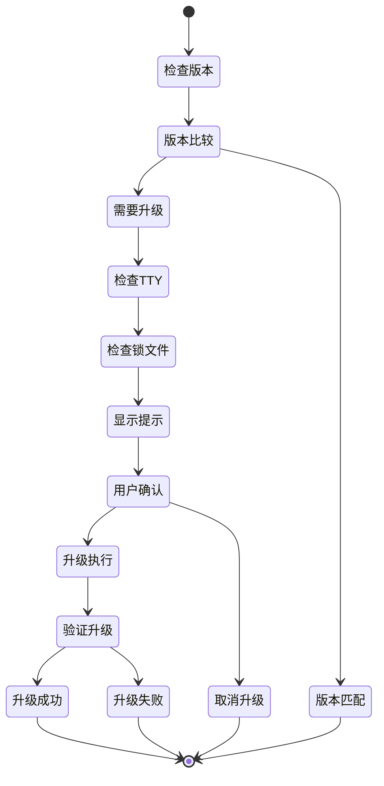

# 薄客户端路由

<cite>
**本文档引用的文件**
- [mcp-client.ts](file://src/core/mcp-client.ts)
- [cli.ts](file://src/cli.ts)
- [config.ts](file://src/core/config.ts)
- [remote-mcp-probe.ts](file://src/core/remote-mcp-probe.ts)
- [recall.ts](file://src/commands/recall.ts)
- [jobs.ts](file://src/commands/jobs.ts)
- [thin-client-upgrade-prompt.ts](file://src/core/thin-client-upgrade-prompt.ts)
- [thin-client.md](file://docs/architecture/thin-client.md)
- [thin-client-routing-audit.test.ts](file://test/thin-client-routing-audit.test.ts)
- [mcp-client-hardening.test.ts](file://test/mcp-client-hardening.test.ts)
</cite>

## 目录
1. [简介](#简介)
2. [项目结构](#项目结构)
3. [核心组件](#核心组件)
4. [架构概览](#架构概览)
5. [详细组件分析](#详细组件分析)
6. [依赖关系分析](#依赖关系分析)
7. [性能考虑](#性能考虑)
8. [故障排除指南](#故障排除指南)
9. [结论](#结论)

## 简介

GBrain薄客户端路由机制是一个基于MCP（Model Context Protocol）协议的远程调用系统，允许客户端在没有本地数据库的情况下通过HTTP与远程Brain服务器进行交互。该系统实现了多拓扑架构中的薄客户端模式，通过统一的路由层将本地命令转换为远程MCP工具调用。

薄客户端路由的核心特性包括：
- **统一路由接口**：所有非本地操作都通过`callRemoteTool`函数路由到远程服务器
- **身份验证集成**：支持OAuth 2.0客户端凭证流，自动令牌管理和刷新
- **错误处理机制**：全面的错误分类和用户友好的错误消息
- **超时控制**：可配置的请求超时和中断处理
- **性能优化**：令牌缓存、连接复用和响应解析优化

## 项目结构

薄客户端路由系统的文件组织遵循功能模块化原则：



**图表来源**
- [cli.ts:1-800](file://src/cli.ts#L1-L800)
- [mcp-client.ts:1-397](file://src/core/mcp-client.ts#L1-L397)
- [recall.ts:1-667](file://src/commands/recall.ts#L1-L667)
- [jobs.ts:1-800](file://src/commands/jobs.ts#L1-L800)

**章节来源**
- [thin-client.md:1-71](file://docs/architecture/thin-client.md#L1-L71)

## 核心组件

### MCP客户端核心

MCP客户端是薄客户端路由系统的核心组件，负责与远程服务器建立安全的HTTP连接并执行工具调用。

**主要功能**：
- OAuth令牌管理：自动发现OAuth端点、获取访问令牌、处理令牌刷新
- 工具调用封装：将本地操作参数转换为MCP工具调用
- 错误标准化：将所有传输错误转换为统一的`RemoteMcpError`类型
- 响应解析：从MCP响应中提取JSON结果内容

**章节来源**
- [mcp-client.ts:1-397](file://src/core/mcp-client.ts#L1-L397)

### CLI路由调度器

CLI路由调度器负责检测薄客户端模式并决定操作的执行路径。

**关键特性**：
- **薄客户端检测**：通过`isThinClient()`函数判断是否为薄客户端安装
- **操作路由**：将非本地操作重定向到远程MCP工具
- **错误处理**：使用穷举switch语句处理所有可能的错误原因
- **超时控制**：为每个操作设置适当的超时时间

**章节来源**
- [cli.ts:354-596](file://src/cli.ts#L354-L596)

### 配置管理系统

配置管理系统为薄客户端提供远程服务器连接信息和认证凭据。

**配置项**：
- `remote_mcp`: 远程MCP服务器配置
- `issuer_url`: OAuth发现URL
- `mcp_url`: MCP工具端点URL
- `oauth_client_id`: OAuth客户端ID
- `oauth_client_secret`: OAuth客户端密钥

**章节来源**
- [config.ts:288-293](file://src/core/config.ts#L288-L293)

## 架构概览

薄客户端路由系统采用分层架构设计，确保了清晰的关注点分离和良好的可维护性。



**图表来源**
- [cli.ts:354-596](file://src/cli.ts#L354-L596)
- [mcp-client.ts:283-374](file://src/core/mcp-client.ts#L283-L374)

### 身份验证流程

薄客户端路由系统实现了完整的OAuth 2.0客户端凭证流程：



**图表来源**
- [remote-mcp-probe.ts:36-126](file://src/core/remote-mcp-probe.ts#L36-L126)
- [mcp-client.ts:170-202](file://src/core/mcp-client.ts#L170-L202)

**章节来源**
- [remote-mcp-probe.ts:1-183](file://src/core/remote-mcp-probe.ts#L1-L183)
- [mcp-client.ts:166-202](file://src/core/mcp-client.ts#L166-L202)

## 详细组件分析

### MCP客户端实现

MCP客户端实现了完整的MCP协议客户端功能，包括身份验证、工具调用和错误处理。

#### 核心类和接口



**图表来源**
- [mcp-client.ts:56-83](file://src/core/mcp-client.ts#L56-L83)
- [mcp-client.ts:235-240](file://src/core/mcp-client.ts#L235-L240)
- [mcp-client.ts:26-33](file://src/core/mcp-client.ts#L26-L33)

#### 错误处理机制

MCP客户端实现了全面的错误处理机制，确保所有异常都被标准化为`RemoteMcpError`类型：

**错误原因分类**：
- `config`: 配置错误
- `discovery`: OAuth发现失败
- `auth`: 认证失败
- `auth_after_refresh`: 刷新后认证失败
- `network`: 网络错误
- `tool_error`: 工具调用错误
- `parse`: 解析错误

**章节来源**
- [mcp-client.ts:56-83](file://src/core/mcp-client.ts#L56-L83)
- [mcp-client-hardening.test.ts:1-35](file://test/mcp-client-hardening.test.ts#L1-L35)

### CLI路由调度器

CLI路由调度器是薄客户端路由系统的核心协调器，负责将本地命令转换为适当的执行路径。

#### 路由决策逻辑



**图表来源**
- [cli.ts:354-596](file://src/cli.ts#L354-L596)

**章节来源**
- [cli.ts:499-596](file://src/cli.ts#L499-L596)

### 命令处理器实现

薄客户端路由系统为多个命令提供了专门的路由实现，确保每个命令都能正确地与远程服务器交互。

#### Recall命令路由

Recall命令实现了复杂的薄客户端路由逻辑，支持多种查询模式：

**支持的查询模式**：
- 实体查询：`gbrain recall <entity>`
- 时间范围查询：`gbrain recall --since "8 hours ago"`
- 会话查询：`gbrain recall --session <id>`
- 今日查询：`gbrain recall --today`
- 文本过滤：`gbrain recall --grep <text>`
- 审计日志：`gbrain recall --supersessions`

**章节来源**
- [recall.ts:260-323](file://src/commands/recall.ts#L260-L323)

#### Jobs命令路由

Jobs命令实现了作业队列的薄客户端路由，支持远程作业管理：

**支持的操作**：
- 列出作业：`gbrain jobs list`
- 获取作业详情：`gbrain jobs get <id>`
- 提交新作业：`gbrain jobs submit <name>`
- 取消作业：`gbrain jobs cancel <id>`
- 重试作业：`gbrain jobs retry <id>`

**章节来源**
- [jobs.ts:424-487](file://src/commands/jobs.ts#L424-L487)

### 升级提示系统

薄客户端升级提示系统确保客户端与远程服务器版本保持同步：



**图表来源**
- [thin-client-upgrade-prompt.ts:384-471](file://src/core/thin-client-upgrade-prompt.ts#L384-L471)

**章节来源**
- [thin-client-upgrade-prompt.ts:363-471](file://src/core/thin-client-upgrade-prompt.ts#L363-L471)

## 依赖关系分析

薄客户端路由系统的依赖关系体现了清晰的分层架构：

```mermaid
graph TD
subgraph "外部依赖"
A[@modelcontextprotocol/sdk]
B[Undici Fetch]
C[Node.js Crypto]
end
subgraph "内部模块"
D[cli.ts]
E[mcp-client.ts]
F[config.ts]
G[remote-mcp-probe.ts]
H[recall.ts]
I[jobs.ts]
J[thin-client-upgrade-prompt.ts]
end
subgraph "测试模块"
K[thin-client-routing-audit.test.ts]
L[mcp-client-hardening.test.ts]
end
D --> E
D --> F
E --> G
E --> A
E --> B
H --> E
I --> E
J --> D
K --> E
L --> E
```

**图表来源**
- [cli.ts:33-35](file://src/cli.ts#L33-L35)
- [mcp-client.ts:21-24](file://src/core/mcp-client.ts#L21-L24)

### 关键依赖关系

**核心依赖链**：
1. `cli.ts` → `mcp-client.ts`：CLI调度器依赖MCP客户端进行远程调用
2. `mcp-client.ts` → `remote-mcp-probe.ts`：MCP客户端依赖OAuth探测功能
3. `recall.ts` → `mcp-client.ts`：Recall命令依赖MCP客户端进行路由
4. `jobs.ts` → `mcp-client.ts`：Jobs命令依赖MCP客户端进行路由

**章节来源**
- [cli.ts:33-35](file://src/cli.ts#L33-L35)
- [mcp-client.ts:21-24](file://src/core/mcp-client.ts#L21-L24)

## 性能考虑

薄客户端路由系统在设计时充分考虑了性能优化：

### 令牌缓存策略

MCP客户端实现了智能令牌缓存机制，通过以下方式优化性能：

- **进程内缓存**：使用Map存储访问令牌，避免重复认证
- **安全过期**：在服务器声明过期前30秒主动刷新令牌
- **自动清理**：401错误触发的令牌失效处理

### 连接管理

- **短连接模式**：每次工具调用创建新的客户端连接，避免长连接复杂性
- **连接复用限制**：由于SDK不支持在同一连接上切换头部，采用短连接策略
- **资源清理**：确保每个客户端连接在使用后正确关闭

### 响应优化

- **延迟解析**：只在需要时解析MCP响应内容
- **结果缓存**：身份标识信息缓存60秒，减少不必要的远程调用
- **数据格式化**：统一本地引擎路径的结果格式，消除渲染差异

## 故障排除指南

### 常见问题诊断

#### 认证问题

**症状**：`OAuth auth failed` 或 `Auth failed after token refresh`

**解决方案**：
1. 验证OAuth客户端凭据的有效性
2. 检查远程服务器上的客户端注册状态
3. 确认客户端具有足够的OAuth作用域

**章节来源**
- [mcp-client.ts:342-364](file://src/core/mcp-client.ts#L342-L364)

#### 网络连接问题

**症状**：`Cannot reach <host>` 或 `Request to <url> timed out`

**解决方案**：
1. 检查网络连通性和防火墙设置
2. 验证MCP服务器URL的可达性
3. 调整超时参数以适应网络条件

#### 工具调用错误

**症状**：`Remote tool <name> failed` 或 `tool_error`

**解决方案**：
1. 检查远程服务器上对应工具的可用性
2. 验证工具参数的正确性
3. 查看服务器端的日志以获取详细错误信息

### 调试技巧

#### 启用详细日志

```bash
# 设置调试环境变量
export GBRAIN_DEBUG=1
export GBRAIN_NO_BANNER=1

# 运行命令查看详细输出
gbrain --help
```

#### 测试连接

```bash
# 使用远程医生命令检查连接
gbrain remote doctor

# 直接测试MCP连接
curl -I "https://your-mcp-server/mcp"
```

**章节来源**
- [mcp-client-hardening.test.ts:27-35](file://test/mcp-client-hardening.test.ts#L27-L35)

## 结论

GBRain薄客户端路由系统通过精心设计的架构实现了可靠的远程调用机制。系统的关键优势包括：

**可靠性**：通过全面的错误处理和超时控制，确保在各种网络条件下都能提供稳定的用户体验。

**安全性**：实现了完整的OAuth 2.0流程，包括令牌管理和自动刷新，保护客户端免受未授权访问。

**可维护性**：清晰的分层架构和模块化设计使得系统易于理解和扩展。

**性能**：通过令牌缓存、短连接模式和响应优化等策略，在保证功能完整性的同时最大化系统性能。

该系统为GBRain提供了强大的薄客户端支持，使用户能够在任何环境中无缝访问远程Brain服务，同时保持与本地操作相同的用户体验。