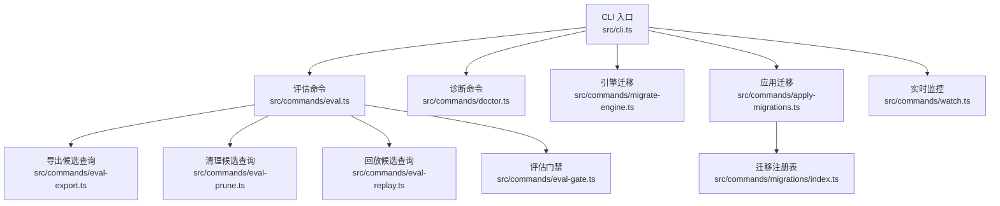
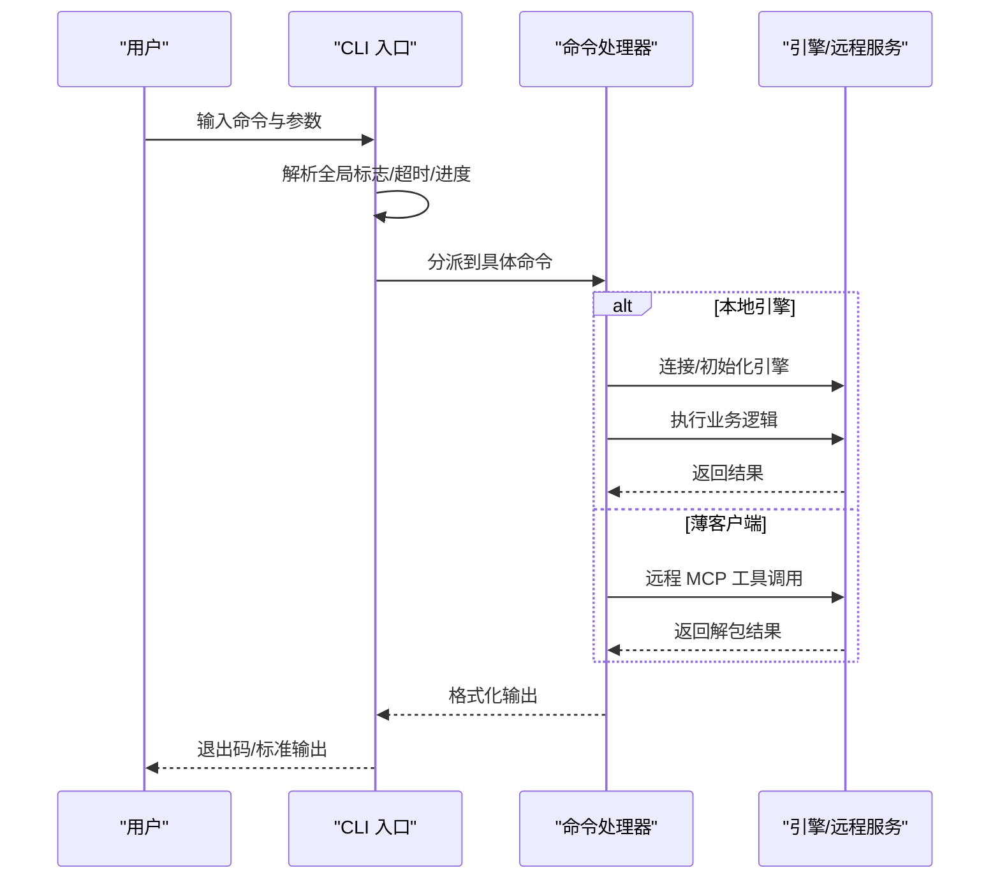
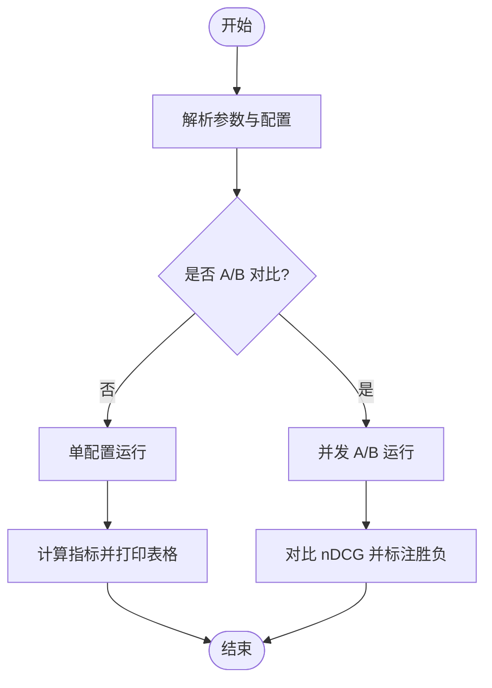
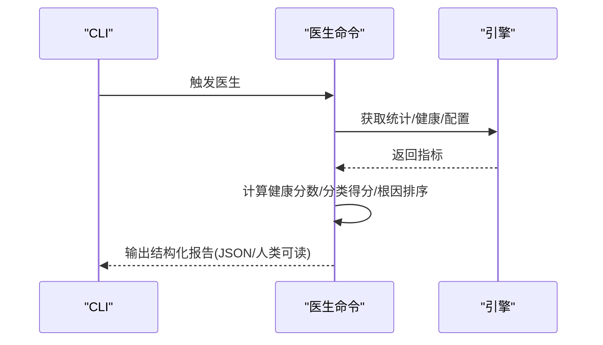
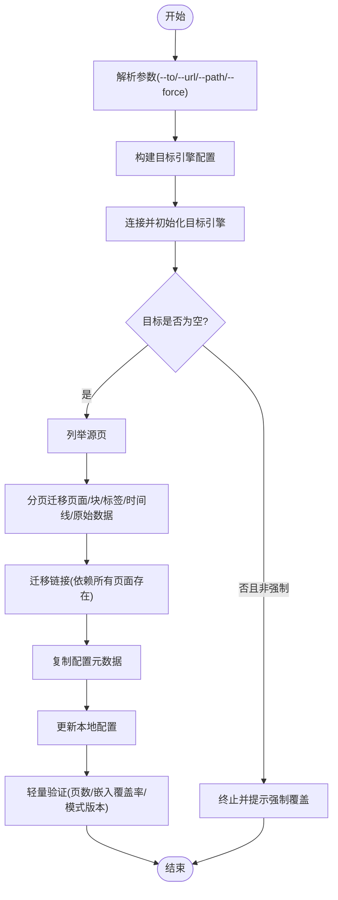
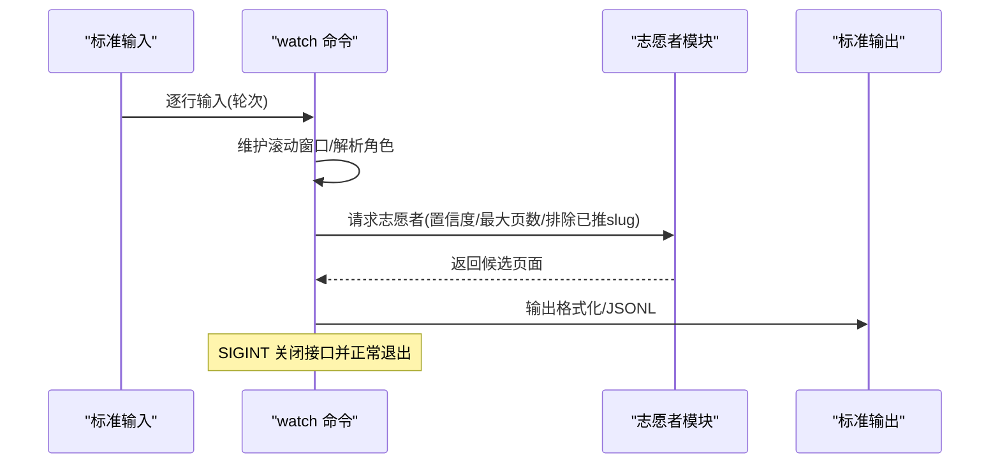
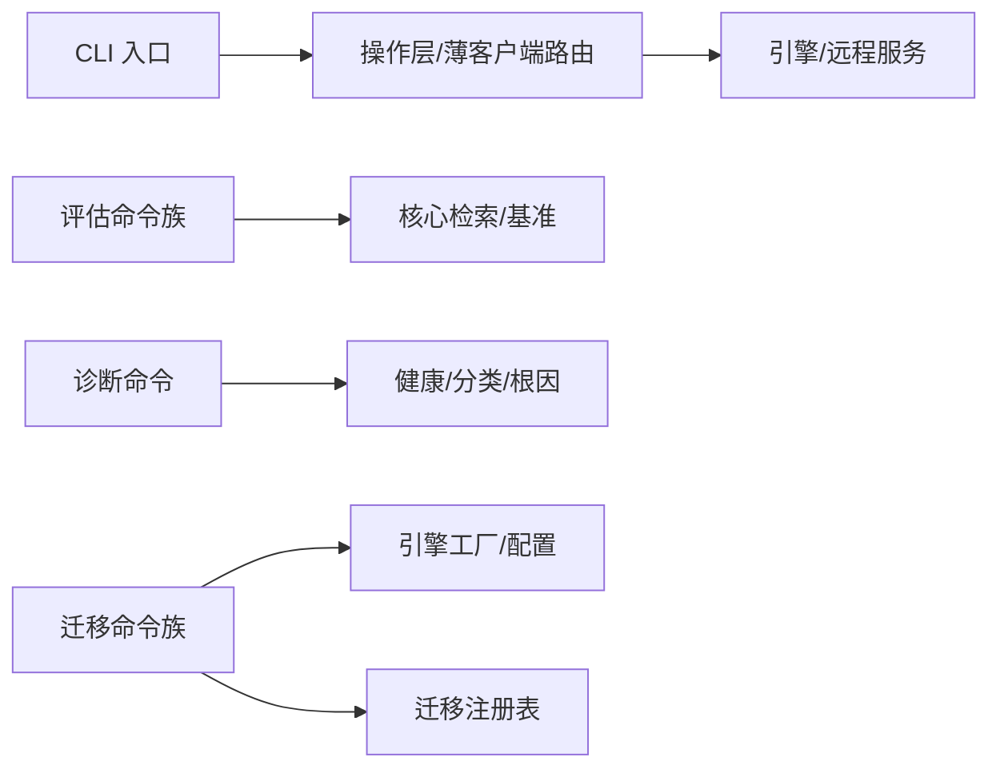

# 高级操作命令

<cite>
**本文引用的文件**
- [src/cli.ts](file://src/cli.ts)
- [src/commands/eval.ts](file://src/commands/eval.ts)
- [src/commands/eval-export.ts](file://src/commands/eval-export.ts)
- [src/commands/eval-prune.ts](file://src/commands/eval-prune.ts)
- [src/commands/eval-replay.ts](file://src/commands/eval-replay.ts)
- [src/commands/eval-gate.ts](file://src/commands/eval-gate.ts)
- [src/commands/doctor.ts](file://src/commands/doctor.ts)
- [src/commands/migrate-engine.ts](file://src/commands/migrate-engine.ts)
- [src/commands/apply-migrations.ts](file://src/commands/apply-migrations.ts)
- [src/commands/watch.ts](file://src/commands/watch.ts)
- [src/commands/migrations/index.ts](file://src/commands/migrations/index.ts)
- [test/e2e/mechanical.test.ts](file://test/e2e/mechanical.test.ts)
- [test/watch-sigint.serial.test.ts](file://test/watch-sigint.serial.test.ts)
- [test/schema-cli.test.ts](file://test/schema-cli.test.ts)
- [test/e2e/thin-client.test.ts](file://test/e2e/thin-client.test.ts)
</cite>

## 目录
1. [简介](#简介)
2. [项目结构](#项目结构)
3. [核心组件](#核心组件)
4. [架构总览](#架构总览)
5. [详细组件分析](#详细组件分析)
6. [依赖关系分析](#依赖关系分析)
7. [性能考量](#性能考量)
8. [故障排查指南](#故障排查指南)
9. [结论](#结论)
10. [附录](#附录)

## 简介
本文件面向运维与平台工程团队，系统化梳理 GBrain 的高级操作命令：评估命令（gbrain eval）、诊断命令（gbrain doctor）、迁移命令（gbrain migrate）与监控命令（gbrain watch）。内容覆盖复杂操作的执行流程、参数配置、结果分析、性能监控、系统健康检查、数据迁移策略与实时监控方法，并提供故障诊断、性能调优与运维管理的专业指导。

## 项目结构
- 命令入口与分发：CLI 入口负责解析全局选项、路由到具体命令、处理薄客户端远程路径与超时控制等。
- 评估命令族：围绕检索质量评估的多子命令与工具链，支持导出/回放/裁剪/门禁等。
- 诊断命令：本地与远程医生报告，聚合健康评分、分类打分与修复建议。
- 迁移命令族：引擎迁移与迁移编排（应用迁移、迁移注册表）。
- 实时监控命令：基于 stdin 流的上下文志愿者推送，支持交互式与管道式会话。

图表来源
- [src/cli.ts](file://src/cli.ts)
- [src/commands/eval.ts](file://src/commands/eval.ts)
- [src/commands/doctor.ts](file://src/commands/doctor.ts)
- [src/commands/migrate-engine.ts](file://src/commands/migrate-engine.ts)
- [src/commands/apply-migrations.ts](file://src/commands/apply-migrations.ts)
- [src/commands/watch.ts](file://src/commands/watch.ts)
- [src/commands/migrations/index.ts](file://src/commands/migrations/index.ts)

章节来源
- [src/cli.ts](file://src/cli.ts)
- [src/commands/eval.ts](file://src/commands/eval.ts)
- [src/commands/doctor.ts](file://src/commands/doctor.ts)
- [src/commands/migrate-engine.ts](file://src/commands/migrate-engine.ts)
- [src/commands/apply-migrations.ts](file://src/commands/apply-migrations.ts)
- [src/commands/watch.ts](file://src/commands/watch.ts)
- [src/commands/migrations/index.ts](file://src/commands/migrations/index.ts)

## 核心组件
- CLI 路由与生命周期
  - 解析全局标志（如 --progress-json、--timeout），在命令执行前完成。
  - 支持薄客户端远程路由与本地引擎路径，统一超时与退出语义。
  - 提供更新提示、进度条、心跳与优雅退出流程。
- 评估命令族
  - 主命令支持单配置与 A/B 对比；子命令覆盖导出、裁剪、回放、门禁与专项评测。
  - 支持多种检索策略、去重阈值、限制深度与指标输出。
- 诊断命令
  - 本地医生：全量健康检查、分类打分、根因排序与修复建议。
  - 远程医生：聚焦连接、模式版本、脑健康复合评分、同步失败、队列健康等。
- 引擎迁移与迁移编排
  - 引擎迁移：PGlite 与 Postgres 互转，保留多源页面、链接与配置元数据。
  - 应用迁移：按版本注册表执行迁移编排，支持干跑、强制重试、跳过校验等。
- 实时监控
  - 基于 stdin 的对话轮次流，按置信度与窗口大小志愿者推送页面指针，支持 JSONL 输出与交互式会话。

章节来源
- [src/cli.ts](file://src/cli.ts)
- [src/commands/eval.ts](file://src/commands/eval.ts)
- [src/commands/doctor.ts](file://src/commands/doctor.ts)
- [src/commands/migrate-engine.ts](file://src/commands/migrate-engine.ts)
- [src/commands/apply-migrations.ts](file://src/commands/apply-migrations.ts)
- [src/commands/watch.ts](file://src/commands/watch.ts)

## 架构总览
下图展示 CLI 如何将用户输入路由到各高级命令，并在本地或远程引擎上执行：

图表来源
- [src/cli.ts](file://src/cli.ts)

章节来源
- [src/cli.ts](file://src/cli.ts)

## 详细组件分析

### 评估命令 gbrain eval
- 功能定位
  - 检索质量基准评估，支持单配置运行与 A/B 对比，输出精确率、召回率、MRR、nDCG 等指标。
  - 子命令覆盖导出候选查询、裁剪历史、回放基线、门禁（回归/正确性）与专项评测。
- 关键流程
  - 参数解析：支持 qrels 文件或内联 JSON、策略选择、RRF K、扩展开关、去重阈值、限制深度与 K。
  - 单次运行：逐查询执行检索，汇总指标并打印表格。
  - A/B 对比：并发运行两套配置，对比 nDCG 等差异，标注胜负。
  - 子命令：
    - 导出：从 eval_candidates 导出 NDJSON，带 schema 版本前缀，支持时间窗与工具过滤。
    - 回放：对基线 NDJSON 重放检索，计算 Jaccard、Top-1 稳定性、延迟变化。
    - 门禁：同时或分别运行回归门禁与正确性门禁，失败即退出码 1。
    - 裁剪：按时间窗删除旧候选记录，支持 dry-run 预览。
- 性能与稳定性
  - 使用进度条与心跳反馈长任务状态。
  - 回放/门禁采用进程内执行，避免版本漂移风险。
- 结果分析
  - 单次运行输出均值指标；A/B 对比输出 ΔnDCG 与胜负。
  - 门禁输出结构化 JSON 或人类可读摘要，包含阈值与违例项。

图表来源
- [src/commands/eval.ts](file://src/commands/eval.ts)
- [src/commands/eval-export.ts](file://src/commands/eval-export.ts)
- [src/commands/eval-replay.ts](file://src/commands/eval-replay.ts)
- [src/commands/eval-gate.ts](file://src/commands/eval-gate.ts)
- [src/commands/eval-prune.ts](file://src/commands/eval-prune.ts)

章节来源
- [src/commands/eval.ts](file://src/commands/eval.ts)
- [src/commands/eval-export.ts](file://src/commands/eval-export.ts)
- [src/commands/eval-prune.ts](file://src/commands/eval-prune.ts)
- [src/commands/eval-replay.ts](file://src/commands/eval-replay.ts)
- [src/commands/eval-gate.ts](file://src/commands/eval-gate.ts)

### 诊断命令 gbrain doctor
- 功能定位
  - 本地医生：全量健康检查、分类打分、根因排序与修复建议。
  - 远程医生：聚焦连接、模式版本、脑健康复合评分、同步失败、队列健康等。
- 关键流程
  - 计算健康分数与分类得分，生成结构化报告（含 checks、top_issues 等）。
  - 远程医生：连接性、模式版本、脑评分、同步失败、队列健康、多源漂移、链接提取滞后等检查。
- 结果分析
  - 健康状态（healthy/warnings/unhealthy），健康分数与分类得分。
  - 顶层三类问题排序，便于优先处置根因。

图表来源
- [src/commands/doctor.ts](file://src/commands/doctor.ts)

章节来源
- [src/commands/doctor.ts](file://src/commands/doctor.ts)

### 迁移命令 gbrain migrate 与应用迁移 gbrain apply-migrations
- 功能定位
  - 引擎迁移：在 PGLite 与 Postgres 之间迁移脑数据，保留页面、块、标签、时间线、原始数据、链接与配置元数据。
  - 应用迁移：按版本注册表执行迁移编排，支持干跑、强制重试、跳过校验、自动安装等。
- 关键流程
  - 引擎迁移：
    - 解析目标引擎与连接参数，连接并初始化目标引擎。
    - 校验目标是否为空（可强制覆盖）。
    - 列举源页并分页迁移，支持多源键组合以避免 slug 冲突。
    - 最后迁移链接，复制配置元数据（嵌入模型、维度、分块策略等）。
    - 更新本地配置并进行轻量验证（页数、嵌入覆盖率、模式版本）。
  - 应用迁移：
    - 加载已完成迁移清单，构建“已应用/部分/待定/未来/夹塞”计划。
    - 支持 --force-retry、--force-orchestrator、--force-schema、--skip-verify 等高级选项。
    - 逐迁移执行编排器，持久化结果，失败则中断并提示修复后重试。
- 结果分析
  - 引擎迁移：迁移完成页数、目标健康验证提示。
  - 应用迁移：迁移清单列表、干跑计划、失败原因与重试指引。

图表来源
- [src/commands/migrate-engine.ts](file://src/commands/migrate-engine.ts)
- [src/commands/apply-migrations.ts](file://src/commands/apply-migrations.ts)
- [src/commands/migrations/index.ts](file://src/commands/migrations/index.ts)

章节来源
- [src/commands/migrate-engine.ts](file://src/commands/migrate-engine.ts)
- [src/commands/apply-migrations.ts](file://src/commands/apply-migrations.ts)
- [src/commands/migrations/index.ts](file://src/commands/migrations/index.ts)

### 监控命令 gbrain watch
- 功能定位
  - 基于 stdin 的对话轮次流，按置信度与窗口大小志愿者推送页面指针，支持 JSONL 输出与交互式会话。
- 关键流程
  - 解析标志：--json、--window-turns、--max-pages、--min-confidence、--source。
  - 读取 stdin 行（支持前缀 user:/assistant: 自动识别角色），维护滚动窗口。
  - 调用志愿者模块，按置信度与最大页数筛选并去重，输出格式化或 JSONL。
  - 处理 SIGINT：关闭 readline 接口，走正常 drain-then-exit 生命周期。
- 结果分析
  - 每轮输出若干页面指针及其理由，便于下游消费。

图表来源
- [src/commands/watch.ts](file://src/commands/watch.ts)

章节来源
- [src/commands/watch.ts](file://src/commands/watch.ts)
- [test/watch-sigint.serial.test.ts](file://test/watch-sigint.serial.test.ts)

## 依赖关系分析
- 命令与核心模块
  - CLI 通过操作层与薄客户端路由，统一本地引擎与远程 MCP 调用。
  - 评估命令依赖核心检索与基准模块，子命令间通过共享类型与工具函数协作。
  - 诊断命令依赖健康指标、分类与根因排序模块。
  - 迁移命令依赖引擎工厂、配置与迁移注册表。
- 外部集成
  - 远程医生通过 MCP 工具调用返回报告，与本地医生保持一致的数据形状。
  - thin-client 模式下，CLI 在远程路径中打印身份横幅并处理网络错误。

图表来源
- [src/cli.ts](file://src/cli.ts)
- [src/commands/eval.ts](file://src/commands/eval.ts)
- [src/commands/doctor.ts](file://src/commands/doctor.ts)
- [src/commands/migrate-engine.ts](file://src/commands/migrate-engine.ts)
- [src/commands/apply-migrations.ts](file://src/commands/apply-migrations.ts)
- [src/commands/migrations/index.ts](file://src/commands/migrations/index.ts)

章节来源
- [src/cli.ts](file://src/cli.ts)
- [src/commands/eval.ts](file://src/commands/eval.ts)
- [src/commands/doctor.ts](file://src/commands/doctor.ts)
- [src/commands/migrate-engine.ts](file://src/commands/migrate-engine.ts)
- [src/commands/apply-migrations.ts](file://src/commands/apply-migrations.ts)
- [src/commands/migrations/index.ts](file://src/commands/migrations/index.ts)

## 性能考量
- 评估命令
  - 回放/门禁采用进程内执行，避免外部子进程版本漂移；对大规模基线建议限制 --limit。
  - 指标计算与输出使用进度条与心跳，长任务可观测。
- 诊断命令
  - 远程医生在薄客户端路径中保持最小 I/O，仅读取必要指标；本地医生聚合多类检查，注意数据库锁竞争。
- 引擎迁移
  - 分页迁移与批量写入，支持多源键组合避免冲突；--force 会触发全表删除（谨慎使用）。
- 实时监控
  - 会话期间持有单写引擎锁，PGLite 场景不建议与其他 gbrain 进程并发访问。

## 故障排查指南
- 评估命令
  - 门禁失败：检查阈值设置、基线文件可读性与 qrels 文件格式；关注回归门禁的 Jaccard/Top-1/延迟比率与正确性门禁的召回率/命中率。
  - 回放异常：确认基线文件 schema 版本为 1，查询非空；关注重建检索时的异常堆栈。
- 诊断命令
  - 远程医生：根据报告 status 与 checks 定位问题；关注连接、模式版本、脑评分、同步失败与队列健康。
  - 本地医生：查看分类得分与 top_issues，优先处理 fail 类别根因。
- 迁移命令
  - 引擎迁移：若目标非空且未加 --force，需先清空或改用 --force；迁移完成后执行轻量验证。
  - 应用迁移：遇到“夹塞迁移”（连续多次 partial）需使用 --force-retry 或 --force-orchestrator；--force-schema 可重跑 schema 迁移。
- 实时监控
  - SIGINT 正常关闭流并走 drain-then-exit；PGLite 场景避免与 serve 并发。

章节来源
- [src/commands/eval-gate.ts](file://src/commands/eval-gate.ts)
- [src/commands/eval-replay.ts](file://src/commands/eval-replay.ts)
- [src/commands/doctor.ts](file://src/commands/doctor.ts)
- [src/commands/migrate-engine.ts](file://src/commands/migrate-engine.ts)
- [src/commands/apply-migrations.ts](file://src/commands/apply-migrations.ts)
- [test/watch-sigint.serial.test.ts](file://test/watch-sigint.serial.test.ts)

## 结论
- gbrain eval 提供端到端检索质量评估能力，结合导出/回放/门禁形成闭环。
- gbrain doctor 为本地与远程提供一致的健康视图与修复建议。
- gbrain migrate 与 apply-migrations 保障跨引擎与版本演进的稳定迁移。
- gbrain watch 为实时上下文推送提供低延迟、高可用的流式体验。
- 建议在生产环境配合门禁与医生定期巡检，迁移前后执行验证，监控 SIGINT 生命周期与并发约束。

## 附录
- 常见用法示例（路径引用）
  - 评估命令：参见 [src/commands/eval.ts](file://src/commands/eval.ts) 中的帮助文本与参数解析。
  - 评估导出/回放/裁剪：参见 [src/commands/eval-export.ts](file://src/commands/eval-export.ts)、[src/commands/eval-replay.ts](file://src/commands/eval-replay.ts)、[src/commands/eval-prune.ts](file://src/commands/eval-prune.ts)。
  - 评估门禁：参见 [src/commands/eval-gate.ts](file://src/commands/eval-gate.ts)。
  - 诊断命令：参见 [src/commands/doctor.ts](file://src/commands/doctor.ts)。
  - 引擎迁移：参见 [src/commands/migrate-engine.ts](file://src/commands/migrate-engine.ts)。
  - 应用迁移：参见 [src/commands/apply-migrations.ts](file://src/commands/apply-migrations.ts)、[src/commands/migrations/index.ts](file://src/commands/migrations/index.ts)。
  - 实时监控：参见 [src/commands/watch.ts](file://src/commands/watch.ts)。
- 端到端测试参考
  - CLI 行为与 thin-client doctor：参见 [test/e2e/mechanical.test.ts](file://test/e2e/mechanical.test.ts)、[test/e2e/thin-client.test.ts](file://test/e2e/thin-client.test.ts)。
  - watch SIGINT 生命周期：参见 [test/watch-sigint.serial.test.ts](file://test/watch-sigint.serial.test.ts)。
  - schema CLI 行为：参见 [test/schema-cli.test.ts](file://test/schema-cli.test.ts)。