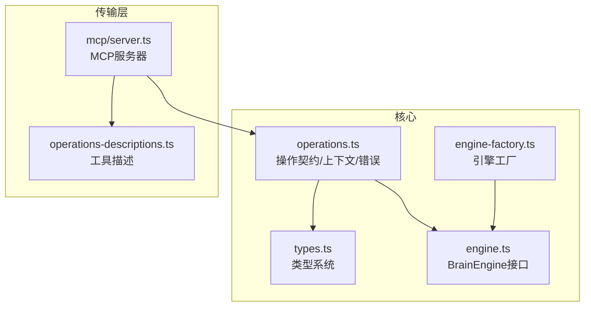
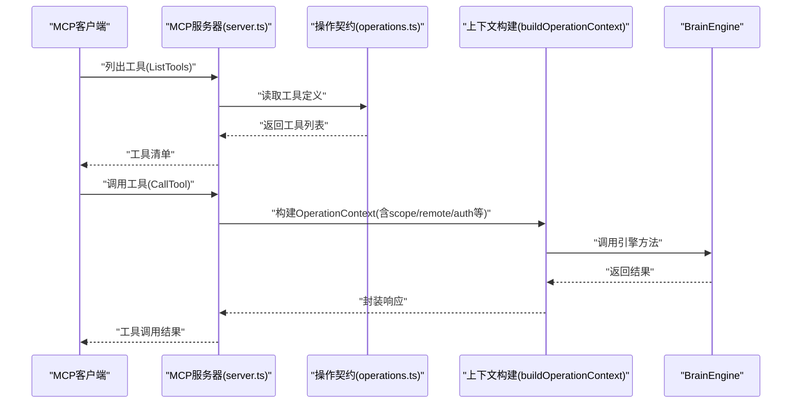
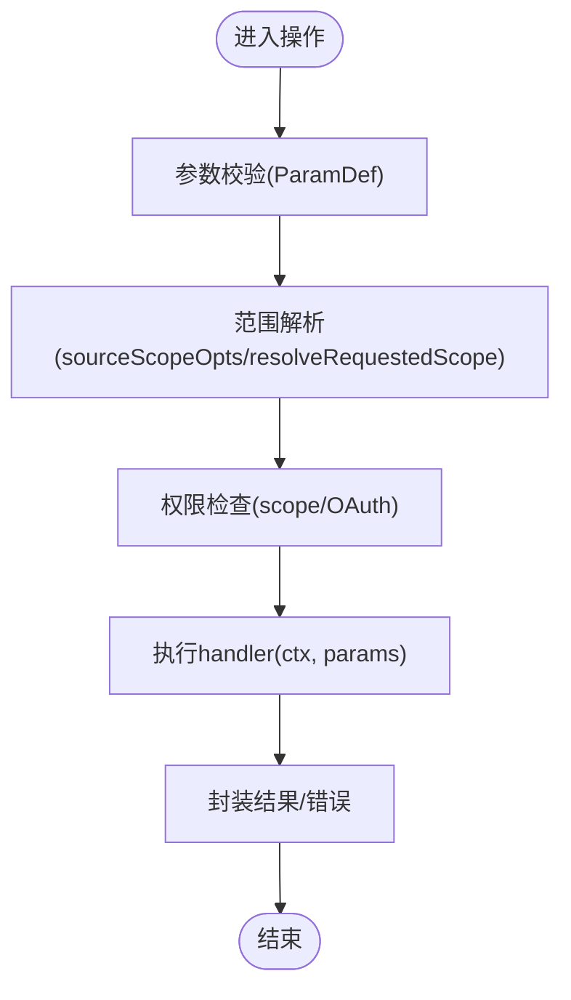
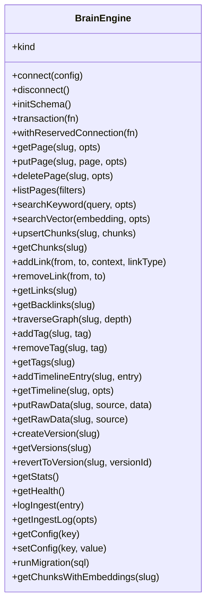
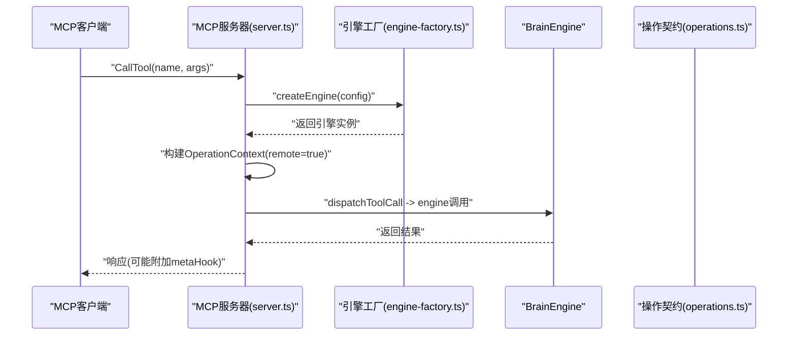
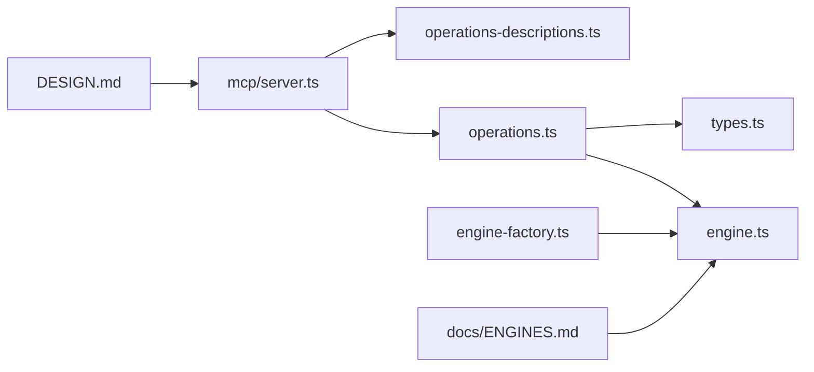

# API设计与模式

<cite>
**本文引用的文件**
- [operations.ts](file://src/core/operations.ts)
- [engine.ts](file://src/core/engine.ts)
- [server.ts](file://src/mcp/server.ts)
- [operations-descriptions.ts](file://src/core/operations-descriptions.ts)
- [types.ts](file://src/core/types.ts)
- [engine-factory.ts](file://src/core/engine-factory.ts)
- [ENGINES.md](file://docs/ENGINES.md)
- [DESIGN.md](file://DESIGN.md)
</cite>

## 目录
1. [引言](#引言)
2. [项目结构](#项目结构)
3. [核心组件](#核心组件)
4. [架构总览](#架构总览)
5. [详细组件分析](#详细组件分析)
6. [依赖关系分析](#依赖关系分析)
7. [性能考量](#性能考量)
8. [故障排查指南](#故障排查指南)
9. [结论](#结论)
10. [附录](#附录)

## 引言
本文件面向GBrain的API设计与模式，聚焦“合同优先（Contract-First）”理念在运行时的落地：以operations.ts中的操作契约为核心，统一CLI、MCP与工具集（tools.json）的输入输出；通过BrainEngine接口抽象存储层，实现引擎可插拔；结合MCP协议实现工具定义与分发。文档同时梳理类型系统、接口规范与数据传输格式，总结设计模式（工厂、策略、观察者）的应用与演进策略（向后兼容、版本管理），并给出最佳实践与常见反模式。

## 项目结构
- 核心API契约与运行时：src/core/operations.ts 定义Operation、参数校验、上下文与错误模型；配套描述常量集中于 src/core/operations-descriptions.ts。
- 存储引擎抽象：src/core/engine.ts 定义BrainEngine接口；具体实现由工厂动态加载（src/core/engine-factory.ts）。
- MCP服务端：src/mcp/server.ts 基于MCP SDK生成工具定义、处理工具调用、注入上下文与元信息钩子。
- 类型系统：src/core/types.ts 定义页面、搜索、链接、标签、时间线、事实、轨迹等核心类型与约束。
- 设计文档：docs/ENGINES.md 阐述引擎可插拔架构；DESIGN.md 提供设计语言与交互原则。

图表来源
- [operations.ts](file://src/core/operations.ts)
- [engine.ts](file://src/core/engine.ts)
- [server.ts](file://src/mcp/server.ts)
- [operations-descriptions.ts](file://src/core/operations-descriptions.ts)
- [engine-factory.ts](file://src/core/engine-factory.ts)

章节来源
- [operations.ts](file://src/core/operations.ts)
- [engine.ts](file://src/core/engine.ts)
- [server.ts](file://src/mcp/server.ts)
- [operations-descriptions.ts](file://src/core/operations-descriptions.ts)
- [engine-factory.ts](file://src/core/engine-factory.ts)
- [ENGINES.md](file://docs/ENGINES.md)
- [DESIGN.md](file://DESIGN.md)

## 核心组件
- 操作契约（Operation）
  - 统一schema（params）、处理器（handler）、可选CLI提示（cliHints）、作用域（scope）、是否写操作（mutating）。
  - 参数校验与默认值、枚举、数组项等通过ParamDef声明。
- 运行上下文（OperationContext）
  - 聚合引擎、配置、日志器、远端标记、OAuth授权信息、可信工作区前缀、CLI选项、持有者可见性过滤、脑ID、源ID等。
  - 提供sourceScopeOpts/linkReadScopeOpts/resolveRequestedScope等范围解析辅助函数，确保跨源读取安全。
- 错误模型（OperationError）
  - 结构化错误码（ErrorCode开放联合）、消息、建议与文档链接，支持JSON序列化。
- 工具描述（operations-descriptions.ts）
  - 将LLM路由意图与使用提示固化为常量，便于测试与路由变更。
- 类型系统（types.ts）
  - 页面类型开放化（PageType为string），页面、搜索结果、链接、标签、时间线、事实、轨迹等核心实体类型与约束。
- 引擎抽象（engine.ts）
  - 统一CRUD、搜索、图遍历、标签、时间线、原始数据、版本、统计健康、迁移等方法签名。
- 引擎工厂（engine-factory.ts）
  - 动态导入实现，按配置选择Postgres或PGLite，避免无关依赖加载。

章节来源
- [operations.ts](file://src/core/operations.ts)
- [operations-descriptions.ts](file://src/core/operations-descriptions.ts)
- [types.ts](file://src/core/types.ts)
- [engine.ts](file://src/core/engine.ts)
- [engine-factory.ts](file://src/core/engine-factory.ts)

## 架构总览
GBrain采用“合同优先”的API设计：operations.ts是CLI、MCP与工具集的单一真相来源。MCP服务器基于该契约生成工具定义，分发到客户端；所有调用经由共享的dispatch逻辑，构建OperationContext并执行handler。引擎通过BrainEngine抽象解耦存储实现，工厂按需加载，支持多引擎并存与迁移。

图表来源
- [server.ts](file://src/mcp/server.ts)
- [operations.ts](file://src/core/operations.ts)
- [engine.ts](file://src/core/engine.ts)

章节来源
- [server.ts](file://src/mcp/server.ts)
- [operations.ts](file://src/core/operations.ts)
- [engine.ts](file://src/core/engine.ts)

## 详细组件分析

### 组件A：操作定义与契约（operations.ts）
- 设计要点
  - 单一真相源：CLI、MCP、工具集共享同一Operation集合与参数schema。
  - 参数校验：ParamDef声明类型、必填、默认、枚举、数组项，保障入参一致性。
  - 上下文驱动：OperationContext贯穿所有handler，承载安全与信任边界（remote/auth/scopes）。
  - 错误统一：OperationError提供结构化错误码与建议，便于上层展示与诊断。
- 关键流程
  - 参数验证与默认填充
  - 权限与范围解析（sourceScopeOpts/resolveRequestedScope）
  - 认证与授权（scope字段、OAuth授权信息）
  - 处理器执行与结果封装
- 典型模式
  - 策略模式：resolveRequestedScope/resolveCodeIntelScope根据调用方信任级别与grant决定范围策略。
  - 观察者模式：OperationContext中注入metaHook（如热记忆注入），在工具调用后附加上下文信息。

图表来源
- [operations.ts](file://src/core/operations.ts)

章节来源
- [operations.ts](file://src/core/operations.ts)

### 组件B：BrainEngine接口设计（engine.ts）
- 设计要点
  - 抽象统一：CRUD、搜索、图遍历、标签、时间线、原始数据、版本、统计健康、迁移等方法签名一致。
  - 可插拔：通过engine-factory.ts动态导入实现，支持Postgres与PGLite。
  - 事务与保留连接：transaction与withReservedConnection提供ACID与长任务隔离能力。
  - 批量与重试：批量写入自包含重试语义，避免重复包装导致的放大。
- 数据模型
  - 页面、链接、标签、时间线、事实、轨迹、takes等核心实体类型与查询选项。
- 版本与健康
  - getStats/getHealth用于运维与诊断；runMigration支持引擎级迁移。

图表来源
- [engine.ts](file://src/core/engine.ts)

章节来源
- [engine.ts](file://src/core/engine.ts)
- [engine-factory.ts](file://src/core/engine-factory.ts)
- [ENGINES.md](file://docs/ENGINES.md)

### 组件C：MCP协议实现（server.ts）
- 设计要点
  - 工具定义：从operations.ts生成工具清单，供MCP客户端发现。
  - 工具调用：统一dispatchToolCall，强制remote=true（非本地可信路径），默认可见性过滤与源ID注入。
  - 上下文注入：metaHook用于在响应中附加热记忆等上下文信息。
  - IPC反射通道：在PGLite场景下，通过Unix Socket提供实体指针解析服务。
- 向后兼容
  - handleToolCall保留本地可信路径，允许显式sourceId覆盖。

图表来源
- [server.ts](file://src/mcp/server.ts)
- [engine-factory.ts](file://src/core/engine-factory.ts)
- [operations.ts](file://src/core/operations.ts)

章节来源
- [server.ts](file://src/mcp/server.ts)
- [engine-factory.ts](file://src/core/engine-factory.ts)
- [operations.ts](file://src/core/operations.ts)

### 组件D：类型系统与数据传输格式（types.ts）
- 设计要点
  - 页面类型开放化（PageType为string），通过schema包运行时校验替代编译期穷尽。
  - 页面、搜索结果、链接、标签、时间线、事实、轨迹、takes等核心类型与字段约束。
  - 搜索限制上限与范围钳制（clampSearchLimit），防止资源滥用。
- 数据传输
  - 操作返回统一为Promise<unknown>，由handler内部封装为稳定结构；错误通过OperationError结构化抛出。

章节来源
- [types.ts](file://src/core/types.ts)
- [operations.ts](file://src/core/operations.ts)

### 组件E：设计模式应用实例
- 工厂模式
  - engine-factory.ts：按配置动态导入并实例化引擎，屏蔽实现细节与依赖加载成本。
- 策略模式
  - resolveRequestedScope/resolveCodeIntelScope：根据调用方信任级别与grant，选择单源或多源范围策略。
- 观察者模式
  - OperationContext.metaHook：在工具调用完成后附加上下文信息（如热记忆），不侵入业务逻辑。

章节来源
- [engine-factory.ts](file://src/core/engine-factory.ts)
- [operations.ts](file://src/core/operations.ts)
- [server.ts](file://src/mcp/server.ts)

## 依赖关系分析
- operations.ts 依赖 engine.ts/types.ts/嵌入与搜索模块，作为运行时契约与调度中心。
- server.ts 依赖 operations.ts 与工具定义生成器，负责MCP协议适配与上下文构建。
- engine-factory.ts 依赖 engine.ts 接口，动态导入具体实现。
- ENGINES.md 与 DESIGN.md 提供架构与设计原则的高层指导。

图表来源
- [operations.ts](file://src/core/operations.ts)
- [engine.ts](file://src/core/engine.ts)
- [types.ts](file://src/core/types.ts)
- [server.ts](file://src/mcp/server.ts)
- [operations-descriptions.ts](file://src/core/operations-descriptions.ts)
- [engine-factory.ts](file://src/core/engine-factory.ts)
- [ENGINES.md](file://docs/ENGINES.md)
- [DESIGN.md](file://DESIGN.md)

章节来源
- [operations.ts](file://src/core/operations.ts)
- [engine.ts](file://src/core/engine.ts)
- [types.ts](file://src/core/types.ts)
- [server.ts](file://src/mcp/server.ts)
- [operations-descriptions.ts](file://src/core/operations-descriptions.ts)
- [engine-factory.ts](file://src/core/engine-factory.ts)
- [ENGINES.md](file://docs/ENGINES.md)
- [DESIGN.md](file://DESIGN.md)

## 性能考量
- 搜索限制与钳制：MAX_SEARCH_LIMIT与clampSearchLimit防止过大的limit导致资源耗尽。
- 批量写入与重试：批量原语自带重试语义，避免外层重复包装造成负载放大。
- 引擎可插拔：PGLite零配置、Postgres生产级能力，按需切换，兼顾易用与扩展。
- IPC反射通道：PGLite场景下的本地IPC解析，减少额外连接开销。

## 故障排查指南
- 常见错误码（ErrorCode）
  - page_not_found、invalid_params、embedding_failed、storage_error、bucket_not_found、database_error、permission_denied、rate_limited、extraction_failed、fact_not_found等。
  - 支持开放联合（string & {}）以向前兼容未来新增错误码。
- 错误模型
  - OperationError包含code、message、suggestion、docs，便于上层展示与定位。
- 范围与授权
  - resolveRequestedScope/resolveCodeIntelScope严格区分远程与本地调用的信任级别，拒绝越权访问。
- 日志与可观测性
  - OperationContext提供Logger接口，便于在handler中记录调试信息。

章节来源
- [operations.ts](file://src/core/operations.ts)
- [engine.ts](file://src/core/engine.ts)

## 结论
GBrain以operations.ts为中心，形成“合同优先”的API设计：统一参数schema、上下文与错误模型，配合BrainEngine抽象与MCP协议实现，达成跨CLI/MCP/工具集的一致行为。通过工厂、策略与观察者等设计模式，系统在安全性、可扩展性与可维护性之间取得平衡。版本管理与向后兼容策略（开放联合错误码、运行时schema包校验、批量重试约束）确保演进过程的稳定性。

## 附录
- 最佳实践
  - 在新增操作时，同步完善ParamDef与OperationContext所需字段，保持CLI/MCP一致性。
  - 使用resolveRequestedScope/resolveCodeIntelScope进行范围解析，避免跨源越权。
  - 对远程调用启用默认可见性过滤与源ID约束，本地可信路径除外。
- 常见反模式
  - 在handler内直接拼接SQL或绕过范围解析，破坏信任边界。
  - 在批量写入外层再次包装重试，放大负载。
  - 忽视OperationError结构化错误，导致上层无法准确诊断。