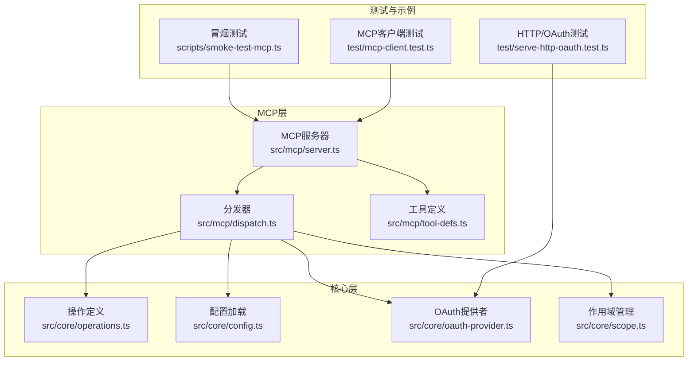
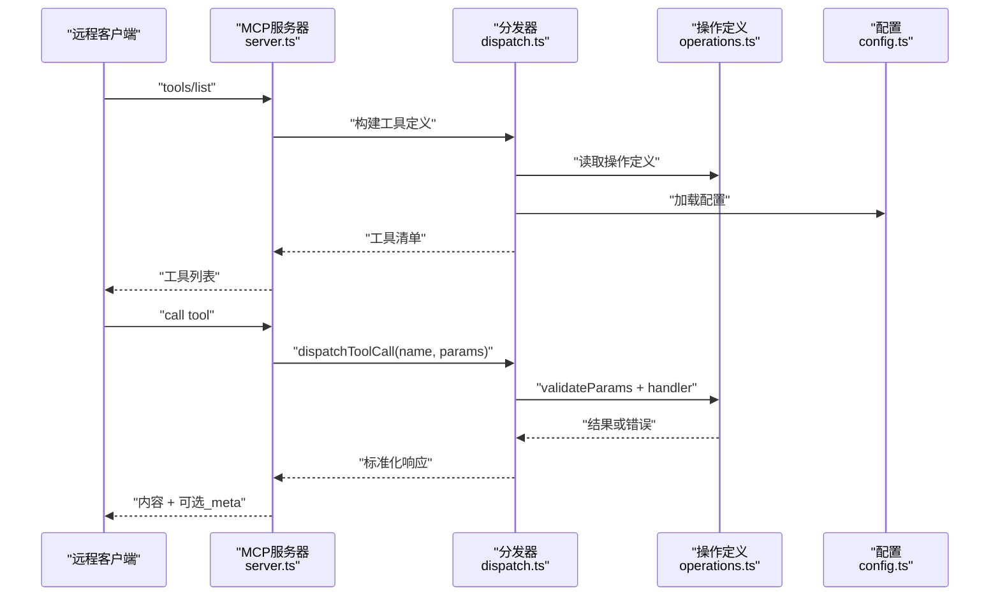
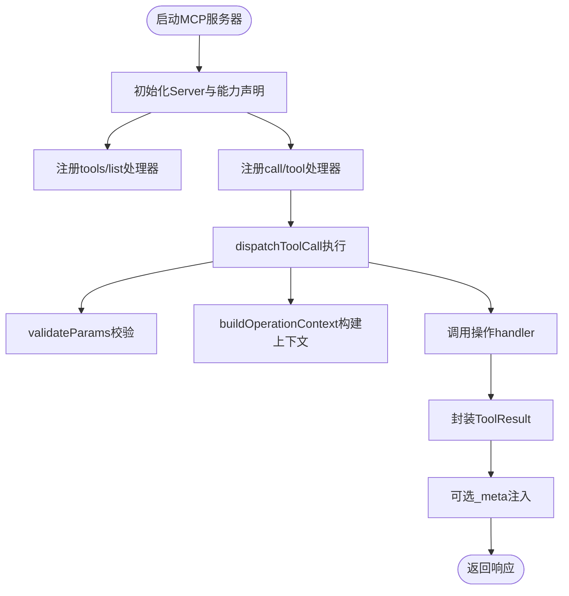
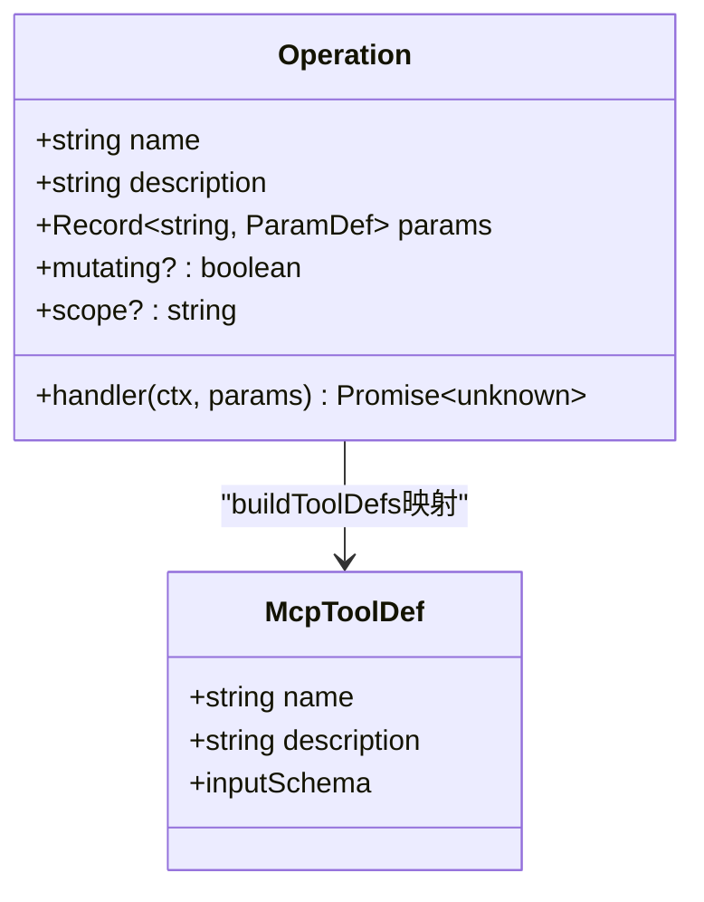
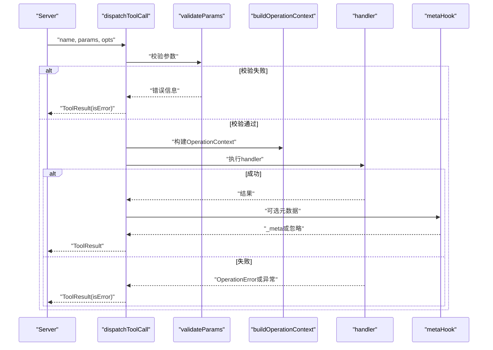
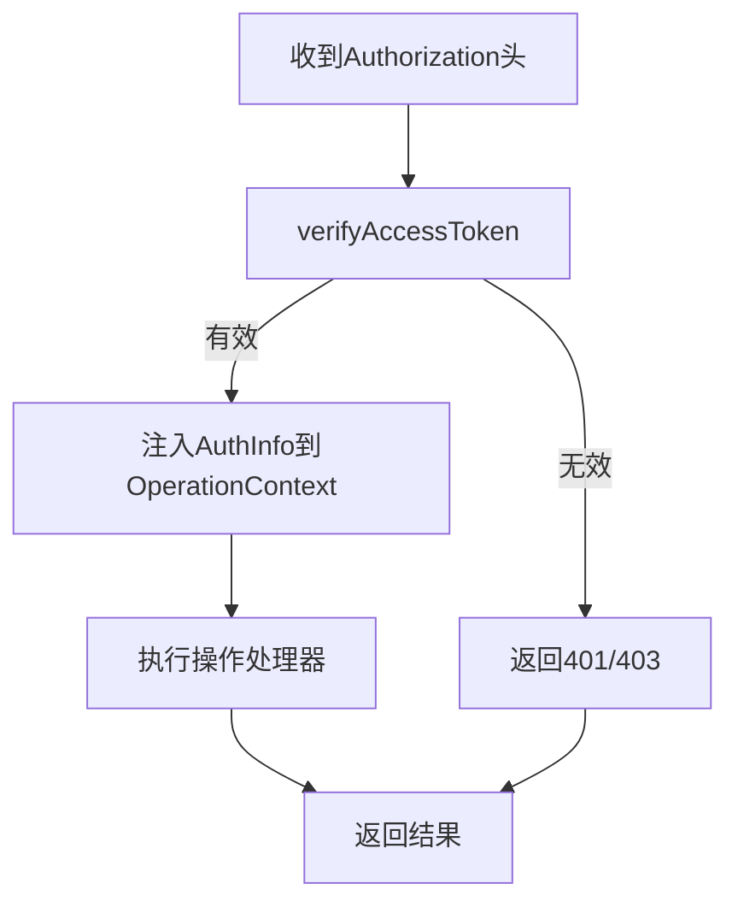
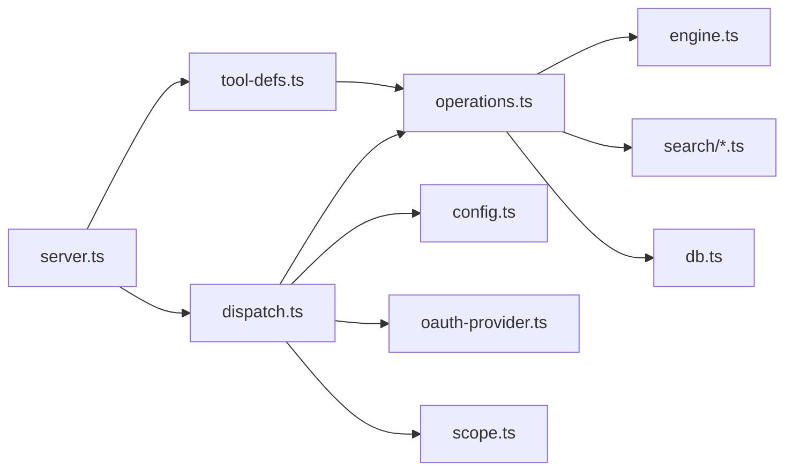

# MCP协议设计模式

<cite>
**本文档引用的文件**
- [server.ts](file://src/mcp/server.ts)
- [dispatch.ts](file://src/mcp/dispatch.ts)
- [tool-defs.ts](file://src/mcp/tool-defs.ts)
- [operations.ts](file://src/core/operations.ts)
- [config.ts](file://src/core/config.ts)
- [oauth-provider.ts](file://src/core/oauth-provider.ts)
- [scope.ts](file://src/core/scope.ts)
- [smoke-test-mcp.ts](file://scripts/smoke-test-mcp.ts)
- [mcp-client.test.ts](file://test/mcp-client.test.ts)
- [serve-http-oauth.test.ts](file://test/serve-http-oauth.test.ts)
</cite>

## 目录
1. [引言](#引言)
2. [项目结构](#项目结构)
3. [核心组件](#核心组件)
4. [架构总览](#架构总览)
5. [详细组件分析](#详细组件分析)
6. [依赖关系分析](#依赖关系分析)
7. [性能考虑](#性能考虑)
8. [故障排除指南](#故障排除指南)
9. [结论](#结论)
10. [附录](#附录)

## 引言
本文件系统性阐述GBrain的MCP（Model Context Protocol）协议设计与实现，覆盖MCP服务器、工具定义系统、消息分发机制、协议抽象层、工具注册与调用模式、认证与授权、远程客户端集成、工具接口规范以及错误处理策略，并提供扩展指南与性能优化建议。目标是帮助开发者在不深入源码细节的情况下，快速理解并正确使用与扩展MCP能力。

## 项目结构
MCP相关代码主要位于以下模块：
- 协议服务器：负责启动MCP服务、注册工具、处理请求与响应
- 分发器：统一处理参数校验、上下文构建、操作执行与结果格式化
- 工具定义：将操作定义转换为MCP工具清单
- 核心操作：所有可调用的操作集合及其参数定义与处理器
- 配置与认证：运行时配置加载、OAuth认证提供者与作用域管理
- 测试与示例：端到端测试与冒烟测试脚本

**图表来源**
- [server.ts:18-123](file://src/mcp/server.ts#L18-L123)
- [dispatch.ts:222-283](file://src/mcp/dispatch.ts#L222-L283)
- [tool-defs.ts:40-54](file://src/mcp/tool-defs.ts#L40-L54)
- [operations.ts:589-619](file://src/core/operations.ts#L589-L619)
- [config.ts:497-595](file://src/core/config.ts#L497-L595)
- [oauth-provider.ts:482-619](file://src/core/oauth-provider.ts#L482-L619)
- [scope.ts:25-86](file://src/core/scope.ts#L25-L86)
- [smoke-test-mcp.ts:1-97](file://scripts/smoke-test-mcp.ts#L1-L97)
- [mcp-client.test.ts:35-71](file://test/mcp-client.test.ts#L35-L71)
- [serve-http-oauth.test.ts:173-206](file://test/serve-http-oauth.test.ts#L173-L206)

**章节来源**
- [server.ts:18-123](file://src/mcp/server.ts#L18-L123)
- [dispatch.ts:1-284](file://src/mcp/dispatch.ts#L1-L284)
- [tool-defs.ts:1-55](file://src/mcp/tool-defs.ts#L1-L55)
- [operations.ts:589-619](file://src/core/operations.ts#L589-L619)
- [config.ts:1-800](file://src/core/config.ts#L1-L800)
- [oauth-provider.ts:482-619](file://src/core/oauth-provider.ts#L482-L619)
- [scope.ts:1-194](file://src/core/scope.ts#L1-L194)
- [smoke-test-mcp.ts:1-97](file://scripts/smoke-test-mcp.ts#L1-L97)
- [mcp-client.test.ts:35-71](file://test/mcp-client.test.ts#L35-L71)
- [serve-http-oauth.test.ts:173-206](file://test/serve-http-oauth.test.ts#L173-L206)

## 核心组件
- MCP服务器：基于SDK创建Server实例，注册工具列表与工具调用处理器；支持stdio传输；在PGLite脑上启用“检索反射”本地IPC以注入实体指针；优雅关闭与清理。
- 分发器：统一的工具调用分发逻辑，包含参数校验、上下文构建、错误包装、元数据注入（如热记忆）、日志摘要与隐私保护。
- 工具定义：将操作定义映射为MCP工具清单，确保stdio与HTTP路径共享同一套Schema。
- 操作定义：集中式操作契约，定义名称、描述、参数Schema、处理器、权限范围等；提供通用错误类型与范围解析工具。
- 配置与认证：加载文件/环境/数据库平面配置；OAuth提供者验证令牌并返回认证信息；作用域管理定义权限层级与检查逻辑。
- 冒烟测试与测试：验证工具调用链路、HTTP/OAuth行为与令牌有效性。

**章节来源**
- [server.ts:18-123](file://src/mcp/server.ts#L18-L123)
- [dispatch.ts:14-283](file://src/mcp/dispatch.ts#L14-L283)
- [tool-defs.ts:13-54](file://src/mcp/tool-defs.ts#L13-L54)
- [operations.ts:589-619](file://src/core/operations.ts#L589-L619)
- [config.ts:497-595](file://src/core/config.ts#L497-L595)
- [oauth-provider.ts:482-619](file://src/core/oauth-provider.ts#L482-L619)
- [scope.ts:25-86](file://src/core/scope.ts#L25-L86)
- [smoke-test-mcp.ts:1-97](file://scripts/smoke-test-mcp.ts#L1-L97)
- [mcp-client.test.ts:35-71](file://test/mcp-client.test.ts#L35-L71)
- [serve-http-oauth.test.ts:173-206](file://test/serve-http-oauth.test.ts#L173-L206)

## 架构总览
MCP服务器通过SDK建立连接，注册工具清单与调用处理器；分发器作为单一真相源，确保stdio与HTTP两种传输的一致性；操作定义提供统一的参数校验与处理器入口；认证与授权通过OAuth提供者与作用域管理实现；配置系统贯穿运行期决策。

**图表来源**
- [server.ts:27-55](file://src/mcp/server.ts#L27-L55)
- [dispatch.ts:222-283](file://src/mcp/dispatch.ts#L222-L283)
- [operations.ts:589-619](file://src/core/operations.ts#L589-L619)
- [config.ts:497-595](file://src/core/config.ts#L497-L595)

## 详细组件分析

### MCP服务器实现
- 初始化：创建Server实例，声明工具能力；注册ListTools与CallTool处理器。
- 工具列表：通过buildToolDefs从operations生成MCP工具清单。
- 工具调用：dispatchToolCall负责参数校验、上下文构建、执行与结果封装；默认remote=true，stdio MCP默认holder白名单为['world']；支持sourceId来源隔离。
- 传输与生命周期：StdioServerTransport连接；监听stdin EOF、transport关闭与信号，优雅退出并清理IPC资源。
- 检索反射：在PGLite脑上启动本地IPC服务器，向上下文引擎提供实体指针解析通道，失败不阻塞。

**图表来源**
- [server.ts:18-123](file://src/mcp/server.ts#L18-L123)
- [dispatch.ts:222-283](file://src/mcp/dispatch.ts#L222-L283)

**章节来源**
- [server.ts:18-123](file://src/mcp/server.ts#L18-L123)

### 工具定义系统
- 参数Schema映射：paramDefToSchema将ParamDef递归转为JSON Schema片段，保证stdio与HTTP路径一致性。
- 工具清单生成：buildToolDefs遍历operations，输出MCP工具定义数组，包含name、description与inputSchema（含required字段）。

**图表来源**
- [tool-defs.ts:3-54](file://src/mcp/tool-defs.ts#L3-L54)
- [operations.ts:589-619](file://src/core/operations.ts#L589-L619)

**章节来源**
- [tool-defs.ts:13-54](file://src/mcp/tool-defs.ts#L13-L54)
- [operations.ts:589-619](file://src/core/operations.ts#L589-L619)

### 消息分发机制
- 统一分发：dispatchToolCall作为唯一入口，处理未知工具、参数校验失败、操作异常与内部错误，统一返回ToolResult形状。
- 上下文构建：buildOperationContext注入engine、config、logger、dryRun、remote、takesHoldersAllowList、sourceId、auth等。
- 元数据注入：可选metaHook在成功后注入_meta（如热记忆），失败被吸收不影响主流程。
- 日志摘要：summarizeMcpParams对参数进行脱敏统计，避免敏感信息泄露。

**图表来源**
- [dispatch.ts:14-283](file://src/mcp/dispatch.ts#L14-L283)

**章节来源**
- [dispatch.ts:14-283](file://src/mcp/dispatch.ts#L14-L283)

### 协议抽象层设计
- 传输无关：stdio与HTTP共享同一套参数校验、上下文构建与错误格式化逻辑，避免差异导致的回归。
- Schema一致：工具定义通过paramDefToSchema生成，确保不同传输路径的Schema稳定。
- 结果契约：ToolResult统一为[{ type: 'text', text }]，便于客户端解析。

**章节来源**
- [dispatch.ts:1-284](file://src/mcp/dispatch.ts#L1-L284)
- [tool-defs.ts:13-54](file://src/mcp/tool-defs.ts#L13-L54)

### 工具注册与调用模式
- 注册：由operations驱动，每个Operation包含name、description、params与handler；通过buildToolDefs暴露给MCP客户端。
- 调用：CallTool请求携带name与arguments；分发器查找对应Operation，执行handler并返回标准化结果。
- 权限与范围：Operation可声明scope（read/write/admin/sources_admin/users_admin），结合OAuth作用域进行授权检查。

**章节来源**
- [operations.ts:589-619](file://src/core/operations.ts#L589-L619)
- [server.ts:27-55](file://src/mcp/server.ts#L27-L55)

### 认证与授权机制
- OAuth提供者：验证访问令牌、颁发令牌、刷新令牌、撤销令牌；严格区分过期与无效令牌，抛出InvalidTokenError以确保SDK正确处理。
- 作用域管理：定义ALLOWED_SCOPES与层次关系，hasScope判断授予范围是否满足所需；normalizeScopesInput规范化输入。
- 认证信息传递：HTTP传输将AuthInfo注入OperationContext，供whoami等操作使用；stdio MCP默认remote=true并设置holder白名单。

**图表来源**
- [oauth-provider.ts:482-619](file://src/core/oauth-provider.ts#L482-L619)
- [scope.ts:25-86](file://src/core/scope.ts#L25-L86)
- [dispatch.ts:30-73](file://src/mcp/dispatch.ts#L30-L73)

**章节来源**
- [oauth-provider.ts:482-619](file://src/core/oauth-provider.ts#L482-L619)
- [scope.ts:25-86](file://src/core/scope.ts#L25-L86)
- [dispatch.ts:30-73](file://src/mcp/dispatch.ts#L30-L73)

### 远程客户端集成
- thin-client模式：配置remote_mcp后，CLI会拒绝直接访问本地DB的子命令，强制通过远程MCP。
- OAuth发现：HTTP MCP端点配合OAuth授权服务器元数据，支持标准令牌交换。
- 端到端测试：mcp-client.test.ts模拟OAuth授权服务器与MCP调用，serve-http-oauth.test.ts验证401/403场景。

**章节来源**
- [config.ts:288-293](file://src/core/config.ts#L288-L293)
- [mcp-client.test.ts:35-71](file://test/mcp-client.test.ts#L35-L71)
- [serve-http-oauth.test.ts:173-206](file://test/serve-http-oauth.test.ts#L173-L206)

### 工具接口规范
- 参数Schema：ParamDef定义type、required、description、enum、default、items等；paramDefToSchema生成JSON Schema。
- 返回格式：ToolResult.content为文本数组，可选isError与_meta；错误统一为JSON可解析格式。
- 错误码：OperationError包含code、message、suggestion、docs，便于客户端处理。

**章节来源**
- [tool-defs.ts:13-38](file://src/mcp/tool-defs.ts#L13-L38)
- [dispatch.ts:14-28](file://src/mcp/dispatch.ts#L14-L28)
- [operations.ts:75-94](file://src/core/operations.ts#L75-L94)

### 错误处理策略
- 工具未知：返回ToolResult(isError)，content包含error与message。
- 参数校验失败：返回ToolResult(isError)，content包含invalid_params与具体错误。
- 操作异常：若为OperationError，序列化为JSON；否则包装为internal_error。
- 元数据注入失败：捕获并降级为无_meta，不影响主流程。

**章节来源**
- [dispatch.ts:222-283](file://src/mcp/dispatch.ts#L222-L283)

## 依赖关系分析
- server依赖dispatch、tool-defs、operations、config、meta-hook与IPC工具。
- dispatch依赖operations、config与AuthInfo。
- tool-defs依赖operations。
- operations依赖engine、search、db、config等核心模块。
- oauth-provider与scope共同构成认证与授权基础。

**图表来源**
- [server.ts:1-16](file://src/mcp/server.ts#L1-L16)
- [dispatch.ts:9-12](file://src/mcp/dispatch.ts#L9-L12)
- [tool-defs.ts](file://src/mcp/tool-defs.ts#L1)
- [operations.ts:1-31](file://src/core/operations.ts#L1-L31)

**章节来源**
- [server.ts:1-16](file://src/mcp/server.ts#L1-L16)
- [dispatch.ts:9-12](file://src/mcp/dispatch.ts#L9-L12)
- [tool-defs.ts](file://src/mcp/tool-defs.ts#L1)
- [operations.ts:1-31](file://src/core/operations.ts#L1-L31)

## 性能考虑
- 传输一致性：统一分发器减少重复校验与上下文构建开销，避免路径漂移。
- 元数据注入：_meta为best-effort，失败不阻塞主流程，降低额外查询成本。
- 日志摘要：对参数进行脱敏与桶化计数，避免大payload写入日志带来的I/O与隐私风险。
- IPC反射：仅在PGLite脑且配置允许时启用，失败不阻塞主服务，降低部署复杂度。

[本节为通用指导，无需特定文件来源]

## 故障排除指南
- 工具未找到：确认工具名拼写与operations中定义一致；检查工具清单生成逻辑。
- 参数校验失败：核对ParamDef定义与调用参数类型；关注required字段缺失。
- 认证失败：检查Authorization头、令牌有效性与作用域；查看OAuth提供者的错误类型。
- 远程客户端问题：确认remote_mcp配置与薄客户端模式；验证OAuth发现端点与令牌端点可达。
- 优雅关闭：stdio MCP在stdin EOF、transport关闭与信号触发时退出；检查进程状态与IPC清理。

**章节来源**
- [dispatch.ts:222-283](file://src/mcp/dispatch.ts#L222-L283)
- [oauth-provider.ts:482-619](file://src/core/oauth-provider.ts#L482-L619)
- [config.ts:288-293](file://src/core/config.ts#L288-L293)
- [server.ts:95-123](file://src/mcp/server.ts#L95-L123)

## 结论
GBRain的MCP实现以统一分发器为核心，确保stdio与HTTP传输的一致性与安全性；通过集中式操作定义与严格的参数Schema，提供清晰的工具接口；借助OAuth与作用域管理实现细粒度的认证与授权；配置系统贯穿运行期决策，支持多种部署形态。该设计既满足当前需求，也为后续扩展提供了稳固的抽象层与清晰的边界。

## 附录

### 扩展指南
- 自定义工具开发
  - 在operations中新增Operation，定义name、description、params与handler。
  - 如需CLI别名或位置参数提示，在cliHints中配置。
  - 若涉及写操作，设置mutating并声明scope（read/write/admin等）。
- 协议适配
  - 保持参数Schema与dispatch逻辑一致；如需新增元数据，通过metaHook注入并在ToolResult._meta中呈现。
  - 对于新传输路径，复用dispatchToolCall与validateParams，确保错误格式统一。
- 性能优化建议
  - 减少不必要的元数据查询，优先使用best-effort策略。
  - 合理使用日志摘要与桶化计数，避免大payload进入日志。
  - 在PGLite脑上按需启用检索反射，避免不必要的IPC开销。

**章节来源**
- [operations.ts:589-619](file://src/core/operations.ts#L589-L619)
- [dispatch.ts:14-283](file://src/mcp/dispatch.ts#L14-L283)
- [tool-defs.ts:13-54](file://src/mcp/tool-defs.ts#L13-L54)

### 冒烟测试参考
- 使用scripts/smoke-test-mcp.ts验证基本工具调用链路，包括get_stats、put_page、get_page、dry_run、search、list_pages、add_tag、get_tags与delete_page。
- 通过DATABASE_URL指向真实数据库，确保端到端可用性。

**章节来源**
- [smoke-test-mcp.ts:1-97](file://scripts/smoke-test-mcp.ts#L1-L97)