# 契约优先设计模式

<cite>
**本文档引用的文件**
- [operations.ts](file://src/core/operations.ts)
- [cli.ts](file://src/cli.ts)
- [tool-defs.ts](file://src/mcp/tool-defs.ts)
- [dispatch.ts](file://src/mcp/dispatch.ts)
- [operations-descriptions.ts](file://src/core/operations-descriptions.ts)
- [operations-descriptions.test.ts](file://test/operations-descriptions.test.ts)
- [parity.test.ts](file://test/parity.test.ts)
- [operations-trust-boundary.test.ts](file://test/operations-trust-boundary.test.ts)
</cite>

## 目录
1. [引言](#引言)
2. [项目结构](#项目结构)
3. [核心组件](#核心组件)
4. [架构概览](#架构概览)
5. [详细组件分析](#详细组件分析)
6. [依赖关系分析](#依赖关系分析)
7. [性能考虑](#性能考虑)
8. [故障排除指南](#故障排除指南)
9. [结论](#结论)

## 引言

GBrain项目采用契约优先（Contract-first）设计模式，通过在operations.ts中定义统一的操作契约来确保CLI、MCP和工具系统的类型安全性和一致性。这种设计模式的核心思想是将操作的契约定义作为单一真实来源，所有客户端和传输层都基于这些契约进行交互。

契约优先设计模式的主要优势包括：
- **类型安全**：通过TypeScript接口确保编译时类型检查
- **向后兼容**：通过开放联合类型支持未来扩展
- **统一接口**：CLI、MCP和工具系统共享相同的契约定义
- **可测试性**：通过严格的契约约束确保行为的一致性

## 项目结构

GBRain项目围绕契约优先设计模式构建了完整的操作系统架构：

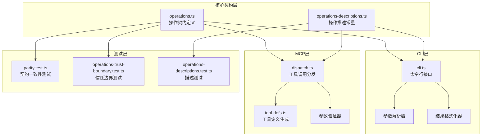

**图表来源**
- [operations.ts:1-800](file://src/core/operations.ts#L1-L800)
- [cli.ts:730-929](file://src/cli.ts#L730-L929)
- [dispatch.ts:1-284](file://src/mcp/dispatch.ts#L1-L284)
- [tool-defs.ts:1-55](file://src/mcp/tool-defs.ts#L1-L55)

**章节来源**
- [operations.ts:1-800](file://src/core/operations.ts#L1-L800)
- [cli.ts:730-929](file://src/cli.ts#L730-L929)
- [dispatch.ts:1-284](file://src/mcp/dispatch.ts#L1-L284)

## 核心组件

### 操作契约定义

操作契约是整个系统的核心，定义了所有可用操作的标准格式和约束条件。

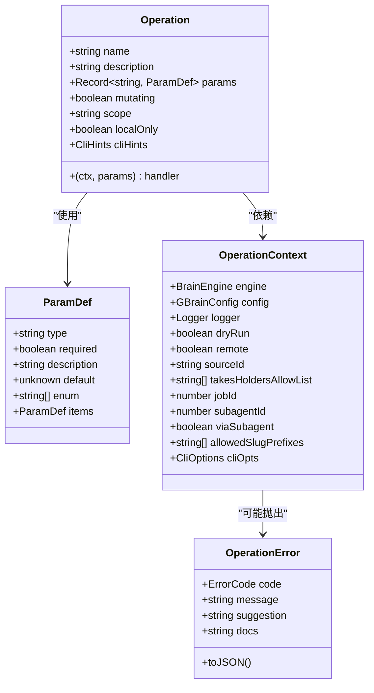

**图表来源**
- [operations.ts:216-620](file://src/core/operations.ts#L216-L620)
- [operations.ts:75-94](file://src/core/operations.ts#L75-L94)

### 错误处理系统

GBRain实现了完整的错误处理机制，通过OperationError类提供标准化的错误响应格式。

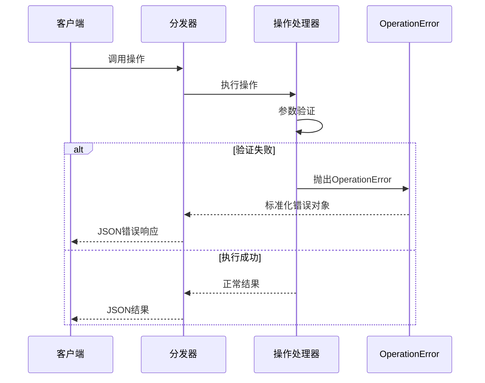

**图表来源**
- [dispatch.ts:222-283](file://src/mcp/dispatch.ts#L222-L283)
- [operations.ts:75-94](file://src/core/operations.ts#L75-L94)

**章节来源**
- [operations.ts:216-620](file://src/core/operations.ts#L216-L620)
- [operations.ts:75-94](file://src/core/operations.ts#L75-L94)
- [dispatch.ts:222-283](file://src/mcp/dispatch.ts#L222-L283)

## 架构概览

GBRain的契约优先架构通过以下层次实现：

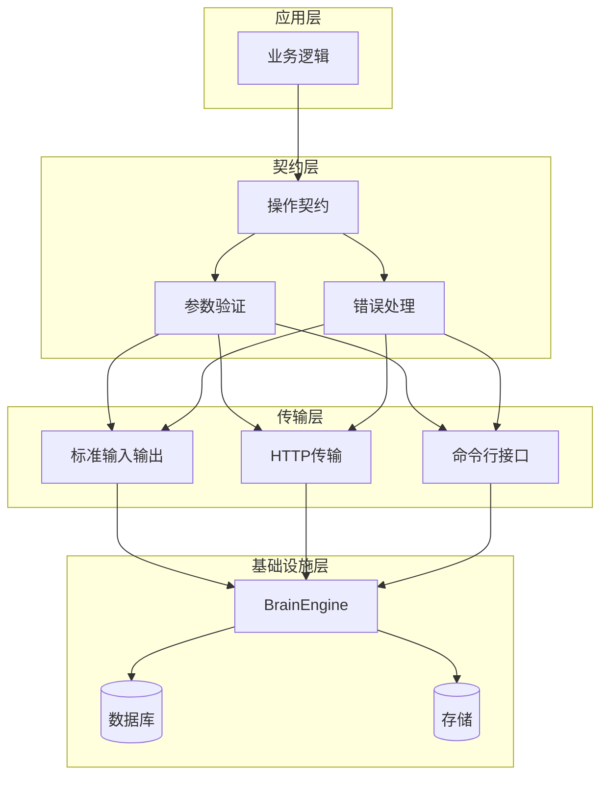

**图表来源**
- [operations.ts:1-800](file://src/core/operations.ts#L1-L800)
- [dispatch.ts:1-284](file://src/mcp/dispatch.ts#L1-L284)
- [cli.ts:730-929](file://src/cli.ts#L730-L929)

## 详细组件分析

### 参数验证系统

GBRain的参数验证系统提供了多层次的安全保障：

#### 类型安全验证
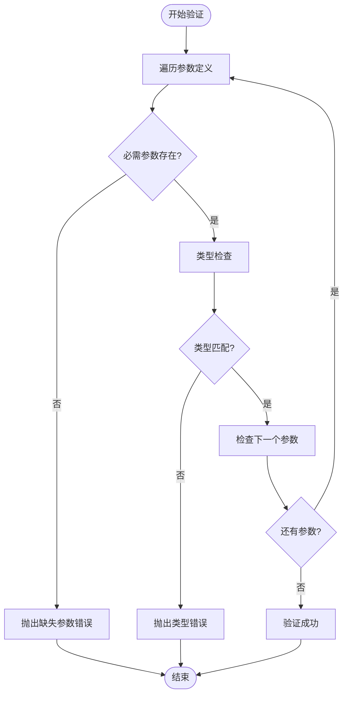

**图表来源**
- [dispatch.ts:170-187](file://src/mcp/dispatch.ts#L170-L187)

#### 文件上传安全验证
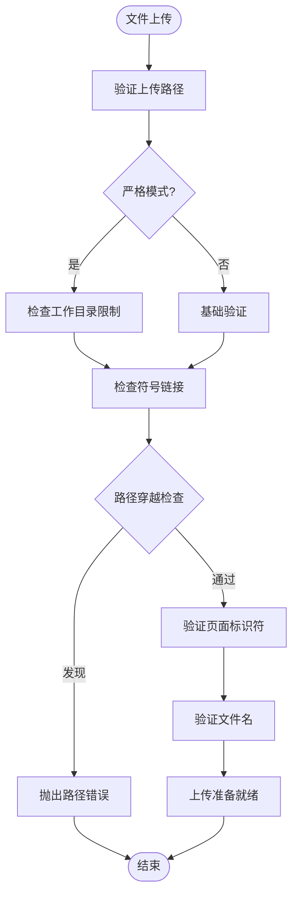

**图表来源**
- [operations.ts:114-149](file://src/core/operations.ts#L114-L149)
- [operations.ts:2656-2737](file://src/core/operations.ts#L2656-L2737)

**章节来源**
- [dispatch.ts:170-187](file://src/mcp/dispatch.ts#L170-L187)
- [operations.ts:114-149](file://src/core/operations.ts#L114-L149)
- [operations.ts:2656-2737](file://src/core/operations.ts#L2656-L2737)

### 操作描述规范

GBRain为每个操作提供了详细的描述规范，确保LLM能够正确理解和路由操作请求。

#### 描述分类体系
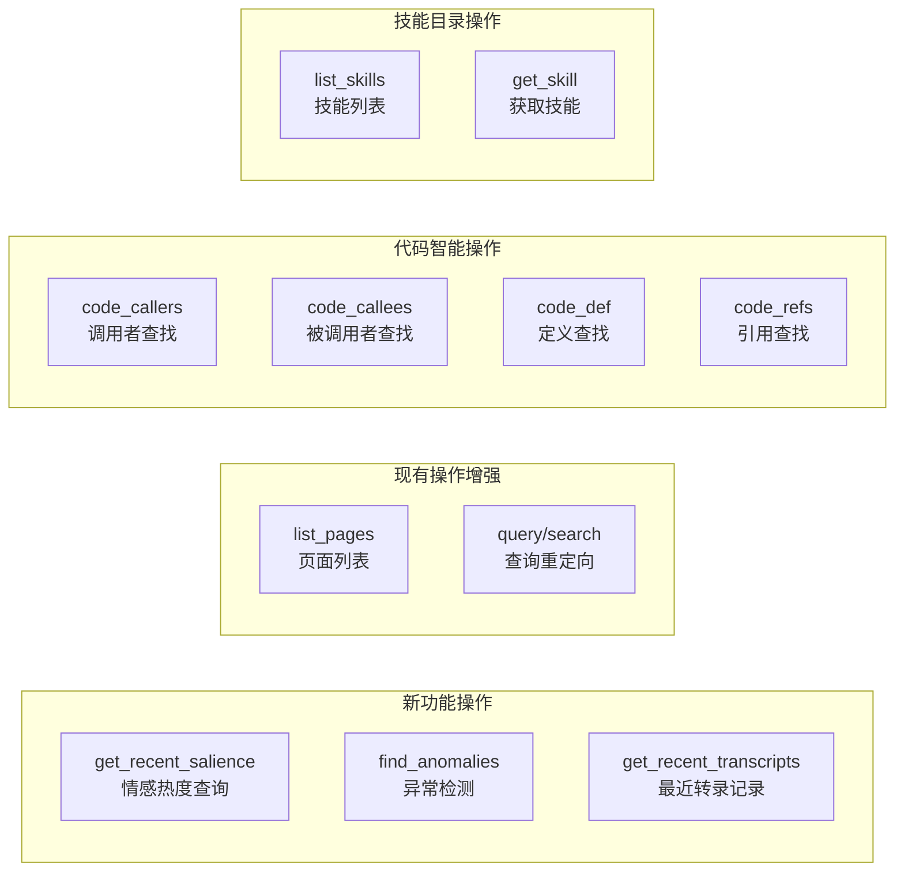

**图表来源**
- [operations-descriptions.ts:21-225](file://src/core/operations-descriptions.ts#L21-L225)

**章节来源**
- [operations-descriptions.ts:21-225](file://src/core/operations-descriptions.ts#L21-L225)
- [operations-descriptions.test.ts:1-190](file://test/operations-descriptions.test.ts#L1-L190)

### 操作注册表模式

GBRain实现了统一的操作注册表，确保所有操作的一致性和可发现性。

#### 注册表结构
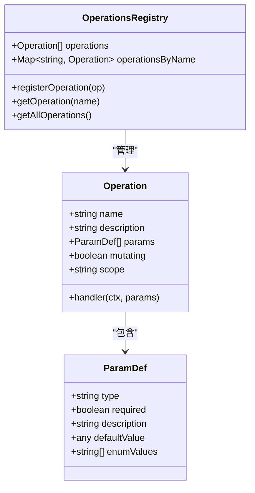

**图表来源**
- [operations.ts:589-620](file://src/core/operations.ts#L589-L620)

**章节来源**
- [operations.ts:589-620](file://src/core/operations.ts#L589-L620)

### CLI/MCP工具统一接口设计

GBRain通过工具定义生成器实现了CLI和MCP工具的统一接口设计。

#### 工具定义转换流程
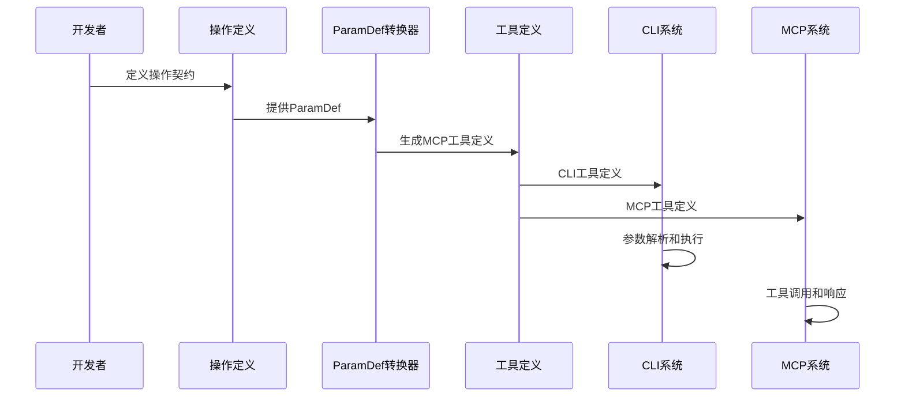

**图表来源**
- [tool-defs.ts:30-55](file://src/mcp/tool-defs.ts#L30-L55)
- [cli.ts:739-782](file://src/cli.ts#L739-L782)

**章节来源**
- [tool-defs.ts:30-55](file://src/mcp/tool-defs.ts#L30-L55)
- [cli.ts:739-782](file://src/cli.ts#L739-L782)

### 向后兼容性保证机制

GBRain通过开放联合类型和严格的契约约束确保向后兼容性。

#### 错误代码开放联合类型
```mermaid
graph TD
subgraph "错误代码类型系统"
OPEN[string & {}<br/>开放联合类型]
FIXED[预定义错误代码<br/>page_not_found, invalid_params, 等]
COMPAT[向前兼容性<br/>支持未来扩展]
end
subgraph "版本演进"
V028[0.28.1: unknown_transport]
V031[0.31: rate_limited, extraction_failed, fact_not_found]
FUTURE[未来版本: 新增错误代码]
end
OPEN --> FIXED
FIXED --> COMPAT
COMPAT --> FUTURE
V028 --> V031
V031 --> FUTURE
```

**图表来源**
- [operations.ts:60-74](file://src/core/operations.ts#L60-L74)

**章节来源**
- [operations.ts:60-74](file://src/core/operations.ts#L60-L74)

## 依赖关系分析

### 组件耦合度分析

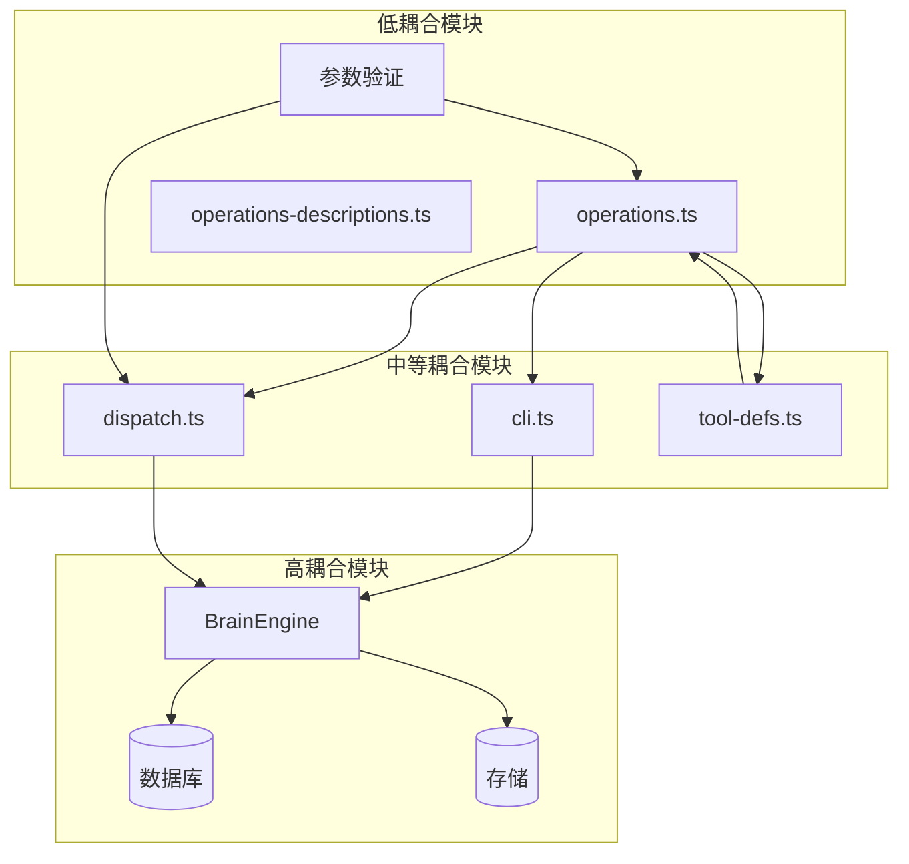

**图表来源**
- [operations.ts:1-800](file://src/core/operations.ts#L1-L800)
- [cli.ts:730-929](file://src/cli.ts#L730-L929)
- [dispatch.ts:1-284](file://src/mcp/dispatch.ts#L1-L284)

### 关键依赖链

GBRain的关键依赖关系确保了系统的稳定性和可维护性：

1. **operations.ts** 是所有其他模块的基础依赖
2. **operations-descriptions.ts** 为UI和LLM提供操作描述
3. **dispatch.ts** 和 **cli.ts** 分别处理MCP和CLI入口点
4. **tool-defs.ts** 提供工具定义转换功能

**章节来源**
- [operations.ts:1-800](file://src/core/operations.ts#L1-L800)
- [cli.ts:730-929](file://src/cli.ts#L730-L929)
- [dispatch.ts:1-284](file://src/mcp/dispatch.ts#L1-L284)

## 性能考虑

### 类型安全的性能影响

契约优先设计模式在编译时进行类型检查，运行时几乎无额外开销：

- **编译时检查**：TypeScript编译器在构建阶段进行类型验证
- **运行时验证**：仅在必要时进行参数验证和错误处理
- **缓存策略**：操作描述和工具定义在内存中缓存复用

### 内存优化

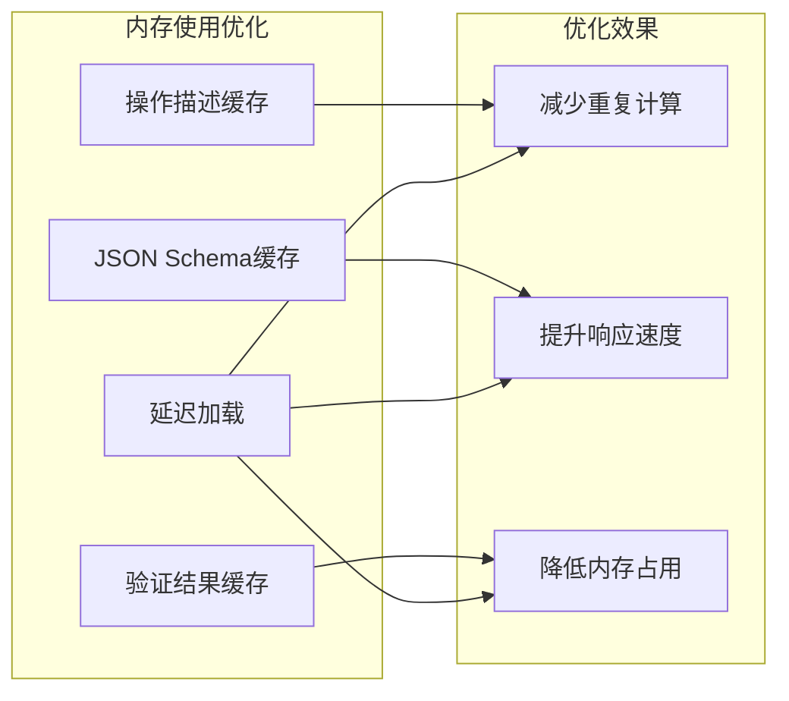

## 故障排除指南

### 常见问题诊断

#### 参数验证失败
当操作调用失败时，首先检查参数验证错误：

1. **缺失必需参数**：确认所有required字段都已提供
2. **类型不匹配**：检查参数类型是否符合ParamDef定义
3. **范围限制**：验证枚举值和数值范围

#### 权限和作用域问题
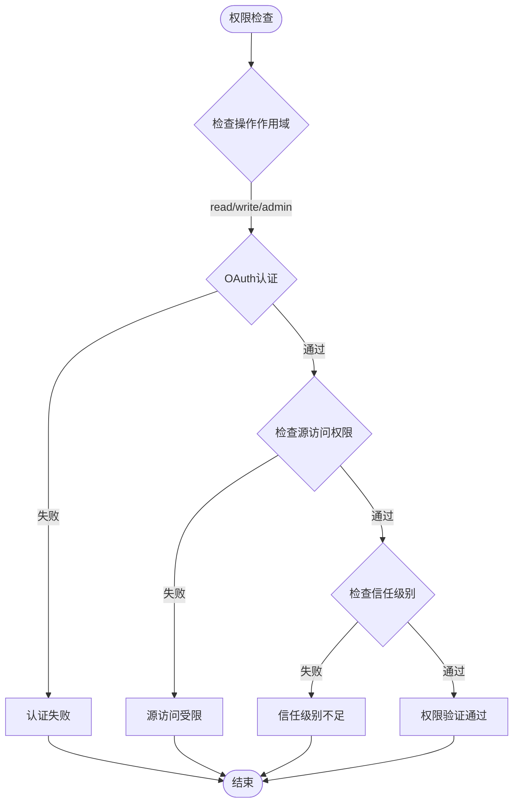

**图表来源**
- [operations.ts:397-426](file://src/core/operations.ts#L397-L426)
- [operations.ts:473-494](file://src/core/operations.ts#L473-L494)

#### 错误处理最佳实践
- 使用OperationError提供标准化错误响应
- 在MCP和CLI中保持一致的错误格式
- 记录详细的错误上下文用于调试

**章节来源**
- [operations.ts:397-426](file://src/core/operations.ts#L397-L426)
- [operations.ts:473-494](file://src/core/operations.ts#L473-L494)

## 结论

GBRain的契约优先设计模式通过在operations.ts中定义统一的操作契约，成功实现了CLI、MCP和工具系统的类型安全性和一致性。该设计模式的主要优势包括：

1. **类型安全**：通过严格的TypeScript接口确保编译时类型检查
2. **向后兼容**：通过开放联合类型支持未来的功能扩展
3. **统一接口**：CLI、MCP和工具系统共享相同的契约定义
4. **可测试性**：通过明确的契约约束确保行为的一致性和可预测性
5. **安全性**：多层验证和权限控制确保系统的安全运行

这种设计模式为大型复杂系统的开发提供了坚实的基础，使得团队可以专注于业务逻辑的实现，而不必担心接口不一致或类型安全问题。通过持续的测试和验证，GBRain确保了契约的完整性和系统的稳定性。