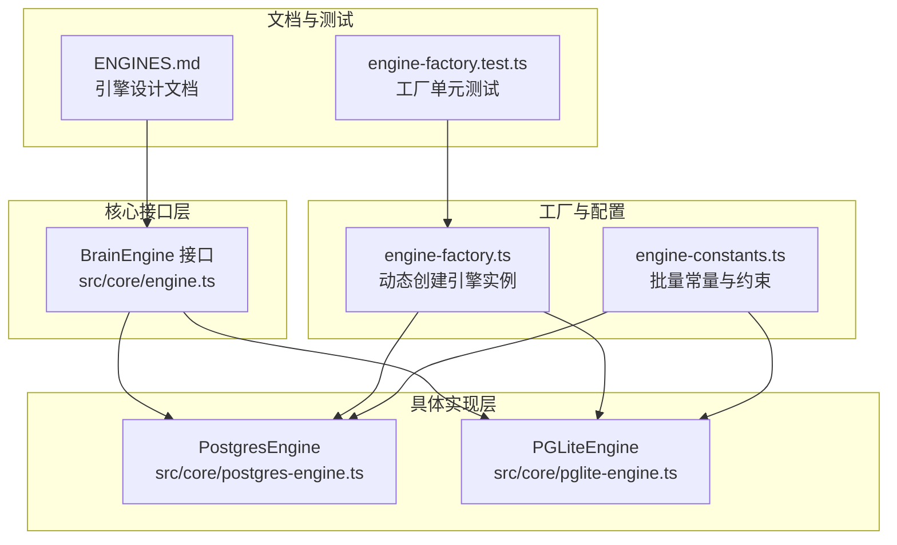
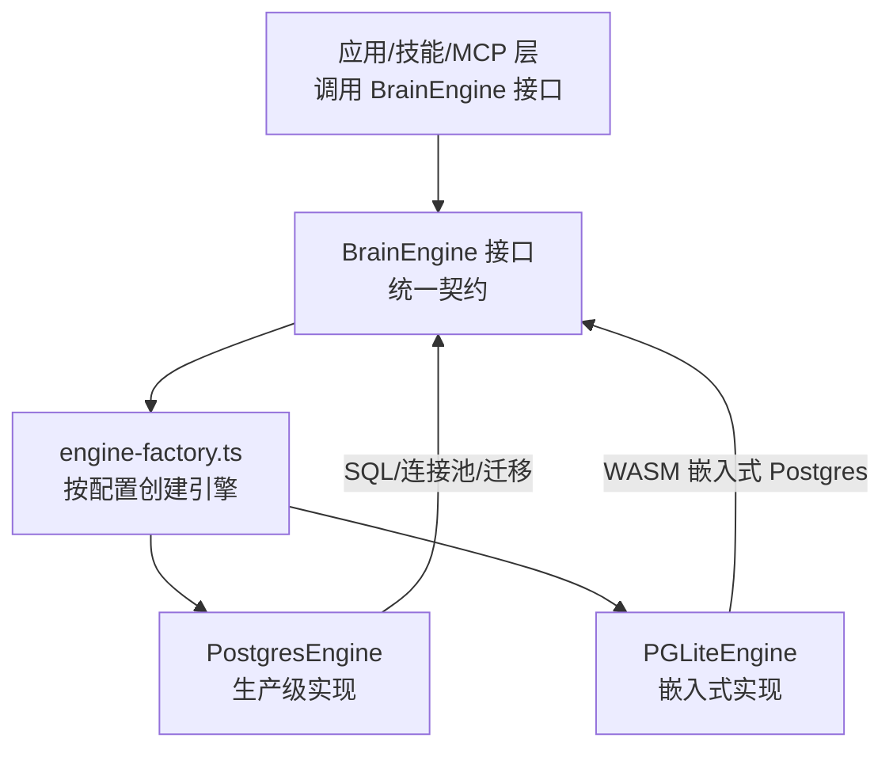
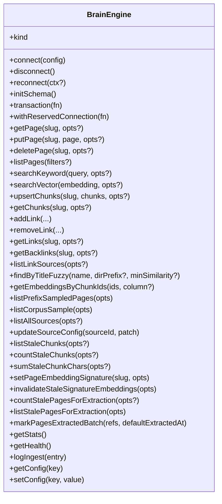
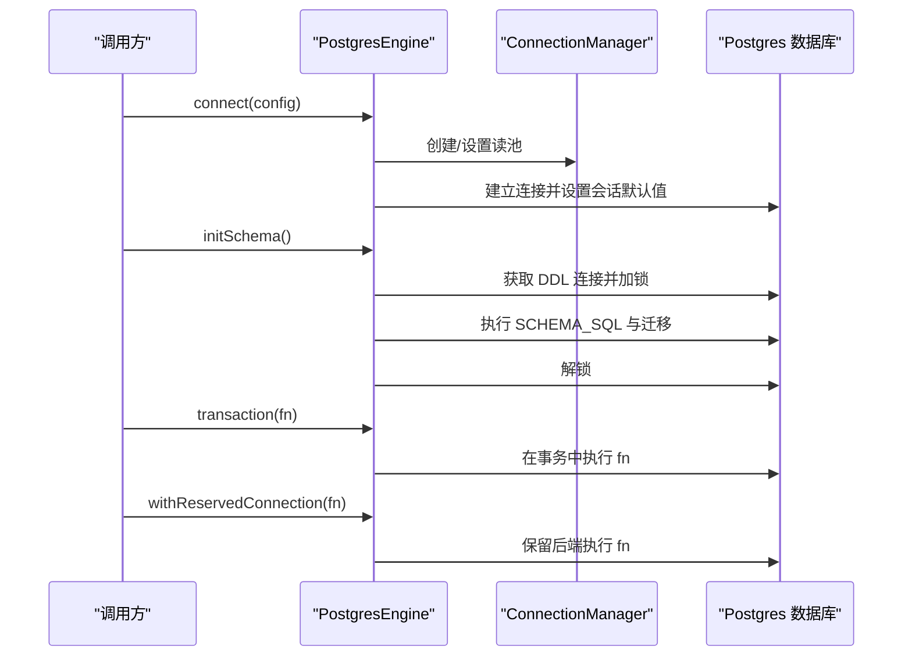
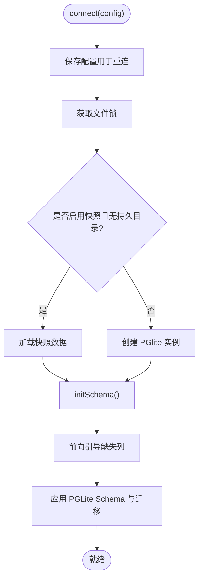
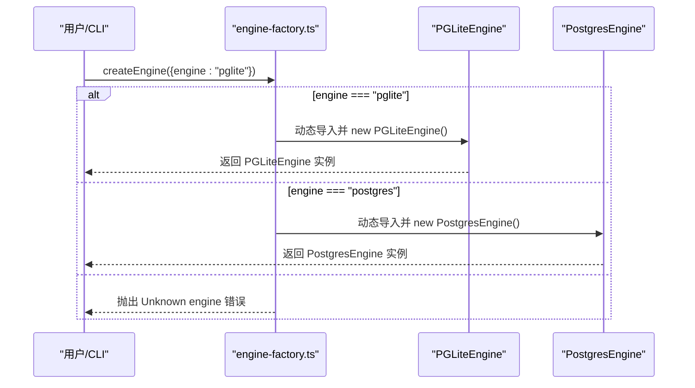
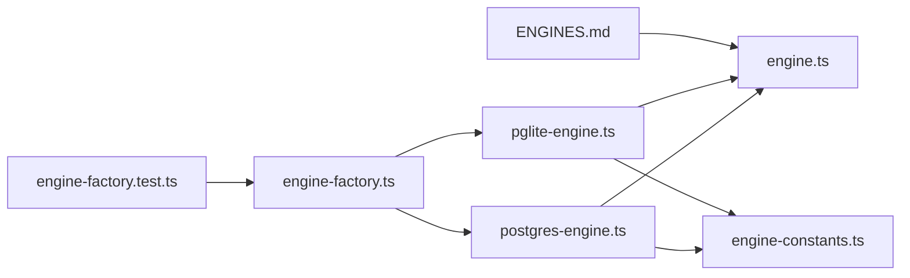

# 引擎接口设计模式

<cite>
**本文档引用的文件**
- [engine.ts](file://src/core/engine.ts)
- [engine-factory.ts](file://src/core/engine-factory.ts)
- [pglite-engine.ts](file://src/core/pglite-engine.ts)
- [postgres-engine.ts](file://src/core/postgres-engine.ts)
- [engine-constants.ts](file://src/core/engine-constants.ts)
- [ENGINES.md](file://docs/ENGINES.md)
- [engine-factory.test.ts](file://test/engine-factory.test.ts)
</cite>

## 目录
1. [引言](#引言)
2. [项目结构](#项目结构)
3. [核心组件](#核心组件)
4. [架构总览](#架构总览)
5. [详细组件分析](#详细组件分析)
6. [依赖关系分析](#依赖关系分析)
7. [性能考量](#性能考量)
8. [故障排除指南](#故障排除指南)
9. [结论](#结论)
10. [附录](#附录)

## 引言

本文件系统性阐述 GBrain 引擎接口设计模式，重点解析 BrainEngine 接口抽象理念与实现方式，对比 PostgresEngine 与 PGLiteEngine 两种实现，并深入分析接口分离策略、数据库抽象层设计、引擎切换机制、工厂模式、依赖注入与配置管理。同时提供引擎扩展指南，涵盖新数据库后端适配方法与性能优化策略。

## 项目结构

GBrain 将“业务能力”与“存储实现”解耦：所有操作通过统一的 BrainEngine 接口完成，具体存储由 PostgresEngine 或 PGLiteEngine 提供。这种设计使得在不改变上层逻辑的前提下，可自由切换不同后端（如从本地嵌入式 PGLite 切换到生产级 Postgres）。

**图表来源**
- [engine.ts](file://src/core/engine.ts)
- [engine-factory.ts](file://src/core/engine-factory.ts)
- [pglite-engine.ts](file://src/core/pglite-engine.ts)
- [postgres-engine.ts](file://src/core/postgres-engine.ts)
- [engine-constants.ts](file://src/core/engine-constants.ts)
- [ENGINES.md](file://docs/ENGINES.md)
- [engine-factory.test.ts](file://test/engine-factory.test.ts)

**章节来源**
- [engine.ts](file://src/core/engine.ts)
- [engine-factory.ts](file://src/core/engine-factory.ts)
- [ENGINES.md](file://docs/ENGINES.md)

## 核心组件

- BrainEngine 接口：定义统一的数据访问与操作契约，覆盖生命周期、页面 CRUD、搜索、分块、链接、时间线、统计健康等能力。接口中包含 kind 字段用于区分引擎类型，避免 instanceof 动态导入分支。
- PostgresEngine：基于 postgres 客户端与连接池，支持事务、连接管理、迁移验证、索引清理等企业级特性。
- PGLiteEngine：基于 @electric-sql/pglite 的嵌入式 Postgres 运行时，零配置、单机可用，提供与 Postgres 相同的 SQL 能力。
- engine-factory：根据配置动态选择并实例化引擎，确保按需加载，避免不必要的依赖。
- engine-constants：集中管理批量操作的边界常量，保证跨引擎一致性。

**章节来源**
- [engine.ts](file://src/core/engine.ts)
- [engine-factory.ts](file://src/core/engine-factory.ts)
- [pglite-engine.ts](file://src/core/pglite-engine.ts)
- [postgres-engine.ts](file://src/core/postgres-engine.ts)
- [engine-constants.ts](file://src/core/engine-constants.ts)

## 架构总览

下图展示引擎接口设计如何实现“业务不变、存储可插拔”的目标：

**图表来源**
- [engine.ts](file://src/core/engine.ts)
- [engine-factory.ts](file://src/core/engine-factory.ts)
- [postgres-engine.ts](file://src/core/postgres-engine.ts)
- [pglite-engine.ts](file://src/core/pglite-engine.ts)

## 详细组件分析

### BrainEngine 接口抽象

- 设计理念
  - 统一数据模型：以 slug 为键而非内部 ID，屏蔽底层存储差异。
  - 搜索结果标准化：无论关键词还是向量搜索，返回统一的 SearchResult[]，上层融合与去重逻辑保持一致。
  - 能力边界清晰：接口仅包含存储相关能力，嵌入生成与分块逻辑位于独立模块，避免“存储即 AI”的耦合。
- 关键能力域
  - 生命周期：connect/disconnect/reconnect/initSchema/transaction/withReservedConnection
  - 页面：CRUD、软删除、批量删除、路径解析、枚举全源
  - 搜索：关键词与向量双通道，支持动态嵌入列
  - 分块：UPSERT、查询、过期检测、游标扫描
  - 链接：批量插入、删除、反链、来源统计、模糊标题匹配
  - 时间线、原始数据、版本、统计健康、摄取日志、配置管理等

**图表来源**
- [engine.ts](file://src/core/engine.ts)

**章节来源**
- [engine.ts](file://src/core/engine.ts)

### PostgresEngine 实现

- 连接与池化
  - 支持实例级连接池与模块级单例两种路径；实例池用于工作进程隔离，模块单例兼容 CLI 主流程。
  - 使用 ConnectionManager 管理读写路由、杀开关联状态与直接池共享。
- 初始化与迁移
  - initSchema 通过独占 advisory lock 执行 DDL，随后自动运行迁移并进行 schema 自愈与僵尸索引清理。
  - 前向引导（forward-reference bootstrap）确保旧脑 schema 缺失列也能顺利执行 SCHEMA_SQL。
- 事务与保留连接
  - transaction 提供 ACID 语义；withReservedConnection 返回专用连接（Postgres 保留后端，PGLite 透传）。
- 批量与重试
  - 多处批量操作采用 withRetry 包裹，避免重复包装导致的二次重试放大。

**图表来源**
- [postgres-engine.ts](file://src/core/postgres-engine.ts)

**章节来源**
- [postgres-engine.ts](file://src/core/postgres-engine.ts)

### PGLiteEngine 实现

- 嵌入式运行时
  - 使用 @electric-sql/pglite，支持 WASM 运行时，提供与 Postgres 相同的 SQL 能力（pgvector、pg_trgm、触发器、索引等）。
  - 支持快照（Tier 3）加速初始化，基于迁移哈希校验版本一致性。
- 文件锁与并发
  - 通过文件锁防止多进程并发访问导致崩溃；断开连接时先置空句柄再释放锁，避免竞态。
- 初始化与迁移
  - initSchema 先执行前向引导，再应用 PGLite 特定 schema 与迁移；支持快照加载跳过 schema replay。
- 错误分类与提示
  - 对 PGLite 初始化失败进行分类（如 Bun VFS 只读、macOS 26.3 WASM 问题），给出针对性修复建议。

**图表来源**
- [pglite-engine.ts](file://src/core/pglite-engine.ts)

**章节来源**
- [pglite-engine.ts](file://src/core/pglite-engine.ts)

### 引擎工厂模式与配置管理

- 工厂函数 createEngine
  - 根据配置中的 engine 字段动态导入并实例化对应引擎；默认 postgres。
  - 对未知引擎抛出明确错误，对已废弃 sqlite 给出替代建议。
- 配置与环境
  - PostgresEngine 支持池大小、准备语句、会话超时等参数解析；PGLiteEngine 支持快照路径与数据目录。
  - 测试覆盖了默认行为与错误场景，确保工厂行为稳定。

**图表来源**
- [engine-factory.ts](file://src/core/engine-factory.ts)

**章节来源**
- [engine-factory.ts](file://src/core/engine-factory.ts)
- [engine-factory.test.ts](file://test/engine-factory.test.ts)

### 接口分离策略与数据库抽象层

- 抽象层次
  - 接口层（BrainEngine）：定义能力契约，屏蔽实现细节。
  - 实现层（PostgresEngine/PGLiteEngine）：各自封装连接、迁移、索引、事务等实现。
  - 工厂层（engine-factory.ts）：按配置选择实现，避免硬编码依赖。
- 数据抽象
  - 统一数据模型（Page/Chunk/Link/SearchResult 等）与查询结果格式，确保上层逻辑与存储无关。
  - 批量常量（DELETE_BATCH_SIZE）集中管理，避免跨引擎漂移。

**章节来源**
- [engine.ts](file://src/core/engine.ts)
- [engine-constants.ts](file://src/core/engine-constants.ts)

### 引擎切换机制

- 运行时切换
  - 通过修改配置（如 ~/.gbrain/config.json 中的 engine 字段）或命令行参数，在启动阶段选择不同引擎。
- 平滑迁移
  - 文档 ENGINES.md 提供双向迁移指南，可在不同引擎间导出/导入数据，保持一致性。
- 兼容性保障
  - 接口稳定性与测试覆盖确保切换不影响上层功能。

**章节来源**
- [ENGINES.md](file://docs/ENGINES.md)

### 依赖注入与配置管理

- 依赖注入
  - 工厂函数作为注入点，上层仅依赖接口，无需感知具体实现。
  - PostgresEngine 通过 ConnectionManager 注入读写路由与池管理。
- 配置管理
  - PostgresEngine 支持环境变量与参数组合（池大小、准备语句、会话超时）。
  - PGLiteEngine 支持数据目录与快照路径配置。

**章节来源**
- [postgres-engine.ts](file://src/core/postgres-engine.ts)
- [pglite-engine.ts](file://src/core/pglite-engine.ts)

### 性能优化策略

- 批量操作与重试
  - 批量 API 内部使用 withRetry 包裹，减少瞬时连接错误带来的失败重试风暴。
- 索引与清理
  - PostgresEngine 在迁移后执行僵尸索引清理与自愈，提升查询稳定性。
- 游标扫描与分页
  - listStaleChunks 支持多种排序与游标参数，避免大结果集一次性传输。
- 连接池与隔离
  - 工作进程使用实例级连接池，避免共享池竞争；模块单例用于 CLI 主流程。

**章节来源**
- [postgres-engine.ts](file://src/core/postgres-engine.ts)
- [pglite-engine.ts](file://src/core/pglite-engine.ts)

### 引擎扩展指南

- 新增后端步骤
  - 实现 BrainEngine 接口的所有方法；若无法实现某能力（如向量搜索），可返回空集合并在文档中说明限制。
  - 在 engine-factory.ts 中注册新引擎类型与构造逻辑。
  - 在配置中指定 engine 字段为新类型，并编写测试覆盖。
- 最佳实践
  - 保持数据模型与返回类型一致，确保上层逻辑无需改动。
  - 对关键路径（连接、迁移、索引）提供错误分类与可观测性。
  - 通过快照/预热策略优化冷启动性能（参考 PGLite 的 Tier 3 快照）。

**章节来源**
- [ENGINES.md](file://docs/ENGINES.md)
- [engine.ts](file://src/core/engine.ts)
- [engine-factory.ts](file://src/core/engine-factory.ts)

## 依赖关系分析

**图表来源**
- [engine-factory.ts](file://src/core/engine-factory.ts)
- [postgres-engine.ts](file://src/core/postgres-engine.ts)
- [pglite-engine.ts](file://src/core/pglite-engine.ts)
- [engine.ts](file://src/core/engine.ts)
- [engine-constants.ts](file://src/core/engine-constants.ts)
- [ENGINES.md](file://docs/ENGINES.md)
- [engine-factory.test.ts](file://test/engine-factory.test.ts)

**章节来源**
- [engine-factory.ts](file://src/core/engine-factory.ts)
- [engine.ts](file://src/core/engine.ts)
- [engine-constants.ts](file://src/core/engine-constants.ts)

## 性能考量

- 连接与池化
  - PostgresEngine 的连接池与会话超时配置可显著降低长事务与空闲连接的资源占用。
- 批量与重试
  - 批量 API 的 withRetry 机制避免重复重试放大，提升整体吞吐。
- 索引与清理
  - 迁移后的索引自愈与僵尸索引清理减少查询抖动与锁争用。
- 游标与分页
  - 大数据扫描采用游标与分批策略，降低内存峰值与网络压力。

[本节为通用指导，无需特定文件引用]

## 故障排除指南

- PGLite 初始化失败
  - 依据错误信息进行分类（Bun VFS 只读、macOS 26.3 WASM 问题），按提示修复运行环境或改用 Node 启动。
- Postgres 连接异常
  - 检查连接字符串、池大小与会话超时配置；必要时通过 ConnectionManager 的诊断日志定位问题。
- 工厂创建异常
  - 确认配置中的 engine 字段合法；测试用例覆盖了默认值与错误输入场景。

**章节来源**
- [pglite-engine.ts](file://src/core/pglite-engine.ts)
- [postgres-engine.ts](file://src/core/postgres-engine.ts)
- [engine-factory.test.ts](file://test/engine-factory.test.ts)

## 结论

GBrain 的引擎接口设计通过 BrainEngine 抽象实现了“业务不变、存储可插拔”。PostgresEngine 与 PGLiteEngine 在统一接口下分别满足生产级与本地嵌入式场景的需求。工厂模式、依赖注入与集中配置管理共同保障了系统的可扩展性与可维护性。该设计为后续引入新数据库后端提供了清晰路径，并通过批量常量、迁移自愈与错误分类等机制确保性能与稳定性。

## 附录

- 相关文档：ENGINES.md 提供了更广泛的引擎生态与未来规划说明。
- 测试覆盖：engine-factory.test.ts 验证工厂行为，确保引擎选择逻辑正确。

**章节来源**
- [ENGINES.md](file://docs/ENGINES.md)
- [engine-factory.test.ts](file://test/engine-factory.test.ts)