# 操作上下文设计模式

<cite>
**本文档引用的文件**
- [operations.ts](file://src/core/operations.ts)
- [scope.ts](file://src/core/scope.ts)
- [engine.ts](file://src/core/engine.ts)
- [cli.ts](file://src/cli.ts)
- [brain-allowlist.ts](file://src/core/minions/tools/brain-allowlist.ts)
- [operations-trust-boundary.test.ts](file://test/operations-trust-boundary.test.ts)
- [trust-boundary-contract.test.ts](file://test/trust-boundary-contract.test.ts)
- [whoami.test.ts](file://test/whoami.test.ts)
- [openclaw-context-engine-plugin.test.ts](file://test/e2e/openclaw-context-engine-plugin.test.ts)
</cite>

## 目录
1. [引言](#引言)
2. [项目结构](#项目结构)
3. [核心组件](#核心组件)
4. [架构概览](#架构概览)
5. [详细组件分析](#详细组件分析)
6. [依赖关系分析](#依赖关系分析)
7. [性能考虑](#性能考虑)
8. [故障排除指南](#故障排除指南)
9. [结论](#结论)
10. [附录](#附录)

## 引言

GBrain操作上下文设计模式是一个经过深思熟虑的安全架构，旨在为所有操作提供统一的执行环境。该模式通过OperationContext接口实现了严格的访问控制、多租户隔离和可信工作空间机制。

该设计模式的核心价值在于：
- **统一的安全边界**：通过明确的trust boundary区分本地和远程调用
- **细粒度的权限控制**：基于OAuth scopes的分级授权系统
- **多租户隔离**：通过sourceId实现数据源级别的隔离
- **可扩展的上下文传递**：支持本地CLI、HTTP MCP、stdio MCP和子代理等多种传输方式

## 项目结构

GBRain操作上下文设计模式主要分布在以下核心文件中：

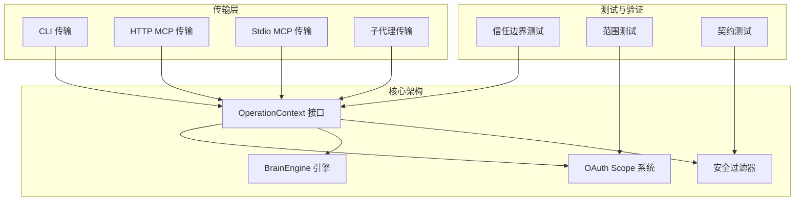

**图表来源**
- [operations.ts:277-394](file://src/core/operations.ts#L277-L394)
- [scope.ts:1-194](file://src/core/scope.ts#L1-L194)
- [engine.ts:646-800](file://src/core/engine.ts#L646-L800)

**章节来源**
- [operations.ts:1-5108](file://src/core/operations.ts#L1-L5108)
- [scope.ts:1-194](file://src/core/scope.ts#L1-L194)
- [engine.ts:1-2162](file://src/core/engine.ts#L1-L2162)

## 核心组件

### OperationContext 接口设计

OperationContext是整个设计模式的核心，它定义了所有操作执行时必需的上下文信息：

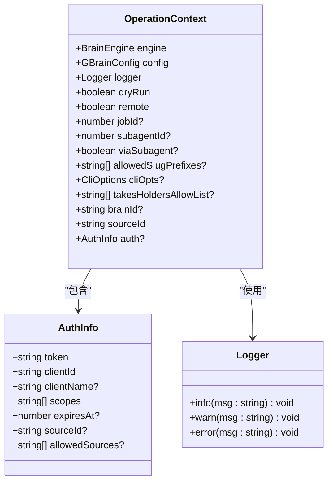

**图表来源**
- [operations.ts:277-394](file://src/core/operations.ts#L277-L394)
- [operations.ts:231-275](file://src/core/operations.ts#L231-L275)
- [operations.ts:225-229](file://src/core/operations.ts#L225-L229)

### OAuth Scope 层次结构

GBRain实现了完整的OAuth scope层次系统，确保最小权限原则：

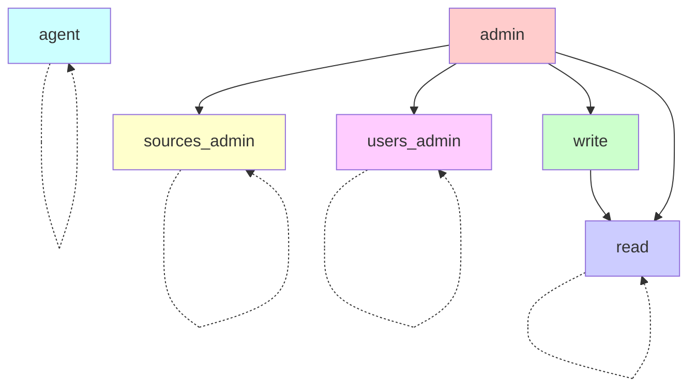

**图表来源**
- [scope.ts:11-66](file://src/core/scope.ts#L11-L66)

**章节来源**
- [operations.ts:277-394](file://src/core/operations.ts#L277-L394)
- [scope.ts:1-194](file://src/core/scope.ts#L1-L194)

## 架构概览

GBRain操作上下文设计模式采用分层架构，确保安全性和可扩展性：

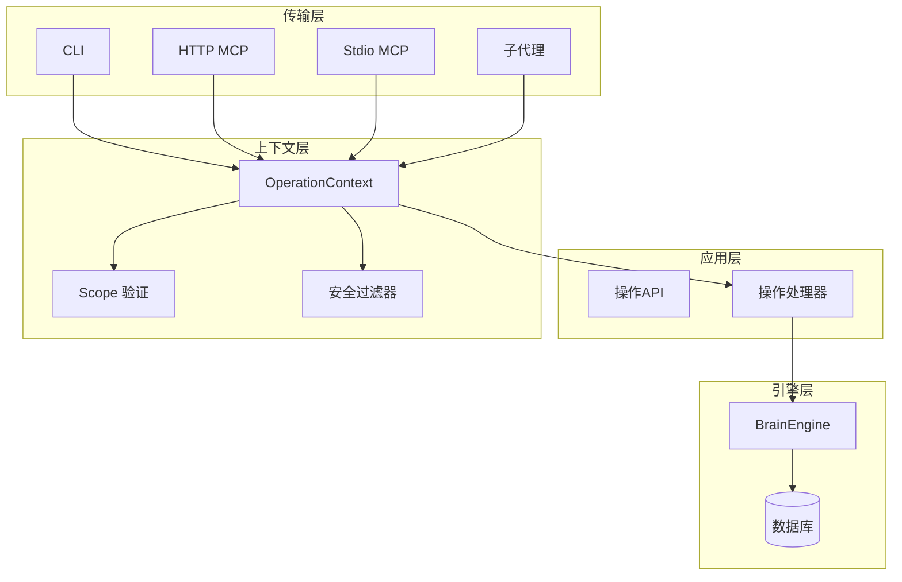

**图表来源**
- [operations.ts:589-619](file://src/core/operations.ts#L589-L619)
- [engine.ts:646-800](file://src/core/engine.ts#L646-L800)

## 详细组件分析

### 认证信息管理

认证信息通过AuthInfo接口统一管理，支持多种认证方式：

| 字段名 | 类型 | 描述 | 安全考虑 |
|--------|------|------|----------|
| token | string | OAuth访问令牌 | 必须加密存储和传输 |
| clientId | string | 客户端标识符 | 用于审计和配额控制 |
| clientName | string? | 客户端显示名称 | 减少令牌混淆风险 |
| scopes | string[] | 授权范围列表 | 最小权限原则 |
| expiresAt | number? | 过期时间戳 | 自动刷新机制 |
| sourceId | string? | 写入权限的数据源 | 多租户隔离 |
| allowedSources | string[]? | 读取权限的数据源集合 | 联邦读取支持 |

**章节来源**
- [operations.ts:231-275](file://src/core/operations.ts#L231-L275)

### 权限控制系统

权限控制基于OAuth scope层次实现，确保最小权限原则：

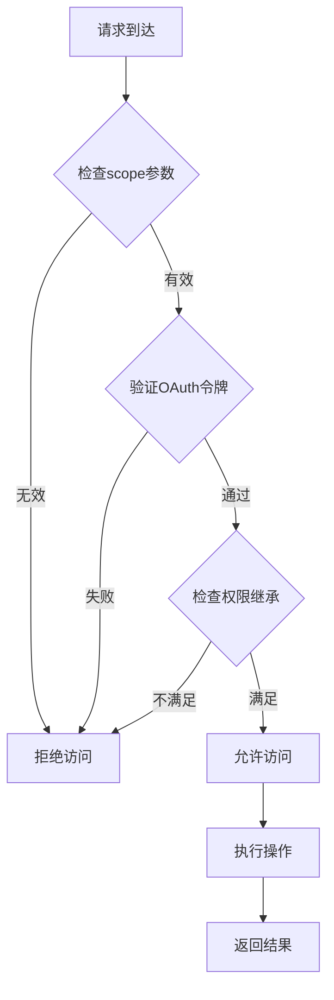

**图表来源**
- [scope.ts:79-86](file://src/core/scope.ts#L79-L86)

**章节来源**
- [scope.ts:1-194](file://src/core/scope.ts#L1-L194)

### 信任边界机制

信任边界通过`remote`字段严格区分本地和远程调用：

| 调用类型 | remote值 | 安全策略 | 文件系统访问 | 传输方式 |
|----------|----------|----------|--------------|----------|
| 本地CLI | false | 完全信任 | 无限制 | 本地进程 |
| HTTP MCP | true | 严格限制 | 受限路径 | 网络传输 |
| Stdio MCP | true | 严格限制 | 受限路径 | 进程间通信 |
| 子代理 | true | 严格限制 | 受限路径 | LLM循环 |

**章节来源**
- [operations.ts:289-299](file://src/core/operations.ts#L289-L299)
- [whoami.test.ts:30-37](file://test/whoami.test.ts#L30-L37)

### 多租户隔离机制

多租户隔离通过`sourceId`实现，确保不同数据源之间的完全隔离：

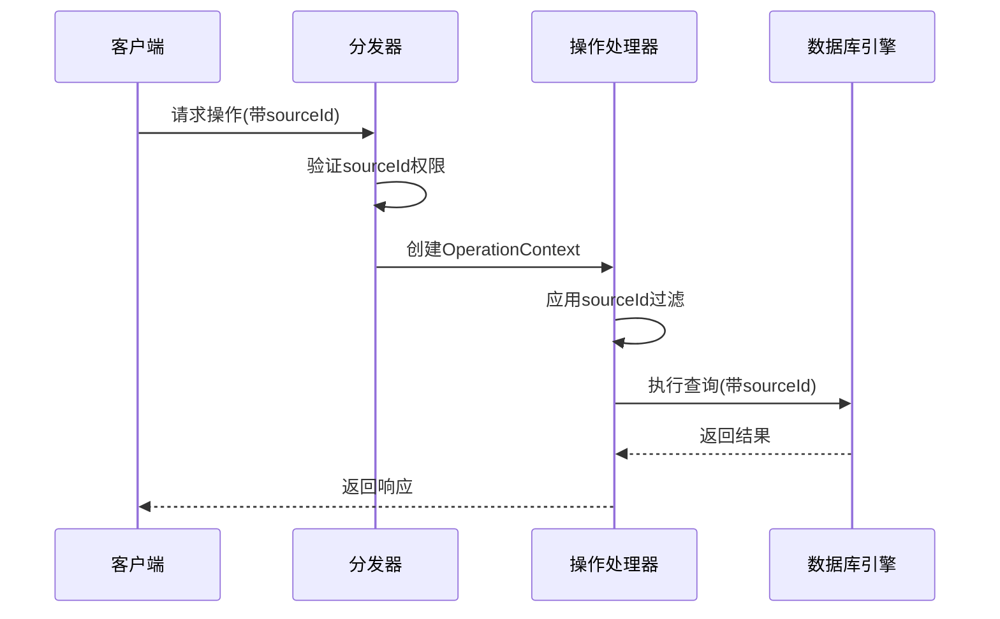

**图表来源**
- [operations.ts:397-426](file://src/core/operations.ts#L397-L426)

**章节来源**
- [operations.ts:397-426](file://src/core/operations.ts#L397-L426)

### 上下文传递模式

上下文传递在不同传输层之间保持一致性：

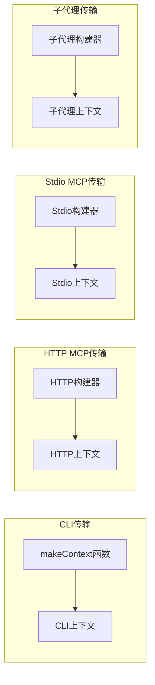

**图表来源**
- [cli.ts:784-817](file://src/cli.ts#L784-L817)
- [brain-allowlist.ts:209-229](file://src/core/minions/tools/brain-allowlist.ts#L209-L229)

**章节来源**
- [cli.ts:784-817](file://src/cli.ts#L784-L817)
- [brain-allowlist.ts:209-229](file://src/core/minions/tools/brain-allowlist.ts#L209-L229)

### 作用域解析算法

作用域解析遵循严格的优先级顺序：

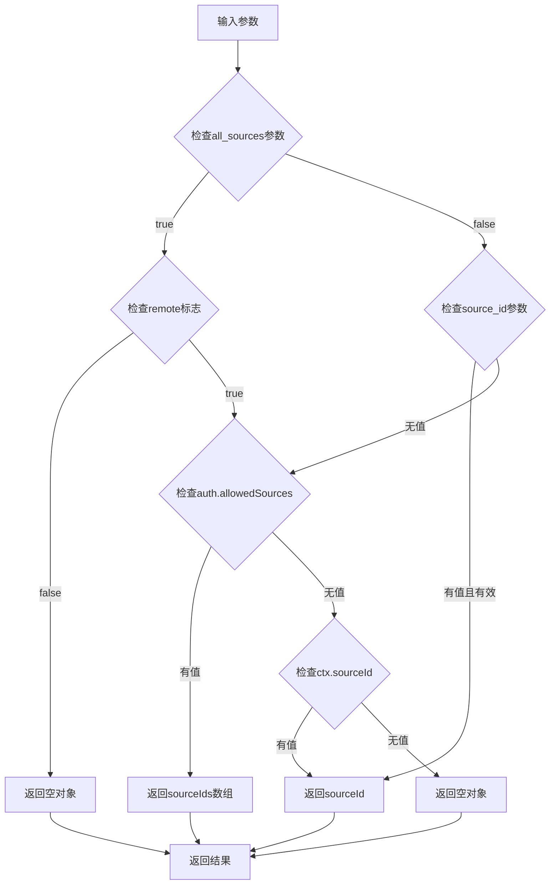

**图表来源**
- [operations.ts:473-494](file://src/core/operations.ts#L473-L494)

**章节来源**
- [operations.ts:473-494](file://src/core/operations.ts#L473-L494)

### 安全过滤器实现

安全过滤器在多个层面实施保护：

| 过滤器类型 | 实施位置 | 保护内容 | 触发条件 |
|------------|----------|----------|----------|
| 上传路径验证 | validateUploadPath | 路径遍历防护 | 文件上传操作 |
| 页面slug验证 | validatePageSlug | slug格式验证 | 页面写入操作 |
| 文件名验证 | validateFilename | 文件名安全检查 | 文件上传操作 |
| 令牌持有者过滤 | takesHoldersAllowList | 私有数据可见性 | takes相关操作 |
| 代码智能范围 | resolveCodeIntelScope | 单源代码遍历 | 代码图操作 |

**章节来源**
- [operations.ts:114-149](file://src/core/operations.ts#L114-L149)
- [operations.ts:156-214](file://src/core/operations.ts#L156-L214)

### 远程/本地调用区别处理

远程和本地调用在多个方面存在显著差异：

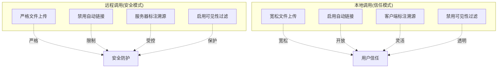

**图表来源**
- [operations.ts:742-890](file://src/core/operations.ts#L742-L890)

**章节来源**
- [operations.ts:742-890](file://src/core/operations.ts#L742-L890)

### 子代理上下文继承

子代理上下文通过FAIL-CLOSED机制确保安全性：

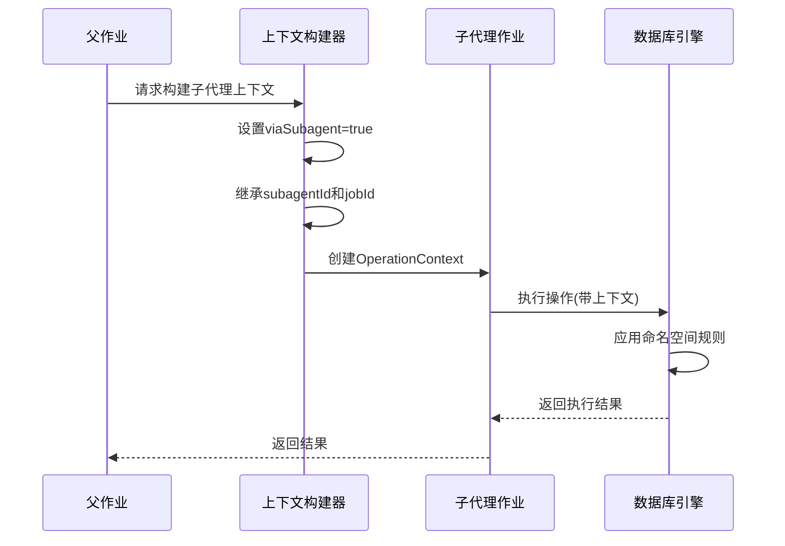

**图表来源**
- [brain-allowlist.ts:209-229](file://src/core/minions/tools/brain-allowlist.ts#L209-L229)

**章节来源**
- [brain-allowlist.ts:209-229](file://src/core/minions/tools/brain-allowlist.ts#L209-L229)

### 可信工作空间机制

可信工作空间通过前缀白名单实现精确控制：

| 机制类型 | 实现方式 | 安全保证 | 使用场景 |
|----------|----------|----------|----------|
| 前缀匹配 | matchesSlugAllowList | 精确slug控制 | 受信任的工作流程 |
| 命名空间检查 | wiki/agents/{id}/ | 防止命名空间冲突 | 子代理写入 |
| 代理策略 | viaSubagent标志 | 防止代理绕过 | LLM驱动的操作 |
| 工作流约束 | allowedSlugPrefixes | 流水线安全 | 自动化任务 |

**章节来源**
- [operations.ts:183-194](file://src/core/operations.ts#L183-L194)
- [operations.ts:782-804](file://src/core/operations.ts#L782-L804)

## 依赖关系分析

操作上下文设计模式的依赖关系体现了清晰的关注点分离：

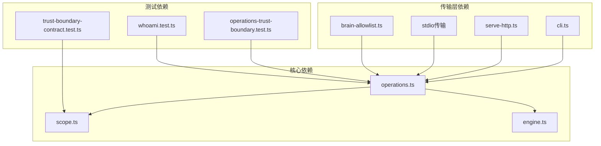

**图表来源**
- [operations.ts:1-5108](file://src/core/operations.ts#L1-L5108)
- [scope.ts:1-194](file://src/core/scope.ts#L1-L194)
- [engine.ts:1-2162](file://src/core/engine.ts#L1-L2162)

**章节来源**
- [operations.ts:1-5108](file://src/core/operations.ts#L1-L5108)
- [scope.ts:1-194](file://src/core/scope.ts#L1-L194)
- [engine.ts:1-2162](file://src/core/engine.ts#L1-L2162)

## 性能考虑

操作上下文设计模式在安全性的同时也考虑了性能影响：

### 上下文构建成本
- **CLI调用**：轻量级上下文构建，主要开销在sourceId解析
- **HTTP MCP调用**：中等成本，需要OAuth令牌验证
- **子代理调用**：较高成本，需要完整的安全检查链

### 缓存策略
- **scope验证缓存**：避免重复的OAuth令牌验证
- **sourceId解析缓存**：减少频繁的source解析开销
- **引擎连接池**：复用数据库连接，减少连接建立成本

### 内存优化
- **按需加载**：只在需要时加载额外的配置和包
- **上下文复用**：在同一批处理中复用OperationContext
- **异步处理**：非阻塞的验证和过滤操作

## 故障排除指南

### 常见问题诊断

| 问题类型 | 症状 | 可能原因 | 解决方案 |
|----------|------|----------|----------|
| 认证失败 | permission_denied | scope不足或令牌过期 | 检查OAuth配置和scope分配 |
| 权限拒绝 | permission_denied | sourceId不匹配 | 验证数据源权限和scope |
| 上下文缺失 | 类型错误 | OperationContext未正确构建 | 检查传输层上下文构建逻辑 |
| 性能问题 | 响应缓慢 | 过多的scope验证 | 优化scope缓存和批量验证 |

### 调试技巧

1. **启用详细日志**：在OperationContext中设置更详细的日志级别
2. **检查trust boundary**：验证remote字段是否正确设置
3. **验证scope链**：确认scope解析链的每个环节
4. **监控性能指标**：跟踪上下文构建和验证的性能

**章节来源**
- [operations-trust-boundary.test.ts:1-268](file://test/operations-trust-boundary.test.ts#L1-L268)
- [trust-boundary-contract.test.ts:1-91](file://test/trust-boundary-contract.test.ts#L1-L91)

## 结论

GBRain操作上下文设计模式通过精心设计的架构实现了安全性和可用性的平衡。其核心优势包括：

1. **严格的信任边界**：通过明确的remote字段区分本地和远程调用
2. **细粒度的权限控制**：基于OAuth scope的分级授权系统
3. **多租户隔离**：通过sourceId实现数据源级别的完全隔离
4. **可扩展的上下文传递**：支持多种传输方式的一致性上下文
5. **FAIL-CLOSED设计**：在安全问题上选择保守的默认行为

该设计模式为复杂的AI系统提供了坚实的安全基础，同时保持了良好的性能和可维护性。

## 附录

### 上下文扩展指南

当需要扩展OperationContext以支持新的功能时，建议遵循以下步骤：

1. **定义新字段**：在OperationContext接口中添加必要的字段
2. **更新构建器**：修改相应的构建器函数以设置新字段
3. **添加验证**：实现必要的验证逻辑
4. **编写测试**：创建全面的测试用例
5. **文档更新**：更新相关文档和注释

### 安全最佳实践

1. **始终验证remote字段**：不要假设remote字段的值
2. **使用FAIL-CLOSED原则**：在不确定的情况下选择最安全的选项
3. **最小权限原则**：只授予完成任务所需的最少权限
4. **定期审计**：定期审查和更新安全策略
5. **监控告警**：建立完善的监控和告警机制