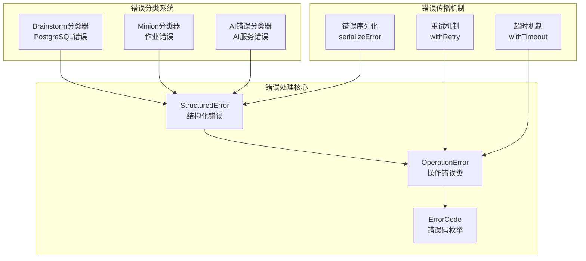
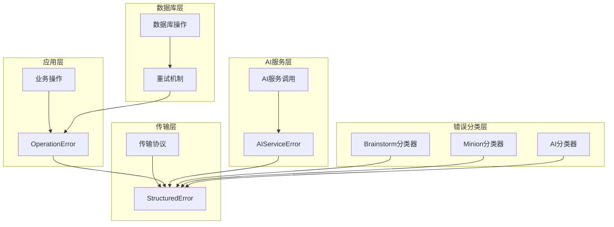
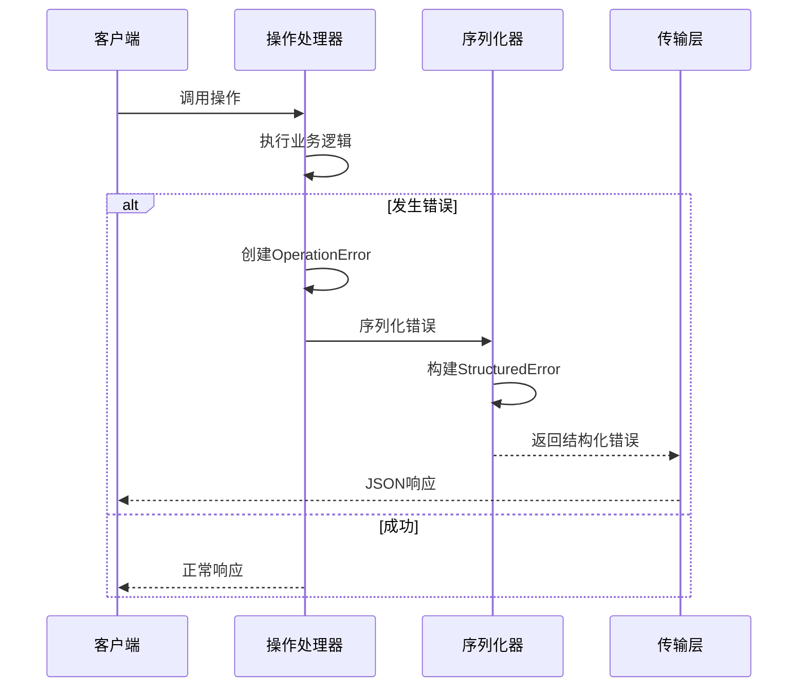
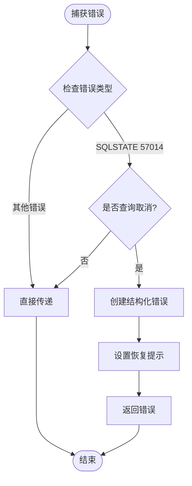
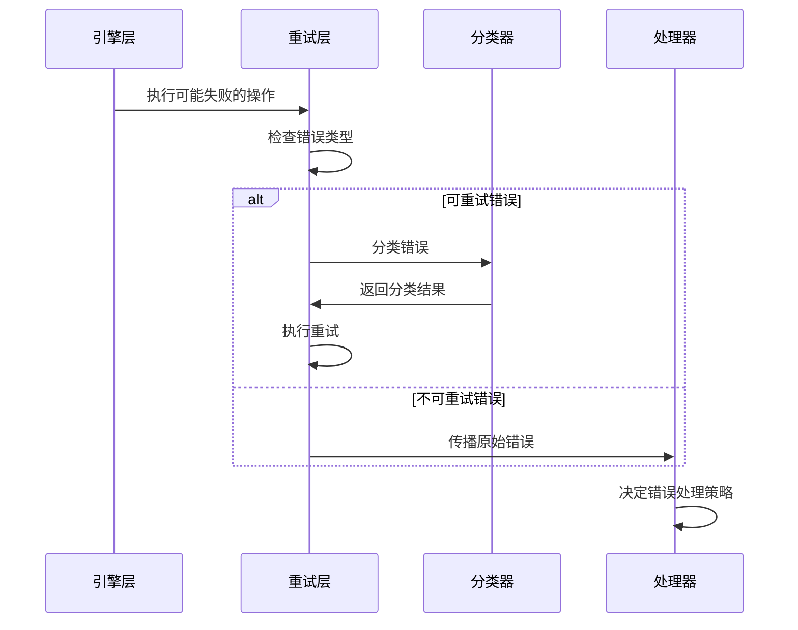
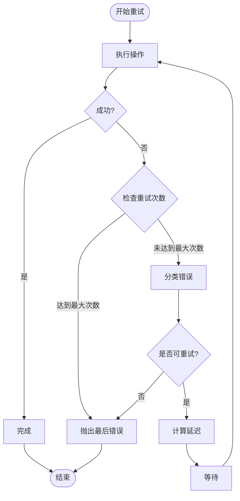
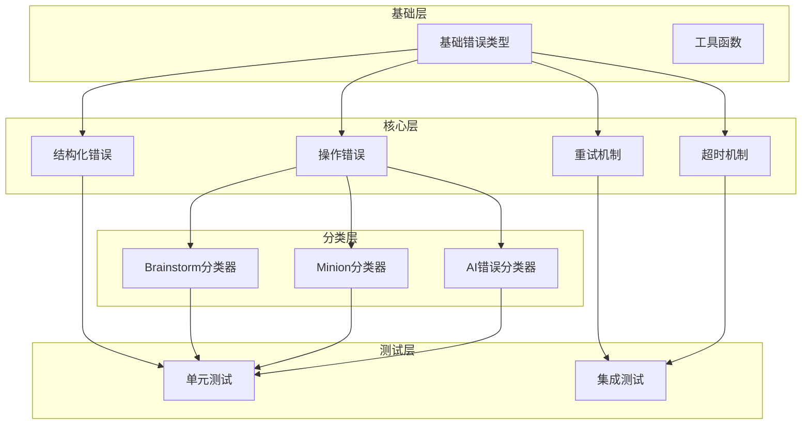
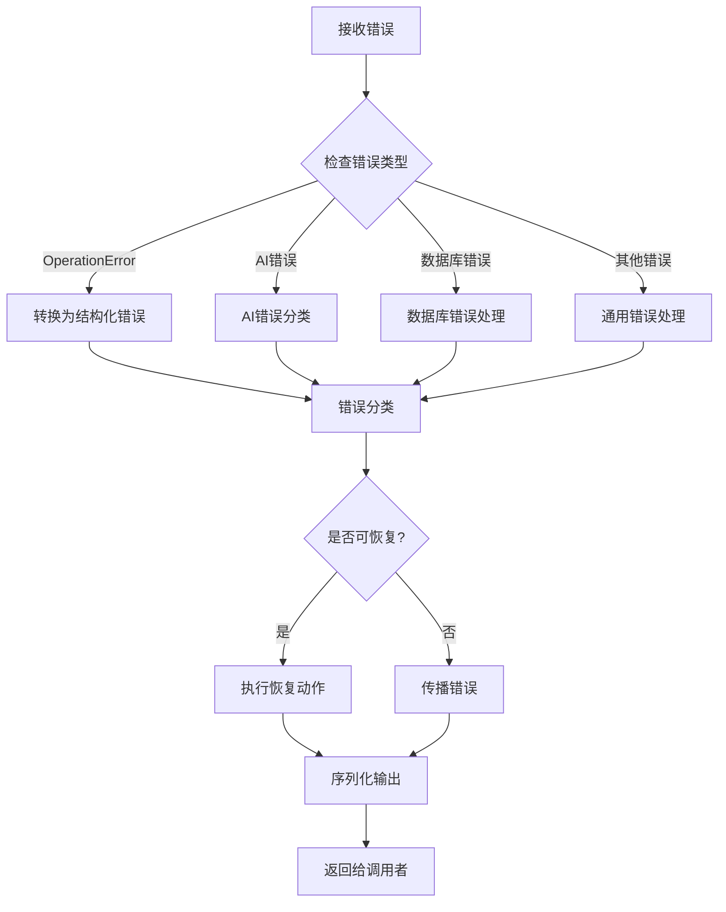

# 错误处理设计模式

<cite>
**本文档引用的文件**
- [src/core/operations.ts](file://src/core/operations.ts)
- [src/core/errors.ts](file://src/core/errors.ts)
- [src/core/ai/errors.ts](file://src/core/ai/errors.ts)
- [src/core/brainstorm/error-classify.ts](file://src/core/brainstorm/error-classify.ts)
- [src/core/minions/error-classify.ts](file://src/core/minions/error-classify.ts)
- [src/core/retry.ts](file://src/core/retry.ts)
- [src/core/timeout.ts](file://src/core/timeout.ts)
- [test/errors.test.ts](file://test/errors.test.ts)
- [test/error-classify.test.ts](file://test/error-classify.test.ts)
- [test/timeout.test.ts](file://test/timeout.test.ts)
- [test/sync-failures.test.ts](file://test/sync-failures.test.ts)
- [test/mcp-client-hardening.test.ts](file://test/mcp-client-hardening.test.ts)
- [test/operation-context-sourceid-required.test.ts](file://test/operation-context-sourceid-required.test.ts)
</cite>

## 目录
1. [简介](#简介)
2. [项目结构](#项目结构)
3. [核心组件](#核心组件)
4. [架构概览](#架构概览)
5. [详细组件分析](#详细组件分析)
6. [依赖关系分析](#依赖关系分析)
7. [性能考虑](#性能考虑)
8. [故障排除指南](#故障排除指南)
9. [结论](#结论)
10. [附录](#附录)

## 简介

GBrain采用了一套完整的错误处理设计模式，通过类型安全的错误模型、结构化的错误分类系统和智能的错误传播机制，为复杂的AI基础设施提供了可靠的错误管理能力。该设计模式的核心在于OperationError类和ErrorCode枚举系统的结合使用，以及多层错误分类和恢复策略。

这套设计模式特别针对GBrain的分布式架构特点，实现了从底层数据库连接错误到上层AI服务错误的全栈错误处理，确保了系统的稳定性和可维护性。

## 项目结构

GBRain的错误处理系统主要分布在以下核心模块中：



**图表来源**
- [src/core/operations.ts:75-94](file://src/core/operations.ts#L75-L94)
- [src/core/errors.ts:13-93](file://src/core/errors.ts#L13-L93)
- [src/core/retry.ts:246-291](file://src/core/retry.ts#L246-L291)

**章节来源**
- [src/core/operations.ts:1-800](file://src/core/operations.ts#L1-L800)
- [src/core/errors.ts:1-94](file://src/core/errors.ts#L1-L94)

## 核心组件

### OperationError类设计

OperationError是GBRain错误处理系统的核心类，它继承自JavaScript原生Error类，但提供了类型安全的错误处理能力。

```mermaid
classDiagram
class OperationError {
+ErrorCode code
+string message
+string suggestion
+string docs
+toJSON() Object
}
class ErrorCode {
<<enumeration>>
"page_not_found"
"invalid_params"
"embedding_failed"
"storage_error"
"bucket_not_found"
"database_error"
"permission_denied"
"unknown_transport"
"rate_limited"
"extraction_failed"
"fact_not_found"
"(string & {})"
}
class StructuredError {
+string class
+string code
+string message
+string hint
+string docs_url
}
class StructuredAgentError {
+StructuredError envelope
+constructor(envelope)
}
OperationError --> ErrorCode : 使用
StructuredAgentError --> StructuredError : 包装
```

**图表来源**
- [src/core/operations.ts:75-94](file://src/core/operations.ts#L75-L94)
- [src/core/errors.ts:13-64](file://src/core/errors.ts#L13-L64)

### 类型安全的错误码系统

ErrorCode采用了开放联合类型的实现方式，既保证了类型安全，又支持向前兼容：

- **固定枚举值**：包含所有已知的错误类型
- **开放联合类型**：`(string & {})`允许未来版本添加新的错误码
- **自动补全**：下游消费者可以获得IDE的智能提示
- **向前兼容**：新版本添加的错误码不会破坏现有代码

**章节来源**
- [src/core/operations.ts:60-74](file://src/core/operations.ts#L60-L74)

## 架构概览

GBRain的错误处理架构采用了分层设计，每层都有明确的职责分工：



**图表来源**
- [src/core/ai/errors.ts:14-71](file://src/core/ai/errors.ts#L14-L71)
- [src/core/retry.ts:66-68](file://src/core/retry.ts#L66-L68)

## 详细组件分析

### 结构化错误处理系统

结构化错误处理系统提供了统一的错误表示格式，确保所有错误都具有相同的结构特征。



**图表来源**
- [src/core/errors.ts:79-93](file://src/core/errors.ts#L79-L93)
- [src/core/operations.ts:75-94](file://src/core/operations.ts#L75-L94)

### 错误分类策略

GBRain实现了多层次的错误分类策略，每种分类器都有特定的应用场景：

#### PostgreSQL错误分类器（Brainstorm）

专门用于识别和处理PostgreSQL的查询取消错误：



**图表来源**
- [src/core/brainstorm/error-classify.ts:40-70](file://src/core/brainstorm/error-classify.ts#L40-L70)

#### Minion作业错误分类器

用于作业队列的错误分类和自动修复：

| 分类类别 | 错误模式 | 自动修复 |
|---------|---------|---------|
| prompt_too_long | 提示词过长 | ✅ 支持 |
| tool_schema_mismatch | 工具参数错误 | ✅ 支持 |
| malformed_json | JSON解析失败 | ✅ 支持 |
| tool_crash | 工具实现崩溃 | ❌ 不支持 |
| tool_unavailable | 工具不可用 | ❌ 不支持 |
| tool_permission | 权限不足 | ❌ 不支持 |

**图表来源**
- [src/core/minions/error-classify.ts:31-55](file://src/core/minions/error-classify.ts#L31-L55)

### 错误传播机制

GBRain实现了智能的错误传播机制，确保错误能够在适当的层级被处理：



**图表来源**
- [src/core/retry.ts:246-291](file://src/core/retry.ts#L246-L291)

### 错误恢复模式

GBRain支持多种错误恢复模式，根据错误类型和上下文选择最合适的恢复策略：

#### 重试恢复模式

适用于网络瞬时故障和数据库连接问题：



**图表来源**
- [src/core/retry.ts:258-291](file://src/core/retry.ts#L258-L291)

#### 超时恢复模式

用于防止长时间阻塞操作：

**章节来源**
- [src/core/timeout.ts:34-68](file://src/core/timeout.ts#L34-L68)

## 依赖关系分析

GBRain错误处理系统的依赖关系体现了清晰的分层架构：



**图表来源**
- [src/core/operations.ts:1-50](file://src/core/operations.ts#L1-L50)
- [src/core/errors.ts:1-20](file://src/core/errors.ts#L1-L20)

**章节来源**
- [src/core/operations.ts:1-800](file://src/core/operations.ts#L1-L800)
- [src/core/retry.ts:1-351](file://src/core/retry.ts#L1-L351)

## 性能考虑

GBRain的错误处理系统在设计时充分考虑了性能影响：

### 内存管理
- 错误对象采用轻量级设计，避免不必要的内存占用
- 及时清理定时器和事件监听器，防止内存泄漏
- 使用对象池模式减少频繁的对象创建

### 执行效率
- 错误分类采用高效的正则表达式匹配
- 缓存常用的错误分类结果
- 避免深度嵌套的错误处理逻辑

### 资源优化
- 重试机制支持可配置的延迟策略
- 超时机制提供灵活的超时控制
- 错误序列化避免不必要的数据转换

## 故障排除指南

### 常见错误诊断

#### OperationError错误处理

当遇到OperationError时，应检查以下关键字段：
- `code`：错误码，用于确定错误类型
- `suggestion`：用户友好的修复建议
- `docs`：相关文档链接

#### 结构化错误序列化

使用`serializeError`函数可以将任何错误转换为标准格式：

**章节来源**
- [src/core/errors.ts:79-93](file://src/core/errors.ts#L79-L93)

### 调试技巧

#### 错误分类验证

通过测试用例验证错误分类的准确性：

**章节来源**
- [test/error-classify.test.ts:1-154](file://test/error-classify.test.ts#L1-L154)

#### 重试机制调试

使用环境变量调整重试行为进行调试：
- `GBRAIN_BULK_MAX_RETRIES`：最大重试次数
- `GBRAIN_BULK_RETRY_BASE_MS`：基础延迟时间
- `GBRAIN_BULK_RETRY_MAX_MS`：最大延迟时间

**章节来源**
- [src/core/retry.ts:300-342](file://src/core/retry.ts#L300-L342)

## 结论

GBRain的错误处理设计模式通过以下关键特性实现了高质量的错误管理：

### 设计优势
- **类型安全**：完整的TypeScript类型系统确保编译时错误检测
- **结构化输出**：统一的错误格式便于客户端处理和用户理解
- **智能分类**：多层错误分类系统提供精确的错误识别
- **灵活恢复**：支持多种错误恢复策略适应不同场景
- **向前兼容**：开放的错误码系统支持未来的功能扩展

### 最佳实践总结
1. **优先使用OperationError**：对于业务逻辑错误，始终使用类型安全的OperationError
2. **提供详细的错误信息**：包含`suggestion`和`docs`字段帮助用户解决问题
3. **合理使用重试机制**：根据错误类型选择合适的重试策略
4. **实施错误分类**：利用内置的分类器提高错误处理的准确性
5. **监控错误模式**：定期分析错误统计信息识别系统问题

这套设计模式为GBrain提供了坚实的错误处理基础，确保了系统的稳定性、可维护性和用户体验。

## 附录

### 错误码参考表

| 错误码 | 描述 | 典型场景 |
|--------|------|----------|
| `page_not_found` | 页面未找到 | 文档查询失败 |
| `invalid_params` | 参数无效 | 用户输入验证失败 |
| `embedding_failed` | 嵌入生成失败 | 向量化处理错误 |
| `storage_error` | 存储错误 | 文件上传/下载失败 |
| `bucket_not_found` | 存储桶不存在 | 对象存储配置错误 |
| `database_error` | 数据库错误 | SQL执行异常 |
| `permission_denied` | 权限拒绝 | 访问控制违规 |
| `rate_limited` | 速率限制 | API调用频率过高 |
| `extraction_failed` | 提取失败 | 内容解析错误 |
| `fact_not_found` | 事实未找到 | 数据查询无结果 |

### 错误处理流程图

