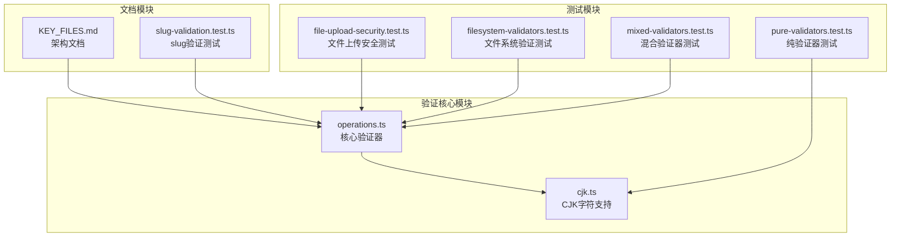
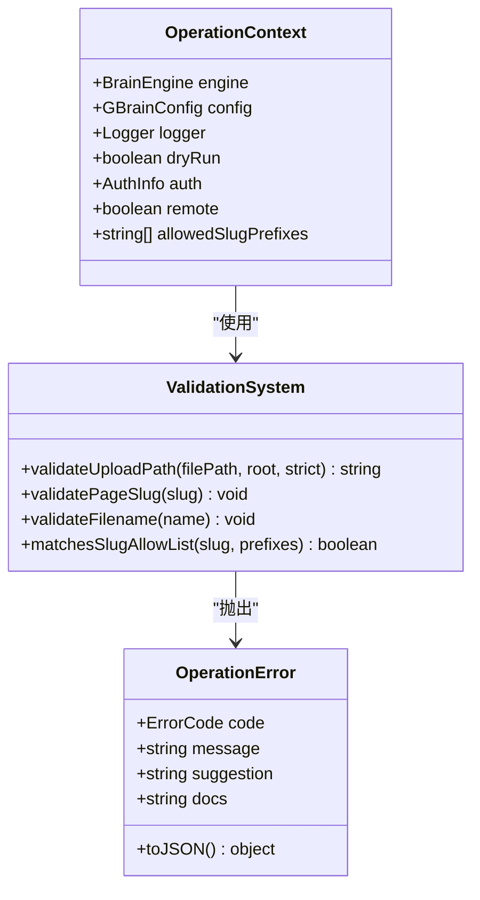
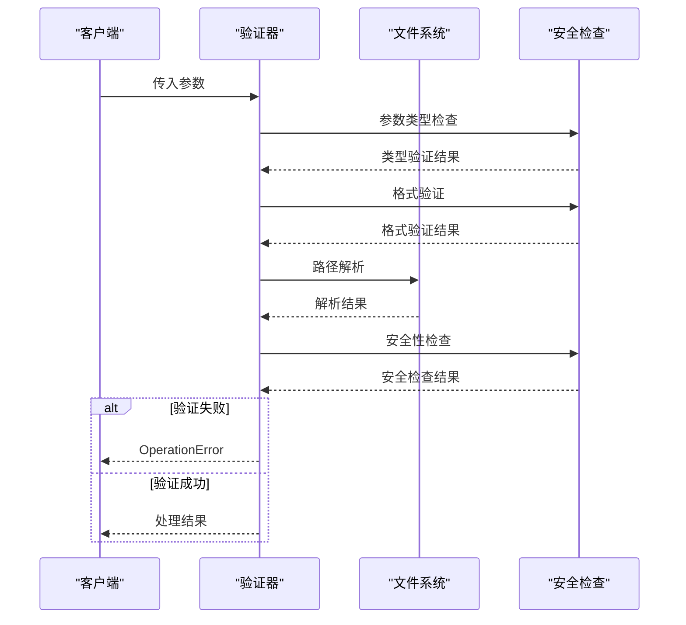
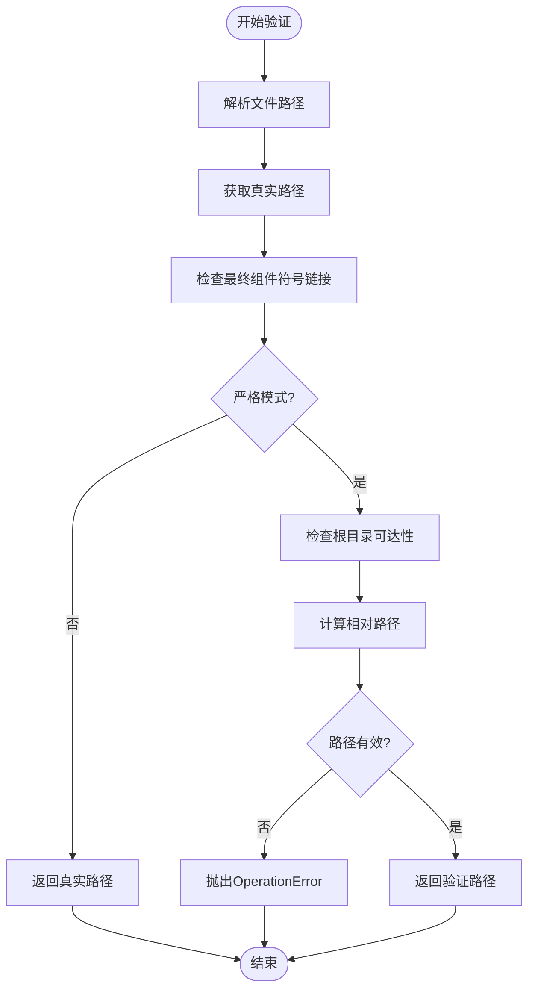
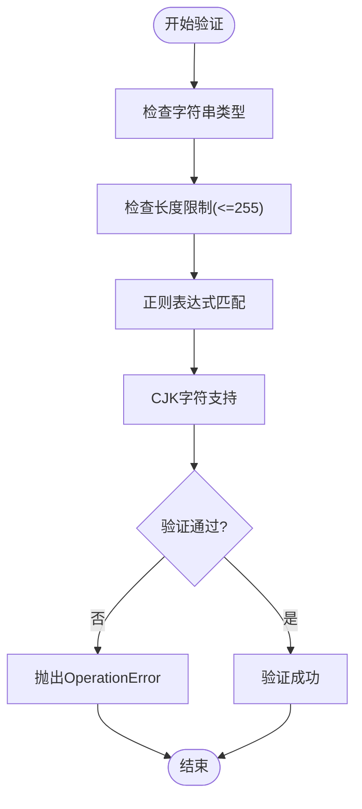
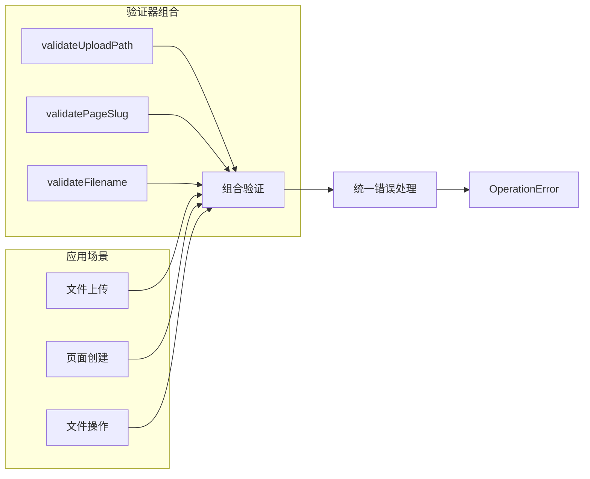
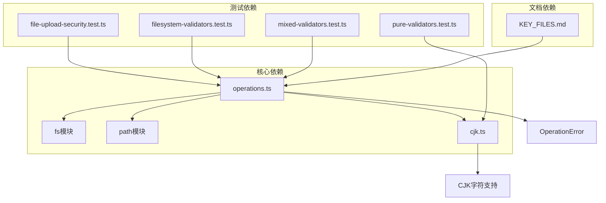
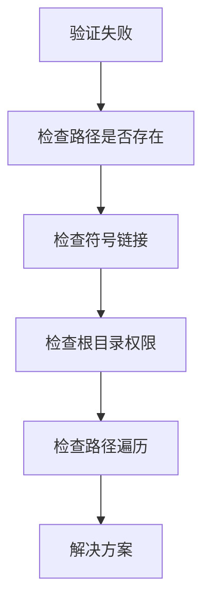

# 验证模式设计

<cite>
**本文档引用的文件**
- [operations.ts](file://src/core/operations.ts)
- [cjk.ts](file://src/core/cjk.ts)
- [filesystem-validators.test.ts](file://test/fuzz/filesystem-validators.test.ts)
- [mixed-validators.test.ts](file://test/fuzz/mixed-validators.test.ts)
- [file-upload-security.test.ts](file://test/file-upload-security.test.ts)
- [slug-validation.test.ts](file://test/slug-validation.test.ts)
- [KEY_FILES.md](file://docs/architecture/KEY_FILES.md)
- [pure-validators.test.ts](file://test/fuzz/pure-validators.test.ts)
- [redos-hardening.test.ts](file://test/redos-hardening.test.ts)
</cite>

## 目录
1. [简介](#简介)
2. [项目结构](#项目结构)
3. [核心组件](#核心组件)
4. [架构概览](#架构概览)
5. [详细组件分析](#详细组件分析)
6. [依赖关系分析](#依赖关系分析)
7. [性能考虑](#性能考虑)
8. [故障排除指南](#故障排除指南)
9. [结论](#结论)
10. [附录](#附录)

## 简介

GBrain验证模式设计是一个多层次的安全验证体系，专注于文件上传路径验证和页面slug验证。该系统采用"白名单验证+严格边界控制"的设计理念，通过严格的参数验证策略、安全验证机制和数据完整性检查，确保系统的安全性。

本设计的核心目标是：
- 防止路径遍历攻击和符号链接逃逸
- 确保页面slug格式的合法性和安全性
- 实现FAIL-CLOSED的安全策略
- 提供可扩展的验证器组合模式

## 项目结构

GBRain验证系统主要分布在以下关键文件中：

**图表来源**
- [operations.ts:114-189](file://src/core/operations.ts#L114-L189)
- [cjk.ts:1-68](file://src/core/cjk.ts#L1-L68)

**章节来源**
- [operations.ts:1-5108](file://src/core/operations.ts#L1-L5108)
- [KEY_FILES.md:1-97](file://docs/architecture/KEY_FILES.md#L1-L97)

## 核心组件

### 验证器基础架构

GBRain采用了契约驱动的操作定义模式，所有操作都定义了其参数模式、处理器和可选的CLI提示。验证器作为这一架构的重要组成部分，提供了统一的错误处理机制。

**图表来源**
- [operations.ts:75-394](file://src/core/operations.ts#L75-L394)

### 核心验证器功能

系统包含三个核心验证器，每个都有特定的安全职责：

1. **validateUploadPath**: 文件上传路径验证
2. **validatePageSlug**: 页面slug格式验证  
3. **validateFilename**: 文件名格式验证

**章节来源**
- [operations.ts:114-214](file://src/core/operations.ts#L114-L214)

## 架构概览

GBRain验证模式采用分层安全架构，从输入到输出形成完整的安全防护链：

**图表来源**
- [operations.ts:114-149](file://src/core/operations.ts#L114-L149)
- [operations.ts:156-169](file://src/core/operations.ts#L156-L169)

## 详细组件分析

### validateUploadPath 组件分析

validateUploadPath是文件上传路径验证的核心组件，实现了严格的安全控制机制。

#### 设计理念

该验证器采用"严格模式+宽松模式"的双模式设计：
- **严格模式**: 用于不受信任的调用者（MCP over stdio/HTTP）
- **宽松模式**: 仅用于本地CLI调用

#### 实现细节

**图表来源**
- [operations.ts:114-149](file://src/core/operations.ts#L114-L149)

#### 安全特性

1. **符号链接防护**: 拒绝最终组件为符号链接
2. **路径遍历防护**: 使用realpath和relative确保路径在限制范围内
3. **根目录约束**: 严格限制在指定根目录内
4. **race条件处理**: 处理lstat与unlink的竞争条件

**章节来源**
- [operations.ts:114-149](file://src/core/operations.ts#L114-L149)
- [file-upload-security.test.ts:14-116](file://test/file-upload-security.test.ts#L14-L116)
- [filesystem-validators.test.ts:45-127](file://test/fuzz/filesystem-validators.test.ts#L45-L127)

### validatePageSlug 组件分析

validatePageSlug负责验证页面slug的格式和内容，采用白名单验证策略。

#### 设计理念

采用"允许列表"而非"禁止列表"的设计，只允许已知安全的字符和格式。

#### 实现策略

**图表来源**
- [operations.ts:156-169](file://src/core/operations.ts#L156-L169)

#### 白名单规则

1. **字符集限制**: 只允许小写字母数字和CJK字符
2. **格式要求**: 段落间用单斜杠分隔
3. **连字符规则**: 连字符只能出现在段落内部
4. **长度限制**: 最大255个字符

**章节来源**
- [operations.ts:156-169](file://src/core/operations.ts#L156-L169)
- [slug-validation.test.ts:115-185](file://test/slug-validation.test.ts#L115-L185)

### 验证器组合模式

GBRain实现了灵活的验证器组合模式，支持多种验证场景：

#### 组合策略

**图表来源**
- [operations.ts:114-214](file://src/core/operations.ts#L114-L214)

#### 允许列表匹配

系统还提供了slug允许列表匹配功能，支持通配符模式：

**章节来源**
- [operations.ts:183-194](file://src/core/operations.ts#L183-L194)

## 依赖关系分析

### 核心依赖关系

**图表来源**
- [operations.ts:6-30](file://src/core/operations.ts#L6-L30)
- [cjk.ts:19](file://src/core/cjk.ts#L19)

### 错误处理依赖

系统采用统一的错误处理机制，所有验证失败都会抛出OperationError异常。

**章节来源**
- [operations.ts:75-94](file://src/core/operations.ts#L75-L94)

## 性能考虑

### 验证器性能特征

1. **纯验证器**: 支持纯函数验证器，避免副作用
2. **模糊测试**: 通过快速检查确保无挂起状态
3. **内存效率**: 避免不必要的字符串复制
4. **I/O最小化**: 尽量减少文件系统访问

### 性能优化建议

1. **缓存策略**: 对频繁使用的验证结果进行缓存
2. **批量处理**: 支持批量验证以提高效率
3. **异步处理**: 对耗时验证采用异步模式
4. **预编译正则**: 对复杂正则表达式进行预编译

## 故障排除指南

### 常见问题诊断

#### 文件上传路径验证失败

#### slug验证失败

1. **字符集问题**: 确认使用允许的字符
2. **格式问题**: 检查段落分隔符
3. **长度问题**: 确认不超过255字符限制

**章节来源**
- [file-upload-security.test.ts:14-208](file://test/file-upload-security.test.ts#L14-L208)
- [slug-validation.test.ts:1-269](file://test/slug-validation.test.ts#L1-L269)

### 调试技巧

1. **启用详细日志**: 记录验证过程中的关键信息
2. **单元测试**: 编写针对边界情况的测试用例
3. **性能监控**: 监控验证器的执行时间
4. **安全审计**: 定期审查验证逻辑的安全性

## 结论

GBRain验证模式设计体现了现代安全软件工程的最佳实践，通过严格的白名单验证、多层安全检查和FAIL-CLOSED的设计原则，构建了一个健壮的验证系统。

### 主要优势

1. **安全性**: 采用FAIL-CLOSED策略，确保安全优先
2. **可维护性**: 清晰的错误处理和日志记录
3. **可扩展性**: 支持验证器组合和自定义扩展
4. **性能**: 优化的算法和缓存策略

### 设计亮点

1. **双模式验证**: 严格模式和宽松模式的灵活切换
2. **统一错误处理**: 标准化的OperationError机制
3. **全面测试覆盖**: 包含模糊测试和单元测试
4. **文档完善**: 详细的架构文档和使用指南

## 附录

### 验证扩展指南

#### 自定义验证器开发

1. **遵循契约**: 实现相同的接口约定
2. **错误处理**: 抛出OperationError异常
3. **性能考虑**: 避免阻塞操作
4. **测试覆盖**: 编写充分的测试用例

#### 安全加固建议

1. **定期更新**: 及时更新安全补丁
2. **监控告警**: 建立安全事件监控
3. **代码审查**: 实施严格的代码审查流程
4. **渗透测试**: 定期进行安全评估

**章节来源**
- [pure-validators.test.ts:1-61](file://test/fuzz/pure-validators.test.ts#L1-L61)
- [redos-hardening.test.ts:1-57](file://test/redos-hardening.test.ts#L1-L57)