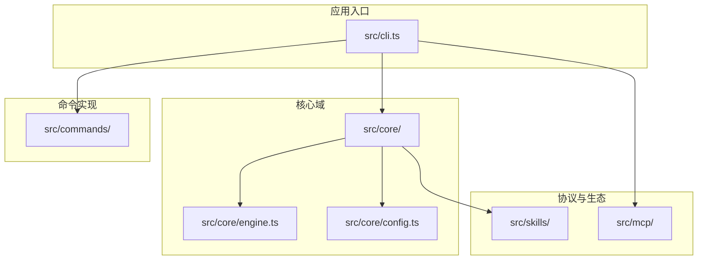
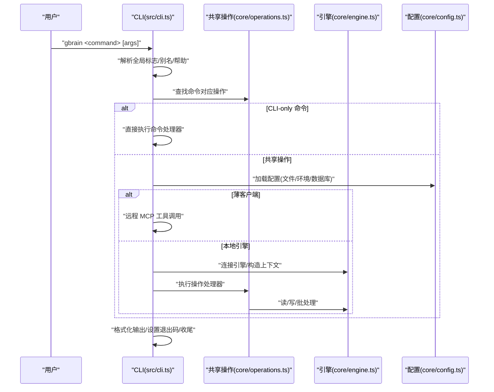
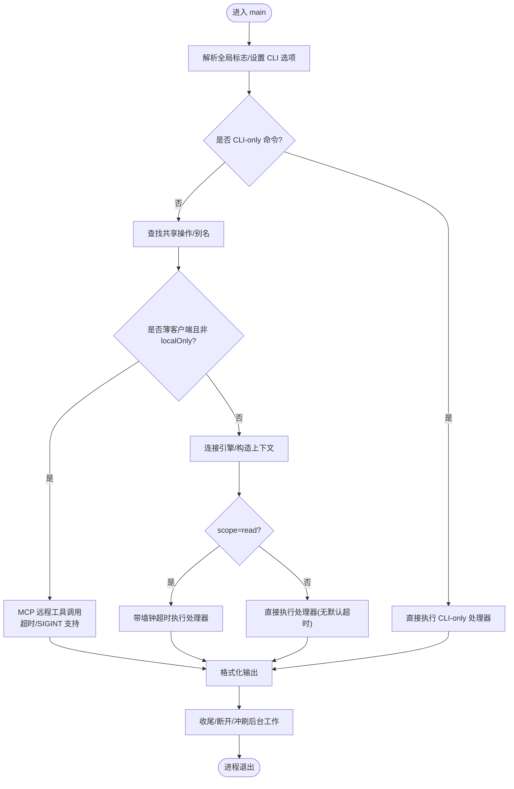
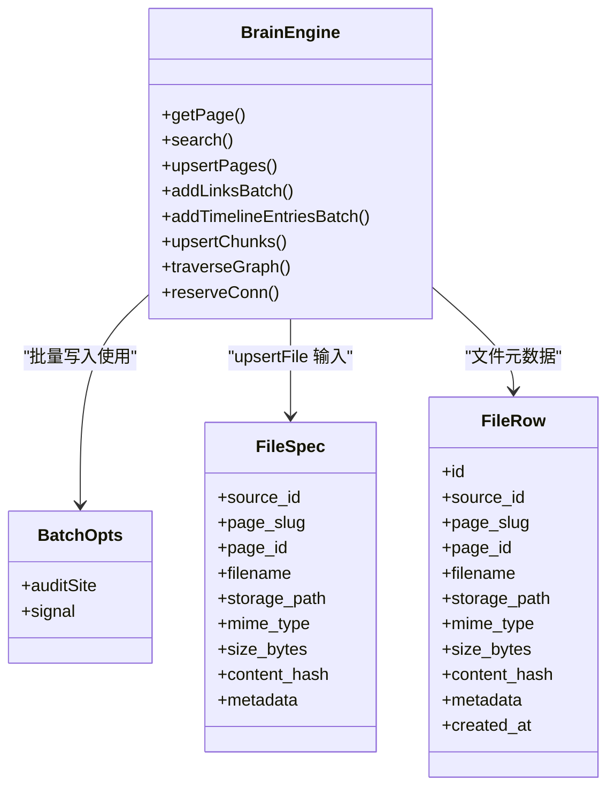
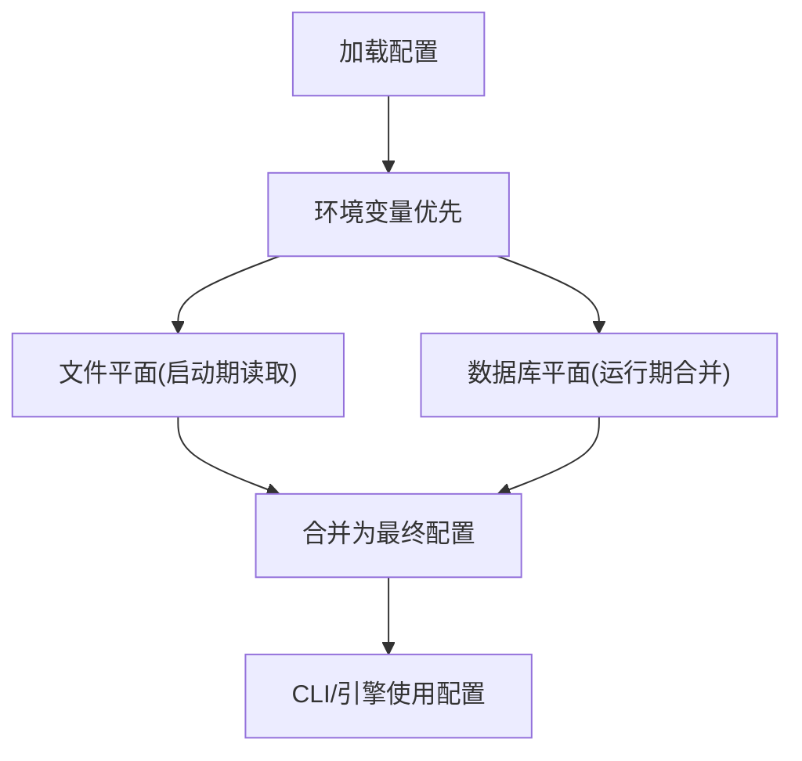
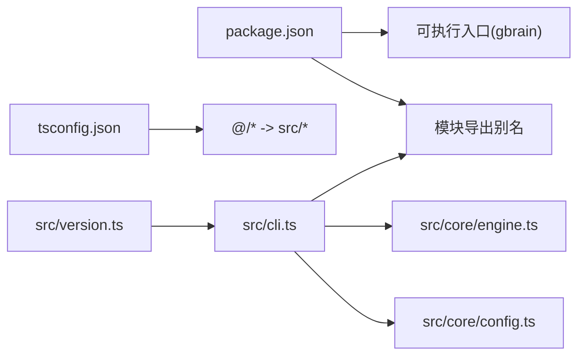

# 代码结构

<cite>
**本文引用的文件**
- [src/cli.ts](file://src/cli.ts)
- [src/core/config.ts](file://src/core/config.ts)
- [src/core/engine.ts](file://src/core/engine.ts)
- [src/version.ts](file://src/version.ts)
- [package.json](file://package.json)
- [tsconfig.json](file://tsconfig.json)
- [src/commands/](file://src/commands/)
- [src/core/](file://src/core/)
- [src/mcp/](file://src/mcp/)
- [src/skills/](file://src/skills/)
</cite>

## 目录
1. [引言](#引言)
2. [项目结构](#项目结构)
3. [核心组件](#核心组件)
4. [架构总览](#架构总览)
5. [详细组件分析](#详细组件分析)
6. [依赖分析](#依赖分析)
7. [性能考虑](#性能考虑)
8. [故障排查指南](#故障排查指南)
9. [结论](#结论)
10. [附录](#附录)

## 引言
本文件系统性梳理 GBrain 的代码结构与架构设计，聚焦 src/ 目录下核心模块的组织方式：命令入口 cli.ts、命令实现 commands/、核心引擎与业务能力 core/、MCP 协议适配 mcp/、以及技能生态 skills/。文档将说明各模块职责、文件命名约定与代码组织原则，并对 TypeScript 配置、包管理与构建流程进行文档化，最后提供模块间依赖关系图与接口定义说明，帮助开发者快速定位与理解实现。

## 项目结构
- 根级通过 package.json 暴露可执行入口与导出别名，CLI 可执行名为 gbrain，指向 src/cli.ts；同时以 exports 字段为外部使用者提供按功能域的模块化导出。
- tsconfig.json 使用 ESNext + bundler 解析策略，启用严格模式与路径别名 @/*，便于在 src 内部进行统一导入。
- src/ 下采用“功能域 + 子目录”的分层组织：
  - cli.ts：命令行入口与调度中枢，负责参数解析、薄客户端路由、超时与退出语义、更新提示等。
  - commands/：具体命令实现，每个命令一个文件或一组文件，遵循“命令名.ts”或“命令名/*.ts”的命名约定。
  - core/：核心引擎与业务域，按领域拆分子目录（如 ai/、search/、schema-pack/、minions/ 等），提供引擎抽象、配置、操作、数据模型与工具集。
  - mcp/：MCP（Model Context Protocol）相关适配与工具。
  - skills/：技能生态与技能包资源，包含大量技能实现与参考示例。

**图表来源**
- [src/cli.ts](file://src/cli.ts)
- [src/core/engine.ts](file://src/core/engine.ts)
- [src/core/config.ts](file://src/core/config.ts)
- [src/commands/](file://src/commands/)
- [src/mcp/](file://src/mcp/)
- [src/skills/](file://src/skills/)

**章节来源**
- [package.json](file://package.json)
- [tsconfig.json](file://tsconfig.json)

## 核心组件
- 命令行入口与调度
  - 职责：解析全局标志、构建命令到操作的映射、处理 CLI-only 命令、薄客户端远程路由、上下文构造、超时控制、结果格式化与退出语义。
  - 关键点：支持别名、帮助短路、自升级提示、身份横幅、图像参数转换、stdin 注入、读写操作的墙钟超时策略。
- 核心引擎
  - 职责：定义脑引擎的数据模型、查询/写入接口、批处理重试、图遍历、文件元数据、链接/时间线/情感权重等数据结构。
  - 关键点：统一抽象 Postgres 与 PGLite；批量写入具备内置重试与审计站点标注；提供跨源/多源能力。
- 配置系统
  - 职责：集中管理数据库连接、AI 网关、存储、自动升级、检索反射、评估开关等配置项；区分文件平面与数据库平面配置。
  - 关键点：环境变量优先于配置文件；文件平面用于启动期读取（如检索反射、自升级）；运行期配置通过引擎合并。

**章节来源**
- [src/cli.ts](file://src/cli.ts)
- [src/core/engine.ts](file://src/core/engine.ts)
- [src/core/config.ts](file://src/core/config.ts)

## 架构总览
从调用链看，CLI 是唯一入口，负责：
- 全局标志解析与 CLI 选项设置；
- 命令发现与帮助输出；
- CLI-only 命令直连执行；
- 共享操作的本地执行或薄客户端远程路由；
- 上下文构造（含 sourceId 解析）；
- 超时与退出语义；
- 结果格式化输出。

**图表来源**
- [src/cli.ts](file://src/cli.ts)
- [src/core/engine.ts](file://src/core/engine.ts)
- [src/core/config.ts](file://src/core/config.ts)

## 详细组件分析

### 组件一：CLI 入口与调度（src/cli.ts）
- 命令映射与别名
  - 将 operations 中的操作映射为 CLI 名称，隐藏命令不暴露；别名集合在模块加载时校验冲突。
- CLI-only 命令集
  - 包括 init、upgrade、check-update、publish、lint、report、import、export、files、embed、serve、call、config、doctor、migrate、eval、sync、extract、enrich、features、autopilot、graph-query、jobs、agent、apply-migrations、skillpack-check、skillpack、resolvers、integrity、repair-jsonb、orphans、sources、mounts、dream、check-resolvable、routing-eval、skillify、smoke-test、providers、storage、repos、code-def、code-refs、reindex、reindex-code、reindex-frontmatter、code-callers、code-callees、frontmatter、auth、friction、claw-test、book-mirror、takes、think、salience、anomalies、transcripts、models、remote、recall、forget、edges-backfill、cache、ze-switch、founder、brainstorm、lsd、schema、capture、onboard、conversation-parser、status、connect、skillopt、quarantine、self-upgrade、advisor、watch 等。
- 自升级提示与更新缓存
  - 启动阶段仅读缓存探测更新，失败/过期时异步刷新；避免阻塞命令执行。
- 薄客户端路由
  - 对非 localOnly 操作，薄客户端通过 MCP 远程调用，支持超时与 SIGINT 中断；错误类型化处理。
- 上下文与超时
  - 读操作默认 180 秒墙钟超时，写操作无默认限制；上下文构造包含 sourceId 解析与 stdin 注入。
- 结果格式化与退出语义
  - 统一 JSON 序列化/反序列化保证渲染一致性；错误通过 OperationError 或 RemoteMcpError 分类输出。

**图表来源**
- [src/cli.ts](file://src/cli.ts)

**章节来源**
- [src/cli.ts](file://src/cli.ts)

### 组件二：核心引擎（src/core/engine.ts）
- 数据模型与接口
  - 定义 Page、Chunk、Link、Graph、Timeline、RawData、PageVersion、BrainStats、EngineConfig、CodeEdgeInput/Result、EvalCandidate/失败、Salience、Anomalies、EmotionalWeight、DomainBank、Adjacency、EnrichCandidates 等核心数据结构。
- 批量写入与重试
  - 提供 addLinksBatch、addTimelineEntriesBatch、addTakesBatch、upsertChunks 等批量接口，内置重试策略与审计站点标注，避免重复包装导致的叠加重试。
- 图遍历与边界控制
  - traverseGraph 支持 frontierCap 控制每层近似上限，用于 Hub-Fanout 场景的预算控制。
- 文件与二进制资产
  - FileRow 与 upsertFile 规范二进制资产元数据，基于 (source_id, storage_path) 去重。
- 连接隔离
  - 提供专用会话连接用于迁移与长生命周期锁，避免污染共享连接池。

**图表来源**
- [src/core/engine.ts](file://src/core/engine.ts)

**章节来源**
- [src/core/engine.ts](file://src/core/engine.ts)

### 组件三：配置系统（src/core/config.ts）
- 配置来源与优先级
  - 环境变量（GBRAIN_DATABASE_URL、DATABASE_URL）优先于配置文件；文件平面用于启动期读取（检索反射、自升级等）；数据库平面用于运行期配置覆盖。
- 关键配置域
  - 引擎类型（postgres/pglite）、数据库 URL/路径、AI 网关（嵌入/重排序/聊天模型、回退链、兼容提供商基础地址）、存储后端、评估捕获与脱敏、自升级策略、多模态嵌入、检索反射（窗口、指针数）、嵌入列注册表等。
- 与 CLI 的协作
  - CLI 在启动阶段读取文件平面配置（如自升级模式、检索反射），并在薄客户端场景中通过远程 MCP 获取主机侧配置。

**图表来源**
- [src/core/config.ts](file://src/core/config.ts)
- [src/cli.ts](file://src/cli.ts)

**章节来源**
- [src/core/config.ts](file://src/core/config.ts)

### 组件四：命令实现（src/commands/）
- 命名约定
  - 命令实现文件通常命名为“命令名.ts”，部分复杂命令可能包含子模块（如 eval-*、reindex-*、schema、sources 等）。
- 组织原则
  - 每个命令聚焦单一职责，参数解析与业务逻辑分离；与 core/ 的共享操作解耦，通过 CLI 的统一调度接入。
- 示例
  - search、extract、enrich、publish、sources、schema、eval、sync、import/export、files、embed、serve、call、config、doctor、migrate、features、autopilot、graph-query、jobs、agent、apply-migrations、skillpack、resolvers、integrity、repair-jsonb、orphans、mounts、dream、check-resolvable、routing-eval、skillify、smoke-test、providers、storage、repos、code-def、code-refs、reindex、reindex-code、reindex-frontmatter、code-callers、code-callees、frontmatter、auth、friction、claw-test、book-mirror、takes、think、salience、anomalies、transcripts、models、remote、recall、forget、edges-backfill、cache、ze-switch、founder、brainstorm、lsd、capture、onboard、conversation-parser、status、connect、skillopt、quarantine、self-upgrade、advisor、watch 等。

**章节来源**
- [src/commands/](file://src/commands/)

### 组件五：核心域（src/core/）
- 领域划分
  - ai/、search/、schema-pack/、minions/、cycle/、eval-contradictions/、skillopt/、skillpack/、ingestion/、think/、calibration/、cross-modal-eval/、remediation/、resolvers/、storage/、takes-quality-eval/、audit/、benchmark/、budget/、chunkers/、code-intel/、context/、conversation-parser/、diarize/、distribution/、enrichment/、entities/、eval/、eval-shared/、extract/、facts/、progressive-batch/、remediation/、resolvers/、schema-pack/、search/、skillify/、skillopt/、skillpack/、storage/、takes-quality-eval/、think/ 等。
- 组织原则
  - 每个子域封装相关能力与数据模型，通过 core/index.ts 或导出别名对外暴露；与 CLI 和命令实现通过共享操作对接。

**章节来源**
- [src/core/](file://src/core/)

### 组件六：MCP 适配（src/mcp/）
- 职责
  - 提供 MCP 客户端工具、远程工具调用、错误归类与结果解包，支撑薄客户端路由。
- 与 CLI 的集成
  - CLI 在薄客户端场景下通过 callRemoteTool 发起远程调用，错误类型化处理，确保一致的输出与退出语义。

**章节来源**
- [src/cli.ts](file://src/cli.ts)
- [src/mcp/](file://src/mcp/)

### 组件七：技能生态（src/skills/）
- 职责
  - 提供技能实现、技能包资源与参考示例，支撑知识脑的可扩展能力。
- 组织
  - 按技能名称命名子目录，包含实现与相关资源；与 core/skillpack/ 协同完成技能包的装载与执行。

**章节来源**
- [src/skills/](file://src/skills/)

## 依赖分析
- 包管理与构建
  - 使用 Bun 作为运行时与构建工具；package.json 定义了可执行入口、导出别名、脚本与引擎要求；tsconfig.json 配置严格类型检查与路径别名。
- 导出别名
  - 通过 exports 字段为外部使用者提供按功能域的模块化导出，如 engine、operations、minions、engine-factory、pglite-engine、link-extraction、import-file、transcription、embedding、config、markdown、backoff、search/hybrid、search/expansion、ai/gateway 等。
- 版本与标识
  - 版本号来自 package.json，通过 src/version.ts 暴露给 CLI 与其它模块。

**图表来源**
- [package.json](file://package.json)
- [tsconfig.json](file://tsconfig.json)
- [src/version.ts](file://src/version.ts)
- [src/cli.ts](file://src/cli.ts)
- [src/core/engine.ts](file://src/core/engine.ts)
- [src/core/config.ts](file://src/core/config.ts)

**章节来源**
- [package.json](file://package.json)
- [tsconfig.json](file://tsconfig.json)
- [src/version.ts](file://src/version.ts)

## 性能考虑
- 读操作默认墙钟超时（180 秒），写操作无默认限制，避免长时间阻塞 CLI 生命周期。
- 批量写入具备内置重试与审计站点标注，避免重复包装导致的叠加重试。
- 薄客户端路由支持超时与 SIGINT 中断，提升交互体验。
- 身份横幅与自升级提示采用缓存与异步刷新，避免阻塞命令执行。

## 故障排查指南
- CLI 错误分类
  - OperationError：操作错误，包含 code 与 suggestion；RemoteMcpError：MCP 远程错误，按原因类型化输出（配置、发现、认证、网络、工具错误、解析等）。
- 退出码
  - 超时使用 124；一般错误使用 1；SIGINT 使用 130。
- 常见问题定位
  - 数据库连接：检查环境变量与配置文件来源；确认引擎类型与 URL/路径。
  - 薄客户端：确认 MCP URL 与认证状态；查看远程 doctor 输出。
  - 权限与作用域：薄客户端认证失败时，按提示重新注册客户端并授予所需 scope。
  - 超时与挂起：读操作超时或疑似挂起时，检查池连接与网络状况；必要时增加 --timeout。

**章节来源**
- [src/cli.ts](file://src/cli.ts)

## 结论
GBrain 采用“CLI 调度 + 共享操作 + 引擎抽象 + 领域子域”的清晰分层架构。CLI 作为唯一入口统一处理参数、路由与退出语义；核心引擎提供跨 Postgres/PGLite 的一致能力；配置系统分层管理启动期与运行期配置；commands/ 与 core/ 通过共享操作解耦协作；MCP 与 skills/ 扩展了远程与生态能力。该结构既保证了内部高内聚低耦合，也为外部使用者提供了稳定的模块化导出。

## 附录
- 代码导航建议
  - 查找命令实现：在 src/commands/ 下按命令名搜索；复杂命令可查看子目录。
  - 查找共享操作：在 core/operations.ts 中查找对应操作定义与参数规范。
  - 查找引擎接口：在 src/core/engine.ts 中查找对应方法与数据模型。
  - 查找配置项：在 src/core/config.ts 中定位相关字段与默认值。
  - 查找 MCP 工具：在 src/mcp/ 下查找远程调用与错误处理。
  - 查找技能实现：在 src/skills/ 下按技能名定位。
- TypeScript 与构建
  - 使用 ESNext + bundler 解析；启用严格模式与路径别名；版本号来自 package.json 并在 CLI 中展示。