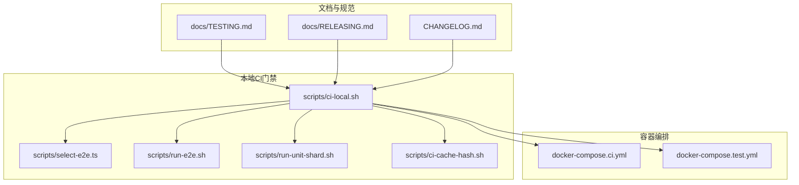
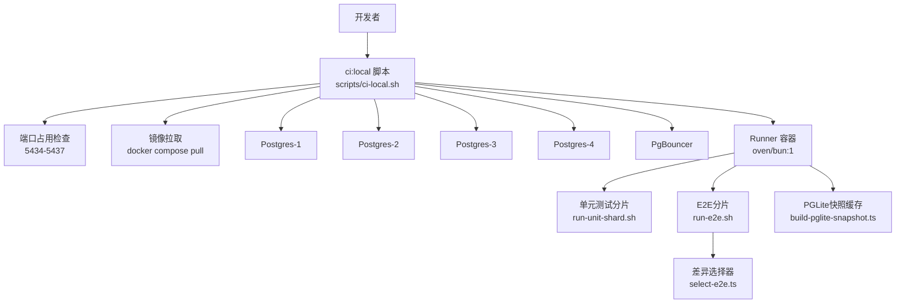
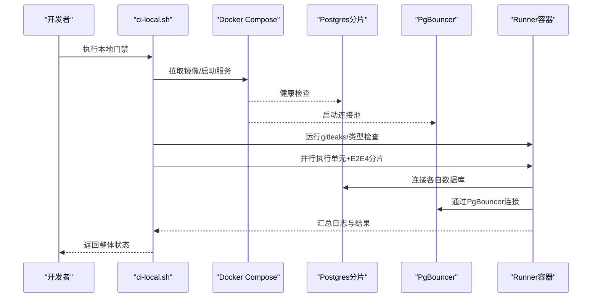
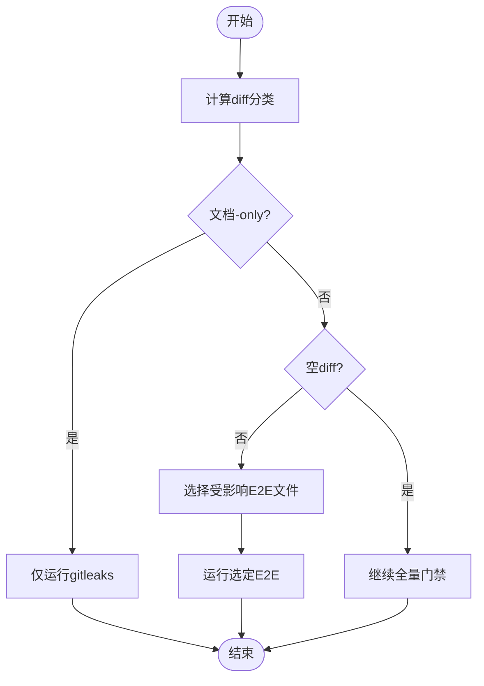
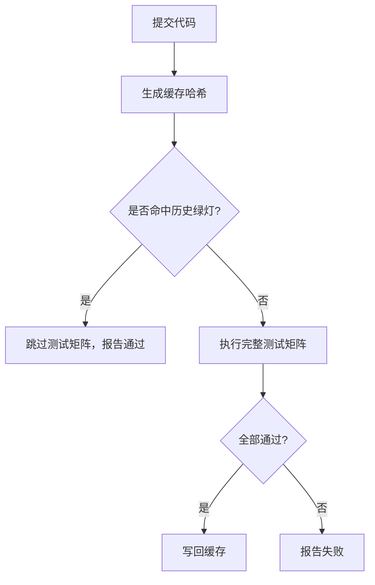
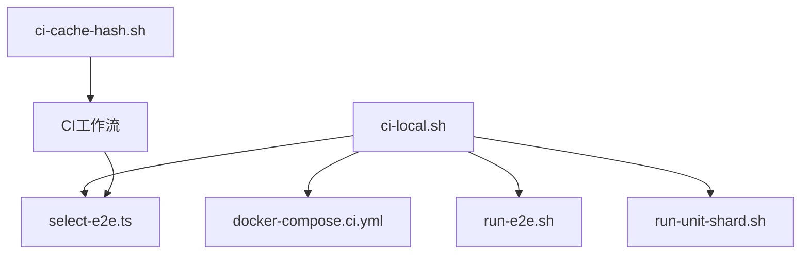

# CI/CD流水线

<cite>
**本文档引用的文件**
- [scripts/ci-local.sh](file://scripts/ci-local.sh)
- [scripts/ci-cache-hash.sh](file://scripts/ci-cache-hash.sh)
- [docker-compose.ci.yml](file://docker-compose.ci.yml)
- [docker-compose.test.yml](file://docker-compose.test.yml)
- [scripts/run-e2e.sh](file://scripts/run-e2e.sh)
- [scripts/run-unit-shard.sh](file://scripts/run-unit-shard.sh)
- [scripts/select-e2e.ts](file://scripts/select-e2e.ts)
- [scripts/build-pglite-snapshot.ts](file://scripts/build-pglite-snapshot.ts)
- [test/scripts/ci-cache-hash.test.ts](file://test/scripts/ci-cache-hash.test.ts)
- [docs/TESTING.md](file://docs/TESTING.md)
- [docs/RELEASING.md](file://docs/RELEASING.md)
- [CHANGELOG.md](file://CHANGELOG.md)
</cite>

## 目录
1. [简介](#简介)
2. [项目结构](#项目结构)
3. [核心组件](#核心组件)
4. [架构总览](#架构总览)
5. [详细组件分析](#详细组件分析)
6. [依赖关系分析](#依赖关系分析)
7. [性能考量](#性能考量)
8. [故障排查指南](#故障排查指南)
9. [结论](#结论)
10. [附录](#附录)

## 简介
本指南面向GBrain项目的CI/CD流水线，系统性说明以下内容：
- GitHub Actions工作流的配置与触发条件
- 本地CI门禁（ci:local）的使用方法与差异感知选择器
- 缓存策略、并行执行与资源管理机制
- Docker容器化部署与多阶段构建配置
- 流水线监控、故障排查与性能优化实践

## 项目结构
围绕CI/CD的关键文件组织如下：
- 本地CI门禁：scripts/ci-local.sh
- 差异感知选择器：scripts/select-e2e.ts
- 运行器与数据库编排：docker-compose.ci.yml、docker-compose.test.yml
- 并行测试与分片：scripts/run-e2e.sh、scripts/run-unit-shard.sh
- 缓存哈希与测试矩阵：scripts/ci-cache-hash.sh、docs/TESTING.md
- 工作流与发布规范：docs/RELEASING.md、CHANGELOG.md 中关于工作流的记录



**图表来源**
- [scripts/ci-local.sh:1-357](file://scripts/ci-local.sh#L1-L357)
- [docker-compose.ci.yml:1-154](file://docker-compose.ci.yml#L1-L154)
- [docker-compose.test.yml:1-15](file://docker-compose.test.yml#L1-L15)
- [scripts/select-e2e.ts](file://scripts/select-e2e.ts)
- [scripts/run-e2e.sh](file://scripts/run-e2e.sh)
- [scripts/run-unit-shard.sh](file://scripts/run-unit-shard.sh)
- [scripts/ci-cache-hash.sh:1-175](file://scripts/ci-cache-hash.sh#L1-L175)
- [docs/TESTING.md](file://docs/TESTING.md)
- [docs/RELEASING.md](file://docs/RELEASING.md)
- [CHANGELOG.md](file://CHANGELOG.md)

**章节来源**
- [scripts/ci-local.sh:1-357](file://scripts/ci-local.sh#L1-L357)
- [docker-compose.ci.yml:1-154](file://docker-compose.ci.yml#L1-L154)
- [docker-compose.test.yml:1-15](file://docker-compose.test.yml#L1-L15)
- [scripts/ci-cache-hash.sh:1-175](file://scripts/ci-cache-hash.sh#L1-L175)
- [docs/TESTING.md](file://docs/TESTING.md)
- [docs/RELEASING.md](file://docs/RELEASING.md)
- [CHANGELOG.md](file://CHANGELOG.md)

## 核心组件
- 本地CI门禁（ci:local）
  - 功能：在本地Docker容器中复现GitHub Actions的门禁流程，支持全量与差异模式；内置4路E2E分片并行、健康检查与日志聚合。
  - 关键特性：差异感知选择器、端口冲突检测、PgBouncer连接池、PGLite快照缓存、工作树Git目录挂载。
- 差异感知选择器（select-e2e.ts）
  - 功能：根据diff分类（文档变更、空diff、源码变更）决定运行哪些E2E用例，实现“文档-only”快速路径跳过重负载测试。
- 缓存策略（ci-cache-hash.sh）
  - 功能：对受测试影响的文件生成确定性哈希，用于CI自动跳过（命中缓存时直接报告通过），避免无谓执行。
- 容器编排（docker-compose.ci.yml、docker-compose.test.yml）
  - 功能：定义4个Postgres实例（分片）、PgBouncer连接池与runner容器，隔离node_modules与bun缓存，提升重复运行性能。
- 并行执行与资源管理
  - 功能：单元测试与E2E按权重分片，xargs -P4并行执行；每个分片独立数据库，避免并发写入竞态。

**章节来源**
- [scripts/ci-local.sh:1-357](file://scripts/ci-local.sh#L1-L357)
- [scripts/select-e2e.ts](file://scripts/select-e2e.ts)
- [scripts/ci-cache-hash.sh:1-175](file://scripts/ci-cache-hash.sh#L1-L175)
- [docker-compose.ci.yml:1-154](file://docker-compose.ci.yml#L1-L154)
- [docker-compose.test.yml:1-15](file://docker-compose.test.yml#L1-L15)

## 架构总览
下图展示本地CI门禁在容器内的执行路径与服务依赖：



**图表来源**
- [scripts/ci-local.sh:1-357](file://scripts/ci-local.sh#L1-L357)
- [docker-compose.ci.yml:1-154](file://docker-compose.ci.yml#L1-L154)
- [scripts/run-unit-shard.sh](file://scripts/run-unit-shard.sh)
- [scripts/run-e2e.sh](file://scripts/run-e2e.sh)
- [scripts/select-e2e.ts](file://scripts/select-e2e.ts)
- [scripts/build-pglite-snapshot.ts](file://scripts/build-pglite-snapshot.ts)

## 详细组件分析

### 本地CI门禁（ci:local）使用指南
- 启动方式
  - 全量门禁：在仓库根目录执行本地脚本，自动拉取镜像、启动4个Postgres分片与PgBouncer、运行gitleaks、类型检查、单元测试与全部E2E。
  - 差异模式：添加--diff参数，先进行diff分类，若为文档-only则仅运行gitleaks快速通过；否则按差异选择E2E集合。
  - 离线调试：--no-pull跳过镜像拉取；--clean清理命名卷；--no-shard关闭分片并串行运行以简化定位问题。
- 端口与健康检查
  - 默认宿主端口5434-5437，分别映射到4个Postgres分片；脚本会检测端口占用与非Docker进程占用，避免冲突。
  - runner等待所有分片健康后继续，超时失败。
- 分片与并行
  - 单元测试与E2E在每个分片内顺序执行，跨分片并行（xargs -P4）。每个分片拥有独立数据库，避免TRUNCATE竞态。
- 日志与摘要
  - 每个分片输出独立日志文件，最终汇总单元/E2E摘要与最后若干行上下文，便于定位失败原因。



**图表来源**
- [scripts/ci-local.sh:1-357](file://scripts/ci-local.sh#L1-L357)
- [docker-compose.ci.yml:1-154](file://docker-compose.ci.yml#L1-L154)

**章节来源**
- [scripts/ci-local.sh:1-357](file://scripts/ci-local.sh#L1-L357)
- [docker-compose.ci.yml:1-154](file://docker-compose.ci.yml#L1-L154)

### 差异感知选择器（select-e2e.ts）
- 分类逻辑
  - 文档-only：跳过E2E，仅运行gitleaks。
  - 空diff：按闭合契约继续全量门禁。
  - 源码变更：基于diff选择受影响的E2E文件集合。
- 与本地门禁集成
  - 在差异模式下，脚本调用选择器生成待运行列表；若为空则跳过E2E阶段。
- 与CI工作流联动
  - CI工作流通过缓存哈希判断是否跳过测试矩阵，差异感知选择器确保本地与CI行为一致。



**图表来源**
- [scripts/ci-local.sh:60-86](file://scripts/ci-local.sh#L60-L86)
- [scripts/select-e2e.ts](file://scripts/select-e2e.ts)

**章节来源**
- [scripts/ci-local.sh:60-86](file://scripts/ci-local.sh#L60-L86)
- [scripts/select-e2e.ts](file://scripts/select-e2e.ts)

### 缓存策略与自动跳过
- 缓存哈希（ci-cache-hash.sh）
  - 对受测试影响的文件生成确定性哈希，排除纯文档类文件；对关键政策文档保留例外重收。
  - 输出格式为16字符十六进制前缀，作为CI缓存键的组成部分。
- CI工作流中的应用
  - 工作流首先进入cache-check作业，使用actions/cache/restore按哈希查找历史绿灯记录；若命中则跳过测试矩阵，直接报告通过。
  - 未命中时依次运行gitleaks、verify、serial-tests、test（6路分片矩阵），全部成功后写回缓存。
- 测试保障
  - 提供单元测试覆盖关键失效点（如修改工作流文件应导致哈希变化），确保缓存契约稳定。



**图表来源**
- [scripts/ci-cache-hash.sh:1-175](file://scripts/ci-cache-hash.sh#L1-L175)
- [test/scripts/ci-cache-hash.test.ts:221-264](file://test/scripts/ci-cache-hash.test.ts#L221-L264)
- [CHANGELOG.md](file://CHANGELOG.md)

**章节来源**
- [scripts/ci-cache-hash.sh:1-175](file://scripts/ci-cache-hash.sh#L1-L175)
- [test/scripts/ci-cache-hash.test.ts:221-264](file://test/scripts/ci-cache-hash.test.ts#L221-L264)
- [CHANGELOG.md](file://CHANGELOG.md)

### 并行执行与资源管理
- 分片策略
  - 单元测试与E2E按权重进行LPT（最长处理时间）分片，确保各分片负载均衡；慢文件单独作业，避免拖累矩阵。
  - 本地门禁同样采用4路分片并行（xargs -P4），每片独立数据库，避免并发写入冲突。
- 资源隔离
  - 使用命名卷隔离Postgres数据、node_modules与bun安装缓存，减少主机与容器间的二进制不兼容风险。
  - PgBouncer以事务池模式前置，模拟生产拓扑，降低连接池相关回归风险。
- 资源占用控制
  - 本地门禁在启动runner前安装git并设置安全目录，避免容器内git命令因权限或工作树导致失败。

```mermaid
graph LR
subgraph "分片并行"
S1["分片1"]
S2["分片2"]
S3["分片3"]
S4["分片4"]
end
U["单元测试"] --> S1
U --> S2
U --> S3
U --> S4
E["E2E测试"] --> S1
E --> S2
E --> S3
E --> S4
DB1["Postgres-1"] <- --> S1
DB2["Postgres-2"] <- --> S2
DB3["Postgres-3"] <- --> S3
DB4["Postgres-4"] <- --> S4
```

**图表来源**
- [scripts/ci-local.sh:249-307](file://scripts/ci-local.sh#L249-L307)
- [docker-compose.ci.yml:1-154](file://docker-compose.ci.yml#L1-L154)

**章节来源**
- [scripts/ci-local.sh:249-307](file://scripts/ci-local.sh#L249-L307)
- [docker-compose.ci.yml:1-154](file://docker-compose.ci.yml#L1-L154)

### Docker容器化与多阶段构建
- 本地门禁容器
  - 使用oven/bun:1作为runner基础镜像，绑定仓库目录，隔离node_modules与bun缓存，提升后续运行速度。
  - 通过named volumes持久化Postgres数据，避免每次重建。
- 多阶段思路
  - 当前本地门禁使用预构建镜像（image:），未见自定义Dockerfile；建议在CI中引入多阶段构建以优化镜像体积与构建时间，例如：
    - 阶段1：安装依赖与构建产物
    - 阶段2：仅复制必要文件到最小运行时镜像
  - 该建议为通用实践，具体实施需结合项目实际构建需求与安全基线。

**章节来源**
- [docker-compose.ci.yml:122-146](file://docker-compose.ci.yml#L122-L146)
- [docker-compose.test.yml:1-15](file://docker-compose.test.yml#L1-L15)

### GitHub Actions工作流配置与触发条件
- 工作流概览
  - 测试工作流（test.yml）采用七步作业：cache-check（命中则跳过）、gitleaks、verify、serial-tests、test（6路分片矩阵）、cache-write（全部通过后写回）、test-status（聚合报告）。
  - 夜间与可选重型测试（heavy-tests.yml）按计划与标签触发，包含Postgres服务与失败时的产物上传。
- 触发条件
  - 支持pull_request、workflow_dispatch、schedule等事件；部分作业通过if条件限制在特定场景运行。
- 安全与合规
  - 所有工作流动作均固定到commit SHA，防止供应链攻击；actionlint在工作流变更时进行静态校验。

**章节来源**
- [docs/RELEASING.md:352](file://docs/RELEASING.md#L352)
- [docs/RELEASING.md:357](file://docs/RELEASING.md#L357)
- [CHANGELOG.md](file://CHANGELOG.md)

## 依赖关系分析
- 组件耦合
  - ci-local.sh高度依赖docker-compose.ci.yml的服务定义与runner环境；与select-e2e.ts、run-e2e.sh、run-unit-shard.sh形成端到端闭环。
  - 缓存哈希脚本与CI工作流通过共享的文件集与规则保持一致性。
- 外部依赖
  - Docker Compose、Postgres（pgvector）、PgBouncer、bun运行时。
- 循环依赖
  - 未发现循环依赖；脚本间为单向调用关系。



**图表来源**
- [scripts/ci-local.sh:1-357](file://scripts/ci-local.sh#L1-L357)
- [docker-compose.ci.yml:1-154](file://docker-compose.ci.yml#L1-L154)
- [scripts/select-e2e.ts](file://scripts/select-e2e.ts)
- [scripts/run-e2e.sh](file://scripts/run-e2e.sh)
- [scripts/run-unit-shard.sh](file://scripts/run-unit-shard.sh)
- [scripts/ci-cache-hash.sh:1-175](file://scripts/ci-cache-hash.sh#L1-L175)

**章节来源**
- [scripts/ci-local.sh:1-357](file://scripts/ci-local.sh#L1-L357)
- [scripts/ci-cache-hash.sh:1-175](file://scripts/ci-cache-hash.sh#L1-L175)

## 性能考量
- 分片与并行
  - 本地门禁使用xargs -P4并行执行4个分片；CI工作流采用6路分片矩阵，配合权重感知分片，缩短整体耗时。
- 缓存跳过
  - 通过ci-cache-hash.sh生成的哈希命中历史绿灯，避免重复执行测试矩阵，显著降低PR重试与rebase成本。
- 资源隔离
  - named volumes隔离node_modules与bun缓存，减少容器重建与网络依赖；PgBouncer事务池降低连接开销。
- I/O与存储
  - Postgres使用named volumes持久化数据，避免频繁初始化；runner容器绑定仓库目录，减少重复下载。

**章节来源**
- [scripts/ci-local.sh:249-307](file://scripts/ci-local.sh#L249-L307)
- [scripts/ci-cache-hash.sh:1-175](file://scripts/ci-cache-hash.sh#L1-L175)
- [docker-compose.ci.yml:147-154](file://docker-compose.ci.yml#L147-L154)

## 故障排查指南
- 端口冲突
  - 症状：启动时报错提示宿主端口被占用。
  - 排查：确认5434-5437范围内是否存在Docker容器或非Docker进程占用；可通过GBRAIN_CI_PG_PORT调整基座端口。
- runner容器权限与git
  - 症状：git命令在容器内返回错误或无法识别仓库。
  - 排查：本地门禁会在首次运行时安装git并设置安全目录；若仍失败，检查工作树gitdir挂载与权限。
- 分片失败定位
  - 症状：某一分片失败但其他分片通过。
  - 排查：查看/tmp/shard-logs下的对应分片日志，关注单元与E2E摘要行与最后若干行上下文。
- PgBouncer连接问题
  - 症状：连接被拒绝或认证失败。
  - 排查：确认AUTH_TYPE为plain且忽略参数白名单包含statement_timeout等；检查DB_HOST与端口映射。
- 缓存误跳过
  - 症状：修改了关键文件但CI跳过测试。
  - 排查：确认ci-cache-hash.sh的deny/allow规则是否正确；必要时在测试中增加断言验证缓存契约。

**章节来源**
- [scripts/ci-local.sh:92-105](file://scripts/ci-local.sh#L92-L105)
- [scripts/ci-local.sh:330-350](file://scripts/ci-local.sh#L330-L350)
- [scripts/ci-local.sh:286-307](file://scripts/ci-local.sh#L286-L307)
- [docker-compose.ci.yml:96-121](file://docker-compose.ci.yml#L96-L121)
- [scripts/ci-cache-hash.sh:19-40](file://scripts/ci-cache-hash.sh#L19-L40)

## 结论
GBrain的CI/CD体系通过本地门禁与云端工作流协同，实现了：
- 强大的差异感知与快速路径，大幅缩短PR反馈周期；
- 可靠的缓存跳过机制，避免无效执行；
- 高效的分片并行与资源隔离，兼顾稳定性与性能；
- 完善的容器化与连接池配置，贴近生产环境。

建议持续维护缓存哈希规则与工作流动作版本，确保安全与可靠性。

## 附录
- 术语
  - 分片：将测试任务拆分为多个子集并行执行的策略。
  - PgBouncer：连接池中间件，用于事务级连接复用与压力缓解。
  - named volumes：Docker命名卷，用于持久化容器内数据与缓存。
- 参考文档
  - 测试矩阵与分片策略：docs/TESTING.md
  - 工作流固定SHA与安全规范：docs/RELEASING.md
  - 工作流演进与缓存契约：CHANGELOG.md