# 代码审查

<cite>
**本文引用的文件**
- [CONTRIBUTING.md](file://CONTRIBUTING.md)
- [README.md](file://README.md)
- [package.json](file://package.json)
- [scripts/run-verify-parallel.sh](file://scripts/run-verify-parallel.sh)
- [scripts/check-privacy.sh](file://scripts/check-privacy.sh)
- [scripts/check-jsonb-pattern.sh](file://scripts/check-jsonb-pattern.sh)
- [scripts/check-progress-to-stdout.sh](file://scripts/check-progress-to-stdout.sh)
- [scripts/check-test-isolation.sh](file://scripts/check-test-isolation.sh)
- [scripts/check-wasm-embedded.sh](file://scripts/check-wasm-embedded.sh)
- [scripts/check-admin-build.sh](file://scripts/check-admin-build.sh)
- [scripts/check-trailing-newline.sh](file://scripts/check-trailing-newline.sh)
- [scripts/check-exports-count.sh](file://scripts/check-exports-count.sh)
</cite>

## 目录
1. [简介](#简介)
2. [项目结构](#项目结构)
3. [核心组件](#核心组件)
4. [架构总览](#架构总览)
5. [详细组件分析](#详细组件分析)
6. [依赖关系分析](#依赖关系分析)
7. [性能考量](#性能考量)
8. [故障排查指南](#故障排查指南)
9. [结论](#结论)
10. [附录](#附录)

## 简介
本指南面向在 GBrain 仓库进行代码审查的工程师与审阅者，系统化说明从 PR 创建、代码审查到合并的标准化流程；文档化预推送门禁（pre-push gate）与本地 CI 流水线的配置要求；解释隐私检查、JSONB 模式检查、进度输出检查等自动化审查规则；提供代码风格与命名约定、架构一致性检查要点；并给出常见审查问题的解决方案与最佳实践。

## 项目结构
- 核心源码位于 src/，测试位于 test/，技能包位于 skills/，文档位于 docs/，管理端前端位于 admin/。
- 审查流水线通过 package.json 的 scripts 统一编排，verify 阶段并行执行 19+ 个子检查，确保在推送前捕获常见风险。
- 本地 CI 可通过 ci:local 脚本在 Docker 环境中完整复现 PR 在 CI 上运行的测试集。

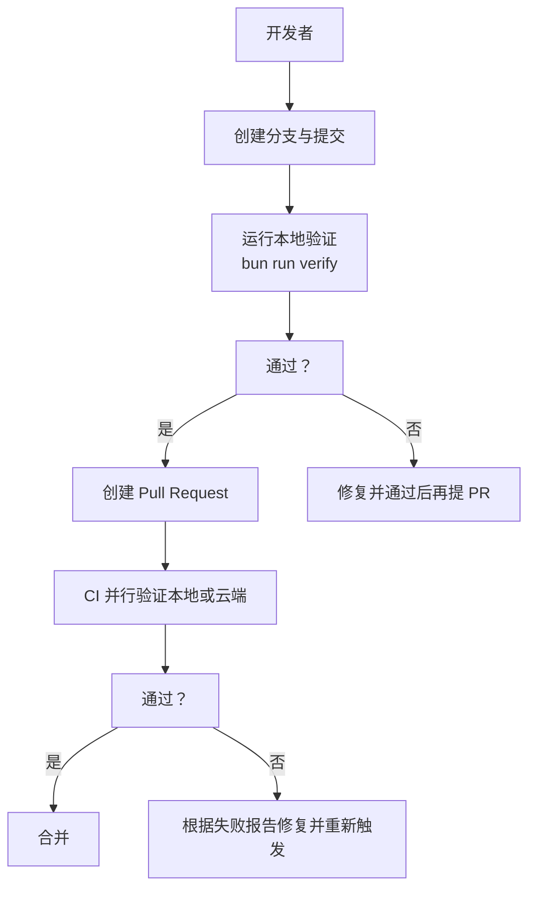

章节来源
- [CONTRIBUTING.md:52-76](file://CONTRIBUTING.md#L52-L76)
- [README.md:428-435](file://README.md#L428-L435)

## 核心组件
- 预推送门禁（Pre-push Gate）
  - 通过 bun run verify 执行并行验证，覆盖隐私、JSONB 模式、进度输出、测试隔离、WASM 嵌入、管理员构建、解析器一致性等。
  - 该阶段与 CI 第一阶段一致，确保问题在推送前被发现。
- 本地 CI（推荐）
  - 通过 bun run ci:local 在 Docker 中启动 Postgres + pgvector，顺序运行 gitleaks、单元测试与全部 E2E，适合在本地完整复现 PR 的 CI 行为。
- CI 并行验证调度器
  - scripts/run-verify-parallel.sh 将多个检查并行执行，支持超时控制、日志目录、失败聚合与摘要输出，显著缩短验证时间。

章节来源
- [CONTRIBUTING.md:59-89](file://CONTRIBUTING.md#L59-L89)
- [CONTRIBUTING.md:148-164](file://CONTRIBUTING.md#L148-L164)
- [scripts/run-verify-parallel.sh:1-203](file://scripts/run-verify-parallel.sh#L1-L203)

## 架构总览
下图展示 PR 提交后从本地验证到 CI 的整体流程，以及关键自动化检查如何拦截问题。

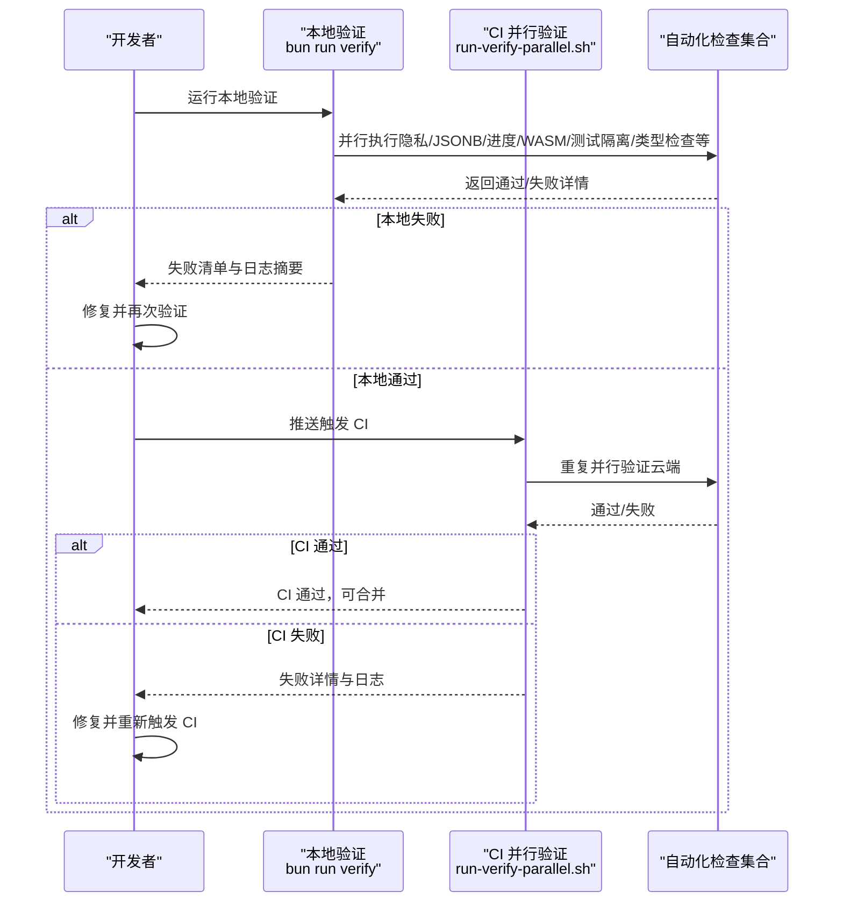

图表来源
- [scripts/run-verify-parallel.sh:36-67](file://scripts/run-verify-parallel.sh#L36-L67)
- [CONTRIBUTING.md:59-89](file://CONTRIBUTING.md#L59-L89)

章节来源
- [scripts/run-verify-parallel.sh:107-149](file://scripts/run-verify-parallel.sh#L107-L149)
- [CONTRIBUTING.md:59-89](file://CONTRIBUTING.md#L59-L89)

## 详细组件分析

### 预推送门禁与 CI 并行验证调度器
- 设计目标
  - 将原本串行的验证步骤改为并行，缩短验证时间；统一本地与 CI 的验证内容，减少“本地能过、CI 不过”的差异。
- 关键特性
  - 支持超时控制（默认 120 秒/检查），失败时输出最后若干行日志便于定位。
  - 每个检查独立日志文件与退出码文件，避免 wait 的聚合值误导。
  - 可通过环境变量调整超时与日志目录，便于调试与集成。
- 典型失败场景
  - 某个检查超时：会标注 TIMED OUT。
  - 检查返回非零退出码：会输出该检查名称与日志尾部。
- 最佳实践
  - 优先修复高优先级失败项（如隐私泄漏、JSONB 模式错误、测试隔离违规），这些通常影响范围广且难以回溯。

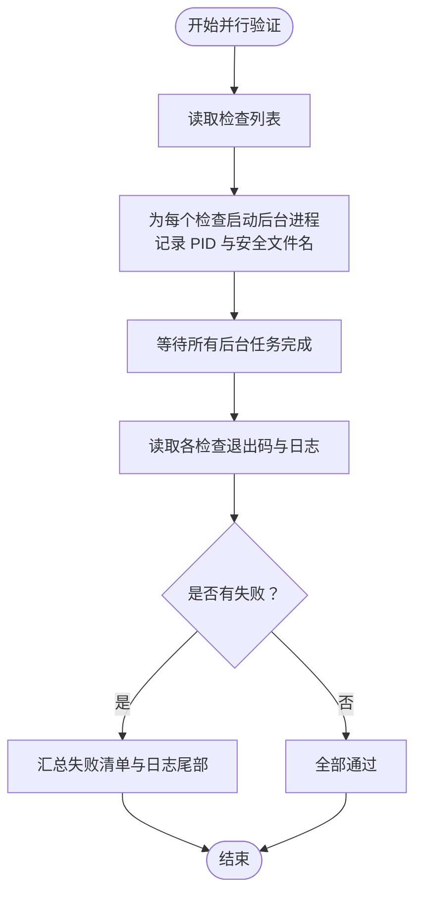

图表来源
- [scripts/run-verify-parallel.sh:118-185](file://scripts/run-verify-parallel.sh#L118-L185)

章节来源
- [scripts/run-verify-parallel.sh:15-23](file://scripts/run-verify-parallel.sh#L15-L23)
- [scripts/run-verify-parallel.sh:107-149](file://scripts/run-verify-parallel.sh#L107-L149)

### 隐私检查（check-privacy.sh）
- 目标
  - 禁止在公共制品中出现受保护的 fork 名称及其特定路径，防止泄露内部上下文。
- 覆盖范围
  - 受检文件包括 CHANGELOG.md、README.md、docs/**、skills/**、src/**、test/**、scripts/**。
  - 允许列表包含文档自身、升级指南、历史冻结文件、测试用例等“元规则”场景。
- 常见违规
  - 在源码注释、文档、技能描述中直接使用禁止名称或路径。
- 修复建议
  - 使用通用占位符替换（如“your OpenClaw”、“openclaw-reference”）；若确需提及，放入允许列表并添加理由注释。

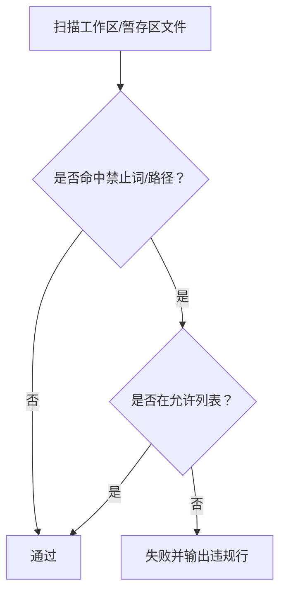

图表来源
- [scripts/check-privacy.sh:33-208](file://scripts/check-privacy.sh#L33-L208)

章节来源
- [scripts/check-privacy.sh:16-25](file://scripts/check-privacy.sh#L16-L25)
- [scripts/check-privacy.sh:97-171](file://scripts/check-privacy.sh#L97-L171)

### JSONB 模式检查（check-jsonb-pattern.sh）
- 目标
  - 拦截将 JSON 字符串直接插入 JSONB 列导致的数据类型不一致问题（历史上曾导致静默数据丢失）。
- 规则
  - 禁止模板字符串形式的 `${JSON.stringify(x)}::jsonb`。
  - 同时检查 schema 源文件中的 max_stalled 默认值，必须为 5 以保证 SIGKILL 救援能力。
- 修复建议
  - 使用 postgres.js 的 sql.json(x) 进行序列化；确保 schema 中 DEFAULT 为 5。

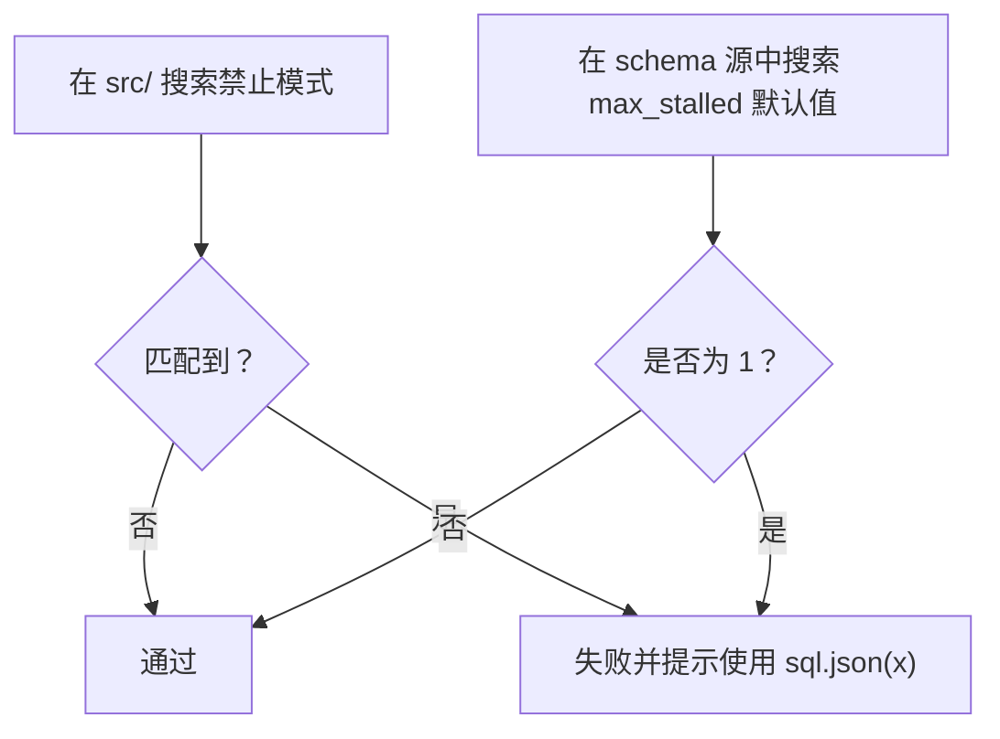

图表来源
- [scripts/check-jsonb-pattern.sh:20-46](file://scripts/check-jsonb-pattern.sh#L20-L46)

章节来源
- [scripts/check-jsonb-pattern.sh:1-13](file://scripts/check-jsonb-pattern.sh#L1-L13)

### 进度输出检查（check-progress-to-stdout.sh）
- 目标
  - 禁止在 stdout 输出 \r 进度，避免破坏管道输出与 CI 日志可读性。
- 规则
  - 仅允许通过共享的 progress.ts 写入 stderr；历史允许列表为空，v0.14.2 已移除所有历史用法。
- 修复建议
  - 将进度输出迁移到 progress.ts；如确有需要在 stdout 输出 \r，需在脚本顶部允许列表中添加并注明原因。

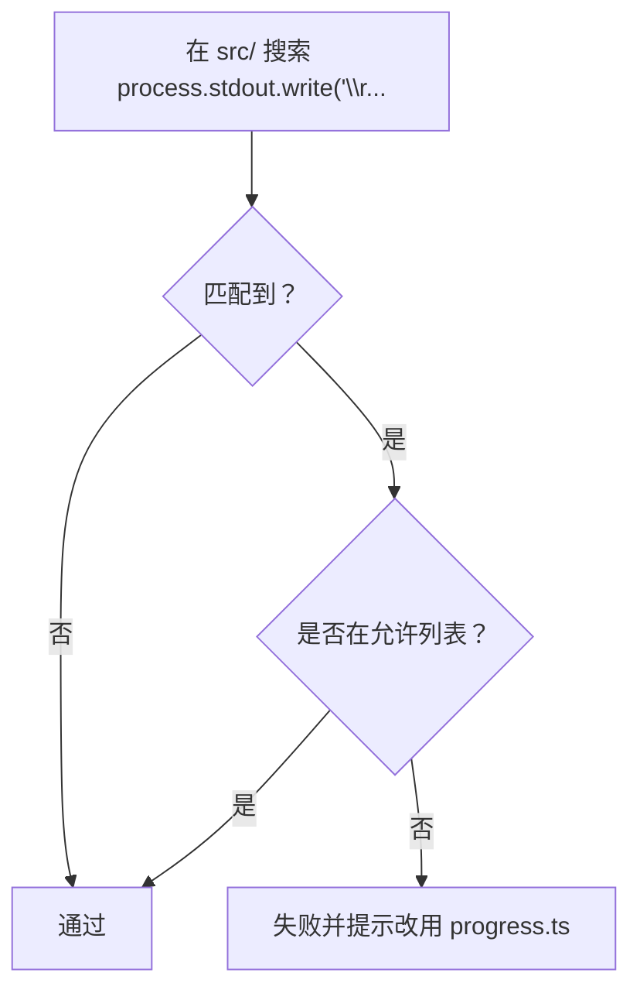

图表来源
- [scripts/check-progress-to-stdout.sh:24-61](file://scripts/check-progress-to-stdout.sh#L24-L61)

章节来源
- [scripts/check-progress-to-stdout.sh:1-17](file://scripts/check-progress-to-stdout.sh#L1-L17)

### 测试隔离检查（check-test-isolation.sh）
- 目标
  - 防止并行测试文件间因进程全局状态泄漏导致的隐性失败。
- 四条规则（R1–R4）
  - R1：禁止直接修改 process.env；使用 withEnv 或重命名为 *.serial.test.ts。
  - R2：禁止在文件内使用 mock.module(...)；重命名为 *.serial.test.ts。
  - R3：PGLiteEngine 实例必须在 beforeAll(...) 后约 50 行内创建。
  - R4：创建 PGLiteEngine 的文件必须在 afterAll 中断开连接。
- 修复建议
  - 使用 withEnv 包裹环境变更；遵循 PGLite 标准初始化块；将易污染的文件转为 *.serial.test.ts。

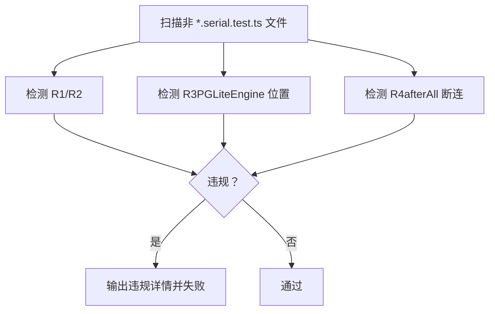

图表来源
- [scripts/check-test-isolation.sh:8-36](file://scripts/check-test-isolation.sh#L8-L36)
- [scripts/check-test-isolation.sh:100-134](file://scripts/check-test-isolation.sh#L100-L134)

章节来源
- [scripts/check-test-isolation.sh:1-36](file://scripts/check-test-isolation.sh#L1-L36)

### WASM 嵌入检查（check-wasm-embedded.sh）
- 目标
  - 确保编译后的二进制正确嵌入 tree-sitter WASM，生成真实语义分块而非回退到递归分块。
- 规则
  - 编译最小化二进制；运行后检查输出包含符号名、TypeScript 语言头、特定函数节点。
- 修复建议
  - 若失败，检查 WASM 资源路径与导入属性；确认 tree-sitter 语法加载正常。

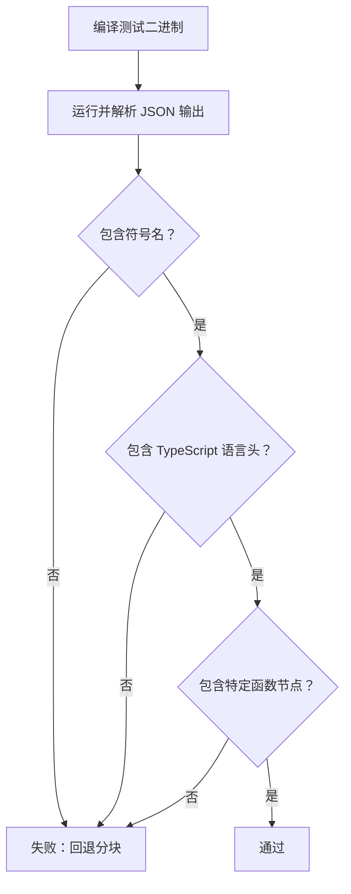

图表来源
- [scripts/check-wasm-embedded.sh:25-60](file://scripts/check-wasm-embedded.sh#L25-L60)

章节来源
- [scripts/check-wasm-embedded.sh:1-15](file://scripts/check-wasm-embedded.sh#L1-L15)

### 管理端构建检查（check-admin-build.sh）
- 目标
  - 确保管理端 React 应用可成功构建，捕获类型错误与缺失符号等。
- 规则
  - 在 admin/ 目录安装依赖并执行构建；可通过 GBRAIN_SKIP_ADMIN_BUILD=1 跳过。
- 修复建议
  - 修正 TS 错误、缺失导出或打包错误；必要时检查依赖版本与构建配置。

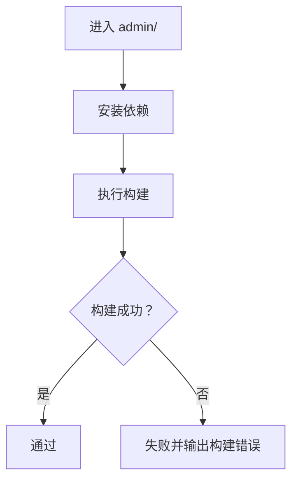

图表来源
- [scripts/check-admin-build.sh:16-35](file://scripts/check-admin-build.sh#L16-L35)

章节来源
- [scripts/check-admin-build.sh:1-14](file://scripts/check-admin-build.sh#L1-L14)

### 尾随换行检查（check-trailing-newline.sh）
- 目标
  - 强制所有文本文件以换行结尾，避免编辑器差异与 linter 报错。
- 规则
  - 检查 src/、test/ 与根目录指定的 yml/md 文件；空文件跳过。
- 修复建议
  - 为缺失尾随换行的文件追加换行。

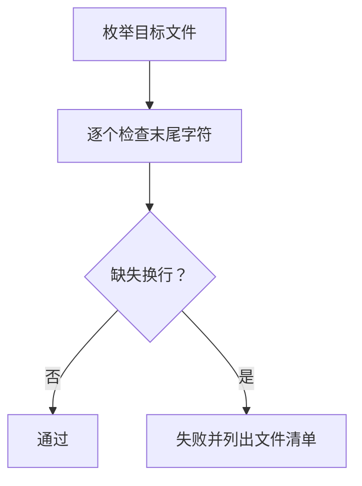

图表来源
- [scripts/check-trailing-newline.sh:15-44](file://scripts/check-trailing-newline.sh#L15-L44)

章节来源
- [scripts/check-trailing-newline.sh:1-8](file://scripts/check-trailing-newline.sh#L1-L8)

### 公共导出数量检查（check-exports-count.sh）
- 目标
  - 保护公共 API 表面不被静默缩减，避免破坏性变更。
- 规则
  - 对比 package.json 中 exports 的键数量；低于基线则失败；高于基线需同步更新测试校验。
- 修复建议
  - 如确需删除导出，按策略提升版本并在测试中锁定新符号。

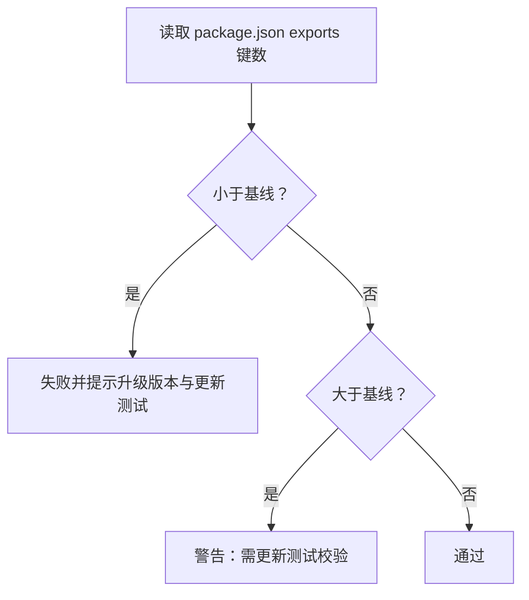

图表来源
- [scripts/check-exports-count.sh:22-48](file://scripts/check-exports-count.sh#L22-L48)

章节来源
- [scripts/check-exports-count.sh:1-18](file://scripts/check-exports-count.sh#L1-L18)

## 依赖关系分析
- 验证脚本与 package.json 的映射
  - package.json 的 scripts.check:* 与 scripts.run-verify-parallel.sh 的 CHECKS 数组一一对应，确保本地与 CI 的验证内容一致。
- 并行验证的耦合与内聚
  - run-verify-parallel.sh 作为调度器，内聚了超时、日志、聚合等横切关注点；各检查脚本保持独立，内聚各自规则，耦合度低。
- 外部依赖
  - Docker（用于本地 CI）、gitleaks（用于敏感信息扫描）、Git/Grep/rg（用于静态分析）。

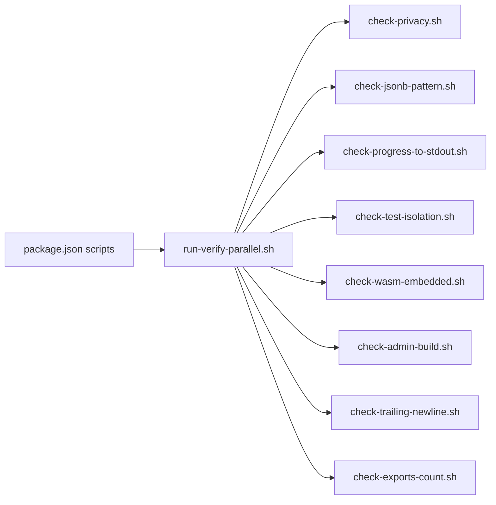

图表来源
- [package.json:44-81](file://package.json#L44-L81)
- [scripts/run-verify-parallel.sh:36-67](file://scripts/run-verify-parallel.sh#L36-L67)

章节来源
- [package.json:44-81](file://package.json#L44-L81)
- [scripts/run-verify-parallel.sh:36-67](file://scripts/run-verify-parallel.sh#L36-L67)

## 性能考量
- 并行验证显著缩短验证时间：将原本约 15–25 秒的串行检查压缩至 3–5 秒。
- 超时控制：默认每检查 120 秒，避免个别慢检查阻塞整体；可在 CI 中通过环境变量调整。
- 日志与失败聚合：仅输出失败检查的最后若干行日志，降低日志体积与定位成本。

章节来源
- [scripts/run-verify-parallel.sh:8-18](file://scripts/run-verify-parallel.sh#L8-L18)
- [scripts/run-verify-parallel.sh:175-199](file://scripts/run-verify-parallel.sh#L175-L199)

## 故障排查指南
- 隐私检查失败
  - 现象：提示在某文件中发现禁止名称或路径。
  - 处理：替换为通用占位符；若确属允许场景，将文件加入允许列表并补充注释。
- JSONB 模式失败
  - 现象：提示存在 `${JSON.stringify(x)}::jsonb` 模式或 max_stalled 默认值为 1。
  - 处理：改用 sql.json(x)，并将默认值改为 5。
- 进度输出失败
  - 现象：在 stdout 发现 \r 进度输出。
  - 处理：迁移到 progress.ts；如确需保留，添加允许列表并说明原因。
- 测试隔离失败
  - 现象：R1–R4 任一违规。
  - 处理：使用 withEnv；将易污染文件重命名为 *.serial.test.ts；遵循 PGLite 初始化标准；确保 afterAll 断连。
- WASM 嵌入失败
  - 现象：编译二进制无法提取符号名或缺少 TypeScript 语言头。
  - 处理：检查 WASM 资源路径与导入属性；确保语法加载正常。
- 管理端构建失败
  - 现象：TypeScript 类型错误或打包失败。
  - 处理：修正 TS 错误与缺失导出；必要时调整依赖版本。
- 尾随换行失败
  - 现象：某些文件缺失换行。
  - 处理：为文件追加换行。
- 公共导出数量失败
  - 现象：exports 键数量低于/高于基线。
  - 处理：按策略提升版本并更新测试校验。

章节来源
- [scripts/check-privacy.sh:190-215](file://scripts/check-privacy.sh#L190-L215)
- [scripts/check-jsonb-pattern.sh:24-46](file://scripts/check-jsonb-pattern.sh#L24-L46)
- [scripts/check-progress-to-stdout.sh:41-61](file://scripts/check-progress-to-stdout.sh#L41-L61)
- [scripts/check-test-isolation.sh:83-152](file://scripts/check-test-isolation.sh#L83-L152)
- [scripts/check-wasm-embedded.sh:41-60](file://scripts/check-wasm-embedded.sh#L41-L60)
- [scripts/check-admin-build.sh:31-35](file://scripts/check-admin-build.sh#L31-L35)
- [scripts/check-trailing-newline.sh:35-42](file://scripts/check-trailing-newline.sh#L35-L42)
- [scripts/check-exports-count.sh:31-46](file://scripts/check-exports-count.sh#L31-L46)

## 结论
通过预推送门禁与并行验证调度器，GBrain 将审查门槛前移至开发者本地，结合严格的自动化检查（隐私、JSONB、进度、测试隔离、WASM、管理端构建、导出数量等），有效降低了回归风险与 CI 失败率。建议在 PR 创建阶段即运行本地验证并通过后再提交；CI 失败时优先处理高优先级失败项，并在允许范围内使用允许列表与环境变量进行微调。

## 附录
- 术语
  - 预推送门禁：在推送前于本地执行的验证集合，确保问题尽早暴露。
  - 解析器一致性：技能与解析器之间的字段与行为一致性，避免运行期不匹配。
- 参考
  - 本地 CI：bun run ci:local（需 Docker 与 gitleaks）
  - 本地验证：bun run verify（并行执行 19+ 检查）
  - 项目贡献指南：CONTRIBUTING.md
  - 项目总览与贡献入口：README.md

章节来源
- [CONTRIBUTING.md:59-89](file://CONTRIBUTING.md#L59-L89)
- [README.md:428-435](file://README.md#L428-L435)