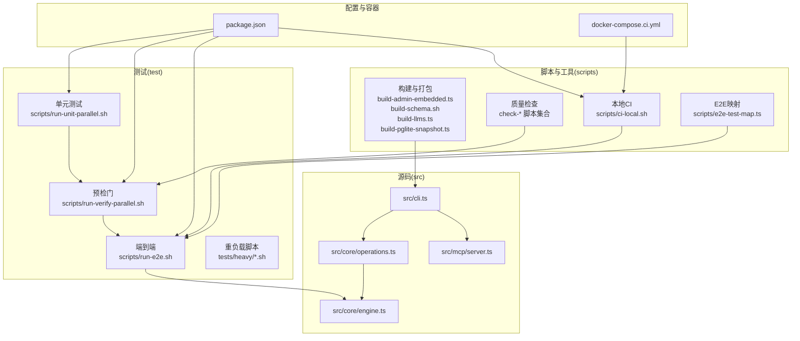
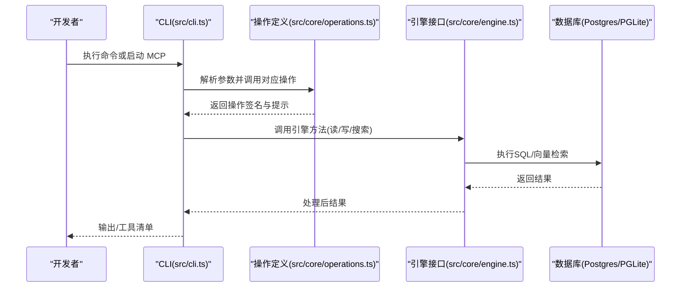

# 开发流程

<cite>
**本文引用的文件**
- [README.md](file://README.md)
- [CONTRIBUTING.md](file://CONTRIBUTING.md)
- [INSTALL_FOR_AGENTS.md](file://INSTALL_FOR_AGENTS.md)
- [docs/TESTING.md](file://docs/TESTING.md)
- [package.json](file://package.json)
- [docker-compose.ci.yml](file://docker-compose.ci.yml)
- [.github/ISSUE_TEMPLATE/bug_report.md](file://.github/ISSUE_TEMPLATE/bug_report.md)
- [.github/ISSUE_TEMPLATE/feature_request.md](file://.github/ISSUE_TEMPLATE/feature_request.md)
- [src/core/engine.ts](file://src/core/engine.ts)
- [src/core/operations.ts](file://src/core/operations.ts)
- [src/cli.ts](file://src/cli.ts)
- [src/mcp/server.ts](file://src/mcp/server.ts)
- [scripts/run-unit-parallel.sh](file://scripts/run-unit-parallel.sh)
- [scripts/run-verify-parallel.sh](file://scripts/run-verify-parallel.sh)
- [scripts/run-e2e.sh](file://scripts/run-e2e.sh)
- [scripts/ci-local.sh](file://scripts/ci-local.sh)
- [scripts/e2e-test-map.ts](file://scripts/e2e-test-map.ts)
- [scripts/check-test-isolation.sh](file://scripts/check-test-isolation.sh)
- [scripts/check-resolvable.sh](file://scripts/check-resolvable.sh)
- [scripts/build-admin-embedded.ts](file://scripts/build-admin-embedded.ts)
- [scripts/build-schema.sh](file://scripts/build-schema.sh)
- [scripts/build-llms.ts](file://scripts/build-llms.ts)
- [scripts/build-pglite-snapshot.ts](file://scripts/build-pglite-snapshot.ts)
- [scripts/smoke-test.sh](file://scripts/smoke-test.sh)
- [scripts/check-privacy.sh](file://scripts/check-privacy.sh)
- [scripts/check-jsonb-pattern.sh](file://scripts/check-jsonb-pattern.sh)
- [scripts/check-progress-to-stdout.sh](file://scripts/check-progress-to-stdout.sh)
- [scripts/check-wasm-embedded.sh](file://scripts/check-wasm-embedded.sh)
- [scripts/check-admin-build.sh](file://scripts/check-admin-build.sh)
- [scripts/check-admin-embedded.sh](file://scripts/check-admin-embedded.sh)
- [scripts/check-exports-count.sh](file://scripts/check-exports-count.sh)
- [scripts/check-admin-scope-drift.sh](file://scripts/check-admin-scope-drift.sh)
- [scripts/check-cli-executable.sh](file://scripts/check-cli-executable.sh)
- [scripts/check-skill-brain-first.sh](file://scripts/check-skill-brain-first.sh)
- [scripts/check-operations-filter-bypass.sh](file://scripts/check-operations-filter-bypass.sh)
- [scripts/check-gateway-routed-no-direct-anthropic.sh](file://scripts/check-gateway-routed-no-direct-anthropic.sh)
- [scripts/check-worker-pool-atomicity.sh](file://scripts/check-worker-pool-atomicity.sh)
- [scripts/check-key-files-current-state.sh](file://scripts/check-key-files-current-state.sh)
- [scripts/check-no-double-retry.sh](file://scripts/check-no-double-retry.sh)
- [scripts/check-batch-audit-site.sh](file://scripts/check-batch-audit-site.sh)
- [scripts/check-eval-glossary-fresh.sh](file://scripts/check-eval-glossary-fresh.sh)
- [scripts/check-fixture-privacy.sh](file://scripts/check-fixture-privacy.sh)
- [scripts/check-source-config-leak.sh](file://scripts/check-source-config-leak.sh)
- [scripts/check-proposal-pii.sh](file://scripts/check-proposal-pii.sh)
- [scripts/check-test-real-names.sh](file://scripts/check-test-real-names.sh)
- [scripts/check-trailing-newline.sh](file://scripts/check-trailing-newline.sh)
- [scripts/check-no-legacy-getconnection.sh](file://scripts/check-no-legacy-getconnection.sh)
- [scripts/check-source-id-projection.sh](file://scripts/check-source-id-projection.sh)
- [scripts/check-synthetic-corpus-privacy.sh](file://scripts/check-synthetic-corpus-privacy.sh)
- [scripts/check-no-pii-agent-voice.sh](file://scripts/check-no-pii-agent-voice.sh)
- [scripts/check-system-of-record.sh](file://scripts/check-system-of-record.sh)
- [scripts/check-source-scope-onboard.sh](file://scripts/check-source-scope-onboard.sh)
- [scripts/check-worker-lock-renewal-shape.sh](file://scripts/check-worker-lock-renewal-shape.sh)
- [scripts/check-fuzz-purity.sh](file://scripts/check-fuzz-purity.sh)
- [scripts/check-eval-glossary-fresh.sh](file://scripts/check-eval-glossary-fresh.sh)
- [scripts/check-fixture-privacy.sh](file://scripts/check-fixture-privacy.sh)
- [scripts/check-source-config-leak.sh](file://scripts/check-source-config-leak.sh)
- [scripts/check-proposal-pii.sh](file://scripts/check-proposal-pii.sh)
- [scripts/check-test-real-names.sh](file://scripts/check-test-real-names.sh)
- [scripts/check-trailing-newline.sh](file://scripts/check-trailing-newline.sh)
- [scripts/check-no-legacy-getconnection.sh](file://scripts/check-no-legacy-getconnection.sh)
- [scripts/check-source-id-projection.sh](file://scripts/check-source-id-projection.sh)
- [scripts/check-synthetic-corpus-privacy.sh](file://scripts/check-synthetic-corpus-privacy.sh)
- [scripts/check-no-pii-agent-voice.sh](file://scripts/check-no-pii-agent-voice.sh)
- [scripts/check-system-of-record.sh](file://scripts/check-system-of-record.sh)
- [scripts/check-source-scope-onboard.sh](file://scripts/check-source-scope-onboard.sh)
- [scripts/check-worker-lock-renewal-shape.sh](file://scripts/check-worker-lock-renewal-shape.sh)
- [scripts/check-fuzz-purity.sh](file://scripts/check-fuzz-purity.sh)
</cite>

## 目录
1. [简介](#简介)
2. [项目结构](#项目结构)
3. [核心组件](#核心组件)
4. [架构总览](#架构总览)
5. [详细组件分析](#详细组件分析)
6. [依赖分析](#依赖分析)
7. [性能考虑](#性能考虑)
8. [故障排查指南](#故障排查指南)
9. [结论](#结论)
10. [附录](#附录)

## 简介
本指南面向贡献者与维护者，系统化阐述 GBrain 的开发流程：从环境搭建、依赖安装、本地验证，到分支策略、提交规范、代码审查；覆盖日常开发任务（新功能、Bug 修复、性能优化）与 CI/CD 流水线、自动化测试与部署；并提供常见问题的解决方案与最佳实践。

## 项目结构
- 核心运行时与 CLI 入口位于 src/，包含命令行入口、操作定义、引擎实现、搜索与嵌入等模块。
- 文档与教程位于 docs/，涵盖安装、架构、评估、集成等主题。
- 测试位于 test/ 与 tests/heavy/，区分单元、慢速、并行隔离、端到端与重负载脚本。
- 脚本位于 scripts/，用于构建、校验、选择性运行 E2E、本地 CI 等。
- 包管理与脚本在 package.json 中统一编排。

图表来源
- [src/cli.ts](file://src/cli.ts)
- [src/core/operations.ts](file://src/core/operations.ts)
- [src/core/engine.ts](file://src/core/engine.ts)
- [src/mcp/server.ts](file://src/mcp/server.ts)
- [scripts/run-unit-parallel.sh](file://scripts/run-unit-parallel.sh)
- [scripts/run-verify-parallel.sh](file://scripts/run-verify-parallel.sh)
- [scripts/run-e2e.sh](file://scripts/run-e2e.sh)
- [scripts/ci-local.sh](file://scripts/ci-local.sh)
- [scripts/e2e-test-map.ts](file://scripts/e2e-test-map.ts)
- [scripts/build-admin-embedded.ts](file://scripts/build-admin-embedded.ts)
- [scripts/build-schema.sh](file://scripts/build-schema.sh)
- [scripts/build-llms.ts](file://scripts/build-llms.ts)
- [scripts/build-pglite-snapshot.ts](file://scripts/build-pglite-snapshot.ts)
- [package.json](file://package.json)
- [docker-compose.ci.yml](file://docker-compose.ci.yml)

章节来源
- [README.md: 428-443:428-443](file://README.md#L428-L443)
- [CONTRIBUTING.md: 14-50:14-50](file://CONTRIBUTING.md#L14-L50)
- [package.json: 31-88:31-88](file://package.json#L31-L88)

## 核心组件
- 合同优先的操作层：所有能力通过 src/core/operations.ts 定义，CLI、MCP 与工具清单自动生成，保证一致性。
- 引擎抽象：src/core/engine.ts 定义 BrainEngine 接口，支持 PGLite 与 Postgres 实现，统一检索与写入语义。
- 命令行入口：src/cli.ts 解析参数并路由至对应操作，同时生成 MCP 服务。
- MCP 服务：src/mcp/server.ts 将 operations 暴露为 MCP 工具，支持 stdio 与 HTTP。
- 构建与打包：scripts/ 下的构建脚本负责内嵌管理界面、生成 LLM 列表、快照等。
- 预检门与质量检查：scripts/run-verify-parallel.sh 统一执行隐私、JSONB、进度输出、测试隔离、WASM、导出计数、管理员构建等检查。

章节来源
- [CONTRIBUTING.md: 172-186:172-186](file://CONTRIBUTING.md#L172-L186)
- [src/core/engine.ts](file://src/core/engine.ts)
- [src/core/operations.ts](file://src/core/operations.ts)
- [src/cli.ts](file://src/cli.ts)
- [src/mcp/server.ts](file://src/mcp/server.ts)
- [scripts/build-admin-embedded.ts](file://scripts/build-admin-embedded.ts)
- [scripts/build-schema.sh](file://scripts/build-schema.sh)
- [scripts/build-llms.ts](file://scripts/build-llms.ts)
- [scripts/build-pglite-snapshot.ts](file://scripts/build-pglite-snapshot.ts)
- [scripts/run-verify-parallel.sh](file://scripts/run-verify-parallel.sh)

## 架构总览
下图展示 CLI、MCP、引擎与数据库之间的交互关系，以及合同驱动的一致性生成机制。

图表来源
- [src/cli.ts](file://src/cli.ts)
- [src/core/operations.ts](file://src/core/operations.ts)
- [src/core/engine.ts](file://src/core/engine.ts)

## 详细组件分析

### 环境搭建与依赖安装
- 使用 Bun 作为运行时与包管理器，版本要求见 package.json。
- 初始化步骤：克隆仓库、安装依赖、运行基础测试以验证环境。
- 可选：全局安装后如遇 postinstall 钩子未执行，按提示手动迁移。

章节来源
- [CONTRIBUTING.md: 5-12:5-12](file://CONTRIBUTING.md#L5-L12)
- [package.json: 142-147:142-147](file://package.json#L142-L147)

### 本地验证与测试体系
- 快速迭代：bun run test（并行 8 分片 + 串行收尾），适合内循环。
- 预推送门：bun run verify（并行执行约 30 项检查，含类型检查），确保隐私、JSONB、进度、测试隔离、WASM、管理界面构建等。
- 全量验证：bun run test:full（verify + 并行单元 + 慢速 + 智能 E2E），接近 CI 覆盖面。
- 慢速/串行/E2E：分别针对冷路径、跨文件竞争隔离与真实 Postgres 场景。
- 本地 CI 门：bun run ci:local（基于 docker-compose.ci.yml 启动 4 个 Postgres 实例与 PgBouncer，全量执行并缓存依赖）。

章节来源
- [CONTRIBUTING.md: 52-76:52-76](file://CONTRIBUTING.md#L52-L76)
- [docs/TESTING.md: 6-26:6-26](file://docs/TESTING.md#L6-L26)
- [docker-compose.ci.yml: 1-154:1-154](file://docker-compose.ci.yml#L1-L154)
- [package.json: 40-65:40-65](file://package.json#L40-L65)

### 分支策略与提交规范
- 提交前必须通过预检门（bun run verify），确保质量基线。
- 代码变更需满足以下约束：
  - 禁止直接修改进程环境变量（使用 withEnv 或串行文件）。
  - 禁止在单文件中进行顶层 mock.module（改用串行文件）。
  - PGLite 引擎实例化需遵循“beforeAll/afterAll”模式，避免跨文件状态泄漏。
- 质量检查脚本集合覆盖隐私、JSONB 绑定模式、进度输出到 stdout 的换行符、测试隔离、WASM 内嵌、管理界面构建与嵌入、导出数量、管理员作用域漂移、CLI 可执行性、技能脑优先标注、操作过滤绕过、网关路由、工作池原子性、关键文件状态、重复重试、批次审计站点、评估词表新鲜度、夹具隐私、源配置泄露、提案 PII、测试真实姓名、行尾换行、无遗留连接、源 ID 投影、合成语料隐私、代理语音 PII、系统记录一致性、源范围引导、工作锁更新形状、模糊纯度等。

章节来源
- [CONTRIBUTING.md: 91-147:91-147](file://CONTRIBUTING.md#L91-L147)
- [scripts/check-test-isolation.sh](file://scripts/check-test-isolation.sh)
- [scripts/check-resolvable.sh](file://scripts/check-resolvable.sh)
- [scripts/check-privacy.sh](file://scripts/check-privacy.sh)
- [scripts/check-jsonb-pattern.sh](file://scripts/check-jsonb-pattern.sh)
- [scripts/check-progress-to-stdout.sh](file://scripts/check-progress-to-stdout.sh)
- [scripts/check-wasm-embedded.sh](file://scripts/check-wasm-embedded.sh)
- [scripts/check-admin-build.sh](file://scripts/check-admin-build.sh)
- [scripts/check-admin-embedded.sh](file://scripts/check-admin-embedded.sh)
- [scripts/check-exports-count.sh](file://scripts/check-exports-count.sh)
- [scripts/check-admin-scope-drift.sh](file://scripts/check-admin-scope-drift.sh)
- [scripts/check-cli-executable.sh](file://scripts/check-cli-executable.sh)
- [scripts/check-skill-brain-first.sh](file://scripts/check-skill-brain-first.sh)
- [scripts/check-operations-filter-bypass.sh](file://scripts/check-operations-filter-bypass.sh)
- [scripts/check-gateway-routed-no-direct-anthropic.sh](file://scripts/check-gateway-routed-no-direct-anthropic.sh)
- [scripts/check-worker-pool-atomicity.sh](file://scripts/check-worker-pool-atomicity.sh)
- [scripts/check-key-files-current-state.sh](file://scripts/check-key-files-current-state.sh)
- [scripts/check-no-double-retry.sh](file://scripts/check-no-double-retry.sh)
- [scripts/check-batch-audit-site.sh](file://scripts/check-batch-audit-site.sh)
- [scripts/check-eval-glossary-fresh.sh](file://scripts/check-eval-glossary-fresh.sh)
- [scripts/check-fixture-privacy.sh](file://scripts/check-fixture-privacy.sh)
- [scripts/check-source-config-leak.sh](file://scripts/check-source-config-leak.sh)
- [scripts/check-proposal-pii.sh](file://scripts/check-proposal-pii.sh)
- [scripts/check-test-real-names.sh](file://scripts/check-test-real-names.sh)
- [scripts/check-trailing-newline.sh](file://scripts/check-trailing-newline.sh)
- [scripts/check-no-legacy-getconnection.sh](file://scripts/check-no-legacy-getconnection.sh)
- [scripts/check-source-id-projection.sh](file://scripts/check-source-id-projection.sh)
- [scripts/check-synthetic-corpus-privacy.sh](file://scripts/check-synthetic-corpus-privacy.sh)
- [scripts/check-no-pii-agent-voice.sh](file://scripts/check-no-pii-agent-voice.sh)
- [scripts/check-system-of-record.sh](file://scripts/check-system-of-record.sh)
- [scripts/check-source-scope-onboard.sh](file://scripts/check-source-scope-onboard.sh)
- [scripts/check-worker-lock-renewal-shape.sh](file://scripts/check-worker-lock-renewal-shape.sh)
- [scripts/check-fuzz-purity.sh](file://scripts/check-fuzz-purity.sh)

### 新功能开发流程
- 合同优先：在 src/core/operations.ts 添加新操作，自动同步到 CLI、MCP 与工具清单。
- 编写测试：新增单元与必要时的端到端测试，确保覆盖关键路径。
- 预检门：bun run verify 通过后再提交。
- 变更影响范围：若涉及检索、嵌入、意图分类、查询扩展、源提升或 SQL 排序，建议运行评估回放以对比回归。

章节来源
- [CONTRIBUTING.md: 172-186:172-186](file://CONTRIBUTING.md#L172-L186)
- [CONTRIBUTING.md: 240-284:240-284](file://CONTRIBUTING.md#L240-L284)

### Bug 修复流程
- 复现与最小化：优先编写可复现的测试用例，定位问题根因。
- 隔离与修复：遵循测试隔离规则，避免跨文件状态污染；对环境耦合场景使用串行文件。
- 验证：运行相关单元、慢速与端到端测试；必要时运行本地 CI 门。
- 回归防护：在 scripts/check-* 中补充针对性检查，防止同类问题再次发生。

章节来源
- [CONTRIBUTING.md: 91-147:91-147](file://CONTRIBUTING.md#L91-L147)
- [docs/TESTING.md: 38-46:38-46](file://docs/TESTING.md#L38-L46)

### 性能优化流程
- 指标与基线：结合 docs/TESTING.md 中的慢速与重负载脚本，建立性能基线。
- 影响面识别：关注检索、向量化、意图分类、查询扩展、源提升与 SQL 排序等模块。
- 评估回放：使用评估回放工具对比变更前后检索稳定性与延迟变化。
- 本地 CI：利用 docker-compose.ci.yml 进行多数据库分片并行验证，缩短反馈周期。

章节来源
- [CONTRIBUTING.md: 240-284:240-284](file://CONTRIBUTING.md#L240-L284)
- [docker-compose.ci.yml: 12-17:12-17](file://docker-compose.ci.yml#L12-L17)
- [docs/TESTING.md: 14-18:14-18](file://docs/TESTING.md#L14-L18)

### CI/CD 流水线与部署
- 本地 CI 门：bun run ci:local 基于 docker-compose.ci.yml 启动 4 个 Postgres 实例与 PgBouncer，顺序执行 gitleaks、单元、全部 E2E，并缓存依赖。
- E2E 映射：scripts/e2e-test-map.ts 将源码改动映射到受影响的 E2E 文件，支持差异感知选择器。
- 端到端数据库生命周期：docs/TESTING.md 提供了完整的数据库启动、初始化与清理流程，确保测试可重复且资源可控。

章节来源
- [package.json: 63-65:63-65](file://package.json#L63-L65)
- [docker-compose.ci.yml: 1-154:1-154](file://docker-compose.ci.yml#L1-L154)
- [scripts/e2e-test-map.ts](file://scripts/e2e-test-map.ts)
- [docs/TESTING.md: 266-304:266-304](file://docs/TESTING.md#L266-L304)

### 日常开发任务操作指南
- 初始化与健康检查：参考 INSTALL_FOR_AGENTS.md 的安装与验证步骤，确保嵌入模型、知识图谱链接与技能加载正确。
- 导入与索引：先导入 Markdown，再生成向量嵌入，最后进行查询验证。
- 自动化任务：设置 Live Sync、Auto-update、Dream Cycle 与每周例行检查，保障数据新鲜度与系统健康。
- 集成与验证：使用 gbrain integrations list 与 gbrain integrations doctor 对外部数据源进行配置与诊断。

章节来源
- [INSTALL_FOR_AGENTS.md: 17-355:17-355](file://INSTALL_FOR_AGENTS.md#L17-L355)
- [docs/TESTING.md: 249-265:249-265](file://docs/TESTING.md#L249-L265)

### 代码审查流程
- 预检门：所有变更必须通过 bun run verify，确保质量基线。
- 质量检查：scripts/check-* 脚本集合覆盖隐私、JSONB、进度、测试隔离、WASM、管理界面构建、解析器漂移等。
- 评估捕获与回放：对检索相关变更，启用贡献者模式并运行评估回放，对比检索稳定性与延迟。
- 评审要点：关注合同一致性（operations 与 CLI/MCP/工具清单）、引擎兼容性（PGLite 与 Postgres）、安全边界（信任边界契约、OAuth 2.1）、性能与并发（批量重试、工作池原子性、锁续约形状）。

章节来源
- [CONTRIBUTING.md: 78-89:78-89](file://CONTRIBUTING.md#L78-L89)
- [CONTRIBUTING.md: 240-284:240-284](file://CONTRIBUTING.md#L240-L284)
- [scripts/check-resolvable.sh](file://scripts/check-resolvable.sh)
- [scripts/check-operations-filter-bypass.sh](file://scripts/check-operations-filter-bypass.sh)
- [scripts/check-gateway-routed-no-direct-anthropic.sh](file://scripts/check-gateway-routed-no-direct-anthropic.sh)
- [scripts/check-worker-pool-atomicity.sh](file://scripts/check-worker-pool-atomicity.sh)
- [scripts/check-worker-lock-renewal-shape.sh](file://scripts/check-worker-lock-renewal-shape.sh)

## 依赖分析
- 运行时与核心库：@electric-sql/pglite、pgvector、postgres、express、@ai-sdk/* 等。
- 构建与打包：bun build --compile 生成二进制 CLI；scripts/build-admin-embedded.ts 内嵌管理界面。
- 测试与质量：fast-check、typescript、bun-types；大量 check-* 脚本构成预检门。
- 本地 CI：docker-compose.ci.yml 提供 4 个 Postgres 实例与 PgBouncer，支持并行分片与命名卷缓存。

章节来源
- [package.json: 98-127:98-127](file://package.json#L98-L127)
- [package.json: 33-36:33-36](file://package.json#L33-L36)
- [docker-compose.ci.yml: 23-154:23-154](file://docker-compose.ci.yml#L23-L154)

## 性能考虑
- 并行分片：本地快速循环采用 8 分片 fan-out，CI 使用加权 LPT 分箱策略，兼顾覆盖率与速度。
- 数据库隔离：E2E 使用独立数据库实例，避免并发 TRUNCATE 竞态；PgBouncer 事务池模式模拟生产拓扑。
- 批处理与重试：批量写入具备退避与抖动，降低池化连接波动影响；工作池原子性与锁续约形状确保高并发稳定性。
- 检查与回放：通过评估回放与长记忆基准（LongMemEval）持续监控检索质量与延迟变化。

章节来源
- [docs/TESTING.md: 20-26:20-26](file://docs/TESTING.md#L20-L26)
- [docker-compose.ci.yml: 12-17:12-17](file://docker-compose.ci.yml#L12-L17)
- [CONTRIBUTING.md: 240-284:240-284](file://CONTRIBUTING.md#L240-L284)

## 故障排查指南
- 嵌入维度不匹配：运行 gbrain doctor 获取修复建议，避免删除用户目录。
- Cron 同步超时：采用 per-source 循环 + 超时控制，保留断点续跑能力。
- 批量写入失败：调整批量重试次数与等待时间，观察 24 小时审计日志。
- CLI 退出语义：遵循 #2084 结构化退出约定，避免强制退出与管道截断问题。
- OAuth 2.1 与信任边界：严格校验客户端注册、令牌交换与权限控制，拒绝受保护作业的越权调用。
- JSONB 批量毒化：在链接/时间线/摘取批写路径上进行输入净化与形态校验，防止崩溃与注入风险。

章节来源
- [README.md: 290-411:290-411](file://README.md#L290-L411)
- [CONTRIBUTING.md: 240-284:240-284](file://CONTRIBUTING.md#L240-L284)
- [docs/TESTING.md: 217-247:217-247](file://docs/TESTING.md#L217-L247)

## 结论
本指南将 GBrain 的开发流程标准化为“合同优先 + 质量基线 + 评估回放 + 本地 CI”的闭环：以 operations 为中心统一 CLI/MCP/工具清单；以 verify 与 check-* 保证代码质量；以评估回放与基准测试守护检索质量；以本地 CI 门加速反馈与回归防护。遵循此流程可显著提升开发效率与系统稳定性。

## 附录
- 问题模板：提供 Bug 报告与功能请求模板，便于社区协作与问题追踪。
- 安装与验证：参考 INSTALL_FOR_AGENTS.md 完成端到端安装与验证，确保检索、知识图谱与技能加载正常。

章节来源
- [.github/ISSUE_TEMPLATE/bug_report.md:1-28](file://.github/ISSUE_TEMPLATE/bug_report.md#L1-L28)
- [.github/ISSUE_TEMPLATE/feature_request.md:1-15](file://.github/ISSUE_TEMPLATE/feature_request.md#L1-L15)
- [INSTALL_FOR_AGENTS.md: 17-355:17-355](file://INSTALL_FOR_AGENTS.md#L17-L355)