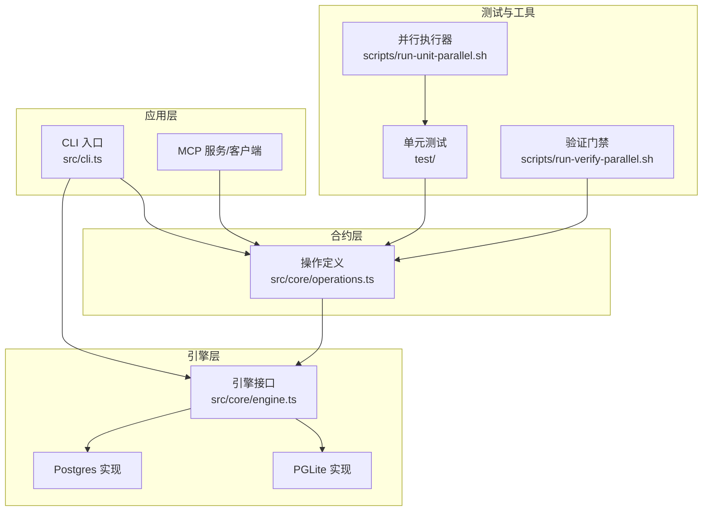
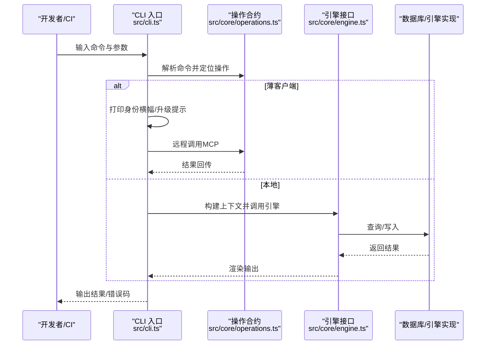
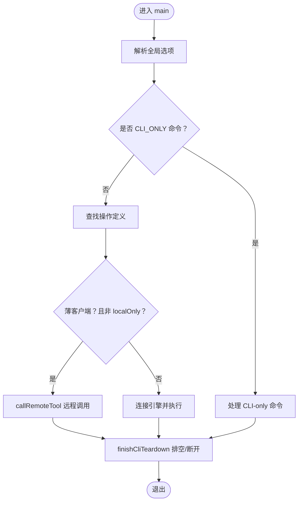
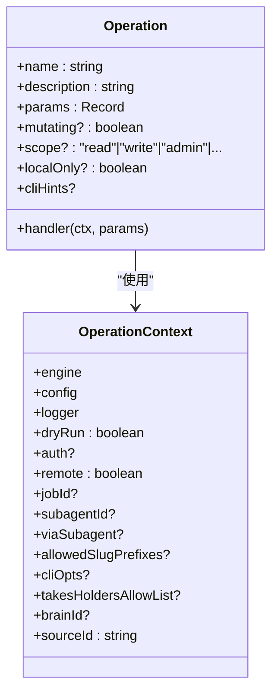
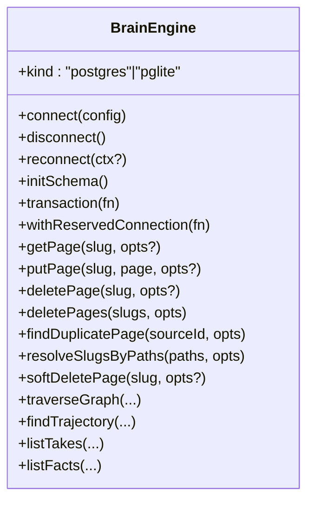
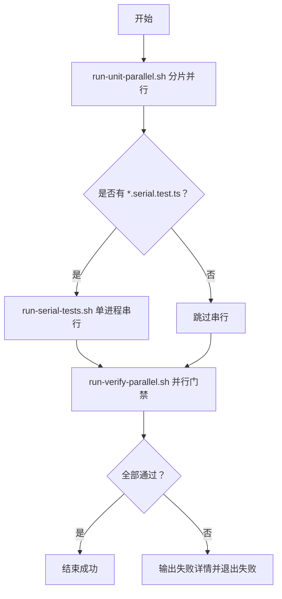
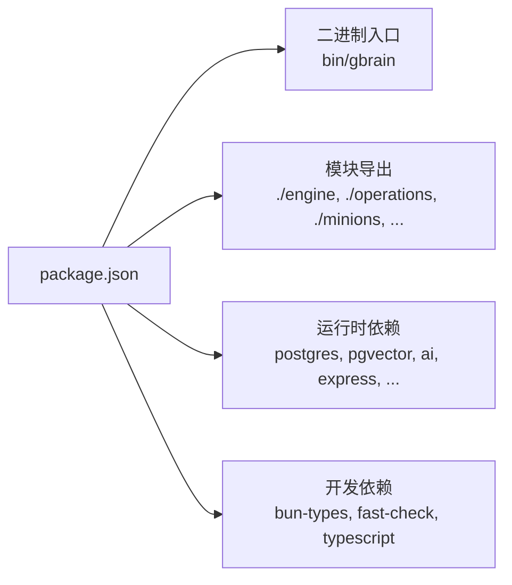

# 日常开发

<cite>
**本文引用的文件**
- [README.md](file://README.md)
- [CONTRIBUTING.md](file://CONTRIBUTING.md)
- [docs/INSTALL.md](file://docs/INSTALL.md)
- [docs/TESTING.md](file://docs/TESTING.md)
- [package.json](file://package.json)
- [src/cli.ts](file://src/cli.ts)
- [src/core/operations.ts](file://src/core/operations.ts)
- [src/core/engine.ts](file://src/core/engine.ts)
- [scripts/run-unit-parallel.sh](file://scripts/run-unit-parallel.sh)
- [scripts/run-verify-parallel.sh](file://scripts/run-verify-parallel.sh)
</cite>

## 目录
1. [简介](#简介)
2. [项目结构](#项目结构)
3. [核心组件](#核心组件)
4. [架构总览](#架构总览)
5. [详细组件分析](#详细组件分析)
6. [依赖分析](#依赖分析)
7. [性能考虑](#性能考虑)
8. [故障排查指南](#故障排查指南)
9. [结论](#结论)
10. [附录](#附录)

## 简介
本指南面向日常开发工作，覆盖从需求分析到代码实现再到测试验证的全流程；解释代码结构与模块组织原则；提供代码质量检查、静态分析与性能优化最佳实践；并给出常见开发任务的操作示例与注意事项。目标是帮助开发者快速、稳定地交付高质量功能。

## 项目结构
仓库采用“合同优先”的操作层（operations）+ 引擎抽象（engine）+ CLI/MCP 的分层设计：
- 源码入口：CLI 入口位于 src/cli.ts，负责参数解析、薄客户端路由、超时控制与退出语义。
- 合同层：src/core/operations.ts 定义所有操作的参数、处理函数与 CLI 提示，CLI/MCP/工具清单均由此生成。
- 引擎层：src/core/engine.ts 抽象数据库引擎接口，支持 Postgres 与 PGLite 两种实现，统一提供页面、链接、时间线、事实等能力。
- 测试体系：test/ 下按功能域划分大量单元与端到端测试；scripts/ 提供并行执行、验证门禁脚本。
- 文档与安装：docs/INSTALL.md 与 README.md 提供安装与使用说明；CONTRIBUTING.md 给出贡献流程与测试规范。

图示来源
- [src/cli.ts](file://src/cli.ts)
- [src/core/operations.ts](file://src/core/operations.ts)
- [src/core/engine.ts](file://src/core/engine.ts)
- [scripts/run-unit-parallel.sh](file://scripts/run-unit-parallel.sh)
- [scripts/run-verify-parallel.sh](file://scripts/run-verify-parallel.sh)

章节来源
- [README.md](file://README.md)
- [CONTRIBUTING.md](file://CONTRIBUTING.md)
- [docs/INSTALL.md](file://docs/INSTALL.md)
- [package.json](file://package.json)

## 核心组件
- CLI 与薄客户端路由：负责全局选项解析、命令分发、远程调用、超时与退出语义，以及薄客户端模式下的身份横幅与升级提示。
- 操作合约（Operations）：集中定义每个操作的参数、处理函数、作用域与 CLI 提示，确保 CLI/MCP/工具清单一致性。
- 引擎接口（Engine）：抽象数据库访问，提供页面 CRUD、批量写入、事务、保留连接、轨迹查询、事实与链接管理等能力，并对批处理提供自重试封装。
- 测试与验证：并行单元测试、串行隔离测试、验证门禁（隐私、JSONB、源投影、类型检查等）、慢测试与端到端测试。

章节来源
- [src/cli.ts](file://src/cli.ts)
- [src/core/operations.ts](file://src/core/operations.ts)
- [src/core/engine.ts](file://src/core/engine.ts)
- [docs/TESTING.md](file://docs/TESTING.md)

## 架构总览
下图展示一次典型查询请求在本地与薄客户端模式下的路径差异，以及操作合约如何驱动 CLI/MCP 工具清单生成。

图示来源
- [src/cli.ts](file://src/cli.ts)
- [src/core/operations.ts](file://src/core/operations.ts)
- [src/core/engine.ts](file://src/core/engine.ts)

## 详细组件分析

### CLI 与薄客户端路由
- 全局选项解析：支持 --quiet、--progress-json、--progress-interval 等，影响后续日志与输出格式。
- 命令分发：CLI_ONLY 命令（如 init、upgrade、serve 等）直接处理；共享操作通过 operations 映射到具体处理器。
- 薄客户端路由：当配置为薄客户端时，非 localOnly 操作经由 callRemoteTool 路由至远端 MCP；支持 SIGINT 中断与超时策略。
- 身份横幅与升级提示：在薄客户端首次调用前打印远端脑体征信息与版本提示，失败不阻断主流程。
- 退出语义：统一通过 finishCliTeardown 完成后台队列排空与引擎断开，避免竞态与资源泄漏。

图示来源
- [src/cli.ts](file://src/cli.ts)

章节来源
- [src/cli.ts](file://src/cli.ts)

### 操作合约（Operations）
- 单一真相源：CLI、MCP、工具清单均由 operations.ts 生成，保证一致性。
- 参数校验与默认值：定义参数类型、必填项、枚举与默认值；提供 slug/文件名/上传路径等安全校验。
- 权限与范围：每项操作声明 scope（read/write/admin），用于 HTTP/OAuth 场景的授权控制。
- 上下文构建：统一注入引擎、配置、认证信息、来源 ID、CLI 选项等，保障跨传输一致行为。
- 评估捕获：部分读取类操作可选开启评估候选捕获，便于回归对比与性能追踪。

图示来源
- [src/core/operations.ts](file://src/core/operations.ts)

章节来源
- [src/core/operations.ts](file://src/core/operations.ts)

### 引擎接口（Engine）
- 生命周期：connect/disconnect/reconnect/initSchema/transaction/withReservedConnection。
- 页面与内容：getPage/putPage/deletePage/deletePages/findDuplicatePage/resolveSlugsByPaths/softDeletePage 等。
- 批量写入：addLinksBatch/addTimelineEntriesBatch/addTakesBatch/upsertChunks 等，内置自重试与审计站点标注。
- 图与轨迹：traverseGraph、listAllSources、findTrajectory 等。
- 事实与检索：listTakes/searchTakes/listFacts/findTrajectory 等。
- 限制与约束：MAX_SEARCH_LIMIT、clampSearchLimit、sourceScopeOpts/linkReadScopeOpts 等，确保多来源与联邦读取的安全边界。

图示来源
- [src/core/engine.ts](file://src/core/engine.ts)

章节来源
- [src/core/engine.ts](file://src/core/engine.ts)

### 测试与验证门禁
- 并行单元测试：scripts/run-unit-parallel.sh 将测试文件按分片并发执行，结束后串行执行 *.serial.test.ts 文件；失败块聚合到 .context/test-failures.log 并在 stderr 打印摘要。
- 验证门禁：scripts/run-verify-parallel.sh 并行执行隐私、JSONB、源投影、类型检查、管理员构建等 20+ 检查，失败时输出失败检查名称与日志尾部。
- 测试分类：*.test.ts（快速循环）、*.slow.test.ts（冷路径）、*.serial.test.ts（进程级隔离）、test/e2e/*（真实 Postgres+pgvector）。
- 本地 CI 门禁：bun run ci:local 使用 docker-compose 启动测试数据库，顺序运行全部 E2E 并清理。

图示来源
- [scripts/run-unit-parallel.sh](file://scripts/run-unit-parallel.sh)
- [scripts/run-verify-parallel.sh](file://scripts/run-verify-parallel.sh)
- [docs/TESTING.md](file://docs/TESTING.md)

章节来源
- [scripts/run-unit-parallel.sh](file://scripts/run-unit-parallel.sh)
- [scripts/run-verify-parallel.sh](file://scripts/run-verify-parallel.sh)
- [docs/TESTING.md](file://docs/TESTING.md)

## 依赖分析
- 包管理与导出：package.json 定义二进制入口、模块导出（engine、operations、minions、pglite-engine 等），便于外部复用。
- 运行时依赖：Postgres、pgvector、AI SDK、HTTP 服务器、速率限制、树形语法解析等。
- 开发依赖：bun-types、fast-check、TypeScript，配合类型检查与属性测试。

图示来源
- [package.json](file://package.json)

章节来源
- [package.json](file://package.json)

## 性能考虑
- 并行与隔离：单元测试分片并行执行，串行文件单独处理，减少长尾与竞争。
- 批处理自重试：引擎批量写入（链接、时间线、事实、向量）内置自重试与审计站点标注，避免重复提交与放大负载。
- 读取超时：本地读取类操作设置默认 180 秒墙钟超时，避免挂起；写入/管理类保持无界以完成导入/嵌入。
- 评估捕获：启用评估候选捕获后，可对检索进行回放对比，辅助发现回归并指导优化。
- 诊断与追踪：提供 search diagnose、engine parity、JSONB 批次毒输入回归等专用测试，保障性能与稳定性。

## 故障排查指南
- 初始化与安装
  - 缺失嵌入模型或环境变量：使用 gbrain doctor 自动修复；或在 init 前设置 OPENAI_API_KEY 等。
  - 头等舱安装：docs/INSTALL.md 提供多种路径（代理平台、CLI、MCP 服务器、薄客户端）。
- 测试失败
  - 并行分片失败：查看 .context/test-failures.log 或临时目录中的 shard-*.* 文件，定位失败块与日志尾部。
  - 验证门禁失败：run-verify-parallel.sh 输出失败检查名称与日志尾部，逐项修复。
  - E2E 数据库：按 docs/TESTING.md 启动 docker-compose，设置 DATABASE_URL，执行 test:e2e。
- 远程薄客户端
  - 身份横幅缺失：确认远程配置与网络可达；必要时通过 gbrain remote doctor 排查。
  - 升级提示：根据横幅提示运行 gbrain self-upgrade。
- 评估回放
  - 在 CONTRIBUTING.md 中开启 GBRAIN_CONTRIBUTOR_MODE，使用 gbrain eval export/replay 对检索变更进行回归对比。

章节来源
- [README.md](file://README.md)
- [docs/INSTALL.md](file://docs/INSTALL.md)
- [docs/TESTING.md](file://docs/TESTING.md)
- [CONTRIBUTING.md](file://CONTRIBUTING.md)

## 结论
本指南梳理了 GBrain 的日常开发流程与工程实践：以操作合约为中心，结合 CLI/MCP 的统一入口、引擎抽象与严格的测试与验证门禁，形成高内聚、低耦合、可扩展的架构。遵循本文建议，可在保证质量的前提下高效推进功能迭代与问题修复。

## 附录
- 快速命令参考
  - 运行快速单元测试：bun run test
  - 预提交验证门禁：bun run verify
  - 运行全量（含慢测试与 E2E）：bun run test:full
  - 运行慢测试：bun run test:slow
  - 运行串行测试：bun run test:serial
  - 运行 E2E（需 DATABASE_URL）：bun run test:e2e
  - 本地 CI 门禁（Docker）：bun run ci:local
- 新增操作步骤
  - 在 src/core/operations.ts 添加操作定义（参数、处理函数、CLI 提示）
  - 补充测试用例
  - CLI/MCP/工具清单自动同步（无需额外维护）

章节来源
- [CONTRIBUTING.md](file://CONTRIBUTING.md)
- [src/core/operations.ts](file://src/core/operations.ts)
- [scripts/run-unit-parallel.sh](file://scripts/run-unit-parallel.sh)
- [scripts/run-verify-parallel.sh](file://scripts/run-verify-parallel.sh)