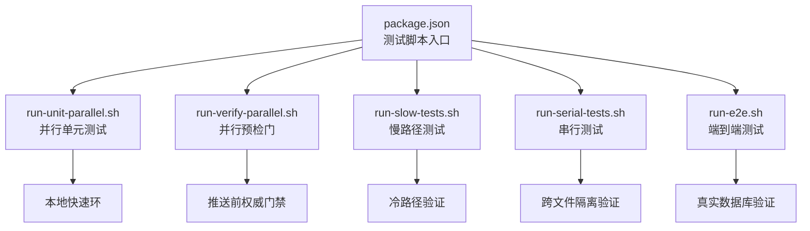
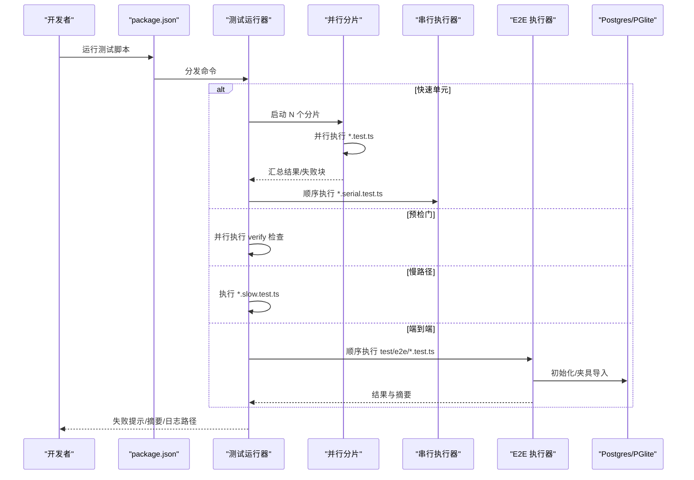
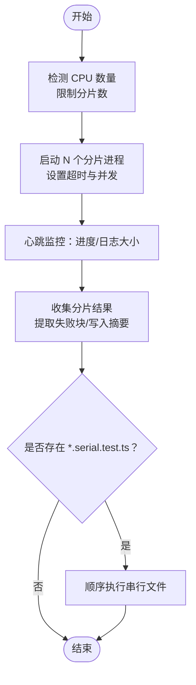
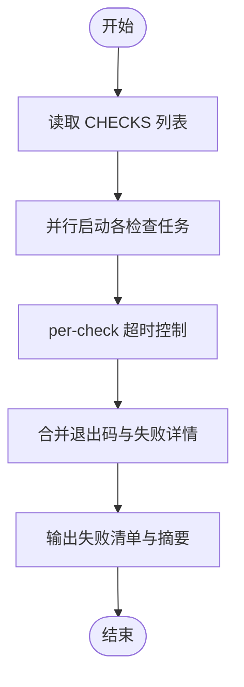
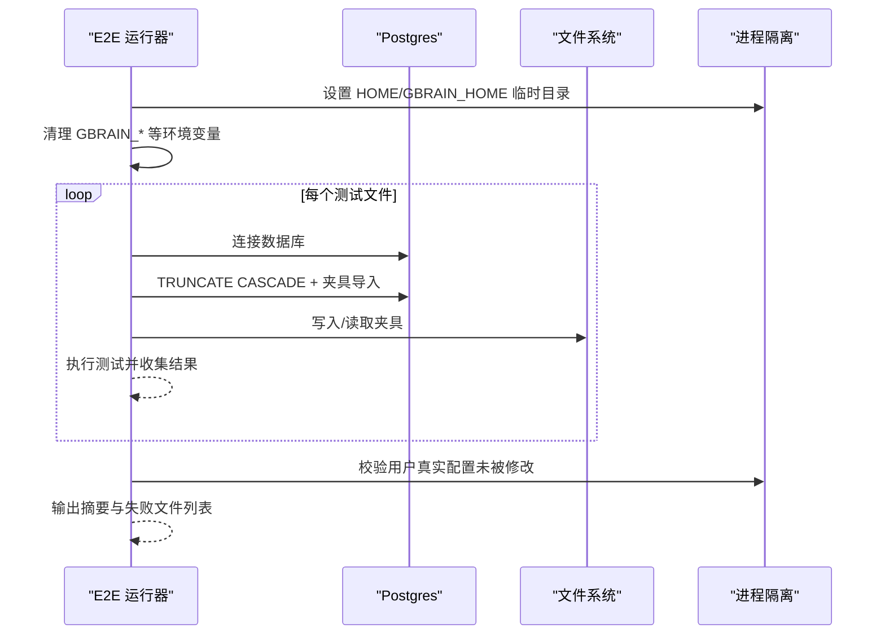
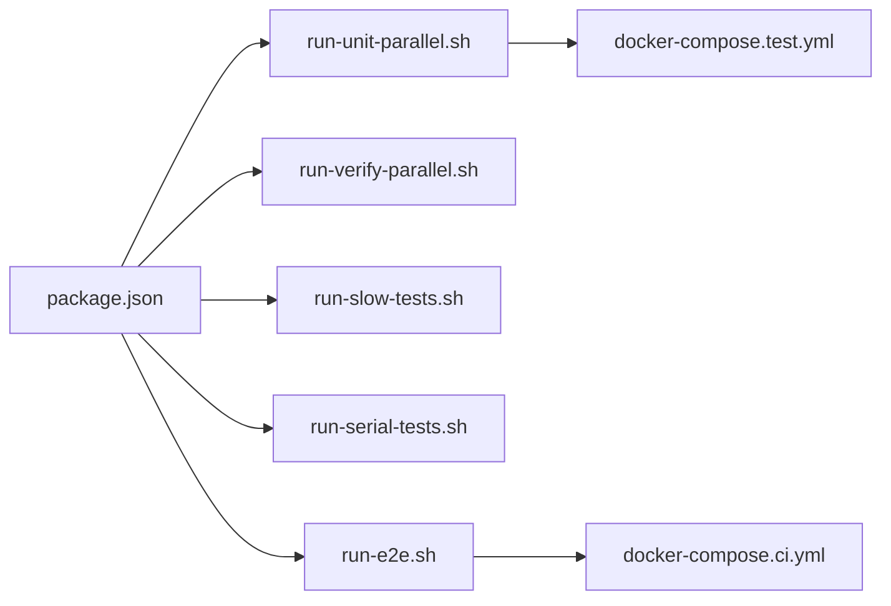

# 测试流程

<cite>
**本文引用的文件**
- [README.md](file://README.md)
- [docs/TESTING.md](file://docs/TESTING.md)
- [package.json](file://package.json)
- [scripts/run-unit-parallel.sh](file://scripts/run-unit-parallel.sh)
- [scripts/run-verify-parallel.sh](file://scripts/run-verify-parallel.sh)
- [scripts/run-e2e.sh](file://scripts/run-e2e.sh)
- [scripts/run-slow-tests.sh](file://scripts/run-slow-tests.sh)
- [scripts/run-serial-tests.sh](file://scripts/run-serial-tests.sh)
- [scripts/check-test-isolation.sh](file://scripts/check-test-isolation.sh)
- [docker-compose.test.yml](file://docker-compose.test.yml)
- [docker-compose.ci.yml](file://docker-compose.ci.yml)
</cite>

## 目录
1. [简介](#简介)
2. [项目结构](#项目结构)
3. [核心组件](#核心组件)
4. [架构总览](#架构总览)
5. [详细组件分析](#详细组件分析)
6. [依赖分析](#依赖分析)
7. [性能考虑](#性能考虑)
8. [故障排查指南](#故障排查指南)
9. [结论](#结论)
10. [附录](#附录)

## 简介
本指南面向 GBrain 项目的测试流程，覆盖单元测试、集成测试与端到端测试（E2E）的运行方式、配置要点与适用场景；系统性阐述测试分类（parallel、serial、slow、e2e）与隔离规则（R1–R4），并提供测试环境搭建、数据库配置与 Docker 容器使用指南；最后给出测试失败排查、覆盖率分析与性能测试方法。

## 项目结构
- 测试命令由 package.json 统一编排，按层级划分：
  - 快速单元测试：并行分片执行，排除 slow 与 serial 文件，适合本地内循环。
  - 预检门（verify）：并行执行多项静态检查与类型检查，作为推送前的权威门禁。
  - 慢路径测试：仅运行 *.slow.test.ts，适合触碰冷路径代码时。
  - 串行测试：仅运行 *.serial.test.ts，确保跨文件状态隔离。
  - 端到端测试：顺序执行 test/e2e/*.test.ts，需要真实 Postgres 数据库。
  - 全量测试：预检门 + 单元 + 慢路径 + 智能 E2E（当存在 DATABASE_URL 时）。
- CI 采用 10 跑道分片矩阵 + 专用串行作业，严格区分本地快速环与 CI 全量覆盖。

图示来源
- [package.json:31-66](file://package.json#L31-L66)
- [scripts/run-unit-parallel.sh:1-430](file://scripts/run-unit-parallel.sh#L1-L430)
- [scripts/run-verify-parallel.sh:1-203](file://scripts/run-verify-parallel.sh#L1-L203)
- [scripts/run-slow-tests.sh:1-26](file://scripts/run-slow-tests.sh#L1-L26)
- [scripts/run-serial-tests.sh:1-59](file://scripts/run-serial-tests.sh#L1-L59)
- [scripts/run-e2e.sh:1-244](file://scripts/run-e2e.sh#L1-L244)

章节来源
- [README.md:428-435](file://README.md#L428-L435)
- [docs/TESTING.md:6-26](file://docs/TESTING.md#L6-L26)

## 核心组件
- 并行单元测试（parallel）
  - 通过 run-unit-parallel.sh 将测试集按 CPU 数量拆分为 N 个分片并行执行，每个分片内部可设置最大并发度；结束后再顺序执行 *.serial.test.ts。
  - 支持超时控制、失败块提取、摘要输出与心跳监控。
- 预检门（verify）
  - 通过 run-verify-parallel.sh 并行执行隐私、JSONB、源投影、隔离、WASM、管理员构建、CLI 可执行性、系统记录一致性等检查，以及类型检查。
- 慢路径测试（slow）
  - 仅运行 *.slow.test.ts，为长耗时或复杂冷路径用例提供独立通道。
- 串行测试（serial）
  - 仅运行 *.serial.test.ts，确保跨文件共享状态的测试在单进程环境中执行，避免模块注册泄漏导致的跨文件污染。
- 端到端测试（e2e）
  - 顺序执行 test/e2e/*.test.ts，共享一个 Postgres 数据库，通过 TRUNCATE CASCADE + 夹具导入构造稳定场景；支持分片并行（CI）与 HOME 隔离保护。
- 全量测试（full）
  - 预检门 + 单元 + 慢路径 + 智能 E2E（当 DATABASE_URL 存在时）。

章节来源
- [docs/TESTING.md:6-26](file://docs/TESTING.md#L6-L26)
- [scripts/run-unit-parallel.sh:1-430](file://scripts/run-unit-parallel.sh#L1-L430)
- [scripts/run-verify-parallel.sh:1-203](file://scripts/run-verify-parallel.sh#L1-L203)
- [scripts/run-slow-tests.sh:1-26](file://scripts/run-slow-tests.sh#L1-L26)
- [scripts/run-serial-tests.sh:1-59](file://scripts/run-serial-tests.sh#L1-L59)
- [scripts/run-e2e.sh:1-244](file://scripts/run-e2e.sh#L1-L244)

## 架构总览
下图展示测试子系统的总体交互：命令入口、分发器、并行/串行执行器、隔离与超时控制、日志聚合与失败报告。

图示来源
- [package.json:31-66](file://package.json#L31-L66)
- [scripts/run-unit-parallel.sh:1-430](file://scripts/run-unit-parallel.sh#L1-L430)
- [scripts/run-verify-parallel.sh:1-203](file://scripts/run-verify-parallel.sh#L1-L203)
- [scripts/run-e2e.sh:1-244](file://scripts/run-e2e.sh#L1-L244)

## 详细组件分析

### 并行单元测试（run-unit-parallel.sh）
- 功能要点
  - 自动检测 CPU 数量，限制默认分片数以降低竞争与挂起风险。
  - 每个分片在独立超时约束下运行，失败块提取与摘要文件生成，便于定位问题。
  - 结束后自动执行串行文件，保证跨文件隔离。
- 关键参数
  - SHARDS/N：分片数量上限与默认值。
  - GBRAIN_TEST_SHARD_TIMEOUT：分片级超时（默认 1500s）。
  - GBRAIN_TEST_MAX_CONCURRENCY：分片内并发度。
- 输出
  - .context/test-failures.log：失败块集合。
  - .context/test-summary.txt：每分片汇总。
  - .context/test-shards/：各分片日志与退出码。

图示来源
- [scripts/run-unit-parallel.sh:1-430](file://scripts/run-unit-parallel.sh#L1-L430)

章节来源
- [scripts/run-unit-parallel.sh:1-430](file://scripts/run-unit-parallel.sh#L1-L430)

### 预检门（run-verify-parallel.sh）
- 功能要点
  - 并行执行 20+ 预检检查（隐私、JSONB、源投影、隔离、WASM、管理员构建、CLI 可执行性、系统记录一致性、对话解析器、解析器、源范围上线等），并行显著缩短时间。
  - 支持 per-check 超时与日志目录自定义。
- 常见检查项（节选）
  - check:privacy、check:jsonb、check:source-id-projection、check:test-isolation、check:wasm、check:admin-build、check:cli-exec、check:system-of-record、check:resolver、check:conversation-parser、typecheck 等。

图示来源
- [scripts/run-verify-parallel.sh:1-203](file://scripts/run-verify-parallel.sh#L1-L203)

章节来源
- [scripts/run-verify-parallel.sh:1-203](file://scripts/run-verify-parallel.sh#L1-L203)

### 慢路径测试（run-slow-tests.sh）
- 适用场景
  - 触碰冷路径逻辑、长时间运行或资源密集型用例。
- 行为特征
  - 仅扫描并执行 *.slow.test.ts，设置更宽松的 per-test 超时（120s）。

章节来源
- [scripts/run-slow-tests.sh:1-26](file://scripts/run-slow-tests.sh#L1-L26)

### 串行测试（run-serial-tests.sh）
- 适用场景
  - 存在跨文件共享状态、顶层 mock.module 或需要进程级隔离的测试。
- 行为特征
  - 每个 *.serial.test.ts 在独立 bun 进程中顺序执行，确保模块注册隔离。

章节来源
- [scripts/run-serial-tests.sh:1-59](file://scripts/run-serial-tests.sh#L1-L59)

### 端到端测试（run-e2e.sh）
- 适用场景
  - 需要真实 Postgres/PGlite 的完整功能验证，如多源隔离、引擎一致性、HTTP/OAuth、批量写入等。
- 关键机制
  - 顺序执行，避免同一数据库上多个文件并发 TRUNCATE/CASCADE 导致夹具污染。
  - HOME/GBRAIN_HOME 隔离：在临时目录运行，结束后校验用户真实配置未被修改。
  - Hermetic 环境清理：剔除可能影响测试行为的 GBRAIN_*、MCP_*、OPENCLAW_* 等变量。
  - 分片并行（CI）：通过 SHARD=1/4…4/4 对文件列表进行分片，每片内顺序执行。
- 数据库生命周期（建议流程）
  - 启动容器（端口空闲检查）→ 初始化数据库（gbrain doctor 触发 initSchema）→ 运行 E2E → 停止并删除容器。

图示来源
- [scripts/run-e2e.sh:1-244](file://scripts/run-e2e.sh#L1-L244)

章节来源
- [scripts/run-e2e.sh:1-244](file://scripts/run-e2e.sh#L1-L244)

### 测试隔离规则与并发安全（R1–R4）
- R1：禁止直接修改 process.env（包括 delete、Object.assign、Reflect.set 等）。应使用 withEnv() 辅助函数或重命名文件为 *.serial.test.ts。
- R2：禁止在文件顶层使用 mock.module(...)。此类全局模拟会泄漏到同进程其他文件，应重命名为 *.serial.test.ts。
- R3：PGLiteEngine 实例必须在 beforeAll(...) 上下文约 50 行以内创建，避免模块级泄漏。
- R4：任何创建 PGLiteEngine 的文件必须在 afterAll(...) 中调用 engine.disconnect()，防止跨文件泄漏。
- 允许名单
  - scripts/check-test-isolation.allowlist 用于记录历史基线违规文件，应持续缩减而非扩大。

章节来源
- [docs/TESTING.md:47-115](file://docs/TESTING.md#L47-L115)
- [scripts/check-test-isolation.sh:1-156](file://scripts/check-test-isolation.sh#L1-L156)

## 依赖分析
- 命令与脚本映射
  - package.json 中的测试脚本统一委托给 Bash 脚本，实现清晰的职责分离与可观测性。
- CI 与本地差异
  - CI 使用分片矩阵 + 专用串行作业，包含慢文件的独立作业；本地快速环排除 slow 与 serial，聚焦高频反馈。
- Docker 与数据库
  - docker-compose.test.yml 提供单实例测试数据库；docker-compose.ci.yml 提供 4 实例 + PgBouncer，支持 CI 并行分片。

图示来源
- [package.json:31-66](file://package.json#L31-L66)
- [docker-compose.test.yml:1-15](file://docker-compose.test.yml#L1-L15)
- [docker-compose.ci.yml:1-154](file://docker-compose.ci.yml#L1-L154)

章节来源
- [package.json:31-66](file://package.json#L31-L66)
- [docker-compose.test.yml:1-15](file://docker-compose.test.yml#L1-L15)
- [docker-compose.ci.yml:1-154](file://docker-compose.ci.yml#L1-L154)

## 性能考虑
- 并行分片与超时
  - run-unit-parallel.sh 默认限制分片数与超时，避免 PGLite WASM 初始化竞争与 CI 资源争用。
- 慢路径预算
  - run-slow-tests.sh 为慢文件提供更宽松的 per-test 超时，减少误判。
- CI 分片并行
  - docker-compose.ci.yml 通过 4 个 Postgres 实例与分片策略，将顺序 E2E 时间从 ~6 分钟缩短至 ~1.5–2 分钟。
- 日志与可观测性
  - 失败块提取、摘要文件与心跳监控帮助快速定位瓶颈与异常。

章节来源
- [scripts/run-unit-parallel.sh:61-81](file://scripts/run-unit-parallel.sh#L61-L81)
- [scripts/run-slow-tests.sh:20-25](file://scripts/run-slow-tests.sh#L20-L25)
- [docker-compose.ci.yml:12-17](file://docker-compose.ci.yml#L12-L17)

## 故障排查指南
- 单元测试失败
  - 查看 .context/test-failures.log 获取失败块；根据摘要文件定位分片与用例。
  - 若出现“分片挂起”，检查 GBRAIN_TEST_SHARD_TIMEOUT（默认 1500s）是否过短，必要时提升。
- 预检门失败
  - 根据 run-verify-parallel.sh 输出的失败检查名称与日志尾部，逐项修复。
- E2E 失败
  - run-e2e.sh 已内置 HOME 隔离与环境净化；若失败，优先检查 DATABASE_URL、端口占用与容器健康状态。
  - 如需分片并行（CI），使用 SHARD=1/4…4/4 控制文件分片。
- 隔离规则违规
  - 使用 scripts/check-test-isolation.sh 检查 R1–R4 违规；对允许名单中的历史文件保持只减不增。
- 数据库问题
  - docker-compose.test.yml 提供单实例；docker-compose.ci.yml 提供 4 实例 + PgBouncer；确保端口不冲突并完成初始化（gbrain doctor）。

章节来源
- [scripts/run-unit-parallel.sh:299-429](file://scripts/run-unit-parallel.sh#L299-L429)
- [scripts/run-verify-parallel.sh:151-202](file://scripts/run-verify-parallel.sh#L151-L202)
- [scripts/run-e2e.sh:151-244](file://scripts/run-e2e.sh#L151-L244)
- [scripts/check-test-isolation.sh:1-156](file://scripts/check-test-isolation.sh#L1-L156)

## 结论
本指南提供了 GBrain 测试体系的全链路实践：从命令入口、分发与执行，到隔离规则与并发安全、数据库与容器配置，再到失败排查与性能优化。遵循 parallel/serial/slow/e2e 的分类与适用场景，结合 CI 与本地差异，可在保证质量的同时最大化开发效率。

## 附录

### 测试命令与适用场景速查
- bun run test：并行单元测试（本地快速环）
- bun run verify：并行预检门（推送前权威门禁）
- bun run test:full：预检门 + 单元 + 慢路径 + 智能 E2E
- bun run test:slow：仅慢路径测试
- bun run test:serial：仅串行测试
- bun run test:e2e：顺序端到端测试（需 DATABASE_URL）

章节来源
- [docs/TESTING.md:6-18](file://docs/TESTING.md#L6-L18)
- [README.md:428-435](file://README.md#L428-L435)

### 测试环境搭建与数据库配置
- 单机测试数据库（docker-compose.test.yml）
  - 端口：5434 → 5432
  - 用户/密码/库名：postgres/postgres/gbrain_test
  - 启动后通过 gbrain doctor 触发 initSchema 完成基础模式初始化
- CI 并行 E2E（docker-compose.ci.yml）
  - 4 个 Postgres 实例 + PgBouncer（TRANSACTION 模式）
  - 端口：5434–5437；可通过 GBRAIN_CI_PG_PORT 系列变量覆盖
  - runner 服务绑定仓库目录，使用命名卷隔离 node_modules 与缓存

章节来源
- [docker-compose.test.yml:1-15](file://docker-compose.test.yml#L1-L15)
- [docker-compose.ci.yml:1-154](file://docker-compose.ci.yml#L1-L154)

### Docker 容器使用指南（E2E）
- 步骤
  - 检查端口空闲 → 启动容器 → 等待健康检查 → 初始化数据库（gbrain doctor）→ 设置 DATABASE_URL → 运行 bun run test:e2e → 停止并删除容器
- 注意
  - 不要遗留容器；如发现旧容器，先停止并删除后再启动新容器

章节来源
- [docs/TESTING.md:266-304](file://docs/TESTING.md#L266-L304)

### 测试失败排查清单
- 单元测试
  - 查看失败块与摘要；确认分片超时与并发设置是否合理
- 预检门
  - 逐项修复失败检查；关注类型检查与静态规则
- E2E
  - 校验 DATABASE_URL 与容器健康；检查 HOME 隔离与环境净化；必要时启用分片并行
- 隔离规则
  - 修复 R1–R4 违规；历史允许名单不得新增条目

章节来源
- [scripts/run-unit-parallel.sh:299-429](file://scripts/run-unit-parallel.sh#L299-L429)
- [scripts/run-verify-parallel.sh:151-202](file://scripts/run-verify-parallel.sh#L151-L202)
- [scripts/run-e2e.sh:151-244](file://scripts/run-e2e.sh#L151-L244)
- [scripts/check-test-isolation.sh:1-156](file://scripts/check-test-isolation.sh#L1-L156)