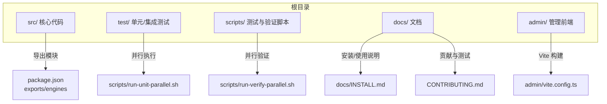
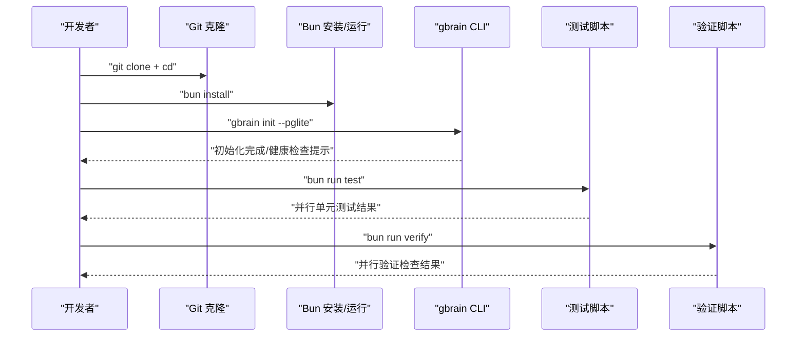
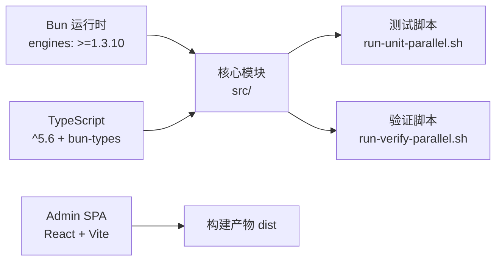

# 环境搭建

<cite>
**本文引用的文件**
- [README.md](file://README.md)
- [docs/INSTALL.md](file://docs/INSTALL.md)
- [CONTRIBUTING.md](file://CONTRIBUTING.md)
- [package.json](file://package.json)
- [tsconfig.json](file://tsconfig.json)
- [bunfig.toml](file://bunfig.toml)
- [admin/package.json](file://admin/package.json)
- [admin/tsconfig.json](file://admin/tsconfig.json)
- [admin/vite.config.ts](file://admin/vite.config.ts)
- [scripts/run-unit-parallel.sh](file://scripts/run-unit-parallel.sh)
- [scripts/run-verify-parallel.sh](file://scripts/run-verify-parallel.sh)
- [test/e2e/mechanical.test.ts](file://test/e2e/mechanical.test.ts)
- [test/helpers/with-env.ts](file://test/helpers/with-env.ts)
</cite>

## 目录
1. [简介](#简介)
2. [项目结构](#项目结构)
3. [核心组件](#核心组件)
4. [架构总览](#架构总览)
5. [详细组件分析](#详细组件分析)
6. [依赖分析](#依赖分析)
7. [性能考虑](#性能考虑)
8. [故障排查指南](#故障排查指南)
9. [结论](#结论)
10. [附录](#附录)

## 简介
本指南面向希望在本地搭建 GBrain 开发与运行环境的开发者，覆盖以下要点：
- 安装与运行要求：Bun 版本要求与兼容性、操作系统差异与注意事项
- 项目克隆、依赖安装与初始配置步骤
- 开发工具链：TypeScript 编译器、测试框架、代码质量检查脚本
- 不同操作系统的环境配置差异与注意事项
- 常见环境问题的排查与解决方案

## 项目结构
GBrain 采用以功能域与层次划分相结合的组织方式：
- 根目录包含 CLI、核心引擎、MCP 服务、技能包、测试与脚本等模块
- admin 子目录为独立的 React/Vite 管理界面（前端）
- 文档位于 docs/，包含安装、架构、集成与教程等资料
- 脚本位于 scripts/，提供单元测试并行、验证检查、CI 本地运行等自动化流程

图表来源
- [package.json:1-148](file://package.json#L1-L148)
- [scripts/run-unit-parallel.sh:1-430](file://scripts/run-unit-parallel.sh#L1-L430)
- [scripts/run-verify-parallel.sh:1-203](file://scripts/run-verify-parallel.sh#L1-L203)
- [admin/vite.config.ts:1-12](file://admin/vite.config.ts#L1-L12)
- [docs/INSTALL.md:1-114](file://docs/INSTALL.md#L1-L114)
- [CONTRIBUTING.md:1-293](file://CONTRIBUTING.md#L1-L293)

章节来源
- [README.md:1-443](file://README.md#L1-L443)
- [docs/INSTALL.md:1-114](file://docs/INSTALL.md#L1-L114)
- [CONTRIBUTING.md:1-293](file://CONTRIBUTING.md#L1-L293)

## 核心组件
- 包管理与运行时
  - 使用 Bun 作为包管理器与运行时，要求版本 ≥ 1.3.10
  - 支持全局安装与本地开发两种模式
- TypeScript 配置
  - 严格类型检查、ESNext 模块解析、bundler 分辨策略
  - 通过 bun-types 提供 Bun 运行时类型支持
- 测试与验证
  - 单元测试并行执行与串行补测
  - 并行验证流水线，覆盖隐私、JSONB、隔离性、WASM、Admin 构建等多类检查
- 管理前端（Admin SPA）
  - React + Vite，基于 ESNext 模块与 React JSX
  - 构建输出至 dist，基础路径为 /admin/

章节来源
- [package.json:142-144](file://package.json#L142-L144)
- [tsconfig.json:1-20](file://tsconfig.json#L1-L20)
- [bunfig.toml:1-17](file://bunfig.toml#L1-L17)
- [admin/package.json:1-22](file://admin/package.json#L1-L22)
- [admin/tsconfig.json:1-18](file://admin/tsconfig.json#L1-L18)
- [admin/vite.config.ts:1-12](file://admin/vite.config.ts#L1-L12)
- [scripts/run-unit-parallel.sh:1-430](file://scripts/run-unit-parallel.sh#L1-L430)
- [scripts/run-verify-parallel.sh:1-203](file://scripts/run-verify-parallel.sh#L1-L203)

## 架构总览
下图展示从“安装与初始化”到“开发与验证”的端到端流程，映射到实际源码与脚本：

图表来源
- [docs/INSTALL.md:1-114](file://docs/INSTALL.md#L1-L114)
- [CONTRIBUTING.md:1-293](file://CONTRIBUTING.md#L1-L293)
- [scripts/run-unit-parallel.sh:1-430](file://scripts/run-unit-parallel.sh#L1-L430)
- [scripts/run-verify-parallel.sh:1-203](file://scripts/run-verify-parallel.sh#L1-L203)

## 详细组件分析

### 1) Bun 与版本兼容性
- 最低版本要求：Bun ≥ 1.3.10
- 项目通过 engines 字段声明该约束
- 在 CI 与本地开发中均需满足此版本要求

章节来源
- [package.json:142-144](file://package.json#L142-L144)
- [CONTRIBUTING.md:12-12](file://CONTRIBUTING.md#L12-L12)

### 2) 项目克隆与依赖安装
- 克隆仓库后，使用 Bun 安装依赖
- 安装完成后可直接运行 CLI 或进行测试
- 若全局安装遇到 postinstall 钩子限制，README 提供了替代恢复方案

章节来源
- [CONTRIBUTING.md:5-10](file://CONTRIBUTING.md#L5-L10)
- [docs/INSTALL.md:31-31](file://docs/INSTALL.md#L31-L31)

### 3) 初始配置与健康检查
- 初始化本地 PGLite 脑库（默认嵌入式数据库）
- 使用 doctor 健康检查确认各项依赖与配置状态
- 可按 doctor 输出修复缺失的 API 密钥或迁移问题

章节来源
- [docs/INSTALL.md:10-14](file://docs/INSTALL.md#L10-L14)
- [README.md:290-293](file://README.md#L290-L293)

### 4) 开发工具链配置
- TypeScript 编译器
  - 目标与模块：ESNext
  - 解析策略：bundler
  - 类型支持：bun-types
  - 路径别名：@/*
- 测试框架
  - 使用 Bun 内置测试运行器
  - 并行单元测试：scripts/run-unit-parallel.sh
  - 串行补测：*.serial.test.ts
  - 验证门禁：scripts/run-verify-parallel.sh
- 管理前端（Admin SPA）
  - React + Vite
  - 构建产物：dist，基础路径 /admin/
  - TS 配置启用严格模式与 JSX

章节来源
- [tsconfig.json:1-20](file://tsconfig.json#L1-L20)
- [admin/tsconfig.json:1-18](file://admin/tsconfig.json#L1-L18)
- [admin/vite.config.ts:1-12](file://admin/vite.config.ts#L1-L12)
- [scripts/run-unit-parallel.sh:1-430](file://scripts/run-unit-parallel.sh#L1-L430)
- [scripts/run-verify-parallel.sh:1-203](file://scripts/run-verify-parallel.sh#L1-L203)

### 5) 不同操作系统下的环境差异与注意事项
- macOS
  - 可能缺少系统自带的 timeout 命令；建议安装 coreutils（提供 gtimeout）以获得更稳定的超时控制
  - 测试脚本对 timeout 的回退实现会自动处理无 gtimeout 的情况
- Linux
  - 默认具备 timeout 命令，测试与验证脚本可直接使用
- Windows
  - README 中记录了 schema 迁移在 Windows + Bun + Supabase 连接池场景下的已知问题与修复（v0.41.37.0），建议升级到受支持版本
- 环境变量与配置
  - 支持通过环境变量覆盖部分配置键（如 GBRAIN_* 前缀），避免与通用环境变量冲突
  - 配置加载不修改进程环境，确保测试隔离性

章节来源
- [scripts/run-unit-parallel.sh:103-109](file://scripts/run-unit-parallel.sh#L103-L109)
- [README.md:401-410](file://README.md#L401-L410)
- [test/helpers/with-env.ts:1-77](file://test/helpers/with-env.ts#L1-L77)

### 6) 开发工作流与命令参考
- 安装与初始化
  - 全局安装：bun install -g github:garrytan/gbrain
  - 初始化：gbrain init --pglite
  - 健康检查：gbrain doctor
- 测试与验证
  - 快速单元测试：bun run test
  - 预提交验证：bun run verify
  - 慢/串行/E2E：bun run test:slow / test:serial / test:e2e
  - 本地 CI 门禁：bun run ci:local / ci:local:diff
- Admin 前端
  - 开发：cd admin && bun run dev
  - 构建：bun run build

章节来源
- [docs/INSTALL.md:1-114](file://docs/INSTALL.md#L1-L114)
- [CONTRIBUTING.md:52-90](file://CONTRIBUTING.md#L52-L90)
- [admin/package.json:1-22](file://admin/package.json#L1-L22)

## 依赖分析
- 运行时与引擎
  - Bun 引擎：通过 engines 字段声明最低版本
  - PGLite：零配置嵌入式数据库，默认用于个人脑库
- TypeScript 与类型
  - TypeScript ^5.6
  - bun-types 提供 Bun 运行时类型
- 测试与验证
  - 并行测试与验证脚本通过 Bash 与 Bun 协作执行
  - 验证清单覆盖隐私、JSONB、隔离性、WASM、Admin 构建等

图表来源
- [package.json:142-144](file://package.json#L142-L144)
- [tsconfig.json:1-20](file://tsconfig.json#L1-L20)
- [scripts/run-unit-parallel.sh:1-430](file://scripts/run-unit-parallel.sh#L1-L430)
- [scripts/run-verify-parallel.sh:1-203](file://scripts/run-verify-parallel.sh#L1-L203)
- [admin/vite.config.ts:1-12](file://admin/vite.config.ts#L1-L12)

章节来源
- [package.json:129-138](file://package.json#L129-L138)
- [scripts/run-unit-parallel.sh:1-430](file://scripts/run-unit-parallel.sh#L1-L430)
- [scripts/run-verify-parallel.sh:1-203](file://scripts/run-verify-parallel.sh#L1-L203)

## 性能考虑
- 测试并行化
  - run-unit-parallel.sh 将单元测试分片并行执行，减少整体耗时
  - 串行补测确保需要全局隔离的测试稳定执行
- 验证门禁
  - run-verify-parallel.sh 并行执行多项静态检查，显著缩短预提交时间
- Admin 构建
  - Vite 开发服务器热更新快速响应，生产构建优化体积与加载性能

章节来源
- [scripts/run-unit-parallel.sh:1-430](file://scripts/run-unit-parallel.sh#L1-L430)
- [scripts/run-verify-parallel.sh:1-203](file://scripts/run-verify-parallel.sh#L1-L203)
- [admin/vite.config.ts:1-12](file://admin/vite.config.ts#L1-L12)

## 故障排查指南
- 初始化失败或嵌入维度不匹配
  - 使用 doctor 自动诊断并给出修复命令
  - 在非交互环境中可通过显式参数跳过嵌入模型初始化
- Windows 上迁移失败（DNS 解析错误）
  - 升级到受支持版本，避免子进程调用导致的连接问题
- PGLite 与 serve 并发写锁冲突
  - 大规模同步前停止本地 MCP 服务，避免单写锁竞争
- 测试超时或挂起
  - run-unit-parallel.sh 与 run-verify-parallel.sh 提供超时控制与失败日志聚合
  - macOS 缺少 timeout 时使用 gtimeout 或内置降级逻辑
- 环境变量泄漏与测试隔离
  - withEnv 工具确保测试期间仅临时修改进程环境，并在 finally 中恢复
- CLI 执行与子进程行为
  - E2E 测试通过 Bun.spawnsync 调用 CLI，便于捕获退出码与标准输出

章节来源
- [README.md:290-410](file://README.md#L290-L410)
- [scripts/run-unit-parallel.sh:103-109](file://scripts/run-unit-parallel.sh#L103-L109)
- [test/helpers/with-env.ts:1-77](file://test/helpers/with-env.ts#L1-L77)
- [test/e2e/mechanical.test.ts:744-783](file://test/e2e/mechanical.test.ts#L744-L783)

## 结论
按照本指南完成 Bun 安装、项目克隆、依赖安装与初始化配置后，即可进入日常开发与测试流程。通过并行测试与验证脚本，可在保证质量的前提下显著提升迭代效率。遇到平台相关问题时，优先参考 README 的故障排查与 README 的安装说明。

## 附录
- 常用命令速查
  - 安装与初始化：bun install, gbrain init --pglite, gbrain doctor
  - 测试：bun run test, bun run verify, bun run test:slow/serial/e2e
  - Admin：cd admin && bun run dev/build
- 参考文档
  - 安装与使用：docs/INSTALL.md
  - 贡献与测试：CONTRIBUTING.md
  - 管理前端：admin/