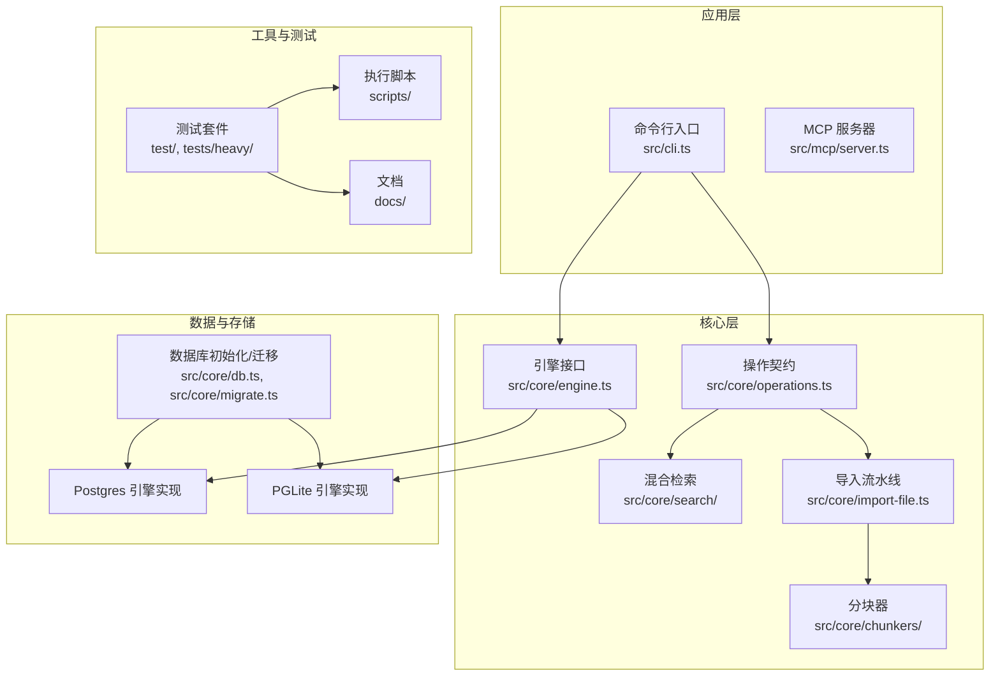
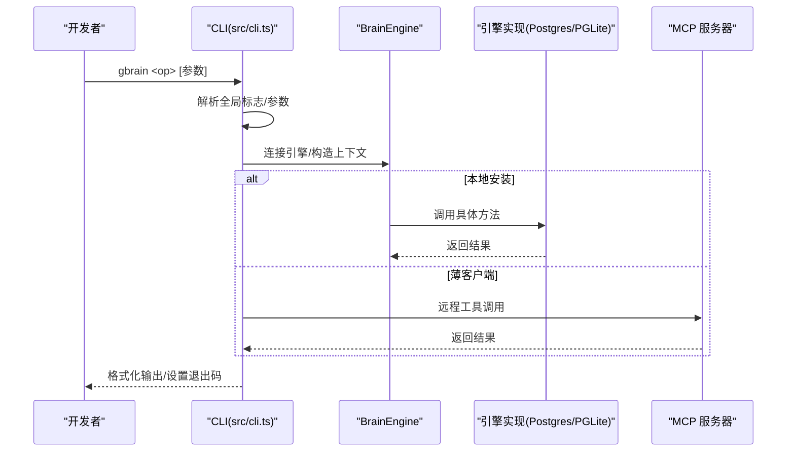
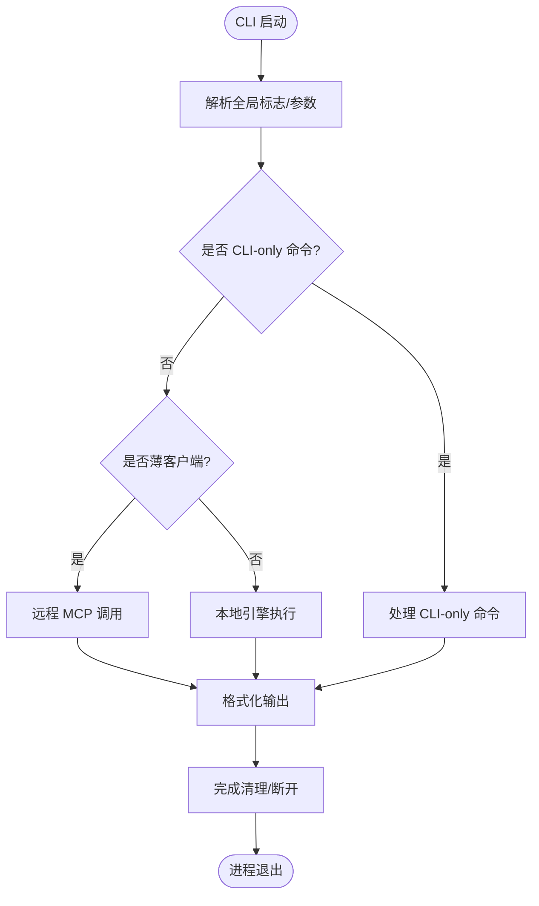
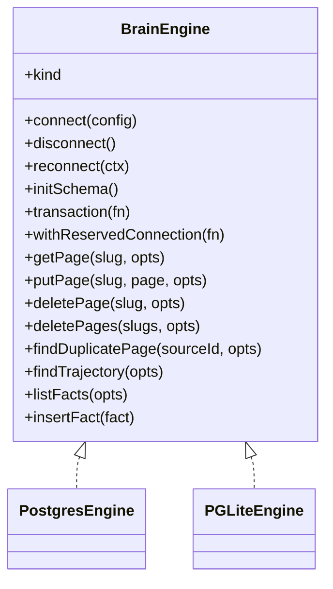
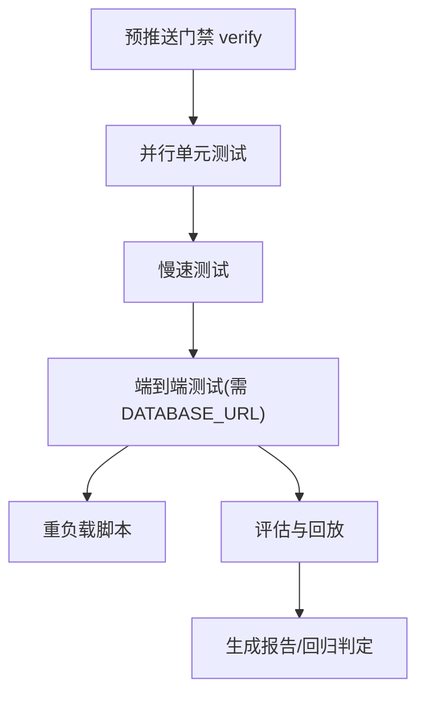
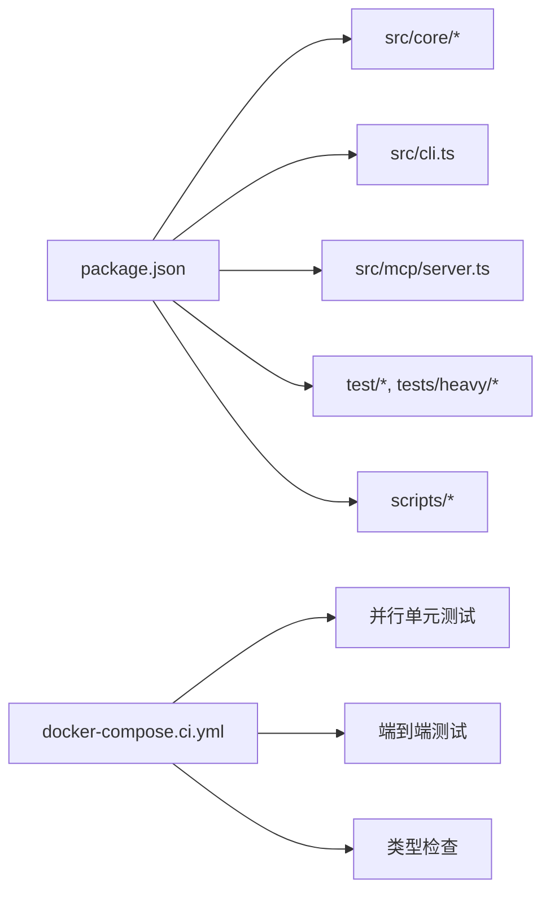

# 开发者指南

<cite>
**本文档引用的文件**
- [README.md](file://README.md)
- [CONTRIBUTING.md](file://CONTRIBUTING.md)
- [DESIGN.md](file://DESIGN.md)
- [docs/INSTALL.md](file://docs/INSTALL.md)
- [docs/TESTING.md](file://docs/TESTING.md)
- [docs/RELEASING.md](file://docs/RELEASING.md)
- [package.json](file://package.json)
- [src/cli.ts](file://src/cli.ts)
- [src/core/engine.ts](file://src/core/engine.ts)
- [.github/workflows/test.yml](file://.github/workflows/test.yml)
- [scripts/run-unit-parallel.sh](file://scripts/run-unit-parallel.sh)
- [scripts/run-verify-parallel.sh](file://scripts/run-verify-parallel.sh)
- [scripts/run-e2e.sh](file://scripts/run-e2e.sh)
- [scripts/ci-local.sh](file://scripts/ci-local.sh)
- [scripts/select-e2e.ts](file://scripts/select-e2e.ts)
- [scripts/sharding.ts](file://scripts/sharding.ts)
- [scripts/check-test-isolation.sh](file://scripts/check-test-isolation.sh)
- [scripts/check-jsonb-pattern.sh](file://scripts/check-jsonb-pattern.sh)
- [scripts/check-progress-to-stdout.sh](file://scripts/check-progress-to-stdout.sh)
- [scripts/check-wasm-embedded.sh](file://scripts/check-wasm-embedded.sh)
- [scripts/check-admin-build.sh](file://scripts/check-admin-build.sh)
- [scripts/check-admin-embedded.sh](file://scripts/check-admin-embedded.sh)
- [scripts/check-cli-executable.sh](file://scripts/check-cli-executable.sh)
- [scripts/check-skill-brain-first.sh](file://scripts/check-skill-brain-first.sh)
- [scripts/check-operations-filter-bypass.sh](file://scripts/check-operations-filter-bypass.sh)
- [scripts/check-gateway-routed-no-direct-anthropic.sh](file://scripts/check-gateway-routed-no-direct-anthropic.sh)
- [scripts/check-worker-pool-atomicity.sh](file://scripts/check-worker-pool-atomicity.sh)
- [scripts/check-key-files-current-state.sh](file://scripts/check-key-files-current-state.sh)
- [scripts/check-no-double-retry.sh](file://scripts/check-no-double-retry.sh)
- [scripts/check-batch-audit-site.sh](file://scripts/check-batch-audit-site.sh)
- [docker-compose.test.yml](file://docker-compose.test.yml)
- [docker-compose.ci.yml](file://docker-compose.ci.yml)
</cite>

## 目录
1. [简介](#简介)
2. [项目结构](#项目结构)
3. [核心组件](#核心组件)
4. [架构总览](#架构总览)
5. [详细组件分析](#详细组件分析)
6. [依赖关系分析](#依赖关系分析)
7. [性能考量](#性能考量)
8. [故障排查指南](#故障排查指南)
9. [结论](#结论)
10. [附录](#附录)

## 简介
本指南面向希望参与 GBrain 开发与维护的工程师，系统阐述代码结构、开发环境搭建、测试策略、评估框架、架构设计原则与最佳实践，并提供调试技巧、CI/CD 流程、发布管理与版本控制说明。文档同时覆盖 API 参考、接口规范与兼容性保障，以及社区贡献、问题报告与功能请求流程。

## 项目结构
仓库采用按职责分层的组织方式：
- 核心运行时与引擎：src/core（操作契约、引擎抽象、搜索、导入、配置等）
- 命令行入口与路由：src/cli.ts（统一 CLI 分发、薄路由层、远程 MCP 调用）
- 技能与技能包：skills（Markdown 驱动的 AI 技能）
- 文档与设计：docs（安装、测试、发布、架构、指南等）
- 测试与评测：test、tests/heavy（单元、慢速、端到端、重负载脚本）
- 工具链与脚本：scripts（并行执行、验证门禁、CI 本地镜像、选择器等）
- 管理后台：admin（嵌入式管理界面构建与打包）

图表来源
- [src/cli.ts:1-800](file://src/cli.ts#L1-L800)
- [src/core/engine.ts:646-800](file://src/core/engine.ts#L646-L800)
- [docs/TESTING.md:1-304](file://docs/TESTING.md#L1-L304)
- [scripts/run-unit-parallel.sh](file://scripts/run-unit-parallel.sh)
- [scripts/run-e2e.sh](file://scripts/run-e2e.sh)

章节来源
- [README.md:14-443](file://README.md#L14-L443)
- [CONTRIBUTING.md:14-51](file://CONTRIBUTING.md#L14-L51)
- [docs/INSTALL.md:1-114](file://docs/INSTALL.md#L1-L114)

## 核心组件
- 操作契约与 CLI 分发
  - 所有命令以“合同优先”方式定义在操作契约中，CLI 与 MCP 服务自动从该契约生成，确保一致性与可扩展性。
  - CLI 支持别名解析、帮助输出、超时与退出语义、薄客户端路由与远程 MCP 调用。
- 引擎抽象
  - 定义统一的 BrainEngine 接口，支持 Postgres 与 PGLite 两种实现；提供事务、保留连接、批量写入、源隔离等能力。
- 搜索与检索
  - 混合检索（向量 + 关键词 + RRF + 来源层级 + 重排）与意图分类、查询扩展、去重、结果排序等模块化组件。
- 导入与索引
  - 文件解析、MIME 判定、内容哈希、分块（递归/语义/LLM）、嵌入、标签与时间线抽取、实体链接与回链。
- 配置与生命周期
  - 配置文件管理、引擎连接/断开/重连、模式初始化、迁移与升级、健康检查与诊断。

章节来源
- [src/cli.ts:1-800](file://src/cli.ts#L1-L800)
- [src/core/engine.ts:646-800](file://src/core/engine.ts#L646-L800)
- [CONTRIBUTING.md:172-186](file://CONTRIBUTING.md#L172-L186)

## 架构总览
GBrain 采用“合同优先”的引擎抽象与多引擎实现，结合 MCP 协议实现本地与远程调用的一致体验。核心路径包括：
- 本地安装：PGLite（默认）或 Postgres（Supabase/自建），通过 CLI 或 MCP 服务访问。
- 远程薄客户端：仅配置远端 MCP，不启动本地引擎，所有操作经由远程服务器路由。
- 数据模型：以“脑(repo) ⊥ 源(source)”双轴组织，支持多源隔离与联邦读写。
- 自举与迁移：通过 initSchema 与迁移脚本保证跨引擎一致性。

图表来源
- [src/cli.ts:200-468](file://src/cli.ts#L200-L468)
- [src/core/engine.ts:646-800](file://src/core/engine.ts#L646-L800)

章节来源
- [README.md:280-289](file://README.md#L280-L289)
- [docs/INSTALL.md:66-94](file://docs/INSTALL.md#L66-L94)

## 详细组件分析

### CLI 组件分析
- 命令解析与帮助
  - 支持通用标志（静默、进度 JSON、超时）、子命令帮助、别名映射、CLI-only 命令短路。
- 超时与退出语义
  - 读操作默认上限、可被用户覆盖；错误通过统一出口通道设置退出码，确保后台工作流有序清理。
- 薄客户端路由
  - 在薄客户端模式下，非 localOnly 操作通过 MCP 远程执行，支持超时、中断与错误分类渲染。
- 身份横幅与升级提示
  - 远程身份横幅缓存与版本漂移检测，避免误以为本地空脑。

图表来源
- [src/cli.ts:200-468](file://src/cli.ts#L200-L468)
- [src/cli.ts:499-596](file://src/cli.ts#L499-L596)

章节来源
- [src/cli.ts:1-800](file://src/cli.ts#L1-L800)

### 引擎组件分析
- 接口与实现
  - BrainEngine 提供统一方法集：连接/断开/重连、事务、保留连接、页面 CRUD、批量写入、轨迹查询、事实/链接/时间线等。
- 批量写入与重试
  - 批量写入方法内置重试与审计站点标记，避免重复包装导致的叠加重试。
- 多源隔离
  - 通过 sourceId/sourceIds 参数与解析链，确保跨源读写隔离与正确性。

图表来源
- [src/core/engine.ts:646-800](file://src/core/engine.ts#L646-L800)

章节来源
- [src/core/engine.ts:1-800](file://src/core/engine.ts#L1-L800)

### 测试策略与评估框架
- 测试层次与覆盖
  - 快速循环（并行 8 分片）、预推送门禁（verify）、全量本地 CI、慢速/串行/端到端测试、重负载脚本。
- 并发与隔离
  - 严格的测试隔离规则（R1–R4），避免进程级状态泄漏；PGLite 使用标准初始化块与状态重置。
- 门禁检查
  - 隐私、JSONB 模式、进度输出、测试隔离、WASM 嵌入、管理员构建产物、解析器漂移等。
- 评测与回放
  - 贡献者模式开启查询捕获，支持导出/回放对比检索质量变化；长记忆评测（LongMemEval）作为公开基准补充。

图表来源
- [docs/TESTING.md:6-18](file://docs/TESTING.md#L6-L18)
- [docs/TESTING.md:47-115](file://docs/TESTING.md#L47-L115)
- [CONTRIBUTING.md:198-284](file://CONTRIBUTING.md#L198-L284)

章节来源
- [docs/TESTING.md:1-304](file://docs/TESTING.md#L1-L304)
- [CONTRIBUTING.md:52-90](file://CONTRIBUTING.md#L52-L90)

### 设计与最佳实践
- 设计系统
  - 明确的语音、色彩、排版、间距与布局规范，强调简洁与可达性；管理员界面为暗色主题。
- 代码风格与安全
  - 严格禁止直接修改进程环境变量、禁止在单测中使用动态 mock、PGLite 初始化必须遵循标准块。
- 可观测性与可观测
  - 远程身份横幅、健康检查、审计日志、失败回溯与摘要文件，便于快速定位问题。

章节来源
- [DESIGN.md:1-149](file://DESIGN.md#L1-L149)
- [CONTRIBUTING.md:91-147](file://CONTRIBUTING.md#L91-L147)

## 依赖关系分析
- 包与导出
  - package.json 暴露核心导出（引擎、类型、操作、搜索、AI 网关等），便于外部复用。
- 依赖与可信
  - 依赖中包含 @electric-sql/pglite 作为受信任依赖，确保 WASM 依赖的安全性。
- CI 与本地镜像
  - 本地 CI 使用 docker-compose.ci.yml 启动 pgvector 与 PgBouncer，覆盖并行单元、端到端与类型检查。

图表来源
- [package.json:1-148](file://package.json#L1-L148)
- [scripts/ci-local.sh](file://scripts/ci-local.sh)
- [docker-compose.ci.yml](file://docker-compose.ci.yml)

章节来源
- [package.json:1-148](file://package.json#L1-L148)
- [docs/RELEASING.md:14-32](file://docs/RELEASING.md#L14-L32)

## 性能考量
- 检索性能
  - 混合检索与来源层级提升召回与精度；批量写入与重试策略减少瞬时拥塞。
- 并发与锁
  - PGLite 单写锁与并发控制策略；同步与导入阶段的并发阈值与并行度控制。
- 内存与资源
  - WASM 嵌入与二进制构建优化；重负载脚本用于度量内存峰值与延迟。

章节来源
- [docs/TESTING.md:42-46](file://docs/TESTING.md#L42-L46)
- [CONTRIBUTING.md:166-171](file://CONTRIBUTING.md#L166-L171)

## 故障排查指南
- 常见问题
  - 嵌入维度不匹配：运行 gbrain doctor 获取修复建议；初始化时根据环境变量自动选择嵌入模型。
  - 同步超时：使用 per-source 循环与超时控制；利用 --max-age 与 --break-lock 自愈挂起锁。
  - 批量重试与断连：引擎层内置重试与重连回调；检查断连审计日志定位调用方。
- 诊断工具
  - gbrain doctor 输出健康检查与修复命令；gbrain search diagnose 定位检索问题。
  - gbrain eval export/replay 对比真实流量变化；gbrain eval longmemeval 运行公开基准。

章节来源
- [README.md:290-411](file://README.md#L290-L411)
- [CONTRIBUTING.md:240-284](file://CONTRIBUTING.md#L240-L284)

## 结论
GBrain 通过合同优先的引擎抽象、严格的测试与评估体系、清晰的 CI/CD 流程与发布管理，构建了可演进、可维护且高性能的知识脑层。开发者应遵循测试隔离、变更门禁与设计规范，配合评估与回放工具，确保改动对检索质量与稳定性的影响可控。

## 附录

### 开发环境搭建
- 安装与初始化
  - 使用 Bun 安装依赖后运行测试；推荐先执行 bun run verify 通过门禁检查。
  - 初始化本地脑（PGLite 默认）或切换至 Postgres/Supabase。
- 端到端测试
  - 准备 Postgres+pgvector 环境，设置 DATABASE_URL 后运行测试；或使用本地 CI 脚本一键拉起。

章节来源
- [CONTRIBUTING.md:3-12](file://CONTRIBUTING.md#L3-L12)
- [docs/INSTALL.md:1-56](file://docs/INSTALL.md#L1-L56)
- [docs/TESTING.md:266-304](file://docs/TESTING.md#L266-L304)

### 贡献流程
- 提交前
  - 运行 bun run verify；确保门禁检查全部通过；编写或更新测试覆盖。
- PR 与合并
  - 社区 PR 采用波次流程（收集、去重、测试、关闭与归档），最终以单 PR 合并并保留贡献者署名。
- 版本与发布
  - 版本与变更日志基于分支记录；发布前运行完整测试与本地 CI；迁移文件用于引导现有用户。

章节来源
- [CONTRIBUTING.md:286-293](file://CONTRIBUTING.md#L286-L293)
- [docs/RELEASING.md:382-436](file://docs/RELEASING.md#L382-L436)

### API 参考与接口规范
- 操作契约
  - 所有命令在 src/core/operations.ts 中声明，CLI 与 MCP 自动生成工具清单；新增操作只需添加契约与测试。
- 引擎接口
  - BrainEngine 定义统一方法集，涵盖页面、链接、时间线、事实、轨迹、批量写入等。
- MCP 协议
  - 支持 stdio 与 HTTP 两种传输；HTTP 模式包含 OAuth 注册、作用域与速率限制。

章节来源
- [CONTRIBUTING.md:172-186](file://CONTRIBUTING.md#L172-L186)
- [src/core/engine.ts:646-800](file://src/core/engine.ts#L646-L800)
- [docs/INSTALL.md:66-94](file://docs/INSTALL.md#L66-L94)

### 兼容性与演进
- 引擎演进
  - PGLite 替代 SQLite 计划，保持与 Postgres 相同 SQL 方言，消除额外翻译层。
- 迁移与升级
  - 迁移文件与自动更新代理确保平滑升级；发布摘要与自修复步骤指导用户验证。

章节来源
- [CONTRIBUTING.md:187-197](file://CONTRIBUTING.md#L187-L197)
- [docs/RELEASING.md:289-341](file://docs/RELEASING.md#L289-L341)

### CI/CD 与发布管理
- CI 矩阵
  - 使用 scripts/sharding.ts 基于权重的 LPT 分片策略；矩阵包含慢文件与串行文件专用作业。
- 本地 CI
  - scripts/ci-local.sh 一键拉起测试数据库与 PgBouncer，运行完整门禁与端到端套件。
- 发布流程
  - 变更日志与版本号管理、迁移文件、GitHub Actions SHA 维护、PR 描述覆盖全分支差异。

章节来源
- [.github/workflows/test.yml](file://.github/workflows/test.yml)
- [scripts/sharding.ts](file://scripts/sharding.ts)
- [scripts/ci-local.sh](file://scripts/ci-local.sh)
- [docs/RELEASING.md:14-32](file://docs/RELEASING.md#L14-L32)