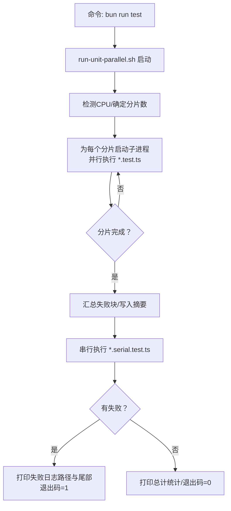
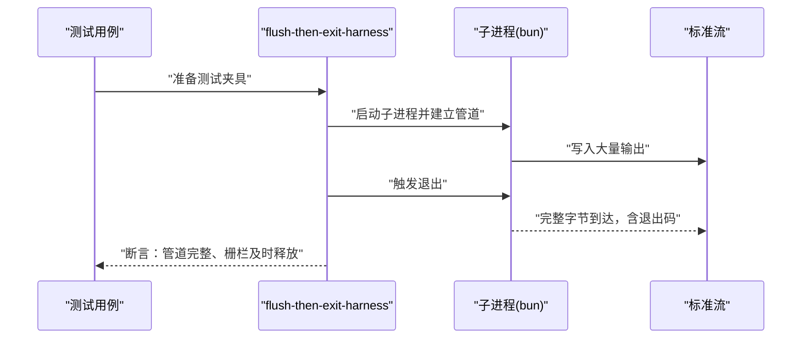
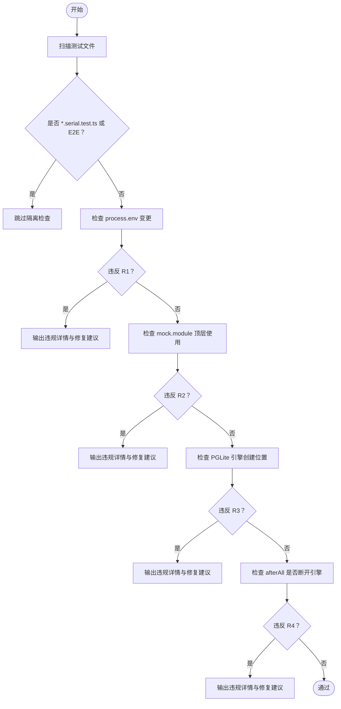
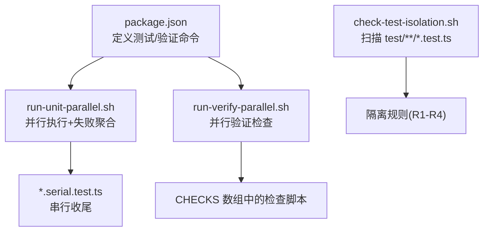

# 单元测试

<cite>
**本文引用的文件**
- [README.md](file://README.md)
- [docs/TESTING.md](file://docs/TESTING.md)
- [package.json](file://package.json)
- [scripts/run-unit-parallel.sh](file://scripts/run-unit-parallel.sh)
- [scripts/run-verify-parallel.sh](file://scripts/run-verify-parallel.sh)
- [scripts/check-test-isolation.sh](file://scripts/check-test-isolation.sh)
- [test/helpers/with-env.ts](file://test/helpers/with-env.ts)
- [test/helpers/reset-pglite.ts](file://test/helpers/reset-pglite.ts)
</cite>

## 目录
1. [简介](#简介)
2. [项目结构](#项目结构)
3. [核心组件](#核心组件)
4. [架构总览](#架构总览)
5. [详细组件分析](#详细组件分析)
6. [依赖关系分析](#依赖关系分析)
7. [性能考量](#性能考量)
8. [故障排查指南](#故障排查指南)
9. [结论](#结论)
10. [附录](#附录)

## 简介
本文件系统性梳理 GBrain 的单元测试体系，覆盖测试组织与命名约定、并行执行机制、测试隔离与内存管理、测试辅助工具、断言与模拟策略、测试数据准备、覆盖率与报告、最佳实践与常见陷阱等。目标是帮助开发者在保持高内聚低耦合的前提下，编写高质量、可维护、可扩展的单元测试。

## 项目结构
- 测试入口与脚本
  - 快速单元测试：通过并行分片运行，随后串行执行 *.serial.test.ts 文件，失败时输出聚合日志与摘要。
  - 验证门禁：并行执行多项静态检查（隐私、JSONB、源隔离、类型检查等），作为预推送门禁。
  - 文档化测试命令层级与本地/CI 差异。
- 测试分类
  - *.test.ts：快速并行单元测试集合。
  - *.slow.test.ts：冷路径/耗时测试，仅在显式命令下运行。
  - *.serial.test.ts：跨文件共享状态或进程级副作用的测试，需串行执行以避免竞态。
  - test/e2e/*：需要真实 Postgres 的端到端测试。
  - test/fuzz/*：基于属性的模糊测试，保证纯验证器的“纯净”性。
- 辅助与工具
  - withEnv：安全地修改进程环境变量并在回调后恢复。
  - resetPgliteState：在不重建引擎的前提下重置 PGLite 数据，提升性能并避免泄漏。

章节来源
- [docs/TESTING.md:10-46](file://docs/TESTING.md#L10-L46)
- [package.json:40-62](file://package.json#L40-L62)

## 核心组件
- 并行执行器（run-unit-parallel.sh）
  - 将测试集按哈希分片，多进程并行执行；每个分片设置超时保护；汇总失败块、写入摘要文件；最后串行执行 *.serial.test.ts。
- 验证门禁（run-verify-parallel.sh）
  - 并行执行 20+ 检查项（如隐私、JSONB、源投影、类型检查等），统一记录日志与退出码，失败时输出失败清单与日志尾部。
- 隔离规则与扫描（check-test-isolation.sh）
  - 对非串行单元测试施加四条规则：禁止直接修改 process.env、禁止顶层 mock.module、PGLite 引擎必须在 beforeAll 上下文附近创建且必须在 afterAll 断开连接。
- 测试辅助
  - withEnv：用于环境变量变更的安全包装，避免跨文件泄漏。
  - resetPgliteState：在 beforeAll 共享引擎、beforeEach 重置用户数据的模式中，避免重复初始化带来的性能损耗与数据污染。

章节来源
- [scripts/run-unit-parallel.sh:1-430](file://scripts/run-unit-parallel.sh#L1-L430)
- [scripts/run-verify-parallel.sh:1-203](file://scripts/run-verify-parallel.sh#L1-L203)
- [scripts/check-test-isolation.sh:1-156](file://scripts/check-test-isolation.sh#L1-L156)
- [test/helpers/with-env.ts:1-90](file://test/helpers/with-env.ts#L1-L90)
- [test/helpers/reset-pglite.ts:1-78](file://test/helpers/reset-pglite.ts#L1-L78)

## 架构总览
下图展示了从命令到测试执行、并行分片、失败聚合与串行收尾的整体流程。

图表来源
- [scripts/run-unit-parallel.sh:112-429](file://scripts/run-unit-parallel.sh#L112-L429)

章节来源
- [scripts/run-unit-parallel.sh:112-429](file://scripts/run-unit-parallel.sh#L112-L429)

## 详细组件分析

### 组件A：并行执行器（run-unit-parallel.sh）
- 功能要点
  - 分片策略：按文件名哈希分配，确保不同分片无交集。
  - 超时保护：每分片独立超时，防止卡死影响整体进度。
  - 失败聚合：从各分片日志中提取失败块，写入统一失败日志，并打印带时间戳的摘要。
  - 串行收尾：并行结束后，串行执行 *.serial.test.ts，确保跨文件共享状态的测试稳定。
- 性能特征
  - 通过减少 PGLite 初始化次数与重置用户数据，显著降低测试总时长。
  - 默认分片上限与超时值在不同平台做了权衡，兼顾稳定性与速度。

章节来源
- [scripts/run-unit-parallel.sh:112-429](file://scripts/run-unit-parallel.sh#L112-L429)

### 组件B：验证门禁（run-verify-parallel.sh）
- 功能要点
  - 并行执行 20+ 预设检查，包括隐私、JSONB、源隔离、类型检查、管理员构建校验等。
  - 每个检查独立超时，失败时输出检查名称与日志尾部，便于定位问题。
- 使用建议
  - 在提交前或推送前运行，确保代码质量与一致性。

章节来源
- [scripts/run-verify-parallel.sh:36-203](file://scripts/run-verify-parallel.sh#L36-L203)

### 组件C：隔离规则与扫描（check-test-isolation.sh）
- 规则概览
  - R1：禁止直接修改 process.env；应使用 withEnv 包装。
  - R2：禁止在顶层进行模块 mock；应改用 *.serial.test.ts 或重构生产代码以支持注入。
  - R3：PGLite 引擎实例必须在 beforeAll 上下文附近创建（限定行距）。
  - R4：凡创建 PGLite 引擎的文件，必须在 afterAll 中断开连接。
- 运行方式
  - 扫描 test/**/*.test.ts（排除 *.serial.test.ts 与 test/e2e/**），对违规文件输出详细信息与修复建议。

章节来源
- [scripts/check-test-isolation.sh:8-156](file://scripts/check-test-isolation.sh#L8-L156)

### 组件D：测试辅助工具
- withEnv
  - 作用：保存并恢复指定键的旧值，支持删除键与批量覆盖，异常时也能正确恢复。
  - 注意：跨测试安全，但同一文件内的并发测试（如 test.concurrent）仍会竞争全局环境变量。
- resetPgliteState
  - 作用：在不重建引擎的情况下，清空公共表并保留迁移版本与生成时钟等基础设施表，再回填默认源记录。
  - 模式：beforeAll 创建引擎并初始化 schema；afterAll 断开连接；beforeEach 调用重置。

章节来源
- [test/helpers/with-env.ts:48-90](file://test/helpers/with-env.ts#L48-L90)
- [test/helpers/reset-pglite.ts:50-78](file://test/helpers/reset-pglite.ts#L50-L78)

### 组件E：API/服务组件调用序列（示例：flush-then-exit）
以下序列图展示了一个典型“先刷新再退出”的流程，体现测试对真实子进程管道语义的验证与断言。

图表来源
- [docs/TESTING.md:127-133](file://docs/TESTING.md#L127-L133)

章节来源
- [docs/TESTING.md:127-133](file://docs/TESTING.md#L127-L133)

### 组件F：复杂逻辑组件（示例：测试隔离规则）
下图展示隔离规则的判定流程，帮助理解如何在测试中规避跨文件泄漏。

图表来源
- [scripts/check-test-isolation.sh:100-135](file://scripts/check-test-isolation.sh#L100-L135)

章节来源
- [scripts/check-test-isolation.sh:100-135](file://scripts/check-test-isolation.sh#L100-L135)

## 依赖关系分析
- 命令与脚本
  - package.json 定义了测试与验证命令，run-unit-parallel.sh 与 run-verify-parallel.sh 是核心执行器。
- 脚本间依赖
  - run-unit-parallel.sh 依赖分片与超时工具，最终汇总失败并串行执行 *.serial.test.ts。
  - run-verify-parallel.sh 依赖 CHECKS 数组中的所有检查脚本。
- 隔离规则与测试文件
  - check-test-isolation.sh 扫描 test/**/*.test.ts（排除 *.serial.test.ts 与 test/e2e/**），确保规则被遵守。

图表来源
- [package.json:40-62](file://package.json#L40-L62)
- [scripts/run-unit-parallel.sh:112-429](file://scripts/run-unit-parallel.sh#L112-L429)
- [scripts/run-verify-parallel.sh:36-67](file://scripts/run-verify-parallel.sh#L36-L67)
- [scripts/check-test-isolation.sh:73-78](file://scripts/check-test-isolation.sh#L73-L78)

章节来源
- [package.json:40-62](file://package.json#L40-L62)
- [scripts/run-unit-parallel.sh:112-429](file://scripts/run-unit-parallel.sh#L112-L429)
- [scripts/run-verify-parallel.sh:36-67](file://scripts/run-verify-parallel.sh#L36-L67)
- [scripts/check-test-isolation.sh:73-78](file://scripts/check-test-isolation.sh#L73-L78)

## 性能考量
- 并行分片
  - 采用哈希分片避免文件冲突，减少不必要的同步成本；默认分片上限与超时值在不同平台做了平衡。
- PGLite 性能优化
  - beforeAll 创建引擎并 initSchema，beforeEach 仅调用 resetPgliteState，避免重复冷启动。
  - 保留 schema_version 与 page_generation_clock 等基础设施表，确保迁移与计数逻辑不受影响。
- 验证门禁并行化
  - 将多个静态检查并行执行，显著缩短预检时间。

章节来源
- [scripts/run-unit-parallel.sh:61-81](file://scripts/run-unit-parallel.sh#L61-L81)
- [test/helpers/reset-pglite.ts:50-78](file://test/helpers/reset-pglite.ts#L50-L78)
- [scripts/run-verify-parallel.sh:108-149](file://scripts/run-verify-parallel.sh#L108-L149)

## 故障排查指南
- 并行分片卡住
  - 现象：某分片长时间无输出或超时。
  - 排查：查看 .context/test-failures.log 中对应分片的“WEDGED”标记与最后若干行日志；确认是否存在 PGLite 冷启动或外部依赖阻塞。
- 串行测试失败
  - 现象：并行通过但串行阶段失败。
  - 排查：检查 *.serial.test.ts 是否存在跨文件共享状态或进程级副作用；必要时将文件重命名为 *.serial.test.ts。
- 隔离规则违规
  - 现象：check-test-isolation.sh 报告 R1/R2/R3/R4 违规。
  - 排查：使用 withEnv 替代直接修改 process.env；避免顶层 mock.module；将 PGLite 引擎创建移至 beforeAll 上下文附近并在 afterAll 断开连接。
- 环境变量并发冲突
  - 现象：同一文件内并发测试因竞争 process.env 导致不稳定。
  - 排查：避免在同一文件中对相同键使用 test.concurrent；或将该文件改为 *.serial.test.ts。

章节来源
- [scripts/run-unit-parallel.sh:317-352](file://scripts/run-unit-parallel.sh#L317-L352)
- [scripts/check-test-isolation.sh:139-153](file://scripts/check-test-isolation.sh#L139-L153)
- [test/helpers/with-env.ts:16-21](file://test/helpers/with-env.ts#L16-L21)

## 结论
GBrain 的单元测试体系通过“并行快跑 + 验证门禁 + 隔离规则 + 辅助工具”的组合，实现了高效、稳定、可维护的测试闭环。遵循本文的组织与实践建议，可在保证覆盖率的同时，显著提升开发效率与回归质量。

## 附录

### A. 命名约定与文件分类
- *.test.ts：快速并行单元测试。
- *.slow.test.ts：冷路径/耗时测试。
- *.serial.test.ts：跨文件共享状态或进程级副作用的测试。
- test/e2e/*：需要真实 Postgres 的端到端测试。
- test/fuzz/*：属性驱动的模糊测试。

章节来源
- [docs/TESTING.md:38-46](file://docs/TESTING.md#L38-L46)

### B. 断言模式与模拟策略
- 断言模式
  - 使用 Bun 的内置断言能力，结合“失败块聚合”与“摘要文件”，便于定位问题。
- 模拟策略
  - 避免顶层 mock.module；优先通过 withEnv 或构造函数注入替换依赖。
  - 对于必须隔离的场景，使用 *.serial.test.ts。

章节来源
- [scripts/run-unit-parallel.sh:299-352](file://scripts/run-unit-parallel.sh#L299-L352)
- [scripts/check-test-isolation.sh:13-14](file://scripts/check-test-isolation.sh#L13-L14)

### C. 测试数据准备与隔离
- PGLite 数据准备
  - beforeAll：创建引擎并初始化 schema。
  - beforeEach：调用 resetPgliteState 清理用户数据并回填默认源。
  - afterAll：断开引擎，避免泄漏。
- 环境变量准备
  - 使用 withEnv 包裹对 process.env 的修改，确保异常时也能恢复。

章节来源
- [test/helpers/reset-pglite.ts:19-31](file://test/helpers/reset-pglite.ts#L19-L31)
- [test/helpers/with-env.ts:48-75](file://test/helpers/with-env.ts#L48-L75)

### D. 测试覆盖率与报告
- 覆盖率收集
  - 仓库未在本文件中提供覆盖率收集脚本或配置，建议在 CI 中集成覆盖率工具（例如基于 Bun 的覆盖率插件）并将其纳入 run-verify-parallel.sh 的检查集合。
- 报告生成
  - run-unit-parallel.sh 输出失败日志与摘要文件；run-verify-parallel.sh 输出每个检查的日志与失败清单。

章节来源
- [scripts/run-unit-parallel.sh:19-22](file://scripts/run-unit-parallel.sh#L19-L22)
- [scripts/run-verify-parallel.sh:88-97](file://scripts/run-verify-parallel.sh#L88-L97)

### E. 最佳实践与常见陷阱
- 最佳实践
  - 优先使用 *.test.ts；仅在确有必要时使用 *.serial.test.ts。
  - 使用 withEnv 包裹环境变量变更；避免在顶层进行模块 mock。
  - 使用 resetPgliteState 提升性能并避免数据污染。
  - 在提交前运行 run-verify-parallel.sh，确保静态检查全部通过。
- 常见陷阱
  - 在同一文件中对相同键使用 test.concurrent 修改 process.env。
  - 将 PGLite 引擎创建在 beforeAll 之外或遗漏 afterAll 断开连接。
  - 忽略 *.serial.test.ts 的存在而强行并行化。

章节来源
- [test/helpers/with-env.ts:16-21](file://test/helpers/with-env.ts#L16-L21)
- [test/helpers/reset-pglite.ts:33-39](file://test/helpers/reset-pglite.ts#L33-L39)
- [scripts/check-test-isolation.sh:139-153](file://scripts/check-test-isolation.sh#L139-L153)