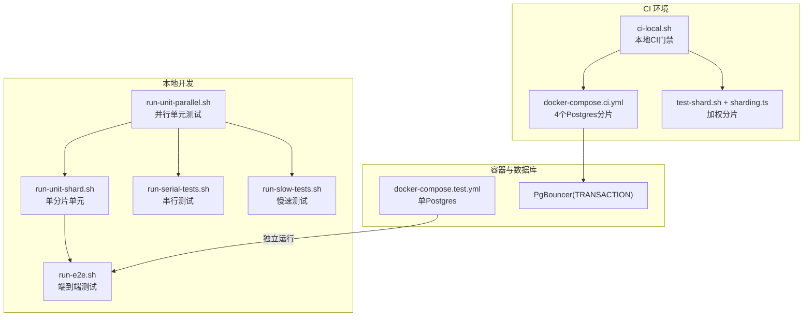
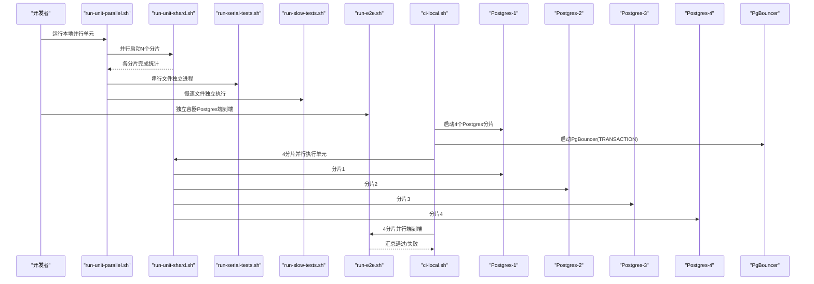
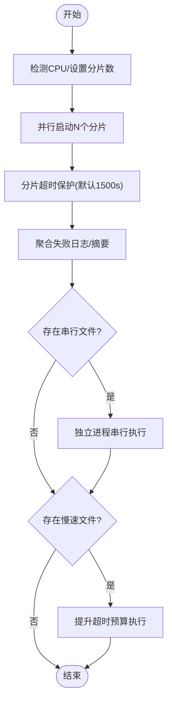
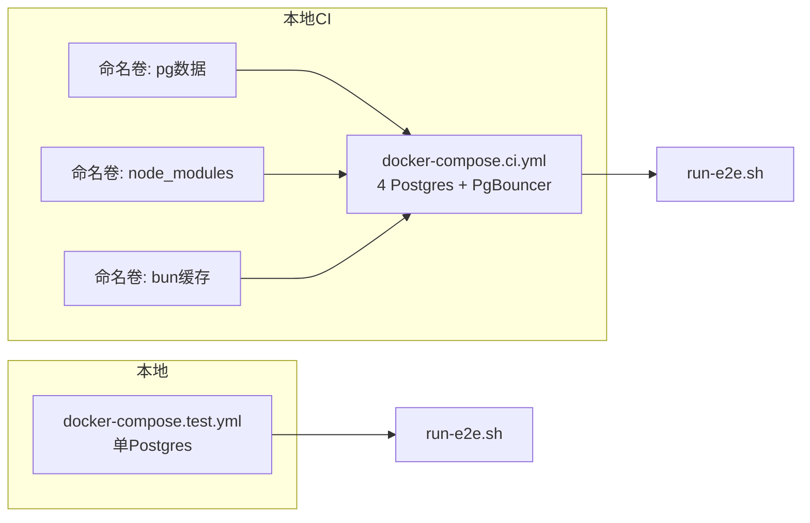
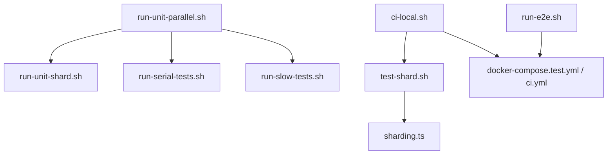

# 测试执行与CI

<cite>
**本文引用的文件**
- [README.md](file://README.md)
- [docs/TESTING.md](file://docs/TESTING.md)
- [docker-compose.test.yml](file://docker-compose.test.yml)
- [docker-compose.ci.yml](file://docker-compose.ci.yml)
- [scripts/run-unit-parallel.sh](file://scripts/run-unit-parallel.sh)
- [scripts/run-unit-shard.sh](file://scripts/run-unit-shard.sh)
- [scripts/run-serial-tests.sh](file://scripts/run-serial-tests.sh)
- [scripts/run-slow-tests.sh](file://scripts/run-slow-tests.sh)
- [scripts/run-e2e.sh](file://scripts/run-e2e.sh)
- [scripts/test-shard.sh](file://scripts/test-shard.sh)
- [scripts/sharding.ts](file://scripts/sharding.ts)
- [scripts/ci-local.sh](file://scripts/ci-local.sh)
- [scripts/profile-tests.sh](file://scripts/profile-tests.sh)
</cite>

## 目录
1. [简介](#简介)
2. [项目结构](#项目结构)
3. [核心组件](#核心组件)
4. [架构总览](#架构总览)
5. [详细组件分析](#详细组件分析)
6. [依赖关系分析](#依赖关系分析)
7. [性能考量](#性能考量)
8. [故障排查指南](#故障排查指南)
9. [结论](#结论)
10. [附录](#附录)

## 简介
本文件系统性梳理 GBrain 的测试执行与 CI/CD 流程，覆盖测试分类（单元、串行、慢速、端到端）、并行执行策略、Docker 容器化测试环境、CI 矩阵与缓存、并发控制、覆盖率与质量门禁、报告生成、失败处理与重试、调试工具、以及性能基准与回归自动化。目标是帮助开发者在本地快速迭代，在 CI 中稳定收敛。

## 项目结构
围绕测试与 CI 的关键目录与文件：
- 测试脚本与分片：scripts/*.sh、scripts/sharding.ts
- 测试用例：test/**/*.test.ts、test/e2e/**/*.test.ts
- 容器编排：docker-compose.test.yml、docker-compose.ci.yml
- 文档：docs/TESTING.md

图示来源
- [scripts/run-unit-parallel.sh](file://scripts/run-unit-parallel.sh)
- [scripts/run-unit-shard.sh](file://scripts/run-unit-shard.sh)
- [scripts/run-serial-tests.sh](file://scripts/run-serial-tests.sh)
- [scripts/run-slow-tests.sh](file://scripts/run-slow-tests.sh)
- [scripts/run-e2e.sh](file://scripts/run-e2e.sh)
- [scripts/ci-local.sh](file://scripts/ci-local.sh)
- [docker-compose.ci.yml](file://docker-compose.ci.yml)
- [docker-compose.test.yml](file://docker-compose.test.yml)

章节来源
- [docs/TESTING.md](file://docs/TESTING.md)
- [scripts/run-unit-parallel.sh](file://scripts/run-unit-parallel.sh)
- [scripts/run-unit-shard.sh](file://scripts/run-unit-shard.sh)
- [scripts/run-serial-tests.sh](file://scripts/run-serial-tests.sh)
- [scripts/run-slow-tests.sh](file://scripts/run-slow-tests.sh)
- [scripts/run-e2e.sh](file://scripts/run-e2e.sh)
- [scripts/test-shard.sh](file://scripts/test-shard.sh)
- [scripts/sharding.ts](file://scripts/sharding.ts)
- [scripts/ci-local.sh](file://scripts/ci-local.sh)
- [docker-compose.test.yml](file://docker-compose.test.yml)
- [docker-compose.ci.yml](file://docker-compose.ci.yml)

## 核心组件
- 测试命令层级与职责
  - 单元并行：8 分片并行，排除慢速与串行文件，适合本地内循环
  - 验证门禁：预提交权威门禁，包含类型检查与多项静态检查
  - 全量测试：验证门禁 + 单元 + 慢速 + 智能端到端
  - 慢速测试：仅运行 *.slow.test.ts
  - 串行测试：仅运行 *.serial.test.ts，每个文件独立进程隔离
  - 端到端：真实 Postgres，顺序执行，避免跨文件竞态
- 分片与权重
  - CI 使用加权 LPT 最小化各分片总耗时
  - 本地默认轮询分片，排除慢速与串行文件
- 容器化测试
  - 单容器 Postgres：docker-compose.test.yml
  - 本地CI：4 个 Postgres 分片 + PgBouncer TRANSACTION 模式，4 分片并行执行端到端

章节来源
- [docs/TESTING.md](file://docs/TESTING.md)
- [scripts/test-shard.sh](file://scripts/test-shard.sh)
- [scripts/sharding.ts](file://scripts/sharding.ts)
- [scripts/run-unit-parallel.sh](file://scripts/run-unit-parallel.sh)
- [scripts/run-unit-shard.sh](file://scripts/run-unit-shard.sh)
- [scripts/run-serial-tests.sh](file://scripts/run-serial-tests.sh)
- [scripts/run-slow-tests.sh](file://scripts/run-slow-tests.sh)
- [scripts/run-e2e.sh](file://scripts/run-e2e.sh)
- [docker-compose.test.yml](file://docker-compose.test.yml)
- [docker-compose.ci.yml](file://docker-compose.ci.yml)

## 架构总览
下图展示本地与 CI 的测试执行路径与资源隔离：

图示来源
- [scripts/run-unit-parallel.sh](file://scripts/run-unit-parallel.sh)
- [scripts/run-unit-shard.sh](file://scripts/run-unit-shard.sh)
- [scripts/run-serial-tests.sh](file://scripts/run-serial-tests.sh)
- [scripts/run-slow-tests.sh](file://scripts/run-slow-tests.sh)
- [scripts/run-e2e.sh](file://scripts/run-e2e.sh)
- [scripts/ci-local.sh](file://scripts/ci-local.sh)
- [docker-compose.ci.yml](file://docker-compose.ci.yml)

## 详细组件分析

### 测试分类与执行策略
- 单元测试（*.test.ts）
  - 本地：8 分片并行，排除 *.slow 与 *.serial
  - CI：按权重 LPT 分片，包含 *.slow；另有两个重文件单独作业
- 串行测试（*.serial.test.ts）
  - 排除在并行分片之外，每个文件独立进程，避免模块注册表泄漏
- 慢速测试（*.slow.test.ts）
  - 本地不参与快速循环；CI 默认包含，必要时可跳过
- 端到端测试（test/e2e/*.test.ts）
  - 顺序执行，共享一个数据库，避免 TRUNCATE/CASCADE 竞态
  - 本地可用 docker-compose.test.yml 快速启动单实例 Postgres
  - CI 使用 4 个 Postgres 分片 + PgBouncer TRANSACTION 模式并行执行

章节来源
- [docs/TESTING.md](file://docs/TESTING.md)
- [scripts/run-unit-parallel.sh](file://scripts/run-unit-parallel.sh)
- [scripts/run-unit-shard.sh](file://scripts/run-unit-shard.sh)
- [scripts/run-serial-tests.sh](file://scripts/run-serial-tests.sh)
- [scripts/run-slow-tests.sh](file://scripts/run-slow-tests.sh)
- [scripts/run-e2e.sh](file://scripts/run-e2e.sh)
- [docker-compose.test.yml](file://docker-compose.test.yml)
- [docker-compose.ci.yml](file://docker-compose.ci.yml)

### 并行测试执行与优化
- 本地并行
  - 自适应 CPU 数检测，上限 8，CI 默认 4，兼顾稳定性
  - 每分片超时上限可调，默认 1500s，避免长尾挂起
  - 失败优先日志：聚合失败块、打印失败摘要、输出失败日志绝对路径
- CI 分片
  - 加权 LPT 分片（基于历史运行时间权重），最小化各分片总耗时
  - 两个重文件单独作业，避免矩阵分片过载
- 串行与慢速
  - 串行文件独立进程，确保模块级隔离
  - 慢速文件提升单测超时预算，减少 CPU 竞争导致的误判

图示来源
- [scripts/run-unit-parallel.sh](file://scripts/run-unit-parallel.sh)
- [scripts/run-serial-tests.sh](file://scripts/run-serial-tests.sh)
- [scripts/run-slow-tests.sh](file://scripts/run-slow-tests.sh)

章节来源
- [scripts/run-unit-parallel.sh](file://scripts/run-unit-parallel.sh)
- [scripts/run-serial-tests.sh](file://scripts/run-serial-tests.sh)
- [scripts/run-slow-tests.sh](file://scripts/run-slow-tests.sh)
- [scripts/sharding.ts](file://scripts/sharding.ts)
- [scripts/test-shard.sh](file://scripts/test-shard.sh)

### Docker 容器化测试环境
- 单实例 Postgres（本地）
  - docker-compose.test.yml 提供 pgvector:pg16，端口映射默认 5434
  - 适合快速启动与调试，无需 PgBouncer
- 本地CI门禁（推荐）
  - docker-compose.ci.yml 启动 4 个 Postgres 分片 + PgBouncer（TRANSACTION 模式）
  - 4 分片并行执行单元 + 端到端，提升吞吐
  - 命名卷缓存容器依赖与 bun 缓存，加速重复运行
- 端到端隔离
  - run-e2e.sh 在每个文件前终止非当前连接，避免跨文件状态污染
  - HOME/GBRAIN_HOME 隔离，测试结束后校验用户配置未被修改

图示来源
- [docker-compose.test.yml](file://docker-compose.test.yml)
- [docker-compose.ci.yml](file://docker-compose.ci.yml)
- [scripts/run-e2e.sh](file://scripts/run-e2e.sh)
- [scripts/ci-local.sh](file://scripts/ci-local.sh)

章节来源
- [docker-compose.test.yml](file://docker-compose.test.yml)
- [docker-compose.ci.yml](file://docker-compose.ci.yml)
- [scripts/run-e2e.sh](file://scripts/run-e2e.sh)
- [scripts/ci-local.sh](file://scripts/ci-local.sh)

### CI/CD 流水线配置指南
- 任务划分
  - gitleaks（主机侧）：预提交安全扫描
  - 验证门禁：check:* 电池 + 类型检查
  - 单元测试：按权重 LPT 分片（CI），本地轮询分片（排除慢速/串行）
  - 端到端：4 分片并行，顺序执行文件，避免跨文件竞态
  - 串行测试：CI 专用作业，独立进程
  - 两个重文件：单独作业并行
- 矩阵与分片
  - CI 使用 scripts/test-shard.sh + scripts/sharding.ts 实现 LPT 加权分片
  - 本地 scripts/run-unit-shard.sh 采用轮询分片，排除慢速/串行
- 缓存策略
  - 本地CI：命名卷缓存 Postgres 数据、node_modules、bun 安装缓存
  - 本地并行：分片超时与失败聚合，便于快速定位问题
- 并发控制
  - 单元：分片内并发由 bun 控制，分片间并行
  - 端到端：文件级顺序执行，分片内顺序执行
  - PgBouncer：TRANSACTION 池模式，模拟生产拓扑

章节来源
- [scripts/ci-local.sh](file://scripts/ci-local.sh)
- [scripts/test-shard.sh](file://scripts/test-shard.sh)
- [scripts/sharding.ts](file://scripts/sharding.ts)
- [scripts/run-unit-shard.sh](file://scripts/run-unit-shard.sh)
- [docker-compose.ci.yml](file://docker-compose.ci.yml)

### 覆盖率、质量门禁与报告
- 质量门禁
  - 验证门禁（bun run verify）：包含隐私、JSONB、进度输出、导出数量等静态检查
  - 类型检查：并入验证门禁
- 报告与日志
  - 失败优先日志：.context/test-failures.log 聚合失败块，带分片前缀
  - 摘要：.context/test-summary.txt 记录每分片 pass/fail/skip/rc
  - 端到端：run-e2e.sh 输出文件/测试总数与通过/失败计数
- 建议
  - 将覆盖率工具集成于 CI（如 Istanbul/Bun 覆盖率），在验证门禁中统一产出与归档

章节来源
- [docs/TESTING.md](file://docs/TESTING.md)
- [scripts/run-unit-parallel.sh](file://scripts/run-unit-parallel.sh)
- [scripts/run-e2e.sh](file://scripts/run-e2e.sh)

### 测试失败处理、重试与调试
- 失败处理
  - 分片超时：记录“WEDGED”并附最后若干行日志
  - 失败聚合：按分片提取失败块，输出绝对路径与最后 30 行
  - 端到端 HOME 隔离：若发现用户配置被写入，以更高严重度退出
- 重试机制
  - 单元：通过分片重试与失败聚合实现
  - 端到端：文件级顺序执行，失败快速暴露；建议在 CI 层对不稳定用例启用重试
- 调试工具
  - 性能剖析：scripts/profile-tests.sh 从上次运行日志提取耗时，排序输出
  - 分片列表：--dry-run-list 用于验证分片与选择逻辑
  - 本地CI差异模式：--diff 仅运行受影响的端到端文件

章节来源
- [scripts/run-unit-parallel.sh](file://scripts/run-unit-parallel.sh)
- [scripts/run-e2e.sh](file://scripts/run-e2e.sh)
- [scripts/profile-tests.sh](file://scripts/profile-tests.sh)
- [scripts/ci-local.sh](file://scripts/ci-local.sh)

### 性能基准与回归自动化
- 性能基准
  - scripts/profile-tests.sh 可对上次运行进行耗时分析，识别热点用例
  - 建议将关键基准（如检索/合成）纳入 CI，形成回归基线
- 回归自动化
  - 端到端文件顺序执行，避免跨文件状态污染
  - 本地CI 4 分片并行，显著缩短端到端总耗时
  - 对不稳定用例可在 CI 层启用重试或降噪

章节来源
- [scripts/profile-tests.sh](file://scripts/profile-tests.sh)
- [scripts/run-e2e.sh](file://scripts/run-e2e.sh)
- [scripts/ci-local.sh](file://scripts/ci-local.sh)

## 依赖关系分析
- 组件耦合
  - run-unit-parallel.sh 依赖 run-unit-shard.sh 与 run-serial-tests.sh、run-slow-tests.sh
  - CI 通过 test-shard.sh + sharding.ts 实现分片，与本地策略互补
  - run-e2e.sh 依赖 docker-compose.test.yml 或 docker-compose.ci.yml 提供的数据库
- 外部依赖
  - Docker Compose、PgBouncer、pgvector:pg16
  - bun（版本随 oven/bun:1 浮动）

图示来源
- [scripts/run-unit-parallel.sh](file://scripts/run-unit-parallel.sh)
- [scripts/run-unit-shard.sh](file://scripts/run-unit-shard.sh)
- [scripts/run-serial-tests.sh](file://scripts/run-serial-tests.sh)
- [scripts/run-slow-tests.sh](file://scripts/run-slow-tests.sh)
- [scripts/ci-local.sh](file://scripts/ci-local.sh)
- [scripts/test-shard.sh](file://scripts/test-shard.sh)
- [scripts/sharding.ts](file://scripts/sharding.ts)
- [docker-compose.test.yml](file://docker-compose.test.yml)
- [docker-compose.ci.yml](file://docker-compose.ci.yml)

章节来源
- [scripts/run-unit-parallel.sh](file://scripts/run-unit-parallel.sh)
- [scripts/run-unit-shard.sh](file://scripts/run-unit-shard.sh)
- [scripts/run-serial-tests.sh](file://scripts/run-serial-tests.sh)
- [scripts/run-slow-tests.sh](file://scripts/run-slow-tests.sh)
- [scripts/ci-local.sh](file://scripts/ci-local.sh)
- [scripts/test-shard.sh](file://scripts/test-shard.sh)
- [scripts/sharding.ts](file://scripts/sharding.ts)
- [docker-compose.test.yml](file://docker-compose.test.yml)
- [docker-compose.ci.yml](file://docker-compose.ci.yml)

## 性能考量
- 分片策略
  - CI 使用 LPT 加权分片，平衡各分片总耗时，降低长尾风险
  - 本地默认 4 分片，避免过度并行导致锁竞争与资源争用
- 超时与稳定性
  - 分片超时默认 1500s，串行/慢速文件提升单测超时预算
  - 端到端文件级顺序执行，避免 TRUNCATE/CASCADE 竞态
- 缓存与复用
  - 本地CI 使用命名卷缓存依赖与安装缓存，显著缩短二次运行时间
- 数据库池化
  - PgBouncer TRANSACTION 模式模拟生产拓扑，提升端到端稳定性

## 故障排查指南
- 常见问题
  - 分片超时：查看 .context/test-failures.log 中“WEDGED”标记与最后若干行日志
  - HOME 隔离破坏：run-e2e.sh 会检测用户配置是否被修改，异常时以高严重度退出
  - 端到端竞态：确认未并行运行同一数据库上的多个端到端文件
- 工具与技巧
  - 使用 scripts/profile-tests.sh 分析上次运行耗时
  - 使用 --dry-run-list 验证分片与文件选择逻辑
  - 本地CI 差异模式 --diff 仅运行受影响的端到端文件

章节来源
- [scripts/run-unit-parallel.sh](file://scripts/run-unit-parallel.sh)
- [scripts/run-e2e.sh](file://scripts/run-e2e.sh)
- [scripts/profile-tests.sh](file://scripts/profile-tests.sh)
- [scripts/ci-local.sh](file://scripts/ci-local.sh)

## 结论
GBrain 的测试体系通过“本地快速循环 + CI 权重分片”的组合，实现了高效稳定的持续交付。容器化与 PgBouncer 的引入进一步提升了端到端的可重复性与生产一致性。建议在现有基础上补充覆盖率与报告归档，并在 CI 层对不稳定用例增加重试策略，以进一步提升吞吐与稳定性。

## 附录
- 命令速查
  - 本地并行单元：bun run test
  - 验证门禁：bun run verify
  - 全量测试：bun run test:full
  - 慢速测试：bun run test:slow
  - 串行测试：bun run test:serial
  - 端到端：bun run test:e2e
  - 本地CI门禁：bun run ci:local
- 关键脚本
  - 分片与权重：scripts/test-shard.sh、scripts/sharding.ts
  - 并行与聚合：scripts/run-unit-parallel.sh
  - 文件级顺序执行：scripts/run-e2e.sh
  - 容器编排：docker-compose.test.yml、docker-compose.ci.yml

章节来源
- [README.md](file://README.md)
- [docs/TESTING.md](file://docs/TESTING.md)
- [scripts/test-shard.sh](file://scripts/test-shard.sh)
- [scripts/sharding.ts](file://scripts/sharding.ts)
- [scripts/run-unit-parallel.sh](file://scripts/run-unit-parallel.sh)
- [scripts/run-e2e.sh](file://scripts/run-e2e.sh)
- [docker-compose.test.yml](file://docker-compose.test.yml)
- [docker-compose.ci.yml](file://docker-compose.ci.yml)