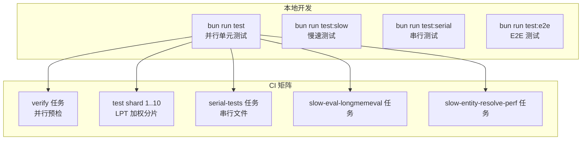
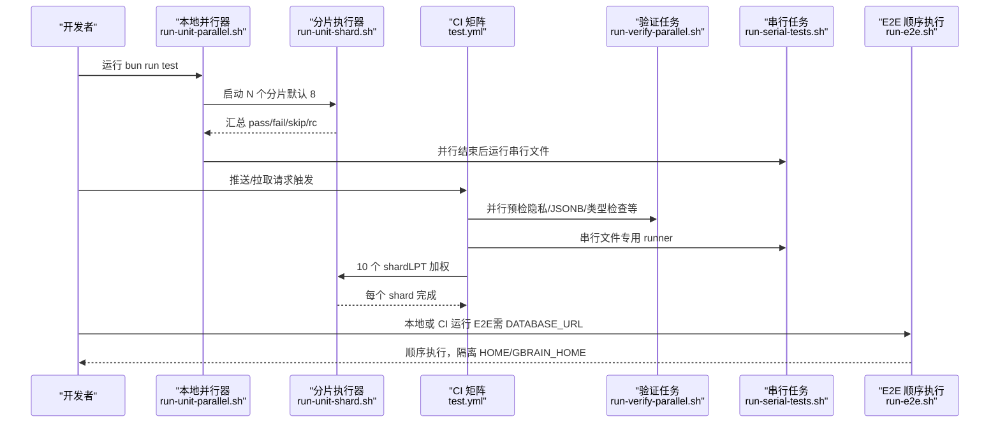
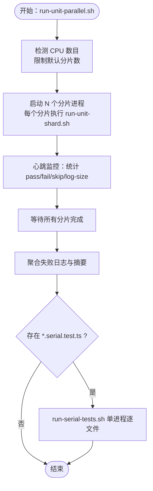
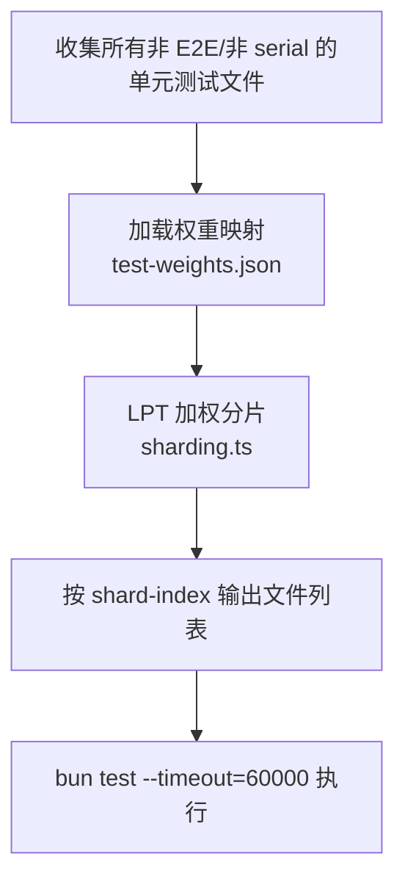
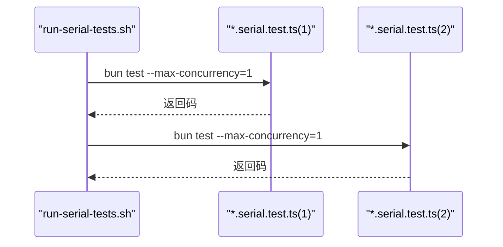
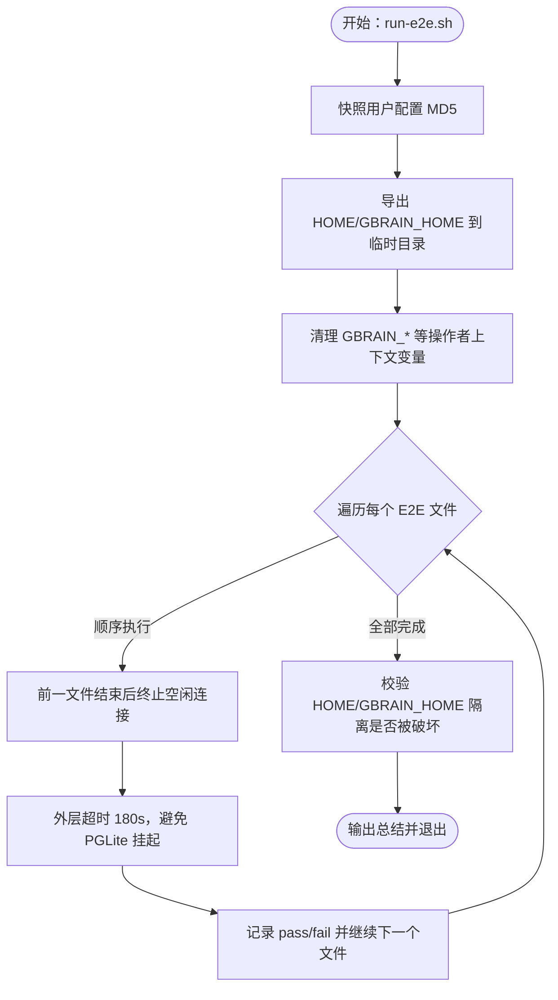
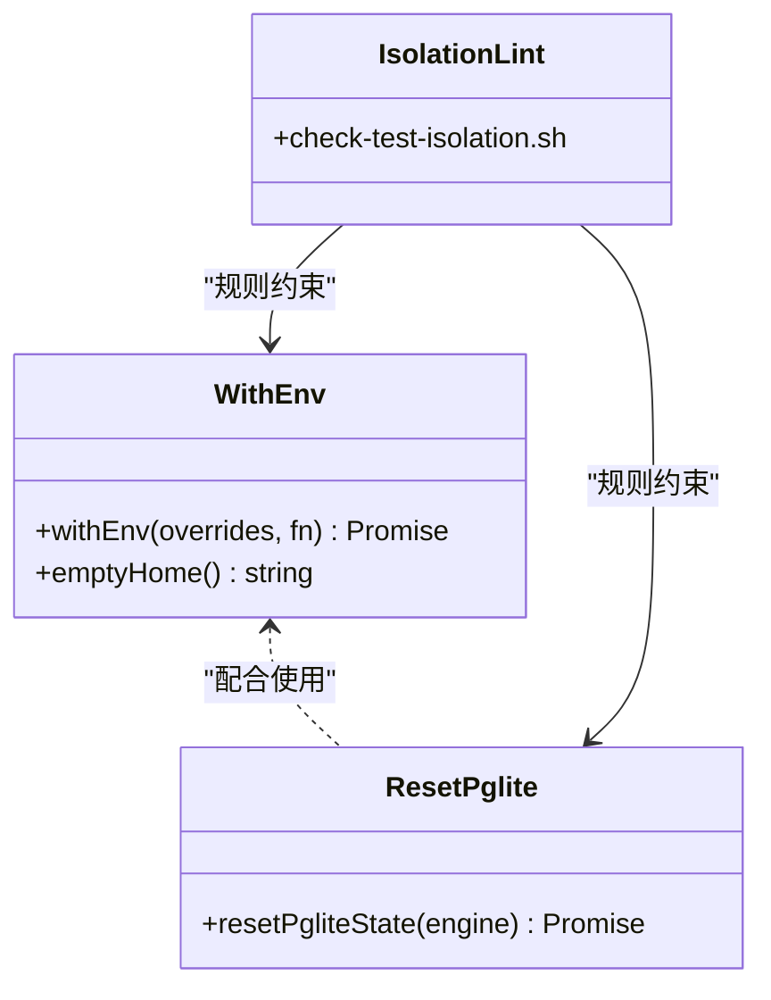
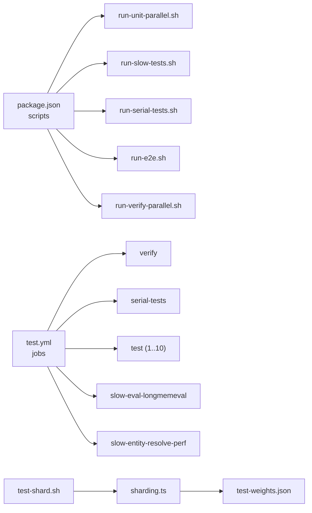

# 测试策略

<cite>
**本文引用的文件**
- [docs/TESTING.md](file://docs/TESTING.md)
- [.github/workflows/test.yml](file://.github/workflows/test.yml)
- [package.json](file://package.json)
- [scripts/run-unit-parallel.sh](file://scripts/run-unit-parallel.sh)
- [scripts/run-unit-shard.sh](file://scripts/run-unit-shard.sh)
- [scripts/run-serial-tests.sh](file://scripts/run-serial-tests.sh)
- [scripts/run-slow-tests.sh](file://scripts/run-slow-tests.sh)
- [scripts/run-e2e.sh](file://scripts/run-e2e.sh)
- [scripts/run-verify-parallel.sh](file://scripts/run-verify-parallel.sh)
- [scripts/sharding.ts](file://scripts/sharding.ts)
- [scripts/test-shard.sh](file://scripts/test-shard.sh)
- [scripts/test-weights.json](file://scripts/test-weights.json)
- [scripts/check-test-isolation.sh](file://scripts/check-test-isolation.sh)
- [test/helpers/with-env.ts](file://test/helpers/with-env.ts)
- [test/helpers/reset-pglite.ts](file://test/helpers/reset-pglite.ts)
</cite>

## 目录
1. [简介](#简介)
2. [项目结构](#项目结构)
3. [核心组件](#核心组件)
4. [架构总览](#架构总览)
5. [详细组件分析](#详细组件分析)
6. [依赖关系分析](#依赖关系分析)
7. [性能考量](#性能考量)
8. [故障排除指南](#故障排除指南)
9. [结论](#结论)
10. [附录](#附录)

## 简介
本文件系统化阐述 GBrain 的测试策略与实践，覆盖单元测试、集成测试与端到端测试（E2E）的组织方式；详述并行测试执行、隔离规则与测试环境配置；文档化测试分类（unit、serial、slow、e2e）及其运行方式；提供测试编写指南（断言模式、模拟策略、测试数据准备）；说明 CI/CD 中的测试流程、覆盖率与质量门禁；并给出故障排除与调试技巧。

## 项目结构
- 测试命令分层：通过 seven 层测试命令实现从本地快速迭代到 CI 全量验证的完整闭环。
- 文件分类：按文件后缀区分单元/慢速/串行/E2E；另有 fuzz 与 heavy 脚本用于属性测试与重负载场景。
- 并行与分片：本地使用 round-robin 分片；CI 使用基于权重感知的最长处理时间优先（LPT）算法进行分片，平衡各 shard 总耗时。
- 隔离与安全：通过 withEnv、resetPglite、序列化 E2E 执行等手段，确保跨文件与跨进程状态不泄漏。

图表来源
- [package.json:40-62](file://package.json#L40-L62)
- [.github/workflows/test.yml:94-226](file://.github/workflows/test.yml#L94-L226)

章节来源
- [docs/TESTING.md:6-25](file://docs/TESTING.md#L6-L25)
- [package.json:40-62](file://package.json#L40-L62)

## 核心组件
- 测试命令与分层
  - 单元测试（本地快速循环）：并行 8 分片，排除 slow 与 serial，适合高频迭代。
  - 慢速测试：仅运行 *.slow.test.ts，显式超时放宽，用于冷路径正确性。
  - 串行测试：仅运行 *.serial.test.ts，每个文件独立进程，避免模块注册表共享导致的状态泄漏。
  - E2E 测试：顺序执行，共享一个数据库实例，确保 fixture 不互相污染。
  - 验证（verify）：并行执行 20+ 预检检查（隐私、JSONB、源投影、类型检查等），作为 CI 的权威前置门禁。
- 分片与并行
  - 本地：scripts/run-unit-shard.sh 基于索引轮询分片；scripts/run-unit-parallel.sh 启动多个 shard 并聚合失败日志。
  - CI：scripts/test-shard.sh 结合 scripts/sharding.ts 使用 LPT 加权分片，scripts/test-weights.json 提供历史运行时权重。
- 隔离与安全
  - withEnv：在单个测试用例内安全地修改 process.env，并在 finally 中恢复，避免跨文件泄漏。
  - resetPglite：在 beforeAll 创建引擎，在 beforeEach 重置用户数据，afterAll 断开连接，避免跨文件泄漏。
  - E2E HOME 隔离：通过临时 HOME/GBRAIN_HOME 隔离用户配置，防止写入真实用户目录。
- 规则与检查
  - scripts/check-test-isolation.sh：强制非串行单元文件遵守 env、mock.module、PGLite 生命周期等规则。

章节来源
- [docs/TESTING.md:6-46](file://docs/TESTING.md#L6-L46)
- [scripts/run-unit-parallel.sh:1-430](file://scripts/run-unit-parallel.sh#L1-L430)
- [scripts/run-unit-shard.sh:1-79](file://scripts/run-unit-shard.sh#L1-L79)
- [scripts/run-serial-tests.sh:1-59](file://scripts/run-serial-tests.sh#L1-L59)
- [scripts/run-slow-tests.sh:1-26](file://scripts/run-slow-tests.sh#L1-L26)
- [scripts/run-e2e.sh:1-244](file://scripts/run-e2e.sh#L1-L244)
- [scripts/run-verify-parallel.sh:1-203](file://scripts/run-verify-parallel.sh#L1-L203)
- [scripts/sharding.ts:1-257](file://scripts/sharding.ts#L1-L257)
- [scripts/test-shard.sh:1-112](file://scripts/test-shard.sh#L1-L112)
- [scripts/test-weights.json:1-200](file://scripts/test-weights.json#L1-L200)
- [scripts/check-test-isolation.sh:1-156](file://scripts/check-test-isolation.sh#L1-L156)
- [test/helpers/with-env.ts:1-90](file://test/helpers/with-env.ts#L1-L90)
- [test/helpers/reset-pglite.ts:1-78](file://test/helpers/reset-pglite.ts#L1-L78)

## 架构总览
下图展示本地与 CI 的测试执行流，以及关键隔离与分片机制：

图表来源
- [package.json:40-62](file://package.json#L40-L62)
- [.github/workflows/test.yml:94-226](file://.github/workflows/test.yml#L94-L226)
- [scripts/run-unit-parallel.sh:1-430](file://scripts/run-unit-parallel.sh#L1-L430)
- [scripts/run-serial-tests.sh:1-59](file://scripts/run-serial-tests.sh#L1-L59)
- [scripts/run-e2e.sh:1-244](file://scripts/run-e2e.sh#L1-L244)
- [scripts/run-verify-parallel.sh:1-203](file://scripts/run-verify-parallel.sh#L1-L203)

## 详细组件分析

### 组件 A：并行单元测试执行（本地）
- 目标：最大化本地内循环速度，快速反馈。
- 关键点：
  - 默认 8 分片并行，每分片内部可设置 --max-concurrency。
  - 失败首日志：每个分片输出失败块，汇总至 .context/test-failures.log，并打印带绝对路径的醒目横幅。
  - 超时保护：每个分片有独立超时上限，超时标记为“楔住（wedged）”，保留最后若干行日志。
  - 串行文件在并行完成后单独执行，保证模块级状态隔离。

图表来源
- [scripts/run-unit-parallel.sh:1-430](file://scripts/run-unit-parallel.sh#L1-L430)
- [scripts/run-unit-shard.sh:1-79](file://scripts/run-unit-shard.sh#L1-L79)
- [scripts/run-serial-tests.sh:1-59](file://scripts/run-serial-tests.sh#L1-L59)

章节来源
- [docs/TESTING.md:6-25](file://docs/TESTING.md#L6-L25)
- [scripts/run-unit-parallel.sh:1-430](file://scripts/run-unit-parallel.sh#L1-L430)

### 组件 B：CI 分片与加权平衡（LPT）
- 目标：在多核 CI 上均衡各 shard 总耗时，缩短整体完成时间。
- 关键点：
  - 使用 scripts/sharding.ts 的 LPT 算法，按 scripts/test-weights.json 的历史权重分配文件。
  - 未命中权重的文件回退到语料中位数，新文件即时可用。
  - CI 矩阵 10 个 shard，verify 与 serial-tests 各自独立作业，减少对主矩阵的负担。
  - 两个大原子（长测例）移出矩阵，单独作业并行执行。

图表来源
- [scripts/test-shard.sh:1-112](file://scripts/test-shard.sh#L1-L112)
- [scripts/sharding.ts:1-257](file://scripts/sharding.ts#L1-L257)
- [scripts/test-weights.json:1-200](file://scripts/test-weights.json#L1-L200)
- [.github/workflows/test.yml:186-226](file://.github/workflows/test.yml#L186-L226)

章节来源
- [docs/TESTING.md:20-25](file://docs/TESTING.md#L20-L25)
- [.github/workflows/test.yml:186-226](file://.github/workflows/test.yml#L186-L226)
- [scripts/test-shard.sh:1-112](file://scripts/test-shard.sh#L1-L112)
- [scripts/sharding.ts:1-257](file://scripts/sharding.ts#L1-L257)

### 组件 C：串行测试（*.serial.test.ts）
- 目标：隔离具有全局状态共享或竞争条件的测试文件。
- 关键点：
  - 每个文件独立进程，避免模块注册表共享导致的 mock/module 泄漏。
  - 适用于使用顶级 mock.module、环境耦合、或需要进程生命周期控制的文件。
  - CI 将其置于独立 runner，避免影响矩阵 shard。

图表来源
- [scripts/run-serial-tests.sh:1-59](file://scripts/run-serial-tests.sh#L1-L59)
- [.github/workflows/test.yml:117-137](file://.github/workflows/test.yml#L117-L137)

章节来源
- [docs/TESTING.md:42-43](file://docs/TESTING.md#L42-L43)
- [scripts/run-serial-tests.sh:1-59](file://scripts/run-serial-tests.sh#L1-L59)
- [.github/workflows/test.yml:117-137](file://.github/workflows/test.yml#L117-L137)

### 组件 D：慢速测试（*.slow.test.ts）
- 目标：覆盖冷路径与长时间运行的正确性检查。
- 关键点：
  - 本地通过 bun run test:slow 显式运行；CI 在矩阵之外单独执行。
  - 单个测试放宽超时，避免并行时因 CPU 竞争导致误超时。

章节来源
- [docs/TESTING.md:15-16](file://docs/TESTING.md#L15-L16)
- [scripts/run-slow-tests.sh:1-26](file://scripts/run-slow-tests.sh#L1-L26)

### 组件 E：端到端测试（E2E）
- 目标：在真实 Postgres+pgvector 环境下验证端到端行为。
- 关键点：
  - 顺序执行，避免多个文件同时 TRUNCATE/CASCADE 导致的竞态。
  - HOME/GBRAIN_HOME 隔离，防止写入用户真实配置。
  - 支持按 shard 切分（如 SHARD=1/4），但分片内仍保持顺序以消除竞态。
  - 未设置 DATABASE_URL 时跳过，避免静默回归。

图表来源
- [scripts/run-e2e.sh:1-244](file://scripts/run-e2e.sh#L1-L244)

章节来源
- [docs/TESTING.md:217-247](file://docs/TESTING.md#L217-L247)
- [scripts/run-e2e.sh:1-244](file://scripts/run-e2e.sh#L1-L244)

### 组件 F：验证（verify）与预检
- 目标：在进入主测试矩阵之前，统一执行多项静态/运行时检查，作为权威前置门禁。
- 关键点：
  - 并行执行 20+ 检查（隐私、JSONB、source-id 投影、类型检查、管理员构建等）。
  - 每项检查独立进程，带超时保护，失败时输出检查名与日志尾部。
  - CI 的 verify 任务独立运行，避免拖慢矩阵 shard。

章节来源
- [docs/TESTING.md:13](file://docs/TESTING.md#L13)
- [scripts/run-verify-parallel.sh:1-203](file://scripts/run-verify-parallel.sh#L1-L203)
- [.github/workflows/test.yml:94-116](file://.github/workflows/test.yml#L94-L116)

### 组件 G：隔离规则与辅助工具
- withEnv：在单个测试用例内修改 process.env，并在 finally 中恢复，避免跨文件泄漏；注意不支持同一文件内的并发测试。
- resetPglite：在 beforeAll 创建引擎，在 beforeEach 重置用户数据，afterAll 断开连接，避免跨文件泄漏。
- check-test-isolation：强制非串行单元文件遵守 env、mock.module、PGLite 生命周期等规则；允许白名单逐步缩小。

图表来源
- [test/helpers/with-env.ts:1-90](file://test/helpers/with-env.ts#L1-L90)
- [test/helpers/reset-pglite.ts:1-78](file://test/helpers/reset-pglite.ts#L1-L78)
- [scripts/check-test-isolation.sh:1-156](file://scripts/check-test-isolation.sh#L1-L156)

章节来源
- [docs/TESTING.md:47-114](file://docs/TESTING.md#L47-L114)
- [test/helpers/with-env.ts:1-90](file://test/helpers/with-env.ts#L1-L90)
- [test/helpers/reset-pglite.ts:1-78](file://test/helpers/reset-pglite.ts#L1-L78)
- [scripts/check-test-isolation.sh:1-156](file://scripts/check-test-isolation.sh#L1-L156)

## 依赖关系分析
- 命令到脚本的映射
  - bun run test → scripts/run-unit-parallel.sh
  - bun run test:slow → scripts/run-slow-tests.sh
  - bun run test:serial → scripts/run-serial-tests.sh
  - bun run test:e2e → scripts/run-e2e.sh
  - bun run verify → scripts/run-verify-parallel.sh
- CI 任务依赖
  - verify 任务先于矩阵与串行任务执行。
  - 矩阵 10 个 shard 并行，verify/serial/slow-* 与之并行或独立。
- 分片与权重
  - scripts/test-shard.sh 读取文件列表并通过 sharding.ts 分片。
  - scripts/test-weights.json 提供历史权重，缺失权重回退中位数。

图表来源
- [package.json:40-62](file://package.json#L40-L62)
- [.github/workflows/test.yml:94-226](file://.github/workflows/test.yml#L94-L226)
- [scripts/test-shard.sh:1-112](file://scripts/test-shard.sh#L1-L112)
- [scripts/sharding.ts:1-257](file://scripts/sharding.ts#L1-L257)
- [scripts/test-weights.json:1-200](file://scripts/test-weights.json#L1-L200)

章节来源
- [package.json:40-62](file://package.json#L40-L62)
- [.github/workflows/test.yml:94-226](file://.github/workflows/test.yml#L94-L226)
- [scripts/test-shard.sh:1-112](file://scripts/test-shard.sh#L1-L112)
- [scripts/sharding.ts:1-257](file://scripts/sharding.ts#L1-L257)

## 性能考量
- 本地快速循环
  - 默认 8 分片并行，结合 round-robin 分片，显著缩短 wallclock。
  - 失败首日志与心跳监控提升可观测性，便于快速定位问题。
- CI 加权分片
  - LPT 算法与历史权重（test-weights.json）使各 shard 总耗时更均衡，整体完成时间更短。
  - 两个大原子移出矩阵，避免主导单个 shard 的耗时。
- PGLite 数据重置
  - beforeAll 创建引擎，beforeEach resetPgliteState 清理用户数据，afterAll 断开连接，避免重复 schema 初始化带来的冷启动成本。
- 超时与稳定性
  - 分片与测试文件分别设置超时上限，防止挂起导致整个流水线阻塞。
  - CI 中 verify 与 serial-tests 独立作业，降低主矩阵压力。

章节来源
- [docs/TESTING.md:10-17](file://docs/TESTING.md#L10-L17)
- [scripts/run-unit-parallel.sh:61-81](file://scripts/run-unit-parallel.sh#L61-L81)
- [scripts/test-shard.sh:73-79](file://scripts/test-shard.sh#L73-L79)
- [test/helpers/reset-pglite.ts:1-78](file://test/helpers/reset-pglite.ts#L1-L78)

## 故障排除指南
- 并行失败定位
  - 查看 .context/test-failures.log 或临时目录下的失败日志，其中包含每个分片的失败块与摘要。
  - 若出现“楔住（WEDGED）”标记，检查该分片日志末尾，通常由超时或 PGLite 冷启动导致。
- 串行文件问题
  - *.serial.test.ts 文件若在并行中出现跨文件干扰，确认已迁移到串行；或修复文件内的全局状态共享。
- E2E 隔离破坏
  - run-e2e.sh 在结束后会校验用户真实配置是否被修改；若失败，检查是否存在写入 HOME/GBRAIN_HOME 的路径。
- 验证失败
  - run-verify-parallel.sh 会输出具体失败检查名称与日志尾部；根据提示逐一修复。
- 权重与分片异常
  - 若发现某 shard 特别慢，检查 scripts/test-weights.json 是否需要更新；必要时重新挖掘权重。

章节来源
- [docs/TESTING.md:27-36](file://docs/TESTING.md#L27-L36)
- [scripts/run-e2e.sh:204-234](file://scripts/run-e2e.sh#L204-L234)
- [scripts/run-verify-parallel.sh:175-198](file://scripts/run-verify-parallel.sh#L175-L198)
- [scripts/test-shard.sh:73-79](file://scripts/test-shard.sh#L73-L79)

## 结论
GBrain 的测试体系通过“本地快速循环 + CI 加权分片 + 严格隔离”的组合，实现了高效率与高可靠性并存的测试策略。verify 作为权威前置门禁，确保代码质量门槛；unit/serial/slow/e2e 四类测试覆盖不同复杂度与环境需求；CI 的 LPT 分片与独立作业进一步优化了整体吞吐。遵循 withEnv/resetPglite 等隔离规范，可有效避免跨文件状态泄漏，提升稳定性。

## 附录
- 测试分类与运行方式
  - unit：默认 bun run test，本地 8 分片并行，排除 slow/serial。
  - serial：bun run test:serial，每个文件独立进程，CI 独立 runner。
  - slow：bun run test:slow，显式运行冷路径测试。
  - e2e：bun run test:e2e，顺序执行，需 DATABASE_URL。
  - verify：bun run verify，CI 的权威预检。
- 编写指南要点
  - 断言模式：优先使用明确的断言与最小可复现 fixture；对异步/并发逻辑使用稳定的超时与重试策略。
  - 模拟策略：尽量使用 withEnv 替代直接修改 process.env；避免在顶级作用域使用 mock.module，必要时归档为 *.serial.test.ts。
  - 测试数据准备：使用 resetPgliteState 清理用户数据；对需要真实配置的场景，使用 emptyHome() 与 withEnv 组合。
- CI/CD 中的质量门禁
  - verify 必须全绿；matrix 10 个 shard 全部成功；serial-tests 成功；慢速任务成功；缓存命中可跳过全量执行。
- 覆盖率与质量门禁
  - 文档未提供覆盖率阈值；建议在 CI 中引入覆盖率报告与阈值门禁，结合 verify 与 E2E 一起作为质量门。

章节来源
- [docs/TESTING.md:6-46](file://docs/TESTING.md#L6-L46)
- [package.json:40-62](file://package.json#L40-L62)
- [.github/workflows/test.yml:94-287](file://.github/workflows/test.yml#L94-L287)