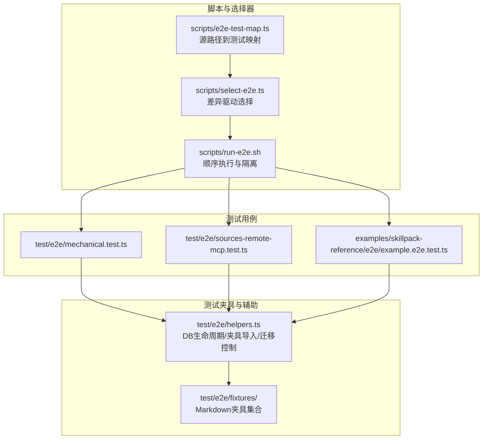
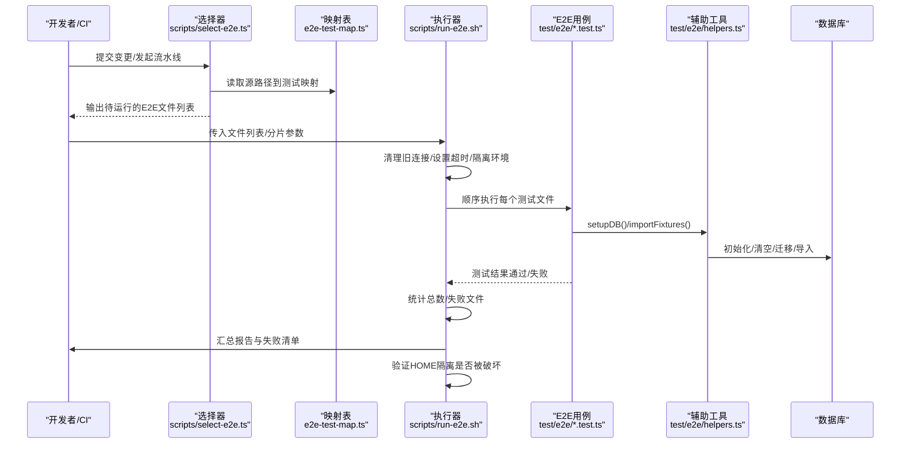
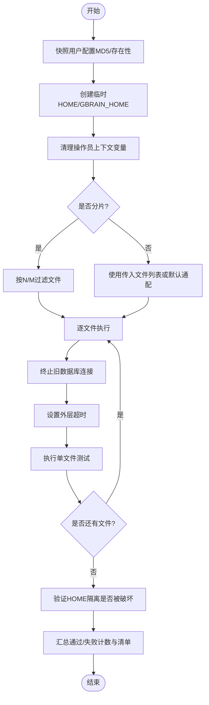
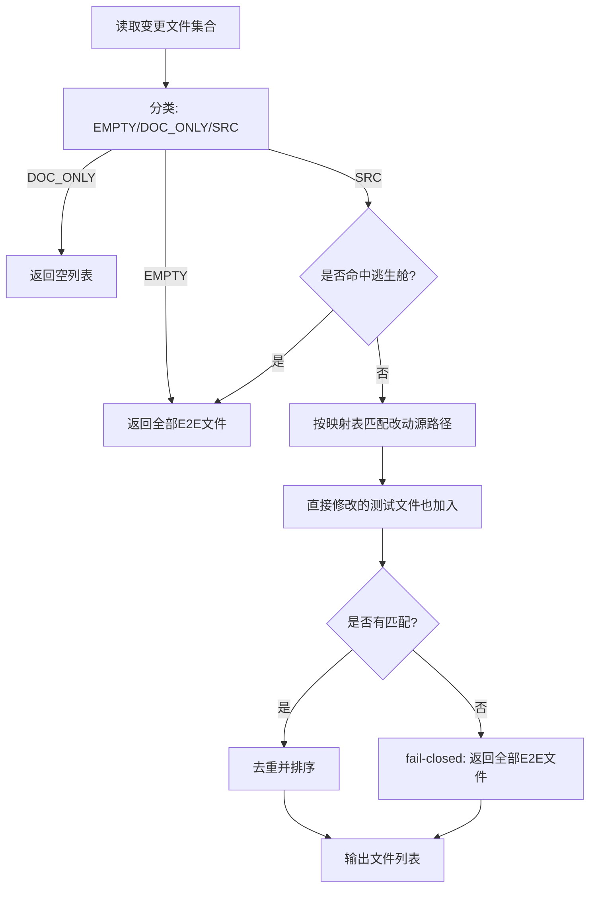
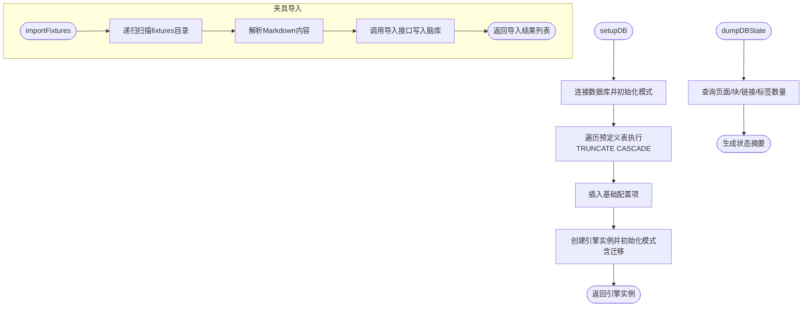
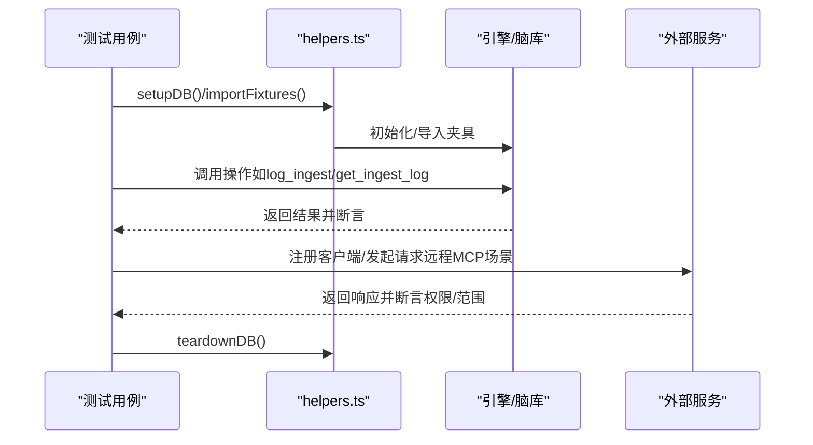
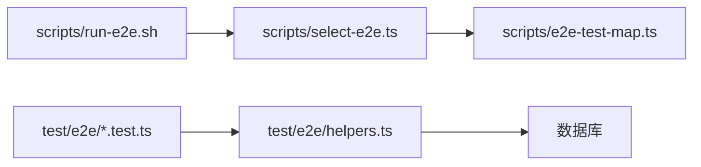

# 端到端测试

<cite>
**本文引用的文件**
- [scripts/run-e2e.sh](file://scripts/run-e2e.sh)
- [scripts/select-e2e.ts](file://scripts/select-e2e.ts)
- [scripts/e2e-test-map.ts](file://scripts/e2e-test-map.ts)
- [test/e2e/helpers.ts](file://test/e2e/helpers.ts)
- [test/scripts/select-e2e.test.ts](file://test/scripts/select-e2e.test.ts)
- [test/e2e/mechanical.test.ts](file://test/e2e/mechanical.test.ts)
- [test/e2e/sources-remote-mcp.test.ts](file://test/e2e/sources-remote-mcp.test.ts)
- [examples/skillpack-reference/e2e/example.e2e.test.ts](file://examples/skillpack-reference/e2e/example.e2e.test.ts)
</cite>

## 目录
1. [引言](#引言)
2. [项目结构](#项目结构)
3. [核心组件](#核心组件)
4. [架构总览](#架构总览)
5. [详细组件分析](#详细组件分析)
6. [依赖关系分析](#依赖关系分析)
7. [性能考量](#性能考量)
8. [故障排查指南](#故障排查指南)
9. [结论](#结论)
10. [附录](#附录)

## 引言
本文件系统性阐述 GBrain 的端到端测试（E2E）体系：整体架构与测试流程设计、测试夹具（fixtures）组织与管理、完整用户场景测试用例（安装流程、功能验证与回归测试）、测试环境配置（数据库、外部服务模拟与网络）、测试数据生命周期与清理策略、测试结果分析与失败诊断、重试机制以及在 CI/CD 流水线中的执行策略。目标是帮助开发者与测试工程师快速理解并高效维护 E2E 测试。

## 项目结构
- E2E 测试入口与选择器
  - 脚本层：通过脚本驱动测试执行与选择，保证隔离、顺序与可重复性。
  - 选择器：基于变更集的智能筛选，仅运行受影响的 E2E 测试，避免全量回归。
- 测试夹具与辅助工具
  - 夹具（fixtures）：以 Markdown 文档形式组织，按需导入到脑库中，形成稳定的初始状态。
  - 辅助工具：数据库生命周期管理、迁移控制、计时与调试转储等。
- 示例与参考
  - 示例技能包中的 E2E 用例作为参考实现，展示如何组织端到端场景。

**图表来源**
- [scripts/run-e2e.sh:1-244](file://scripts/run-e2e.sh#L1-L244)
- [scripts/select-e2e.ts:1-246](file://scripts/select-e2e.ts#L1-L246)
- [scripts/e2e-test-map.ts:1-109](file://scripts/e2e-test-map.ts#L1-L109)
- [test/e2e/helpers.ts:1-295](file://test/e2e/helpers.ts#L1-L295)
- [test/e2e/mechanical.test.ts:506-542](file://test/e2e/mechanical.test.ts#L506-L542)
- [test/e2e/sources-remote-mcp.test.ts:133-162](file://test/e2e/sources-remote-mcp.test.ts#L133-L162)
- [examples/skillpack-reference/e2e/example.e2e.test.ts](file://examples/skillpack-reference/e2e/example.e2e.test.ts)

**章节来源**
- [scripts/run-e2e.sh:1-244](file://scripts/run-e2e.sh#L1-L244)
- [scripts/select-e2e.ts:1-246](file://scripts/select-e2e.ts#L1-L246)
- [scripts/e2e-test-map.ts:1-109](file://scripts/e2e-test-map.ts#L1-L109)
- [test/e2e/helpers.ts:1-295](file://test/e2e/helpers.ts#L1-L295)

## 核心组件
- 运行器与隔离
  - 顺序执行：为避免共享数据库的并发截断冲突，采用逐文件顺序执行策略。
  - HOME 隔离：通过临时 HOME 与 GBRAIN_HOME，确保配置写入不污染真实用户环境。
  - 环境净化：剔除可能影响测试行为的操作员上下文变量，保证“无主见”的测试环境。
  - 连接终止：在每个文件执行前终止旧连接，避免跨文件状态污染。
  - 外层超时：对单文件执行施加硬性超时，防止卡死导致流水线阻塞。
- 差异驱动的选择器
  - 基于工作区变更与未跟踪文件，分类 EMPTY/DOC_ONLY/SRC，决定是否运行全部或部分 E2E。
  - 支持“逃生舱”触发：当命中特定文件或前缀时，直接运行全部 E2E。
  - 源路径到测试映射：通过最小通配符匹配，将改动的源代码映射到受影响的 E2E 文件集合。
- 数据库生命周期与夹具
  - 初始化：连接数据库、初始化模式、清空表（保留结构与扩展）。
  - 迁移：通过引擎路径应用迁移，保证每次测试从正确版本开始。
  - 夹具导入：递归扫描 fixtures 目录，解析 Markdown 并导入到脑库，支持批量与单个导入。
  - 调试转储：失败时输出关键统计，便于定位问题。
  - 版本回退与重放：支持将 schema 回退到指定版本再逐步重放迁移，用于链路回归。

**章节来源**
- [scripts/run-e2e.sh:1-244](file://scripts/run-e2e.sh#L1-L244)
- [scripts/select-e2e.ts:1-246](file://scripts/select-e2e.ts#L1-L246)
- [scripts/e2e-test-map.ts:1-109](file://scripts/e2e-test-map.ts#L1-L109)
- [test/e2e/helpers.ts:1-295](file://test/e2e/helpers.ts#L1-L295)

## 架构总览
下图展示了从变更检测到测试执行、再到结果汇总与隔离验证的完整流程。

**图表来源**
- [scripts/select-e2e.ts:1-246](file://scripts/select-e2e.ts#L1-L246)
- [scripts/e2e-test-map.ts:1-109](file://scripts/e2e-test-map.ts#L1-L109)
- [scripts/run-e2e.sh:1-244](file://scripts/run-e2e.sh#L1-L244)
- [test/e2e/helpers.ts:1-295](file://test/e2e/helpers.ts#L1-L295)

## 详细组件分析

### 组件A：运行器与隔离（scripts/run-e2e.sh）
- 顺序执行策略
  - 为避免多文件并发下的 TRUNCATE CASCADE 竞态，采用逐文件顺序执行，降低跨文件状态污染风险。
- HOME 隔离与校验
  - 在执行前快照用户真实配置，执行后对比 MD5 或存在性，若发生写入则以退出码区分“隔离破坏”。
- 环境净化
  - 清理操作员上下文变量（如 CONDUCTOR_*, MCP_*, OPENCLAW_*, GBRAIN_*），仅保留必要的运行时变量。
- 连接终止与外层超时
  - 执行前终止非当前进程的数据库后端，避免遗留连接；为单文件执行设置硬性超时，防止卡死。
- 分片与列表干跑
  - 支持 SHARD=N/M 对文件进行分片，每片内保持顺序；提供 --dry-run-list 仅打印将要执行的文件列表。

**图表来源**
- [scripts/run-e2e.sh:1-244](file://scripts/run-e2e.sh#L1-L244)

**章节来源**
- [scripts/run-e2e.sh:1-244](file://scripts/run-e2e.sh#L1-L244)

### 组件B：差异驱动的选择器（scripts/select-e2e.ts）
- 分类逻辑
  - EMPTY：无变更 -> 全量运行
  - DOC_ONLY：仅文档变更 -> 不运行任何 E2E
  - SRC：源代码变更 -> 进入映射选择
- 逃生舱机制
  - 命中特定文件或前缀（如 schema、migrate、db、engine、package、CI 配置、fixtures、workflows、示例技能包等）时，直接全量运行。
- 映射与匹配
  - 将改动的源路径与映射表中的通配符进行匹配，收集所有受影响的 E2E 文件；若无命中且未直接修改测试文件，则 fail-closed 决定全量运行。
- 单元测试保障
  - 提供针对分类、通配符匹配与选择逻辑的纯函数单元测试，覆盖关键分支与回归场景。

**图表来源**
- [scripts/select-e2e.ts:1-246](file://scripts/select-e2e.ts#L1-L246)
- [scripts/e2e-test-map.ts:1-109](file://scripts/e2e-test-map.ts#L1-L109)
- [test/scripts/select-e2e.test.ts:1-125](file://test/scripts/select-e2e.test.ts#L1-L125)

**章节来源**
- [scripts/select-e2e.ts:1-246](file://scripts/select-e2e.ts#L1-L246)
- [scripts/e2e-test-map.ts:1-109](file://scripts/e2e-test-map.ts#L1-L109)
- [test/scripts/select-e2e.test.ts:1-125](file://test/scripts/select-e2e.test.ts#L1-L125)

### 组件C：数据库生命周期与夹具导入（test/e2e/helpers.ts）
- 数据库准备
  - 连接数据库、初始化模式、清空所有业务表（保留结构与扩展），并重新设置基础配置。
  - 通过引擎路径再次初始化模式，确保迁移链正确应用。
- 夹具导入
  - 递归扫描 fixtures 目录，解析 Markdown 内容并导入到脑库，支持批量与单个导入。
- 调试与诊断
  - 提供计时包装与数据库状态转储，失败时输出页面、块、链接、标签数量等关键指标。
- 迁移控制
  - 支持将 schema 回退到目标版本并逐步重放迁移，用于链路回归与版本迁移验证。

**图表来源**
- [test/e2e/helpers.ts:1-295](file://test/e2e/helpers.ts#L1-L295)

**章节来源**
- [test/e2e/helpers.ts:1-295](file://test/e2e/helpers.ts#L1-L295)

### 组件D：用户场景测试用例（示例与参考）
- 机械往返（mechanical）场景
  - 展示了典型的端到端操作往返：记录摄入日志、查询摄入日志；写入原始数据、读取原始数据。
- 远程 MCP 来源场景
  - 通过子进程注册客户端、注入 PATH 与 GBRAIN_HOME，演示外部服务交互与权限控制。
- 示例技能包参考
  - 提供一个可直接参考的 E2E 示例，展示如何组织端到端场景与断言。

**图表来源**
- [test/e2e/mechanical.test.ts:506-542](file://test/e2e/mechanical.test.ts#L506-L542)
- [test/e2e/sources-remote-mcp.test.ts:133-162](file://test/e2e/sources-remote-mcp.test.ts#L133-L162)
- [test/e2e/helpers.ts:1-295](file://test/e2e/helpers.ts#L1-L295)
- [examples/skillpack-reference/e2e/example.e2e.test.ts](file://examples/skillpack-reference/e2e/example.e2e.test.ts)

**章节来源**
- [test/e2e/mechanical.test.ts:506-542](file://test/e2e/mechanical.test.ts#L506-L542)
- [test/e2e/sources-remote-mcp.test.ts:133-162](file://test/e2e/sources-remote-mcp.test.ts#L133-L162)
- [examples/skillpack-reference/e2e/example.e2e.test.ts](file://examples/skillpack-reference/e2e/example.e2e.test.ts)

## 依赖关系分析
- 选择器依赖映射表
  - 源路径到测试文件的映射由映射表提供，选择器通过最小通配符匹配实现精准筛选。
- 运行器依赖选择器输出
  - 运行器根据选择器输出的文件列表进行顺序执行，并在每个文件间进行连接终止与环境隔离。
- 测试用例依赖辅助工具
  - 各 E2E 用例通过 helpers.ts 完成数据库初始化、夹具导入与清理，确保测试隔离与可重复性。
- 变更检测与映射的契约
  - 映射表仅能“缩小”范围（从“全部”出发），不能扩大；未命中的改动默认触发全量运行，确保安全。

**图表来源**
- [scripts/select-e2e.ts:1-246](file://scripts/select-e2e.ts#L1-L246)
- [scripts/e2e-test-map.ts:1-109](file://scripts/e2e-test-map.ts#L1-L109)
- [scripts/run-e2e.sh:1-244](file://scripts/run-e2e.sh#L1-L244)
- [test/e2e/helpers.ts:1-295](file://test/e2e/helpers.ts#L1-L295)

**章节来源**
- [scripts/select-e2e.ts:1-246](file://scripts/select-e2e.ts#L1-L246)
- [scripts/e2e-test-map.ts:1-109](file://scripts/e2e-test-map.ts#L1-L109)
- [scripts/run-e2e.sh:1-244](file://scripts/run-e2e.sh#L1-L244)
- [test/e2e/helpers.ts:1-295](file://test/e2e/helpers.ts#L1-L295)

## 性能考量
- 顺序执行的权衡
  - 顺序执行消除了并发截断竞态，但增加了启动开销。通过每个文件约 1–2 秒的进程启动成本与自然测试时间叠加，整体可接受。
- 外层超时与连接终止
  - 为单文件设置硬性超时，避免 PGLite WASM 调用挂起导致的无限等待；执行前终止旧连接，减少跨文件污染与资源泄漏。
- 选择器的增量收益
  - 基于变更的筛选显著减少不必要的全量执行，尤其在文档类改动时可跳过 E2E，提升 CI 效率。

[本节为通用性能讨论，无需列出具体文件来源]

## 故障排查指南
- 隔离破坏
  - 若运行器检测到用户真实配置被修改/删除/创建，将以特定退出码提示“隔离破坏”，需检查测试中是否绕过 HOME/GBRAIN_HOME 隔离。
- 数据库状态异常
  - 使用调试转储输出页面、块、链接、标签数量，结合夹具导入结果定位缺失或多余数据。
- 迁移链问题
  - 当需要模拟旧版本 schema 行为时，使用迁移控制函数将 schema 回退到目标版本并逐步重放，复现链路回归。
- 外部服务交互
  - 远程 MCP 场景中，确认子进程继承的 PATH 与 GBRAIN_HOME 是否正确注入，以及客户端注册与权限范围是否符合预期。

**章节来源**
- [scripts/run-e2e.sh:204-234](file://scripts/run-e2e.sh#L204-L234)
- [test/e2e/helpers.ts:198-218](file://test/e2e/helpers.ts#L198-L218)
- [test/e2e/helpers.ts:225-295](file://test/e2e/helpers.ts#L225-L295)
- [test/e2e/sources-remote-mcp.test.ts:133-162](file://test/e2e/sources-remote-mcp.test.ts#L133-L162)

## 结论
GBrain 的 E2E 测试体系通过“顺序执行 + 强隔离 + 差异驱动选择 + 精准夹具导入”的组合，实现了高可靠性与高效率的端到端验证。选择器与映射表确保变更影响面最小化，辅助工具提供了完善的数据库生命周期管理与调试能力。配合 CI/CD 的分片与超时策略，能够在保证质量的同时显著缩短反馈周期。

[本节为总结性内容，无需列出具体文件来源]

## 附录

### 测试环境配置指南
- 数据库
  - 设置 DATABASE_URL 指向可用的 PostgreSQL 实例；运行器会自动初始化模式、清空表并应用迁移。
- 外部服务模拟与网络
  - 对于需要外部服务交互的场景，可通过子进程注入 PATH 与 GBRAIN_HOME，模拟本地 Git 或其他外部工具的行为。
- 环境变量与隔离
  - 运行器会清理操作员上下文变量，确保测试不受外部环境干扰；同时通过临时 HOME/GBRAIN_HOME 防止污染真实用户配置。

**章节来源**
- [scripts/run-e2e.sh:1-244](file://scripts/run-e2e.sh#L1-L244)
- [test/e2e/sources-remote-mcp.test.ts:133-162](file://test/e2e/sources-remote-mcp.test.ts#L133-L162)

### 测试数据生命周期与清理策略
- 生命周期
  - 每个测试文件在 beforeAll 中调用 setupDB，完成连接、初始化、清空与迁移；在 afterAll 中调用 teardownDB 断开连接。
- 清理策略
  - TRUNCATE CASCADE 清空业务表，保留结构与扩展；失败时可输出数据库状态转储辅助诊断。
- 夹具管理
  - 通过 fixtures 目录统一管理 Markdown 形式的夹具，支持批量导入与单个导入。

**章节来源**
- [test/e2e/helpers.ts:69-123](file://test/e2e/helpers.ts#L69-L123)
- [test/e2e/helpers.ts:140-186](file://test/e2e/helpers.ts#L140-L186)

### 测试结果分析、失败诊断与重试机制
- 结果分析
  - 运行器统计每个文件的通过/失败数量与总体汇总，并输出失败文件清单。
- 失败诊断
  - 使用调试转储输出关键统计；结合选择器输出的文件列表，快速定位问题范围。
- 重试机制
  - 当前实现未内置自动重试；建议在 CI 层对失败文件进行二次尝试或人工干预。

**章节来源**
- [scripts/run-e2e.sh:177-195](file://scripts/run-e2e.sh#L177-L195)
- [test/e2e/helpers.ts:198-218](file://test/e2e/helpers.ts#L198-L218)

### CI/CD 流水线中的 E2E 执行策略
- 差异驱动
  - 使用选择器根据变更集输出待运行文件列表，避免文档类改动触发 E2E。
- 分片执行
  - 支持 SHARD=N/M 对文件进行分片，每片内顺序执行，降低单机压力。
- 超时与失败处理
  - 单文件外层超时防止卡死；失败即刻退出，便于快速反馈。

**章节来源**
- [scripts/select-e2e.ts:1-246](file://scripts/select-e2e.ts#L1-L246)
- [scripts/run-e2e.sh:102-129](file://scripts/run-e2e.sh#L102-L129)
- [scripts/run-e2e.sh:165-176](file://scripts/run-e2e.sh#L165-L176)