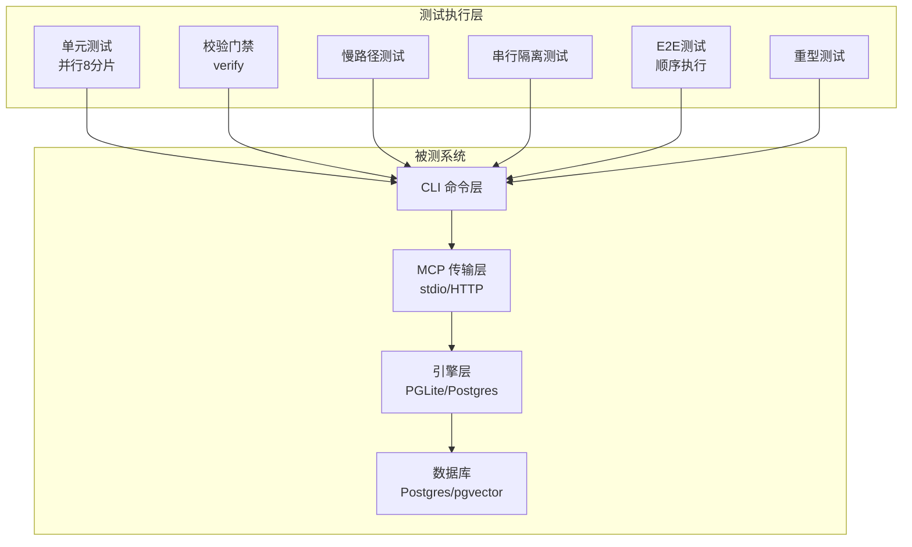
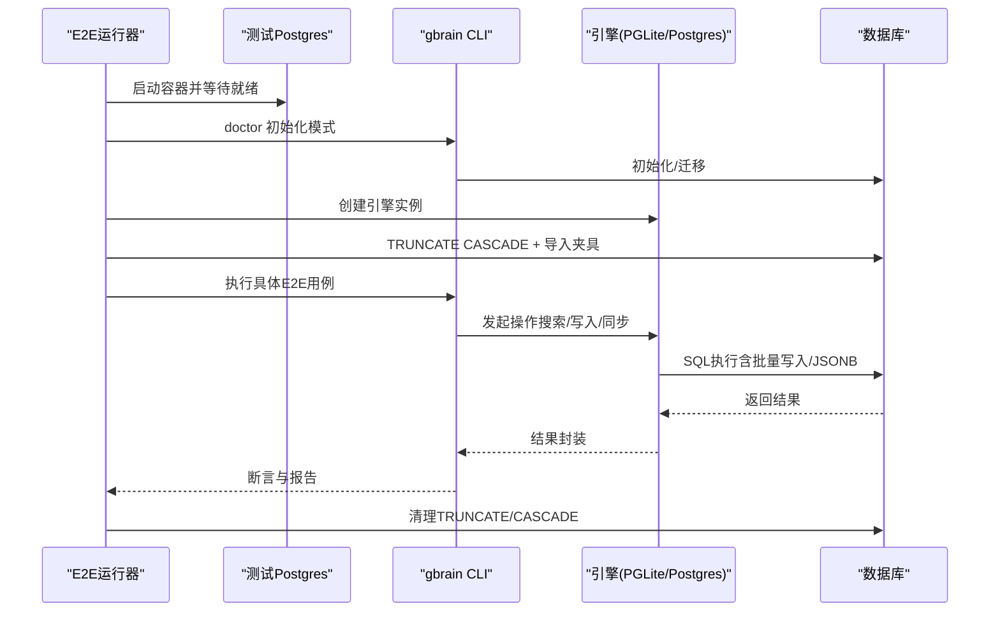
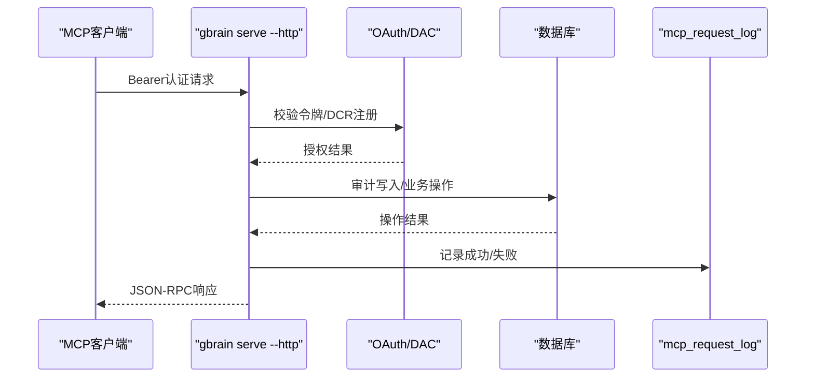
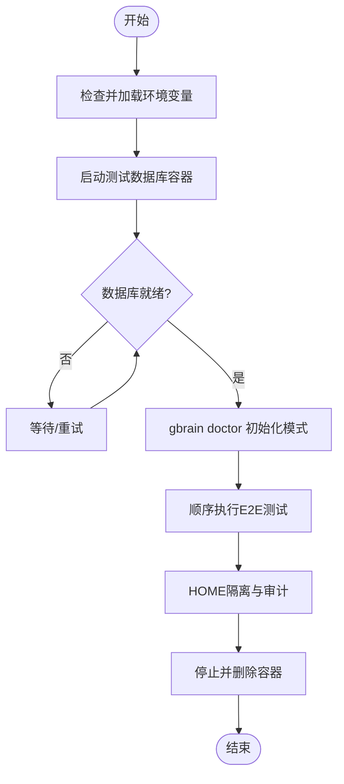
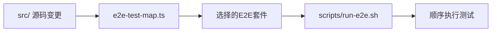

# 集成测试

<cite>
**本文引用的文件**
- [README.md](file://README.md)
- [docs/TESTING.md](file://docs/TESTING.md)
- [package.json](file://package.json)
- [docker-compose.test.yml](file://docker-compose.test.yml)
- [scripts/run-e2e.sh](file://scripts/run-e2e.sh)
- [scripts/e2e-test-map.ts](file://scripts/e2e-test-map.ts)
- [test/helpers/with-env.ts](file://test/helpers/with-env.ts)
- [test/helpers/reset-pglite.ts](file://test/helpers/reset-pglite.ts)
</cite>

## 目录
1. [引言](#引言)
2. [项目结构](#项目结构)
3. [核心组件](#核心组件)
4. [架构总览](#架构总览)
5. [详细组件分析](#详细组件分析)
6. [依赖关系分析](#依赖关系分析)
7. [性能考量](#性能考量)
8. [故障排查指南](#故障排查指南)
9. [结论](#结论)
10. [附录](#附录)

## 引言
本文件面向GBrain项目的集成测试实践，系统化阐述组件间交互测试的设计原则与实施方法，覆盖数据库集成测试、API接口测试与外部服务集成测试策略；并给出测试环境搭建、数据准备与清理流程、测试用例设计指南（含边界条件与异常场景）、测试数据管理与Mock策略、外部依赖处理以及性能与压力测试的落地方法。内容以仓库内现有测试体系为依据，确保可操作性与可追溯性。

## 项目结构
GBrain采用“命令式CLI + MCP传输层 + 双引擎（PGLite/Postgres）”的分层架构，测试体系围绕单元测试、慢路径测试、串行隔离测试与端到端（E2E）测试展开，并通过脚本与配置实现可重复、可并行或可顺序执行的测试流水线。

- 测试命令层级与职责
  - 并行单元测试：快速迭代，8分片并行，排除慢路径与E2E。
  - 校验门禁（verify）：全量检查清单（隐私、JSONB、源ID投影等）+ 类型检查，CI权威入口。
  - 慢路径测试：仅在需要时运行，避免拖慢本地循环。
  - 串行测试：跨文件共享状态或使用顶层Mock的文件，隔离于并行之外。
  - 真实Postgres E2E：顺序执行，覆盖真实数据库行为与API端到端路径。
  - 重型测试（tests/heavy）：耗时较长的运维类脚本，按需运行或夜间调度。

- 文件分类与隔离规则
  - *.test.ts：并行单元测试。
  - *.slow.test.ts：冷路径测试。
  - *.serial.test.ts：串行隔离文件，避免跨文件竞争。
  - test/e2e/*.test.ts：真实Postgres E2E，需DATABASE_URL。
  - tests/heavy/*.sh：重型脚本，非默认测试集。

- 关键脚本与配置
  - package.json中的测试脚本定义了测试命令与分发策略。
  - docker-compose.test.yml提供测试数据库容器编排。
  - scripts/run-e2e.sh负责E2E顺序执行、HOME隔离、超时控制与失败汇总。
  - scripts/e2e-test-map.ts用于根据变更路径选择性触发E2E套件。

章节来源
- [docs/TESTING.md:10-46](file://docs/TESTING.md#L10-L46)
- [package.json:31-88](file://package.json#L31-L88)
- [docker-compose.test.yml:1-15](file://docker-compose.test.yml#L1-15)
- [scripts/run-e2e.sh:1-244](file://scripts/run-e2e.sh#L1-L244)
- [scripts/e2e-test-map.ts:1-109](file://scripts/e2e-test-map.ts#L1-L109)

## 核心组件
- 测试命令与分发
  - 并行单元：scripts/run-unit-parallel.sh（8分片）+ 串行收尾。
  - 校验门禁：scripts/run-verify-parallel.sh（30+检查项）。
  - 慢路径：scripts/run-slow-tests.sh。
  - 串行：scripts/run-serial-tests.sh。
  - E2E：scripts/run-e2e.sh（顺序执行，带HOME隔离与超时）。
  - 重型：scripts/run-heavy.sh（RSS/延迟/并发锁回归等）。

- 隔离与辅助工具
  - withEnv：进程级环境变量安全覆写与恢复，避免跨测试泄漏。
  - resetPgliteState：在共享PGLite引擎下按表粒度重置用户数据，保留基础设施表。

- E2E选择器
  - e2e-test-map：基于变更路径的最小化E2E选择，miss时回退全量。

章节来源
- [package.json:40-65](file://package.json#L40-L65)
- [docs/TESTING.md:47-115](file://docs/TESTING.md#L47-L115)
- [test/helpers/with-env.ts:1-90](file://test/helpers/with-env.ts#L1-L90)
- [test/helpers/reset-pglite.ts:1-78](file://test/helpers/reset-pglite.ts#L1-L78)
- [scripts/e2e-test-map.ts:1-109](file://scripts/e2e-test-map.ts#L1-L109)

## 架构总览
下图展示测试体系与被测系统的交互关系，强调“命令层（CLI/MCP）—传输层（stdio/HTTP）—引擎层（PGLite/Postgres）—数据库”的端到端路径。

图表来源
- [package.json:31-88](file://package.json#L31-L88)
- [scripts/run-e2e.sh:1-244](file://scripts/run-e2e.sh#L1-L244)
- [docker-compose.test.yml:1-15](file://docker-compose.test.yml#L1-L15)

## 详细组件分析

### 数据库集成测试（Postgres）
- 目标与范围
  - 覆盖真实Postgres行为，包括批量写入绑定路径差异、JSONB写入完整性、跨引擎一致性、模式漂移检测、多源隔离与并行同步回归等。
- 执行方式
  - 顺序执行（scripts/run-e2e.sh），确保共享数据库无竞态。
  - 使用docker-compose.test.yml启动测试数据库，通过gbrain doctor初始化模式。
- 关键测试点
  - 批量写入路径差异：postgres-js JSONB绑定与PGLite差异覆盖。
  - JSONB完整性：5个写入点的round-trip校验，防止双重编码。
  - 引擎一致性：Postgres与PGLite在检索结果上的Top-K一致性。
  - 多源隔离：按source_id的排序、查询过滤、链接/时间线批处理目标正确性。
  - 并行同步：并发导入不泄漏连接，统计活动会话数验证。
- 数据准备与清理
  - 每个测试文件在beforeAll中TRUNCATE CASCADE并导入固定夹具；每个测试用例在beforeEach中调用resetPgliteState（对PGLite）或等效清理逻辑（对Postgres）。
  - HOME隔离：通过临时HOME与GBRAIN_HOME避免污染用户配置。

图表来源
- [scripts/run-e2e.sh:151-195](file://scripts/run-e2e.sh#L151-L195)
- [docker-compose.test.yml:1-15](file://docker-compose.test.yml#L1-15)
- [docs/TESTING.md:217-247](file://docs/TESTING.md#L217-L247)

章节来源
- [docs/TESTING.md:217-247](file://docs/TESTING.md#L217-L247)
- [scripts/run-e2e.sh:151-195](file://scripts/run-e2e.sh#L151-L195)
- [docker-compose.test.yml:1-15](file://docker-compose.test.yml#L1-15)

### API接口测试（MCP/HTTP）
- 目标与范围
  - 验证MCP stdio与HTTP传输层的端到端连通性、认证与授权、速率限制、健康检查、请求日志审计、OAuth注册与令牌轮换等。
- 执行方式
  - 顺序执行（scripts/run-e2e.sh），确保服务生命周期可控。
  - HTTP测试通过子进程启动gbrain serve --http，注册客户端、发放令牌、执行MCP JSON-RPC。
- 关键测试点
  - Bearer认证与未知/撤销令牌处理。
  - /health健康检查与DB不可用降级。
  - mcp_request_log审计记录。
  - OAuth 2.1 DCR注册、PKCE授权码流程、刷新令牌轮换、撤销保护。
  - CORS白名单、Body大小限制、两桶限流策略。
- Mock策略
  - 对外部AI提供商的嵌入/推理路径通过测试注入通道进行替换，避免真实网络调用。

图表来源
- [docs/TESTING.md:239-241](file://docs/TESTING.md#L239-L241)
- [scripts/run-e2e.sh:177-195](file://scripts/run-e2e.sh#L177-L195)

章节来源
- [docs/TESTING.md:239-241](file://docs/TESTING.md#L239-L241)
- [scripts/run-e2e.sh:177-195](file://scripts/run-e2e.sh#L177-L195)

### 外部服务集成测试（嵌入/推理/凭证网关）
- 目标与范围
  - 验证嵌入模型维度一致性、多模态输入处理、错误路径（如维度不匹配）与默认维度回退、凭证网关的密钥分发与访问控制。
- 执行方式
  - 在无API密钥的环境中进行纯逻辑验证（例如PGLite内存模式），或在有API密钥时进行端到端调用。
- 关键测试点
  - 维度不一致抛错与错误消息包含模型ID/期望/实际维度。
  - 默认维度回退策略。
  - 凭证网关的密钥可见性与作用域隔离。
- Mock策略
  - 通过测试注入通道替换嵌入传输层，屏蔽真实网络调用，保证可重复性与稳定性。

章节来源
- [docs/TESTING.md:216-216](file://docs/TESTING.md#L216-L216)

### 测试环境搭建与数据准备
- 环境变量与密钥
  - 始终先source shell配置加载API密钥（OPENAI_API_KEY、ANTHROPIC_API_KEY等），Tier 2测试若无密钥将跳过。
- 数据库准备
  - 使用docker-compose.test.yml启动Postgres容器，设置用户名/密码/数据库名，等待pg_isready就绪。
  - 通过gbrain doctor初始化模式，确保基础表与迁移链路可用。
- HOME隔离
  - scripts/run-e2e.sh在测试前快照用户真实配置，设置HOME与GBRAIN_HOME至临时目录，测试后对比MD5确认未越界写入。

图表来源
- [docs/TESTING.md:266-304](file://docs/TESTING.md#L266-L304)
- [docker-compose.test.yml:1-15](file://docker-compose.test.yml#L1-15)
- [scripts/run-e2e.sh:39-85](file://scripts/run-e2e.sh#L39-L85)

章节来源
- [docs/TESTING.md:266-304](file://docs/TESTING.md#L266-L304)
- [docker-compose.test.yml:1-15](file://docker-compose.test.yml#L1-15)
- [scripts/run-e2e.sh:39-85](file://scripts/run-e2e.sh#L39-L85)

### 测试数据管理、Mock策略与外部依赖处理
- 测试数据管理
  - 固定夹具：每个E2E文件在beforeAll中TRUNCATE CASCADE并导入预设数据，确保可重复性。
  - PGLite共享引擎：beforeAll创建一次引擎，beforeEach调用resetPgliteState清理用户数据，afterAll断开连接，避免跨文件泄漏。
- Mock策略
  - 对生产代码的DI依赖，优先通过withEnv安全覆写环境变量，避免在单文件内使用顶层mock.module。
  - 对外部AI提供商的嵌入/推理路径，使用测试注入通道替换底层传输层，屏蔽真实网络调用。
- 外部依赖处理
  - API密钥：Tier 2测试若未加载密钥则跳过；Tier 1无需密钥。
  - 运维依赖：PgBouncer事务模式下的teardown回归由专用E2E覆盖。

章节来源
- [docs/TESTING.md:47-115](file://docs/TESTING.md#L47-L115)
- [test/helpers/with-env.ts:1-90](file://test/helpers/with-env.ts#L1-L90)
- [test/helpers/reset-pglite.ts:1-78](file://test/helpers/reset-pglite.ts#L1-L78)
- [docs/TESTING.md:249-265](file://docs/TESTING.md#L249-L265)

### 性能测试与压力测试
- 性能指标
  - 搜索质量基准（P@5/R@5）、知识图谱质量、长记忆评估（LongMemEval）等。
- 压力测试
  - 并行同步回归：60文件并发导入，验证无连接泄漏与资源占用；打印序列/并行耗时与加速比。
  - 读延迟_under_sync：并发写入下p50/p95/p99延迟测量。
  - RSS预算门禁：峰值工作集内存与基线对比。
- 实施建议
  - 将重型脚本纳入nightly流水线或按需触发，避免日常开发阻塞。
  - 使用tests/heavy/README.md中的指导判断何时新增脚本而非扩展slow测试。

章节来源
- [docs/TESTING.md:116-116](file://docs/TESTING.md#L116-L116)
- [docs/TESTING.md:44-44](file://docs/TESTING.md#L44-L44)

## 依赖关系分析
- 测试到被测系统的依赖
  - CLI/MCP → 引擎 → 数据库，E2E顺序执行消除跨文件竞态。
- 变更驱动的选择性E2E
  - e2e-test-map基于src/变更路径映射到相关E2E套件，miss时回退全量，确保覆盖率与效率平衡。

图表来源
- [scripts/e2e-test-map.ts:17-109](file://scripts/e2e-test-map.ts#L17-L109)
- [scripts/run-e2e.sh:95-130](file://scripts/run-e2e.sh#L95-L130)

章节来源
- [scripts/e2e-test-map.ts:17-109](file://scripts/e2e-test-map.ts#L17-L109)
- [scripts/run-e2e.sh:95-130](file://scripts/run-e2e.sh#L95-L130)

## 性能考量
- 并行与顺序的取舍
  - 单元测试并行提升反馈速度；E2E顺序执行确保数据库一致性与可重复性。
- 资源隔离
  - HOME隔离与临时目录避免污染用户配置；Pg终止后台连接减少跨文件竞态。
- 超时与稳定性
  - 外层超时（180s/文件）防止PGLite WASM挂起导致文件级死锁；Bun内置超时（每测试）作为补充。

章节来源
- [scripts/run-e2e.sh:162-176](file://scripts/run-e2e.sh#L162-L176)
- [docs/TESTING.md:20-26](file://docs/TESTING.md#L20-L26)

## 故障排查指南
- 常见问题定位
  - E2E失败：查看scripts/run-e2e.sh输出末尾的摘要与失败文件列表；结合失败日志定位根因。
  - HOME隔离破坏：若检测到用户配置被修改/删除/创建，立即退出并提示breach原因。
  - 数据库连接泄漏：检查并终止非当前后端PID，确保TRUNCATE/CASCADE后无残留连接。
- 建议流程
  - 先运行verify确保静态检查通过；
  - 再运行unit并行快速定位问题；
  - 最后按需运行E2E或重型脚本复现与回归。

章节来源
- [scripts/run-e2e.sh:197-244](file://scripts/run-e2e.sh#L197-L244)
- [docs/TESTING.md:27-37](file://docs/TESTING.md#L27-L37)

## 结论
GBrain的集成测试体系通过“命令层—传输层—引擎层—数据库”的端到端路径，结合严格的隔离与清理机制，实现了高覆盖率与高可重复性的测试闭环。配合变更驱动的选择性E2E与重型脚本，既能满足日常快速反馈，也能保障关键路径的稳定性与性能。建议在团队内统一遵循测试命令层级、隔离规则与环境准备流程，持续优化用例设计与回归策略。

## 附录
- 快速参考
  - 本地快速循环：bun run test（并行单元）。
  - 预提交门禁：bun run verify（全量检查+类型检查）。
  - 全量回归：bun run test:full（verify + unit + slow + 智能E2E）。
  - 真实Postgres E2E：bun run test:e2e（顺序执行，需DATABASE_URL）。
  - 重型测试：bun run test:heavy（按需或夜间）。

章节来源
- [docs/TESTING.md:6-19](file://docs/TESTING.md#L6-L19)
- [package.json:40-65](file://package.json#L40-L65)