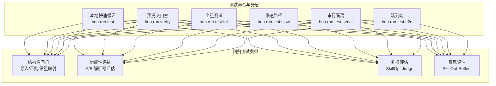
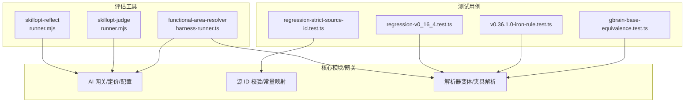
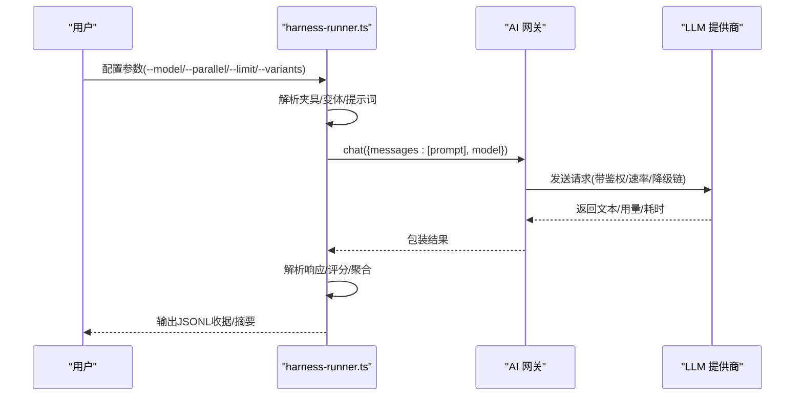
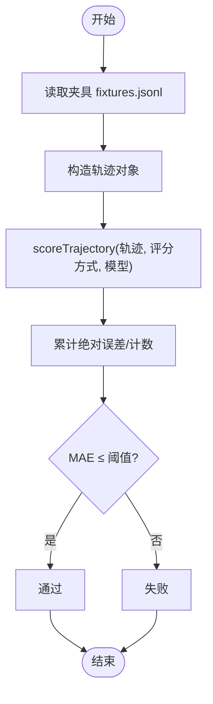
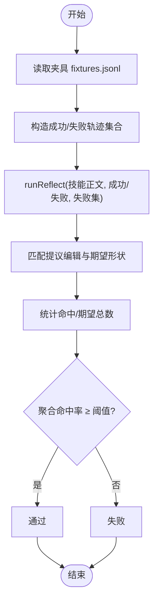
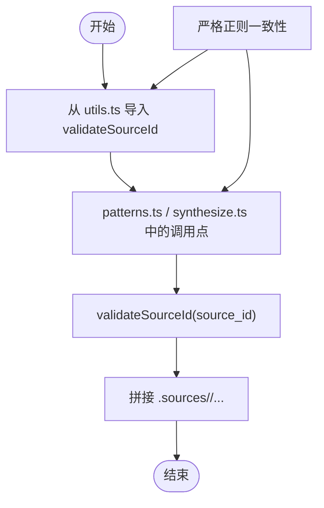
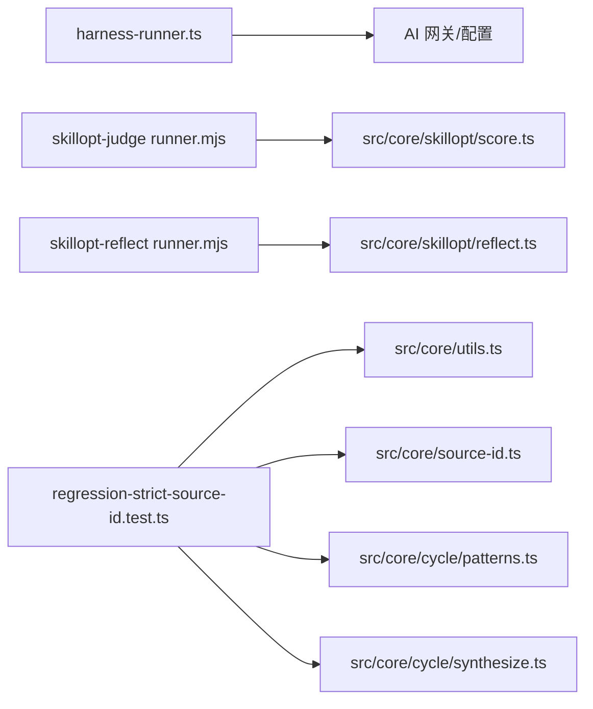

# 回归测试

<cite>
**本文引用的文件**
- [README.md](file://README.md)
- [TESTING.md](file://docs/TESTING.md)
- [functional-area-resolver README.md](file://evals/functional-area-resolver/README.md)
- [skillopt-judge README.md](file://evals/skillopt-judge/README.md)
- [skillopt-reflect README.md](file://evals/skillopt-reflect/README.md)
- [gbrain-base-equivalence.test.ts](file://test/regressions/gbrain-base-equivalence.test.ts)
- [v0.36.1.0-iron-rule.test.ts](file://test/regressions/v0.36.1.0-iron-rule.test.ts)
- [regression-strict-source-id.test.ts](file://test/regression-strict-source-id.test.ts)
- [regression-v0_16_4.test.ts](file://test/regression-v0_16_4.test.ts)
- [harness-runner.ts](file://evals/functional-area-resolver/harness-runner.ts)
- [skillopt-judge runner.mjs](file://evals/skillopt-judge/runner.mjs)
- [skillopt-reflect runner.mjs](file://evals/skillopt-reflect/runner.mjs)
</cite>

## 目录
1. [引言](#引言)
2. [项目结构](#项目结构)
3. [核心组件](#核心组件)
4. [架构总览](#架构总览)
5. [详细组件分析](#详细组件分析)
6. [依赖关系分析](#依赖关系分析)
7. [性能考量](#性能考量)
8. [故障排查指南](#故障排查指南)
9. [结论](#结论)
10. [附录](#附录)

## 引言
本文件系统性梳理 GBrain 的回归测试体系，聚焦功能性区域解析器（Functional-Area Resolver）、技能优化判断器（SkillOpt Judge）与反思评估器（SkillOpt Reflect）三大核心回归评估工具，并结合仓库内既有回归测试用例，阐述回归测试的设计理念、执行流程、夹具构建、评估策略与结果验证机制。同时给出运行配置、失败诊断与修复建议流程，覆盖持续集成中的应用与质量保证实践。

## 项目结构
- 测试分层与命令矩阵：仓库提供了多层级测试命令与分片策略，确保本地快速迭代与 CI 稳健收敛。
- 回归测试分类：
  - 结构性回归：通过断言源码导入路径、正则约束、常量映射等，防止行为漂移。
  - 功能性评估：以真实 LLM 调用驱动的 A/B 评估与判准评估，用于验证路由与优化质量。
- 评估套件：
  - functional-area-resolver：对三种解析器变体进行严格与宽松评分，跨模型对比。
  - skillopt-judge：基于人工标注轨迹，评估 LLM 判决一致性（MAE）。
  - skillopt-reflect：评估反射提示生成的编辑建议命中率。

图表来源
- [TESTING.md:10-18](file://docs/TESTING.md#L10-L18)
- [TESTING.md:20-25](file://docs/TESTING.md#L20-L25)

章节来源
- [TESTING.md:6-18](file://docs/TESTING.md#L6-L18)
- [TESTING.md:20-25](file://docs/TESTING.md#L20-L25)

## 核心组件
- 结构性回归测试
  - 作用：通过断言关键导入路径、正则表达式与常量映射，确保行为不漂移。
  - 典型用例：
    - 源 ID 验证一致性：统一使用严格正则，防止反向写入路径出现安全漏洞。
    - gbrain-base 等价性：确保默认包与常量映射保持字节一致。
    - v0.36.1.0 铁律回归：明确五类回归点并结构化覆盖。
    - v0.16.4 清洁夹具回归：保证历史兼容性与输出结构稳定。
- 功能性评估工具
  - functional-area-resolver A/B 评估：对三种解析器变体进行严格与宽松评分，跨模型对比，产出可审计的收据。
  - skillopt-judge：基于人工标注轨迹，计算 MAE 判定是否通过。
  - skillopt-reflect：评估反射提示生成的编辑建议命中率，判定是否通过。

章节来源
- [regression-strict-source-id.test.ts:1-117](file://test/regression-strict-source-id.test.ts#L1-L117)
- [gbrain-base-equivalence.test.ts:1-114](file://test/regressions/gbrain-base-equivalence.test.ts#L1-L114)
- [v0.36.1.0-iron-rule.test.ts:1-157](file://test/regressions/v0.36.1.0-iron-rule.test.ts#L1-L157)
- [regression-v0_16_4.test.ts:1-126](file://test/regression-v0_16_4.test.ts#L1-L126)
- [functional-area-resolver README.md:1-190](file://evals/functional-area-resolver/README.md#L1-L190)
- [skillopt-judge README.md:1-32](file://evals/skillopt-judge/README.md#L1-L32)
- [skillopt-reflect README.md:1-36](file://evals/skillopt-reflect/README.md#L1-L36)

## 架构总览
下图展示回归测试体系在代码与数据层面的交互关系：测试用例读取夹具与变体，调用核心模块或网关接口，产出评分与收据；评估工具通过 LLM 接口完成端到端评估。

图表来源
- [harness-runner.ts:28-31](file://evals/functional-area-resolver/harness-runner.ts#L28-L31)
- [skillopt-judge runner.mjs:32](file://evals/skillopt-judge/runner.mjs#L32)
- [skillopt-reflect runner.mjs:30](file://evals/skillopt-reflect/runner.mjs#L30)

## 详细组件分析

### 组件A：功能性区域解析器（Functional-Area Resolver）
设计理念
- 通过三种解析器变体（基础列表、功能区调度器、调度器消解）进行 A/B 对比，衡量“严格”与“宽松”两种评分维度，同时关注大小与效果权衡。
- 评估工具通过网关调用指定模型，产出每轮运行的严格/宽松得分与收据，支持跨模型复现与审计。

执行流程
- 加载夹具与变体，构建提示词模板，调用网关发起推理，解析响应并评分，聚合统计后输出收据。
- 支持限制运行数量、并行度与输出路径，便于成本控制与结果归档。

图表来源
- [harness-runner.ts:330-343](file://evals/functional-area-resolver/harness-runner.ts#L330-L343)
- [harness-runner.ts:409-443](file://evals/functional-area-resolver/harness-runner.ts#L409-L443)
- [harness-runner.ts:510-541](file://evals/functional-area-resolver/harness-runner.ts#L510-L541)

评估策略与结果验证
- 严格评分：预测 slug 完全等于期望。
- 宽松评分：若两者属于同一调度器的可达集合，则视为正确。
- 收据包含模型、提示模板哈希、夹具哈希、执行时间戳与命令行参数，便于审计与重放。

章节来源
- [functional-area-resolver README.md:42-76](file://evals/functional-area-resolver/README.md#L42-L76)
- [functional-area-resolver README.md:77-96](file://evals/functional-area-resolver/README.md#L77-L96)
- [functional-area-resolver README.md:97-119](file://evals/functional-area-resolver/README.md#L97-L119)
- [harness-runner.ts:61-90](file://evals/functional-area-resolver/harness-runner.ts#L61-L90)
- [harness-runner.ts:166-168](file://evals/functional-area-resolver/harness-runner.ts#L166-L168)
- [harness-runner.ts:212-222](file://evals/functional-area-resolver/harness-runner.ts#L212-L222)
- [harness-runner.ts:485-500](file://evals/functional-area-resolver/harness-runner.ts#L485-L500)

### 组件B：技能优化判断器（SkillOpt Judge）
设计理念
- 使用人工标注的轨迹与黄金分数，评估 LLM 判决的一致性，以 MAE 作为通过标准。

执行流程
- 读取夹具，构造轨迹对象，调用评分函数，汇总绝对误差，输出收据并根据阈值判定通过与否。

图表来源
- [skillopt-judge runner.mjs:27-31](file://evals/skillopt-judge/runner.mjs#L27-L31)
- [skillopt-judge runner.mjs:39-49](file://evals/skillopt-judge/runner.mjs#L39-L49)
- [skillopt-judge runner.mjs:63-64](file://evals/skillopt-judge/runner.mjs#L63-L64)

评估策略与结果验证
- 通过 MAE（平均绝对误差）≤ 0.15 作为通过标准；输出包含单夹具明细与聚合结果，便于溯源与再评估。

章节来源
- [skillopt-judge README.md:12-18](file://evals/skillopt-judge/README.md#L12-L18)
- [skillopt-judge runner.mjs:66-76](file://evals/skillopt-judge/runner.mjs#L66-L76)

### 组件C：技能优化反思评估器（SkillOpt Reflect）
设计理念
- 基于成功/失败轨迹集合，评估反射提示生成的编辑建议命中率，以聚合命中率 ≥ 0.7 作为通过标准。

执行流程
- 读取夹具，构造成功/失败轨迹集合，调用反射函数，匹配提议编辑形状与期望编辑，统计命中并输出收据。

图表来源
- [skillopt-reflect runner.mjs:36-49](file://evals/skillopt-reflect/runner.mjs#L36-L49)
- [skillopt-reflect runner.mjs:53-59](file://evals/skillopt-reflect/runner.mjs#L53-L59)
- [skillopt-reflect runner.mjs:83-84](file://evals/skillopt-reflect/runner.mjs#L83-L84)

评估策略与结果验证
- 聚合命中率 ≥ 0.7 为通过；输出包含每夹具命中情况与总体统计，便于定位问题与改进提示。

章节来源
- [skillopt-reflect README.md:14-22](file://evals/skillopt-reflect/README.md#L14-L22)
- [skillopt-reflect runner.mjs:86-97](file://evals/skillopt-reflect/runner.mjs#L86-L97)

### 组件D：结构性回归测试（源 ID 严格正则）
设计理念
- 将散落的源 ID 校验逻辑集中到单一入口，确保反向写入路径与创建路径使用相同严格规则，避免路径漂移导致的安全隐患。

执行流程
- 断言：
  - 两个校验函数行为一致；
  - 反向写入调用点使用统一导入路径；
  - 在拼接前先做校验，确保顺序正确；
  - 移除旧版宽松正则在工具模块中的残留。

图表来源
- [regression-strict-source-id.test.ts:36-64](file://test/regression-strict-source-id.test.ts#L36-L64)
- [regression-strict-source-id.test.ts:66-98](file://test/regression-strict-source-id.test.ts#L66-L98)
- [regression-strict-source-id.test.ts:100-115](file://test/regression-strict-source-id.test.ts#L100-L115)

章节来源
- [regression-strict-source-id.test.ts:1-117](file://test/regression-strict-source-id.test.ts#L1-L117)

### 组件E：gbrain-base 等价性回归
设计理念
- 保证默认 schema 包与内部常量映射完全一致，避免运行时行为漂移。

执行流程
- 断言：
  - 所有页面类型种子均存在于包中；
  - takes_kinds 闭包枚举与历史一致；
  - 默认专家路由类型集合；
  - inferType 前缀映射与历史一致；
  - 关键链接映射与推断规则存在；
  - 别名图默认为空。

章节来源
- [gbrain-base-equivalence.test.ts:24-35](file://test/regressions/gbrain-base-equivalence.test.ts#L24-L35)
- [gbrain-base-equivalence.test.ts:37-44](file://test/regressions/gbrain-base-equivalence.test.ts#L37-L44)
- [gbrain-base-equivalence.test.ts:46-64](file://test/regressions/gbrain-base-equivalence.test.ts#L46-L64)
- [gbrain-base-equivalence.test.ts:66-92](file://test/regressions/gbrain-base-equivalence.test.ts#L66-L92)
- [gbrain-base-equivalence.test.ts:94-102](file://test/regressions/gbrain-base-equivalence.test.ts#L94-L102)
- [gbrain-base-equivalence.test.ts:104-113](file://test/regressions/gbrain-base-equivalence.test.ts#L104-L113)

### 组件F：v0.36.1.0 铁律回归
设计理念
- 明确五类回归点并结构化覆盖，确保新特性不破坏现有行为。

执行流程
- 断言：
  - think 基线在未启用校准时保持不变；
  - 矛盾探测在无校准画像时输出一致；
  - grade_takes 相关阶段关闭不影响 takes 解析；
  - 新增 source_id 路径对现有读操作无影响；
  - 既存检索模式不受影响。

章节来源
- [v0.36.1.0-iron-rule.test.ts:27-46](file://test/regressions/v0.36.1.0-iron-rule.test.ts#L27-L46)
- [v0.36.1.0-iron-rule.test.ts:53-87](file://test/regressions/v0.36.1.0-iron-rule.test.ts#L53-L87)
- [v0.36.1.0-iron-rule.test.ts:98-107](file://test/regressions/v0.36.1.0-iron-rule.test.ts#L98-L107)
- [v0.36.1.0-iron-rule.test.ts:115-125](file://test/regressions/v0.36.1.0-iron-rule.test.ts#L115-L125)
- [v0.36.1.0-iron-rule.test.ts:131-140](file://test/regressions/v0.36.1.0-iron-rule.test.ts#L131-L140)
- [v0.36.1.0-iron-rule.test.ts:143-156](file://test/regressions/v0.36.1.0-iron-rule.test.ts#L143-L156)

### 组件G：v0.16.4 清洁夹具回归
设计理念
- 以历史清洁夹具为基准，确保升级后错误/警告结构与摘要字段保持稳定。

执行流程
- 构造最小夹具（RESOLVER.md + manifest + 两份 SKILL.md），运行检查，断言：
  - 无错误与意外警告；
  - JSON 包裹键与摘要键稳定；
  - 兼容性断言通过。

章节来源
- [regression-v0_16_4.test.ts:75-96](file://test/regression-v0_16_4.test.ts#L75-L96)
- [regression-v0_16_4.test.ts:98-118](file://test/regression-v0_16_4.test.ts#L98-L118)
- [regression-v0_16_4.test.ts:120-125](file://test/regression-v0_16_4.test.ts#L120-L125)

## 依赖关系分析
- 测试与核心模块耦合
  - functional-area-resolver 依赖网关与配置模块，确保鉴权、速率与回退链一致。
  - 技能优化评估依赖评分与反射模块，直接调用核心函数。
- 结构性回归对源码的静态断言
  - 通过读取源码字符串断言导入路径与正则字面量，防止重构引入漂移。

图表来源
- [harness-runner.ts:28-31](file://evals/functional-area-resolver/harness-runner.ts#L28-L31)
- [skillopt-judge runner.mjs:32](file://evals/skillopt-judge/runner.mjs#L32)
- [skillopt-reflect runner.mjs:30](file://evals/skillopt-reflect/runner.mjs#L30)
- [regression-strict-source-id.test.ts:27](file://test/regression-strict-source-id.test.ts#L27)
- [regression-strict-source-id.test.ts:28-31](file://test/regression-strict-source-id.test.ts#L28-L31)

章节来源
- [harness-runner.ts:409-443](file://evals/functional-area-resolver/harness-runner.ts#L409-L443)
- [skillopt-judge runner.mjs:39-49](file://evals/skillopt-judge/runner.mjs#L39-L49)
- [skillopt-reflect runner.mjs:53-59](file://evals/skillopt-reflect/runner.mjs#L53-L59)

## 性能考量
- 并行与限流：评估工具支持并行度设置，受网关速率租约限制；可通过 --parallel 控制并发，避免超配。
- 成本估算：评估工具内置成本估算与确认提示，避免无意的大额调用。
- 本地快速反馈：回归测试优先采用纯函数与内存态，减少外部依赖，提升本地迭代速度。

## 故障排查指南
- 网关鉴权缺失
  - 症状：评估工具报错提示缺少对应提供商的环境变量。
  - 处理：按提示设置相应 API Key 或使用 --yes 跳过确认。
- 收据不可审计
  - 症状：收据缺少必要的哈希或时间戳信息。
  - 处理：确认运行时已记录 harness SHA、提示模板哈希与夹具哈希。
- 严格正则导致反向写入失败
  - 症状：反向写入路径抛出非法源 ID 错误。
  - 处理：确保调用点使用统一导入路径并在拼接前校验；避免在工具模块中保留宽松正则。
- 评估通过标准不满足
  - 症状：MAE 超阈值或命中率不足。
  - 处理：调整提示/变体/夹具，重新运行评估并更新基线。

章节来源
- [harness-runner.ts:426-443](file://evals/functional-area-resolver/harness-runner.ts#L426-L443)
- [harness-runner.ts:485-500](file://evals/functional-area-resolver/harness-runner.ts#L485-L500)
- [skillopt-judge runner.mjs:66-76](file://evals/skillopt-judge/runner.mjs#L66-L76)
- [skillopt-reflect runner.mjs:86-97](file://evals/skillopt-reflect/runner.mjs#L86-L97)
- [regression-strict-source-id.test.ts:36-64](file://test/regression-strict-source-id.test.ts#L36-L64)

## 结论
GBrain 的回归测试体系以“结构性回归 + 功能性评估”双轨并行：前者通过断言导入路径、正则与常量映射，确保行为稳定；后者通过真实 LLM 调用驱动的 A/B 评估与判准/反思评估，量化路由与优化质量。配合严格的收据与审计能力，形成可追溯、可复现的质量保障闭环。

## 附录
- 运行配置要点
  - functional-area-resolver：设置模型别名或完整提供商模型 ID，控制并行度与限制数量，输出路径自定义。
  - skillopt-judge / skillopt-reflect：指定评估模型与输出路径，自动汇总并通过阈值判定。
- 维护策略与覆盖率提升
  - 将关键行为纳入结构性回归，尽早暴露重构风险。
  - 逐步扩展评估夹具规模与多样性，降低过拟合风险。
  - 在 CI 中固定评估模型与阈值，确保回归结果可比。
- 持续集成中的应用
  - 本地快速循环与预提交门禁确保高频反馈；
  - CI 矩阵分片运行，串行文件独立执行，避免隔离问题；
  - 评估工具在具备密钥的环境中运行，确保端到端质量。

章节来源
- [TESTING.md:10-18](file://docs/TESTING.md#L10-L18)
- [TESTING.md:20-25](file://docs/TESTING.md#L20-L25)
- [functional-area-resolver README.md:97-119](file://evals/functional-area-resolver/README.md#L97-L119)
- [skillopt-judge README.md:25-31](file://evals/skillopt-judge/README.md#L25-L31)
- [skillopt-reflect README.md:29-35](file://evals/skillopt-reflect/README.md#L29-L35)