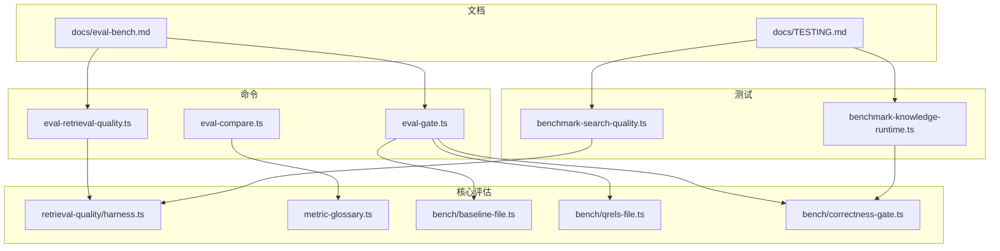
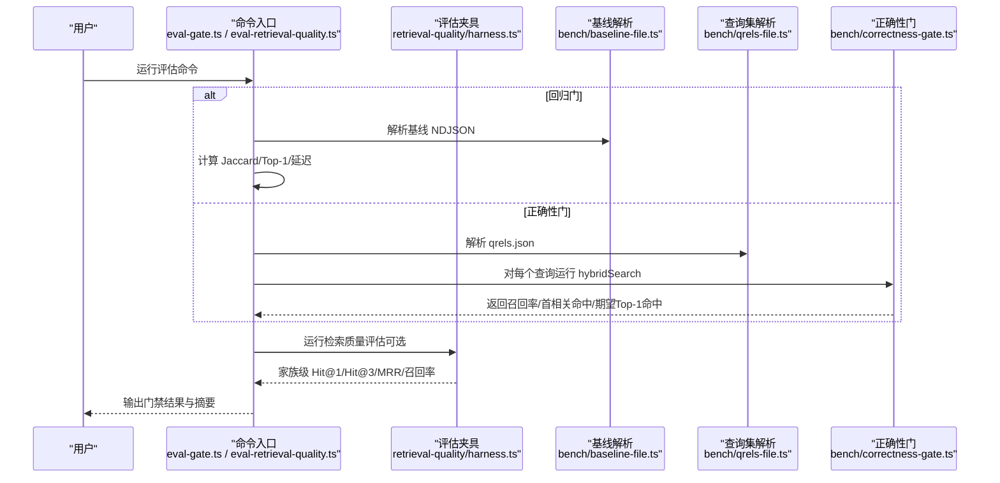
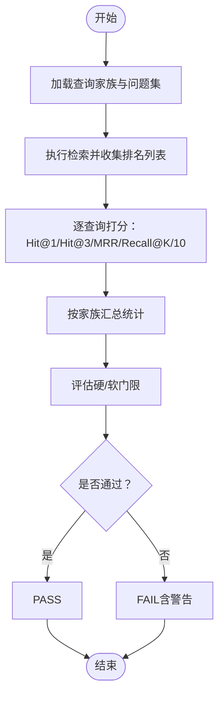
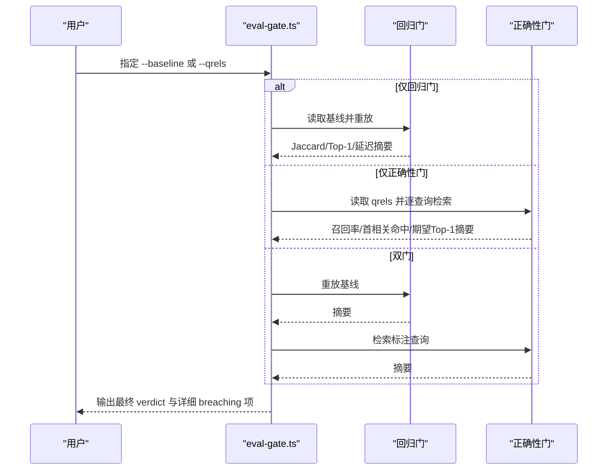
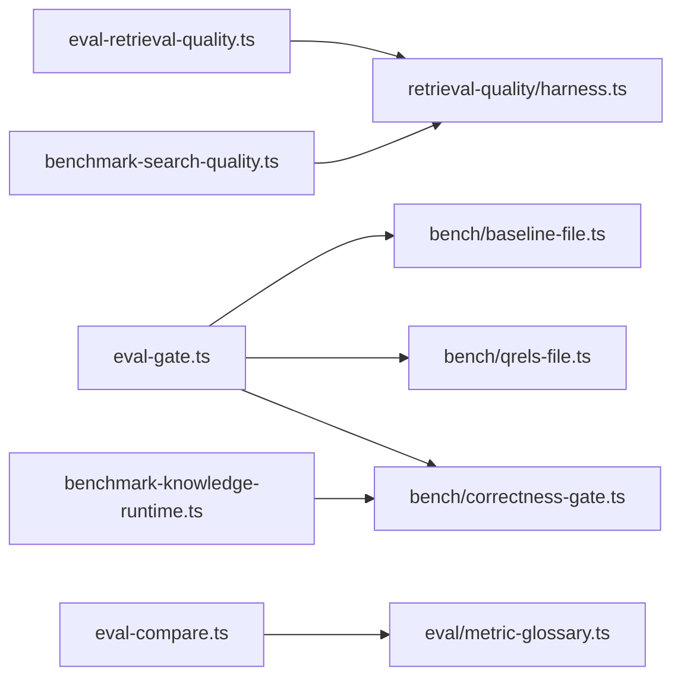

# 基准测试

<cite>
**本文引用的文件**
- [docs/eval-bench.md](file://docs/eval-bench.md)
- [docs/TESTING.md](file://docs/TESTING.md)
- [src/commands/eval-retrieval-quality.ts](file://src/commands/eval-retrieval-quality.ts)
- [src/commands/eval-gate.ts](file://src/commands/eval-gate.ts)
- [src/commands/eval-compare.ts](file://src/commands/eval-compare.ts)
- [src/eval/retrieval-quality/harness.ts](file://src/eval/retrieval-quality/harness.ts)
- [src/core/eval/metric-glossary.ts](file://src/core/eval/metric-glossary.ts)
- [src/core/bench/baseline-file.ts](file://src/core/bench/baseline-file.ts)
- [src/core/bench/qrels-file.ts](file://src/core/bench/qrels-file.ts)
- [src/core/bench/correctness-gate.ts](file://src/core/bench/correctness-gate.ts)
- [test/benchmark-search-quality.ts](file://test/benchmark-search-quality.ts)
- [test/benchmark-knowledge-runtime.ts](file://test/benchmark-knowledge-runtime.ts)
</cite>

## 目录
1. [简介](#简介)
2. [项目结构](#项目结构)
3. [核心组件](#核心组件)
4. [架构总览](#架构总览)
5. [组件详解](#组件详解)
6. [依赖关系分析](#依赖关系分析)
7. [性能考量](#性能考量)
8. [故障排查指南](#故障排查指南)
9. [结论](#结论)
10. [附录](#附录)

## 简介
本文件系统性阐述 GBrain 基准测试体系的设计原理与执行架构，覆盖代码检索基准、检索质量评估、回归与正确性门禁、指标定义与统计分析、运行方法与结果解读、性能对比指南，以及扩展与定制化评估场景的实现路径。目标是帮助维护者与贡献者以一致、可重复的方式验证检索链路的稳定性与质量，并将改进决策建立在可审计的度量之上。

## 项目结构
- 文档层：提供用户与维护者可见的使用指南与最佳实践（如评估回路、门禁阈值、指标释义）。
- 命令层：CLI 子命令封装评估流程（检索质量、门禁、比较、长记忆评测等）。
- 核心评估层：通用的评估夹具、指标词典、基线/查询集格式解析器与门禁逻辑。
- 测试层：端到端与单元级基准脚本，用于内部迭代与回归验证。

图表来源
- [docs/eval-bench.md:1-599](file://docs/eval-bench.md#L1-L599)
- [docs/TESTING.md:1-304](file://docs/TESTING.md#L1-L304)
- [src/commands/eval-retrieval-quality.ts:1-119](file://src/commands/eval-retrieval-quality.ts#L1-L119)
- [src/commands/eval-gate.ts:1-492](file://src/commands/eval-gate.ts#L1-L492)
- [src/commands/eval-compare.ts:1-257](file://src/commands/eval-compare.ts#L1-L257)
- [src/eval/retrieval-quality/harness.ts:1-210](file://src/eval/retrieval-quality/harness.ts#L1-L210)
- [src/core/eval/metric-glossary.ts:1-256](file://src/core/eval/metric-glossary.ts#L1-L256)
- [src/core/bench/baseline-file.ts:1-194](file://src/core/bench/baseline-file.ts#L1-L194)
- [src/core/bench/qrels-file.ts:1-231](file://src/core/bench/qrels-file.ts#L1-L231)
- [src/core/bench/correctness-gate.ts:1-174](file://src/core/bench/correctness-gate.ts#L1-L174)
- [test/benchmark-search-quality.ts:1-752](file://test/benchmark-search-quality.ts#L1-L752)
- [test/benchmark-knowledge-runtime.ts:1-394](file://test/benchmark-knowledge-runtime.ts#L1-L394)

章节来源
- [docs/eval-bench.md:1-599](file://docs/eval-bench.md#L1-L599)
- [docs/TESTING.md:1-304](file://docs/TESTING.md#L1-L304)

## 核心组件
- 检索质量夹具与门禁：对查询家族进行评分与硬/软门限判定，支持 A/B 关系型检索臂。
- 门禁系统：同时支持“回归门”（基于历史基线）与“正确性门”（基于标注查询集），失败即刻阻断。
- 指标词典：统一检索/稳定性/统计显著性/运营成本等指标的通俗释义与元数据。
- 基线与查询集格式：标准化 NDJSON 基线与 JSON 查询集，确保跨环境一致性。
- 比较与报告：按模式/套件聚合评估结果，输出 Markdown/JSON 报告并附带指标词典元数据。
- 基准脚本：端到端搜索质量与知识运行时基准，支撑内部回归与改进验证。

章节来源
- [src/eval/retrieval-quality/harness.ts:1-210](file://src/eval/retrieval-quality/harness.ts#L1-L210)
- [src/commands/eval-gate.ts:1-492](file://src/commands/eval-gate.ts#L1-L492)
- [src/core/eval/metric-glossary.ts:1-256](file://src/core/eval/metric-glossary.ts#L1-L256)
- [src/core/bench/baseline-file.ts:1-194](file://src/core/bench/baseline-file.ts#L1-L194)
- [src/core/bench/qrels-file.ts:1-231](file://src/core/bench/qrels-file.ts#L1-L231)
- [src/core/bench/correctness-gate.ts:1-174](file://src/core/bench/correctness-gate.ts#L1-L174)
- [src/commands/eval-compare.ts:1-257](file://src/commands/eval-compare.ts#L1-L257)
- [test/benchmark-search-quality.ts:1-752](file://test/benchmark-search-quality.ts#L1-L752)
- [test/benchmark-knowledge-runtime.ts:1-394](file://test/benchmark-knowledge-runtime.ts#L1-L394)

## 架构总览
下图展示从 CLI 到评估夹具与门禁的整体调用链，以及关键数据结构之间的关系。

图表来源
- [src/commands/eval-gate.ts:1-492](file://src/commands/eval-gate.ts#L1-L492)
- [src/commands/eval-retrieval-quality.ts:1-119](file://src/commands/eval-retrieval-quality.ts#L1-L119)
- [src/eval/retrieval-quality/harness.ts:1-210](file://src/eval/retrieval-quality/harness.ts#L1-L210)
- [src/core/bench/baseline-file.ts:1-194](file://src/core/bench/baseline-file.ts#L1-L194)
- [src/core/bench/qrels-file.ts:1-231](file://src/core/bench/qrels-file.ts#L1-L231)
- [src/core/bench/correctness-gate.ts:1-174](file://src/core/bench/correctness-gate.ts#L1-L174)

## 组件详解

### 检索质量评估与门禁
- 查询家族设计：针对历史上暴露的检索缺陷类别（标题子串、泛称到命名、别名同义、多块稀释、短词 vs 长词、关系型、硬负例）分别建模。
- 评分指标：Hit@1/Hit@3/MRR/召回率（K=3/K=10），并支持 A/B 关系型检索臂对比。
- 门禁策略：硬门限（如标题子串 Hit@1、多块稀释 Hit@3、别名同义 Hit@1）与软门限（其他家族以警告形式提示）。
- 环境覆盖：通过环境变量动态调整门限，便于在不同阶段收紧或放宽。

图表来源
- [src/eval/retrieval-quality/harness.ts:107-198](file://src/eval/retrieval-quality/harness.ts#L107-L198)
- [src/commands/eval-retrieval-quality.ts:21-118](file://src/commands/eval-retrieval-quality.ts#L21-L118)

章节来源
- [src/eval/retrieval-quality/harness.ts:1-210](file://src/eval/retrieval-quality/harness.ts#L1-L210)
- [src/commands/eval-retrieval-quality.ts:1-119](file://src/commands/eval-retrieval-quality.ts#L1-L119)

### 门禁系统（回归门与正确性门）
- 回归门（--baseline）：重放历史基线查询，计算集合相似度（Jaccard@K）、Top-1 稳定率与平均延迟增量，用于捕获重构导致的检索漂移。
- 正确性门（--qrels）：在裸 hybridSearch 下对标注查询集计算均值召回率、首相关命中率与期望 Top-1 命中率，用于衡量检索质量。
- 失败策略：任一门失败即判定为 FAIL；解析错误、单查询异常等均计入失败。
- 阈值优先级：CLI 覆盖嵌入阈值，再覆盖发布时阈值，最后回退至默认。

图表来源
- [src/commands/eval-gate.ts:187-487](file://src/commands/eval-gate.ts#L187-L487)
- [src/core/bench/baseline-file.ts:94-171](file://src/core/bench/baseline-file.ts#L94-L171)
- [src/core/bench/qrels-file.ts:84-194](file://src/core/bench/qrels-file.ts#L84-L194)
- [src/core/bench/correctness-gate.ts:125-173](file://src/core/bench/correctness-gate.ts#L125-L173)

章节来源
- [src/commands/eval-gate.ts:1-492](file://src/commands/eval-gate.ts#L1-L492)
- [src/core/bench/baseline-file.ts:1-194](file://src/core/bench/baseline-file.ts#L1-L194)
- [src/core/bench/qrels-file.ts:1-231](file://src/core/bench/qrels-file.ts#L1-L231)
- [src/core/bench/correctness-gate.ts:1-174](file://src/core/bench/correctness-gate.ts#L1-L174)

### 指标词典与报告
- 指标覆盖：传统 IR 指标（P@k/R@k/MRR/nDCG@k）、检索质量证据指标（Hit@1/Hit@3/首块来源正确率/CT 首块率等）、稳定性指标（Jaccard@K/Top-1 稳定率）、统计显著性（p 值/置信区间）、运营成本（缓存命中率/平均结果数/平均 token/每查询成本/p99 延迟）。
- 元数据：每个响应附带 _meta.metric_glossary，避免指标字段冗余。
- 报告生成：支持 Markdown/JSON 输出，自动内联指标释义，便于审阅与自动化消费。

章节来源
- [src/core/eval/metric-glossary.ts:1-256](file://src/core/eval/metric-glossary.ts#L1-L256)
- [src/commands/eval-compare.ts:1-257](file://src/commands/eval-compare.ts#L1-L257)

### 数据集与格式规范
- 基线文件（NDJSON）：首行为元数据（含 schema_version、阈值、基线平均延迟等），后续行为采集行，包含查询哈希与来源维度，确保联邦源去重。
- 查询集（JSON）：支持两种等价表示（slug-only 与显式 source_id::slug），比较统一采用 “source_id::slug” 键。
- 评估夹具：支持 JSONL 查询集解析，兼容注释行过滤。

章节来源
- [src/core/bench/baseline-file.ts:1-194](file://src/core/bench/baseline-file.ts#L1-L194)
- [src/core/bench/qrels-file.ts:1-231](file://src/core/bench/qrels-file.ts#L1-L231)
- [src/eval/retrieval-quality/harness.ts:200-210](file://src/eval/retrieval-quality/harness.ts#L200-L210)

### 基准脚本与运行方法
- 搜索质量基准：构造虚构但语义重叠的页面与查询，对比基线/增强/意图分类三种配置下的传统 IR 指标与“块级质量”指标（首块来源正确率、CT 首块率、时间线可达性、CT 保障率等），并输出差异分析。
- 知识运行时基准：验证写入后可查询性（auto_timeline 开关）、完整性修复率（自动/复核/跳过分布）、医生扫描完整度（应发现 vs 实际发现）。

章节来源
- [test/benchmark-search-quality.ts:1-752](file://test/benchmark-search-quality.ts#L1-L752)
- [test/benchmark-knowledge-runtime.ts:1-394](file://test/benchmark-knowledge-runtime.ts#L1-L394)

## 依赖关系分析
- 命令层依赖核心评估模块：CLI 将用户输入转换为夹具/门禁调用，依赖格式解析器与指标计算。
- 夹具与门禁解耦：检索质量夹具与正确性门各自独立，可单独运行或组合使用。
- 指标词典集中管理：所有评估与统计输出共享同一指标释义，保证跨套件一致性。
- 测试脚本与生产代码解耦：基准脚本通过 PGLite 在内存中运行，不依赖外部 API 与真实数据，确保可重复性。

图表来源
- [src/commands/eval-retrieval-quality.ts:1-119](file://src/commands/eval-retrieval-quality.ts#L1-L119)
- [src/commands/eval-gate.ts:1-492](file://src/commands/eval-gate.ts#L1-L492)
- [src/commands/eval-compare.ts:1-257](file://src/commands/eval-compare.ts#L1-L257)
- [src/eval/retrieval-quality/harness.ts:1-210](file://src/eval/retrieval-quality/harness.ts#L1-L210)
- [src/core/bench/baseline-file.ts:1-194](file://src/core/bench/baseline-file.ts#L1-L194)
- [src/core/bench/qrels-file.ts:1-231](file://src/core/bench/qrels-file.ts#L1-L231)
- [src/core/bench/correctness-gate.ts:1-174](file://src/core/bench/correctness-gate.ts#L1-L174)
- [src/core/eval/metric-glossary.ts:1-256](file://src/core/eval/metric-glossary.ts#L1-L256)
- [test/benchmark-search-quality.ts:1-752](file://test/benchmark-search-quality.ts#L1-L752)
- [test/benchmark-knowledge-runtime.ts:1-394](file://test/benchmark-knowledge-runtime.ts#L1-L394)

章节来源
- [src/commands/eval-retrieval-quality.ts:1-119](file://src/commands/eval-retrieval-quality.ts#L1-L119)
- [src/commands/eval-gate.ts:1-492](file://src/commands/eval-gate.ts#L1-L492)
- [src/commands/eval-compare.ts:1-257](file://src/commands/eval-compare.ts#L1-L257)
- [src/eval/retrieval-quality/harness.ts:1-210](file://src/eval/retrieval-quality/harness.ts#L1-L210)
- [src/core/bench/baseline-file.ts:1-194](file://src/core/bench/baseline-file.ts#L1-L194)
- [src/core/bench/qrels-file.ts:1-231](file://src/core/bench/qrels-file.ts#L1-L231)
- [src/core/bench/correctness-gate.ts:1-174](file://src/core/bench/correctness-gate.ts#L1-L174)
- [src/core/eval/metric-glossary.ts:1-256](file://src/core/eval/metric-glossary.ts#L1-L256)
- [test/benchmark-search-quality.ts:1-752](file://test/benchmark-search-quality.ts#L1-L752)
- [test/benchmark-knowledge-runtime.ts:1-394](file://test/benchmark-knowledge-runtime.ts#L1-L394)

## 性能考量
- 内存引擎：基准脚本使用 PGLite（WASM 内存数据库）在本地快速运行，避免网络与 API 成本，适合高频迭代。
- 评估开销：长记忆评测（LongMemEval）可在仅检索模式下运行，避免大模型回答生成的额外成本；默认保留扩展开关以保证确定性。
- 延迟门禁：采用绝对基线延迟与相对比率的校正公式，避免“慢启动放大效应”。

章节来源
- [docs/eval-bench.md:340-400](file://docs/eval-bench.md#L340-L400)
- [src/commands/eval-gate.ts:23-27](file://src/commands/eval-gate.ts#L23-L27)

## 故障排查指南
- 基线/查询集解析失败：检查文件头/元数据字段、schema 版本与必填项；CLI 会返回具体行号与原因。
- 单查询异常：正确性门将记录 per-query 错误信息，便于定位问题查询。
- 低稳定性/回归：结合“Top-1 稳定率”“Jaccard@K”“延迟增量”定位是排序微调还是向量路径变慢。
- 指标解释缺失：通过指标词典元数据确认指标含义与范围，避免误读。

章节来源
- [src/core/bench/baseline-file.ts:81-171](file://src/core/bench/baseline-file.ts#L81-L171)
- [src/core/bench/qrels-file.ts:62-194](file://src/core/bench/qrels-file.ts#L62-L194)
- [src/core/bench/correctness-gate.ts:118-173](file://src/core/bench/correctness-gate.ts#L118-L173)
- [src/core/eval/metric-glossary.ts:152-256](file://src/core/eval/metric-glossary.ts#L152-L256)

## 结论
GBrain 的基准测试体系以“可重复、可审计、可扩展”为核心，通过门禁机制与统一指标词典，将检索质量与稳定性纳入持续集成与日常开发流程。借助基线回放与标注查询集，既能捕捉回归，也能量化正确性提升；通过比较工具与元数据释义，使结果具备跨团队可读性与可追踪性。建议在变更检索相关模块前先运行门禁，并结合基准脚本进行端到端验证，以形成闭环的质量保障。

## 附录

### 运行方法与结果解读
- 评估回路（文档驱动）：参考评估回路文档，完成捕获、发布基线、门禁判定的完整循环。
- 门禁命令：支持 --baseline 与 --qrels 组合或单独使用；可通过阈值参数覆盖默认门限。
- 比较报告：按套件/模式聚合评估结果，输出 Markdown/JSON，并附带指标词典元数据。

章节来源
- [docs/eval-bench.md:1-599](file://docs/eval-bench.md#L1-L599)
- [src/commands/eval-gate.ts:92-487](file://src/commands/eval-gate.ts#L92-L487)
- [src/commands/eval-compare.ts:211-257](file://src/commands/eval-compare.ts#L211-L257)

### 扩展与定制化
- 自定义查询集：遵循 qrels 文件格式，支持 slug-only 与显式 source_id::slug 两种表达，比较键统一为 “source_id::slug”。
- 自定义门限：通过环境变量或 CLI 参数覆盖默认阈值，满足不同阶段的严格程度需求。
- 新增指标：在指标词典中添加条目，并在比较工具中自动内联释义，保持输出一致性。

章节来源
- [src/core/bench/qrels-file.ts:1-231](file://src/core/bench/qrels-file.ts#L1-L231)
- [src/eval/retrieval-quality/harness.ts:157-171](file://src/eval/retrieval-quality/harness.ts#L157-L171)
- [src/core/eval/metric-glossary.ts:152-256](file://src/core/eval/metric-glossary.ts#L152-L256)