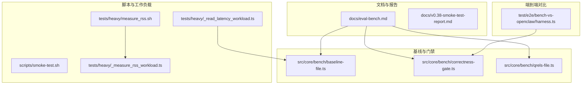
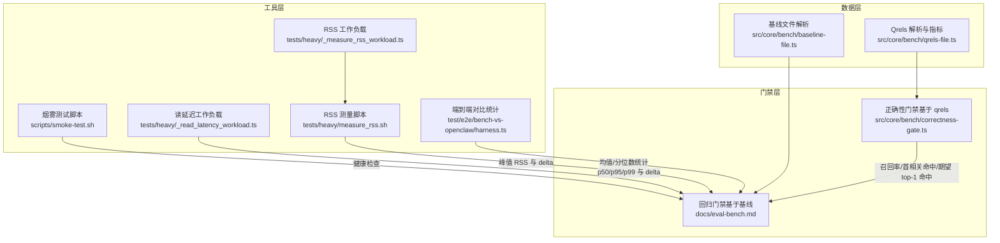
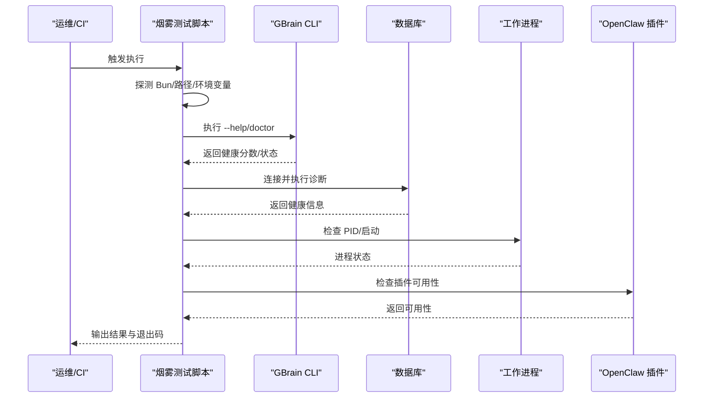
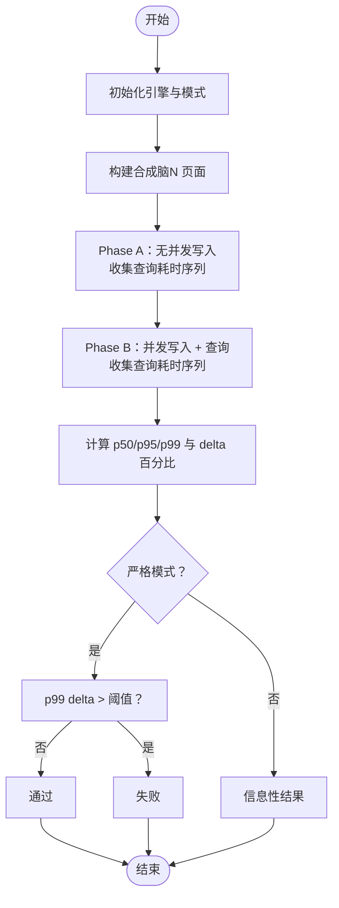
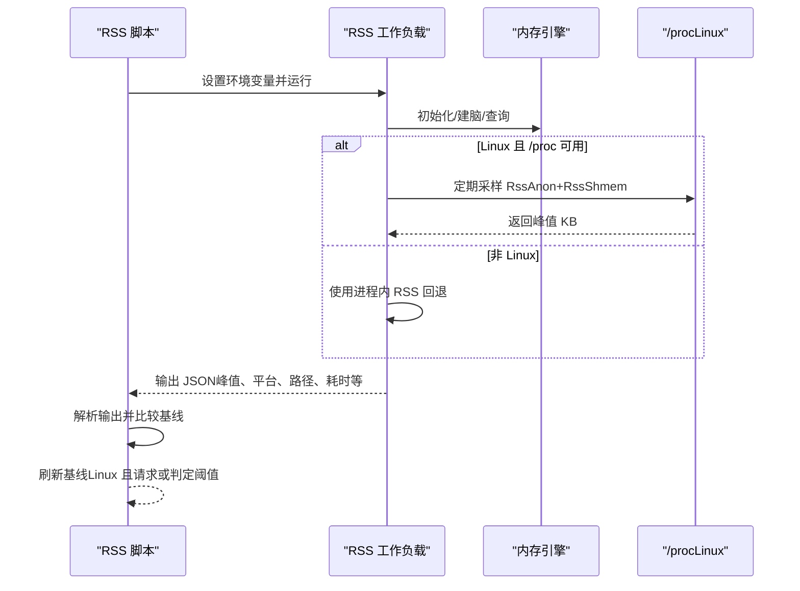
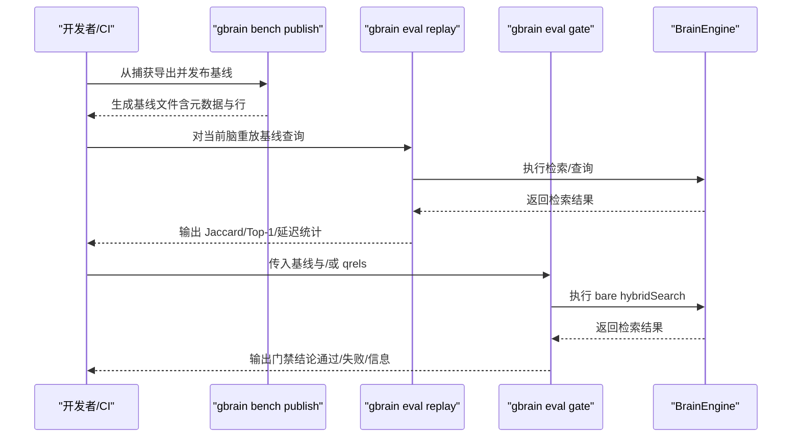
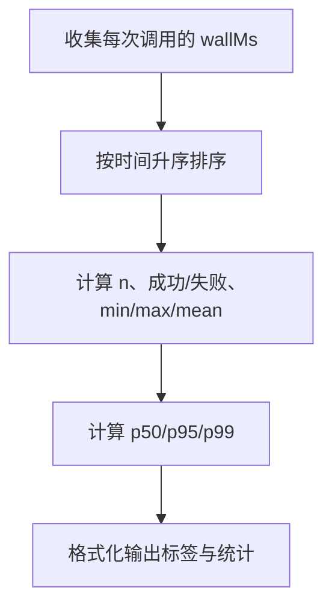
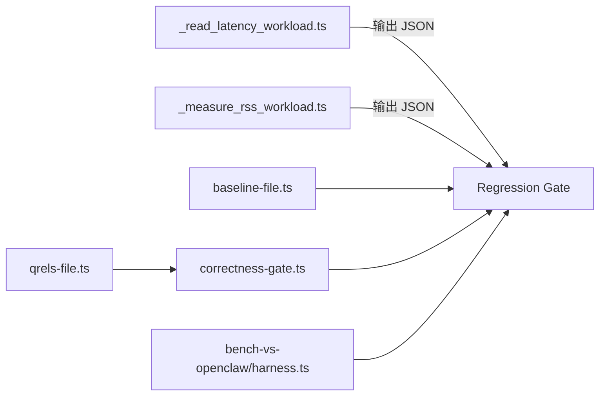

# 性能评估

<cite>
**本文引用的文件**
- [docs/v0.38-smoke-test-report.md](file://docs/v0.38-smoke-test-report.md)
- [docs/eval-bench.md](file://docs/eval-bench.md)
- [scripts/smoke-test.sh](file://scripts/smoke-test.sh)
- [tests/heavy/_read_latency_workload.ts](file://tests/heavy/_read_latency_workload.ts)
- [tests/heavy/measure_rss.sh](file://tests/heavy/measure_rss.sh)
- [tests/heavy/_measure_rss_workload.ts](file://tests/heavy/_measure_rss_workload.ts)
- [src/core/bench/baseline-file.ts](file://src/core/bench/baseline-file.ts)
- [src/core/bench/correctness-gate.ts](file://src/core/bench/correctness-gate.ts)
- [src/core/bench/qrels-file.ts](file://src/core/bench/qrels-file.ts)
- [test/e2e/bench-vs-openclaw/harness.ts](file://test/e2e/bench-vs-openclaw/harness.ts)
- [test/metric-glossary.test.ts](file://test/metric-glossary.test.ts)
</cite>

## 目录
1. [引言](#引言)
2. [项目结构](#项目结构)
3. [核心组件](#核心组件)
4. [架构总览](#架构总览)
5. [详细组件分析](#详细组件分析)
6. [依赖关系分析](#依赖关系分析)
7. [性能考量](#性能考量)
8. [故障排查指南](#故障排查指南)
9. [结论](#结论)
10. [附录](#附录)

## 引言
本文件面向维护者与贡献者，系统化梳理 GBrain 的性能评估体系：设计目标、测量方法、工具链与流程、指标定义、基线建立、回归判定、瓶颈定位、自动化集成与持续监控策略，并给出在系统调优与容量规划中的实践建议。内容覆盖烟雾测试（Smoke Test）、读延迟压测（Read Latency Under Write）、内存占用（RSS）压测、检索质量门禁（Regression Gate 与 Correctness Gate），以及端到端对比（bench-vs-openclaw）等能力。

## 项目结构
围绕性能评估的关键目录与文件：
- 文档与报告：用于指导开发与回归门禁的说明性文档
- 脚本与工作负载：自包含的性能测量脚本与工作负载
- 基线与门禁：用于检索质量回归与正确性的数据格式与判定逻辑
- 指标词典：统一的性能指标术语与释义

图表来源
- [docs/eval-bench.md:1-599](file://docs/eval-bench.md#L1-L599)
- [scripts/smoke-test.sh:1-205](file://scripts/smoke-test.sh#L1-L205)
- [tests/heavy/_read_latency_workload.ts:1-267](file://tests/heavy/_read_latency_workload.ts#L1-L267)
- [tests/heavy/measure_rss.sh:1-132](file://tests/heavy/measure_rss.sh#L1-L132)
- [tests/heavy/_measure_rss_workload.ts:1-221](file://tests/heavy/_measure_rss_workload.ts#L1-L221)
- [src/core/bench/baseline-file.ts:1-194](file://src/core/bench/baseline-file.ts#L1-L194)
- [src/core/bench/correctness-gate.ts:1-174](file://src/core/bench/correctness-gate.ts#L1-L174)
- [src/core/bench/qrels-file.ts:1-231](file://src/core/bench/qrels-file.ts#L1-L231)
- [test/e2e/bench-vs-openclaw/harness.ts:126-162](file://test/e2e/bench-vs-openclaw/harness.ts#L126-L162)

章节来源
- [docs/eval-bench.md:1-599](file://docs/eval-bench.md#L1-L599)
- [docs/v0.38-smoke-test-report.md:1-330](file://docs/v0.38-smoke-test-report.md#L1-L330)
- [scripts/smoke-test.sh:1-205](file://scripts/smoke-test.sh#L1-L205)
- [tests/heavy/_read_latency_workload.ts:1-267](file://tests/heavy/_read_latency_workload.ts#L1-L267)
- [tests/heavy/measure_rss.sh:1-132](file://tests/heavy/measure_rss.sh#L1-L132)
- [tests/heavy/_measure_rss_workload.ts:1-221](file://tests/heavy/_measure_rss_workload.ts#L1-L221)
- [src/core/bench/baseline-file.ts:1-194](file://src/core/bench/baseline-file.ts#L1-L194)
- [src/core/bench/correctness-gate.ts:1-174](file://src/core/bench/correctness-gate.ts#L1-L174)
- [src/core/bench/qrels-file.ts:1-231](file://src/core/bench/qrels-file.ts#L1-L231)
- [test/e2e/bench-vs-openclaw/harness.ts:126-162](file://test/e2e/bench-vs-openclaw/harness.ts#L126-L162)

## 核心组件
- 烟雾测试（Smoke Test）
  - 目标：快速验证运行时环境、数据库健康、工作进程、嵌入密钥、外部插件等关键路径是否可用
  - 工具：shell 脚本自动探测与修复，输出可审计日志，失败计数作为退出码
- 读延迟压测（Read Latency Under Write）
  - 目标：在写入并发压力下测量检索延迟分位数变化，识别同步对读的影响
  - 工具：单进程构建内存脑、固定查询集、并发写入、统计 p50/p95/p99 及 delta 百分比
- 内存占用压测（RSS）
  - 目标：在相同脑规模与查询负载下测量峰值常驻集大小（RSS），并与基线比较
  - 工具：Linux 使用 /proc 自测，非 Linux 回退为进程内 RSS；支持刷新基线与严格阈值
- 检索质量门禁（Regression Gate 与 Correctness Gate）
  - 目标：以真实查询或合成基线驱动检索一致性与正确性回归检测
  - 工具：基线文件（NDJSON）与 qrels 文件（JSON），分别用于“已捕获流量回放”和“标准问答评估”
- 端到端对比（bench-vs-openclaw）
  - 目标：对齐不同实现或版本的检索/推理耗时统计，生成稳健的分位数与均值
  - 工具：统计聚合函数，输出 n、成功/失败、min/max/mean/p50/p95/p99

章节来源
- [scripts/smoke-test.sh:1-205](file://scripts/smoke-test.sh#L1-L205)
- [tests/heavy/_read_latency_workload.ts:1-267](file://tests/heavy/_read_latency_workload.ts#L1-L267)
- [tests/heavy/measure_rss.sh:1-132](file://tests/heavy/measure_rss.sh#L1-L132)
- [tests/heavy/_measure_rss_workload.ts:1-221](file://tests/heavy/_measure_rss_workload.ts#L1-L221)
- [docs/eval-bench.md:1-599](file://docs/eval-bench.md#L1-L599)
- [src/core/bench/baseline-file.ts:1-194](file://src/core/bench/baseline-file.ts#L1-L194)
- [src/core/bench/correctness-gate.ts:1-174](file://src/core/bench/correctness-gate.ts#L1-L174)
- [src/core/bench/qrels-file.ts:1-231](file://src/core/bench/qrels-file.ts#L1-L231)
- [test/e2e/bench-vs-openclaw/harness.ts:126-162](file://test/e2e/bench-vs-openclaw/harness.ts#L126-L162)

## 架构总览
性能评估由“工具层—数据层—门禁层—报告层”构成，贯穿本地迭代与 CI 集成。

图表来源
- [scripts/smoke-test.sh:1-205](file://scripts/smoke-test.sh#L1-L205)
- [tests/heavy/_read_latency_workload.ts:1-267](file://tests/heavy/_read_latency_workload.ts#L1-L267)
- [tests/heavy/measure_rss.sh:1-132](file://tests/heavy/measure_rss.sh#L1-L132)
- [tests/heavy/_measure_rss_workload.ts:1-221](file://tests/heavy/_measure_rss_workload.ts#L1-L221)
- [src/core/bench/baseline-file.ts:1-194](file://src/core/bench/baseline-file.ts#L1-L194)
- [src/core/bench/correctness-gate.ts:1-174](file://src/core/bench/correctness-gate.ts#L1-L174)
- [src/core/bench/qrels-file.ts:1-231](file://src/core/bench/qrels-file.ts#L1-L231)
- [test/e2e/bench-vs-openclaw/harness.ts:126-162](file://test/e2e/bench-vs-openclaw/harness.ts#L126-L162)

## 详细组件分析

### 烟雾测试（Smoke Test）
- 设计目标：在部署后快速验证运行时环境健康度，自动尝试修复常见问题（如依赖缺失、进程未启动），并记录审计日志
- 关键流程
  - 解析运行环境（Bun、数据库连接、OpenClaw 插件）
  - 尝试加载 CLI 并执行 doctor 健康检查
  - 启动/恢复工作进程
  - 校验嵌入 API 密钥
  - 支持用户扩展测试（~/.gbrain/smoke-tests.d/*.sh）
- 结果与退出码：累计失败数作为退出码，便于 CI 失败判定

图表来源
- [scripts/smoke-test.sh:1-205](file://scripts/smoke-test.sh#L1-L205)

章节来源
- [scripts/smoke-test.sh:1-205](file://scripts/smoke-test.sh#L1-L205)
- [docs/v0.38-smoke-test-report.md:1-330](file://docs/v0.38-smoke-test-report.md#L1-L330)

### 读延迟压测（Read Latency Under Write）
- 设计目标：在写入并发压力下测量检索延迟分位数变化，量化同步对读的影响
- 关键流程
  - 初始化内存引擎与模式
  - 构建固定规模的合成脑（页面）
  - Phase A：无并发写入，收集查询耗时序列
  - Phase B：并发写入任务插入页面，同时进行查询，收集耗时序列
  - 统计 p50/p95/p99，计算 delta 百分比，输出 JSON 报告
- 严格模式：当 p99 delta 超过阈值时，严格模式下返回失败

图表来源
- [tests/heavy/_read_latency_workload.ts:1-267](file://tests/heavy/_read_latency_workload.ts#L1-L267)

章节来源
- [tests/heavy/_read_latency_workload.ts:1-267](file://tests/heavy/_read_latency_workload.ts#L1-L267)

### 内存占用压测（RSS）
- 设计目标：在相同脑规模与查询负载下测量峰值常驻集大小（RSS），并与基线比较
- 关键流程
  - 单进程构建内存脑并执行查询循环，实时采样 RSS
  - Linux 使用 /proc 自测，非 Linux 回退为进程内 RSS
  - 输出 JSON 包含峰值、平台、测量路径、查询次数、耗时、页数
  - 与基线比较，支持刷新基线（仅 Linux）与严格阈值

图表来源
- [tests/heavy/measure_rss.sh:1-132](file://tests/heavy/measure_rss.sh#L1-L132)
- [tests/heavy/_measure_rss_workload.ts:1-221](file://tests/heavy/_measure_rss_workload.ts#L1-L221)

章节来源
- [tests/heavy/measure_rss.sh:1-132](file://tests/heavy/measure_rss.sh#L1-L132)
- [tests/heavy/_measure_rss_workload.ts:1-221](file://tests/heavy/_measure_rss_workload.ts#L1-L221)

### 检索质量门禁（Regression Gate 与 Correctness Gate）
- Regression Gate（回归门禁）
  - 数据来源：基线文件（NDJSON），包含元数据与体行，体行镜像捕获输入
  - 用途：对当前脑重放基线查询，比较 Jaccard、Top-1 稳定性与平均延迟增量
  - 严格性：可配置阈值，CI 中可设为严格失败
- Correctness Gate（正确性门禁）
  - 数据来源：qrels 文件（JSON），定义“相关条目”与“期望 top-1”
  - 用途：对当前脑直接运行检索，计算 recall@K、首相关命中率、期望 top-1 命中率
  - 严格性：按条目级异常计入失败，避免隐藏硬查询

图表来源
- [docs/eval-bench.md:1-599](file://docs/eval-bench.md#L1-L599)
- [src/core/bench/baseline-file.ts:1-194](file://src/core/bench/baseline-file.ts#L1-L194)
- [src/core/bench/correctness-gate.ts:1-174](file://src/core/bench/correctness-gate.ts#L1-L174)
- [src/core/bench/qrels-file.ts:1-231](file://src/core/bench/qrels-file.ts#L1-L231)

章节来源
- [docs/eval-bench.md:1-599](file://docs/eval-bench.md#L1-L599)
- [src/core/bench/baseline-file.ts:1-194](file://src/core/bench/baseline-file.ts#L1-L194)
- [src/core/bench/correctness-gate.ts:1-174](file://src/core/bench/correctness-gate.ts#L1-L174)
- [src/core/bench/qrels-file.ts:1-231](file://src/core/bench/qrels-file.ts#L1-L231)

### 端到端对比（bench-vs-openclaw）
- 设计目标：对齐不同实现或版本的检索/推理耗时统计，生成稳健的分位数与均值
- 关键流程：收集多次调用的 wall 时间，排序后计算 n、成功/失败、min/max/mean/p50/p95/p99

图表来源
- [test/e2e/bench-vs-openclaw/harness.ts:126-162](file://test/e2e/bench-vs-openclaw/harness.ts#L126-L162)

章节来源
- [test/e2e/bench-vs-openclaw/harness.ts:126-162](file://test/e2e/bench-vs-openclaw/harness.ts#L126-L162)

## 依赖关系分析
- 工具与门禁的耦合
  - 读延迟与 RSS 工具输出稳定 JSON，便于门禁解析与阈值判定
  - Regression Gate 依赖基线文件格式的稳定性（schema_version、字段校验）
  - Correctness Gate 依赖 qrels 文件格式的稳定性与比较键（source_id::slug）
- 外部依赖
  - OpenClaw 插件健康度影响端到端对比与烟雾测试
  - 嵌入 API 密钥影响检索质量门禁的成本与可用性

图表来源
- [tests/heavy/_read_latency_workload.ts:1-267](file://tests/heavy/_read_latency_workload.ts#L1-L267)
- [tests/heavy/_measure_rss_workload.ts:1-221](file://tests/heavy/_measure_rss_workload.ts#L1-L221)
- [src/core/bench/baseline-file.ts:1-194](file://src/core/bench/baseline-file.ts#L1-L194)
- [src/core/bench/correctness-gate.ts:1-174](file://src/core/bench/correctness-gate.ts#L1-L174)
- [src/core/bench/qrels-file.ts:1-231](file://src/core/bench/qrels-file.ts#L1-L231)
- [test/e2e/bench-vs-openclaw/harness.ts:126-162](file://test/e2e/bench-vs-openclaw/harness.ts#L126-L162)

章节来源
- [src/core/bench/baseline-file.ts:1-194](file://src/core/bench/baseline-file.ts#L1-L194)
- [src/core/bench/correctness-gate.ts:1-174](file://src/core/bench/correctness-gate.ts#L1-L174)
- [src/core/bench/qrels-file.ts:1-231](file://src/core/bench/qrels-file.ts#L1-L231)

## 性能考量
- 指标定义与健康范围
  - Mean Jaccard@k：捕获集合与当前集合的重叠，≥0.85 通常视为中性变更
  - Top-1 稳定性：查询 #1 结果未变化的比例，≥85% 为调优通过
  - 平均延迟 Δ：当前减去捕获的延迟，±50ms 内为可接受，>2× 为警报
- 基线建立
  - 使用 gbrain eval export 生成基线文件，包含元数据与行
  - 基线文件要求 schema_version 一致，行包含 query_hash 与检索结果
- 回归判定
  - Regression Gate：比较 Jaccard、Top-1、延迟倍数
  - Correctness Gate：比较 recall@K、首相关命中、期望 top-1 命中
- 瓶颈识别
  - 读延迟压测关注 p99 delta，判断同步对读的影响
  - RSS 压测关注峰值内存增长，结合基线阈值判断回归
  - 端到端对比关注均值与分位数，辅助定位实现差异

[本节为通用指导，不直接分析具体文件]

## 故障排查指南
- 烟雾测试
  - Bun 未安装/不可执行：脚本会尝试自动安装并重试
  - CLI 无法加载：检查依赖安装与路径解析
  - 数据库健康检查失败：确认连接字符串与网络可达
  - 工作进程未运行：脚本会尝试启动并记录日志
  - OpenClaw 插件缺失：按需安装并重试
- 读延迟压测
  - 严格模式下 p99 delta 超阈值：检查写入并发、索引构建、向量模型
  - 查询数量不足导致统计不稳定：增加 NUM_QUERIES 或延长运行时间
- RSS 压测
  - 基线刷新被拒绝（macOS）：使用 Linux 容器运行以获得准确 /proc 测量
  - 严格模式下峰值 RSS 超阈值：优化内存分配、减少临时对象、检查向量化路径
- 门禁失败
  - Regression Gate：检查基线版本、查询漂移、嵌入源变化
  - Correctness Gate：核对 qrels 条目、source_id::slug 键拼写、预期 top-1 是否设置

章节来源
- [scripts/smoke-test.sh:1-205](file://scripts/smoke-test.sh#L1-L205)
- [tests/heavy/_read_latency_workload.ts:1-267](file://tests/heavy/_read_latency_workload.ts#L1-L267)
- [tests/heavy/measure_rss.sh:1-132](file://tests/heavy/measure_rss.sh#L1-L132)
- [docs/eval-bench.md:1-599](file://docs/eval-bench.md#L1-L599)

## 结论
GBrain 的性能评估体系以“工具—数据—门禁—报告”闭环为核心，覆盖运行时健康、检索一致性与正确性、内存占用与延迟等关键维度。通过稳定的基线与 qrels 格式、严格的阈值与严格模式、以及可审计的日志与 JSON 输出，既满足本地迭代效率，也适配 CI 集成与持续监控。建议在日常开发中优先运行烟雾测试与端到端对比，再针对热点模块执行读延迟与 RSS 压测，并在涉及检索管线的变更前运行回归与正确性门禁。

[本节为总结性内容，不直接分析具体文件]

## 附录
- 指标词典与术语
  - 通过测试用例验证指标术语、释义与分组，确保团队对性能指标有一致理解
- 常见失败模式速查
  - Mean Jaccard 低且集中在某前缀：源提升或排除规则异常
  - Top-1 稳定性低但 Jaccard 高：RRF 参数偏移导致排序抖动
  - 平均延迟显著上升：向量路径变慢或 HNSW 探针增多
  - 存在错误行：个别查询异常，需检查输入与上下文

章节来源
- [test/metric-glossary.test.ts:39-128](file://test/metric-glossary.test.ts#L39-L128)