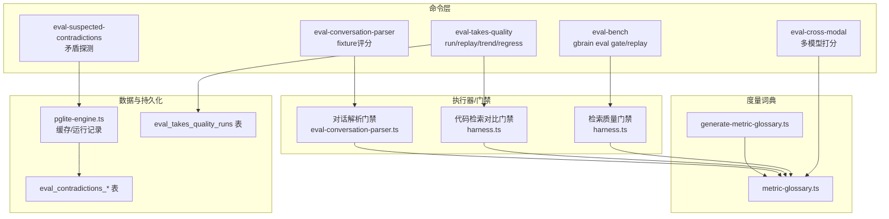
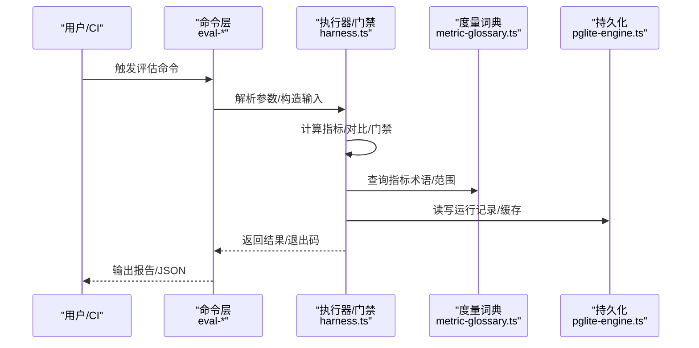
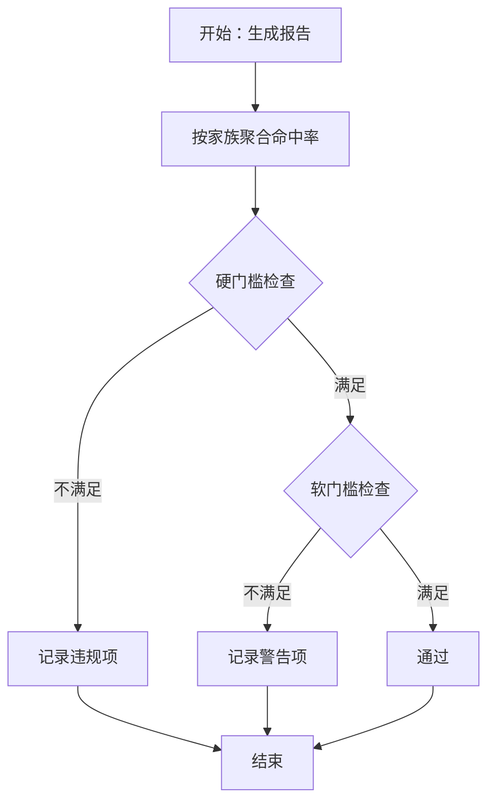
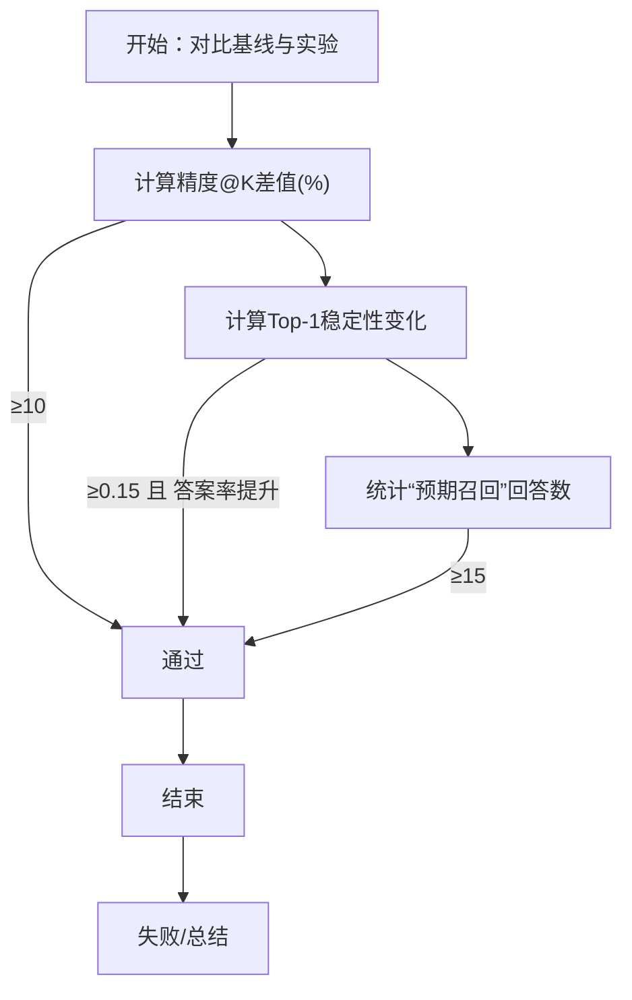
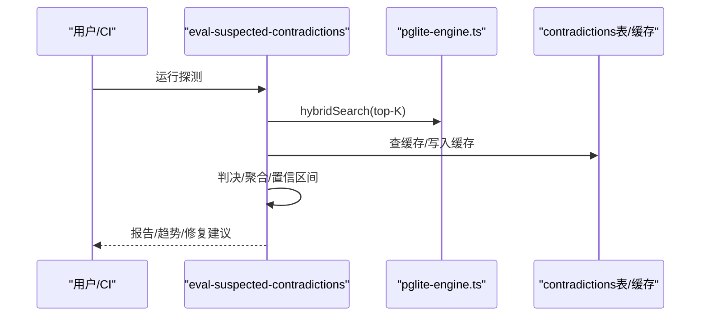
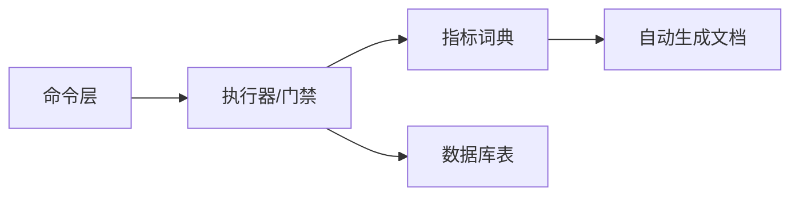

# 评估指标

<cite>
**本文引用的文件**
- [docs/eval-bench.md](file://docs/eval-bench.md)
- [docs/eval-capture.md](file://docs/eval-capture.md)
- [docs/eval-takes-quality.md](file://docs/eval-takes-quality.md)
- [docs/contradictions.md](file://docs/contradictions.md)
- [src/core/eval/metric-glossary.ts](file://src/core/eval/metric-glossary.ts)
- [scripts/generate-metric-glossary.ts](file://scripts/generate-metric-glossary.ts)
- [src/eval/retrieval-quality/harness.ts](file://src/eval/retrieval-quality/harness.ts)
- [src/eval/code-retrieval/harness.ts](file://src/eval/code-retrieval/harness.ts)
- [src/commands/eval-conversation-parser.ts](file://src/commands/eval-conversation-parser.ts)
- [src/commands/eval-cross-modal.ts](file://src/commands/eval-cross-modal.ts)
- [src/core/pglite-engine.ts](file://src/core/pglite-engine.ts)
- [test/e2e/eval-contradictions-postgres.test.ts](file://test/e2e/eval-contradictions-postgres.test.ts)
- [test/retrieval-quality-harness.test.ts](file://test/retrieval-quality-harness.test.ts)
- [test/takes-resolution.test.ts](file://test/takes-resolution.test.ts)
- [test/metric-glossary.test.ts](file://test/metric-glossary.test.ts)
</cite>

## 目录
1. [引言](#引言)
2. [项目结构](#项目结构)
3. [核心组件](#核心组件)
4. [架构总览](#架构总览)
5. [详细组件分析](#详细组件分析)
6. [依赖关系分析](#依赖关系分析)
7. [性能考量](#性能考量)
8. [故障排查指南](#故障排查指南)
9. [结论](#结论)
10. [附录](#附录)

## 引言
本文件系统性梳理 GBrain 的评估指标体系，覆盖检索质量、事实质量与矛盾检测等核心维度，明确指标设计原则、分类方法、计算公式、阈值设定与结果解读，并给出统计分析、趋势监控与异常检测流程，以及指标维护与新增规范，帮助在系统改进与决策支持中稳定落地评估闭环。

## 项目结构
评估相关能力由“命令层（CLI）—执行器（Runner）—度量词典（Glossary）—持久化（数据库表）”构成，贯穿捕获、回放、门禁、批价、趋势与异常处置等环节。

图示来源
- [docs/eval-bench.md:1-599](file://docs/eval-bench.md#L1-L599)
- [docs/eval-takes-quality.md:1-160](file://docs/eval-takes-quality.md#L1-L160)
- [docs/contradictions.md:1-167](file://docs/contradictions.md#L1-L167)
- [src/core/eval/metric-glossary.ts:1-256](file://src/core/eval/metric-glossary.ts#L1-L256)
- [scripts/generate-metric-glossary.ts:1-27](file://scripts/generate-metric-glossary.ts#L1-L27)
- [src/eval/retrieval-quality/harness.ts:160-185](file://src/eval/retrieval-quality/harness.ts#L160-L185)
- [src/eval/code-retrieval/harness.ts:304-361](file://src/eval/code-retrieval/harness.ts#L304-L361)
- [src/commands/eval-conversation-parser.ts:1-181](file://src/commands/eval-conversation-parser.ts#L1-L181)
- [src/commands/eval-cross-modal.ts:1-833](file://src/commands/eval-cross-modal.ts#L1-L833)
- [src/core/pglite-engine.ts:4198-4235](file://src/core/pglite-engine.ts#L4198-L4235)

章节来源
- [docs/eval-bench.md:1-599](file://docs/eval-bench.md#L1-L599)
- [docs/eval-takes-quality.md:1-160](file://docs/eval-takes-quality.md#L1-L160)
- [docs/contradictions.md:1-167](file://docs/contradictions.md#L1-L167)
- [src/core/eval/metric-glossary.ts:1-256](file://src/core/eval/metric-glossary.ts#L1-L256)
- [scripts/generate-metric-glossary.ts:1-27](file://scripts/generate-metric-glossary.ts#L1-L27)
- [src/eval/retrieval-quality/harness.ts:160-185](file://src/eval/retrieval-quality/harness.ts#L160-L185)
- [src/eval/code-retrieval/harness.ts:304-361](file://src/eval/code-retrieval/harness.ts#L304-L361)
- [src/commands/eval-conversation-parser.ts:1-181](file://src/commands/eval-conversation-parser.ts#L1-L181)
- [src/commands/eval-cross-modal.ts:1-833](file://src/commands/eval-cross-modal.ts#L1-L833)
- [src/core/pglite-engine.ts:4198-4235](file://src/core/pglite-engine.ts#L4198-L4235)

## 核心组件
- 指标词典：统一定义检索、稳定性、显著性、运营成本等类别的指标术语、通俗解释与取值范围，支撑报告与门禁一致性。
- 门禁与对比：针对检索质量、代码检索、对话解析等场景设置硬门槛与软门槛，结合稳定性与显著性指标判定通过与否。
- 数据捕获与回放：基于真实查询捕获与导出，形成基线并进行回归检查；同时支持公开基准与长记忆评测。
- 矛盾探测：对检索结果进行成对事实校验，输出置信区间与严重等级，支持趋势跟踪与夜间探针。
- 质量门禁：对 takes 层面的质量进行跨模型打分，产出可复现的门禁结果与趋势。

章节来源
- [src/core/eval/metric-glossary.ts:1-256](file://src/core/eval/metric-glossary.ts#L1-L256)
- [docs/eval-bench.md:1-599](file://docs/eval-bench.md#L1-L599)
- [docs/contradictions.md:1-167](file://docs/contradictions.md#L1-L167)
- [docs/eval-takes-quality.md:1-160](file://docs/eval-takes-quality.md#L1-L160)

## 架构总览
下图展示从命令到执行器再到持久化的评估闭环，以及与度量词典的协作关系。

图示来源
- [src/commands/eval-cross-modal.ts:1-833](file://src/commands/eval-cross-modal.ts#L1-L833)
- [src/eval/retrieval-quality/harness.ts:160-185](file://src/eval/retrieval-quality/harness.ts#L160-L185)
- [src/eval/code-retrieval/harness.ts:304-361](file://src/eval/code-retrieval/harness.ts#L304-L361)
- [src/core/eval/metric-glossary.ts:1-256](file://src/core/eval/metric-glossary.ts#L1-L256)
- [src/core/pglite-engine.ts:4198-4235](file://src/core/pglite-engine.ts#L4198-L4235)

## 详细组件分析

### 检索质量门禁（NamedThingBench）
- 设计原则：以家族为单位划分硬门槛与软门槛，强调关键族（如标题子串、别名同义）的命中率，确保命名实体检索的稳定性与鲁棒性。
- 指标与阈值：
  - 硬门槛：title-substring 家族 Hit@1 ≥ 0.95；alias-synonym 家族 Hit@1 ≥ 0.98；multi-chunk-dilution 家族 Hit@3 = 1.0。
  - 软门槛：若干家族允许放宽，用于探索性回归。
- 计算与判定：按家族聚合命中率，比较阈值决定是否“违规/警告”，并生成门禁报告。
- 阈值环境变量：可通过环境变量微调软门槛，便于不同场景下的门禁策略。

图示来源
- [src/eval/retrieval-quality/harness.ts:160-185](file://src/eval/retrieval-quality/harness.ts#L160-L185)
- [test/retrieval-quality-harness.test.ts:33-64](file://test/retrieval-quality-harness.test.ts#L33-L64)

章节来源
- [src/eval/retrieval-quality/harness.ts:160-185](file://src/eval/retrieval-quality/harness.ts#L160-L185)
- [test/retrieval-quality-harness.test.ts:33-64](file://test/retrieval-quality-harness.test.ts#L33-L64)

### 代码检索对比门禁（v0.34 船闸）
- 设计原则：以精度@K变化与 Top-1 稳定性变化作为双判据，避免单纯追求排序变动而忽视答案质量提升。
- 指标与阈值：
  - 精度@K 提升 ≥ 10 个百分点；
  - Top-1 稳定性变化（与基线相比）≥ 0.15（更显著的重排且答案率提升）；
  - 至少 15 个问题被“预期召回”模式回答。
- 判定逻辑：任一条件满足即通过，否则失败；失败时输出总结说明。

图示来源
- [src/eval/code-retrieval/harness.ts:304-361](file://src/eval/code-retrieval/harness.ts#L304-L361)

章节来源
- [src/eval/code-retrieval/harness.ts:304-361](file://src/eval/code-retrieval/harness.ts#L304-L361)

### 对话解析门禁（v0.41.16.0）
- 设计原则：对对话解析 fixture 进行确定性评分，支持关闭 LLM 后仅用正则的 CI 门禁，保证回归不依赖外部 API。
- 指标与阈值：
  - 最小召回阈值（默认 0.9），用于正向样例；
  - 失败样例（对抗样例）应无法通过；
  - 支持按模式覆盖率统计与失败样例清单。
- 门禁退出码：0 全部通过；1 存在失败；2 参数或格式错误。

章节来源
- [src/commands/eval-conversation-parser.ts:1-181](file://src/commands/eval-conversation-parser.ts#L1-L181)

### 跨模态质量门禁（Cross-Modal）
- 设计原则：三模型面板对任务-输出维度打分，聚合后 PASS/FAIL/INCONCLUSIVE；支持批量模式与成本上限控制。
- 指标与阈值：
  - 平均分 ≥ 7 且最低分 ≥ 5；
  - 不足 2/3 模型返回有效分数时为 INCONCLUSIVE；
  - 批量模式按问题粒度汇总，保留每题收据路径以便审计。
- 成本与并发：默认周期数在 TTY 为 3，在非 TTY 降为 1；并发上限 9；支持预算上限与预估提示。

章节来源
- [src/commands/eval-cross-modal.ts:1-833](file://src/commands/eval-cross-modal.ts#L1-L833)

### 取证质量门禁（Takes Quality）
- 设计原则：对 takes 层面的事实质量进行跨模型打分，产出可复现的门禁结果与趋势，支持回归对比。
- 指标与阈值：
  - 整体平均分 ≥ 7 且各维度最小分 ≥ 5；
  - 不足 2/3 模型贡献完整分数时为 INCONCLUSIVE；
  - 支持按 corpus、prompt、模型集合指纹区分运行，避免误比。
- 回归对比：支持指定基线对比，阈值为每个维度均值下降超过阈值（默认 0.5）即视为回归。

章节来源
- [docs/eval-takes-quality.md:1-160](file://docs/eval-takes-quality.md#L1-L160)
- [test/takes-resolution.test.ts:1-43](file://test/takes-resolution.test.ts#L1-L43)

### 矛盾检测评估（Suspected Contradictions）
- 设计原则：对检索结果进行成对事实校验，识别未标记的语义矛盾，输出置信区间与严重等级，支持趋势跟踪与夜间探针。
- 指标与阈值：
  - 头号数字：查询中至少发现一个矛盾的比例（Wilson 95% 置信区间）；
  - 决策标准：Wilson 下界 < 5% 停止；5–15% 由操作员权衡；> 15% 视为需要更大动作；
  - 严重等级：低（命名差异）、中（数值/状态可能过期）、高（身份/结构主张）。
- 缓存与成本：持久化缓存（eval_contradictions_cache）降低重复成本；默认预算约 $5；夜间运行建议。
- 数据库表：运行记录与缓存表（eval_contradictions_runs、eval_contradictions_cache）。

图示来源
- [docs/contradictions.md:1-167](file://docs/contradictions.md#L1-L167)
- [src/core/pglite-engine.ts:4198-4235](file://src/core/pglite-engine.ts#L4198-L4235)
- [test/e2e/eval-contradictions-postgres.test.ts:26-103](file://test/e2e/eval-contradictions-postgres.test.ts#L26-L103)

章节来源
- [docs/contradictions.md:1-167](file://docs/contradictions.md#L1-L167)
- [src/core/pglite-engine.ts:4198-4235](file://src/core/pglite-engine.ts#L4198-L4235)
- [test/e2e/eval-contradictions-postgres.test.ts:26-103](file://test/e2e/eval-contradictions-postgres.test.ts#L26-L103)

### 指标词典与度量说明
- 统一术语：涵盖检索 IR 指标（Precision@K、Recall@K、MRR、nDCG@K）、证据合同指标（Hit@1、Hit@3、Avg Rank-1 Score、Create Safety Hint）、稳定性指标（Jaccard@K、Top-1 Stability）、显著性指标（p-value、Confidence Interval）与运营成本指标（Cache Hit Rate、Avg Results、Avg Tokens、Cost per Query USD、p99 Latency ms）。
- 使用方式：CLI 与搜索统计输出通过该词典提供“Plain English”解释与范围说明，便于非技术读者理解。

章节来源
- [src/core/eval/metric-glossary.ts:1-256](file://src/core/eval/metric-glossary.ts#L1-L256)
- [scripts/generate-metric-glossary.ts:1-27](file://scripts/generate-metric-glossary.ts#L1-L27)
- [test/metric-glossary.test.ts:1-128](file://test/metric-glossary.test.ts#L1-L128)

## 依赖关系分析
- 命令层依赖执行器与门禁模块，后者依赖指标词典获取术语与范围，最终通过持久化模块访问数据库表。
- 词典模块独立于具体命令，通过自动生成文档与 CI 校验保证一致性。
- 矛盾探测依赖缓存表与运行表，形成“探测—缓存—趋势”的闭环。

图示来源
- [src/core/eval/metric-glossary.ts:1-256](file://src/core/eval/metric-glossary.ts#L1-L256)
- [scripts/generate-metric-glossary.ts:1-27](file://scripts/generate-metric-glossary.ts#L1-L27)
- [src/core/pglite-engine.ts:4198-4235](file://src/core/pglite-engine.ts#L4198-L4235)

章节来源
- [src/core/eval/metric-glossary.ts:1-256](file://src/core/eval/metric-glossary.ts#L1-L256)
- [scripts/generate-metric-glossary.ts:1-27](file://scripts/generate-metric-glossary.ts#L1-L27)
- [src/core/pglite-engine.ts:4198-4235](file://src/core/pglite-engine.ts#L4198-L4235)

## 性能考量
- 检索质量门禁：通过硬/软门槛快速拦截显著退化，减少后续人工审查成本。
- 矛盾探测：利用持久化缓存显著降低重复运行成本，建议夜间运行并随提示版本调整缓存失效策略。
- 跨模态门禁：通过并发与周期限制控制成本，批量模式下严格预估总费用并支持预算拒绝。
- Takes 质量门禁：通过多模型面板与阈值组合，平衡质量与成本，支持回归对比与趋势追踪。

## 故障排查指南
- 门禁失败：
  - 检索质量门禁：查看违规/警告家族与阈值，结合环境变量微调软门槛；定位具体查询与重排影响。
  - 代码检索门禁：关注精度提升与 Top-1 稳定性变化，确认“预期召回”问题数量是否达标。
  - 对话解析门禁：检查正则与 LLM 模式配置，确保 fixture 格式正确；必要时开启无 LLM 模式进行确定性回归测试。
  - 跨模态门禁：核对模型配置与预算上限，检查批量模式的上游错误行与格式错误行。
  - Takes 质量门禁：确认模型面板、样本规模与回归阈值；对比历史运行以识别趋势。
- 矛盾探测：
  - 关注 Wilson 置信区间与严重等级分布，结合“修复建议”命令快速处置高优先级问题。
  - 若缓存命中率异常，检查提示版本与截断策略是否变更。
- 指标词典：
  - 新增/修改指标需同步更新词典与 CI 文档生成脚本，确保一致性。

章节来源
- [docs/eval-bench.md:1-599](file://docs/eval-bench.md#L1-L599)
- [docs/contradictions.md:1-167](file://docs/contradictions.md#L1-L167)
- [docs/eval-takes-quality.md:1-160](file://docs/eval-takes-quality.md#L1-L160)
- [src/commands/eval-conversation-parser.ts:1-181](file://src/commands/eval-conversation-parser.ts#L1-L181)
- [src/commands/eval-cross-modal.ts:1-833](file://src/commands/eval-cross-modal.ts#L1-L833)
- [src/core/eval/metric-glossary.ts:1-256](file://src/core/eval/metric-glossary.ts#L1-L256)

## 结论
GBrain 的评估指标体系以“统一术语 + 门禁阈值 + 数据持久化 + 趋势监控”为核心，覆盖检索、事实与矛盾三大关键领域。通过明确的计算公式、阈值设定与结果解读方法，结合统计显著性与成本控制，形成可复现、可观测、可治理的评估闭环，为系统改进与决策支持提供坚实依据。

## 附录

### 指标分类与设计原则
- 分类：
  - 检索 IR 指标：Precision@K、Recall@K、MRR、nDCG@K；
  - 证据合同指标：Hit@1、Hit@3、Avg Rank-1 Score、Create Safety Hint；
  - 稳定性指标：Jaccard@K、Top-1 Stability；
  - 显著性指标：p-value、Confidence Interval；
  - 运营成本指标：Cache Hit Rate、Avg Results、Avg Tokens、Cost per Query USD、p99 Latency ms。
- 设计原则：
  - 术语一致：使用行业标准术语并提供通俗解释；
  - 阈值明确：硬门槛与软门槛结合，支持环境变量微调；
  - 可观测：持久化运行记录与缓存，支持趋势与回归对比；
  - 可治理：失败原因清晰、修复建议可执行、成本可控。

章节来源
- [src/core/eval/metric-glossary.ts:1-256](file://src/core/eval/metric-glossary.ts#L1-L256)
- [test/metric-glossary.test.ts:1-128](file://test/metric-glossary.test.ts#L1-L128)