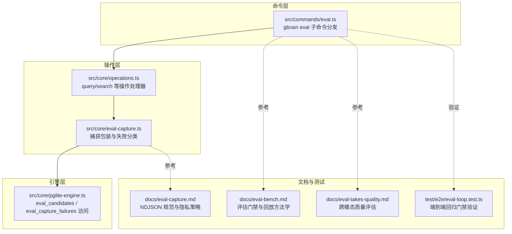
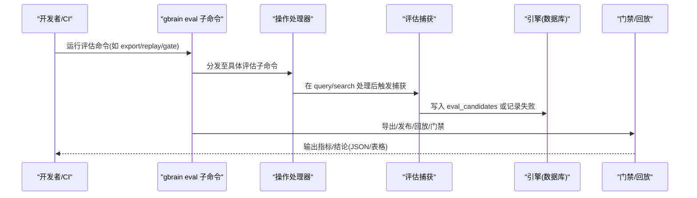
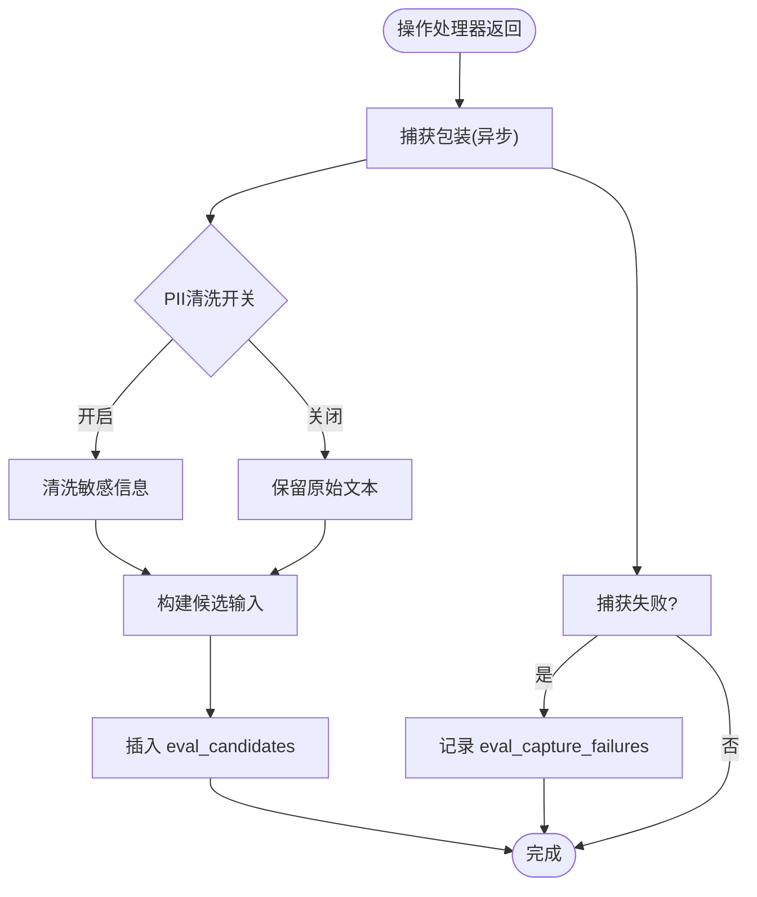
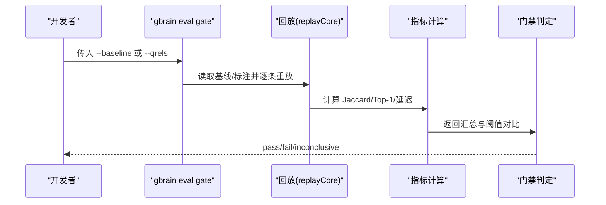
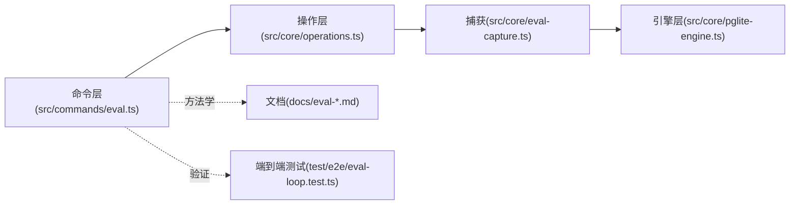

# 评估框架

<cite>
**本文引用的文件**
- [README.md](file://README.md)
- [docs/eval-bench.md](file://docs/eval-bench.md)
- [docs/eval-capture.md](file://docs/eval-capture.md)
- [docs/eval-takes-quality.md](file://docs/eval-takes-quality.md)
- [docs/TESTING.md](file://docs/TESTING.md)
- [src/commands/eval.ts](file://src/commands/eval.ts)
- [src/core/operations.ts](file://src/core/operations.ts)
- [src/core/eval-capture.ts](file://src/core/eval-capture.ts)
- [src/core/pglite-engine.ts](file://src/core/pglite-engine.ts)
- [test/e2e/eval-loop.test.ts](file://test/e2e/eval-loop.test.ts)
- [src/eval/code-retrieval/harness.ts](file://src/eval/code-retrieval/harness.ts)
</cite>

## 目录
1. [简介](#简介)
2. [项目结构](#项目结构)
3. [核心组件](#核心组件)
4. [架构总览](#架构总览)
5. [详细组件分析](#详细组件分析)
6. [依赖关系分析](#依赖关系分析)
7. [性能考量](#性能考量)
8. [故障排查指南](#故障排查指南)
9. [结论](#结论)
10. [附录](#附录)

## 简介
本文件系统性阐述 GBrain 评估框架的设计与执行流程，覆盖基准测试、回归测试与质量门禁方法论；详述评估数据采集、处理与分析流程；给出评估指标定义、统计分析与结果解读指南；并提供运行与扩展评估工具（含自定义评估场景与数据集）的操作指引，以及评估结果的应用与改进闭环策略。

## 项目结构
评估框架由“命令层”“操作层”“引擎层”“文档与测试”四部分协同构成：
- 命令层：统一入口命令 gbrain eval 及子命令（export、replay、gate、cross-modal、code-retrieval、retrieval-quality、brainstorm、whoknows、suspected-contradictions、trajectory、conversation-parser、run-all、compare），负责参数解析、调度与输出格式化。
- 操作层：在 query/search 等操作处理器中织入评估捕获逻辑，确保真实流量被稳定记录。
- 引擎层：提供 eval_candidates 与 eval_capture_failures 表的读写能力，支撑回放与健康观测。
- 文档与测试：提供评估方法学、NDJSON 规范、回归门禁与端到端验证用例。

图示来源
- [src/commands/eval.ts:1-436](file://src/commands/eval.ts#L1-L436)
- [src/core/operations.ts:1-200](file://src/core/operations.ts#L1-L200)
- [src/core/eval-capture.ts:1-255](file://src/core/eval-capture.ts#L1-L255)
- [src/core/pglite-engine.ts:5217-5257](file://src/core/pglite-engine.ts#L5217-L5257)
- [docs/eval-bench.md:1-599](file://docs/eval-bench.md#L1-L599)
- [docs/eval-capture.md:1-161](file://docs/eval-capture.md#L1-L161)
- [docs/eval-takes-quality.md:1-160](file://docs/eval-takes-quality.md#L1-L160)
- [test/e2e/eval-loop.test.ts:208-243](file://test/e2e/eval-loop.test.ts#L208-L243)

章节来源
- [README.md:263-265](file://README.md#L263-L265)
- [docs/TESTING.md:1-304](file://docs/TESTING.md#L1-L304)

## 核心组件
- 评估命令分发器：集中管理所有评估子命令，支持 A/B 对比、批量运行与多种评估模式（检索质量、长记忆问答、跨模态、矛盾探测等）。
- 捕获与回放：在操作层织入捕获逻辑，将真实查询与检索结果序列化为 NDJSON；提供导出、发布基线、回放与门禁判定能力。
- 门禁与指标：定义回归门禁（基于 Jaccard 与 Top-1 稳定性）与正确性门禁（基于 qrels 的召回率、首次相关命中率等），并提供成本与稳定性阈值。
- 质量门禁：对 takes 层进行跨模型面板评分，聚合维度得分与总体分数，形成趋势与回归检测能力。
- 数据表与审计：eval_candidates 用于存储捕获的真实查询样本；eval_capture_failures 用于跨进程可见的捕获失败审计。

章节来源
- [src/commands/eval.ts:23-113](file://src/commands/eval.ts#L23-L113)
- [src/core/operations.ts:14-27](file://src/core/operations.ts#L14-L27)
- [src/core/eval-capture.ts:157-224](file://src/core/eval-capture.ts#L157-L224)
- [src/core/pglite-engine.ts:5217-5257](file://src/core/pglite-engine.ts#L5217-L5257)
- [docs/eval-bench.md:117-142](file://docs/eval-bench.md#L117-L142)
- [docs/eval-takes-quality.md:13-24](file://docs/eval-takes-quality.md#L13-L24)

## 架构总览
评估框架围绕“真实流量捕获—基线发布—回放对比—门禁判定—结果可视化/持久化”的闭环展开，既可作为本地迭代工具，也可集成到 CI 中进行回归与正确性门禁。

图示来源
- [src/commands/eval.ts:23-113](file://src/commands/eval.ts#L23-L113)
- [src/core/operations.ts:14-27](file://src/core/operations.ts#L14-L27)
- [src/core/eval-capture.ts:157-224](file://src/core/eval-capture.ts#L157-L224)
- [src/core/pglite-engine.ts:5217-5257](file://src/core/pglite-engine.ts#L5217-L5257)

## 详细组件分析

### 组件A：评估命令分发与子命令
- 功能要点
  - 子命令分发：export、prune、replay、gate、cross-modal、code-retrieval、retrieval-quality、brainstorm、whoknows、suspected-contradictions、trajectory、conversation-parser、run-all、compare。
  - A/B 对比：支持两套配置并行运行，输出对比表格与差异。
  - 参数解析：支持策略、RRF-K、扩展开关、去重阈值、限制深度等。
  - 输出格式：单次运行打印明细与均值；A/B 运行打印两侧指标与 ΔnDCG。
- 使用建议
  - 优先使用 run-all 生成多模式汇总报告，再针对异常问题进入子命令精查。
  - A/B 对比时仅对侧 A 传 CLI 覆盖项，确保对比公平。

章节来源
- [src/commands/eval.ts:23-113](file://src/commands/eval.ts#L23-L113)
- [src/commands/eval.ts:174-257](file://src/commands/eval.ts#L174-L257)
- [src/commands/eval.ts:263-390](file://src/commands/eval.ts#L263-L390)

### 组件B：真实流量捕获与 NDJSON 规范
- 捕获位置与流程
  - 在操作层（query/search）织入捕获包装，异步落库，失败通过审计表暴露。
  - 支持 PII 清洗与隐私开关，遵循贡献者模式控制是否开启。
- NDJSON 规范
  - 字段覆盖查询、检索结果、请求细节、向量化路径启用状态、延迟、来源等。
  - 排序与确定性：按时间倒序+主键倒序保证窗口拼接不漏不重。
- 隐私与合规
  - 默认关闭，需显式开启；公共基线必须使用合成数据，严禁使用真实用户数据。

图示来源
- [src/core/eval-capture.ts:157-224](file://src/core/eval-capture.ts#L157-L224)
- [src/core/operations.ts:14-27](file://src/core/operations.ts#L14-L27)
- [src/core/pglite-engine.ts:5217-5257](file://src/core/pglite-engine.ts#L5217-L5257)
- [docs/eval-capture.md:66-109](file://docs/eval-capture.md#L66-L109)

章节来源
- [docs/eval-capture.md:11-41](file://docs/eval-capture.md#L11-L41)
- [docs/eval-capture.md:123-161](file://docs/eval-capture.md#L123-L161)

### 组件C：回归门禁与正确性门禁
- 回归门禁（基于基线）
  - 发布个人基线（本地 ~/.gbrain/baselines/）；对当前版本回放，计算 Mean Jaccard@k、Top-1 稳定率、平均延迟 Δ。
  - 健康阈值：Jaccard ≥0.85、Top-1 ≥85%、Δ 在 ±50ms 内；任一不满足则门禁失败。
- 正确性门禁（基于 qrels）
  - 使用公开或内部标注集，直接运行 hybridSearch 计算召回率、首次相关命中率、期望 Top-1 命中率等。
  - 适合对齐检索质量目标，而非仅比较历史回放。
- 门禁失败定位
  - 通过失败模式表快速定位：源前缀硬排除、RRF 调参漂移、向量路径变慢、捕获失败等。

图示来源
- [docs/eval-bench.md:14-27](file://docs/eval-bench.md#L14-L27)
- [docs/eval-bench.md:182-187](file://docs/eval-bench.md#L182-L187)
- [docs/eval-bench.md:330-340](file://docs/eval-bench.md#L330-L340)

章节来源
- [docs/eval-bench.md:117-142](file://docs/eval-bench.md#L117-L142)
- [docs/eval-bench.md:188-205](file://docs/eval-bench.md#L188-L205)

### 组件D：跨模态质量评估（takes 层）
- 评估对象：takes 文本，使用三模型面板（如 gpt-4o、claude-opus-4-7、gemini-1.5-pro）评分五维指标（准确性、归属、权重校准、类型分类、信号密度）。
- 产出：带维度均值/最小值/每模型得分的 JSON，持久化到数据库与磁盘，支持趋势与回归检测。
- 适用场景：抽取/归纳质量的持续监控与回归门禁。

章节来源
- [docs/eval-takes-quality.md:13-24](file://docs/eval-takes-quality.md#L13-L24)
- [docs/eval-takes-quality.md:37-70](file://docs/eval-takes-quality.md#L37-L70)
- [docs/eval-takes-quality.md:94-104](file://docs/eval-takes-quality.md#L94-L104)

### 组件E：代码检索评估门禁（Code Retrieval Harness）
- 用途：在引入代码智能增强后，对比“有/无代码情报”两种模式下的精度变化与 Top-1 稳定性。
- 门限：默认要求精度@5 提升≥10 个百分点，或 Top-1 稳定性提升≥某个下限，且至少 N 条问题通过预期召回阈值。
- 适用：当检索链路新增代码相关信号时的质量门禁。

章节来源
- [src/eval/code-retrieval/harness.ts:316-336](file://src/eval/code-retrieval/harness.ts#L316-L336)

### 组件F：端到端回归门禁验证
- 用例覆盖：基线发布/解析稳定性、错误基线的 fail-closed 行为、字节级可逆性等。
- 价值：确保评估门禁在极端输入下仍可靠。

章节来源
- [test/e2e/eval-loop.test.ts:208-243](file://test/e2e/eval-loop.test.ts#L208-L243)

## 依赖关系分析
- 命令层依赖操作层提供的评估子命令实现；操作层依赖捕获模块；捕获模块依赖引擎层的数据访问接口；文档与测试为命令层与操作层提供方法学与验证依据。
- 关键耦合点
  - 操作层与捕获模块：捕获包装在操作处理器内调用，影响响应延迟，因此采用 fire-and-forget。
  - 门禁与 NDJSON：回放依赖稳定的排序与字段语义，确保跨版本可比。
  - 引擎层：eval_candidates 与 eval_capture_failures 为评估闭环提供数据基础。

图示来源
- [src/commands/eval.ts:23-113](file://src/commands/eval.ts#L23-L113)
- [src/core/operations.ts:14-27](file://src/core/operations.ts#L14-L27)
- [src/core/eval-capture.ts:157-224](file://src/core/eval-capture.ts#L157-L224)
- [src/core/pglite-engine.ts:5217-5257](file://src/core/pglite-engine.ts#L5217-L5257)
- [docs/eval-bench.md:1-599](file://docs/eval-bench.md#L1-599)
- [test/e2e/eval-loop.test.ts:208-243](file://test/e2e/eval-loop.test.ts#L208-L243)

章节来源
- [src/commands/eval.ts:23-113](file://src/commands/eval.ts#L23-L113)
- [src/core/operations.ts:14-27](file://src/core/operations.ts#L14-L27)
- [src/core/eval-capture.ts:157-224](file://src/core/eval-capture.ts#L157-L224)
- [src/core/pglite-engine.ts:5217-5257](file://src/core/pglite-engine.ts#L5217-L5257)

## 性能考量
- 回放成本：每次回放会为 query 类型行调用一次嵌入以复现向量半程，可通过 --limit 控制回放规模以降低成本。
- 延迟与稳定性：关注平均延迟 Δ 是否显著上升；若向量路径变慢，检查嵌入提供商与 HNSW 探针设置。
- 并发与资源：在大规模同步或高并发场景下，注意评估与写锁竞争；必要时在 PGLite 场景下停止服务端以避免写锁争用。

章节来源
- [docs/eval-bench.md:232-250](file://docs/eval-bench.md#L232-L250)
- [README.md:396-398](file://README.md#L396-L398)

## 故障排查指南
- 门禁失败
  - Jaccard 低：检查源前缀硬排除或排序权重变化。
  - Top-1 稳定率低：可能 RRF 调参导致排名漂移，需重新校准。
  - 延迟突增：检查嵌入提供商或 HNSW 探针。
  - 错误行数 > 0：查看回放 JSON 的错误详情，优先修复前几个样本。
- 捕获失败
  - 通过 gbrain doctor 查看 eval_capture_failures，常见原因包括数据库不可用、行级安全拒绝、检查约束违反、清洗异常等。
- 基线解析失败
  - 端到端用例确保错误基线 fail-closed，避免静默通过。

章节来源
- [docs/eval-bench.md:330-340](file://docs/eval-bench.md#L330-L340)
- [docs/eval-capture.md:110-122](file://docs/eval-capture.md#L110-L122)
- [test/e2e/eval-loop.test.ts:223-240](file://test/e2e/eval-loop.test.ts#L223-L240)

## 结论
GBrain 评估框架通过“真实流量捕获—基线发布—回放对比—门禁判定—结果持久化”的闭环，实现了对检索质量与抽取质量的持续度量与回归防护。结合文档与测试规范，既能满足日常迭代，也能纳入 CI 形成可靠的门禁机制。建议在引入重大检索改动前，先运行回归门禁与正确性门禁，并结合趋势与回归检测持续优化。

## 附录

### 附录A：运行与扩展评估工具
- 运行步骤
  - 开启贡献者模式或显式配置开启捕获；导出近期真实流量作为基线；发布个人基线；运行门禁；根据输出调整参数并重复验证。
- 扩展评估场景
  - 自定义 qrels：遵循 qrels 规范，支持二值/分级 nDCG。
  - 自定义数据集：使用 NDJSON 手工构造，或从现有数据集转换。
  - 新增门禁：在命令层增加子命令，在操作层织入捕获或直接调用评估函数，确保输出一致的 JSON 结构以便下游消费。

章节来源
- [docs/eval-bench.md:143-160](file://docs/eval-bench.md#L143-L160)
- [docs/eval-bench.md:297-312](file://docs/eval-bench.md#L297-L312)
- [src/commands/eval.ts:23-113](file://src/commands/eval.ts#L23-L113)

### 附录B：评估指标定义与统计分析
- 回归门禁指标
  - Mean Jaccard@k：检索结果集合的 Jaccard 相似度均值；健康下应 ≥0.85。
  - Top-1 稳定率：Top-1 结果未变化的比例；健康下应 ≥85%。
  - 平均延迟 Δ：当前与捕获时的延迟差；应保持在 ±50ms 内。
- 正确性门禁指标
  - P@K、R@K、MRR、nDCG@K；支持分级标注（grades）以计算分级 nDCG。
- 跨模态质量指标
  - 五维评分（准确性、归属、权重校准、类型分类、信号密度）与总体分数；支持按维度阈值与回归门限。

章节来源
- [docs/eval-bench.md:182-187](file://docs/eval-bench.md#L182-L187)
- [src/commands/eval.ts:414-428](file://src/commands/eval.ts#L414-L428)
- [docs/eval-takes-quality.md:57-69](file://docs/eval-takes-quality.md#L57-L69)

### 附录C：评估结果应用与改进流程
- 应用场景
  - 检索参数调优：通过回放定位导致 Jaccard 下降或 Top-1 不稳的查询，针对性调整 RRF/K、源权重或去重阈值。
  - 质量门禁：在 CI 中强制执行回归门禁与正确性门禁，阻断回归。
  - 趋势监控：利用 takes-quality 的趋势输出与回归检测，持续跟踪 takes 层质量。
- 改进闭环
  - 发现问题 → 定位根因 → 调参/规则修正 → 门禁验证 → 记录变更日志 → 持续监控。

章节来源
- [docs/eval-bench.md:481-530](file://docs/eval-bench.md#L481-L530)
- [docs/eval-takes-quality.md:128-147](file://docs/eval-takes-quality.md#L128-L147)