# 调试与性能分析

<cite>
**本文引用的文件**
- [src/commands/doctor.ts](file://src/commands/doctor.ts)
- [src/core/audit/audit-writer.ts](file://src/core/audit/audit-writer.ts)
- [src/core/audit-quality-probe.ts](file://src/core/audit-quality-probe.ts)
- [src/core/connection-audit.ts](file://src/core/connection-audit.ts)
- [src/core/progress.ts](file://src/core/progress.ts)
- [src/core/console-prefix.ts](file://src/core/console-prefix.ts)
- [src/core/errors.ts](file://src/core/errors.ts)
- [src/core/fail-improve.ts](file://src/core/fail-improve.ts)
- [scripts/profile-tests.sh](file://scripts/profile-tests.sh)
- [tests/heavy/_measure_rss_workload.ts](file://tests/heavy/_measure_rss_workload.ts)
- [tests/heavy/measure_rss.sh](file://tests/heavy/measure_rss.sh)
- [test/e2e/doctor-progress.test.ts](file://test/e2e/doctor-progress.test.ts)
- [test/nightly-quality-probe.test.ts](file://test/nightly-quality-probe.test.ts)
- [test/skillpack-rubric-doctor.test.ts](file://test/skillpack-rubric-doctor.test.ts)
- [src/core/schema-events.ts](file://src/core/schema-events.ts)
- [src/core/operations.ts](file://src/core/operations.ts)
</cite>

## 目录
1. [简介](#简介)
2. [项目结构](#项目结构)
3. [核心组件](#核心组件)
4. [架构总览](#架构总览)
5. [详细组件分析](#详细组件分析)
6. [依赖关系分析](#依赖关系分析)
7. [性能考量](#性能考量)
8. [故障排查指南](#故障排查指南)
9. [结论](#结论)
10. [附录](#附录)

## 简介
本技术文档聚焦于 GBrain 的调试与性能分析能力，覆盖以下主题：
- 日志与审计：基于 ISO 周轮转的 JSONL 审计文件、连接事件审计、质量探针审计等
- 错误追踪：结构化错误封装、序列化与传播
- 性能监控：进度报告器、内存峰值测量、测试耗时分析脚本
- 内置审计工具：doctor 健康检查与修复建议、audit 写入器、质量探针健康度
- 诊断流程：常见问题定位、修复建议与自动化修复路径
- 工具链配置：环境变量、输出模式与日志目录

## 项目结构
围绕调试与性能分析的关键模块如下：
- 命令层：doctor 命令实现与检查集构建
- 核心审计：统一审计写入器、连接审计、质量探针审计、模式事件审计
- 进度与日志：进度报告器、源前缀日志、结构化错误
- 性能测量：RSS 测量工作负载与脚本、测试耗时分析脚本
- 测试与端到端验证：doctor 进度事件解析、质量探针健康度计算、rubric doctor 自动化

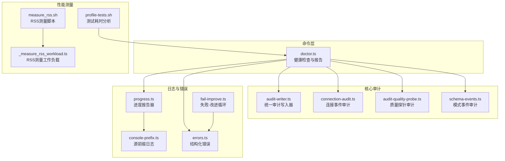

**图示来源**
- [src/commands/doctor.ts:1-800](file://src/commands/doctor.ts#L1-L800)
- [src/core/audit/audit-writer.ts:1-255](file://src/core/audit/audit-writer.ts#L1-L255)
- [src/core/audit-quality-probe.ts:64-98](file://src/core/audit-quality-probe.ts#L64-L98)
- [src/core/connection-audit.ts:67-104](file://src/core/connection-audit.ts#L67-L104)
- [src/core/schema-events.ts:1-31](file://src/core/schema-events.ts#L1-L31)
- [src/core/progress.ts:1-490](file://src/core/progress.ts#L1-L490)
- [src/core/console-prefix.ts:1-146](file://src/core/console-prefix.ts#L1-L146)
- [src/core/errors.ts:1-94](file://src/core/errors.ts#L1-L94)
- [src/core/fail-improve.ts:1-288](file://src/core/fail-improve.ts#L1-L288)
- [tests/heavy/_measure_rss_workload.ts:36-85](file://tests/heavy/_measure_rss_workload.ts#L36-L85)
- [tests/heavy/measure_rss.sh:25-64](file://tests/heavy/measure_rss.sh#L25-L64)
- [scripts/profile-tests.sh:1-47](file://scripts/profile-tests.sh#L1-L47)

**章节来源**
- [src/commands/doctor.ts:1-800](file://src/commands/doctor.ts#L1-L800)
- [src/core/audit/audit-writer.ts:1-255](file://src/core/audit/audit-writer.ts#L1-L255)
- [src/core/progress.ts:1-490](file://src/core/progress.ts#L1-L490)

## 核心组件
- 统一审计写入器：提供 featureName 驱动的 JSONL 审计文件生成，支持 ISO 周轮转、最佳努力写入、跨周读回
- doctor 健康检查：远程/本地 doctor 检查集聚合、健康评分与分类打分、修复建议与自动修复计划
- 连接审计：记录连接事件并尾读最近错误，辅助诊断路由与连接失败
- 质量探针审计：记录质量探针运行结果，供 doctor 的夜间健康度检查使用
- 进度报告器：多模式进度输出（TTY/纯文本/JSON/静默），支持心跳、信号处理与子阶段
- 源前缀日志：为并发同步场景提供每源前缀，确保日志可区分
- 结构化错误：统一错误封装与序列化，便于代理消费与人类阅读
- 失败-改进循环：确定性优先、LLM 回退，并记录失败以驱动规则改进
- RSS 测量：Linux 下通过 /proc/self/status 获取准确 RSS，非 Linux 平台回退至 process.memoryUsage().rss
- 测试耗时分析：从测试输出中提取耗时并排序，快速定位慢用例

**章节来源**
- [src/core/audit/audit-writer.ts:1-255](file://src/core/audit/audit-writer.ts#L1-L255)
- [src/commands/doctor.ts:166-195](file://src/commands/doctor.ts#L166-L195)
- [src/core/connection-audit.ts:67-104](file://src/core/connection-audit.ts#L67-L104)
- [src/core/audit-quality-probe.ts:64-98](file://src/core/audit-quality-probe.ts#L64-L98)
- [src/core/progress.ts:1-490](file://src/core/progress.ts#L1-L490)
- [src/core/console-prefix.ts:1-146](file://src/core/console-prefix.ts#L1-L146)
- [src/core/errors.ts:1-94](file://src/core/errors.ts#L1-L94)
- [src/core/fail-improve.ts:1-288](file://src/core/fail-improve.ts#L1-L288)
- [tests/heavy/_measure_rss_workload.ts:36-85](file://tests/heavy/_measure_rss_workload.ts#L36-L85)
- [scripts/profile-tests.sh:1-47](file://scripts/profile-tests.sh#L1-L47)

## 架构总览
下图展示 doctor 健康检查在不同部署形态下的数据流与审计集成。

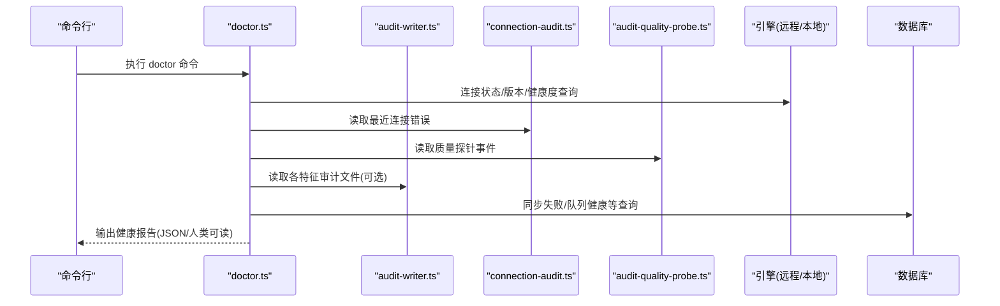

**图示来源**
- [src/commands/doctor.ts:467-800](file://src/commands/doctor.ts#L467-L800)
- [src/core/audit/audit-writer.ts:213-246](file://src/core/audit/audit-writer.ts#L213-L246)
- [src/core/connection-audit.ts:85-104](file://src/core/connection-audit.ts#L85-L104)
- [src/core/audit-quality-probe.ts:91-98](file://src/core/audit-quality-probe.ts#L91-L98)

## 详细组件分析

### doctor 健康检查与修复建议
- 报告结构：包含 schema_version、status、health_score、brain_checks_score、category_scores、checks、top_issues 等字段
- 分类与评分：按 brain/skill/ops/meta 分类，独立计算 penalty 得分；支持 top_issues 排序根因
- 修复建议：部分检查返回 remediation 步骤，支持 --remediation-plan 与 --remediate
- 远程 doctor：针对薄客户端/远程部署，聚焦连接、版本、脑健康、同步失败、队列健康等

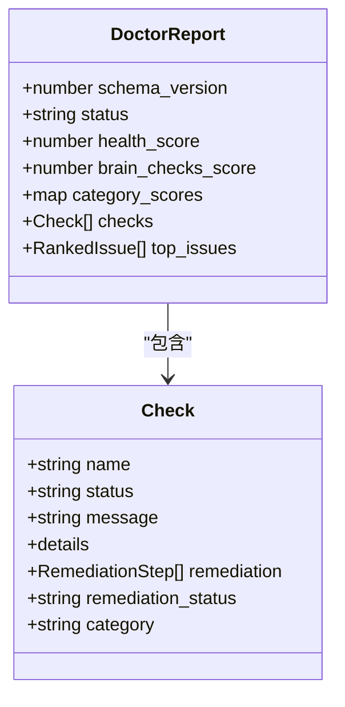

**图示来源**
- [src/commands/doctor.ts:55-141](file://src/commands/doctor.ts#L55-L141)

**章节来源**
- [src/commands/doctor.ts:166-195](file://src/commands/doctor.ts#L166-L195)
- [src/commands/doctor.ts:467-800](file://src/commands/doctor.ts#L467-L800)

### 统一审计写入器（audit-writer）
- 功能：为各特性提供统一 JSONL 审计写入与读回，文件名采用 ISO 周轮转策略
- 最佳努力：磁盘失败仅向 stderr 输出警告，不抛出异常
- 读回策略：当前周与上一周文件合并读取，保证跨周一窗口完整性
- 环境覆盖：支持 GBRAIN_AUDIT_DIR 覆盖默认审计目录

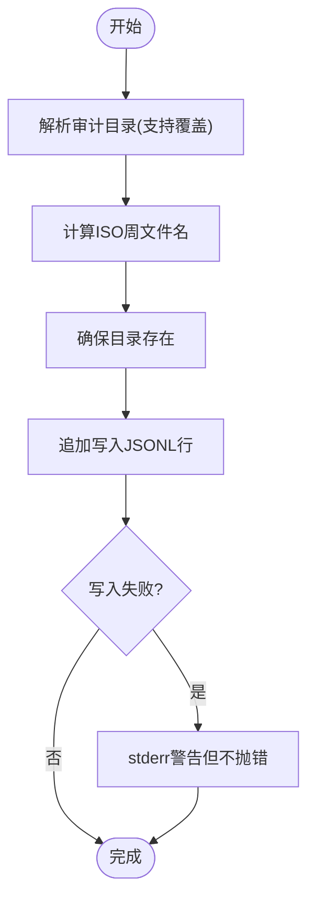

**图示来源**
- [src/core/audit/audit-writer.ts:174-254](file://src/core/audit/audit-writer.ts#L174-L254)

**章节来源**
- [src/core/audit/audit-writer.ts:1-255](file://src/core/audit/audit-writer.ts#L1-L255)

### 连接事件审计与最近错误尾读
- 记录连接事件并在审计目录按周存储
- 提供 tailRecentErrors(limit) 尾读最近 N 条 op='error' 的事件，用于 doctor 表面化最近连接路由失败

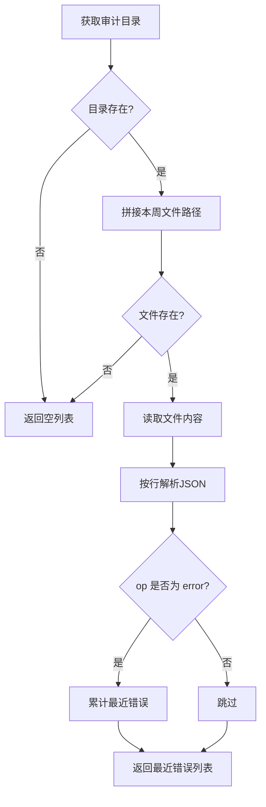

**图示来源**
- [src/core/connection-audit.ts:85-104](file://src/core/connection-audit.ts#L85-L104)

**章节来源**
- [src/core/connection-audit.ts:67-104](file://src/core/connection-audit.ts#L67-L104)

### 质量探针审计与夜间健康度
- 质量探针事件写入专用审计文件，包含 outcome、计数与估算成本等
- doctor 的夜间健康度检查会读取最近 N 天事件，统计 pass/fail/error/inconclusive/budget_exceeded/no_embedding_key/rate_limited 等桶

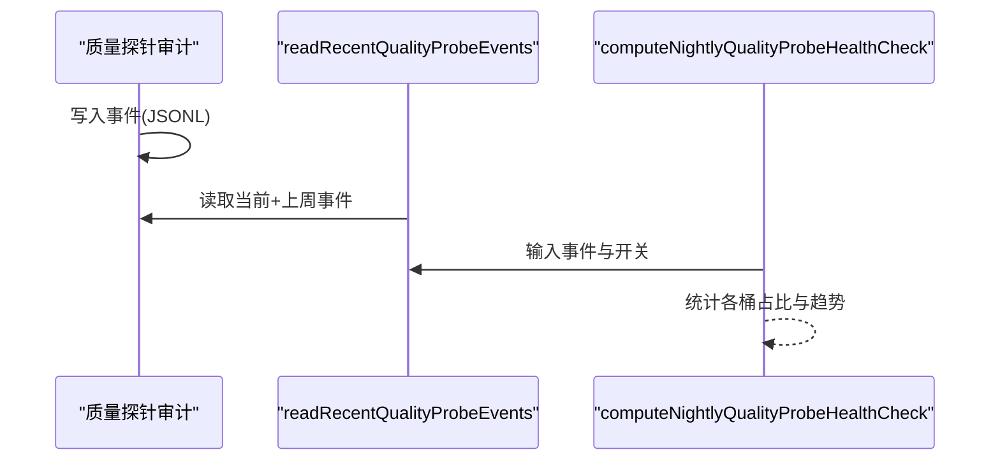

**图示来源**
- [src/core/audit-quality-probe.ts:64-98](file://src/core/audit-quality-probe.ts#L64-L98)
- [test/nightly-quality-probe.test.ts:230-359](file://test/nightly-quality-probe.test.ts#L230-L359)

**章节来源**
- [src/core/audit-quality-probe.ts:64-98](file://src/core/audit-quality-probe.ts#L64-L98)
- [test/nightly-quality-probe.test.ts:210-359](file://test/nightly-quality-probe.test.ts#L210-L359)

### 进度报告器与源前缀日志
- 进度报告器：支持 auto/human/json/quiet 模式，TTY 下使用 \r 重绘，JSON 模式输出 NDJSON 事件
- 信号处理：统一安装 SIGINT/SIGTERM 处理，向所有活跃阶段广播 abort 事件
- 源前缀日志：在并发同步场景为每源输出带前缀的日志，避免交错；slog/serr 在有前缀时自动加前缀

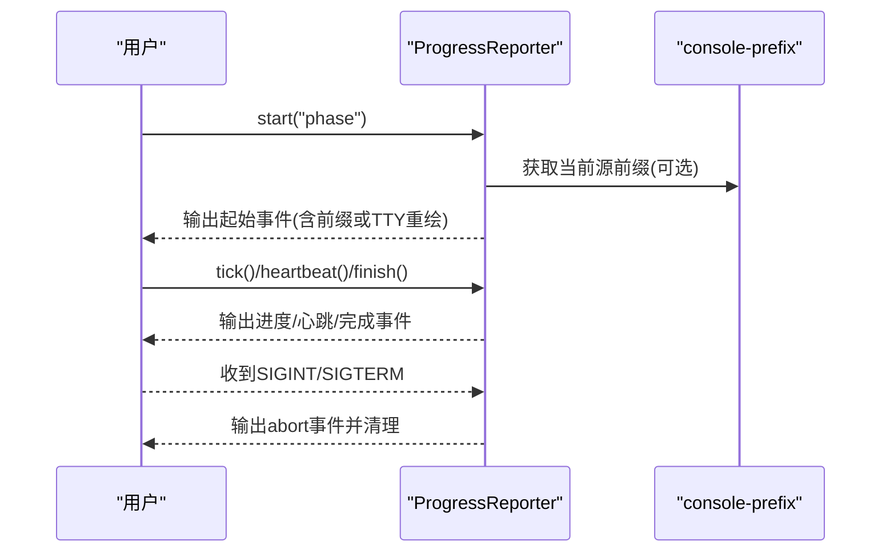

**图示来源**
- [src/core/progress.ts:236-400](file://src/core/progress.ts#L236-L400)
- [src/core/console-prefix.ts:65-108](file://src/core/console-prefix.ts#L65-L108)

**章节来源**
- [src/core/progress.ts:1-490](file://src/core/progress.ts#L1-L490)
- [src/core/console-prefix.ts:1-146](file://src/core/console-prefix.ts#L1-L146)

### 结构化错误与序列化
- 统一错误封装：class/code/message/hint/docs_url
- 序列化：StructuredAgentError 与通用错误序列化，便于代理消费与人类阅读

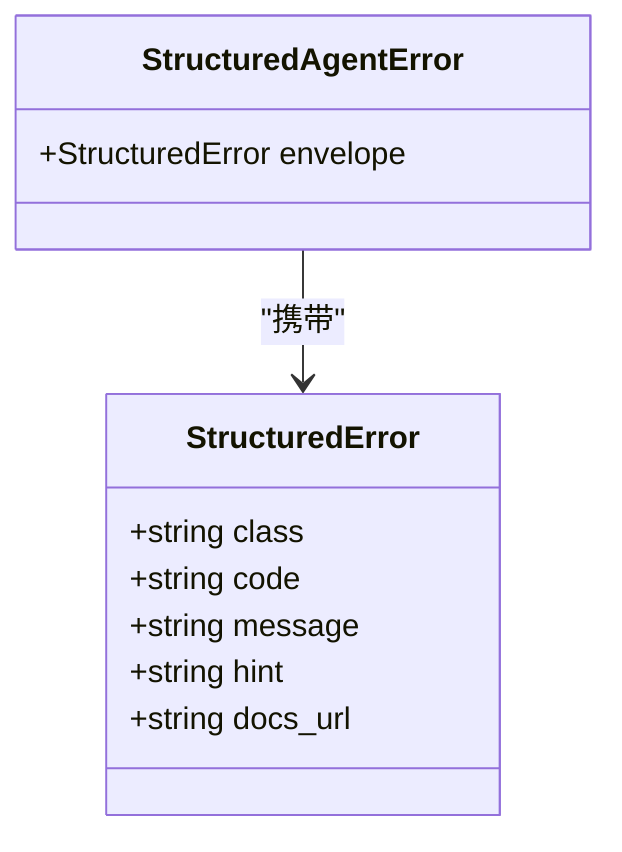

**图示来源**
- [src/core/errors.ts:13-64](file://src/core/errors.ts#L13-L64)

**章节来源**
- [src/core/errors.ts:1-94](file://src/core/errors.ts#L1-L94)

### 失败-改进循环（Deterministic First + LLM Fallback）
- 先尝试确定性逻辑，失败则回退到 LLM，记录不匹配项以驱动规则改进
- 统计命中率、失败模式分组、自动生成测试用例、记录改进

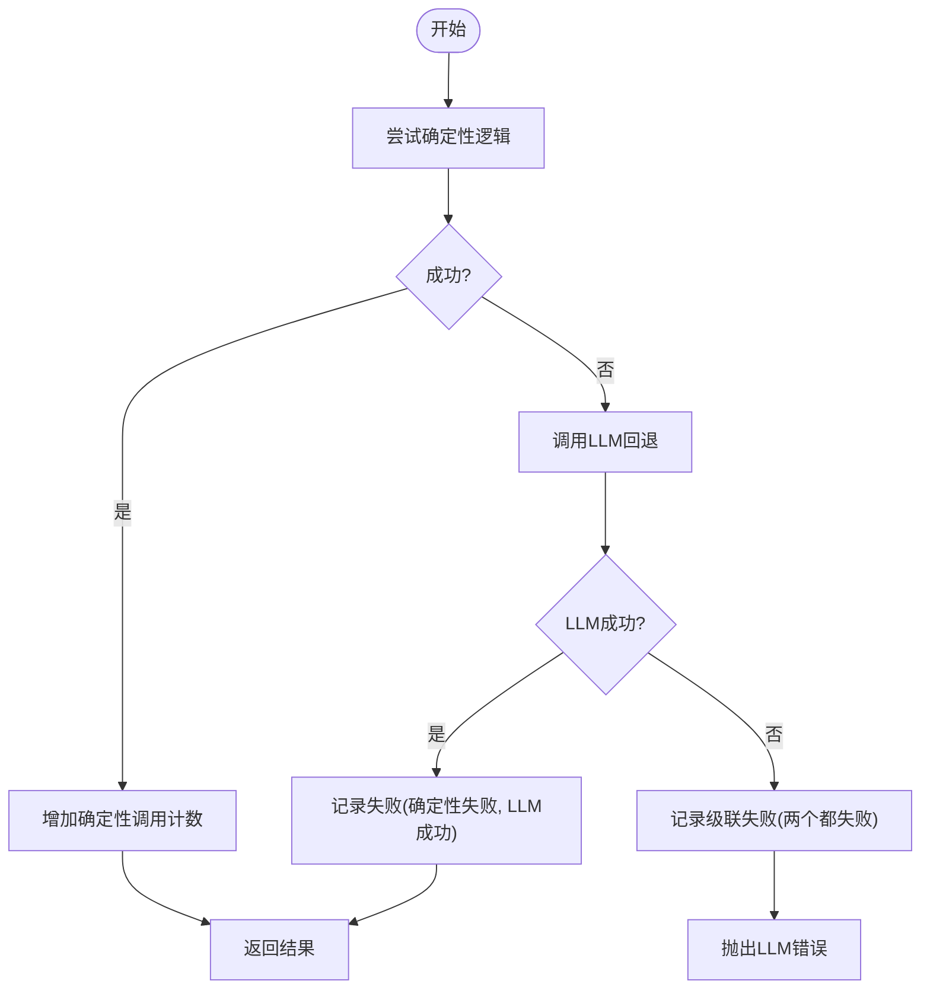

**图示来源**
- [src/core/fail-improve.ts:96-149](file://src/core/fail-improve.ts#L96-L149)

**章节来源**
- [src/core/fail-improve.ts:1-288](file://src/core/fail-improve.ts#L1-L288)

### 性能测量与内存峰值分析
- Linux：通过 /proc/self/status 解析 RssAnon/RssShmem 获取准确 RSS（kB）
- 非 Linux：回退到 process.memoryUsage().rss（字节）
- 工作负载：生成页面并执行查询，统计峰值 RSS、查询次数、耗时与页数
- 脚本：支持刷新基线、阈值比较、严格模式失败

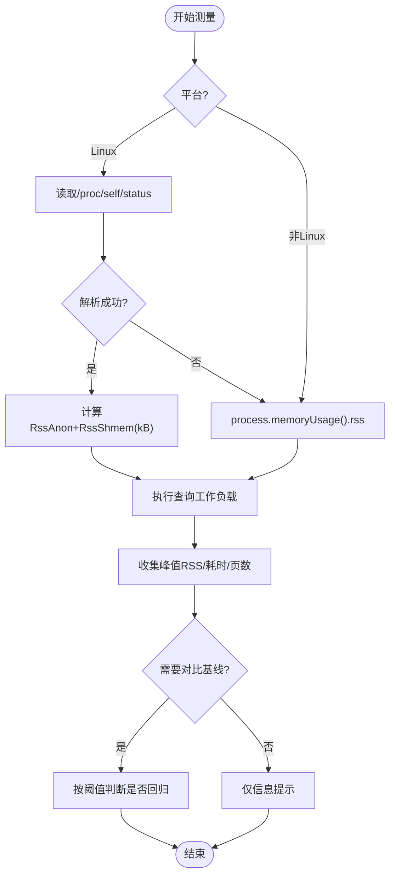

**图示来源**
- [tests/heavy/_measure_rss_workload.ts:36-85](file://tests/heavy/_measure_rss_workload.ts#L36-L85)
- [tests/heavy/measure_rss.sh:25-64](file://tests/heavy/measure_rss.sh#L25-L64)

**章节来源**
- [tests/heavy/_measure_rss_workload.ts:36-85](file://tests/heavy/_measure_rss_workload.ts#L36-L85)
- [tests/heavy/measure_rss.sh:108-131](file://tests/heavy/measure_rss.sh#L108-L131)

### 测试耗时分析脚本
- 从测试输出中提取最后一个 [Xms|Xs] 时间段，转换为毫秒并降序排序
- 支持 -n 参数指定输出前 N 慢用例

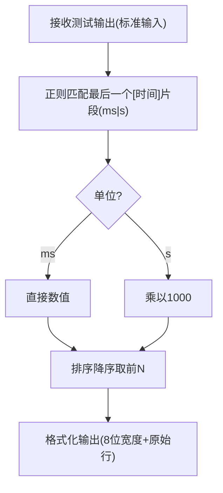

**图示来源**
- [scripts/profile-tests.sh:1-47](file://scripts/profile-tests.sh#L1-L47)

**章节来源**
- [scripts/profile-tests.sh:1-47](file://scripts/profile-tests.sh#L1-L47)

### doctor 进度事件解析与端到端验证
- doctor 在 --progress-json 模式下输出 NDJSON 事件（start/tick/heartbeat/finish/abort）
- 端到端测试解析 stderr 中的 JSONL 事件，断言 doctor.db_checks 等阶段的存在与 schema 正确性

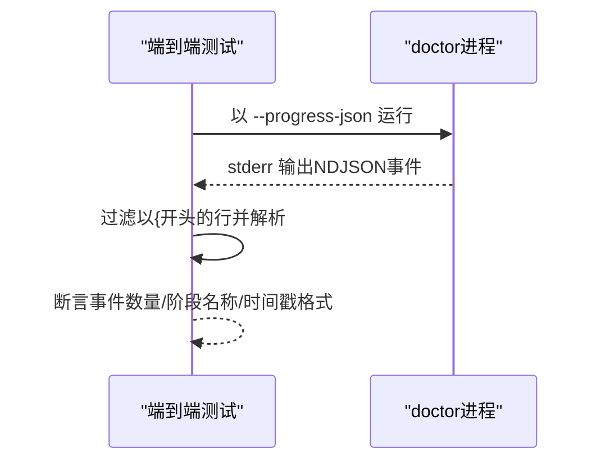

**图示来源**
- [test/e2e/doctor-progress.test.ts:38-117](file://test/e2e/doctor-progress.test.ts#L38-L117)

**章节来源**
- [test/e2e/doctor-progress.test.ts:38-117](file://test/e2e/doctor-progress.test.ts#L38-L117)

### doctor 自动修复与 rubric doctor
- 支持 --remediation-plan 生成修复计划，--remediate 实施修复（需确认）
- rubric doctor 场景：缺失评测文件/引导文档/License 等，可自动脚手架补齐

**章节来源**
- [test/skillpack-rubric-doctor.test.ts:276-306](file://test/skillpack-rubric-doctor.test.ts#L276-L306)
- [src/commands/doctor.ts:166-195](file://src/commands/doctor.ts#L166-L195)

### 模式事件审计（schema CLI 使用）
- 记录 schema CLI 的动词、结果与标志，隐私设计仅记录动词与时间戳，不包含用户内容
- 用于实验性遥测门与需求验证

**章节来源**
- [src/core/schema-events.ts:1-31](file://src/core/schema-events.ts#L1-L31)

### 代码参考与调试技巧（operations）
- 提供 code_blast 等操作用于变更影响面评估与符号引用分析，辅助调试与重构

**章节来源**
- [src/core/operations.ts:4188-4199](file://src/core/operations.ts#L4188-L4199)

## 依赖关系分析
- doctor.ts 依赖 progress.ts（进度）、errors.ts（错误）、audit-* 模块（审计）、engine（远程/本地查询）
- audit-writer.ts 作为底层基础设施被多个审计模块复用
- console-prefix.ts 与 progress.ts 协同，确保并发场景下日志可读性
- fail-improve.ts 与 errors.ts 协同，统一错误语义与失败记录

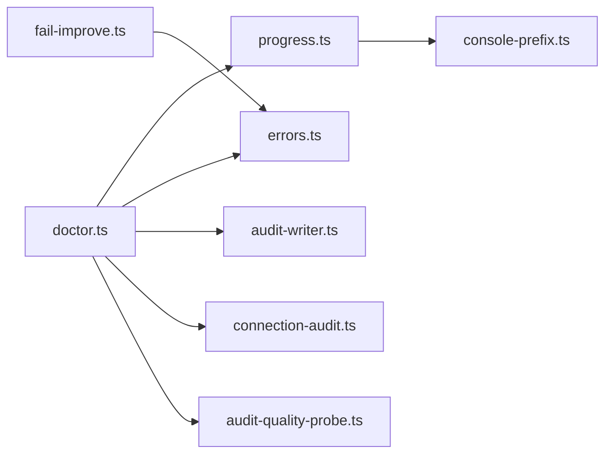

**图示来源**
- [src/commands/doctor.ts:1-800](file://src/commands/doctor.ts#L1-L800)
- [src/core/progress.ts:1-490](file://src/core/progress.ts#L1-L490)
- [src/core/console-prefix.ts:1-146](file://src/core/console-prefix.ts#L1-L146)
- [src/core/errors.ts:1-94](file://src/core/errors.ts#L1-L94)
- [src/core/fail-improve.ts:1-288](file://src/core/fail-improve.ts#L1-L288)
- [src/core/audit/audit-writer.ts:1-255](file://src/core/audit/audit-writer.ts#L1-L255)
- [src/core/connection-audit.ts:1-104](file://src/core/connection-audit.ts#L1-L104)
- [src/core/audit-quality-probe.ts:1-98](file://src/core/audit-quality-probe.ts#L1-L98)

**章节来源**
- [src/commands/doctor.ts:1-800](file://src/commands/doctor.ts#L1-L800)
- [src/core/progress.ts:1-490](file://src/core/progress.ts#L1-L490)

## 性能考量
- 进度报告器在 TTY 模式下使用 \r 重绘，减少输出开销；JSON 模式适合机器消费
- RSS 测量在 Linux 使用 /proc 精准采样，在非 Linux 回退到 process.memoryUsage().rss
- 测试耗时分析脚本单次扫描输出，避免重复解析
- doctor 的远程表面尽量使用纯 SQL 查询，避免子进程与网络阻塞

[本节为通用指导，无需特定文件来源]

## 故障排查指南
- 连接与路由失败：使用 tailRecentErrors 查看最近错误，doctor 会汇总并给出修复建议
- 同步失败：doctor 读取失败清单并决定严重级别，建议执行 ack 或重新同步
- 队列健康：Postgres 场景下检查长时间活动作业，必要时取消或重试
- 版本与迁移：检查 schema_version 与迁移状态，必要时执行 apply-migrations
- 资源压力：结合 RSS 测量与测试耗时分析，定位内存与 CPU 瓶颈
- 自动修复：doctor --remediation-plan 生成修复步骤，--remediate 实施（需确认）

**章节来源**
- [src/core/connection-audit.ts:85-104](file://src/core/connection-audit.ts#L85-L104)
- [src/commands/doctor.ts:467-800](file://src/commands/doctor.ts#L467-L800)
- [tests/heavy/measure_rss.sh:108-131](file://tests/heavy/measure_rss.sh#L108-L131)
- [scripts/profile-tests.sh:1-47](file://scripts/profile-tests.sh#L1-L47)

## 结论
GBrain 提供了完善的调试与性能分析能力：统一的审计写入器、结构化的错误封装、可读性强的进度输出、精确的内存测量与测试耗时分析。doctor 将这些能力整合为可操作的健康检查与修复建议，适用于本地与远程部署场景。通过合理使用这些工具与流程，可以高效定位问题、优化性能并提升系统稳定性。

[本节为总结，无需特定文件来源]

## 附录
- 环境变量
  - GBRAIN_AUDIT_DIR：覆盖审计目录，默认 ~/.gbrain/audit/
  - GBRAIN_WHOKNOWS_FIXTURE_PATH：指定 whoknows 评测夹具路径
  - 其他：如 GBRAIN_SYNC_FRESHNESS_FAIL_HOURS、GBRAIN_MAX_CONNECTIONS 等由 doctor 检查读取
- 输出模式
  - doctor --progress-json：输出 NDJSON 事件到 stderr
  - doctor --quiet：完全静默
  - doctor --json：输出检查数组到 stdout
- 常见审计文件位置
  - ~/.gbrain/audit/<feature>-YYYY-Www.jsonl（ISO 周轮转）

**章节来源**
- [src/core/audit/audit-writer.ts:61-65](file://src/core/audit/audit-writer.ts#L61-L65)
- [src/commands/doctor.ts:610-623](file://src/commands/doctor.ts#L610-L623)
- [src/core/schema-events.ts:1-31](file://src/core/schema-events.ts#L1-L31)