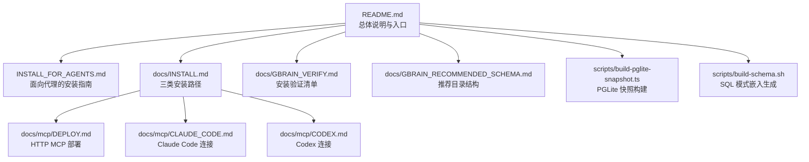
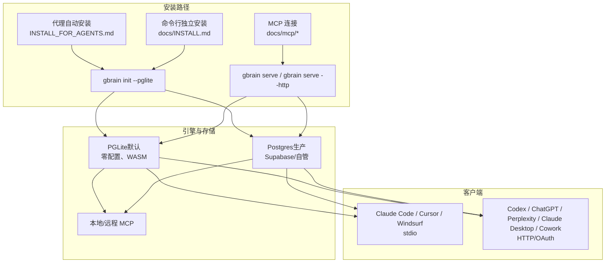
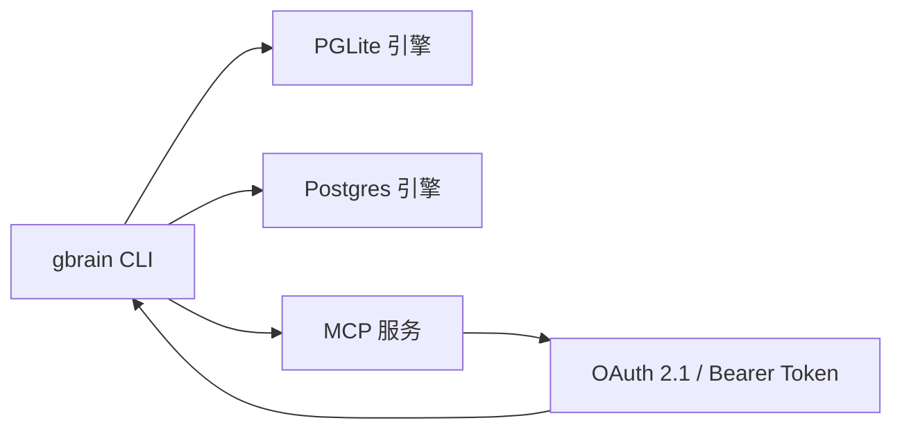

# 快速开始

<cite>
**本文引用的文件**
- [README.md](file://README.md)
- [INSTALL_FOR_AGENTS.md](file://INSTALL_FOR_AGENTS.md)
- [docs/INSTALL.md](file://docs/INSTALL.md)
- [docs/GBRAIN_VERIFY.md](file://docs/GBRAIN_VERIFY.md)
- [docs/GBRAIN_RECOMMENDED_SCHEMA.md](file://docs/GBRAIN_RECOMMENDED_SCHEMA.md)
- [docs/mcp/CLAUDE_CODE.md](file://docs/mcp/CLAUDE_CODE.md)
- [docs/mcp/CODEX.md](file://docs/mcp/CODEX.md)
- [docs/mcp/DEPLOY.md](file://docs/mcp/DEPLOY.md)
- [scripts/build-pglite-snapshot.ts](file://scripts/build-pglite-snapshot.ts)
- [scripts/build-schema.sh](file://scripts/build-schema.sh)
</cite>

## 目录
1. [简介](#简介)
2. [项目结构](#项目结构)
3. [核心组件](#核心组件)
4. [架构总览](#架构总览)
5. [详细组件分析](#详细组件分析)
6. [依赖分析](#依赖分析)
7. [性能考虑](#性能考虑)
8. [故障排除指南](#故障排除指南)
9. [结论](#结论)
10. [附录](#附录)

## 简介
本指南面向首次接触 GBrain 的用户，帮助你在约 30 分钟内完成从零到第一次查询的完整设置。你将掌握三条主要安装路径：
- 通过 AI 代理自动安装（推荐）
- 命令行独立安装
- MCP 协议连接

同时，我们将解释 PGLite 本地安装的“快速启动”与 Postgres 生产部署的完整流程，并提供验证清单、常见问题排查与最佳实践。

## 项目结构
为便于理解，以下图示展示与“快速开始”最相关的文档与脚本位置：

图表来源
- [README.md:1-443](file://README.md#L1-L443)
- [INSTALL_FOR_AGENTS.md:1-355](file://INSTALL_FOR_AGENTS.md#L1-L355)
- [docs/INSTALL.md:1-114](file://docs/INSTALL.md#L1-L114)
- [docs/mcp/DEPLOY.md:1-285](file://docs/mcp/DEPLOY.md#L1-L285)
- [docs/mcp/CLAUDE_CODE.md:1-91](file://docs/mcp/CLAUDE_CODE.md#L1-L91)
- [docs/mcp/CODEX.md:1-72](file://docs/mcp/CODEX.md#L1-L72)
- [docs/GBRAIN_VERIFY.md:1-296](file://docs/GBRAIN_VERIFY.md#L1-L296)
- [docs/GBRAIN_RECOMMENDED_SCHEMA.md:1-1014](file://docs/GBRAIN_RECOMMENDED_SCHEMA.md#L1-L1014)
- [scripts/build-pglite-snapshot.ts:1-65](file://scripts/build-pglite-snapshot.ts#L1-L65)
- [scripts/build-schema.sh:1-16](file://scripts/build-schema.sh#L1-L16)

章节来源
- [README.md:66-130](file://README.md#L66-L130)
- [docs/INSTALL.md:3-114](file://docs/INSTALL.md#L3-L114)

## 核心组件
- 安装路径
  - 代理自动安装：由你的 AI 代理平台（如 OpenClaw 或 Hermes）执行安装协议，自动完成初始化、技能装配、健康检查与端到端验证。
  - 命令行独立安装：使用 gbrain CLI 在本地或远程环境完成初始化、导入与索引、健康检查与可选的 MCP 连接。
  - MCP 协议连接：通过 HTTP/OAuth 或本地 stdio 将你的 AI 客户端（Claude Code、Codex、Cursor 等）接入 GBrain。
- 引擎与存储
  - PGLite（默认）：零配置、WASM 驱动的轻量数据库，适合个人与小规模团队；初始化仅需数秒。
  - Postgres（生产）：支持多源、多租户、细粒度权限与高并发；适用于公司级共享脑。
- 验证与运维
  - doctor 健康检查、模型连通性探测、同步覆盖率与嵌入覆盖率检查、知识图谱回填、JSONB 前言完整性修复等。

章节来源
- [README.md:18-19](file://README.md#L18-L19)
- [docs/INSTALL.md:5-21](file://docs/INSTALL.md#L5-L21)
- [docs/INSTALL.md:66-94](file://docs/INSTALL.md#L66-L94)
- [docs/GBRAIN_VERIFY.md:12-296](file://docs/GBRAIN_VERIFY.md#L12-L296)

## 架构总览
下图展示了三种安装路径与运行时交互关系：

图表来源
- [README.md:66-152](file://README.md#L66-L152)
- [docs/INSTALL.md:5-94](file://docs/INSTALL.md#L5-L94)
- [docs/mcp/DEPLOY.md:12-48](file://docs/mcp/DEPLOY.md#L12-L48)

## 详细组件分析

### 路径一：通过 AI 代理自动安装（推荐）
- 适用场景
  - 已有 OpenClaw 或 Hermes 平台，希望以最少的人工干预完成安装与验证。
- 前置条件
  - 已部署并可访问 OpenClaw/Hermes 平台。
  - 具备可用的 API 密钥（ZeroEntropy/OpenAI/Voyage/Anthropic）。
- 安装步骤
  - 在代理中拉取并执行安装协议文件。
  - 初始化本地脑（PGLite），执行健康检查。
  - 装配 43 个技能包，确认技能加载。
  - 配置搜索模式（保守/平衡/令牌上限），并进行端到端验证。
- 验证方法
  - 使用安装验证清单逐项检查：模式覆盖、同步覆盖率、嵌入覆盖率、脑优先检索协议、知识图谱回填、JSONB 前言完整性等。
- 预期输出
  - doctor 返回全部检查通过；技能列表可被客户端发现；端到端查询返回正确结果。

章节来源
- [README.md:70-87](file://README.md#L70-L87)
- [INSTALL_FOR_AGENTS.md:17-355](file://INSTALL_FOR_AGENTS.md#L17-L355)
- [docs/GBRAIN_VERIFY.md:12-296](file://docs/GBRAIN_VERIFY.md#L12-L296)

### 路径二：命令行独立安装
- 适用场景
  - 不依赖代理平台，直接在本地或远程服务器上运行。
- 前置条件
  - 系统已安装 Bun（TypeScript 运行时）。
  - 可用的 API 密钥（ZeroEntropy/OpenAI/Voyage/Anthropic）。
- 安装步骤
  - 全局安装 gbrain。
  - 初始化本地脑（PGLite），执行健康检查。
  - 可选：切换到 Postgres（Supabase/自管）。
  - 可选：将本地脑接入 MCP 客户端（Claude Code/Cursor/Codex）。
- 验证方法
  - doctor 健康检查；models 与 models doctor；同步覆盖率与嵌入覆盖率；端到端查询。
- 预期输出
  - doctor 返回绿色；同步后页面计数接近文件计数；嵌入覆盖率接近总数；查询返回最新修正内容。

章节来源
- [docs/INSTALL.md:22-56](file://docs/INSTALL.md#L22-L56)
- [docs/INSTALL.md:66-94](file://docs/INSTALL.md#L66-L94)
- [docs/GBRAIN_VERIFY.md:12-296](file://docs/GBRAIN_VERIFY.md#L12-L296)

### 路径三：MCP 协议连接
- 适用场景
  - 已有远程 GBrain 实例（HTTP/OAuth），需要将 Claude Code、Codex、Cursor、ChatGPT、Perplexity、Claude Desktop/Cowork 等客户端接入。
- 前置条件
  - 已运行 gbrain serve（stdio）或 gbrain serve --http（HTTP/OAuth）。
  - 已创建访问令牌或完成 OAuth 客户端注册。
- 安装步骤
  - 本地 stdio：在客户端机器上添加本地进程（无需服务器与隧道）。
  - 远程 HTTP：通过 gbrain connect 生成粘贴块或直接安装并进行令牌冒烟测试。
  - 手动配置：指定 URL 与授权头（Bearer/OAuth）。
- 验证方法
  - 在客户端发起查询，确认能返回来自 GBrain 的结果；若 list_skills 为空，检查主机侧 mcp.publish_skills 配置。
- 预期输出
  - 客户端能列出可用工具；查询返回带来源标注的答案；远端连接显示活动日志与仪表盘。

章节来源
- [README.md:131-152](file://README.md#L131-L152)
- [docs/mcp/CLAUDE_CODE.md:8-91](file://docs/mcp/CLAUDE_CODE.md#L8-L91)
- [docs/mcp/CODEX.md:8-72](file://docs/mcp/CODEX.md#L8-L72)
- [docs/mcp/DEPLOY.md:16-96](file://docs/mcp/DEPLOY.md#L16-L96)

### PGLite 本地安装（快速启动）
- 特点
  - 零配置、WASM 驱动，初始化仅需数秒。
  - 适合个人与小规模团队，无需 Docker 或外部数据库。
- 快速流程
  - 安装 gbrain → 初始化本地脑（PGLite）→ 健康检查 → 可选：接入本地 MCP 客户端。
- 性能与限制
  - 单写锁、无池化重试；大规模同步时建议停止 MCP 服务以避免竞争。

章节来源
- [README.md:18-19](file://README.md#L18-L19)
- [docs/INSTALL.md:22-31](file://docs/INSTALL.md#L22-L31)
- [docs/GBRAIN_VERIFY.md:377-399](file://docs/GBRAIN_VERIFY.md#L377-L399)

### Postgres 生产部署（完整流程）
- 适用场景
  - 多用户、多源、多机部署，需要细粒度权限控制与高可用。
- 关键步骤
  - 选择托管（Supabase）或自管 Postgres。
  - 启动 gbrain serve --http，启用内置 OAuth 2.1 与管理员仪表盘。
  - 注册 OAuth 客户端，配置作用域（read/write/admin），必要时启用 DCR。
  - 通过 ngrok/Tailscale/Fly.io/Railway 等暴露服务，确保 public-url 与绑定地址一致。
  - 客户端通过 bearer token 或 OAuth 授权接入。
- 安全与可观测性
  - 内置请求日志与 SSE 活动流；参数默认脱敏；支持按需开启完整参数记录。
  - 支持源级作用域（source-scoped clients）与联邦只读（federated-read）。

章节来源
- [docs/INSTALL.md:40-41](file://docs/INSTALL.md#L40-L41)
- [docs/mcp/DEPLOY.md:16-96](file://docs/mcp/DEPLOY.md#L16-L96)
- [docs/mcp/DEPLOY.md:152-175](file://docs/mcp/DEPLOY.md#L152-L175)
- [docs/mcp/DEPLOY.md:254-285](file://docs/mcp/DEPLOY.md#L254-L285)

### 安装验证清单（端到端）
- 模式与覆盖
  - doctor 检查：连接、pgvector、RLS、模式版本、嵌入覆盖率。
  - 搜索模式：确认用户选择（保守/平衡/令牌上限）。
- 同步与嵌入
  - 统计页数与嵌入数；必要时重新嵌入过期块。
  - 端到端测试：编辑脑页并推送，等待同步后搜索，应返回最新文本。
- 脑优先检索与知识图谱
  - 确认客户端先检索脑再调用外部 API；知识图谱链接与时间线非空。
- JSONB 前言完整性（Postgres）
  - 对 v0.12.2 之前的双编码问题进行修复并验证。

章节来源
- [docs/GBRAIN_VERIFY.md:12-296](file://docs/GBRAIN_VERIFY.md#L12-L296)

## 依赖分析
- 组件耦合
  - gbrain CLI 与两类引擎（PGLite/Postgres）通过统一的引擎接口对接，保证 CLI 与 MCP 服务的一致行为。
  - MCP 服务依赖内置 HTTP/OAuth 层，支持多客户端与细粒度作用域。
- 外部依赖
  - Bun（TypeScript 运行时）用于安装与运行。
  - 可选：ngrok/Tailscale/Fly.io/Railway 用于暴露远程服务。
  - 可选：Supabase 作为 Postgres 托管方案。
- 循环依赖
  - 未见循环依赖迹象；安装流程自顶向下推进，验证步骤独立。

图表来源
- [README.md:280-289](file://README.md#L280-L289)
- [docs/mcp/DEPLOY.md:12-48](file://docs/mcp/DEPLOY.md#L12-L48)

章节来源
- [README.md:280-289](file://README.md#L280-L289)
- [docs/mcp/DEPLOY.md:12-48](file://docs/mcp/DEPLOY.md#L12-L48)

## 性能考虑
- PGLite
  - 单写锁、无池化重试；大规模同步前建议停止 MCP 服务，避免写锁竞争。
  - 快速恢复：通过快照构建脚本生成预热数据，缩短冷启动时间。
- Postgres
  - 使用连接池与批量重试策略，提升吞吐与稳定性。
  - 建议使用 IPv4 可达的会话池器，避免直连 IPv6 限制导致的静默跳过。
- 查询与检索
  - 搜索模式影响上下文大小与成本；根据下游模型选择合适模式。
  - 嵌入覆盖率决定混合检索效果；缺失时可通过嵌入命令补齐。

章节来源
- [docs/GBRAIN_VERIFY.md:377-399](file://docs/GBRAIN_VERIFY.md#L377-L399)
- [scripts/build-pglite-snapshot.ts:1-65](file://scripts/build-pglite-snapshot.ts#L1-L65)
- [docs/INSTALL.md:33-38](file://docs/INSTALL.md#L33-L38)

## 故障排除指南
- 嵌入维度不匹配
  - 运行 doctor 自动诊断并打印修复命令；必要时在初始化阶段显式指定嵌入模型。
- 同步超时与挂起
  - 使用 per-source 循环 + timeout 策略；对长时间运行的导入任务采用优雅终止。
  - v0.41.19+ 对批量写入增加自愈重试；v0.41.27+ 修复断开连接后的自愈回调。
- 远端连接不可达
  - IPv4 主机上的直接连接为 IPv6-only，需改用会话池器或启用 IPv4 支持。
- OAuth 与令牌问题
  - 缺少认证头或无效令牌会导致错误；使用 auth list/test 检查；必要时重新注册客户端。
- 知识图谱未回填
  - 对于旧版脑，需手动回填链接与时间线；启用 basename 解析可提升裸维基链接解析率。

章节来源
- [README.md:290-354](file://README.md#L290-L354)
- [docs/GBRAIN_VERIFY.md:41-296](file://docs/GBRAIN_VERIFY.md#L41-L296)
- [docs/mcp/DEPLOY.md:254-285](file://docs/mcp/DEPLOY.md#L254-L285)

## 结论
通过以上三条路径，你可以快速完成 GBrain 的安装与验证。推荐优先使用代理自动安装以获得最短上手路径；若需要更灵活的控制，可选择命令行独立安装或 MCP 远程连接。无论选择哪种路径，都请遵循安装验证清单，确保同步、嵌入、检索与知识图谱均正常工作。对于生产环境，建议采用 Postgres + HTTP/OAuth 的组合，并结合监控与安全配置实现稳定可靠的长期运行。

## 附录
- 推荐目录结构
  - 参考“推荐目录结构”文档，建立 MECE 的知识域划分与解析器规则，确保文件归档与检索一致性。
- 技能与工作流
  - 安装后建议装配 43 个技能包，并将“信号检测”“脑操作”“约定”等核心技能纳入系统上下文。
- 常用命令参考
  - 初始化、健康检查、导入与嵌入、同步、查询、doctor、repair-jsonb、auth 管理等。

章节来源
- [docs/GBRAIN_RECOMMENDED_SCHEMA.md:107-154](file://docs/GBRAIN_RECOMMENDED_SCHEMA.md#L107-L154)
- [INSTALL_FOR_AGENTS.md:187-207](file://INSTALL_FOR_AGENTS.md#L187-L207)
- [docs/INSTALL.md:105-114](file://docs/INSTALL.md#L105-L114)