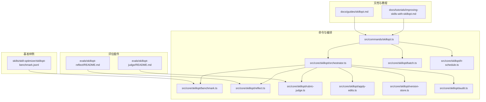
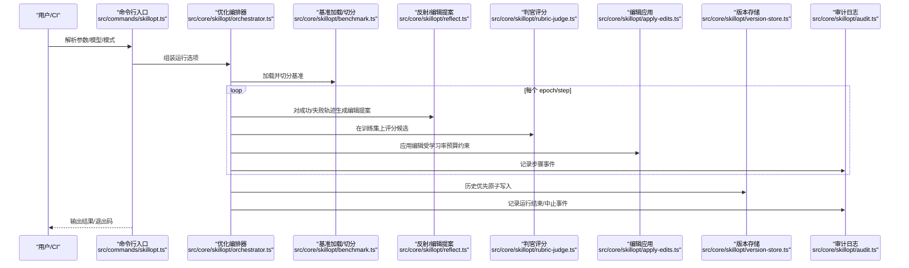
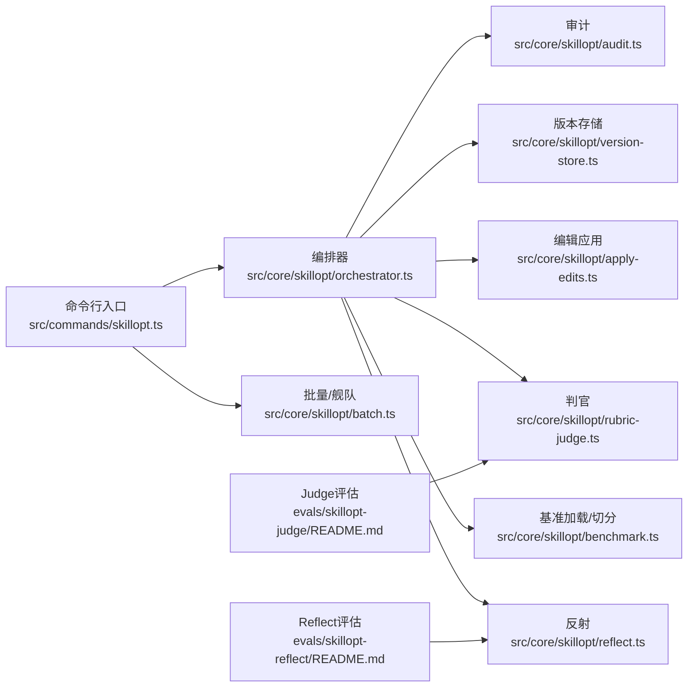
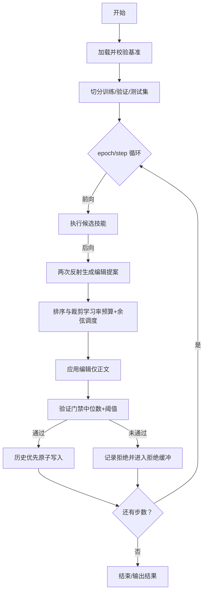

# 技能优化与评估

<cite>
**本文引用的文件**
- [docs/guides/skillopt.md](file://docs/guides/skillopt.md)
- [docs/tutorials/improving-skills-with-skillopt.md](file://docs/tutorials/improving-skills-with-skillopt.md)
- [evals/skillopt-judge/README.md](file://evals/skillopt-judge/README.md)
- [evals/skillopt-reflect/README.md](file://evals/skillopt-reflect/README.md)
- [skills/skill-optimizer/skillopt-benchmark.jsonl](file://skills/skill-optimizer/skillopt-benchmark.jsonl)
- [src/commands/skillopt.ts](file://src/commands/skillopt.ts)
- [src/core/skillopt/apply-edits.ts](file://src/core/skillopt/apply-edits.ts)
- [src/core/skillopt/audit.ts](file://src/core/skillopt/audit.ts)
- [src/core/skillopt/batch.ts](file://src/core/skillopt/batch.ts)
- [src/core/skillopt/benchmark.ts](file://src/core/skillopt/benchmark.ts)
- [src/core/skillopt/checkpoint.ts](file://src/core/skillopt/checkpoint.ts)
- [src/core/skillopt/cycle-phase.ts](file://src/core/skillopt/cycle-phase.ts)
- [src/core/skillopt/held-out.ts](file://src/core/skillopt/held-out.ts)
- [src/core/skillopt/lr-schedule.ts](file://src/core/skillopt/lr-schedule.ts)
- [src/core/skillopt/orchestrator.ts](file://src/core/skillopt/orchestrator.ts)
- [src/core/skillopt/reflect.ts](file://src/core/skillopt/reflect.ts)
- [src/core/skillopt/rubric-judge.ts](file://src/core/skillopt/rubric-judge.ts)
- [src/core/skillopt/types.ts](file://src/core/skillopt/types.ts)
- [src/core/skillopt/version-store.ts](file://src/core/skillopt/version-store.ts)
- [src/core/operations.ts](file://src/core/operations.ts)
- [test/skillopt/adversarial/concurrent-runs.serial.test.ts](file://test/skillopt/adversarial/concurrent-runs.serial.test.ts)
- [test/skillopt/lr-schedule.test.ts](file://test/skillopt/lr-schedule.test.ts)
</cite>

## 目录
1. [简介](#简介)
2. [项目结构](#项目结构)
3. [核心组件](#核心组件)
4. [架构总览](#架构总览)
5. [详细组件分析](#详细组件分析)
6. [依赖关系分析](#依赖关系分析)
7. [性能考量](#性能考量)
8. [故障排查指南](#故障排查指南)
9. [结论](#结论)
10. [附录](#附录)

## 简介
本文件系统性阐述“技能优化与评估”体系：基于 SkillOpt 的自我演进式技能优化流程，覆盖算法原理、优化循环、评估指标、架构设计、学习策略与收敛机制、评估框架与质量门禁、技能反射（Reflect）机制与自适应优化、优化效果监控、A/B 测试与回滚策略，以及优化配置与性能调优建议。目标是帮助读者从概念到落地全面掌握该能力。

## 项目结构
围绕技能优化与评估，仓库中与之直接相关的模块包括：
- 文档与教程：指导用户如何生成基准、运行优化、解读结果与安全守卫
- 评估套件：Judge 准确性评估与 Reflect 提示质量评估
- 核心实现：命令行入口、基准加载与切分、优化编排、编辑应用、审计日志、批处理与舰队模式、LR 调度、版本存储等
- 安全与并发：锁机制、只读沙箱、历史写入原子性等

图示来源
- [docs/guides/skillopt.md](file://docs/guides/skillopt.md)
- [docs/tutorials/improving-skills-with-skillopt.md](file://docs/tutorials/improving-skills-with-skillopt.md)
- [evals/skillopt-judge/README.md](file://evals/skillopt-judge/README.md)
- [evals/skillopt-reflect/README.md](file://evals/skillopt-reflect/README.md)
- [skills/skill-optimizer/skillopt-benchmark.jsonl](file://skills/skill-optimizer/skillopt-benchmark.jsonl)
- [src/commands/skillopt.ts](file://src/commands/skillopt.ts)
- [src/core/skillopt/orchestrator.ts](file://src/core/skillopt/orchestrator.ts)
- [src/core/skillopt/benchmark.ts](file://src/core/skillopt/benchmark.ts)
- [src/core/skillopt/reflect.ts](file://src/core/skillopt/reflect.ts)
- [src/core/skillopt/rubric-judge.ts](file://src/core/skillopt/rubric-judge.ts)
- [src/core/skillopt/apply-edits.ts](file://src/core/skillopt/apply-edits.ts)
- [src/core/skillopt/version-store.ts](file://src/core/skillopt/version-store.ts)
- [src/core/skillopt/audit.ts](file://src/core/skillopt/audit.ts)
- [src/core/skillopt/batch.ts](file://src/core/skillopt/batch.ts)
- [src/core/skillopt/lr-schedule.ts](file://src/core/skillopt/lr-schedule.ts)

章节来源
- [docs/guides/skillopt.md](file://docs/guides/skillopt.md)
- [docs/tutorials/improving-skills-with-skillopt.md](file://docs/tutorials/improving-skills-with-skillopt.md)
- [evals/skillopt-judge/README.md](file://evals/skillopt-judge/README.md)
- [evals/skillopt-reflect/README.md](file://evals/skillopt-reflect/README.md)
- [skills/skill-optimizer/skillopt-benchmark.jsonl](file://skills/skill-optimizer/skillopt-benchmark.jsonl)
- [src/commands/skillopt.ts](file://src/commands/skillopt.ts)

## 核心组件
- 命令行入口与参数解析：负责解析标志、模型选择、批量/舰队模式、后台提交、成本与运行时上限、是否允许内联或队列执行等
- 基准加载与切分：校验基准格式、唯一 ID、规则检查项、LLM/qrels 判定器形态；按比例稳定切分为训练/验证/测试三集，并强制最小验证集大小
- 优化编排器：驱动每步的前向（执行候选技能）、后向（两次反射提出编辑）、排序裁剪（在学习率预算内）、应用（仅修改正文，禁止前端数据变更）、验证门禁（中位数+阈值）、提交（历史优先原子写）
- 反射与评分：使用优化器模型对成功/失败轨迹进行反思，生成编辑建议；使用判官模型对候选输出打分
- 编辑应用：支持 add/replace/delete 三种编辑操作，严格锚点匹配、禁止代码块内修改、拒绝前端数据变更、支持批量并受学习率预算约束
- 版本与审计：版本快照、拒绝缓冲、审计事件（运行开始/步骤/编辑被拒/慢更新/运行结束/中止），并以 ISO 周轮转方式落盘
- 批量与舰队：跨技能批量运行与多目标模型对比，支持脑级预算控制与每技能预算控制
- 学习率调度：余弦/线性/常数衰减，随步数单调非增
- 远程操作与安全：远程调用白名单、路径限制、脏工作区拒绝、并发锁、只读沙箱、成本预检、历史写入原子化

章节来源
- [src/commands/skillopt.ts](file://src/commands/skillopt.ts)
- [src/core/skillopt/benchmark.ts](file://src/core/skillopt/benchmark.ts)
- [src/core/skillopt/orchestrator.ts](file://src/core/skillopt/orchestrator.ts)
- [src/core/skillopt/reflect.ts](file://src/core/skillopt/reflect.ts)
- [src/core/skillopt/rubric-judge.ts](file://src/core/skillopt/rubric-judge.ts)
- [src/core/skillopt/apply-edits.ts](file://src/core/skillopt/apply-edits.ts)
- [src/core/skillopt/version-store.ts](file://src/core/skillopt/version-store.ts)
- [src/core/skillopt/audit.ts](file://src/core/skillopt/audit.ts)
- [src/core/skillopt/batch.ts](file://src/core/skillopt/batch.ts)
- [src/core/skillopt/lr-schedule.ts](file://src/core/skillopt/lr-schedule.ts)

## 架构总览
SkillOpt 的整体流程由“基准驱动 + 循环优化 + 多层门禁”构成。下图展示端到端的数据流与组件交互：

图示来源
- [src/commands/skillopt.ts](file://src/commands/skillopt.ts)
- [src/core/skillopt/orchestrator.ts](file://src/core/skillopt/orchestrator.ts)
- [src/core/skillopt/benchmark.ts](file://src/core/skillopt/benchmark.ts)
- [src/core/skillopt/reflect.ts](file://src/core/skillopt/reflect.ts)
- [src/core/skillopt/rubric-judge.ts](file://src/core/skillopt/rubric-judge.ts)
- [src/core/skillopt/apply-edits.ts](file://src/core/skillopt/apply-edits.ts)
- [src/core/skillopt/version-store.ts](file://src/core/skillopt/version-store.ts)
- [src/core/skillopt/audit.ts](file://src/core/skillopt/audit.ts)

## 详细组件分析

### 命令行与运行模式
- 支持单技能优化、批量优化（--all）、多目标模型舰队模式（--target-models）、后台提交（--background）、干跑（--dry-run）等
- 远程调用时对技能名与路径进行白名单与路径约束校验，防止越权访问
- 成本与运行时上限预检，避免中途超支

章节来源
- [src/commands/skillopt.ts](file://src/commands/skillopt.ts)
- [src/core/operations.ts](file://src/core/operations.ts)

### 基准加载与切分
- 格式校验：任务唯一 ID、任务描述、判官类型与字段
- 规则判官支持多种算子（包含/正则/段落存在/字符上限/引用计数/工具调用等）
- 切分策略：按比例稳定排序切分，强制验证集最小规模，否则拒绝运行
- 引导式基准需人工审阅后方可继续

章节来源
- [src/core/skillopt/benchmark.ts](file://src/core/skillopt/benchmark.ts)
- [evals/skillopt-judge/README.md](file://evals/skillopt-judge/README.md)

### 优化编排器与学习策略
- 循环步骤：前向（执行候选技能）、后向（两次反射提案）、排序裁剪（学习率预算+余弦衰减）、应用（仅正文）、验证门禁（中位数+阈值）、提交（历史优先原子写）
- 学习率调度：默认余弦退火，单调非增；线性/常数可选
- 慢更新：每个 epoch 无改进时触发一次元编辑提议（后续审计事件）

章节来源
- [src/core/skillopt/orchestrator.ts](file://src/core/skillopt/orchestrator.ts)
- [src/core/skillopt/lr-schedule.ts](file://src/core/skillopt/lr-schedule.ts)
- [docs/guides/skillopt.md](file://docs/guides/skillopt.md)

### 技能反射（Reflect）机制与自适应优化
- 双向轨迹：对“成功+失败”两类轨迹分别进行反思，生成编辑形状（锚点+操作），提升针对性
- 形状约束：不求字面一致，而是通过操作类型与锚点片段匹配，容忍 LLM 的自然语言差异
- 评估：通过评估套件计算命中率，作为提示质量的客观指标

章节来源
- [src/core/skillopt/reflect.ts](file://src/core/skillopt/reflect.ts)
- [evals/skillopt-reflect/README.md](file://evals/skillopt-reflect/README.md)

### 编辑应用与收敛机制
- 三种编辑操作：add/replace/delete，均要求锚点唯一且不在代码块内
- 正文隔离：仅允许修改正文，禁止前端数据（如 triggers、brain_first 等）变更
- 批量应用：按学习率预算顺序尝试，超出预算的编辑被静默丢弃
- 原子写入：通过临时文件+同步重命名保证崩溃安全

章节来源
- [src/core/skillopt/apply-edits.ts](file://src/core/skillopt/apply-edits.ts)
- [src/core/skillopt/version-store.ts](file://src/core/skillopt/version-store.ts)

### 验证门禁与质量门禁
- 验证门禁：对每个验证任务重复评测三次取中位数，仅当显著优于当前最佳（阈值）才接受
- 其他门禁：禁止前端变更、并发锁、只读沙箱、捆绑技能需显式允许+独立验证集、引导式基准需人工审阅、脏工作区拒绝、成本预检、历史写入原子化

章节来源
- [docs/guides/skillopt.md](file://docs/guides/skillopt.md)
- [src/core/skillopt/apply-edits.ts](file://src/core/skillopt/apply-edits.ts)
- [src/core/skillopt/held-out.ts](file://src/core/skillopt/held-out.ts)

### 评估框架与指标
- Judge 评估：以人类标注为金标准，计算绝对误差（MAE），用于衡量判官一致性
- Reflect 评估：以期望编辑形状为参考，统计命中率，用于衡量反思提示质量
- 基准样例：内置技能优化器自身的基准，覆盖关键行为与安全守卫

章节来源
- [evals/skillopt-judge/README.md](file://evals/skillopt-judge/README.md)
- [evals/skillopt-reflect/README.md](file://evals/skillopt-reflect/README.md)
- [skills/skill-optimizer/skillopt-benchmark.jsonl](file://skills/skill-optimizer/skillopt-benchmark.jsonl)

### 并发控制与安全
- 并发锁：按技能粒度的数据库锁，避免两个实例同时写历史/版本
- 脏工作区拒绝：防止覆盖未提交更改
- 远程调用白名单：限制可操作技能范围

章节来源
- [test/skillopt/adversarial/concurrent-runs.serial.test.ts](file://test/skillopt/adversarial/concurrent-runs.serial.test.ts)
- [src/core/operations.ts](file://src/core/operations.ts)

### 批量与舰队模式
- --all：遍历所有带基准的技能，按脑级预算与每技能预算顺序运行
- --target-models：对同一技能在多个目标模型上并行运行，输出各模型的收据供择优

章节来源
- [src/core/skillopt/batch.ts](file://src/core/skillopt/batch.ts)
- [src/commands/skillopt.ts](file://src/commands/skillopt.ts)

### 学习率调度单元测试
- 余弦/线性/常数调度的单调性与边界行为通过纯函数测试验证

章节来源
- [test/skillopt/lr-schedule.test.ts](file://test/skillopt/lr-schedule.test.ts)

## 依赖关系分析
- 命令行入口依赖模型解析、基准加载、编排器与批处理模块
- 编排器依赖基准、反射、判官、编辑应用、版本存储与审计
- 评估套件依赖判官评分与反射模块
- 安全与并发控制贯穿于加载、应用与提交阶段

图示来源
- [src/commands/skillopt.ts](file://src/commands/skillopt.ts)
- [src/core/skillopt/orchestrator.ts](file://src/core/skillopt/orchestrator.ts)
- [src/core/skillopt/benchmark.ts](file://src/core/skillopt/benchmark.ts)
- [src/core/skillopt/reflect.ts](file://src/core/skillopt/reflect.ts)
- [src/core/skillopt/rubric-judge.ts](file://src/core/skillopt/rubric-judge.ts)
- [src/core/skillopt/apply-edits.ts](file://src/core/skillopt/apply-edits.ts)
- [src/core/skillopt/version-store.ts](file://src/core/skillopt/version-store.ts)
- [src/core/skillopt/audit.ts](file://src/core/skillopt/audit.ts)
- [evals/skillopt-judge/README.md](file://evals/skillopt-judge/README.md)
- [evals/skillopt-reflect/README.md](file://evals/skillopt-reflect/README.md)

## 性能考量
- 成本控制：预检成本上限，Dry-run 估算；默认约 0.7–1.0 美元/次（取决于基准规模）
- 计算开销：主要来自反射与判官调用，可通过减少批次大小、学习率预算与选择更经济的模型降低
- I/O 与原子写：版本存储采用原子写，避免部分写导致的崩溃风险
- 并发与锁：按技能粒度锁避免冲突，但会序列化同技能的多次运行

章节来源
- [docs/guides/skillopt.md](file://docs/guides/skillopt.md)
- [src/core/skillopt/apply-edits.ts](file://src/core/skillopt/apply-edits.ts)
- [src/core/skillopt/version-store.ts](file://src/core/skillopt/version-store.ts)

## 故障排查指南
- 常见中止原因：预算耗尽、运行时超限、脏工作区、锁忙、引导式基准未审阅、捆绑技能未显式允许+独立验证集、验证集过小
- 审计日志：运行开始/步骤/编辑被拒/慢更新/运行结束/中止事件，按 ISO 周轮转记录
- 单元测试参考：并发运行冲突、学习率调度行为

章节来源
- [src/core/skillopt/audit.ts](file://src/core/skillopt/audit.ts)
- [test/skillopt/adversarial/concurrent-runs.serial.test.ts](file://test/skillopt/adversarial/concurrent-runs.serial.test.ts)
- [test/skillopt/lr-schedule.test.ts](file://test/skillopt/lr-schedule.test.ts)

## 结论
SkillOpt 将“技能正文”作为可训练参数，通过基准驱动的自我优化闭环，在严格的门禁与审计保障下实现稳健迭代。其双轨反射、中位数验证门禁、学习率预算与原子提交等机制共同确保了优化过程的可控性与可追溯性。结合评估套件与批量/舰队模式，系统既适合个人技能优化，也能支撑规模化与多模型对比场景。

## 附录

### 优化流程与收敛机制（流程图）

图示来源
- [src/core/skillopt/benchmark.ts](file://src/core/skillopt/benchmark.ts)
- [src/core/skillopt/orchestrator.ts](file://src/core/skillopt/orchestrator.ts)
- [src/core/skillopt/reflect.ts](file://src/core/skillopt/reflect.ts)
- [src/core/skillopt/apply-edits.ts](file://src/core/skillopt/apply-edits.ts)
- [src/core/skillopt/version-store.ts](file://src/core/skillopt/version-store.ts)

### A/B 测试与回滚策略
- A/B：通过舰队模式对同一技能在不同目标模型上运行，比较验证分数与成本，择优复制最佳版本
- 回滚：版本存储保留历史快照，可随时检出任意版本；审计日志记录每次变更意图与结果

章节来源
- [src/core/skillopt/batch.ts](file://src/core/skillopt/batch.ts)
- [src/core/skillopt/version-store.ts](file://src/core/skillopt/version-store.ts)
- [src/core/skillopt/audit.ts](file://src/core/skillopt/audit.ts)

### 优化配置与性能调优建议
- 基准规模：验证集至少 5 个样本；默认 4:1:5 分割，建议起步使用 1:1:1 以满足最小验证集
- 学习率预算：根据技能复杂度与基准规模调整；默认余弦调度，必要时可切换线性/常数
- 成本上限：通过 --max-cost-usd 控制；Dry-run 预估后再执行真实运行
- 模型选择：优化器模型用于反思与编辑提案，判官模型用于评分，目标模型用于执行；可根据成本与质量平衡选择
- 批量与舰队：--all 与 --target-models 适合规模化与多模型对比；注意脑级预算与每技能预算

章节来源
- [docs/guides/skillopt.md](file://docs/guides/skillopt.md)
- [src/commands/skillopt.ts](file://src/commands/skillopt.ts)
- [src/core/skillopt/lr-schedule.ts](file://src/core/skillopt/lr-schedule.ts)