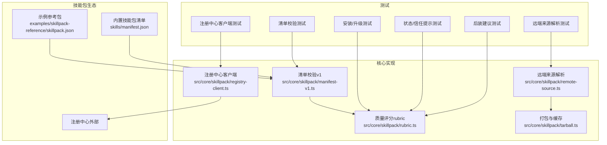
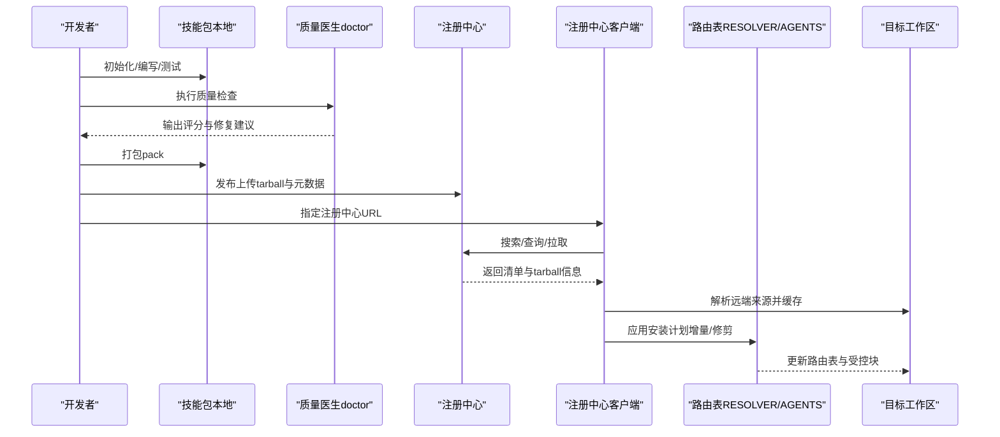
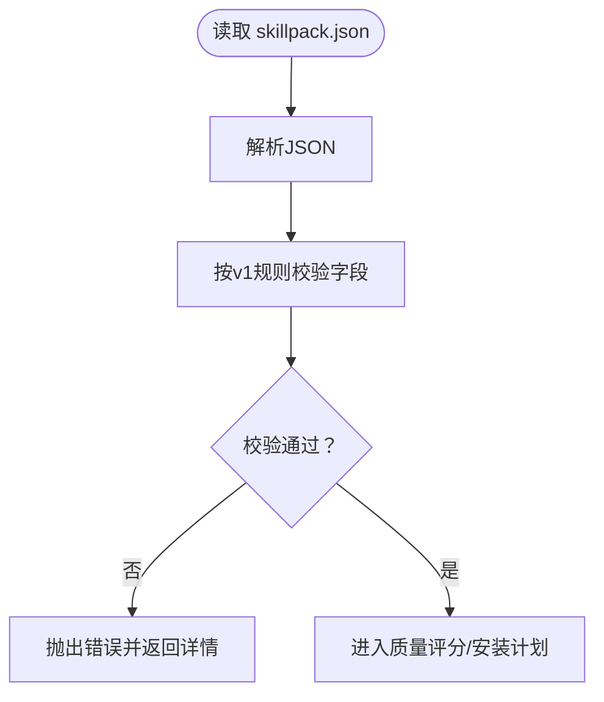
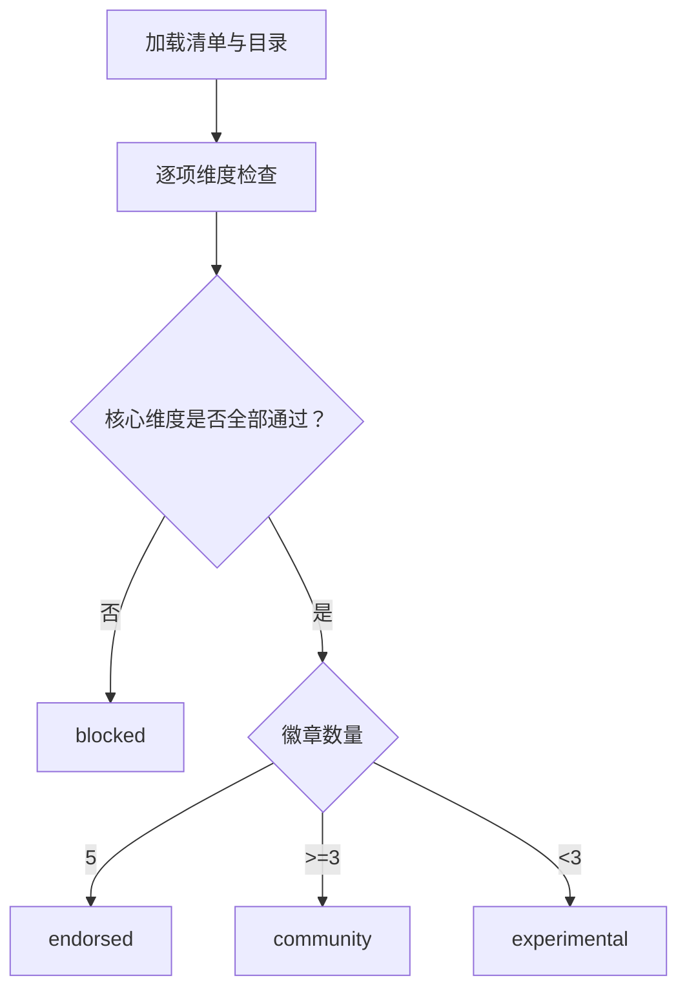
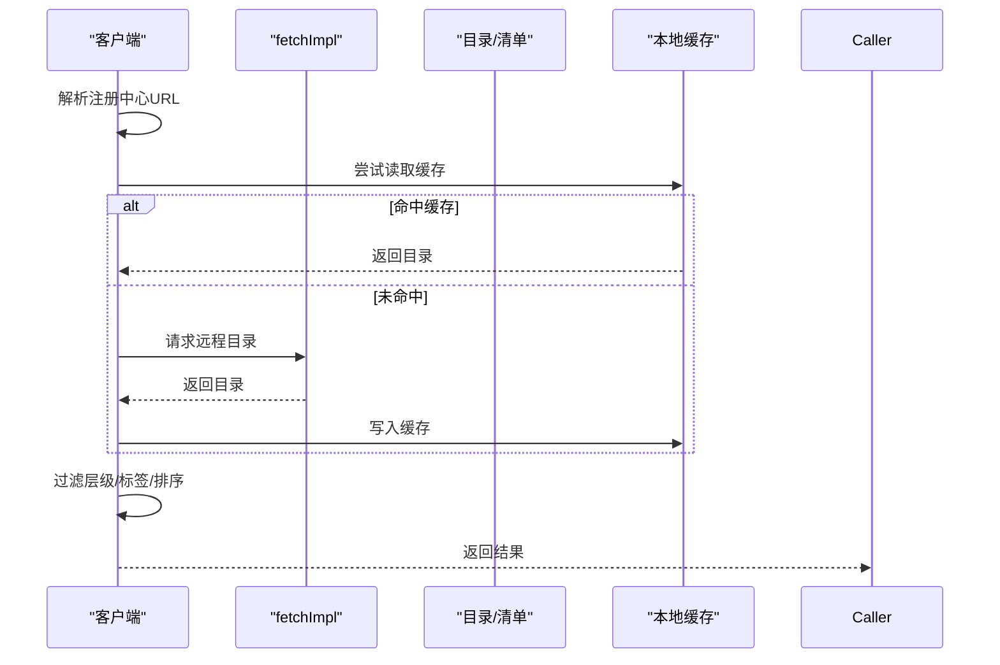
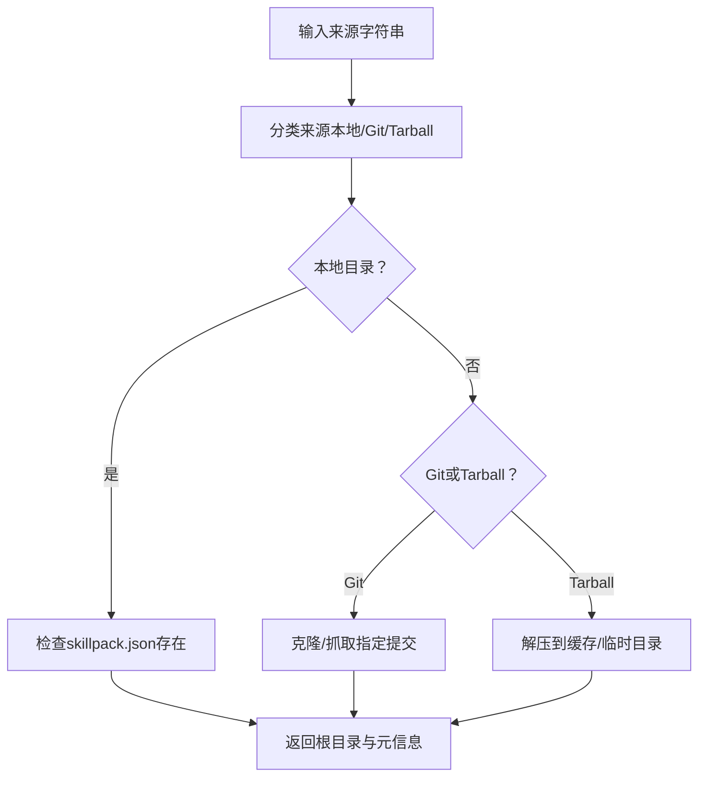
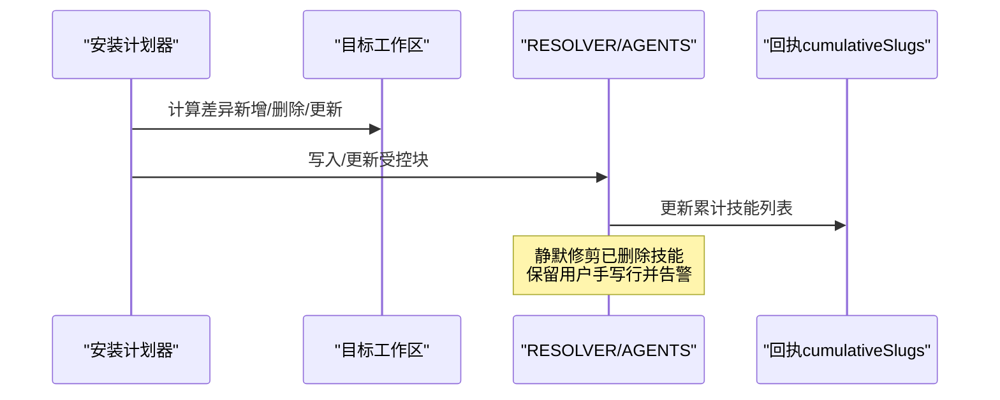
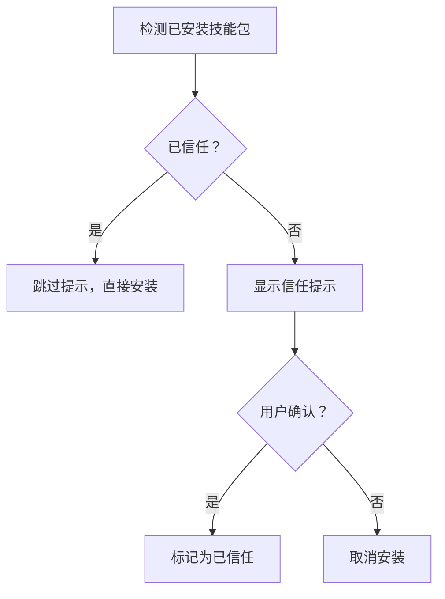
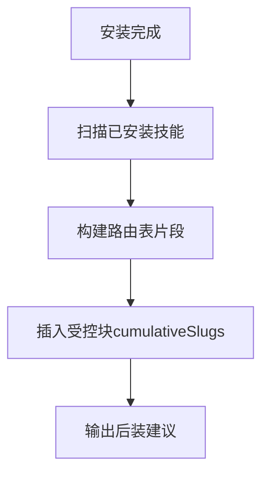
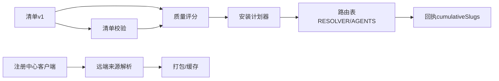

# 技能包管理

<cite>
**本文引用的文件**
- [README.md](file://README.md)
- [GBRAIN_SKILLPACK.md](file://docs/GBRAIN_SKILLPACK.md)
- [skillpack-anatomy.md](file://docs/skillpack-anatomy.md)
- [skillpack.json（示例参考包）](file://examples/skillpack-reference/skillpack.json)
- [技能清单（内置技能包）](file://skills/manifest.json)
- [rubric.ts（技能包质量评分体系）](file://src/core/skillpack/rubric.ts)
- [技能包清单校验（v1）](file://test/skillpack-manifest-v1.test.ts)
- [技能包安装与升级测试](file://test/skillpack-install.test.ts)
- [技能包状态与信任提示测试](file://test/skillpack-state.test.ts)
- [技能包注册表客户端测试](file://test/skillpack-registry-client.test.ts)
- [技能包远端来源解析测试](file://test/skillpack-remote-source.test.ts)
- [技能包后装建议测试](file://test/post-install-advisory.test.ts)
</cite>

## 目录
1. [简介](#简介)
2. [项目结构](#项目结构)
3. [核心组件](#核心组件)
4. [架构总览](#架构总览)
5. [详细组件分析](#详细组件分析)
6. [依赖关系分析](#依赖关系分析)
7. [性能考量](#性能考量)
8. [故障排除指南](#故障排除指南)
9. [结论](#结论)
10. [附录](#附录)

## 简介
本文件系统化阐述 GBrain 技能包（SkillPack）管理机制，覆盖概念、结构、版本与清单格式、安装/升级/卸载流程、依赖管理、注册中心与缓存策略、开发-测试-发布工作流，以及故障排除与兼容性检查。技能包是可插拔的“技能集合”，通过统一的清单（manifest-v1）描述元数据、技能列表、运行时依赖与测试/评估配置；由注册中心分发，支持本地缓存与离线使用；通过严格的评分体系保障质量与安全。

## 项目结构
- 技能包骨架与参考实现位于 examples/skillpack-reference，包含 skillpack.json、skills/*、runbooks、test/e2e/evals 等标准目录。
- 内置技能包清单（skills/manifest.json）定义了平台内置技能集合及其元信息。
- 核心能力由 src/core/skillpack 下的模块提供：清单校验、质量评分、注册中心交互、远端来源解析、打包与缓存等。
- 测试覆盖清单校验、安装/升级行为、注册中心与远端来源解析、状态与信任提示、后装建议等场景。

**图示来源**
- [skillpack-anatomy.md:1-113](file://docs/skillpack-anatomy.md#L1-L113)
- [skills/manifest.json:1-281](file://skills/manifest.json#L1-L281)
- [rubric.ts:1-512](file://src/core/skillpack/rubric.ts#L1-L512)

**章节来源**
- [README.md:1-443](file://README.md#L1-L443)
- [GBRAIN_SKILLPACK.md:1-144](file://docs/GBRAIN_SKILLPACK.md#L1-L144)
- [skillpack-anatomy.md:1-113](file://docs/skillpack-anatomy.md#L1-L113)

## 核心组件
- 清单（manifest-v1）：描述技能包元数据、技能路径、运行时依赖、测试/评估/手册等字段，并进行严格校验。
- 质量评分（Rubric）：以10维维度对第三方技能包进行评分，分为“核心必过”和“质量徽章”，决定发布层级（endorsed/community/experimental/blocked）。
- 注册中心与客户端：支持搜索、查询、拉取与缓存策略，提供默认与自定义注册中心地址。
- 远端来源解析：支持本地目录、Git URL、Tarball 等多种来源，自动缓存与命中。
- 安装/升级/卸载：在目标工作区生成受控路由表（RESOLVER/AGENTS），支持增量安装、静默修剪与后装建议。
- 开发-测试-发布：脚手架初始化、质量医生（doctor）、打包（pack）与发布流程。

**章节来源**
- [rubric.ts:66-494](file://src/core/skillpack/rubric.ts#L66-L494)
- [skillpack-anatomy.md:92-113](file://docs/skillpack-anatomy.md#L92-L113)
- [skills/manifest.json:268-281](file://skills/manifest.json#L268-L281)

## 架构总览
技能包生命周期从“开发与质量评估”到“注册中心分发”再到“消费者安装/升级/卸载”，贯穿清单校验、质量评分、注册中心交互、远端来源解析与安装应用。

**图示来源**
- [rubric.ts:449-494](file://src/core/skillpack/rubric.ts#L449-L494)
- [skillpack-anatomy.md:92-113](file://docs/skillpack-anatomy.md#L92-L113)
- [skillpack.json（示例参考包）:1-30](file://examples/skillpack-reference/skillpack.json#L1-L30)

## 详细组件分析

### 组件A：技能包清单（manifest-v1）
- 字段范围：api_version、name、version、description、author、license、homepage、gbrain_min_version、skills、runbooks、changelog、unit_tests、e2e_tests、llm_evals、dependencies、schema版本字段等。
- 校验规则：必填字段、命名规范（如名称为小写连字符）、语义化版本、URL合法性、schema版本上限、额外字段前向兼容等。
- 用途：驱动质量评分、安装计划、注册中心索引与展示。

**图示来源**
- [skillpack-manifest-v1.test.ts:37-440](file://test/skillpack-manifest-v1.test.ts#L37-L440)

**章节来源**
- [skillpack-anatomy.md:10-35](file://docs/skillpack-anatomy.md#L10-L35)
- [skillpack.json（示例参考包）:1-30](file://examples/skillpack-reference/skillpack.json#L1-L30)
- [skills/manifest.json:268-281](file://skills/manifest.json#L268-L281)

### 组件B：质量评分（Rubric）与发布层级
- 核心维度（必过）：清单有效、每个技能有合法 SKILL.md、每个技能有≥5条路由评估、技能触发短语唯一、变更日志存在且包含当前版本。
- 质量徽章（影响层级）：单元测试、端到端测试、LLM评测、引导手册、许可证。
- 层级判定：全部核心通过且全部徽章通过为“endorsed”，核心通过且≥3徽章为“community”，否则为“experimental”或“blocked”。

**图示来源**
- [rubric.ts:66-494](file://src/core/skillpack/rubric.ts#L66-L494)

**章节来源**
- [rubric.ts:66-494](file://src/core/skillpack/rubric.ts#L66-L494)
- [skillpack-anatomy.md:83-91](file://docs/skillpack-anatomy.md#L83-L91)

### 组件C：注册中心与客户端
- 功能：解析注册中心URL、搜索与查询、加载目录、带过期回退的缓存策略、层级与标签过滤。
- 行为：网络请求通过注入的fetch实现，便于测试；支持自定义注册中心。

**图示来源**
- [skillpack-registry-client.test.ts:1-45](file://test/skillpack-registry-client.test.ts#L1-L45)

**章节来源**
- [skillpack-registry-client.test.ts:1-45](file://test/skillpack-registry-client.test.ts#L1-L45)

### 组件D：远端来源解析与缓存
- 支持来源类型：本地目录（含绝对/相对路径）、HTTPS Git仓库、Tarball。
- 解析逻辑：识别来源种类、校验根目录是否存在 skillpack.json、提取/验证sha256、处理子目录、缓存命中与二次解析。
- 缓存策略：同一tarball重复解析返回缓存命中标记，避免重复解压。

**图示来源**
- [skillpack-remote-source.test.ts:31-188](file://test/skillpack-remote-source.test.ts#L31-L188)

**章节来源**
- [skillpack-remote-source.test.ts:31-188](file://test/skillpack-remote-source.test.ts#L31-L188)

### 组件E：安装、升级与卸载
- 安装策略：在目标工作区的 RESOLVER/AGENTS 中维护受控块，累积已安装技能；支持仅安装特定技能或全量安装。
- 升级策略：当技能包版本变化时，重新应用安装计划，保留用户手写行并发出警告；对已删除技能执行静默修剪。
- 卸载策略：移除对应技能条目，必要时更新受控块与回执。

**图示来源**
- [skillpack-install.test.ts:377-535](file://test/skillpack-install.test.ts#L377-L535)

**章节来源**
- [skillpack-install.test.ts:377-535](file://test/skillpack-install.test.ts#L377-L535)

### 组件F：状态与信任提示
- 状态记录：技能包安装状态、信任状态、版本与来源信息。
- 提示逻辑：首次安装弹出信任提示；若已信任则跳过提示；支持基于状态判断的安装行为。

**图示来源**
- [skillpack-state.test.ts:176-188](file://test/skillpack-state.test.ts#L176-L188)

**章节来源**
- [skillpack-state.test.ts:176-188](file://test/skillpack-state.test.ts#L176-L188)

### 组件G：后装建议与路由表维护
- 后装建议：在安装完成后，根据已安装技能生成路由表片段，提示用户后续步骤。
- 路由表维护：在 RESOLVER/AGENTS 的受控块内累积技能条目，支持跨多次安装累加。

**图示来源**
- [post-install-advisory.test.ts:43-85](file://test/post-install-advisory.test.ts#L43-L85)

**章节来源**
- [post-install-advisory.test.ts:43-85](file://test/post-install-advisory.test.ts#L43-L85)

## 依赖关系分析
- 清单校验依赖 Markdown 解析与清单定义；质量评分依赖清单与文件系统扫描；注册中心客户端依赖网络层与缓存；远端来源解析依赖打包工具与文件系统；安装流程依赖路由表与回执。
- 关键耦合点：清单字段与质量评分维度强绑定；注册中心与远端来源共同决定安装来源与缓存；安装计划器与路由表共同决定最终工作区布局。

**图示来源**
- [rubric.ts:449-494](file://src/core/skillpack/rubric.ts#L449-L494)
- [skillpack-registry-client.test.ts:1-45](file://test/skillpack-registry-client.test.ts#L1-L45)
- [skillpack-remote-source.test.ts:31-188](file://test/skillpack-remote-source.test.ts#L31-L188)
- [skillpack-install.test.ts:377-535](file://test/skillpack-install.test.ts#L377-L535)

**章节来源**
- [rubric.ts:449-494](file://src/core/skillpack/rubric.ts#L449-L494)
- [skillpack-registry-client.test.ts:1-45](file://test/skillpack-registry-client.test.ts#L1-L45)
- [skillpack-remote-source.test.ts:31-188](file://test/skillpack-remote-source.test.ts#L31-L188)
- [skillpack-install.test.ts:377-535](file://test/skillpack-install.test.ts#L377-L535)

## 性能考量
- 缓存优先：注册中心目录与tarball均支持缓存，减少网络与IO开销。
- 并行与增量：安装采用增量计算与受控块维护，避免全量重写。
- 文件系统扫描：glob匹配与目录遍历需注意大目录的I/O成本，建议合理组织技能树与测试目录。
- 网络稳定性：注册中心客户端具备过期回退策略，降低网络抖动影响。

## 故障排除指南
- 清单校验失败：依据错误码定位缺失字段或非法值，按提示修复或使用脚手架重建。
- 质量评分不达标：对照rubric维度逐项修复，优先解决核心维度；利用 doctor --fix 自动补全可修复项。
- 注册中心访问异常：切换默认或自定义注册中心URL，检查网络与缓存；必要时清理缓存重试。
- 安装冲突或路由重复：检查触发短语唯一性；确认受控块内无重复条目；必要时手动调整。
- 升级后功能异常：核对 gbrain_min_version 与环境版本；查看变更日志与迁移说明；回滚至稳定版本。
- 信任提示与安全：首次安装弹窗需人工确认；已信任包可跳过提示；若怀疑风险，拒绝安装或隔离工作区。

**章节来源**
- [rubric.ts:66-494](file://src/core/skillpack/rubric.ts#L66-L494)
- [skillpack-registry-client.test.ts:1-45](file://test/skillpack-registry-client.test.ts#L1-L45)
- [skillpack-install.test.ts:377-535](file://test/skillpack-install.test.ts#L377-L535)

## 结论
GBrain 技能包管理体系以清单（manifest-v1）为核心，结合严格的质量评分、可靠的注册中心与远端来源解析、稳健的安装/升级/卸载流程，形成从开发到发布的闭环。通过缓存与增量策略提升效率，通过受控块与信任提示强化安全性，通过详尽测试覆盖保障稳定性。遵循本文档的流程与最佳实践，可高效、安全地管理技能包生态。

## 附录

### A. 技能包清单（manifest-v1）字段速查
- 必填字段：api_version、name、version、description、author、license、homepage、gbrain_min_version、skills
- 可选字段：runbooks、changelog、unit_tests、e2e_tests、llm_evals、dependencies、runbook_schema_version、eval_schema_version、brain_resident、schema_pack
- 校验要点：名称小写连字符、版本语义化、主页URL、schema版本上限、字段类型与长度限制

**章节来源**
- [skillpack-anatomy.md:10-35](file://docs/skillpack-anatomy.md#L10-L35)
- [skillpack.json（示例参考包）:1-30](file://examples/skillpack-reference/skillpack.json#L1-L30)
- [skills/manifest.json:268-281](file://skills/manifest.json#L268-L281)

### B. 质量评分维度与层级
- 核心维度（必过）：清单有效、技能SKILL.md齐全、路由评估≥5条、触发短语唯一、变更日志包含当前版本
- 质量徽章（影响层级）：单元测试、端到端测试、LLM评测、引导手册、许可证
- 层级：endorsed（全部通过）、community（核心通过+≥3徽章）、experimental（核心通过+<3徽章）、blocked（任一核心未通过）

**章节来源**
- [rubric.ts:66-494](file://src/core/skillpack/rubric.ts#L66-L494)
- [skillpack-anatomy.md:83-91](file://docs/skillpack-anatomy.md#L83-L91)

### C. 注册中心与远端来源
- 注册中心：支持默认与自定义URL，提供搜索、查询与目录缓存
- 远端来源：本地目录、HTTPS Git、Tarball；支持缓存命中与子目录解析

**章节来源**
- [skillpack-registry-client.test.ts:1-45](file://test/skillpack-registry-client.test.ts#L1-L45)
- [skillpack-remote-source.test.ts:31-188](file://test/skillpack-remote-source.test.ts#L31-L188)

### D. 安装/升级/卸载操作指引
- 安装：选择来源（本地/注册中心/Tarball），解析并应用安装计划，更新受控块与回执
- 升级：比较版本差异，静默修剪删除项，保留用户手写行并告警
- 卸载：移除条目，必要时更新受控块与回执

**章节来源**
- [skillpack-install.test.ts:377-535](file://test/skillpack-install.test.ts#L377-L535)